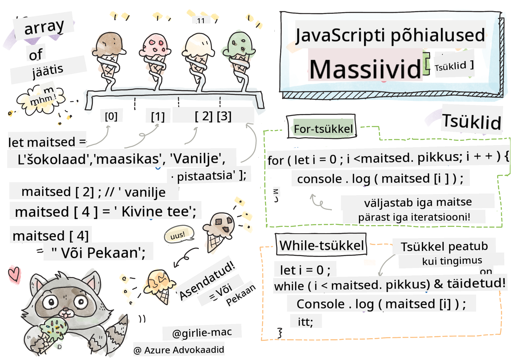

<!--
CO_OP_TRANSLATOR_METADATA:
{
  "original_hash": "9029f96b0e034839c1799f4595e4bb66",
  "translation_date": "2025-10-11T11:44:32+00:00",
  "source_file": "2-js-basics/4-arrays-loops/README.md",
  "language_code": "et"
}
-->
# JavaScript'i põhialused: massiivid ja tsüklid


> Sketchnote autor: [Tomomi Imura](https://twitter.com/girlie_mac)

## Loengu-eelne viktoriin
[Loengu-eelne viktoriin](https://ff-quizzes.netlify.app/web/quiz/13)

See õppetund käsitleb JavaScript'i põhialuseid, mis on veebilehtede interaktiivsuse aluseks. Selles õppetükis õpid tundma massiive ja tsükleid, mida kasutatakse andmete töötlemiseks.

[](https://youtube.com/watch?v=1U4qTyq02Xw "Massiivid")

[](https://www.youtube.com/watch?v=Eeh7pxtTZ3k "Tsüklid")

> 🎥 Klõpsa ülaltoodud piltidel, et vaadata videoid massiivide ja tsüklite kohta.

> Selle õppetunni leiad ka [Microsoft Learnist](https://docs.microsoft.com/learn/modules/web-development-101-arrays/?WT.mc_id=academic-77807-sagibbon)!

## Massiivid

Andmetega töötamine on igas programmeerimiskeeles tavaline ülesanne ja see on palju lihtsam, kui andmed on organiseeritud struktuursesse formaati, näiteks massiividesse. Massiivides salvestatakse andmed struktuuri, mis sarnaneb loendiga. Üks massiivide suur eelis on see, et ühes massiivis saab salvestada erinevat tüüpi andmeid.

✅ Massiivid on meie ümber kõikjal! Kas oskad mõelda mõnele päriselulisele massiivi näitele, näiteks päikesepaneelide massiiv?

Massiivi süntaksiks on paar nurksulge.

```javascript
let myArray = [];
```

See on tühi massiiv, kuid massiivid saab deklareerida ka juba andmetega täidetuna. Massiivis eraldatakse väärtused üksteisest komaga.

```javascript
let iceCreamFlavors = ["Chocolate", "Strawberry", "Vanilla", "Pistachio", "Rocky Road"];
```

Massiivi väärtustele määratakse unikaalne väärtus, mida nimetatakse **indeksiks** – täisarv, mis määratakse vastavalt kaugusele massiivi algusest. Ülaltoodud näites on stringiväärtuse "Chocolate" indeks 0 ja "Rocky Road" indeks on 4. Kasuta indeksit koos nurksulgudega, et massiivi väärtusi kätte saada, muuta või lisada.

✅ Kas sind üllatab, et massiivid algavad nullindeksist? Mõnes programmeerimiskeeles algavad indeksid 1-st. Sellel on huvitav ajalugu, mida saad [lugeda Wikipediast](https://en.wikipedia.org/wiki/Zero-based_numbering).

```javascript
let iceCreamFlavors = ["Chocolate", "Strawberry", "Vanilla", "Pistachio", "Rocky Road"];
iceCreamFlavors[2]; //"Vanilla"
```

Indeksit saab kasutada väärtuse muutmiseks, näiteks nii:

```javascript
iceCreamFlavors[4] = "Butter Pecan"; //Changed "Rocky Road" to "Butter Pecan"
```

Ja uue väärtuse lisamiseks kindlale indeksile nii:

```javascript
iceCreamFlavors[5] = "Cookie Dough"; //Added "Cookie Dough"
```

✅ Levinum viis väärtuste lisamiseks massiivi on kasutada massiivi operaatoreid, näiteks array.push().

Et teada saada, mitu elementi massiivis on, kasuta `length` omadust.

```javascript
let iceCreamFlavors = ["Chocolate", "Strawberry", "Vanilla", "Pistachio", "Rocky Road"];
iceCreamFlavors.length; //5
```

✅ Proovi ise! Loo ja muuda oma loodud massiivi oma brauseri konsoolis.

## Tsüklid

Tsüklid võimaldavad meil teha korduvaid või **iteratiivseid** ülesandeid, säästes sellega aega ja koodi. Iga iteratsioon võib erineda oma muutujate, väärtuste ja tingimuste poolest. JavaScript'is on erinevat tüüpi tsükleid, millel on väikesed erinevused, kuid mis sisuliselt teevad sama asja: kordavad andmeid.

### For-tsükkel

`for`-tsükkel vajab iteratsiooniks kolme osa:
- `counter` Muutuja, mis tavaliselt algab numbriga ja loendab iteratsioonide arvu
- `condition` Avaldis, mis kasutab võrdlusoperaatoreid, et tsükkel peatuks, kui see muutub `false`
- `iteration-expression` Käivitatakse iga iteratsiooni lõpus, tavaliselt kasutatakse loenduri väärtuse muutmiseks
  
```javascript
// Counting up to 10
for (let i = 0; i < 10; i++) {
  console.log(i);
}
```

✅ Käivita see kood brauseri konsoolis. Mis juhtub, kui teed loenduri, tingimuse või iteratsiooni avaldise osas väikeseid muudatusi? Kas saad selle panna tagurpidi töötama, luues tagasiloenduse?

### While-tsükkel

Erinevalt `for`-tsükli süntaksist vajavad `while`-tsüklid ainult tingimust, mis peatab tsükli, kui tingimus muutub `false`. Tsüklite tingimused sõltuvad tavaliselt teistest väärtustest, näiteks loenduritest, ja neid tuleb tsükli ajal hallata. Loendurite algväärtused tuleb luua väljaspool tsüklit ning kõik tingimuse täitmiseks vajalikud avaldised, sealhulgas loenduri muutmine, tuleb hallata tsükli sees.

```javascript
//Counting up to 10
let i = 0;
while (i < 10) {
 console.log(i);
 i++;
}
```

✅ Miks eelistaksid for-tsüklit while-tsüklile? 17 000 vaatajat on esitanud sama küsimuse StackOverflow's ja mõned arvamused [võivad sulle huvi pakkuda](https://stackoverflow.com/questions/39969145/while-loops-vs-for-loops-in-javascript).

## Tsüklid ja massiivid

Massiive kasutatakse sageli koos tsüklitega, sest enamik tingimusi vajab tsükli peatamiseks massiivi pikkust ja indeks võib olla ka loenduri väärtus.

```javascript
let iceCreamFlavors = ["Chocolate", "Strawberry", "Vanilla", "Pistachio", "Rocky Road"];

for (let i = 0; i < iceCreamFlavors.length; i++) {
  console.log(iceCreamFlavors[i]);
} //Ends when all flavors are printed
```

✅ Katseta oma loodud massiivi üle tsükli tegemist oma brauseri konsoolis.

---

## 🚀 Väljakutse

Massiivide üle tsükli tegemiseks on ka teisi viise peale for- ja while-tsüklite. Näiteks [forEach](https://developer.mozilla.org/docs/Web/JavaScript/Reference/Global_Objects/Array/forEach), [for-of](https://developer.mozilla.org/docs/Web/JavaScript/Reference/Statements/for...of) ja [map](https://developer.mozilla.org/docs/Web/JavaScript/Reference/Global_Objects/Array/map). Kirjuta oma massiivi tsükkel ümber, kasutades ühte neist tehnikatest.

## Loengu-järgne viktoriin
[Loengu-järgne viktoriin](https://ff-quizzes.netlify.app/web/quiz/14)

## Ülevaade ja iseseisev õppimine

JavaScript'i massiividel on palju meetodeid, mis on äärmiselt kasulikud andmete töötlemiseks. [Loe nende meetodite kohta](https://developer.mozilla.org/docs/Web/JavaScript/Reference/Global_Objects/Array) ja proovi mõnda neist (näiteks push, pop, slice ja splice) oma loodud massiivil.

## Ülesanne

[Massiivi tsükkel](assignment.md)

---

**Lahtiütlus**:  
See dokument on tõlgitud AI tõlketeenuse [Co-op Translator](https://github.com/Azure/co-op-translator) abil. Kuigi püüame tagada täpsust, palume arvestada, et automaatsed tõlked võivad sisaldada vigu või ebatäpsusi. Algne dokument selle algses keeles tuleks pidada autoriteetseks allikaks. Olulise teabe puhul soovitame kasutada professionaalset inimtõlget. Me ei vastuta selle tõlke kasutamisest tulenevate arusaamatuste või valesti tõlgenduste eest.