<!--
CO_OP_TRANSLATOR_METADATA:
{
  "original_hash": "1710a50a519a6e4a1b40a5638783018d",
  "translation_date": "2026-01-08T08:59:49+00:00",
  "source_file": "2-js-basics/4-arrays-loops/README.md",
  "language_code": "et"
}
-->
# JavaScript Põhitõed: Massiivid ja Tsüklid

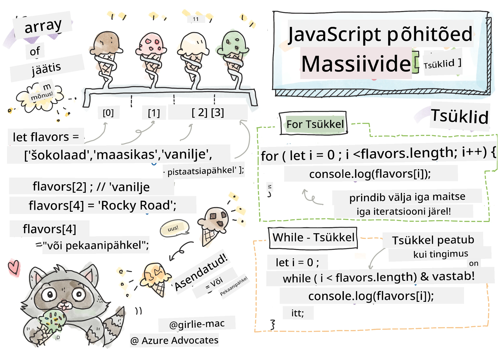
> Sketchnote autor [Tomomi Imura](https://twitter.com/girlie_mac)

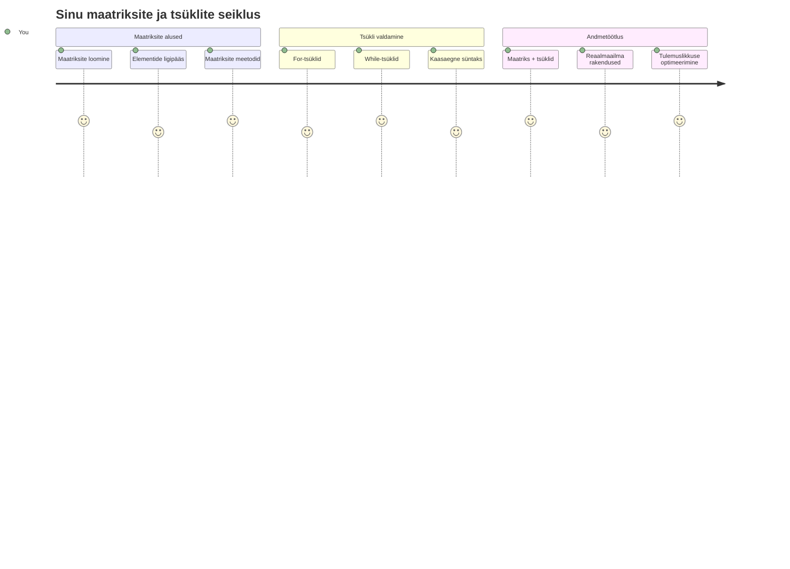
## Eel-loengu viktoriin
[Eel-loengu viktoriin](https://ff-quizzes.netlify.app/web/quiz/13)

Kas oled kunagi mõelnud, kuidas veebilehed hoiavad ostukorvi üksusi või kuvavad sinu sõprade nimekirja? Siin tulevad mängu massiivid ja tsüklid. Massiivid on nagu digitaalsed anumad, mis hoiavad mitut informatsioonitükki, samas kui tsüklid võimaldavad sul kõigi nende andmetega tõhusalt töötada ilma korduvalt koodi kirjutamata.

Need kaks kontseptsiooni moodustavad koos aluse info haldamiseks sinu programmides. Õpid liiguma käsitsi iga sammu välja kirjutamisest nutika ja tõhusa koodi loomisele, mis suudab kiiresti töödelda sadu või isegi tuhandeid elemente.

Selle tunni lõpuks mõistad, kuidas saavutada keerukaid andmetöötlusi vaid mõne koodireaga. Avastame need olulised programmeerimise mõisted.

[](https://youtube.com/watch?v=1U4qTyq02Xw "Arrays")

[](https://www.youtube.com/watch?v=Eeh7pxtTZ3k "Loops")

> 🎥 Vajuta ülalolevatele piltidele massiivide ja tsüklite videoteks.

> Selle tunni leiad ka [Microsoft Learn platvormilt](https://docs.microsoft.com/learn/modules/web-development-101-arrays/?WT.mc_id=academic-77807-sagibbon)!

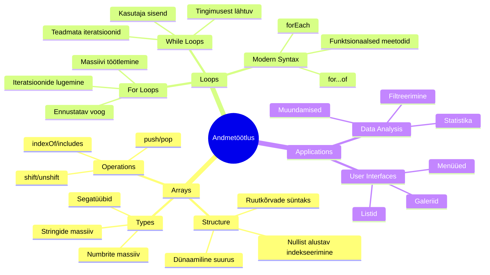
## Massiivid

Mõtle massiive kui digitaalsele dokumendikapisüsteemile - selle asemel, et hoida ühte dokumenti ühes sahtlis, saad paigutada mitu seotud eset ühte struktureeritud anumasse. Programmeerimise seisukohast võimaldab massiiv sul talletada mitmeid informatsiooni tükke ühes organiseeritud pakendis.

Olgu tegemist fotogaleriiga, ülesannete nimekirja haldamise või mängu kõrgete tulemuste jälgimisega – massiivid annavad andmete organiseerimise aluse. Vaatame, kuidas need töötavad.

✅ Massiivid on kõikjal meie ümber! Kas suudad mõelda reaalset näidet massiivile, nagu näiteks päikesepaneelide ansambel?

### Massiivide loomine

Massiivi loomine on väga lihtne – kasuta lihtsalt nurksulgusid!

```javascript
// Tühi massiiv - nagu tühi ostukorv, mis ootab esemeid
const myArray = [];
```

**Mis siin toimub?**
Oled just loonud tühja anuma, kasutades neid nurksulgusid `[]`. Mõtle sellele nagu tühjale raamatukapi riiulile – see on valmis hoidma kõiki raamatuid, mida soovid seal organiseerida.

Samuti võid algväärtustega massiivi täita kohe alguses:

```javascript
// Teie jäätisepoe maitsete menüü
const iceCreamFlavors = ["Chocolate", "Strawberry", "Vanilla", "Pistachio", "Rocky Road"];

// Kasutaja profiili info (erinevate andmetüüpide segamine)
const userData = ["John", 25, true, "developer"];

// Teie lemmikkursuse testitulemused
const scores = [95, 87, 92, 78, 85];
```

**Huviäratavad punktid:**
- Saad hoida samas massiivis teksti, numbreid või isegi tõene/väär väärtusi
- Eralda iga element koma abil – lihtne!
- Massiivid on ideaalsed seotud info kokkuhoidmiseks

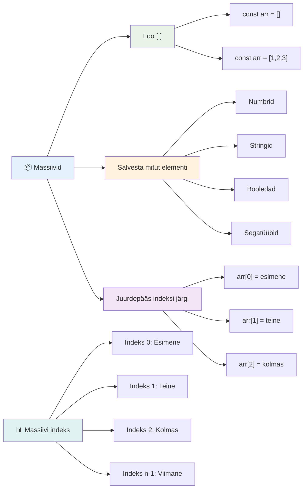
### Massiivi indeksimine

Siin on miskit, mis esialgu võib tunduda ebatavaline: massiivid nummerdavad oma elemendid alates nullist, mitte ühest. See nullipõhine indekseerimine tuleneb sellest, kuidas arvutimälu töötab – see on olnud programmeerimiskonventsioon juba arvutikeelte algusaegadest, nagu C keel. Iga massiivi koht saab enda aadressi numbri, mida nimetatakse **indeksiks**.

| Indeks | Väärtus | Kirjeldus |
|-------|---------|-----------|
| 0 | "Šokolaad" | Esimene element |
| 1 | "Maasikas" | Teine element |
| 2 | "Vannill" | Kolmas element |
| 3 | "Pistaatsia" | Neljas element |
| 4 | "Rocky Road" | Viies element |

✅ Kas sind üllatab, et massiivid algavad nullindeksist? Mõnes programmeerimiskeeles algavad indeksid ühest. Sellel on joon päris huvitavat ajalugu, mille kohta saad lugeda [Wikipedia artiklist](https://en.wikipedia.org/wiki/Zero-based_numbering).

**Massiivi elementidele ligipääs:**

```javascript
const iceCreamFlavors = ["Chocolate", "Strawberry", "Vanilla", "Pistachio", "Rocky Road"];

// Juurdepääs üksikutele elementidele sulgude märgistuse abil
console.log(iceCreamFlavors[0]); // "Šokolaad" - esimene element
console.log(iceCreamFlavors[2]); // "Vanilje" - kolmas element
console.log(iceCreamFlavors[4]); // "Rocky Road" - viimane element
```

**Mis siin toimub:**
- **Kasutab** nurksulgusid koos indeksi numbriga elementide kättesaamiseks
- **Tagastab** selle konkreetse positsiooniga seotud väärtuse
- **Loendab** algusest nullist, muutes esimese elemendi indeksiks 0

**Massiivi elementide muutmine:**

```javascript
// Muuda olemasolevat väärtust
iceCreamFlavors[4] = "Butter Pecan";
console.log(iceCreamFlavors[4]); // "Võipähkel"

// Lisa uus element lõppu
iceCreamFlavors[5] = "Cookie Dough";
console.log(iceCreamFlavors[5]); // "Küpsisetainas"
```

**Ülaltoodud näites:**
- **Muudeti** 4. indeksil olev element "Rocky Road" -> "Butter Pecan"
- **Lisati** uus element "Cookie Dough" 5. indeksile
- **Pikendas** automaatselt massiivi pikkust, kui lisada väljaspool praegust vahemikku

### Massiivi pikkus ja sagedased meetodid

Massiivid sisaldavad sisseehitatud omadusi ja meetodeid, mis aitavad andmetega tööd palju lihtsamaks teha.

**Massiivi pikkuse leidmine:**

```javascript
const iceCreamFlavors = ["Chocolate", "Strawberry", "Vanilla", "Pistachio", "Rocky Road"];
console.log(iceCreamFlavors.length); // 5

// Pikkus uuendub automaatselt, kui massiiv muutub
iceCreamFlavors.push("Mint Chip");
console.log(iceCreamFlavors.length); // 6
```

**Olulised punktid:**
- **Tagastab** massiivi elementide koguarvu
- **Uuendab** automaatselt elementide lisamisel või eemaldamisel
- **Pakkub** dünaamilist arvu, mis sobib tsüklite ja kontrollide jaoks

**Olulised massiivi meetodid:**

```javascript
const fruits = ["apple", "banana", "orange"];

// Lisa elemendid
fruits.push("grape");           // Lisab lõppu: ["õun", "banaan", "apelsin", "viinamari"]
fruits.unshift("strawberry");   // Lisab algusse: ["maasikas", "õun", "banaan", "apelsin", "viinamari"]

// Eemalda elemendid
const lastFruit = fruits.pop();        // Eemaldab ja tagastab "viinamari"
const firstFruit = fruits.shift();     // Eemaldab ja tagastab "maasikas"

// Leia elemendid
const index = fruits.indexOf("banana"); // Tagastab 1 (positsioon "banaanil")
const hasApple = fruits.includes("apple"); // Tagastab tõene
```

**Nende meetodite mõistmine:**
- **Lisa** elemente `push()` (lõppu) ja `unshift()` (alguses)
- **Eemalda** elemente `pop()` (lõpp) ja `shift()` (algus)
- **Leia** elemente `indexOf()` abil ja kontrolli olemasolu `includes()` abil
- **Tagastab** kasulikke väärtusi, nagu eemaldatud elemendid või positsioonide indeksid

✅ Proovi ise! Kasuta oma brauseri konsooli, et luua ja muuta oma massiivi.

### 🧠 **Massiivi põhiteadmiste kontroll: Andmete organiseerimine**

**Testi oma massiivi mõistmist:**
- Miks, sinu arvates, loendavad massiivid elemente nullist, mitte ühest?
- Mis juhtub, kui püüad juurde pääseda indeksile, mis puudub (nt `arr[100]` 5-elemendilises massiivis)?
- Kas suudad välja mõelda kolm päriselulist olukorda, kus massiivid on kasulikud?

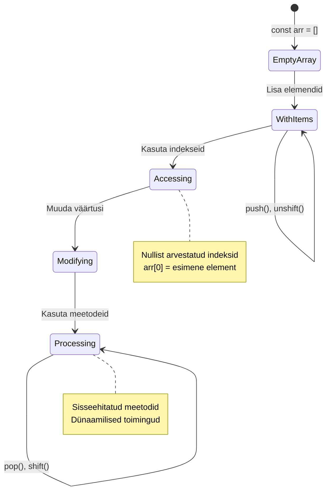
> **Reaalne vaatekoht**: Massiivid on programmeerimises kõikjal! Sotsiaalmeedia uudisvood, ostukorvid, fotogaleriid, muusikapleilistides olevad laulud – kõik on tegelikult massiivid!

## Tsüklid

Mõtle Charles Dickensi romaanidesse tuntud karistusele, kus õpilased pidid korduvalt tahvlile lauseid kirjutama. Kujuta ette, et saaksid lihtsalt käsu anda: "kirjuta see lause 100 korda," ja see saab automaatselt tehtud. Just nii töötavad tsüklid sinu koodis.

Tsüklid on nagu väsimatu assistent, kes saab ülesandeid korduvalt ja veatult täita. Olgu vajadus vaadata üle iga ostukorvi element või kuvada kõik albumi pildid – tsüklid juhivad korduval tegevusel tõhusalt.

JavaScript pakub mitu erinevat tsükli tüüpi. Vaatame igaüht ja mõistame, millal neid kasutada.

```mermaid
flowchart TD
    A["🔄 Silmuste tüübid"] --> B["For-tsükkel"]
    A --> C["While-tsükkel"]
    A --> D["For...of-tsükkel"]
    A --> E["forEach meetod"]
    
    B --> B1["Tuntud kordused"]
    B --> B2["Loenduril põhinev"]
    B --> B3["for(init; condition; increment)"]
    
    C --> C1["Tundmatud kordused"]
    C --> C2["Tingimusel põhinev"]
    C --> C3["while(condition)"]
    
    D --> D1["Moodne ES6+"]
    D --> D2["Massiivi iteratsioon"]
    D --> D3["for(item of array)"]
    
    E --> E1["Funktsionaalne stiil"]
    E --> E2["Massiivi meetod"]
    E --> E3["array.forEach(callback)"]
    
    F["⏰ Millal kasutada"] --> F1["For: Lugemine, indeksid"]
    F --> F2["While: Kasutaja sisend, otsimine"]
    F --> F3["For...of: Lihtne iteratsioon"]
    F --> F4["forEach: Funktsionaalne programmeerimine"]
    
    style A fill:#e3f2fd
    style B fill:#e8f5e8
    style C fill:#fff3e0
    style D fill:#f3e5f5
    style E fill:#e0f2f1
    style F fill:#fce4ec
```
### For-tsükkel

`for` tsükkel on nagu taimeri sisselülitamine – sa tead täpselt, mitu korda midagi teha tahad. See on väga organiseeritud ja ettearvatav, mis teeb selle ideaalseks massiividega töötamisel või kui pead midagi lugema.

**For-tsükli struktuur:**

| Komponent | Eesmärk | Näide |
|-----------|---------|--------|
| **Initsialiseerimine** | Alguspunkti määramine | `let i = 0` |
| **Tingimus** | Millal jätkata | `i < 10` |
| **Inkrement** | Kuidas uuendada | `i++` |

```javascript
// Loendamine nullist üheksani
for (let i = 0; i < 10; i++) {
  console.log(`Count: ${i}`);
}

// Praktilisem näide: skooride töötlemine
const testScores = [85, 92, 78, 96, 88];
for (let i = 0; i < testScores.length; i++) {
  console.log(`Student ${i + 1}: ${testScores[i]}%`);
}
```

**Samm-sammult, siin toimub:**
- **Initsialiseerib** loendurimuutuja `i` väärtusega 0 alguses
- **Kontrollib** tingimust `i < 10` iga iteratsiooni eel
- **Täidab** koodiploki, kui tingimus on tõene
- **Suurendab** `i` ühe võrra pärast iga iteratsiooni `i++` abil
- **Lõpetab**, kui tingimus muutub vääraks (kui `i` jõuab 10-ni)

✅ Käivita see kood brauseri konsoolis. Mis juhtub, kui teed väikseid muudatusi loenduris, tingimuses või iteratsiooniväljendis? Kas saad panna tsükli töötama tagurpidi, luues loendamise allapoole?

### 🗓️ **For-tsükli oskuslikkus: Kontrollitud kordused**

**Hinda oma for-tsükli arusaamist:**
- Millest koosneb for-tsükkel ja mida iga osa teeb?
- Kuidas teha tagurpidi massiivilist läbitöötamist?
- Mis juhtub, kui unustad inkrementosa (`i++`)?

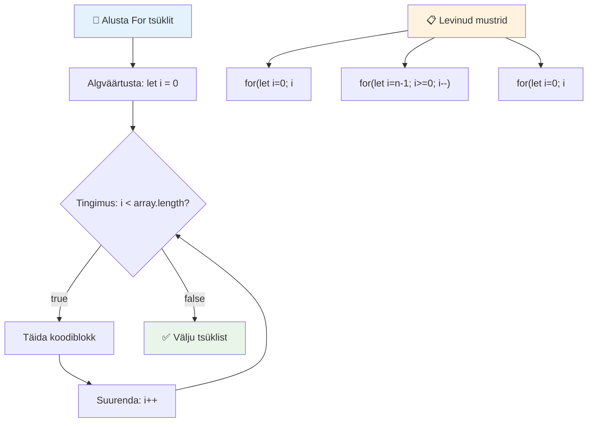
> **Tsükli tarkus**: For-tsüklid on ideaalsed, kui tead täpselt, mitu korda tegevust korrata peab. Need on kõige tavalisem valik massiivide töötlemiseks!

### While-tsükkel

`while` tsükkel on nagu öelda "tee seda seni, kuni…" – sa ei pruugi täpselt teada, mitu korda see toimub, aga tead, millal lõpetada. Sobib hästi olukordadeks, kus kasutajalt küsitakse sisendit seni, kuni õige vastus saab, või otsitakse andmeid kuni vajalik leitakse.

**While-tsükli omadused:**
- **Jätkab** täitmist seni, kuni tingimus on tõene
- **Nõuab** käsitsi loendurimuutujate haldamist
- **Kontrollib** tingimust enne iga iteratsiooni
- **Oht** lõpmatute tsüklite tekkeks, kui tingimus ei muutu vääraks

```javascript
// Lihtne lugemise näide
let i = 0;
while (i < 10) {
  console.log(`While count: ${i}`);
  i++; // Ära unusta suurendada!
}

// Praktilisem näide: kasutaja sisendi töötlemine
let userInput = "";
let attempts = 0;
const maxAttempts = 3;

while (userInput !== "quit" && attempts < maxAttempts) {
  userInput = prompt(`Enter 'quit' to exit (attempt ${attempts + 1}):`);
  attempts++;
}

if (attempts >= maxAttempts) {
  console.log("Maximum attempts reached!");
}
```

**Näidete mõistmine:**
- **Halda** loendurimuutujat `i` käsitsi tsükli sees
- **Suurendab** loendurit, et vältida lõpmatuid tsükleid
- **Näitab** praktilist kasutust kasutaja sisendi ja katsete piiranguga
- **Sisaldab** ohutusmehhanisme, et vältida lõpmatut täitmist

### ♾️ **While-tsükli tarkuse kontroll: Tingimusel põhinev kordus**

**Testi oma while-tsükli mõistmist:**
- Mis on peamine oht while-tsüklite kasutamisel?
- Millal eelistad while-tsüklit for-tsüklile?
- Kuidas saab vältida lõpmatuid tsükleid?

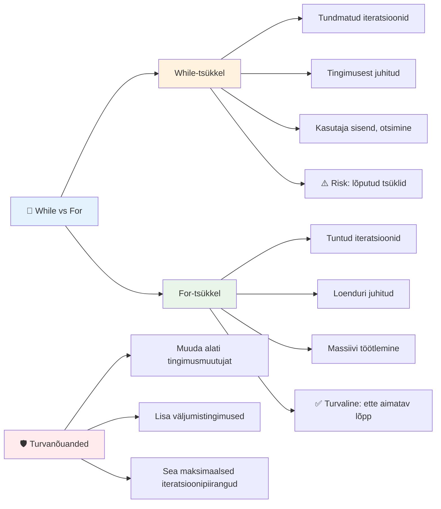
> **Ohutus ennekõike**: While-tsüklid on võimsad, aga nõuavad hoolikat tingimuste juhtimist. Veendu alati, et su tingimus lõpuks vääraks muutub!

### Moodsa tsükli alternatiivid

JavaScript pakub moodsat tsükli süntaksit, mis teeb koodi lugemise lihtsamaks ja vigade tekkimise vähem tõenäoliseks.

**For...of tsükkel (ES6+):**

```javascript
const colors = ["red", "green", "blue", "yellow"];

// Kaasaegne lähenemine - puhtam ja turvalisem
for (const color of colors) {
  console.log(`Color: ${color}`);
}

// Võrdle traditsioonilise for-tsükliga
for (let i = 0; i < colors.length; i++) {
  console.log(`Color: ${colors[i]}`);
}
```

**Peamised eelised `for...of`:**
- **Vabastab** indeksi haldamisest ja võimaliku ühe võrra valesti lugemise vigadest
- **Tagab** otsese ligipääsu massiivi elementidele
- **Parandab** koodi loetavust ja vähendab süntaksivigu

**forEach meetod:**

```javascript
const prices = [9.99, 15.50, 22.75, 8.25];

// Kasutades forEach funktsionaalse programmeerimise stiili jaoks
prices.forEach((price, index) => {
  console.log(`Item ${index + 1}: $${price.toFixed(2)}`);
});

// forEach noolefunktsioonidega lihtsate toimingute jaoks
prices.forEach(price => console.log(`Price: $${price}`));
```

**Mida forEach kohta teada:**
- **Täidab** funktsiooni iga massiivi elemendi jaoks
- **Annetab** väärtuse ja indeksi parameetritena
- **Ei saa** tsüklit keset katkestada (erinevalt tavapärastest tsüklitest)
- **Tagastab** undefined (ei loo uut massiivi)

✅ Miks eelistaksid for tsüklit while-tsüklile? 17 000 inimest küsis sama StackOverflow’s ja mõned arvamused võivad olla huvitavad [sulle](https://stackoverflow.com/questions/39969145/while-loops-vs-for-loops-in-javascript).

### 🎨 **Moodsa tsükli süntaksi kontroll: ES6+ omaksvõtt**

**Hinda oma kaasaegse JavaScripti mõistmist:**
- Millised on `for...of` eelised tavapäraste for-tsüklite ees?
- Millal eelistaksid ikka tavapäraseid for-tsükleid?
- Mis vahe on `forEach` ja `map` vahel?

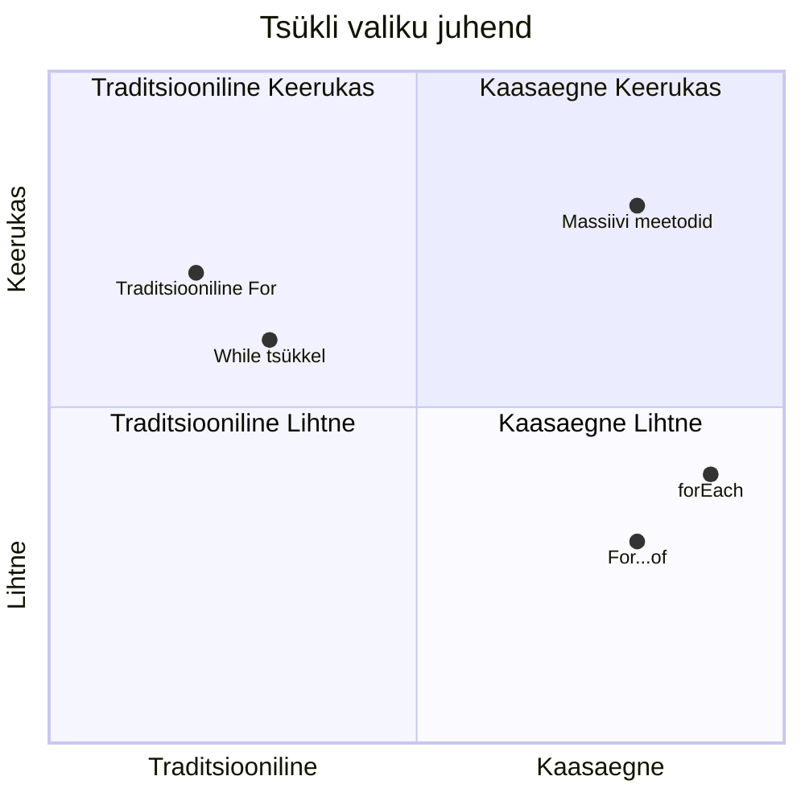
> **Moodne trend**: ES6+ süntaks nagu `for...of` ja `forEach` muutuvad eelistatud massiiviläbivaadeteks, sest need on puhtamad ja vähem vigadele kalduvad!

## Tsüklid ja massiivid

Massiivide ja tsüklite kombineerimine loob võimsad andmetöötluse võimalused. See paar on paljude programmeerimiste ülesannete alus, alates nimekirjade kuvamisest kuni statistika arvutamiseni.

**Traditsiooniline massiivide töötlemine:**

```javascript
const iceCreamFlavors = ["Chocolate", "Strawberry", "Vanilla", "Pistachio", "Rocky Road"];

// Klassikaline for-tsükli meetod
for (let i = 0; i < iceCreamFlavors.length; i++) {
  console.log(`Flavor ${i + 1}: ${iceCreamFlavors[i]}`);
}

// Kaasaegne for...of meetod
for (const flavor of iceCreamFlavors) {
  console.log(`Available flavor: ${flavor}`);
}
```

**Mõistame iga lähenemist:**
- **Kasutab** massiivi pikkuse omadust tsükli piiri määramiseks
- **Ligipääseb** elementidele indeksi kaudu tavapärastes for-tsüklites
- **Tagab** otsese ligipääsu for...of tsüklites
- **Töötab** iga massiivi elemendiga täpselt üks kord

**Praktiline andmetöötluse näide:**

```javascript
const studentGrades = [85, 92, 78, 96, 88, 73, 89];
let total = 0;
let highestGrade = studentGrades[0];
let lowestGrade = studentGrades[0];

// Töötle kõiki hinnetega ühe tsükliga
for (let i = 0; i < studentGrades.length; i++) {
  const grade = studentGrades[i];
  total += grade;
  
  if (grade > highestGrade) {
    highestGrade = grade;
  }
  
  if (grade < lowestGrade) {
    lowestGrade = grade;
  }
}

const average = total / studentGrades.length;
console.log(`Average: ${average.toFixed(1)}`);
console.log(`Highest: ${highestGrade}`);
console.log(`Lowest: ${lowestGrade}`);
```

**Kuidas see kood töötab:**
- **Initsialiseerib** muutujad summa ja ekstreemidega jälgimiseks
- **Töötleb** iga hinnet ühe efektiivse tsükliga
- **Kogub** kokku summa keskmise arvutamiseks
- **Jälgib** tsükli käigus kõrgeimat ja madalaimat väärtust
- **Arvutab** lõplikud statistilised näitajad pärast tsükli lõppu

✅ Proovi oma brauseri konsoolis tsüklit kohandada enda loodud massiiviga.

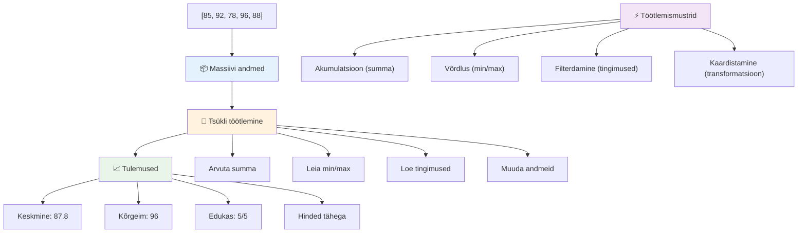
---

## GitHub Copilot Agendi Väljakutse 🚀

Kasuta Agendi režiimi, et lahendada järgmine ülesanne:

**Kirjeldus:** Loo terviklik andmetöötluse funktsioon, mis ühendab massiivid ja tsüklid andmestiku analüüsimiseks ning mõtestatud järelduste tegemiseks.

**Üleskutse:** Loo funktsioon nimega `analyzeGrades`, mis võtab sisendiks massiivi õpilaste hinnetest objektidega (igaühel omadused name ja score) ning tagastab objekti statistikaga, sealhulgas kõrgeim hinne, madalaim hinne, keskmine hinne, sooritajate arv (hinded >=70) ning massiivi õpilaste nimedega, kes jäid keskmisest kõrgemale. Kasuta kindlasti kahte erinevat tsükli tüüpi lahenduses.

Lisainfo agenti režiimi kohta leiad siit: [agent mode](https://code.visualstudio.com/blogs/2025/02/24/introducing-copilot-agent-mode).

## 🚀 Väljakutse
JavaScript pakub mitmeid kaasaegseid massiivimeetodeid, mis võivad asendada traditsioonilisi tsükleid konkreetsete ülesannete jaoks. Uurige [forEach](https://developer.mozilla.org/docs/Web/JavaScript/Reference/Global_Objects/Array/forEach), [for-of](https://developer.mozilla.org/docs/Web/JavaScript/Reference/Statements/for...of), [map](https://developer.mozilla.org/docs/Web/JavaScript/Reference/Global_Objects/Array/map), [filter](https://developer.mozilla.org/docs/Web/JavaScript/Reference/Global_Objects/Array/filter) ja [reduce](https://developer.mozilla.org/docs/Web/JavaScript/Reference/Global_Objects/Array/reduce).

**Teie väljakutse:** Parandage üliõpilaste hinnete näidet, kasutades vähemalt kolme erinevat massiivimeetodit. Pange tähele, kui palju puhtam ja loetavam kood kaasajastatud JavaScripti süntaksiga muutub.

## Loengu järgse test

[Loengu järgse testi link](https://ff-quizzes.netlify.app/web/quiz/14)


## Kordamine ja iseseisev õppimine

JavaScripti massiividel on palju meetodeid, mis on väga kasulikud andmete manipuleerimiseks. [Lugege neist meetoditest](https://developer.mozilla.org/docs/Web/JavaScript/Reference/Global_Objects/Array) ja proovige mõnda neist (nagu push, pop, slice ja splice) oma loodud massiivil.

## Kodune ülesanne

[Massiivi tsüklisse võtmine](assignment.md)

---

## 📊 **Teie massiivide ja tsüklite tööriistakasti kokkuvõte**

```mermaid
graph TD
    A["🎯 Massiivide ja tsüklite valdamine"] --> B["📦 Massiivi põhialused"]
    A --> C["🔄 Tsükli tüübid"]
    A --> D["🔗 Andmetöötlus"]
    A --> E["🎨 Kaasaegsed tehnikad"]
    
    B --> B1["Loomine: [ ]"]
    B --> B2["Indekseerimine: arr[0]"]
    B --> B3["Meetodid: push, pop"]
    B --> B4["Omandid: pikkus"]
    
    C --> C1["For: teada korduste arv"]
    C --> C2["While: tingimusel põhinev"]
    C --> C3["For...of: otsene ligipääs"]
    C --> C4["forEach: funktsionaalne"]
    
    D --> D1["Statistika arvutamine"]
    D --> D2["Andmete teisendamine"]
    D --> D3["Filtreerimine ja otsing"]
    D --> D4["Reaalajas töötlemine"]
    
    E --> E1["Noolefunktsioonid"]
    E --> E2["Meetodite ahelad"]
    E --> E3["Destruktureerimine"]
    E --> E4["Mallitekstid"]
    
    F["💡 Peamised eelised"] --> F1["Tõhus andmetöötlus"]
    F --> F2["Koodikorduste vähendamine"]
    F --> F3["Laiendatavad lahendused"]
    F --> F4["Puhtam süntaks"]
    
    style A fill:#e3f2fd
    style B fill:#e8f5e8
    style C fill:#fff3e0
    style D fill:#f3e5f5
    style E fill:#e0f2f1
    style F fill:#fce4ec
```
---

## 🚀 Teie massiivide ja tsüklite valdamise ajajoon

### ⚡ **Mida saate järgmise 5 minutiga teha**
- [ ] Looge massiiv oma lemmikfilmidega ja hankige konkreetseid elemente
- [ ] Kirjutage for-tsükkel, mis loendab 1-st kuni 10-ni
- [ ] Proovige õppetunni kaasaegseid massiivimeetodeid
- [ ] Harjutage massiivi indeksite kasutamist brauseri konsoolis

### 🎯 **Mida saate selle tunni jooksul saavutada**
- [ ] Täitke pärast õppetundi test ja vaadake üle raskemad mõisted
- [ ] Koostage põhjalik hindeanalüsaator GitHub Copiloti väljakutse põhjal
- [ ] Looge lihtne ostukorv, kuhu lisate ja kustutate tooteid
- [ ] Harjutage konverteerimist erinevate tsükli tüüpide vahel
- [ ] Katsetage massiivimeetodeid nagu `push`, `pop`, `slice` ja `splice`

### 📅 **Teie nädalakestev andmetöötluse teekond**
- [ ] Täitke "Massiivi tsüklisse võtmine" ülesanne loovate täiustustega
- [ ] Koostage ülesannete nimekirja rakendus, kasutades massiive ja tsükleid
- [ ] Looge lihtne statistika kalkulaator numbrilistele andmetele
- [ ] Harjutage [MDN massiivimeetoditega](https://developer.mozilla.org/docs/Web/JavaScript/Reference/Global_Objects/Array)
- [ ] Koostage fotogalerii või muusikapleieri liides
- [ ] Avastage funktsionaalset programmeerimist `map`, `filter` ja `reduce` abil

### 🌟 **Teie kuuajaline areng**
- [ ] Valdage edasijõudnud massiivitegevusi ja jõudluse optimeerimist
- [ ] Koostage täielik andmete visualiseerimise juhtpaneel
- [ ] Panustage avatud lähtekoodiga andmetöötlusprojektidesse
- [ ] Õpetage kedagi teist massiive ja tsükleid praktiliste näidetega
- [ ] Looge isiklik kogu taaskasutatavatest andmetöötluse funktsioonidest
- [ ] Avastage algoritme ja andmestruktuure massiivide põhjal

### 🏆 **Lõplik andmetöötluse meistri kontroll**

**Tähistage oma massiivide ja tsüklite valdamist:**
- Milline massiivitehe on teie arvates reaalmaailma rakendustes kõige kasulikum?
- Milline tsüklitüüp tundub teile kõige loomulikum ja miks?
- Kuidas on massiivide ja tsüklite mõistmine muutnud teie lähenemist andmete korraldamisele?
- Millist keerukat andmetöötluse ülesannet soovite järgmiseks lahendada?

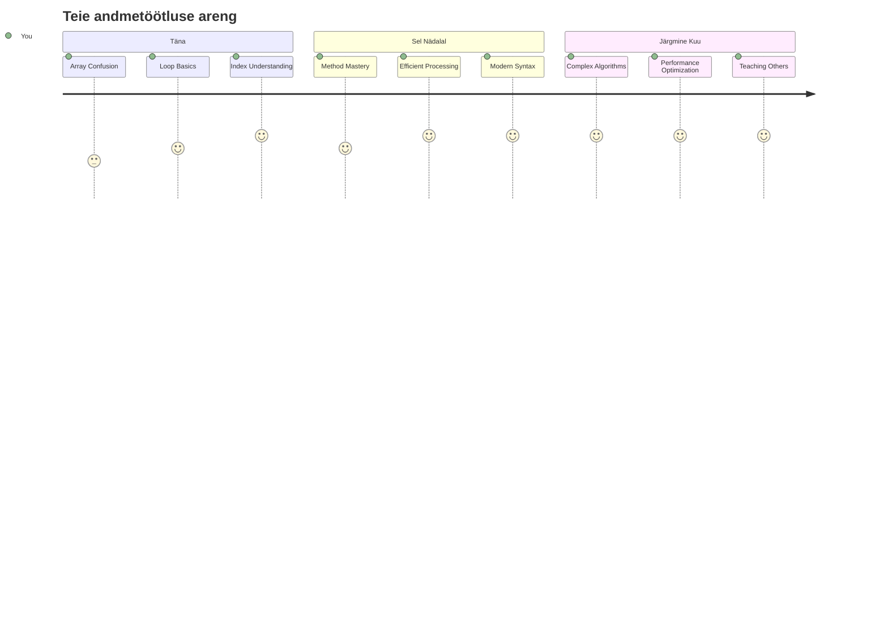
> 📦 **Olete avanud andmete korraldamise ja töötlemise jõu!** Massiivid ja tsüklid on aluseks peaaegu kõigile rakendustele, mida kunagi ehitate. Lihtsatest loenditest keeruka andmeanalüüsini on teil nüüd tööriistad informatsiooni tõhusaks ja elegantsuseks käsitlemiseks. Iga dünaamiline veebisait, mobiilirakendus ja andmepõhine rakendus tugineb neile põhikontseptsioonidele. Tere tulemast skaleeritava andmetöötluse maailma! 🎉

---

<!-- CO-OP TRANSLATOR DISCLAIMER START -->
**Vastutusest loobumine**:
See dokument on tõlgitud AI-tõlketeenuse [Co-op Translator](https://github.com/Azure/co-op-translator) abil. Kuigi püüame täpsust, tuleb arvestada, et automaatsed tõlked võivad sisaldada vigu või ebatäpsusi. Originaaldokument selle emakeeles tuleks pidada autoriteetseks allikaks. Tähtsa teabe puhul soovitame kasutada professionaalse inimtõlke teenust. Me ei vastuta võimalike arusaamatuste või tõlgenduste eest, mis võivad tekkida selle tõlke kasutamise tõttu.
<!-- CO-OP TRANSLATOR DISCLAIMER END -->