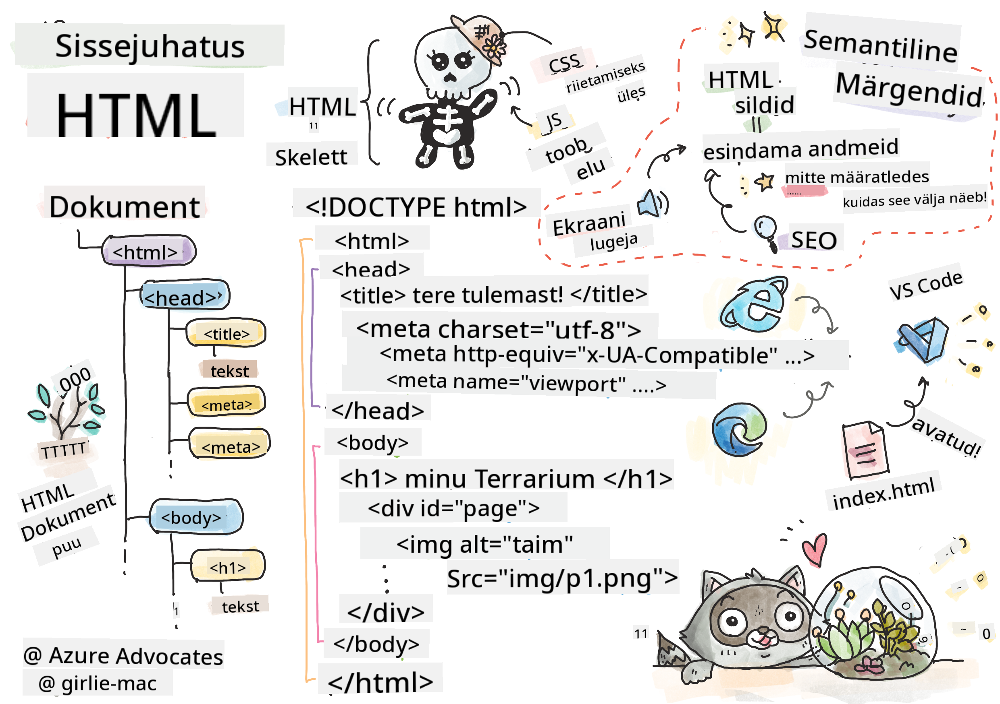
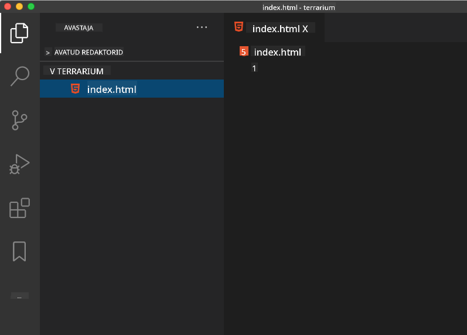

<!--
CO_OP_TRANSLATOR_METADATA:
{
  "original_hash": "89f7f9f800ce7c9f149e98baaae8491a",
  "translation_date": "2025-10-11T11:59:50+00:00",
  "source_file": "3-terrarium/1-intro-to-html/README.md",
  "language_code": "et"
}
-->
# Terrariumiprojekt, 1. osa: Sissejuhatus HTML-i


> Sketchnote autorilt [Tomomi Imura](https://twitter.com/girlie_mac)

## Loengu-eelne viktoriin

[Loengu-eelne viktoriin](https://ff-quizzes.netlify.app/web/quiz/15)


> Vaata videot

> 
> [](https://www.youtube.com/watch?v=1TvxJKBzhyQ)

### Sissejuhatus

HTML ehk HyperText Markup Language on veebilehe "skelett". Kui CSS "riietab" HTML-i ja JavaScript toob selle ellu, siis HTML on veebirakenduse keha. HTML-i süntaks peegeldab seda ideed, sisaldades "head", "body" ja "footer" silte.

Selles õppetükis kasutame HTML-i, et luua virtuaalse terrariumi liidese "skelett". Sellel on pealkiri ja kolm veergu: paremal ja vasakul veerus asuvad lohistatavad taimed ning keskel ala, mis kujutab klaasist terrariumi. Õppetüki lõpuks näete taimi veergudes, kuid liides näeb välja veidi kummaline; ärge muretsege, järgmises osas lisate CSS-i stiilid, et liides paremini välja näeks.

### Ülesanne

Looge oma arvutis kaust nimega 'terrarium' ja selle sees fail nimega 'index.html'. Seda saab teha Visual Studio Code'is, avades uue VS Code'i akna, klõpsates 'open folder' ja navigeerides oma uude kausta. Klõpsake Explorer paneelil väikest 'file' nuppu ja looge uus fail:



Või

Kasutage neid käske oma git bashis:
* `mkdir terrarium`
* `cd terrarium`
* `touch index.html`
* `code index.html` või `nano index.html`

> index.html failid näitavad brauserile, et see on kausta vaikimisi fail; URL-id nagu `https://anysite.com/test` võivad olla üles ehitatud kaustastruktuuri abil, mis sisaldab kausta nimega `test` ja selle sees `index.html`; `index.html` ei pea URL-is ilmuma.

---

## DocType ja html sildid

HTML-faili esimene rida on selle doctype. On veidi üllatav, et see rida peab olema faili kõige ülemises osas, kuid see ütleb vanematele brauseritele, et leht tuleb renderdada standardrežiimis, järgides praegust HTML-i spetsifikatsiooni.

> Näpunäide: VS Code'is saate sildi kohal hõljuda ja saada teavet selle kasutamise kohta MDN Reference juhenditest.

Teine rida peaks olema `<html>` sildi avamissilt, millele järgneb selle sulgemissilt `</html>`. Need sildid on teie liidese juurelemendid.

### Ülesanne

Lisage need read oma `index.html` faili ülaossa:

```HTML
<!DOCTYPE html>
<html></html>
```

✅ DocType'i määramisega päringustringi abil saab määrata erinevaid režiime: [Quirks Mode ja Standards Mode](https://developer.mozilla.org/docs/Web/HTML/Quirks_Mode_and_Standards_Mode). Need režiimid toetasid väga vanu brausereid, mida tänapäeval tavaliselt ei kasutata (Netscape Navigator 4 ja Internet Explorer 5). Võite jääda standardse doctype deklaratsiooni juurde.

---

## Dokumendi 'head'

HTML-dokumendi 'head' ala sisaldab olulist teavet teie veebilehe kohta, mida tuntakse ka kui [metaandmed](https://developer.mozilla.org/docs/Web/HTML/Element/meta). Meie puhul edastame veebiserverile, kuhu see leht renderdamiseks saadetakse, järgmised neli asja:

-   lehe pealkiri
-   lehe metaandmed, sealhulgas:
    -   'character set', mis näitab, millist märgistikku lehel kasutatakse
    -   brauseri teave, sealhulgas `x-ua-compatible`, mis näitab, et IE=edge brauserit toetatakse
    -   teave selle kohta, kuidas vaateaken peaks käituma, kui see laaditakse. Vaateakna seadmine algtasemele 1 kontrollib suumi taset, kui leht esmakordselt laaditakse.

### Ülesanne

Lisage 'head' plokk oma dokumendile `<html>` siltide vahele.

```html
<head>
	<title>Welcome to my Virtual Terrarium</title>
	<meta charset="utf-8" />
	<meta http-equiv="X-UA-Compatible" content="IE=edge" />
	<meta name="viewport" content="width=device-width, initial-scale=1" />
</head>
```

✅ Mis juhtuks, kui määraksite vaateakna meta sildi selliselt: `<meta name="viewport" content="width=600">`? Lugege rohkem [vaateakna](https://developer.mozilla.org/docs/Web/HTML/Viewport_meta_tag) kohta.

---

## Dokumendi `body`

### HTML-sildid

HTML-is lisate oma .html faili sildid, et luua veebilehe elemente. Igal sildil on tavaliselt avamis- ja sulgemissilt, näiteks: `<p>hello</p>` tähistamaks lõiku. Looge oma liidese keha, lisades `<body>` sildid `<html>` siltide paari sisse; teie märgistus näeb nüüd välja selline:

### Ülesanne

```html
<!DOCTYPE html>
<html>
	<head>
		<title>Welcome to my Virtual Terrarium</title>
		<meta charset="utf-8" />
		<meta http-equiv="X-UA-Compatible" content="IE=edge" />
		<meta name="viewport" content="width=device-width, initial-scale=1" />
	</head>
	<body></body>
</html>
```

Nüüd saate hakata oma lehte üles ehitama. Tavaliselt kasutatakse `<div>` silte, et luua lehe eraldi elemente. Loome rea `<div>` elemente, mis sisaldavad pilte.

### Pildid

Üks HTML-silt, mis ei vaja sulgemissilti, on `` silt, kuna sellel on `src` element, mis sisaldab kogu teavet, mida leht vajab elemendi renderdamiseks.

Looge oma rakenduses kaust nimega `images` ja lisage sinna kõik pildid [lähtekoodi kaustast](../../../../3-terrarium/solution/images); (seal on 14 taimepilti).

### Ülesanne

Lisage need taimepildid kahe veeru vahele `<body></body>` siltide sees:

```html
<div id="page">
	<div id="left-container" class="container">
		<div class="plant-holder">
			
		</div>
		<div class="plant-holder">
			
		</div>
		<div class="plant-holder">
			
		</div>
		<div class="plant-holder">
			
		</div>
		<div class="plant-holder">
			
		</div>
		<div class="plant-holder">
			
		</div>
		<div class="plant-holder">
			
		</div>
	</div>
	<div id="right-container" class="container">
		<div class="plant-holder">
			
		</div>
		<div class="plant-holder">
			
		</div>
		<div class="plant-holder">
			
		</div>
		<div class="plant-holder">
			
		</div>
		<div class="plant-holder">
			
		</div>
		<div class="plant-holder">
			
		</div>
		<div class="plant-holder">
			
		</div>
	</div>
</div>
```

> Märkus: Spanid vs. Divid. Divid on 'block' elemendid ja spanid 'inline'. Mis juhtuks, kui muudaksite need divid spanideks?

Selle märgistusega ilmuvad taimed ekraanile. See näeb välja üsna halb, kuna neid pole veel CSS-i abil stiliseeritud, ja me teeme seda järgmises õppetükis.

Igal pildil on alt-tekst, mis ilmub isegi siis, kui te ei näe või ei saa pilti renderdada. See on oluline atribuut, mida lisada juurdepääsetavuse tagamiseks. Õppige juurdepääsetavuse kohta rohkem tulevastes õppetundides; praegu pidage meeles, et alt-atribuut pakub alternatiivset teavet pildi kohta, kui kasutaja mingil põhjusel ei saa seda vaadata (aeglane ühendus, viga src atribuudis või kui kasutaja kasutab ekraanilugejat).

✅ Kas märkasite, et igal pildil on sama alt-silt? Kas see on hea tava? Miks või miks mitte? Kas saate seda koodi parandada?

---

## Semantiline märgistus

Üldiselt on eelistatav kasutada tähenduslikku 'semantikat' HTML-i kirjutamisel. Mida see tähendab? See tähendab, et kasutate HTML-silte, et esindada andmete või interaktsiooni tüüpi, milleks need on loodud. Näiteks lehe peamine pealkirja tekst peaks kasutama `<h1>` silti.

Lisage järgmine rida kohe pärast `<body>` sildi avamist:

```html
<h1>My Terrarium</h1>
```

Semantilise märgistuse kasutamine, näiteks pealkirjade `<h1>` ja loendite `<ul>` renderdamine, aitab ekraanilugejatel lehel navigeerida. Üldiselt peaksid nupud olema kirjutatud `<button>` ja loendid `<li>` kujul. Kuigi on _võimalik_ kasutada spetsiaalselt stiliseeritud `<span>` elemente klõpsukäsitlejatega nuppude jäljendamiseks, on parem, kui puudega kasutajad saavad tehnoloogiate abil kindlaks teha, kus lehel nupp asub, ja sellega suhelda, kui element ilmub nupuna. Sel põhjusel proovige kasutada semantilist märgistust nii palju kui võimalik.

✅ Vaadake ekraanilugejat ja [kuidas see veebilehega suhtleb](https://www.youtube.com/watch?v=OUDV1gqs9GA). Kas näete, miks mittesemantiline märgistus võib kasutajat frustreerida?

## Terrarium

Liidese viimane osa hõlmab märgistuse loomist, mis stiliseeritakse terrariumi loomiseks.

### Ülesanne:

Lisage see märgistus viimase `</div>` sildi kohale:

```html
<div id="terrarium">
	<div class="jar-top"></div>
	<div class="jar-walls">
		<div class="jar-glossy-long"></div>
		<div class="jar-glossy-short"></div>
	</div>
	<div class="dirt"></div>
	<div class="jar-bottom"></div>
</div>
```

✅ Kuigi lisasite selle märgistuse ekraanile, ei näe te midagi renderdumas. Miks?

---

## 🚀Väljakutse

HTML-is on mõned vanad 'vanemad' sildid, millega on endiselt lõbus mängida, kuigi te ei tohiks kasutada vananenud silte nagu [need sildid](https://developer.mozilla.org/docs/Web/HTML/Element#Obsolete_and_deprecated_elements) oma märgistuses. Kas saate kasutada vana `<marquee>` silti, et muuta h1 pealkiri horisontaalselt kerivaks? (kui teete seda, ärge unustage seda hiljem eemaldada)

## Loengu-järgne viktoriin

[Loengu-järgne viktoriin](https://ff-quizzes.netlify.app/web/quiz/16)

## Ülevaade ja iseseisev õppimine

HTML on 'proovitud ja tõeline' ehitussüsteem, mis on aidanud veebist kujundada selle, mis see täna on. Uurige veidi selle ajalugu, õppides vanu ja uusi silte. Kas saate aru, miks mõned sildid vananenuks muutusid ja mõned lisati? Milliseid silte võiks tulevikus tutvustada?

Lisateavet veebilehtede ja mobiilseadmete jaoks saitide loomise kohta leiate [Microsoft Learnist](https://docs.microsoft.com/learn/modules/build-simple-website/?WT.mc_id=academic-77807-sagibbon).


## Ülesanne

[Harjutage HTML-i: Looge blogi makett](assignment.md)

---

**Lahtiütlus**:  
See dokument on tõlgitud AI tõlketeenuse [Co-op Translator](https://github.com/Azure/co-op-translator) abil. Kuigi püüame tagada täpsust, palume arvestada, et automaatsed tõlked võivad sisaldada vigu või ebatäpsusi. Algne dokument selle algses keeles tuleks pidada autoriteetseks allikaks. Olulise teabe puhul soovitame kasutada professionaalset inimtõlget. Me ei vastuta selle tõlke kasutamisest tulenevate arusaamatuste või valesti tõlgenduste eest.