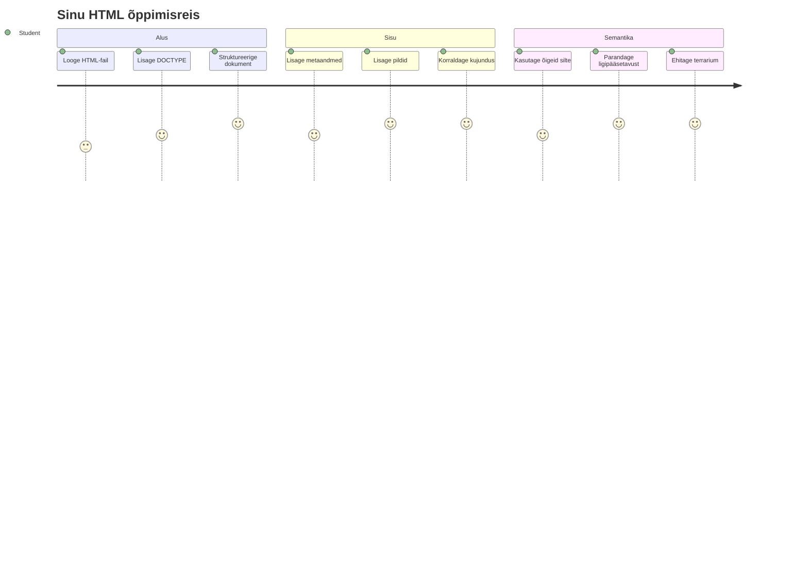
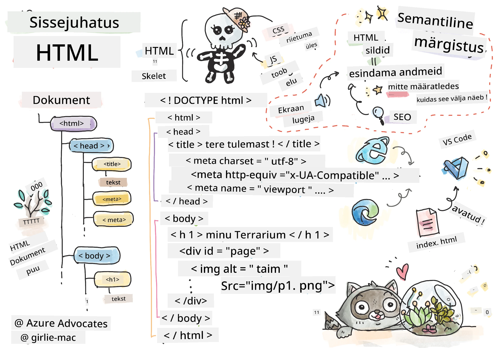
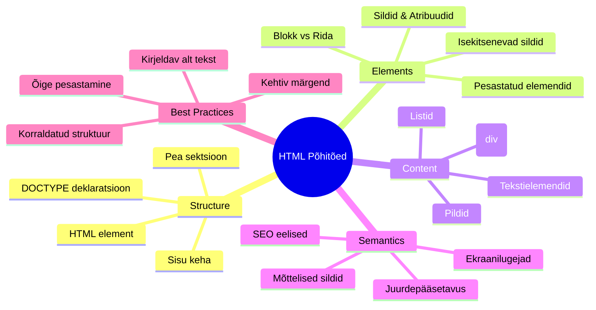
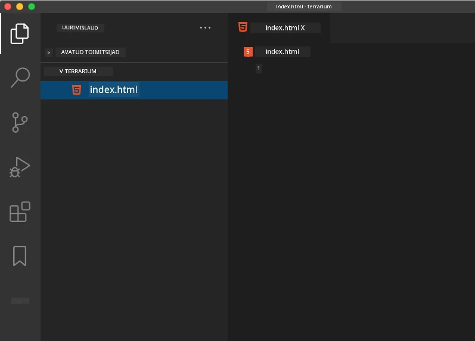
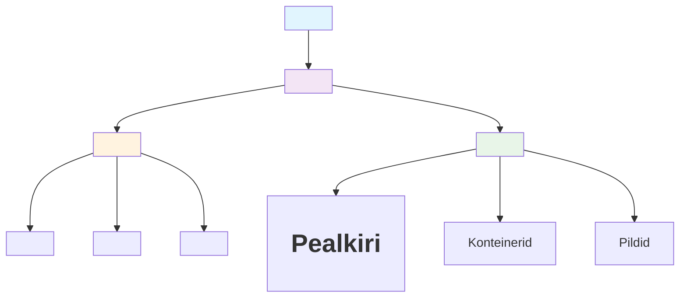
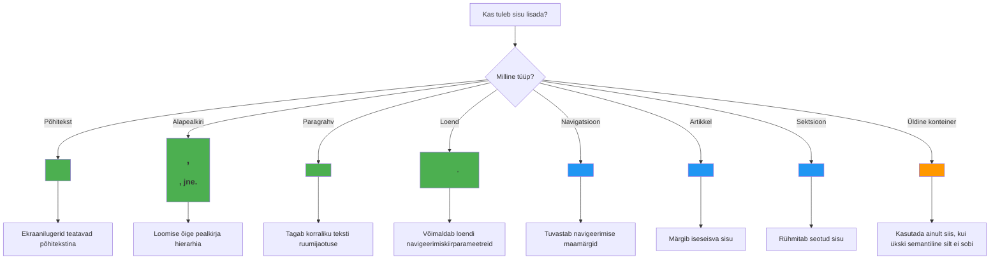
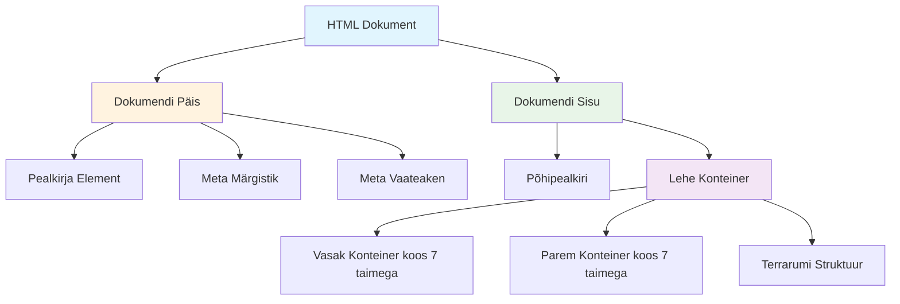
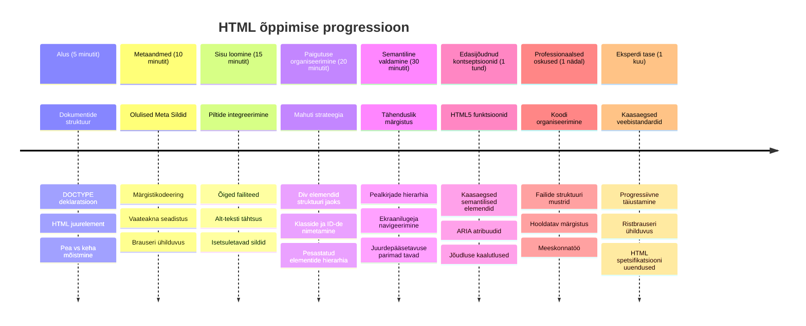

<!--
CO_OP_TRANSLATOR_METADATA:
{
  "original_hash": "3fcfa99c4897e051b558b5eaf1e8cc74",
  "translation_date": "2026-01-08T09:46:37+00:00",
  "source_file": "3-terrarium/1-intro-to-html/README.md",
  "language_code": "et"
}
-->
# Terrarium projekt Osa 1: Sissejuhatus HTML-i



> Sketchnote autorilt [Tomomi Imura](https://twitter.com/girlie_mac)

HTML ehk hüperteksti märgistuskeel on iga veebilehe aluseks, mida sa kunagi külastanud oled. Mõtle HTML-ile kui skeletile, mis annab veebilehtedele struktuuri – see määrab, kuhu sisu läheb, kuidas see on organiseeritud ja mida iga osa esindab. Kuigi CSS "riietab" su HTML-i hiljem värvide ja paigutustega ning JavaScript toob selle ellu interaktiivsusega, annab HTML vajaliku põhistruktuuri, mis muudab muu võimalikuks.

Selles õppetükis lood HTML-struktuuri virtuaalsele terrariumiliidesele. See praktiline projekt õpetab sulle HTML-i põhimõtteid, samal ajal midagi visuaalselt köitvat ehitades. Õpid, kuidas sisu organiseerida semantiliste elementide abil, kuidas töötada piltidega ja luua alused interaktiivsele veebirakendusele.

Selle õppetüki lõpuks on sul töötav HTML-leht, mis kuvab taimede pilte organiseeritud veergudes, valmis järgmiseks õppetükiks stiilimiseks. Ära muretse, kui see alguses lihtne välja näeb – just nii peabki HTML enne CSS-i visuaalset lihvi näitama.


## Ettelugemise eelküsimustik

[Ettelugemise eelküsimustik](https://ff-quizzes.netlify.app/web/quiz/15)

> 📺 **Vaata ja õpi**: Vaata seda abistavat videoülevaadet
> 
> [](https://www.youtube.com/watch?v=1TvxJKBzhyQ)

## Projekti seadistamine

Enne kui sukeldume HTML-i koodi, seadistame korraliku töökeskkonna sinu terrariumiprojektile. Alustades organiseeritud failistruktuuri loomine on oluline harjumus, mis teenib sind hästi kogu veebiarenduse teekonna jooksul.

### Ülesanne: Loo oma projekti struktuur

Sa lood spetsiaalse kausta terrariumiprojekti jaoks ja lisad esimese HTML-faili. Siin on kaks lähenemist, mida saad kasutada:

**Võimalus 1: Visual Studio Code'i kasutamine**
1. Ava Visual Studio Code
2. Klõpsa "Fail" → "Ava kaust" või kasuta `Ctrl+K, Ctrl+O` (Windows/Linux) või `Cmd+K, Cmd+O` (Mac)
3. Loo uus kaust nimega `terrarium` ja vali see
4. Avastusaknas klõpsa "Uus fail" ikoonile
5. Nyimesta oma fail nimega `index.html`



**Võimalus 2: Terminalikäskluste kasutamine**
```bash
mkdir terrarium
cd terrarium
touch index.html
code index.html
```

**Need käsud teevad järgneva:**
- **Loovad** uue kataloogi nimega `terrarium` sinu projekti jaoks
- **Sisenemisel** terrariumi kataloogi
- **Loovad** tühja `index.html` faili
- **Avavad** faili Visual Studio Codes redigeerimiseks

> 💡 **Pro nipp**: Failinimi `index.html` on veebiarenduses eriline. Kui keegi külastab veebisaiti, otsivad brauserid automaatselt vaikimisi lehtena faili `index.html`. See tähendab, et URL nagu `https://mysite.com/projects/` serveerib automaatselt `index.html` faili `projects` kaustast ilma failinime täpsustamata.

## HTML dokumendi struktuuri mõistmine

Iga HTML dokument järgib spetsiifilist struktuuri, mida brauserid vajavad, et mõista ja korrektselt kuvada. Mõtle sellele struktuurile nagu ametlikule kirjale – tal on vajalikud elemendid kindlas järjekorras, mis aitavad sisutöötlejatel (antud juhul brauseril) sisu õieti töödelda.


Alustame olulise alusega, mis on vajalik iga HTML dokumendi jaoks.

### DOCTYPE deklaratsioon ja juurelement

HTML-faili esimesed kaks rida toimivad dokumendi "sissejuhatusena" brauserile:

```html
<!DOCTYPE html>
<html></html>
```

**Mida see kood teeb:**
- **Deklaratsioon** dokumendi tüübiks on HTML5, kasutades `<!DOCTYPE html>`
- **Luuakse** juurelement `<html>`, mis sisaldab kogu lehe sisu
- **Kehtestatakse** tänapäevased veebistandardid korrektseks brauseri kuvamiseks
- **Tagatakse** ühtlane kuvamine erinevates brauserites ja seadmetes

> 💡 **VS Code näpunäide**: Liiguta kursor mõnele HTML-tägile VS Codes, et näha MDN Web Docsi kasulikku infot, sealhulgas kasutusnäiteid ja brauserite ühilduvust.

> 📚 **Lisateave**: DOCTYPE deklaratsioon hoiab ära brauserite ülemineku "quirks mode" režiimi, mida kasutati väga vanade veebisaitide toetamiseks. Kaasaegne veebiarendus kasutab lihtsat `<!DOCTYPE html>` deklaratsiooni, mis tagab [standarditele vastava kuvamise](https://developer.mozilla.org/docs/Web/HTML/Quirks_Mode_and_Standards_Mode).

### 🔄 **Pedagoogiline vahekokkuvõte**
**Peatu ja mõtiskle**: Enne jätkamist veendu, et saad aru:
- ✅ Miks igas HTML dokumendis on vaja DOCTYPE deklaratsiooni
- ✅ Mida sisaldab `<html>` juurelement
- ✅ Kuidas see struktuur aitab brauseritel lehti õigesti kuvada

**Kiire enesehinnang**: Kas suudad oma sõnadega seletada, mida tähendab "standarditele vastav kuvamine"?

## Vajalikud dokumendi metaandmete lisamine

HTML dokumendi `<head>` osa sisaldab olulist infot, mida brauserid ja otsingumootorid vajavad, kuid mida külastajad otse lehel ei näe. Mõtle sellele kui "tagatseeni" infole, mis aitab su veebilehel õigesti töötada ja kuvada korrektselt erinevatel seadmetel ja platvormidel.

See metaandmestik ütleb brauseritele, kuidas lehte kuvada, millist märgistikku kasutada ja kuidas erinevate ekraanisuurustega toime tulla – kõik see on vajalik professionaalsete ja ligipääsetavate veebilehtede loomiseks.

### Ülesanne: Lisa dokumendi päis

Lisa see `<head>` sektsioon oma `<html>` elemendi avamise ja sulgemise vahel:

```html
<head>
	<title>Welcome to my Virtual Terrarium</title>
	<meta charset="utf-8" />
	<meta http-equiv="X-UA-Compatible" content="IE=edge" />
	<meta name="viewport" content="width=device-width, initial-scale=1" />
</head>
```

**Mida iga element teeb:**
- **Määrab** lehe tiitli, mis ilmub brauseri vahelehtedel ja otsingutulemustes
- **Seab** UTF-8 märgistikku tekstide korrektsel kuvamisel kogu maailmas
- **Tagab** ühilduvuse Internet Exploreri kaasaegsete versioonidega
- **Konfigureerib** reageeriva disaini, seadistades vaateaken (viewport) seadme laiusele
- **Juhtcontrolib** esialgset suumimistaset, kuvades sisu loomulikus suuruses

> 🤔 **Mõtle sellele**: Mis juhtuks, kui seaksid vaateakna meta-tägi järgmiselt: `<meta name="viewport" content="width=600">`? See sunniks lehte alati olema 600 pikslit lai, rikkudes reageeriva disaini põhimõtteid! Loe rohkem [õige vaateakna seadistuse kohta](https://developer.mozilla.org/docs/Web/HTML/Viewport_meta_tag).

## Dokumendi keha ülesehitamine

`<body>` element sisaldab kogu veebilehe nähtavat sisu – kõike, mida kasutajad näevad ja millega suhtlevad. Kui `<head>` osa andis brauserile juhiseid, siis `<body>` sisaldab tegelikku sisu: teksti, pilte, nuppe ja muid elemente, mis loovad kasutajaliidese.

Lisame keha struktuuri ja mõistame, kuidas HTML-tägid koos töötavad tähendusliku sisu loomiseks.

### HTML-tägi struktuuri mõistmine

HTML kasutab paaristähti elementide määratlemiseks. Enamus täge on avamistäht nagu `<p>` ja sulgemistäht nagu `</p>`, mille vahele tuleb sisu: `<p>Tere, maailm!</p>`. See loob lõigu, mis sisaldab teksti "Tere, maailm!".

### Ülesanne: Lisa `<body>` element

Uuenda oma HTML-faili nii, et see sisaldaks `<body>` elementi:

```html
<!DOCTYPE html>
<html>
	<head>
		<title>Welcome to my Virtual Terrarium</title>
		<meta charset="utf-8" />
		<meta http-equiv="X-UA-Compatible" content="IE=edge" />
		<meta name="viewport" content="width=device-width, initial-scale=1" />
	</head>
	<body></body>
</html>
```

**Selle struktuuriga saad:**
- **Määratleda** põhilise HTML5 dokumendi raamistiku
- **Lisada** vajalikud metaandmed korrektsel brauseri kuvamisel
- **Luua** tühja keha, mis on valmis nähtavaks sisuks
- **Järgida** kaasaegseid veebiarenduse parimaid tavasid

Nüüd oled valmis lisama oma terrariumi nähtavad elemendid. Kasutame `<div>` elemente konteineritena erinevate sisuosade organiseerimiseks ja `` elemente taimede piltide kuvamiseks.

### Töötamine piltide ja kujunduskonteineritega

Pildid HTML-is on erisugused, kuna nad kasutavad "ise sulguvat" märgistust. Erinevalt elementidest nagu `<p></p>`, mis katavad sisu, sisaldab `` märk see info, mida ta vajab, otse tagsis endas, kasutades atribuute nagu `src` pildifaili asukoha jaoks ja `alt` ligipääsetavuse tagamiseks.

Enne piltide lisamist HTML-i pead korralikult organiseerima oma projekti failid, luues kausta piltide jaoks ja lisades taimede graafika.

**Kõigepealt seadista oma pildid:**
1. Loo kaust nimega `images` oma terrariumi projekti kausta sees
2. Laadi taimepildid alla [lahenduse kaustast](../../../../3-terrarium/solution/images) (kokku 14 taimepilti)
3. Kopeeri kõik taimepildid uude kausta `images`

### Ülesanne: Loo taimede kuvamise paigutus

Nüüd lisa taimepildid, organiseerituna kahe veeruna, oma `<body></body>` siltide vahele:

```html
<div id="page">
	<div id="left-container" class="container">
		<div class="plant-holder">
			
		</div>
		<div class="plant-holder">
			
		</div>
		<div class="plant-holder">
			
		</div>
		<div class="plant-holder">
			
		</div>
		<div class="plant-holder">
			
		</div>
		<div class="plant-holder">
			
		</div>
		<div class="plant-holder">
			
		</div>
	</div>
	<div id="right-container" class="container">
		<div class="plant-holder">
			
		</div>
		<div class="plant-holder">
			
		</div>
		<div class="plant-holder">
			
		</div>
		<div class="plant-holder">
			
		</div>
		<div class="plant-holder">
			
		</div>
		<div class="plant-holder">
			
		</div>
		<div class="plant-holder">
			
		</div>
	</div>
</div>
```

**Järjekorras, mis koodis toimub:**
- **Luuakse** põhikonteiner lehel ID-ga `page`, mis hoiab kogu sisu
- **Määratakse** kaks veergude konteinerit: `left-container` ja `right-container`
- **Organiseeritakse** 7 taime vasakusse ja 7 paremasse veergu
- **Pakendatakse** iga taime pilt konteinerisse `plant-holder` individuaalse asukoha jaoks
- **Rakendatakse** ühtsed klassinimed CSS stiilimiseks järgmisel õppetunnil
- **Määratakse** iga taime pildile unikaalne ID JavaScripti jaoks hiljem
- **Sisaldab** korrektseid failiteid, mis viitavad kaustale images

> 🤔 **Mõtle sellele**: Pane tähele, et kõigil piltidel on hetkel samasugune alternatiivtekst "plant". See pole ligipääsetavuse seisukohast optimaalne. Ekraanilugerite kasutajad kuuleksid 14 korda "plant" järjest ilma teadmiseta, millisest konkreetsest taimest pilt räägib. Kas suudad välja mõelda paremaid ja kirjeldavamaid alt-tekste iga pildi jaoks?

> 📝 **HTML elemendi tüübid**: `<div>` elemendid on "plokitasemel" ja võtavad kogu olemasoleva laiuse, samas kui `<span>` elemendid on "joonekaaslased" ja võtavad vaid vajaliku laiuse. Mida sa arvad, mis juhtuks, kui selle koodis kõik `<div>` märgendid vahetaksid `<span>`-ide vastu?

### 🔄 **Pedagoogiline vahekokkuvõte**
**Struktuuriteadmised**: Võta hetk, et üle vaadata oma HTML struktuur:
- ✅ Kas suudad tuvastada oma paigutuse põhilised konteinerid?
- ✅ Kas mõistad, miks igal pildil on unikaalne ID?
- ✅ Kuidas kirjeldaksid `plant-holder` div-de eesmärki?

**Visuaalne kontroll**: Ava oma HTML fail brauseris. Sa peaksid nägema:
- Lihtsat taimede piltide nimekirja
- Pildid organiseeritud kaheks veeruks
- Lihtsat, stiliseerimata paigutust

**Pane tähele**: See lihtne välimus ongi see, kuidas HTML peaks enne CSS stiilimist välja nägema!

Selle märgistuse lisamisega ilmuvad taimed ekraanile, kuigi veel pole need lihvitud – seda teeb järgmisel õppetunnil CSS! Praegu on sul kindel HTML-põhi, mis korrektselt organiseerib su sisu ja järgib ligipääsetavuse parimaid tavasid.

## Semantilise HTML kasutamine ligipääsetavuse jaoks

Semantiline HTML tähendab HTML elementide valimist nende tähenduse ja eesmärgi põhjal, mitte ainult välimuse järgi. Semantilise märgistuse kasutamisel annad brauseritele, otsingumootoritele ja abitehnoloogiatele (näiteks ekraanilugeritele) teada oma sisu struktuurist ja tähendusest.


See lähenemine teeb su veebilehed paremini ligipääsetavaks kasutajatele, kellel on puuded, ja aitab otsingumootoritel su sisu paremini mõista. See on kaasaegse veebiarenduse põhimõte, mis loob paremaid kogemusi kõigile.

### Semantilise pagunaja lisamine

Lisame sinu terrariumile korraliku pealkirja. Lisa see rida kohe pärast avavat `<body>` märgendit:

```html
<h1>My Terrarium</h1>
```

**Miks semantiline märgistus on oluline:**
- **Aitab** ekraanilugeritel navigeerida ja mõista lehe struktuuri
- **Parandab** otsingumootori optimeerimist (SEO) sisu hierarhia selgeks tegemisega
- **Tõstab** ligipääsetavust visuaalpuudega või kognitiivsete erinevustega kasutajatele
- **Loodab** paremaid kasutajakogemusi kõikidel seadmetel ja platvormidel
- **Järgib** veebistandardeid ja parimaid professionaalseid praktikaid

**Näited semantiliste ja mitte-semantiliste valikute kohta:**

| Eesmärk | ✅ Semantiline valik | ❌ Mitte-semantiline valik |
|---------|---------------------|----------------------------|
| Peamine pealkiri | `<h1>Pealkiri</h1>` | `<div class="big-text">Pealkiri</div>` |
| Navigeerimine | `<nav><ul><li></li></ul></nav>` | `<div class="menu"><div></div></div>` |
| Nupp | `<button>Vajuta mind</button>` | `<span onclick="...">Vajuta mind</span>` |
| Artikli sisu | `<article><p></p></article>` | `<div class="content"><div></div></div>` |

> 🎥 **Vaata praktikas**: Vaata, [kuidas ekraanilugerid veebilehtedega suhtlevad](https://www.youtube.com/watch?v=OUDV1gqs9GA), et mõista, miks semantiline märgistus on ligipääsetavuse seisukohalt ülioluline. Pane tähele, kuidas korralik HTML struktuur aitab kasutajatel tõhusalt navigeerida.

## Terrariumi konteineri loomine

Lisame nüüd terrariumi enda HTML struktuuri – klaaskonteineri, kuhu taimed lõpuks asetatakse. See jaotis demonstreerib olulist mõistet: HTML loob struktuuri, kuid ilma CSS stiilideta need elemendid veel nähtavad ei ole.

Terrariumi märgistuses kasutatakse kirjeldavaid klassinimesid, mis muudavad CSS-i stiilimise järgmisel õppetunnil intuitiivseks ja hooldatavaks.

### Ülesanne: Lisa terrariumi struktuur

Lisa see märgistus viimase `</div>` sildi kohale (enne lehekonteineri sulgemismärgendit):

```html
<div id="terrarium">
	<div class="jar-top"></div>
	<div class="jar-walls">
		<div class="jar-glossy-long"></div>
		<div class="jar-glossy-short"></div>
	</div>
	<div class="dirt"></div>
	<div class="jar-bottom"></div>
</div>
```

**Mida see terrariumi struktuur teeb:**
- **Luuakse** peamine terrariumi konteiner, millel on unikaalne ID stiilimiseks
- **Määratleb** eraldi elemendid iga visuaalse komponendi jaoks (ülemine, seinad, muld, alumine osa)
- **Sisaldab** pesastatud elemente klaasi peegelduste efektide jaoks (läikivad elemendid)
- **Kasutab** kirjeldavaid klassinimesid, mis selgelt näitavad iga elemendi eesmärki
- **Valmistab ette** struktuuri CSS stiilimiseks, mis loob klaasterraariumi väljanägemise

> 🤔 **Märkasid midagi?**: Kuigi sa lisasid selle märgistuskeele, ei näe sa lehel ühtegi uut elementi! See illustreerib perfektselt, kuidas HTML pakub struktuuri ja CSS annab välimuse. Need `<div>` elemendid eksisteerivad, kuid neil pole veel visuaalset stiili – see tuleb järgmises õppetükis!


### 🔄 **Pedagoogiline Kontroll**
**HTML struktuuri valdamine**: Enne edasi liikumist veendu, et sa oskad:
- ✅ Selgitada HTML struktuuri ja visuaalse välimuse vahet
- ✅ Tuvastada semantilisi vs mitte-semantilisi HTML elemente
- ✅ Kirjeldada, kuidas korrektne märgistus toetab ligipääsetavust
- ✅ Tunda püha dokumentide puu struktuuri

**Testi oma arusaamist**: Proovi avada oma HTML fail brauseris, kus on JavaScript välja lülitatud ja CSS eemaldatud. See näitab sulle loodud puhast semantilist struktuuri!

---

## GitHub Copilot Agenti Väljakutse

Kasuta Agent režiimi, et täita järgmine väljakutse:

**Kirjeldus:** Loo semantiline HTML struktuur taimehoolduse juhendile, mida saaks lisada terrariumiprojekti.

**Päring:** Loo semantiline HTML sektsioon, mis sisaldab põhipealkirja "Taimehoolduse juhend", kolme alajaotust pealkirjadega "Kastmine", "Valguse nõuded" ja "Mulla hooldus", igaüks sisaldades lõiku taimehoolduse infoga. Kasuta sobivaid semantilisi HTML-silte nagu `<section>`, `<h2>`, `<h3>`, ja `<p>`, et struktuur oleks asjakohane.

Loe rohkem [agent režiimist](https://code.visualstudio.com/blogs/2025/02/24/introducing-copilot-agent-mode).

## Uuri HTML ajalugu väljakutse

**Õppimine veebiarengust**

HTML on oluliselt arenenud alates sellest, kui Tim Berners-Lee lõi esimese veebibrauseri CERNis 1990. aastal. Mõned vanemad sildid nagu `<marquee>` on nüüd aegunud, sest need ei toeta hästi kaasaegseid ligipääsetavuse standardeid ega responsiivse disaini põhimõtteid.

**Proovi seda eksperimenti:**
1. Määri ajutiselt oma `<h1>` pealkiri `<marquee>` sildi sisse: `<marquee><h1>Minu terrarium</h1></marquee>`
2. Ava oma leht brauseris ja jälgi kerivat efekti
3. Mõtle, miks see silt tühistati (vihje: mõtle kasutajakogemusele ja ligipääsetavusele)
4. Eemalda `<marquee>` silt ja tagasi semantilisse märgistusse

**Mõtisklusküsimused:**
- Kuidas võiks keriv pealkiri mõjutada visuaalpuudega või liikumistundlikke kasutajaid?
- Millised moodsad CSS tehnikad võiksid saavutada sarnaseid visuaalseid efekte ligipääsetavamalt?
- Miks on oluline kasutada tänapäevaseid veebistandardeid, mitte aegunud elemente?

Uuri rohkem [aegunud ja tühistatud HTML elementide kohta](https://developer.mozilla.org/docs/Web/HTML/Element#Obsolete_and_deprecated_elements), et mõista, kuidas veebistandardid arenevad kasutajakogemuse parandamiseks.

## Loengu-järgne viktoriin

[Loengu-järgne viktoriin](https://ff-quizzes.netlify.app/web/quiz/16)

## Ülevaade ja Iseteemastus

**Sügavda oma HTML teadmisi**

HTML on olnud veebipõhi üle 30 aasta, arenenud lihtsast dokumentimärgistuskeelest keeruka platvormini interaktiivsete rakenduste loomiseks. Selle evolutsiooni mõistmine aitab paremini hinnata kaasaegseid veebistandardeid ja teha teadlikumaid arendusotsuseid.

**Soovitatavad õpiteed:**

1. **HTML ajalugu ja areng**
   - Uuri ajatelge HTML 1.0-st kuni HTML5-ni
   - Uuri, miks teatud sildid tühistati (ligipääsetavus, mobiilne sõbralikkus, hooldatavus)
   - Uuri uusimaid HTML funktsioone ja ettepanekuid

2. **Semantiline HTML süvitsi**
   - Õpi täielikku [HTML5 semantiliste elementide nimekirja](https://developer.mozilla.org/docs/Web/HTML/Element)
   - Harjuta, millal kasutada `<article>`, `<section>`, `<aside>`, ja `<main>`
   - Uuri ARIA atribuute parandatud ligipääsetavuse jaoks

3. **Kaasaegne veebiarendus**
   - Uuri, kuidas ehitada [responsiivseid veebilehti](https://docs.microsoft.com/learn/modules/build-simple-website/?WT.mc_id=academic-77807-sagibbon) Microsoft Learni kaudu
   - Mõista, kuidas HTML seostub CSS-i ja JavaScriptiga
   - Õpi veebijõudlust ja SEO parimaid praktikaid

**Mõtisklusküsimused:**
- Milliseid tühistatud HTML silte avastasid ja miks need eemaldati?
- Milliseid uusi HTML funktsioone pakutakse tulevikus?
- Kuidas aitab semantiline HTML veebipõhist ligipääsetavust ja SEO-d?

### ⚡ **Mida saad järgmise 5 minutiga teha**
- [ ] Ava DevTools (F12) ja vaata oma lemmiklehe HTML struktuuri
- [ ] Loo lihtne HTML fail põhisiltidega: `<h1>`, `<p>`, ja ``
- [ ] Kontrolli oma HTML-i W3C HTML valideerijaga veebis
- [ ] Proovi lisada oma HTML-i kommentaar `<!-- kommentaar -->` abil

### 🎯 **Mida saad selle tunni jooksul saavutada**
- [ ] Täida loengu-järgne viktoriin ja korrasta semantilisi HTML kontseptsioone
- [ ] Ehita enda kohta lihtne veebileht korraliku HTML struktuuriga
- [ ] Katseta eri pealkirjatasemeid ja teksti vorminduse silte
- [ ] Lisa pilte ja linke, et harjutada multimeedia integreerimist
- [ ] Uuri HTML5 võimalusi, mida sa veel pole proovinud

### 📅 **Sinu nädala pikkune HTML teekond**
- [ ] Täida terrariumiprojekti ülesanne semantilise märgistusega
- [ ] Loo ligipääsetav veebileht kasutades ARIA silte ja rolle
- [ ] Harjuta vormide loomist eri sisenditüüpidega
- [ ] Uuri HTML5 API-sid nagu localStorage või geolocation
- [ ] Õpi responsiivseid HTML mustreid ja mobiil-esimese disaini
- [ ] Vaata teisi arendajaid HTML koodi ja õpi parimatest praktikatest

### 🌟 **Sinu kuu pikkune veebi alus**
- [ ] Ehita portfoolio veebileht, mis demonstreerib HTML oskusi
- [ ] Õpi HTML mallimist raamistiku nagu Handlebars abil
- [ ] Panusta avatud lähtekoodiga projektidesse, parandades HTML dokumentatsiooni
- [ ] Oma HTML mõõdukaid keerukamaid kontseptsioone nagu kohandatud elemendid
- [ ] Integreeri HTML koos CSS raamistikute ja JavaScripti teekidega
- [ ] Ole mentoriks teistele, kes õpivad HTML põhialuseid

## 🎯 Sinu HTML valdamise ajakava


### 🛠️ Sinu HTML tööriistakomplekti kokkuvõte

Pärast selle tunni lõpetamist on sul nüüd:
- **Dokumendi struktuur**: Täielik HTML5 alus koos õige DOCTYPE-ga
- **Semantiline märgistus**: Mõtestatud sildid, mis parandavad ligipääsetavust ja SEO-d
- **Pildi integratsioon**: Õige failide korraldus ja alt-teksti kasutamine
- **Paigutuse konteinerid**: Tarkade klassinimedega div-ide strateegiline kasutus
- **Ligipääsetavuse teadlikkus**: Ekraanilugeja navigeerimise mõistmine
- **Moodsa standardi tundmine**: Praegused HTML5 praktikad ja aegunud siltide teadlikkus
- **Projekti alus**: Kindel baas CSS stiilimiseks ja JavaScripti interaktiivsuseks

**Järgmised sammud**: Sinu HTML struktuur on valmis CSS stiilimiseks! Semantiline alus, mida sa ehitasid, teeb järgmise tunni mõistmise palju lihtsamaks.

## Ülesanne

[Harjuta HTML-i: Ehita blogi makett](assignment.md)

---

<!-- CO-OP TRANSLATOR DISCLAIMER START -->
**Vastutusest loobumine**:
See dokument on tõlgitud tehisintellekti tõlketeenuse [Co-op Translator](https://github.com/Azure/co-op-translator) abil. Kuigi püüame tagada täpsust, olge teadlik, et automaatsed tõlked võivad sisaldada vigu või ebatäpsusi. Algne dokument selle algkeeles tuleks pidada autoriteetseks allikaks. Töötlemise või kriitilise teabe puhul soovitame kasutada professionaalset inimtõlget. Me ei vastuta selle tõlke kasutamisest tekkivate arusaamatuste või moonutuste eest.
<!-- CO-OP TRANSLATOR DISCLAIMER END -->