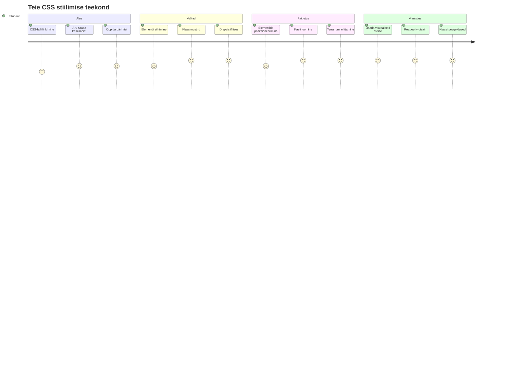
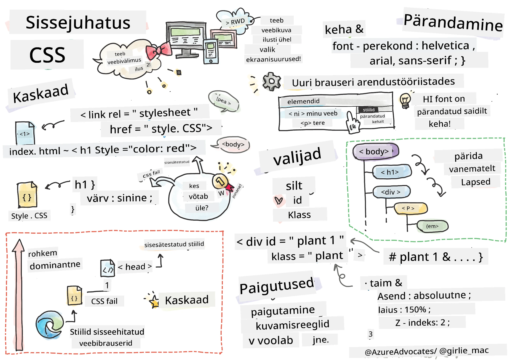
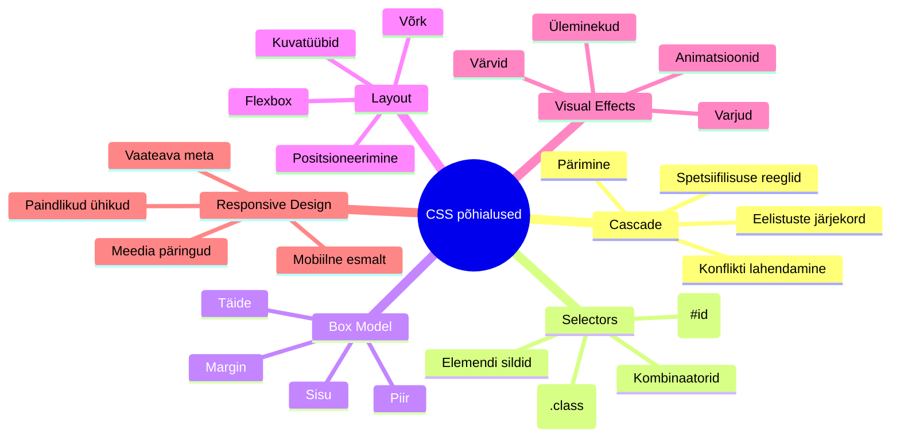
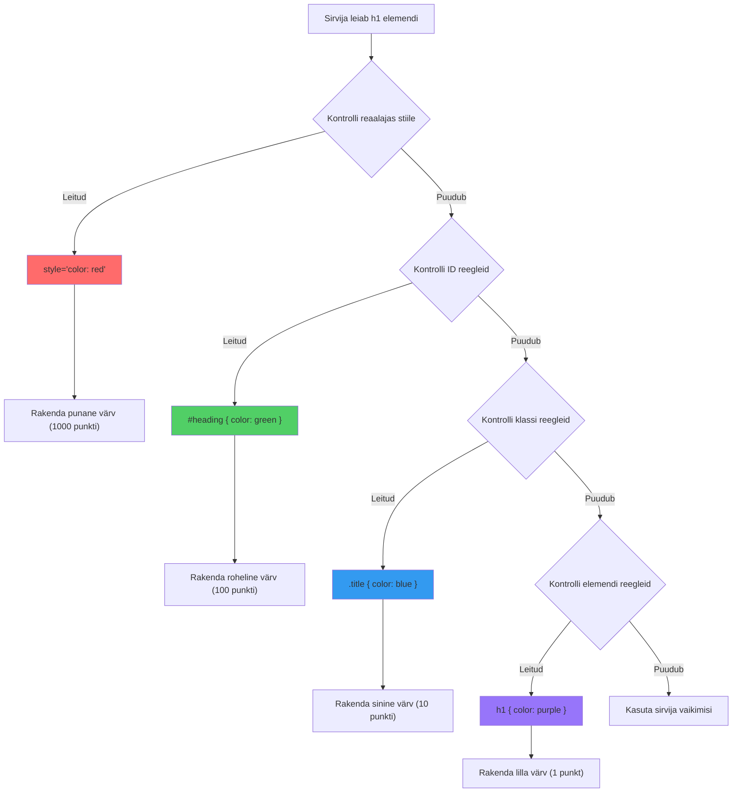
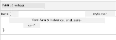
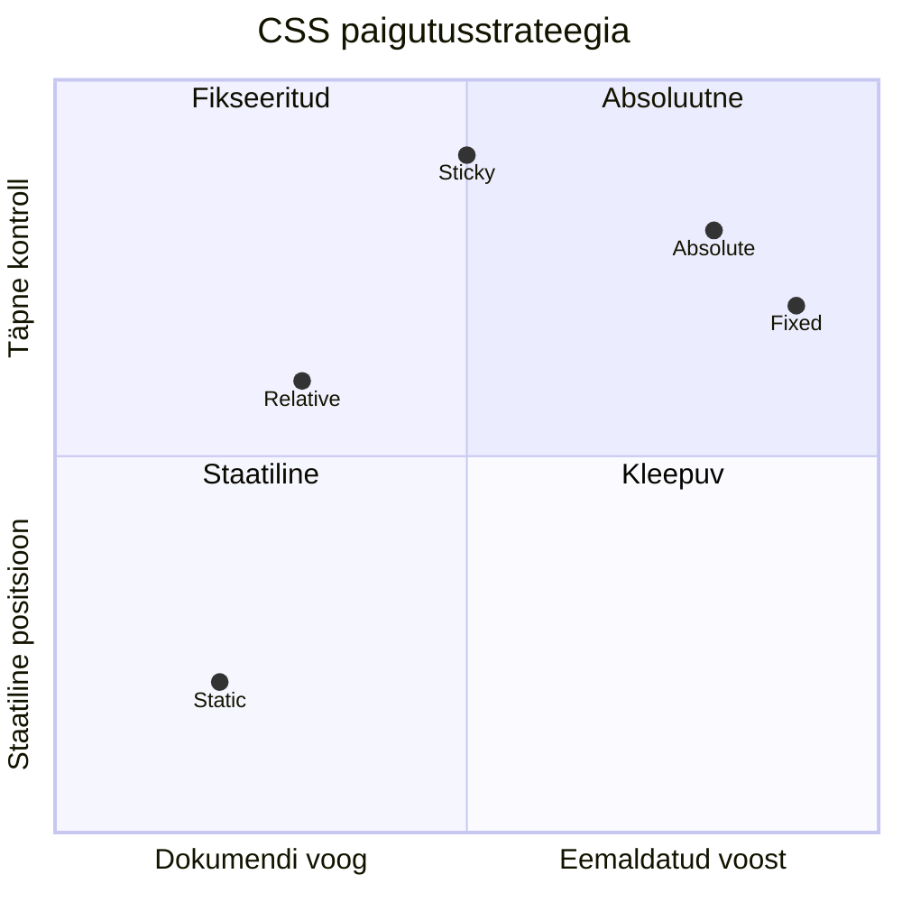
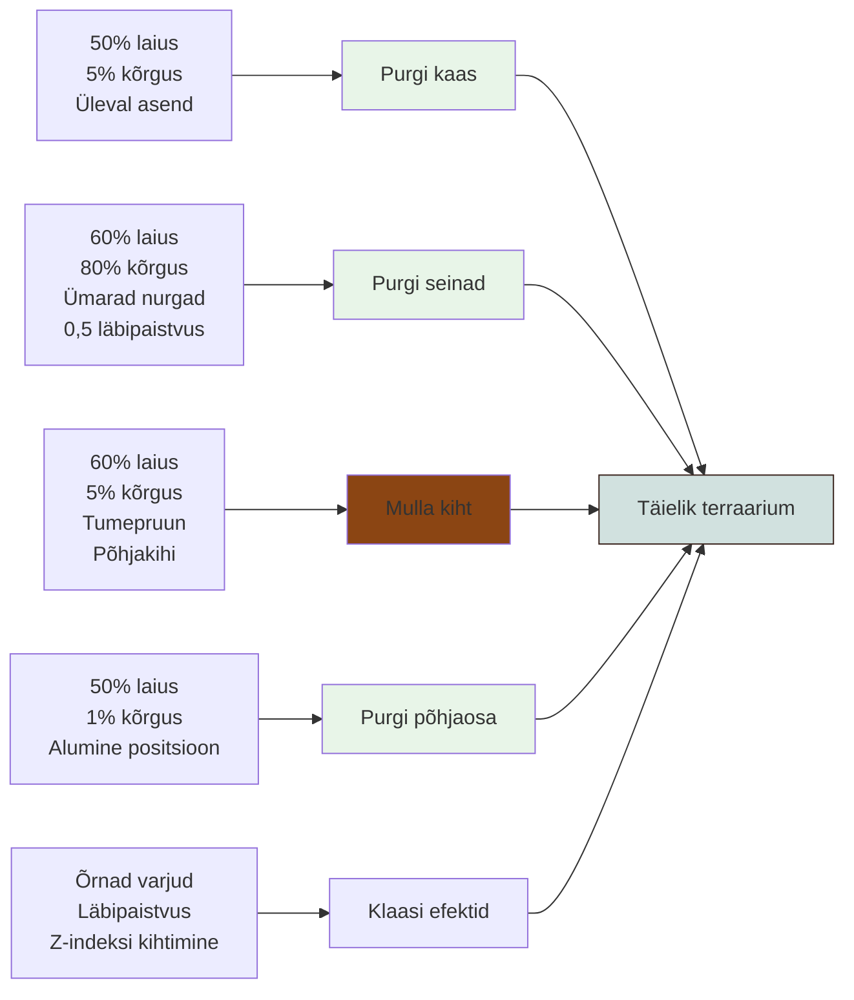
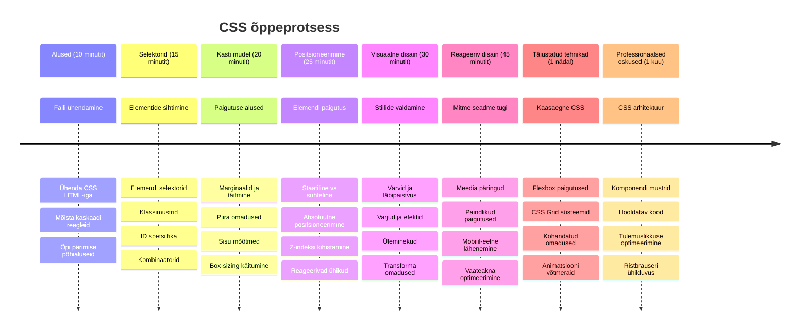

<!--
CO_OP_TRANSLATOR_METADATA:
{
  "original_hash": "e39f3a4e3bcccf94639e3af1248f8a4d",
  "translation_date": "2026-01-08T09:52:20+00:00",
  "source_file": "3-terrarium/2-intro-to-css/README.md",
  "language_code": "et"
}
-->
# Terrarium projekt Osa 2: Sissejuhatus CSS-i



> Sketchnote autorilt [Tomomi Imura](https://twitter.com/girlie_mac)

Kas mäletad, kuidas su HTML-terraarium nägi üsna lihtne välja? CSS on koht, kus me muudame selle tavalise struktuuri millekski visuaalselt atraktiivseks.

Kui HTML on nagu maja karkassi ehitamine, siis CSS on kõik, mis teeb sellest koduse tunde – värvid, mööbli paigutus, valgustus ja ruumide omavaheline voog. Mõtle, kuidas Versailles’ loss sai alguse lihtsast jahimajast, kuid hoolikas kaunistus ja paigutus muutsid selle üheks maailma imelisimaks hooneks.

Täna muudame su terraariumi funktsionaalsest viimistletuks. Õpid, kuidas elemente täpselt positsioneerida, tekitada reageerivaid paigutusi erinevatele ekraanisuurustele ja luua visuaalset atraktiivsust, mis teeb veebilehtedest kaasahaaravad.

Selle õppetunni lõpuks näed, kuidas strateegiline CSS stiil võib oluliselt parandada su projekti. Lisame su terraariumile stiili.


## Eelõppe viktoriin

[Eelõppe viktoriin](https://ff-quizzes.netlify.app/web/quiz/17)

## CSS-iga alustamine

CSS-i mõistetakse tihti lihtsalt kui „asjade kauniks tegemist“, kuid sellel on palju laiem eesmärk. CSS on nagu filmi režissöör – sa kontrollid mitte ainult seda, kuidas kõik välja näeb, vaid ka seda, kuidas see liigub, kuidas reageerib interaktsioonile ja kohandub erinevates olukordades.

Kaasaegne CSS on erakordselt võimekas. Sa saad kirjutada koodi, mis automaatselt kohandab paigutust telefonidele, tahvelarvutitele ja lauaarvutitele. Võid luua sujuvaid animatsioone, mis juhivad kasutajate tähelepanu õigesse kohta. Kui kõik töötab koos, on tulemused päris muljetavaldavad.

> 💡 **Pro Näpunäide**: CSS areneb pidevalt uute funktsioonide ja võimekustega. Kontrolli alati [CanIUse.com](https://caniuse.com), et veenduda veebilehitsejate toe olemasolus uute CSS-i funktsioonide kasutamisel tootmisprojektides.

**Selles õppetunnis saavutatav:**
- **Luuakse** täislahendus visuaalseks disainiks su terraariumile, kasutades kaasaegseid CSS tehnikaid
- **Uuritakse** põhikontseptsioone nagu kaskaad, pärandumine ja CSS selektorid
- **Rakendatakse** reageerivaid positsioneerimis- ja paigutusstrateegiaid
- **Ehitatakse** terraariumi konteiner kasutades CSS kujundeid ja stiile

### Eeldus

Peaksid olema eelmisel tunnil lõpetanud HTML-struktuuri oma terraariumile ja see valmis stiilimiseks.

> 📺 **Videoresurss**: Vaata seda kasulikku videoülevaadet
>
> [](https://www.youtube.com/watch?v=6yIdOIV9p1I)

### CSS faili seadistamine

Enne stiilimist peame ühendama CSS-i meie HTML-iga. See ühendus ütleb brauserile, kust leida meie terraariumi stiilinõudeid.

Loo oma terraariumi kausta uus fail nimega `style.css`, seejärel lisa see oma HTML dokumendi `<head>` sektsiooni:

```html
<link rel="stylesheet" href="./style.css" />
```

**Mis selle koodi eesmärk on:**
- **Loob** ühenduse su HTML- ja CSS-failide vahel
- **Käsib** brauseril laadida ja rakendada selles failis `style.css` olevad stiilid
- **Kasutab** atribuuti `rel="stylesheet"`, mis näitab, et tegemist on CSS failiga
- **Viitab** failile teekonnaga `href="./style.css"`

## CSS kaskaadi mõistmine

Oled mõelnud, miks CSS-i nimetatakse "Cascading" Style Sheets? Stiilid voolavad nagu juga ning mõnikord võivad need üksteisega konflikti minna.

Mõtle sõjaväe käsustruktuurile – kindral korraldab, et „kõik sõdurid kannavad rohelist“, kuid konkreetne käsk sinu üksusele ütleb „kanna tseremooniaks sinist vormi“. Spetsiifilisem juhis on määrav. CSS järgib sama loogikat ja selle hierarhia mõistmine teeb silumise palju lihtsamaks.

### Katsetame kaskaadi prioriteeti

Vaatame, kuidas kaskaad toimib, luues stiilide konflikti. Esiteks lisa oma `<h1>` märgile inline-stiil:

```html
<h1 style="color: red">My Terrarium</h1>
```

**Mida see kood teeb:**
- **Rakendab** otse punase värvi `<h1>` elemendile, kasutades inline stiili
- **Kasutab** `style` atribuuti, et manustada CSS otse HTML-i
- **Loob** selle elemendi jaoks kõrgeima prioriteediga stiilireegli

Seejärel lisa see reegel oma `style.css` faili:

```css
h1 {
  color: blue;
}
```

**Ülaltoodud puhul oleme:**
- **Määratlenud** CSS reegli kõigile `<h1>` elementidele
- **Seadnud** teksti värviks sinise välimise stiililehe kaudu
- **Loonud** madalama prioriteediga reegli võrreldes inline stiilidega

✅ **Teadmiste kontroll**: Milline värv kuvatakse sinu veebirakenduses? Miks see värv võidab? Tule meelde olukordi, kus võiksid stiile üle kirjutada?


> 💡 **CSS Prioriteedijärjestus (kõrgeimast madalaimani):**
> 1. **Inline stiilid** (style atribuut)
> 2. **ID-d** (#myId)
> 3. **Klassid** (.myClass) ja atribuudid
> 4. **Elemendi selektorid** (h1, div, p)
> 5. **Brauseri vaikestiilid**

## CSS pärandumine praktikas

CSS pärandumine käitub nagu genetikad – elemendid pärivad teatud omadusi vanemate elementidelt. Kui määrad font-familyst body elemendile, kasutavad kõik tekstid selle sama fonti automaatselt. See on nagu Habsburgide perekonna iseloomulik lõualuu, mis ilmus põlvest põlve, ilma et seda eraldi igaühele määratletaks.

Kuid mitte kõike ei pärandata. Teksti omadused nagu font ja värvid päranduvad, kuid paigutuse omadused nagu marginaalid ja piirid mitte. Nii nagu lapsed võivad pärida füüsilisi omadusi, kuid mitte vanemate moestiile.

### Vaadeldes fontade pärandumist

Vaata pärandumist praktikasse, määrates font-familyst `<body>` elemendile:

```css
body {
  font-family: 'Segoe UI', Tahoma, Geneva, Verdana, sans-serif;
}
```

**Mis siin juhtub:**
- **Seab** fondiperekonna kogu lehele, suunates `<body>` elemendile
- **Kasutab** fontide pinu koos varufontidega parema brauseri ühilduvuse tagamiseks
- **Rakendab** kaasaegseid süsteemifonte, mis näevad hea välja kõigil operatsioonisüsteemidel
- **Tagab**, et kõik alam-elemendid pärivad selle fondi, kui ei ole spetsiifiliselt muudetud

Ava brauseri arendajatööriistad (F12), mine Elements vaatesse ja vaata oma `<h1>` elementi. Näed, et see pärib fondiperekonna body-lt:



✅ **Katsetamise aeg**: Proovi teisi pärandatavaid omadusi `<body>` peal nagu `color`, `line-height` või `text-align`. Mis juhtub su pealkirja ja teiste elementidega?

> 📝 **Pärandatavad omadused hõlmavad**: `color`, `font-family`, `font-size`, `line-height`, `text-align`, `visibility`
>
> **Mittepärandatavad omadused hõlmavad**: `margin`, `padding`, `border`, `width`, `height`, `position`

### 🔄 **Pedagoogiline kontroll**
**CSS aluste mõistmine**: Enne selektorite juurde minekut veendu, et suudad:
- ✅ Selgitada kaskaadi ja pärandumise erinevust
- ✅ Ennustada, milline stiil spetsiifilisuse konflikti võidab
- ✅ Tuvastada, millised omadused päranduvad vanemalt elemendilt
- ✅ Õigesti ühendada CSS failid HTML-iga

**Kiire test**: Kui sul on need stiilid, mis värvi on `<h1>` elemendi tekst sees `<div class="special">`?
```css
div { color: blue; }
.special { color: green; }
h1 { color: red; }
```
*Vastus: Punane (elemendi selektor sihib otse h1)*

## CSS selektorite valdamine

CSS selektorid on viis, kuidas sihtida konkreetseid elemente stiilimiseks. Need töötavad nagu täpsed juhised – selle asemel, et öelda „maja“, ütled „sinine maja punase uksega Maple tänaval“.

CSS pakub erinevaid võimalusi olla spetsiifiline ja õige selektori valimine on nagu õige tööriista valik ülesande jaoks. Mõnikord tuleb stiilida kõiki uksi naabruskonnas, mõnikord vaid ühte konkreetselt ust.

### Elemendi selektorid (sildid)

Elemendi selektorid sihivad HTML elemente nende sildinime järgi. Need sobivad põhistiilide seadmiseks, mis kehtivad kogu leheküljele:

```css
body {
  font-family: 'Segoe UI', Tahoma, Geneva, Verdana, sans-serif;
  margin: 0;
  padding: 0;
}

h1 {
  color: #3a241d;
  text-align: center;
  font-size: 2.5rem;
  margin-bottom: 1rem;
}
```

**Millised stiilid need on:**
- **Seab** ühtse tüpograafia kogu veebilehele `body` selektoriga
- **Eemaldab** brauseri vaikimisi marginaalid ja täited paremaks kontrolliks
- **Stiilid** kõik päiselemendid värvi, joonduse ja vahedega
- **Kasutab** `rem` ühikuid skaleeritava ja ligipääsetava font-suuruse jaoks

Kuigi elemendi selektorid on head üldiseks stiilimiseks, vajad spetsiifilisemaid selektoreid, et stiilida individuaalseid komponente nagu taimed su terraariumis.

### ID selektorid unikaalsetele elementidele

ID selektorid kasutavad `#` sümbolit ja sihivad elemente konkreetsete `id` atribuutidega. Kuna ID-d peavad olema lehel unikaalsed, sobivad nad hästi individuaalsete erielementide stiilimiseks, näiteks meie vasak- ja parempoolsete taimede konteinerid.

Loome meie terraariumi külgkontainerite stiilid, kuhu taimed elama lähevad:

```css
#left-container {
  background-color: #f5f5f5;
  width: 15%;
  left: 0;
  top: 0;
  position: absolute;
  height: 100vh;
  padding: 1rem;
  box-sizing: border-box;
}

#right-container {
  background-color: #f5f5f5;
  width: 15%;
  right: 0;
  top: 0;
  position: absolute;
  height: 100vh;
  padding: 1rem;
  box-sizing: border-box;
}
```

**Mida see kood saavutab:**
- **Positsioneerib** konteinerid vasakule ja paremale ekraani servadele `absolute` positsioneerimise abil
- **Kasutab** `vh` ühikuid (ekraani kõrgus) reageeriva kõrguse jaoks, mis kohandub ekraanisuurusega
- **Rakendab** `box-sizing: border-box`, et täide oleks arvestatud kogulaiusesse
- **Eemaldab** mittevajalikud `px` ühikud nullväärtustelt, et kood oleks puhtam
- **Seab** õrna tausta värvi, mis on silmadele sõbralikum kui karm hall

✅ **Koodi kvaliteedi väljakutse**: Pane tähele, kuidas see CSS rikub DRY (Don't Repeat Yourself) põhimõtet. Kas saad ümber kirjutada, kasutades nii ID-d kui klassi?

**Parendatud lähenemine:**
```html
<div id="left-container" class="container"></div>
<div id="right-container" class="container"></div>
```

```css
.container {
  background-color: #f5f5f5;
  width: 15%;
  top: 0;
  position: absolute;
  height: 100vh;
  padding: 1rem;
  box-sizing: border-box;
}

#left-container {
  left: 0;
}

#right-container {
  right: 0;
}
```

### Klas­si selektorid korduvate stiilide jaoks

Klassi selektorid kasutavad `.` märki ja sobivad ideaalselt, kui tahad sama stiili rakendada mitmele elemendile. Erinevalt ID-dest saab klasse HTML-is korduvalt kasutada, mis teeb need sobivaks järjepidevate stiilide jaoks.

Meie terraariumis vajab iga taim sarnast stiili, kuid igaüks peab olema ka individuaalselt positsioneeritud. Kasutame klasside kombinatsiooni ühiste stiilide jaoks ja ID-sid unikaalseks positsioneerimiseks.

**Näide iga taime HTML struktuurist:**
```html
<div class="plant-holder">
  
</div>
```

**Olulised elemendid selgitatuna:**
- **Kasutab** `class="plant-holder"` ühtseks konteineri stiiliks kõigi taimedega
- **Rakendab** `class="plant"` ühistele piltidele stiili ja käitumist
- **Sisaldab** unikaalset `id="plant1"` individuaalseks positsioneerimiseks ja JavaScripti interaktsiooniks
- **Pakub** kirjeldavat alt-teksti ekraanilugejate jaoks

Lisa need stiilid oma `style.css` faili:

```css
.plant-holder {
  position: relative;
  height: 13%;
  left: -0.6rem;
}

.plant {
  position: absolute;
  max-width: 150%;
  max-height: 150%;
  z-index: 2;
  transition: transform 0.3s ease;
}

.plant:hover {
  transform: scale(1.05);
}
```

**Mis siin toimub:**
- **Luuakse** suhteline positsioneerimine taimede hoidjatele, et luua paigutuskontekst
- **Seadistatakse** iga taimede hoidja kõrguseks 13%, tagades, et kõik taimed mahuvad vertikaalselt vaatamata kerimisele
- **Liigutatakse** hoidjaid veidi vasakule, et taimed oleksid konteineris paremini tsentreeritud
- **Lubatakse** taimedele reageeriv suuruse muutmine, kasutades `max-width` ja `max-height` omadusi
- **Kasutatakse** `z-index` taimed paigutamiseks üle teiste elementide terraariumis
- **Lisatakse** õrn hover-efekt CSS üleminekutega, et parandada kasutajakogemust

✅ **Kriitiline mõtlemine**: Miks vajame nii `.plant-holder` kui ka `.plant` selektoreid? Mis juhtuks, kui prooviksime kasutada ainult ühte?

> 💡 **Disainimuster**: Konteiner (`.plant-holder`) kontrollib paigutust ja positsioneerimist, sisu (`.plant`) kontrollib välimust ja skaleerimist. See eraldatus teeb koodi hooldamise ja kohandamise lihtsamaks.

## CSS positsioneerimise mõistmine

CSS positsioneerimine on nagu lavastaja roll teatris – sa juhid, kus iga näitleja seisab ja kuidas nad laval liiguvad. Mõned jäävad tavapärasesse režiimi, teised vajavad spetsiifilist asukohta draama loomiseks.

Positsioneerimist mõistes muutuvad paljud paigutusprobleemid lahendatavaks. Vajad navigeerimisriba, mis jääb ekraani ülaossa kerides? Positsioneerimine teeb selle võimalikuks. Tahad tööriistaekraani, mis ilmub täpsesse kohta? See on ka positsioneerimine.

### Viis positsioneerimise väärtust


| Positsiooniväärtus | Käitumine | Kasutusjuhtum |
|--------------------|-----------|---------------|
| `static` | Vaikimisi voog, ignoreerib top/left/right/bottom omadusi | Tavaline dokumendi paigutus |
| `relative` | Positsioneeritud oma normaalsest kohast suhteliselt | Väikesed korrigeerimised, positsioneerimiskontekst |
| `absolute` | Positsioneeritud lähima positsioneeritud vanema suhtes | Täpne paigutus, ülekattelemendid |
| `fixed` | Positsioneeritud ekraani vaatamise ala suhtes | Navigeerimisribad, ujuvad elemendid |
| `sticky` | Vahetab staatilise ja fikseeritud vahel kerimise põhjal | Jääv päis kerimise ajal |

### Positsioneerimine meie terraariumis

Meie terraarium kasutab positsioneerimise liikide strateegilist kombinatsiooni, et luua soovitud paigutus:

```css
/* Container positioning */
.container {
  position: absolute; /* Removes from normal flow */
  /* ... other styles ... */
}

/* Plant holder positioning */
.plant-holder {
  position: relative; /* Creates positioning context */
  /* ... other styles ... */
}

/* Plant positioning */
.plant {
  position: absolute; /* Allows precise placement within holder */
  /* ... other styles ... */
}
```

**Mõistame positsioneerimise strateegiat:**
- **Absoluutsed konteinerid** eemaldatakse dokumendi voost ja kinnitatakse ekraani servadele
- **Suhtelised taimede hoidjad** loovad positsioneerimiskonteksti, jäädes dokumendi voogu
- **Absoluutsed taimed** saab täpselt positsioneerida oma suhteliste konteinerite sees
- **See kombinatsioon** võimaldab taimedel virnastuda vertikaalselt, olles samas individuaalselt positsioneeritavad

> 🎯 **Miks see on oluline**: `plant` elemendid vajavad absoluutset positsioneerimist, et saaksid järgmises tunnis lohistada. Absoluutne positsioon eemaldab nad normaalsest paigutusest, muutes lohistamisinteraktsiooni võimalikuks.

✅ **Katsetamise aeg**: Proovi muuta positsioneerimise väärtusi ja vaata tulemusi:
- Mis juhtub, kui muudad `.container` positsiooni `absolute`-lt `relative`-ks?
- Kuidas muutub paigutus, kui `.plant-holder` kasutab `absolute` asemel `relative`?
- Mis juhtub, kui vahetad `.plant` positsioneerimise `relative` vastu?

### 🔄 **Õppekontroll**
**CSS positsioneerimise meistriklass**: Peatu ja kontrolli oma arusaamist:
- ✅ Kas suudad seletada, miks taimedele on drag-and-drop jaoks vaja absoluutset positsioneerimist?
- ✅ Kas mõistad, kuidas suhtelised konteinerid loovad positsioneerimiskonteksti?
- ✅ Miks kasutavad külgkonteinerid absoluutset positsioneerimist?
- ✅ Mis juhtuks, kui eemaldada positsioneerimise määrangud täiesti?

**Reaalmaailma seos**: Mõtle, kuidas CSS positsioneerimine peegeldab reaalse maailma paigutust:
- **Staatiline**: Raamatud riiulis (loomulik järjekord)
- **Suhteline**: Raamatu veidi liigutamine, kuid selle koha säilitamine
- **Absoluutne**: Märkmiku panemine täpselt kindlale leheküljele
- **Fixeeritud**: Kleebis, mis jääb nähtavaks, kui lehti keerad

## Terrariumi ehitamine CSS-iga

Nüüd ehitame ainult CSS-iga klaaspurgi – pilte ega graafikaprogrammi pole vaja.

Realistliku klaasi, varjude ja sügavuse efekti loomine positsioneerimise ja läbipaistvuse abil demonstreerib CSS visuaalseid võimalusi. See tehnika peegeldab, kuidas Bauhausi arhitektid kasutasid lihtsaid geomeetrilisi vorme keerukate ja ilusate struktuuride loomiseks. Kui neid põhimõtteid mõistad, tunned ära CSS-i tehnikad paljude veebidisainide taga.


### Klaaspurgi komponentide loomine

Ehitage terrariumi purk tükkhaaval. Iga osa kasutab absoluutset positsioneerimist ja protsendipõhist suurust, et saavutada reageeriv disain:

```css
.jar-walls {
  height: 80%;
  width: 60%;
  background: #d1e1df;
  border-radius: 1rem;
  position: absolute;
  bottom: 0.5%;
  left: 20%;
  opacity: 0.5;
  z-index: 1;
  box-shadow: inset 0 0 2rem rgba(0, 0, 0, 0.1);
}

.jar-top {
  width: 50%;
  height: 5%;
  background: #d1e1df;
  position: absolute;
  bottom: 80.5%;
  left: 25%;
  opacity: 0.7;
  z-index: 1;
  border-radius: 0.5rem 0.5rem 0 0;
}

.jar-bottom {
  width: 50%;
  height: 1%;
  background: #d1e1df;
  position: absolute;
  bottom: 0;
  left: 25%;
  opacity: 0.7;
  border-radius: 0 0 0.5rem 0.5rem;
}

.dirt {
  width: 60%;
  height: 5%;
  background: #3a241d;
  position: absolute;
  border-radius: 0 0 1rem 1rem;
  bottom: 1%;
  left: 20%;
  opacity: 0.7;
  z-index: -1;
}
```

**Terrariumi ehituse mõistmine:**
- **Kasutab** protsendipõhiseid mõõtmeid vastavalt ekraanisuurusele kohanemiseks
- **Paigutab** elemendid absoluutse positsioneerimisega täpselt üksteise peale ja joondades
- **Rakendab** erinevaid läbipaistvuse tasemeid klaasi läbipaistvuse efekti loomiseks
- **Kasutab** `z-index` kihistamist, et taimed paistaksid purgi sees
- **Lisab** peeneid varjutusi ja täpsemaid äärekuju nurki realistlikuma väljanägemise jaoks

### Reageeriv disain protsentides

Pane tähele, kuidas kõik mõõtmed on protsentides, mitte fikseeritud pikslites:

**Miks see oluline on:**
- **Tagab**, et terrarium skaleerub proportsionaalselt ükskõik millisel ekraanisuurusel
- **Hoiab** purgi komponentide visuaalsed suhted
- **Pakub** ühtset kogemust nii mobiiltelefonides kui suurtel lauaarvutitel
- **Võimaldab** disainil kohaneda, murtmata paigutust

### CSS ühikud töös

Kasutame `rem` ühikuid äärekuju nurkades (border-radius), mis skaleerub suhtes juurteksti suurusega. See loob kasutajasõbralikumaid disaine, mis austavad kasutaja fontide eelistusi. Loe [CSS suhtelistest ühikutest](https://www.w3.org/TR/css-values-3/#font-relative-lengths) ametlikust spetsifikatsioonist.

✅ **Visuaalne katsetamine**: Proovi muutes neid väärtusi ja jälgi muutusi:
- Muuda purgi läbipaistvust 0.5-lt 0.8-le – kuidas see klaasi välimust mõjutab?
- Kohanda mulla värv `#3a241d` pealt `#8B4513` peale – milline visuaalne efekt tekib?
- Muuda mulla `z-index` väärtuseks 2 – mis kihistusega juhtub?

### 🔄 **Õppekontroll**
**CSS visuaalse disaini mõistmine**: Kinnita oma arusaamist CSS-ist:
- ✅ Kuidas protsendipõhised mõõtmed loovad reageeriva disaini?
- ✅ Miks läbipaistvus loob klaasi läbipaistvuse efekti?
- ✅ Mis roll on `z-index` kihistamisel?
- ✅ Kuidas äärekujude väärtused loovad purgi kuju?

**Disaini põhimõte**: Pane tähele, kuidas ehitame keerukaid visuaale lihtsate kujudega:
1. **Ristkülikud** → **Ümarad ristkülikud** → **Purgi komponendid**
2. **Lamedad värvid** → **Läbipaistvus** → **Klaasi efekt**
3. **Individuaalsed elemendid** → **Kihiline koostis** → **3D välimus**

---

## GitHub Copiloti agentide väljakutse 🚀

Kasuta Agent režiimi ja täida järgmine väljakutse:

**Kirjeldus:** Loo CSS animatsioon, mis paneb terrariumi taimed õrnalt kõiglema, imiteerides looduse tuuleefekti. See aitab sul harjutada CSS animatsioone, transformatsioone ja võtmeraame, samal ajal suurendades terrariumi visuaalset ilu.

**Üleskutse:** Lisa CSS võtmeraami animatsioonid, mis panevad terrariumi taimed kergelt vasakule-paremale kõiglema. Loo kõikumisanimatsioon, mis pöörab iga taime veidi (2-3 kraadi) vasakule ja paremale 3-4 sekundiga ning rakenda seda `.plant` klassile. Veendu, et animatsioon korduks lõputult ja kasutaks loomuliku liikumise jaoks kerget tõmmet.

Õpi veel [agendi režiimist](https://code.visualstudio.com/blogs/2025/02/24/introducing-copilot-agent-mode).

## 🚀 Väljakutse: Klaasi peegelduste lisamine

Valmis oma terrariumi täiustama realistlike klaasipeegeldustega? See tehnika lisab sügavust ja realismi disainile.

Sa lood peened helkivad läikekujud, mis simuleerivad valguse peegeldumist klaasipindadelt. See lähenemine on sarnane Renessansi maalikunstnikele nagu Jan van Eyck, kes kasutasid valgust ja peegeldust klaasi kolme-mõõtmelise mulje loomiseks. Siin on, mida sa saavutada tahad:


**Sinu ülesanne:**
- **Loo** pehmed valged või heledat värvi ovaalsed kujundid klaasipeegeldusteks
- **Paiguta** need purgi vasakule küljele strateegiliselt
- **Rakenda** sobiv läbipaistvus ja udususe efektid valguse peegeldamiseks realistlikult
- **Kasuta** `border-radius` orgaaniliste mullilaadsete kujundite loomiseks
- **Katseta** gradientide või varjude kasutamist reaalsust suurendamaks

## Loengu-järgne viktoriin

[Loengu-järgne viktoriin](https://ff-quizzes.netlify.app/web/quiz/18)

## Laienda oma CSS teadmisi

CSS võib alguses tunduda keeruline, kuid põhikontseptsioonide mõistmine loob tugeva aluse keerukamate tehnikate jaoks.

**Järgmised CSS valdkonnad:**
- **Flexbox** - lihtsustab elementide joondamist ja jaotamist
- **CSS Grid** - pakub võimsad tööriistad keerukate paigutuste loomiseks
- **CSS muutujad** - vähendab kordusi ja parandab hooldatavust
- **Reageeriv disain** - tagab saidi optimaalset töö erinevate ekraanisuurustega

### Interaktiivsed õppematerjalid

Harjuta neid mõisteid lõbusate ja praktiliste mängudega:
- 🐸 [Flexbox Froggy](https://flexboxfroggy.com/) - Õpi Flexboxi põneva väljakutse kaudu
- 🌱 [Grid Garden](https://codepip.com/games/grid-garden/) - Õpi CSS Gridi virtuaalse porgandi kasvatamisega
- 🎯 [CSS Battle](https://cssbattle.dev/) - Testi oma CSS oskusi kodeerimisvõistlustel

### Täiendav õppimine

Täielike CSS alusteadmiste saamiseks lõpeta Microsoft Learn moodul: [Stiilita oma HTML rakendust CSS-i abil](https://docs.microsoft.com/learn/modules/build-simple-website/4-css-basics/?WT.mc_id=academic-77807-sagibbon)

### ⚡ **Mida saad teha järgmise 5 minutiga**
- [ ] Ava DevTools ja kontrolli CSS stiile ükskõik millisel veebilehel Elements paneelilt
- [ ] Loo lihtne CSS fail ja seo see HTML lehega
- [ ] Proovi muuta värve eri meetoditega: heks, RGB ja nimedega
- [ ] Harjuta kastimudelit, lisades div-elemendile paddingut ja marginit

### 🎯 **Mida suudad selle tunniga saavutada**
- [ ] Täida järeltunni viktoriin ja korrasta CSS alusteadmisi
- [ ] Stiilita oma HTML leht fontide, värvide ja ruumiga
- [ ] Loo lihtne paigutus flexboxi või gridiga
- [ ] Katseta CSS üleminekuid sujuvate efektide saavutamiseks
- [ ] Harjuta reageerivat disaini meedia päringutega

### 📅 **Sinu nädalane CSS seiklus**
- [ ] Täida terrariumi stiilimise ülesanne loovalt
- [ ] Saa CSS Grid meister foto galeriide ehitamisega
- [ ] Õpi CSS animatsioone, et anda oma disainile elu
- [ ] Uuri CSS eeltöötlusi nagu Sass või Less
- [ ] Õpi disainipõhimõtteid ja rakenda neid CSS-is
- [ ] Analüüsi ja reprodutseeri huvitavaid veebidisainilahendusi

### 🌟 **Sinu kuu pikkune disaini meistriklass**
- [ ] Ehita täielik reageeriv veebidisaini süsteem
- [ ] Õpi CSS-in-JS või kasuta utiliite nagu Tailwind
- [ ] Panusta avatud lähtekoodiga projektidesse CSS täiustustega
- [ ] Saa kogenenuks keerukates CSS nippides, nagu kohandatud omadused ja containment
- [ ] Loo korduvkasutatavaid komponentide raamatukogusid modulaarse CSS-iga
- [ ] Juhenda teisi CSS õppijaid ja jaga disaini teadmisi

## 🎯 Sinu CSS meistriklassi ajaskaala


### 🛠️ Sinu CSS tööriistakasti kokkuvõte

Pärast selle tunni lõpetamist saad:
- **Kaskaaditeadmised**: Kuidas stiilid päranduvad ja üksteist üle kirjutavad
- **Valijate valdamine**: Täpne sihtimine elementide, klasside ja ID-dega
- **Positsioneerimisoskused**: Strateegiline elementide paigutus ja kihistamine
- **Visuaalne disain**: Klaasi efektide, varjude ja läbipaistvuse loomine
- **Reageerivad tehnikad**: Protsendipõhised paigutused, mis kohanevad iga ekraaniga
- **Koodi organiseerimine**: Puhas ja hooldatav CSS struktuur
- **Moodne praktika**: Suhteliste ühikute ja ligipääsetavate disainimustrite kasutamine

**Järgmised sammud**: Sinu terrariumil on nüüd nii struktuur (HTML) kui ka stiil (CSS). Viimane tund lisab interaktiivsuse JavaScriptiga!

## Kodutöö

[CSS Refaktoreerimine](assignment.md)

---

<!-- CO-OP TRANSLATOR DISCLAIMER START -->
**Vastutusest loobumine**:  
See dokument on tõlgitud AI tõlketeenuse [Co-op Translator](https://github.com/Azure/co-op-translator) abil. Kuigi kasutame täpsuse tagamiseks parimaid vahendeid, võib automaatsetes tõlgetes esineda vigu või ebatäpsusi. Originaaldokument oma algkeeles tuleks pidada autoriteetseks allikaks. Olulise teabe puhul on soovitatav kasutada professionaalset inimtõlget. Me ei vastuta käesoleva tõlke kasutamisest tulenevate arusaamatuste või valesti mõistmiste eest.
<!-- CO-OP TRANSLATOR DISCLAIMER END -->