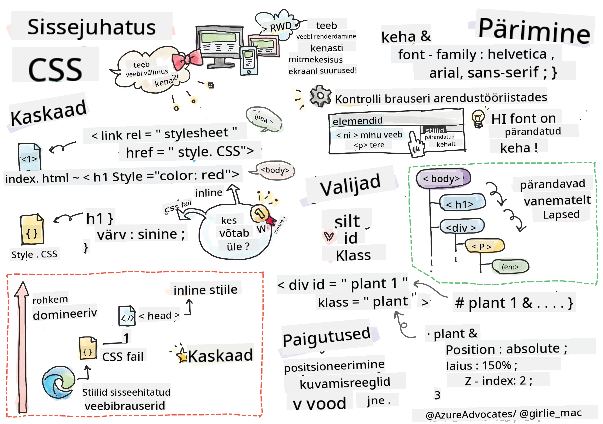
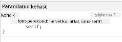
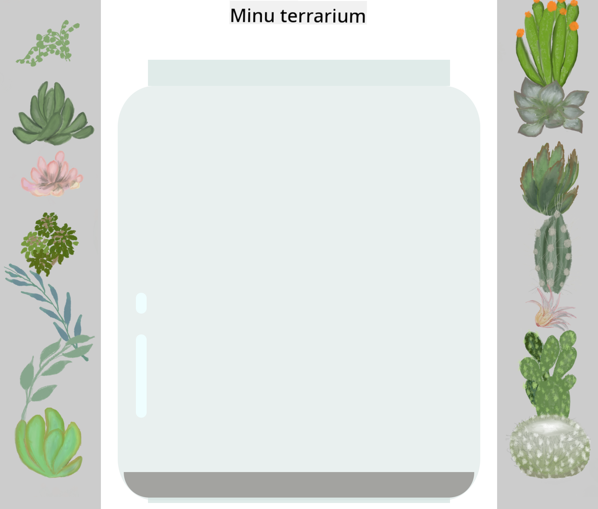

<!--
CO_OP_TRANSLATOR_METADATA:
{
  "original_hash": "acb5ae00cde004304296bb97da8ff4c3",
  "translation_date": "2025-10-11T11:58:39+00:00",
  "source_file": "3-terrarium/2-intro-to-css/README.md",
  "language_code": "et"
}
-->
# Terrariumi projekt, 2. osa: Sissejuhatus CSS-i

  
> Sketchnote autor: [Tomomi Imura](https://twitter.com/girlie_mac)

## Loengu-eelne viktoriin

[Loengu-eelne viktoriin](https://ff-quizzes.netlify.app/web/quiz/17)

### Sissejuhatus

CSS ehk kaskaadlaadistikud lahendavad olulise veebiarenduse probleemi: kuidas muuta oma veebisait visuaalselt atraktiivseks. Rakenduste kujundamine muudab need kasutajasõbralikumaks ja ilusamaks; CSS-i abil saab luua ka reageeriva veebidisaini (Responsive Web Design, RWD) – see võimaldab rakendustel hea välja näha olenemata ekraani suurusest. CSS ei ole ainult välimuse parandamiseks; selle spetsifikatsioon hõlmab ka animatsioone ja teisendusi, mis võimaldavad luua rakendustele keerukaid interaktsioone. CSS-i töörühm aitab hoida ajakohasena praeguseid CSS-i spetsifikatsioone; nende tööd saab jälgida [World Wide Web Consortiumi lehel](https://www.w3.org/Style/CSS/members).

> Pange tähele, et CSS on pidevalt arenev keel, nagu kogu veeb, ja mitte kõik brauserid ei toeta uuemaid spetsifikatsioone. Kontrollige alati oma rakendusi, kasutades [CanIUse.com](https://caniuse.com).

Selles tunnis lisame oma veebitarrendile stiile ja õpime tundma mitmeid CSS-i kontseptsioone: kaskaadi, pärandamist, selektoreid, positsioneerimist ja CSS-i kasutamist paigutuste loomiseks. Selle käigus kujundame terrariumi ja loome selle tegeliku välimuse.

### Eeltingimus

Teie terrariumi HTML peaks olema valmis ja kujundamiseks valmis.

> Vaadake videot

> 
> [](https://www.youtube.com/watch?v=6yIdOIV9p1I)

### Ülesanne

Looge oma terrariumi kausta uus fail nimega `style.css`. Importige see fail `<head>` sektsiooni:

```html
<link rel="stylesheet" href="./style.css" />
```

---

## Kaskaad

Kaskaadlaadistikud sisaldavad ideed, et stiilid "kaskaadivad", nii et stiili rakendamine sõltub selle prioriteedist. Veebisaidi autori määratud stiilid on prioriteetsemad kui brauseri määratud stiilid. "Inline" stiilid on prioriteetsemad kui välises stiililehes määratud stiilid.

### Ülesanne

Lisage oma `<h1>` sildile inline-stiil "color: red":

```HTML
<h1 style="color: red">My Terrarium</h1>
```

Seejärel lisage oma `style.css` faili järgmine kood:

```CSS
h1 {
 color: blue;
}
```

✅ Milline värv kuvatakse teie veebirakenduses? Miks? Kas leiate viisi stiilide ülekirjutamiseks? Millal te seda teha tahaksite või miks mitte?

---

## Pärandamine

Stiilid päranduvad esivanema stiilist järeltulijale, nii et pesastatud elemendid pärivad oma vanemate stiilid.

### Ülesanne

Määrake keha (body) fondiks kindel font ja kontrollige, kas pesastatud elemendi font muutub:

```CSS
body {
	font-family: helvetica, arial, sans-serif;
}
```

Avage oma brauseri konsoolis 'Elements' vahekaart ja jälgige H1 fondi. See pärib oma fondi kehast, nagu brauseris näidatud:



✅ Kas saate muuta pesastatud stiili pärima mõne muu omaduse?

---

## CSS-i selektorid

### Sildid

Siiani on teie `style.css` failis ainult mõned sildid kujundatud ja rakendus näeb üsna kummaline välja:

```CSS
body {
	font-family: helvetica, arial, sans-serif;
}

h1 {
	color: #3a241d;
	text-align: center;
}
```

Selline sildi kujundamise viis annab teile kontrolli unikaalsete elementide üle, kuid terrariumis olevate paljude taimede stiilide juhtimiseks peate kasutama CSS-i selektoreid.

### ID-d

Lisage stiil, et paigutada vasak- ja parempoolsed konteinerid. Kuna on ainult üks vasak ja üks parem konteiner, on need märgitud ID-dega. Nende kujundamiseks kasutage `#`:

```CSS
#left-container {
	background-color: #eee;
	width: 15%;
	left: 0px;
	top: 0px;
	position: absolute;
	height: 100%;
	padding: 10px;
}

#right-container {
	background-color: #eee;
	width: 15%;
	right: 0px;
	top: 0px;
	position: absolute;
	height: 100%;
	padding: 10px;
}
```

Siin olete paigutanud need konteinerid absoluutse positsioneerimisega ekraani vasakule ja paremale küljele ning määranud nende laiuse protsentides, et need saaksid väiksemate mobiiliekraanide jaoks skaleeruda.

✅ See kood kordub üsna palju, seega pole see "DRY" (Don't Repeat Yourself); kas leiate parema viisi nende ID-de kujundamiseks, võib-olla ID ja klassi abil? Peaksite muutma märgistust ja refaktoreerima CSS-i:

```html
<div id="left-container" class="container"></div>
```

### Klassid

Eelmises näites kujundasite kaks unikaalset elementi ekraanil. Kui soovite, et stiilid rakenduksid paljudele elementidele ekraanil, saate kasutada CSS-i klasse. Tehke seda, et paigutada taimed vasak- ja parempoolsetesse konteineritesse.

Pange tähele, et iga taime HTML-märgistusel on ID-de ja klasside kombinatsioon. ID-sid kasutatakse siin hiljem JavaScripti abil terrariumi taimede paigutuse manipuleerimiseks. Klassid aga annavad kõigile taimedele kindla stiili.

```html
<div class="plant-holder">
	
</div>
```

Lisage oma `style.css` faili järgmine kood:

```CSS
.plant-holder {
	position: relative;
	height: 13%;
	left: -10px;
}

.plant {
	position: absolute;
	max-width: 150%;
	max-height: 150%;
	z-index: 2;
}
```

Selles koodilõigus on märkimisväärne suhtelise ja absoluutse positsioneerimise segu, mida käsitleme järgmises jaotises. Vaadake, kuidas kõrgusi käsitletakse protsentides:

Määrasite taimehoidja kõrguseks 13%, mis on hea suurus, et kõik taimed oleksid igas vertikaalses konteineris nähtavad ilma kerimiseta.

Taimehoidja on nihutatud vasakule, et taimed oleksid oma konteineris rohkem tsentreeritud. Piltidel on suur hulk läbipaistvat tausta, et neid oleks lihtsam lohistada, seega tuleb neid vasakule nihutada, et need ekraanil paremini sobituksid.

Seejärel on taimele määratud maksimaalne laius 150%. See võimaldab sellel brauseri suuruse muutumisel skaleeruda. Proovige oma brauseri suurust muuta; taimed jäävad oma konteineritesse, kuid skaleeruvad vastavalt.

Samuti on märkimisväärne z-indeksi kasutamine, mis kontrollib elemendi suhtelist kõrgust (nii et taimed asetsevad konteineri peal ja näivad olevat terrariumis sees).

✅ Miks on teil vaja nii taimehoidja kui ka taime CSS-selektorit?

## CSS-i positsioneerimine

Positsioneerimisomaduste (staatiline, suhteline, fikseeritud, absoluutne ja kleepuv positsioneerimine) segamine võib olla veidi keeruline, kuid õigesti tehes annab see teile hea kontrolli oma lehtede elementide üle.

Absoluutselt positsioneeritud elemendid paigutatakse lähima positsioneeritud esivanema suhtes ja kui sellist pole, siis dokumendi keha suhtes.

Suhteliselt positsioneeritud elemendid paigutatakse CSS-i juhiste alusel, et kohandada nende asukohta algsest positsioonist.

Meie näites on `plant-holder` suhteliselt positsioneeritud element, mis on paigutatud absoluutse positsioneerimisega konteineri sisse. Tulemuseks on see, et külgriba konteinerid on kinnitatud vasakule ja paremale, ning taimehoidja on pesastatud, kohandades end külgribade sees, jättes ruumi taimede paigutamiseks vertikaalsesse ritta.

> Ka `plant` ise on absoluutse positsioneerimisega, mis on vajalik selle lohistatavaks muutmiseks, nagu avastate järgmises tunnis.

✅ Katsetage külgkonteinerite ja taimehoidja positsioneerimistüüpide vahetamist. Mis juhtub?

## CSS-i paigutused

Nüüd kasutate õpitut, et luua terrarium ise, kasutades ainult CSS-i!

Kõigepealt kujundage `.terrarium` div-i lapsed CSS-i abil ümarateks ristkülikuteks:

```CSS
.jar-walls {
	height: 80%;
	width: 60%;
	background: #d1e1df;
	border-radius: 1rem;
	position: absolute;
	bottom: 0.5%;
	left: 20%;
	opacity: 0.5;
	z-index: 1;
}

.jar-top {
	width: 50%;
	height: 5%;
	background: #d1e1df;
	position: absolute;
	bottom: 80.5%;
	left: 25%;
	opacity: 0.7;
	z-index: 1;
}

.jar-bottom {
	width: 50%;
	height: 1%;
	background: #d1e1df;
	position: absolute;
	bottom: 0%;
	left: 25%;
	opacity: 0.7;
}

.dirt {
	width: 60%;
	height: 5%;
	background: #3a241d;
	position: absolute;
	border-radius: 0 0 1rem 1rem;
	bottom: 1%;
	left: 20%;
	opacity: 0.7;
	z-index: -1;
}
```

Pange tähele siin protsentide kasutamist. Kui vähendate oma brauseri suurust, näete, kuidas purk samuti skaleerub. Samuti märkate purgi elementide laiuse ja kõrguse protsente ning seda, kuidas iga element on absoluutselt paigutatud keskele, kinnitatud vaateakna põhja.

Kasutame ka `rem`-i border-radius jaoks, mis on fondiga seotud mõõtühik. Lugege selle suhtelise mõõtühiku kohta rohkem [CSS-i spetsifikatsioonist](https://www.w3.org/TR/css-values-3/#font-relative-lengths).

✅ Proovige muuta purgi värve ja läbipaistvust võrreldes mullaga. Mis juhtub? Miks?

---

## 🚀Väljakutse

Lisage purgi vasakule alumisele alale "mull" läige, et muuta see klaasilaadsemaks. Kujundate `.jar-glossy-long` ja `.jar-glossy-short`, et need näeksid välja nagu peegeldus. See näeks välja selline:



Loengu-järgse viktoriini täitmiseks läbige see Learn moodul: [Kujunda oma HTML-rakendus CSS-iga](https://docs.microsoft.com/learn/modules/build-simple-website/4-css-basics/?WT.mc_id=academic-77807-sagibbon)

## Loengu-järgne viktoriin

[Loengu-järgne viktoriin](https://ff-quizzes.netlify.app/web/quiz/18)

## Ülevaade ja iseseisev õppimine

CSS võib tunduda petlikult lihtne, kuid rakenduse täiuslikuks kujundamiseks kõigi brauserite ja ekraanisuuruste jaoks on palju väljakutseid. CSS-Grid ja Flexbox on tööriistad, mis on loodud selle töö veidi struktureeritumaks ja usaldusväärsemaks muutmiseks. Õppige nende tööriistade kohta, mängides [Flexbox Froggy](https://flexboxfroggy.com/) ja [Grid Garden](https://codepip.com/games/grid-garden/).

## Ülesanne

[CSS-i refaktoreerimine](assignment.md)

---

**Vastutusest loobumine**:  
See dokument on tõlgitud AI tõlketeenuse [Co-op Translator](https://github.com/Azure/co-op-translator) abil. Kuigi püüame tagada täpsust, palume arvestada, et automaatsed tõlked võivad sisaldada vigu või ebatäpsusi. Algne dokument selle algses keeles tuleks pidada autoriteetseks allikaks. Olulise teabe puhul soovitame kasutada professionaalset inimtõlget. Me ei vastuta arusaamatuste või valesti tõlgenduste eest, mis võivad tekkida selle tõlke kasutamise tõttu.