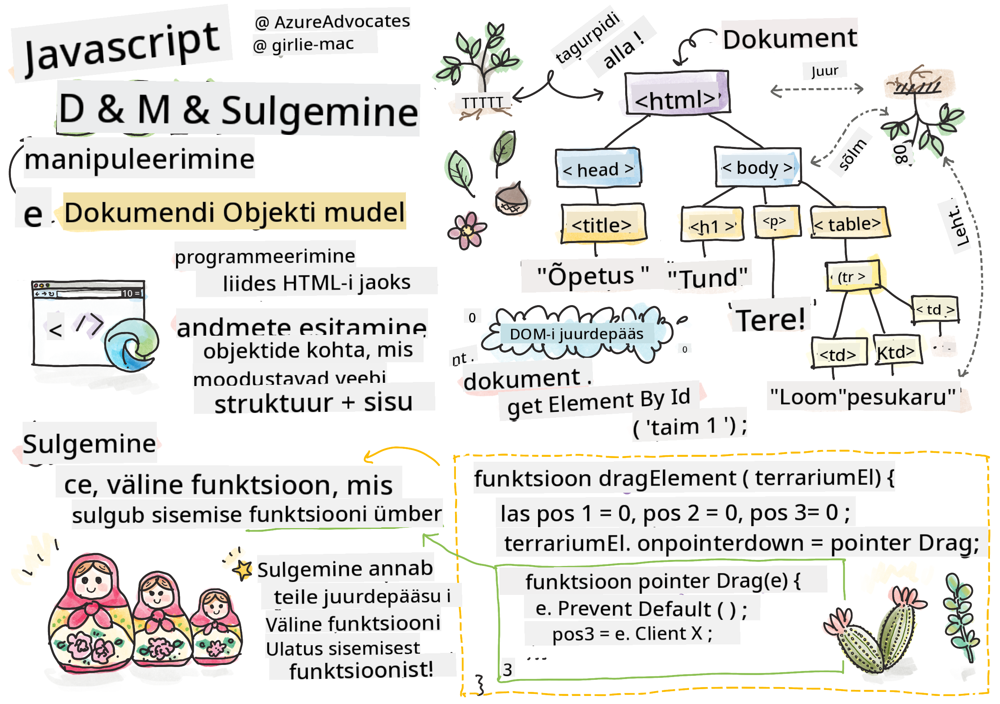
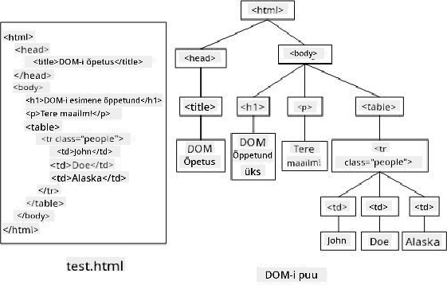
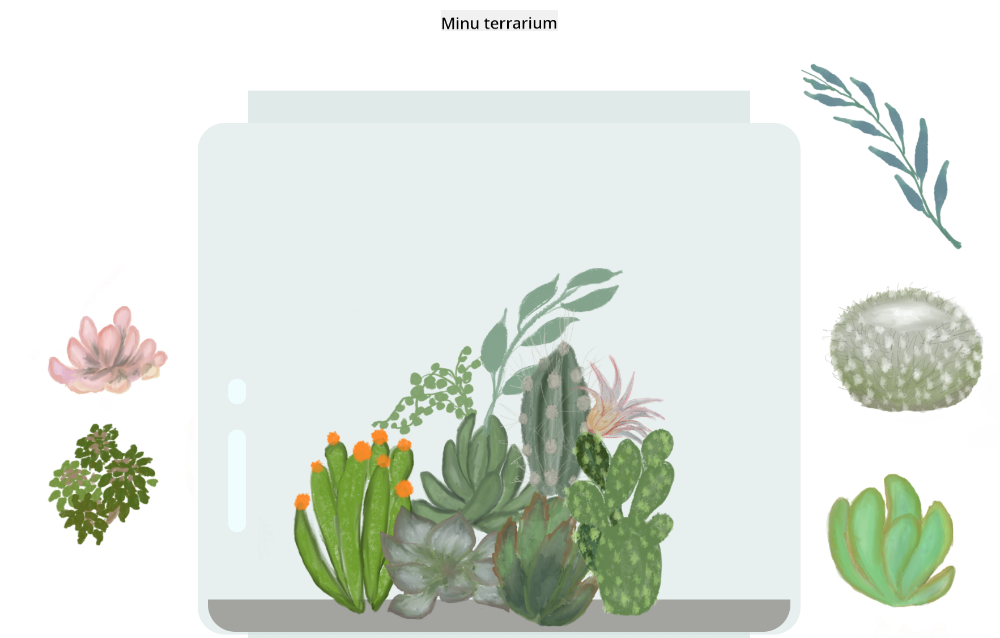

<!--
CO_OP_TRANSLATOR_METADATA:
{
  "original_hash": "61c14b27044861e5e69db35dd52c4403",
  "translation_date": "2025-10-11T11:57:30+00:00",
  "source_file": "3-terrarium/3-intro-to-DOM-and-closures/README.md",
  "language_code": "et"
}
-->
# Terrariumi projekt, osa 3: DOM-i manipuleerimine ja sulund


> Sketš Tomomi Imura poolt [Tomomi Imura](https://twitter.com/girlie_mac)

## Loengu-eelne viktoriin

[Loengu-eelne viktoriin](https://ff-quizzes.netlify.app/web/quiz/19)

### Sissejuhatus

DOM-i ehk "Dokumendi Objektimudeli" manipuleerimine on veebiarenduse oluline osa. Vastavalt [MDN-i](https://developer.mozilla.org/docs/Web/API/Document_Object_Model/Introduction) definitsioonile: "Dokumendi Objektimudel (DOM) on andmete esitus, mis kujutab veebidokumendi struktuuri ja sisu objekte." DOM-i manipuleerimisega seotud väljakutsed on sageli ajendanud kasutama JavaScripti raamistikke, mitte tavalist JavaScripti, et DOM-i hallata, kuid meie saame hakkama ka ilma!

Lisaks tutvustatakse selles õppetükis [JavaScripti sulundit](https://developer.mozilla.org/docs/Web/JavaScript/Closures), mida võib mõelda kui funktsiooni, mis on teise funktsiooni sees, võimaldades sisemisel funktsioonil juurdepääsu välimise funktsiooni ulatusele.

> JavaScripti sulundid on ulatuslik ja keeruline teema. Selles õppetükis käsitletakse kõige põhilisemat ideed, et terrariumi koodis leidub sulund: sisemine ja välimine funktsioon, mis on konstrueeritud nii, et sisemine funktsioon pääseb välimise funktsiooni ulatusele. Täpsema teabe saamiseks külastage [põhjalikku dokumentatsiooni](https://developer.mozilla.org/docs/Web/JavaScript/Closures).

Me kasutame sulundit DOM-i manipuleerimiseks.

Mõelge DOM-ist kui puust, mis kujutab kõiki viise, kuidas veebilehe dokumenti saab manipuleerida. Erinevad API-d (rakendusliidesed) on loodud selleks, et programmeerijad saaksid oma valitud programmeerimiskeeles DOM-i juurde pääseda ja seda redigeerida, muuta, ümber korraldada ja muul viisil hallata.



> DOM-i ja seda viitava HTML-i märgistuse kujutis. Autor [Olfa Nasraoui](https://www.researchgate.net/publication/221417012_Profile-Based_Focused_Crawler_for_Social_Media-Sharing_Websites)

Selles õppetükis lõpetame oma interaktiivse terrariumi projekti, luues JavaScripti, mis võimaldab kasutajal lehel taimi manipuleerida.

### Eeltingimus

Sul peaks olema terrariumi HTML ja CSS valmis. Selle õppetüki lõpuks saad taimi terrariumisse ja sealt välja liigutada, neid lohistades.

### Ülesanne

Loo oma terrariumi kaustas uus fail nimega `script.js`. Impordi see fail `<head>` sektsiooni:

```html
	<script src="./script.js" defer></script>
```

> Märkus: kasuta `defer`-atribuuti, kui impordid välise JavaScripti faili HTML-faili, et JavaScript käivituks alles pärast HTML-faili täielikku laadimist. Võid kasutada ka `async`-atribuuti, mis võimaldab skriptil käivituda HTML-i parsimise ajal, kuid meie puhul on oluline, et HTML-i elemendid oleksid täielikult saadaval enne, kui lohistamise skript käivitub.
---

## DOM-i elemendid

Esimene asi, mida pead tegema, on luua viited elementidele, mida soovid DOM-is manipuleerida. Meie puhul on need 14 taime, mis praegu külgribades ootavad.

### Ülesanne

```html
dragElement(document.getElementById('plant1'));
dragElement(document.getElementById('plant2'));
dragElement(document.getElementById('plant3'));
dragElement(document.getElementById('plant4'));
dragElement(document.getElementById('plant5'));
dragElement(document.getElementById('plant6'));
dragElement(document.getElementById('plant7'));
dragElement(document.getElementById('plant8'));
dragElement(document.getElementById('plant9'));
dragElement(document.getElementById('plant10'));
dragElement(document.getElementById('plant11'));
dragElement(document.getElementById('plant12'));
dragElement(document.getElementById('plant13'));
dragElement(document.getElementById('plant14'));
```

Mis siin toimub? Sa viitad dokumendile ja otsid selle DOM-ist elementi konkreetse Id-ga. Tuleta meelde, et HTML-i esimeses õppetükis andsid igale taimepildile individuaalse Id (`id="plant1"`)? Nüüd saad seda tööd ära kasutada. Pärast iga elemendi tuvastamist edastad selle elemendi funktsioonile `dragElement`, mille ehitad kohe. Seega muutub HTML-i element lohistatavaks või saab selleks peagi.

✅ Miks viidatakse elementidele Id järgi? Miks mitte nende CSS-klassi järgi? Võid vastuse leidmiseks viidata eelmisele CSS-i õppetükile.

---

## Sulund

Nüüd oled valmis looma `dragElement` sulundi, mis on välimine funktsioon, mis ümbritseb sisemist funktsiooni või funktsioone (meie puhul on neid kolm).

Sulundid on kasulikud, kui üks või mitu funktsiooni vajavad juurdepääsu välimise funktsiooni ulatusele. Siin on näide:

```javascript
function displayCandy(){
	let candy = ['jellybeans'];
	function addCandy(candyType) {
		candy.push(candyType)
	}
	addCandy('gumdrops');
}
displayCandy();
console.log(candy)
```

Selles näites ümbritseb `displayCandy` funktsioon funktsiooni, mis lisab uue kommitüübi juba olemasolevasse massiivi. Kui sa selle koodi käivitaksid, oleks `candy` massiiv määramata, kuna see on lokaalne muutuja (lokaalne sulundile).

✅ Kuidas saaksid muuta `candy` massiivi kättesaadavaks? Proovi see sulundist välja viia. Nii muutub massiiv globaalseks, mitte ainult sulundi lokaalse ulatuse piires kättesaadavaks.

### Ülesanne

Loo `script.js`-i elementide deklaratsioonide alla funktsioon:

```javascript
function dragElement(terrariumElement) {
	//set 4 positions for positioning on the screen
	let pos1 = 0,
		pos2 = 0,
		pos3 = 0,
		pos4 = 0;
	terrariumElement.onpointerdown = pointerDrag;
}
```

`dragElement` saab oma `terrariumElement` objekti skripti ülaosas tehtud deklaratsioonidest. Seejärel määrad objekti jaoks mõned lokaalsed positsioonid väärtusega `0`. Need on lokaalsed muutujad, mida manipuleeritakse iga elemendi puhul, kui lisad sulundi sees lohistamisfunktsionaalsuse. Terrarium täidetakse nende lohistatud elementidega, seega peab rakendus jälgima, kuhu need paigutatakse.

Lisaks määratakse funktsioonile `terrariumElement`, mis edastatakse sellele funktsioonile, `pointerdown` sündmus, mis on osa [veebi API-dest](https://developer.mozilla.org/docs/Web/API), mis on loodud DOM-i haldamiseks. `onpointerdown` käivitub, kui nuppu vajutatakse või meie puhul puudutatakse lohistatavat elementi. See sündmuste käsitleja töötab nii [veebi- kui mobiilibrauserites](https://caniuse.com/?search=onpointerdown), mõne erandiga.

✅ [Sündmuste käsitlejal `onclick`](https://developer.mozilla.org/docs/Web/API/GlobalEventHandlers/onclick) on palju laiem tugi erinevates brauserites; miks sa ei kasutaks seda siin? Mõtle täpselt sellele ekraani interaktsioonile, mida sa siin luua üritad.

---

## Pointerdrag funktsioon

`terrariumElement` on valmis lohistamiseks; kui `onpointerdown` sündmus käivitub, kutsutakse funktsioon `pointerDrag`. Lisa see funktsioon kohe selle rea alla: `terrariumElement.onpointerdown = pointerDrag;`:

### Ülesanne

```javascript
function pointerDrag(e) {
	e.preventDefault();
	console.log(e);
	pos3 = e.clientX;
	pos4 = e.clientY;
}
```

Toimub mitu asja. Esiteks takistad vaikimisi sündmusi, mis tavaliselt pointerdown-i korral toimuvad, kasutades `e.preventDefault();`. Nii saad rohkem kontrolli liidese käitumise üle.

> Tule selle rea juurde tagasi, kui oled skriptifaili täielikult ehitanud, ja proovi seda ilma `e.preventDefault()`-ta - mis juhtub?

Teiseks ava `index.html` brauseriaknas ja inspekteeri liidest. Kui klõpsad taime, näed, kuidas 'e' sündmus salvestatakse. Uuri sündmust, et näha, kui palju teavet kogutakse ühe pointerdown-i sündmuse kohta!

Järgmiseks pane tähele, kuidas lokaalsed muutujad `pos3` ja `pos4` määratakse väärtuseks e.clientX. Saad leida `e` väärtused inspekteerimispaneelilt. Need väärtused salvestavad taime x- ja y-koordinaadid hetkel, mil sa seda klõpsad või puudutad. Sul on vaja peent kontrolli taimede käitumise üle, kui neid klõpsad ja lohistad, seega jälgid nende koordinaate.

✅ Kas hakkab selgemaks saama, miks kogu rakendus on ehitatud ühe suure sulundiga? Kui see ei oleks sulund, kuidas sa säilitaksid ulatuse iga 14 lohistatava taime jaoks?

Lõpeta algne funktsioon, lisades veel kaks pointer-sündmuste manipuleerimist `pos4 = e.clientY` alla:

```html
document.onpointermove = elementDrag;
document.onpointerup = stopElementDrag;
```

Nüüd näitad, et soovid taime lohistada koos pointeriga, kui seda liigutad, ja et lohistamise žest peatuks, kui taime valik tühistatakse. `onpointermove` ja `onpointerup` kuuluvad samasse API-sse kui `onpointerdown`. Liides viskab nüüd vigu, kuna sa pole veel määratlenud funktsioone `elementDrag` ja `stopElementDrag`, seega ehita need järgmisena.

## Funktsioonid elementDrag ja stopElementDrag

Sulund lõpetatakse kahe sisemise funktsiooniga, mis haldavad, mis juhtub, kui taime lohistatakse ja lohistamine lõpetatakse. Soovitud käitumine on see, et saaksid igal ajal lohistada mis tahes taime ja paigutada selle ekraanil kuhu iganes. See liides on üsna paindlik (näiteks pole määratud langetustsooni), et saaksid oma terrariumi kujundada täpselt nii, nagu soovid, lisades, eemaldades ja ümber paigutades taimi.

### Ülesanne

Lisa funktsioon `elementDrag` kohe pärast `pointerDrag` sulgemiskõverat:

```javascript
function elementDrag(e) {
	pos1 = pos3 - e.clientX;
	pos2 = pos4 - e.clientY;
	pos3 = e.clientX;
	pos4 = e.clientY;
	console.log(pos1, pos2, pos3, pos4);
	terrariumElement.style.top = terrariumElement.offsetTop - pos2 + 'px';
	terrariumElement.style.left = terrariumElement.offsetLeft - pos1 + 'px';
}
```

Selles funktsioonis teed palju algpositsioonide 1-4 redigeerimist, mille määrasid välimise funktsiooni lokaalsed muutujad. Mis siin toimub?

Lohistamise ajal määrad `pos1` ümber, tehes selle võrdseks `pos3`-ga (mille määrasid varem `e.clientX`-ks) miinus praegune `e.clientX` väärtus. Sarnase operatsiooni teed `pos2`-ga. Seejärel määrad `pos3` ja `pos4` uuesti elemendi uutele X- ja Y-koordinaatidele. Saad neid muudatusi konsoolis jälgida, kui lohistad. Seejärel manipuleerid taime CSS-stiili, et määrata selle uus positsioon, lähtudes `pos1` ja `pos2` uutest positsioonidest, arvutades taime ülemise ja vasaku X- ja Y-koordinaadi, võrreldes selle nihkega nende uute positsioonidega.

> `offsetTop` ja `offsetLeft` on CSS-i omadused, mis määravad elemendi positsiooni selle vanema positsiooni alusel; vanem võib olla mis tahes element, mille positsioon ei ole `static`.

Kõik see positsioonide ümberarvutamine võimaldab sul terrariumi ja selle taimede käitumist peenhäälestada.

### Ülesanne

Viimane ülesanne liidese lõpetamiseks on lisada funktsioon `stopElementDrag` pärast `elementDrag` sulgemiskõverat:

```javascript
function stopElementDrag() {
	document.onpointerup = null;
	document.onpointermove = null;
}
```

See väike funktsioon lähtestab `onpointerup` ja `onpointermove` sündmused, et saaksid kas taime lohistamise uuesti alustada või hakata lohistama uut taime.

✅ Mis juhtub, kui sa ei määra neid sündmusi nulliks?

Nüüd oled oma projekti lõpetanud!

🥇Palju õnne! Oled lõpetanud oma kauni terrariumi. 

---

## 🚀Väljakutse

Lisa oma sulundisse uus sündmuste käsitleja, et taimedele midagi veel teha; näiteks topeltklõpsa taime, et tuua see ettepoole. Ole loov!

## Loengu-järgne viktoriin

[Loengu-järgne viktoriin](https://ff-quizzes.netlify.app/web/quiz/20)

## Ülevaade ja iseseisev õppimine

Kuigi elementide lohistamine ekraanil tundub triviaalne, on selleks palju viise ja palju karisid, sõltuvalt soovitud efektist. Tegelikult on olemas terve [lohistamise ja langetamise API](https://developer.mozilla.org/docs/Web/API/HTML_Drag_and_Drop_API), mida saad proovida. Me ei kasutanud seda selles moodulis, kuna soovitud efekt oli veidi erinev, kuid proovi seda API-d oma projektis ja vaata, mida suudad saavutada.

Leia rohkem teavet pointer-sündmuste kohta [W3C dokumentatsioonist](https://www.w3.org/TR/pointerevents1/) ja [MDN veebidokumentidest](https://developer.mozilla.org/docs/Web/API/Pointer_events).

Kontrolli alati brauseri võimekust [CanIUse.com](https://caniuse.com/) abil.

## Ülesanne

[Tee DOM-iga veidi rohkem tööd](assignment.md)

---

**Lahtiütlus**:  
See dokument on tõlgitud AI tõlketeenuse [Co-op Translator](https://github.com/Azure/co-op-translator) abil. Kuigi püüame tagada täpsust, palume arvestada, et automaatsed tõlked võivad sisaldada vigu või ebatäpsusi. Algne dokument selle algses keeles tuleks pidada autoriteetseks allikaks. Olulise teabe puhul soovitame kasutada professionaalset inimtõlget. Me ei vastuta selle tõlke kasutamisest tulenevate arusaamatuste või valesti tõlgenduste eest.