# Terrarium projekt Osa 3: DOM-i manipuleerimine ja JavaScripti sulud

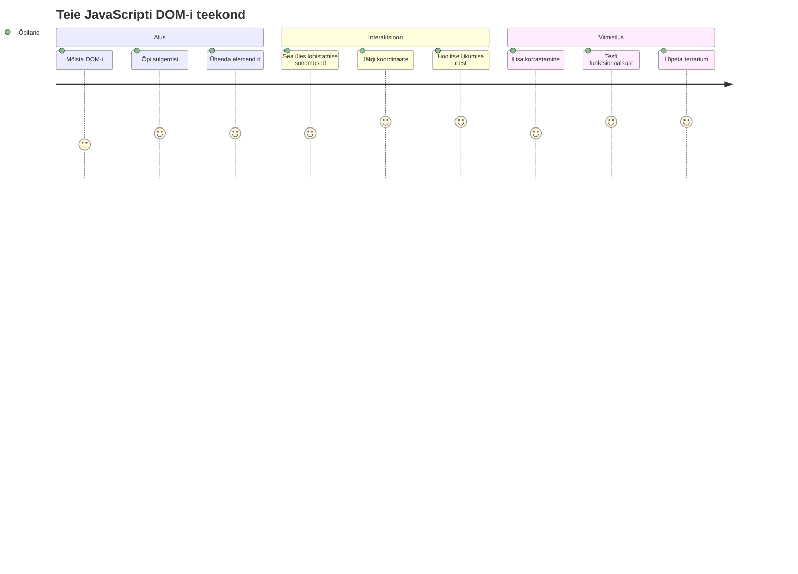
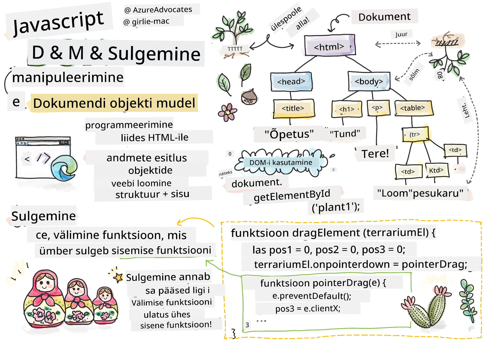
> Sketš [Tomomi Imura](https://twitter.com/girlie_mac) poolt

Tere tulemast ühe kõige kaasahaaravama veebiarenduse aspekti juurde – asjade interaktiivseks muutmine! Document Object Model (DOM) on nagu sild sinu HTMLi ja JavaScripti vahel ning täna kasutame seda, et tuua sinu terrarium ellu. Kui Tim Berners-Lee lõi esimese veebibrauseri, nägi ta ette veebi, kus dokumendid võiksid olla dünaamilised ja interaktiivsed – DOM teeb selle visiooni teoks.

Samuti uurime JavaScripti sulgude kontseptsiooni, mis võib alguses kõlada hirmutavalt. Mõtle sulgudele kui „mälu taskutele“, kus sinu funktsioonid saavad meeles pidada olulist infot. Nagu iga taim sinu terrariumis omaks oma andmekirje, mis jälgib tema asukohta. Selle õppetüki lõpuks mõistad, kui loomulikud ja kasulikud sulud on.

Siin on see, mida me ehitame: terrarium, kus kasutajad saavad taimi mugavalt lohistada ükskõik kuhu nad soovivad. Sa õpid DOM-i manipuleerimisvõtteid, mis toetavad kõike alates failide lohistamisest ja üleslaadimisest kuni interaktiivsete mängudeni. Teeme sinu terrariumist elava paiga.

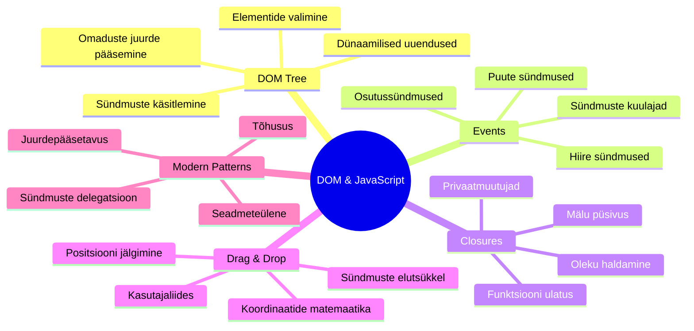
## Loengu-eelne viktoriin

[Loengu-eelne viktoriin](https://ff-quizzes.netlify.app/web/quiz/19)

## DOM mõistmine: Sinu värav interaktiivsetele veebilehtedele

Document Object Model (DOM) on viis, kuidas JavaScript suhtleb sinu HTML-elementidega. Kui sinu brauser laeb HTML-lehe, loob see sellelt lehelt mälu põhjal struktureeritud esitluse – see ongi DOM. Mõtle sellele nagu sugupuule, kus iga HTML element on pere liige, keda JavaScript saab ligipääseda, muuta või ümber paigutada.

DOM-i manipuleerimine muudab staatilised lehed interaktiivseteks kodulehtedeks. Iga kord, kui näed nuppu, mis hover‘i peale värvi muudab, sisu uuendamist ilma lehte värskendamata või elemente, mida saad hiirega lohistada – see kõik on DOM-i manipuleerimine töös.

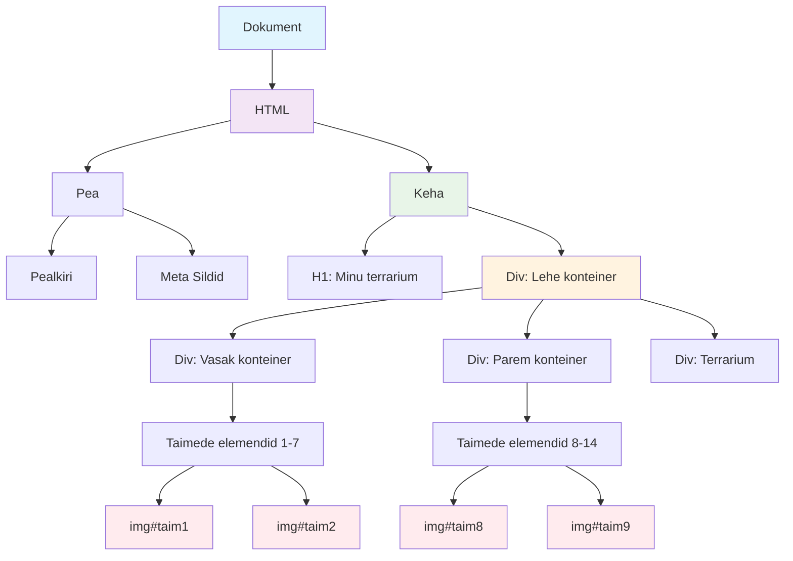
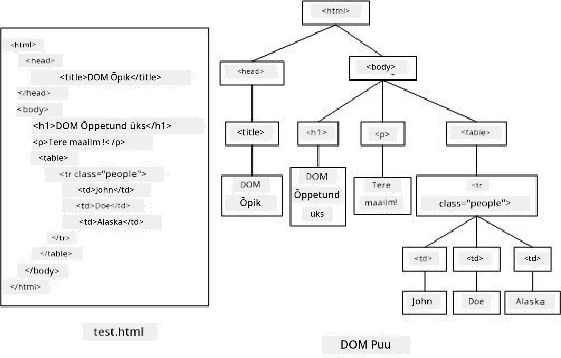

> DOM-i ja HTML-i märgenduse kujutis, mis viitab sellele. Autor [Olfa Nasraoui](https://www.researchgate.net/publication/221417012_Profile-Based_Focused_Crawler_for_Social_Media-Sharing_Websites)

**Siin on, mis teeb DOM-i võimsaks:**
- **Annavad** struktureeritud viisi ligipääsuks iga lehe elemendile
- **Võimaldavad** dünaamilisi sisuuuendusi ilma lehe värskenduseta
- **Lubavad** reaalajas vastamise kasutaja toimingutele nagu klikid ja lohistamine
- **Loovad** aluse tänapäevastele interaktiivsetele veebirakendustele

## JavaScripti sulud: organiseeritud ja võimeka koodi loomine

[JavaScripti sulud](https://developer.mozilla.org/docs/Web/JavaScript/Closures) on nagu funktsioonile oma privaatne tööruum, millel on püsiv mälu. Mõtle Darwin’i tihastele Galápagose saartel, kes igaüks arendasid spetsialiseerunud nokad vastavalt oma keskkonnale – sulud töötavad sarnaselt, luues spetsiaalseid funktsioone, mis „mäletavad“ oma konkreetset konteksti isegi pärast seda, kui nende ülemfunktsioon on lõpetanud.

Meie terrariumis aitavad sulud igal taimedel meeles pidada oma asukoha koordinaate sõltumatult. See muster esineb professionaalses JavaScripti arenduses laialdaselt ja on väärtuslik mõista.

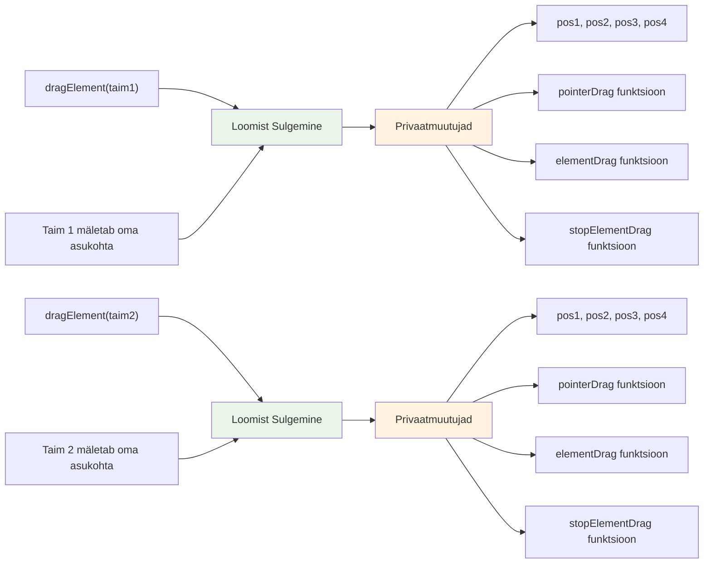
> 💡 **Sulude mõistmine**: Sulud on JavaScriptis oluline teema ja paljud arendajad kasutavad neid aastaid, enne kui kõik teoreetilised aspektid täielikult selgeks saavad. Täna keskendume praktilisele rakendusele – näed sulud loomulikult tekkimas, kui ehitame oma interaktiivseid funktsioone. Mõistmine areneb koos sellega, kuidas nad lahendavad reaalseid probleeme.


> DOM-i ja HTML-i märgenduse kujutis, mis viitab sellele. Autor [Olfa Nasraoui](https://www.researchgate.net/publication/221417012_Profile-Based_Focused_Crawler_for_Social_Media-Sharing_Websites)

Selles õppetükis viime lõpule oma interaktiivse terrariumi projekti, luues JavaScripti, mis võimaldab kasutajal taimede asukohti lehel manipuleerida.

## Enne alustamist: edu tagamine

Sul on vaja oma HTML ja CSS faile varasematest terrariumi õppetundidest – me muudame selle staatilise disaini nüüd interaktiivseks. Kui liitudes esimese korraga, on nende õppetükkide lõpetamine oluline konteksti mõistmiseks.

Siin on see, mida ehitame:
- **Sile lohistamine ja kukutamine** kõigile terrariumi taimedele
- **Koordinaatide jälgimine**, nii et taimed mäletavad oma positsioone
- **Täielik interaktiivne liides** tavalise JavaScripti abil
- **Puhas ja organiseeritud kood** sulgude mustrite abil

## JavaScripti faili seadistamine

Loome JavaScripti faili, mis teeb sinu terrariumi interaktiivseks.

**Samm 1: loo oma skriptifail**

Terrariumi kausta loo uus fail nimega `script.js`.

**Samm 2: lisa JavaScript oma HTML-ile**

Lisa see skripti silt oma `index.html` faili `<head>` sektsiooni:

```html
<script src="./script.js" defer></script>
```

**Miks `defer` atribuut on oluline:**
- **Tagab**, et sinu JavaScript ootab kuni kogu HTML on laetud
- **Väldib** vigu, kus JavaScript otsib elemente, mida veel pole
- **Kindlustab**, et kõik taimelemendid on kasutajaliidese jaoks olemas
- **Parem jõudlus** kui skripte asetada lehe lõppu

> ⚠️ **Tähtis märkus**: `defer` atribuut hoiab ära levinud ajastusvead. Ilma selleta võib JavaScript proovida ligi pääseda HTML-elementidele enne nende laetamist, mis põhjustab vigu.

---

## JavaScripti ühendamine HTML elementidega

Enne elementide lohistatavaks tegemist peab JavaScript need DOM-ist leidma. Võid mõelda sellele kui raamatukogu kataloogi süsteemile – kui sul on katalooginumber, leiad täpselt vajaliku raamatu ja pääsed ligi kogu tema sisule.

Kasutame selleks meetodit `document.getElementById()`. See on nagu täpne arhiivisüsteem – annad ID, see leiab täpselt vajaliku HTML-elemendi.

### Lohistamise võimaldamine kõigile taimedele

Lisa see kood oma `script.js` faili:

```javascript
// Luba lohistamise funktsioon kõigi 14 taime jaoks
dragElement(document.getElementById('plant1'));
dragElement(document.getElementById('plant2'));
dragElement(document.getElementById('plant3'));
dragElement(document.getElementById('plant4'));
dragElement(document.getElementById('plant5'));
dragElement(document.getElementById('plant6'));
dragElement(document.getElementById('plant7'));
dragElement(document.getElementById('plant8'));
dragElement(document.getElementById('plant9'));
dragElement(document.getElementById('plant10'));
dragElement(document.getElementById('plant11'));
dragElement(document.getElementById('plant12'));
dragElement(document.getElementById('plant13'));
dragElement(document.getElementById('plant14'));
```

**Siin on see, mida see kood teeb:**
- **Leiab** iga taimelemendi DOM-ist unikaalse ID järgi
- **Hankib** JavaScripti viite igale HTML elemendile
- **Edastab** iga elemendi `dragElement` funktsioonile (mida loome järgmises sammus)
- **Valmistab** iga taime ette lohistamiseks
- **Ühendab** sinu HTML struktuuri JavaScripti funktsionaalsusega

> 🎯 **Miks kasutada ID-sid klasside asemel?** ID-d annavad unikaalse identifikaatori konkreetsetele elementidele, samas kui CSS klassid on mõeldud gruppide stiilimiseks. Kui JavaScript peab manipuleerima üksikute elementidega, annavad ID-d täpsuse ja parema jõudluse.

> 💡 **Nipp:** Pane tähele, kuidas me kutsume `dragElement()` iga taime kohta eraldi. See tagab, et iga taim saab oma sõltumatu lohistamise käitumise, mis on sujuva kasutajakogemuse jaoks keskne.

### 🔄 **Pedagoogiline kontroll**
**DOM ühenduse mõistmine**: Enne lohistamise funktsionaalsusest edasi minemist kontrolli, kas saad:
- ✅ Selgitada, kuidas `document.getElementById()` HTML elemente leiab
- ✅ Mõista, miks kasutame iga taime jaoks unikaalset ID-d
- ✅ Kirjeldada `defer` atribuudi eesmärki skriptisiltides
- ✅ Tuvastada, kuidas JavaScript ja HTML ühenduvad läbi DOM-i

**Kiire enesetest**: Mis juhtuks, kui kahel elemendil oleks sama ID? Miks `getElementById()` tagastab ainult ühe elemendi?
*Vastus: ID-d peaksid olema unikaalsed; kui neid on duplikaate, tagastatakse vaid esimene element*

---

## dragElement sulgu loomine

Nüüd loome oma lohistamise funktsionaalsuse südame: sulgu, mis haldab lohistamise käitumist iga taime jaoks. See sulg sisaldab mitut sisemist funktsiooni, mis töötavad koos hiire liikumise jälgimiseks ja elemendi koordinaatide uuendamiseks.

Sulud on selle ülesande jaoks ideaalsed, sest võimaldavad luua „privaatseid“ muutujaid, mis püsivad funktsiooni kutsete vahel, andes igale taimele iseseisva koordinaatide jälgimise süsteemi.

### Sulgude mõistmine lihtsa näite abil

Näitan sulgusid lihtsa näitega, mis illustreerib kontseptsiooni:

```javascript
function createCounter() {
    let count = 0; // See on nagu privaatmuutuja
    
    function increment() {
        count++; // Sisemine funktsioon mäletab välimist muutujat
        return count;
    }
    
    return increment; // Me anname tagasi sisemise funktsiooni
}

const myCounter = createCounter();
console.log(myCounter()); // 1
console.log(myCounter()); // 2
```

**Siin toimub sulgu mustri raames:**
- **Luuakse** privaatne `count` muutuja, mis eksisteerib ainult selles sulgus
- **Sisemine funktsioon** pääseb selle välisvariatsiooni ligi ja saab seda muuta (sulgu mehhanism)
- **Kui me tagastame** sisemise funktsiooni, säilitab see ühenduse privaatse andmega
- **Isegi pärast seda**, kui `createCounter()` lõpetab töö, püsib `count` muutujana ja mäletab oma väärtust

### Miks sulud sobivad lohistamise funktsionaalsuseks

Meie terrariumi puhul peab iga taim meeles pidama oma praeguseid asukoordinaate. Sulud on selleks täiuslik lahendus:

**Meie projekti peamised eelised:**
- **Hoidab** privaatseid positsioonimuutujaid iga taime jaoks eraldi
- **Säilitab** koordinaadiandmeid lohistamise sündmuste vahel
- **Vältab** konfliktseid muutujaid erinevate lohistatavate elementide vahel
- **Loob** puhta ja organiseeritud koodistruktuuri

> 🎯 **Õpieesmärk**: Sulge ei pea kohe kõike vallutama. Keskendu sellele, kuidas need aitavad meil koodi organiseerida ja säilitada olekut meie lohistamisfunktsionaalsuse jaoks.

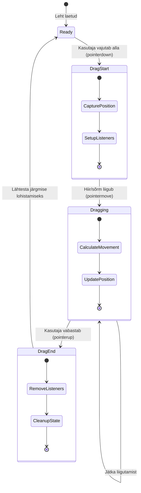
### dragElement funktsiooni loomine

Nüüd ehitame peamise funktsiooni, mis haldab kogu lohistamise loogikat. Lisa see funktsioon oma taime elementide deklaratsioonide alla:

```javascript
function dragElement(terrariumElement) {
    // Initsialiseeri asukoha jälgimise muutujad
    let pos1 = 0,  // Eelmine hiire X asukoht
        pos2 = 0,  // Eelmine hiire Y asukoht
        pos3 = 0,  // Praegune hiire X asukoht
        pos4 = 0;  // Praegune hiire Y asukoht
    
    // Sea üles algne lohistamise sündmuse kuulaja
    terrariumElement.onpointerdown = pointerDrag;
}
```

**Positsioonide jälgimise süsteemi mõistmine:**
- **`pos1` ja `pos2`**: Salvestavad vanade ja uute hiirepositsioonide erinevuse
- **`pos3` ja `pos4`**: Jälgivad hiire praeguseid koordinaate
- **`terrariumElement`**: Konkreetne taimeelement, mida me lohistame
- **`onpointerdown`**: Sündmus, mis käivitub kui kasutaja alustab lohistamist

**Nii töötab sulgu muster:**
- **Luuakse** privaatsete positsioonimuutujatega taimeelementide jaoks sulg
- **Hoidab** neid muutujaid kogu lohistamise kestel
- **Tagab**, et iga taim jälgib oma koordinaate iseseisvalt
- **Pakub** puhtat liidest `dragElement` funktsiooni kaudu

### Miks kasutada pointer-sündmusi?

Võid mõelda, miks kasutame `onpointerdown` asemel tavalisemat `onclick`. Siin põhjused:

| Sündmuse tüüp | Sobib | Konks |
|---------------|-------------|------------|
| `onclick` | Lihtsad nupuvajutused | Ei sobi lohistamiseks (ainult klikid ja vabastused) |
| `onpointerdown` | Hiir ja puuteekraanid | Uus, kuid tänapäeval hästi toetatud |
| `onmousedown` | Ainult lauaarvuti hiir | Jäetakse mobiilikasutajad ilma |

**Miks pointer-sündmused sobivad meie ehitatava jaoks:**
- **Töötab hästi** olgu kas hiir, sõrm või isegi pliiats kasutusel
- **Tundub ühesugune** sülearvutis, tahvelarvutis või telefonis
- **Haldab** tegelikku lohistamise liikumist (mitte ainult klõpsu)
- **Tagab** sujuva kogemuse, mida kasutajad tänapäevastelt veebirakendustelt ootavad

> 💡 **Tulevikukindlus**: Pointer-sündmused on tänapäevane viis kasutajategevuste käsitlemiseks. Selle asemel, et kirjutada eraldi kood hiire ja puute jaoks, saad mõlemad automaatselt kaasa. Lahe, eks?

### 🔄 **Pedagoogiline kontroll**
**Sündmuste mõistmine**: Peatu ja kinnita oma arusaam sündmustest:
- ✅ Miks me kasutame pointer-sündmusi hiire sündmuste asemel?
- ✅ Kuidas sulgude muutujaid säilitatakse funktsioonide kutsumise vahel?
- ✅ Mis rolli täidab `preventDefault()` sujuvas lohistamises?
- ✅ Miks lisame event listenerid dokumendile, mitte üksikutele elementidele?

**Tõeline elukogemus**: Mõtle drag-and-drop liidestele, mida kasutad iga päev:
- **Failide üleslaadimine**: Failide lohistamine brauseriaknasse
- **Kanban tahvlid**: Ülesannete liigutamine veergude vahel
- **Pildigaleriid**: Piltide järjekorra muutmine
- **Mobiililiidesed**: Pühkimine ja lohistamine puuteekraanidel

---

## pointerDrag funktsioon: lohistamise alguse tabamine

Kui kasutaja vajutab taimele alla (hiireklõpsuga või sõrmega), käivitub `pointerDrag` funktsioon. See funktsioon tabab algkoordinadid ja seadistab lohistamissüsteemi.

Lisa see funktsioon oma `dragElement` sulgu, kohe pärast rida `terrariumElement.onpointerdown = pointerDrag;`:

```javascript
function pointerDrag(e) {
    // Takista brauseri vaikekäitumist (näiteks teksti valimine)
    e.preventDefault();
    
    // Võta kinni algne hiire/puutepositsioon
    pos3 = e.clientX;  // X-koordinaat, kus lohistamine algas
    pos4 = e.clientY;  // Y-koordinaat, kus lohistamine algas
    
    // Sea üles sündmuste kuulajad lohistamise protsessiks
    document.onpointermove = elementDrag;
    document.onpointerup = stopElementDrag;
}
```

**Sammu-sammult, mis toimub:**
- **Vältib** brauseri vaike käitumist, mis võiks lohistamist segada
- **Salvestab** täpsed koordinaadid, kust kasutaja lohistamise alustas
- **Loo** sündmuste kuulajad jätkuvale lohistamisele
- **Valmista** süsteem jälgima hiire või sõrme liikumist üle kogu dokumendi

### Sündmuse tõrke vältimine

Rea `e.preventDefault()` on sujuva lohistamise jaoks kriitiline:

**Ilma tõrketa võivad brauserid:**
- **Valida** teksti lehel lohistamise ajal
- **Käivita** konteksti menüüd parema hiireklõpsu kombel lohistamisel
- **Segada** meie kohandatud lohistamiskäitumist
- **Teha** visuaalseid artefakte lohistamise ajal

> 🔍 **Katsetamine**: Pärast selle õppetüki lõpetamist proovi `e.preventDefault()` eemaldada ja vaata, kuidas see lohistamiskogemust mõjutab. Näed kiiresti, miks see rida on nii oluline!

### Koordinaatide jälgimise süsteem

`e.clientX` ja `e.clientY` omadused annavad meile täpsed hiire/puutekoordinaadid:

| Omadus | Mida mõõdab | Kasutusjuht |
|---------|-------------|-------------|
| `clientX` | Horisontaalne asukoht suhtena vaateaknasse | Liikumise jälgimine vasakult paremale |
| `clientY` | Vertikaalne asukoht suhtena vaateaknasse | Liikumise jälgimine ülevalt alla |
**Koordinaatide mõistmine:**
- **Tagab** pikslitäpse positsioneerimise info
- **Uuendab** reaalajas, kui kasutaja liigutab kursori asendit
- **Jääb** ühtlaseks erinevate ekraanisuuruste ja suumitasemete puhul
- **Võimaldab** sujuva, reageeriva lohistamisinteraktsiooni

### Dokumenditasandi sündmuste kuulajate seadistamine

Pane tähele, kuidas sidume liikumise ja peatamise sündmused kogu `document`-iga, mitte ainult taimselemendiga:

```javascript
document.onpointermove = elementDrag;
document.onpointerup = stopElementDrag;
```

**Miks kinnitada dokumenti:**
- **Jätkab** jälgimist ka siis, kui hiir lahkub taimselemsntist
- **Vältib** lohistamise katkestamist, kui kasutaja liigub kiiresti
- **Tagab** sujuva lohistamise kogu ekraani ulatuses
- **Käsitleb** äärmusjuhtumeid, kus kursor liigub brauseri aknast välja

> ⚡ **Tõhususe märkus**: Puhastame need dokumenditasandi kuulajad, kui lohistamine lõpeb, et vältida mälulekkeid ja jõudluse probleeme.

## Lohistamissüsteemi lõpetamine: liikumine ja puhastamine

Lisame nüüd kaks funktsiooni, mis tegelevad tegeliku lohistamisliikumise ja puhastamisega lohistamise lõppedes. Need funktsioonid töötavad koos, et luua sujuv ja reageeriv taimede liigutus sinu terrariumis.

### elementDrag funktsioon: liikumise jälgimine

Lisa `elementDrag` funktsioon kohe pärast `pointerDrag` sulgemissulgu:

```javascript
function elementDrag(e) {
    // Arvuta kaugus, mis on liigutud alates viimasest sündmusest
    pos1 = pos3 - e.clientX;  // Horisontaalne liikumiskaugus
    pos2 = pos4 - e.clientY;  // Vertikaalne liikumiskaugus
    
    // Uuenda praeguse positsiooni jälgimist
    pos3 = e.clientX;  // Uus praegune X asend
    pos4 = e.clientY;  // Uus praegune Y asend
    
    // Rakenda liikumine elemendi positsioonile
    terrariumElement.style.top = (terrariumElement.offsetTop - pos2) + 'px';
    terrariumElement.style.left = (terrariumElement.offsetLeft - pos1) + 'px';
}
```

**Koordinaatide matemaatika mõistmine:**
- **`pos1` ja `pos2`**: Arvutavad, kui kaugele hiir on liigutatud alates viimatisest uuendusest
- **`pos3` ja `pos4`**: Salvestavad praeguse hiire positsiooni järgmise arvutuse jaoks
- **`offsetTop` ja `offsetLeft`**: Hõivavad elemendi praeguse positsiooni lehel
- **Lahutuse loogika**: Liigutab elementi sama palju, mida hiir liikus

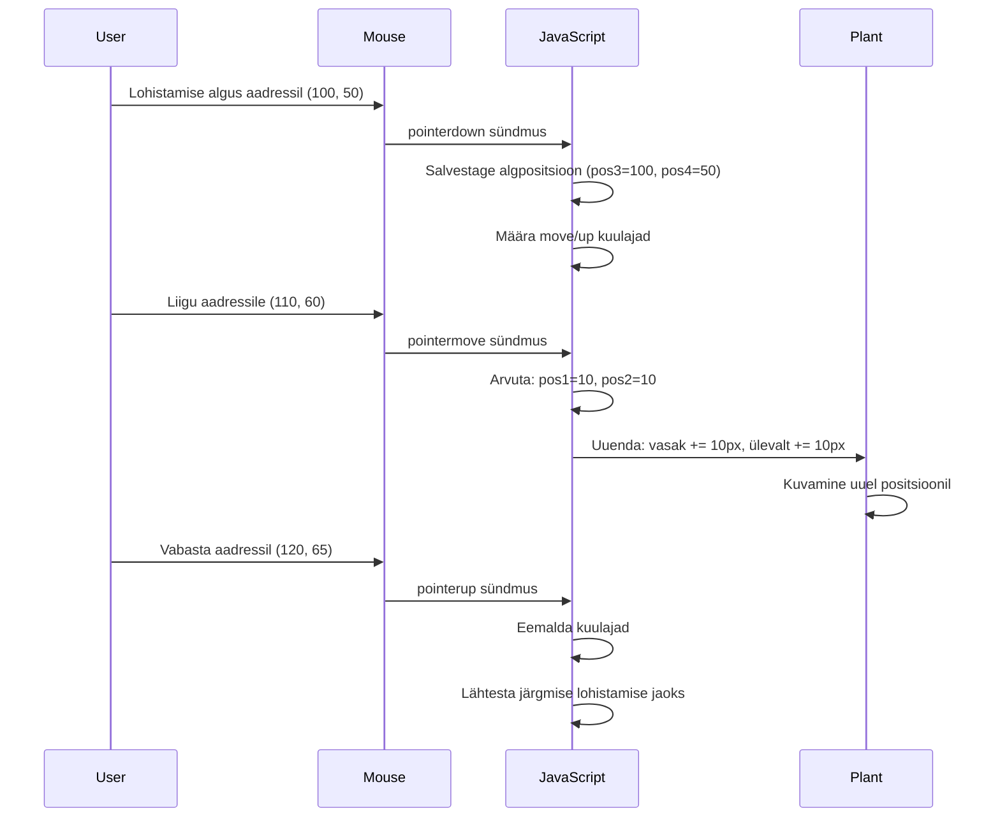
**Siin on liikumisaruande jaotus:**
1. **Mõõdab** vanade ja uute hiire asukohtade erinevust
2. **Arvutab**, kui palju elementi liigutada hiire liikumise põhjal
3. **Uuendab** elemendi CSS positsiooniväärtusi reaalajas
4. **Salvestab** uue positsiooni alusena järgmise liikumisarvutuse jaoks

### Matemaatika visuaalne kujutus

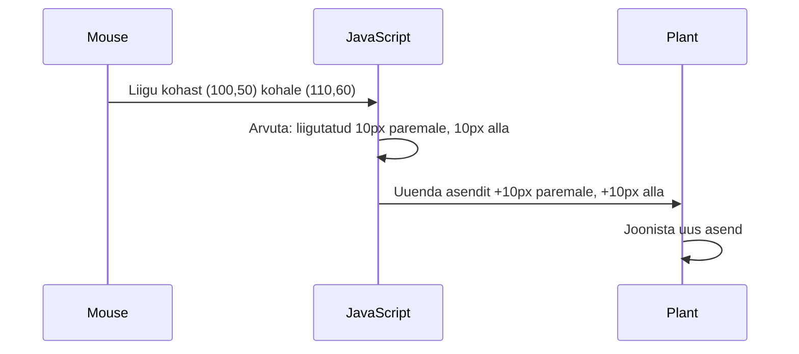
### stopElementDrag funktsioon: puhastamine

Lisa puhastamisfunktsioon kohe pärast `elementDrag` sulgemissulgu:

```javascript
function stopElementDrag() {
    // Eemalda dokumendi taseme sündmuste kuulajad
    document.onpointerup = null;
    document.onpointermove = null;
}
```

**Miks puhastamine on oluline:**
- **Vältib** mälu lekkeid tühjade sündmusekuulajate tõttu
- **Lõpetab** lohistamiskäitumise, kui kasutaja taime vabastab
- **Lubab** teistel elementidel sõltumatult lohistada
- **Lähtestab** süsteemi järgmise lohistamise jaoks

**Mis juhtub ilma puhastuseta:**
- Sündmusekuulajad töötavad ka peale lohistamise lõppu edasi
- Jõudlus halveneb, kuna mittevajalikud kuulajad kuhjuvad
- Tekivad ettearvamatud käitumised teiste elementidega suhtlemisel
- Brauseris raisatakse ressursse mittevajaliku sündmusetöötluse peale

### CSS positsiooniomaduste mõistmine

Meie lohistamissüsteem manipuleerib kahe põhilise CSS omadusega:

| Omadus | Mida kontrollib | Kuidas me seda kasutame |
|----------|------------------|---------------|
| `top` | Kaugus ülemisest servast | Vertikaalne positsioneerimine lohistamise ajal |
| `left` | Kaugus vasakust servast | Horisontaalne positsioneerimine lohistamise ajal |

**Olulised tähelepanekud offset-omaduste kohta:**
- **`offsetTop`**: Praegune kaugus positsioneeritud vanema ülemisest servast
- **`offsetLeft`**: Praegune kaugus positsioneeritud vanema vasakust servast
- **Positsioneerimiskontekst**: Need väärtused on seotud lähima positsioneeritud vanemaga
- **Reaalajas uuendused**: Muudatused toimuvad koheselt, kui me muudame CSS omadusi

> 🎯 **Disainifilosoofia**: See lohistamissüsteem on teadlikult paindlik – puuduvad "loobimisalad" või piirangud. Kasutajad saavad taimi asetada ükskõik kuhu, võimaldades neil täielikult loominguliselt terrariumi kujundada.

## Kõik üheskoos: sinu täielik lohistamissüsteem

Palju õnne! Sa lõid just keeruka lohistamis- ja kukutamissüsteemi, kasutades tavalist JavaScripti. Sinu täielik `dragElement` funktsioon sisaldab võimsat sulgemist, mis haldab:

**Mida sinu sulgemine saavutab:**
- **Hoiab** iga taime jaoks eraldi privaatseid positsioonimuutujaid
- **Halb** kogu lohistamistsükli algusest lõpuni
- **Tagab** sujuva ja reageeriva liikumise üle kogu ekraani
- **Puhastab** ressursid korralikult, et vältida mälulekkeid
- **Loomise** intuitiivse ja loova liidese terrariumi kujundamiseks

### Testi oma interaktiivset terrariumit

Nüüd testi oma interaktiivset terrariumit! Ava oma `index.html` fail veebilehitsejas ja proovi funktsionaalsust:

1. **Klõpsa ja hoia** suvalist taime, et alustada lohistamist
2. **Liigu hiire või sõrmega** ning vaata, kuidas taim sujuvalt järgneb
3. **Lase lahti** ja kukuta taim uude asukohta
4. **Katseta** erinevaid paigutusi ja avasta kasutajaliidest

🥇 **Saavutus**: Sa lõid täisfunktsionaalse interaktiivse veebirakenduse, kasutades põhikontseptsioone, mida professionaalsed arendajad igapäevaselt kasutavad. See lohistamisfunktsionaalsus põhineb samadel printsiipidel, mida kasutatakse failide üleslaadimisel, kanban-tahvlitel ja paljudes muudes interaktiivsetes liidestes.

### 🔄 **Pedagoogiline paus**
**Täieliku süsteemi mõistmine**: Kontrolli, kas sul on terviklik arusaam kogu lohistamissüsteemist:
- ✅ Kuidas sulgemised hoiavad iga taime sõltumatut olekut?
- ✅ Miks on koordinaatide matemaatiline arvutus vajalik sujuva liikumise jaoks?
- ✅ Mis juhtub, kui me unustame kuulajate puhastamise?
- ✅ Kuidas see mustrit keerukamate interaktsioonide puhul skaleerub?

**Koodi kvaliteedi refleksioon**: Vaata üle oma täielik lahendus:
- **Mooduldisain**: Iga taim saab oma sulgemisinstantsi
- **Sündmustõhusus**: Kuulajate nõuetekohane seadistamine ja otsa puhastamine
- **Seadmeülene tugi**: Töötab nii lauaarvutis kui mobiilis
- **Jõudluse teadlikkus**: Puuduvad mälulekked või tarbetud arvutused

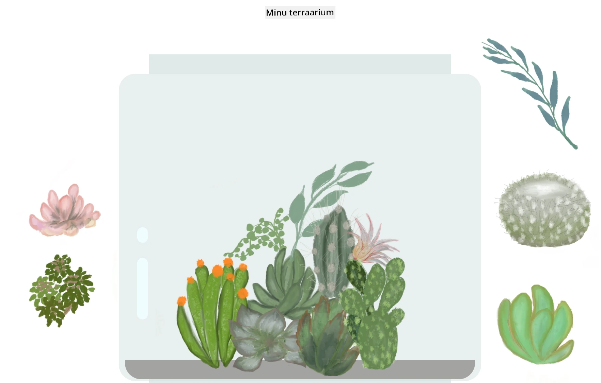

---

## GitHub Copilot Agent väljakutse 🚀

Kasuta Agent režiimi, et lahendada järgmine väljakutse:

**Kirjeldus:** Täienda terrariumiprojekti, lisades lähtestusfunktsionaalsuse, mis viib kõik taimed sujuvate animatsioonidega tagasi nende algasendisse.

**Käsk:** Loo lähtestamisnupp, mis klikitult animeerib kõik taimed tagasi nende algsetesse küljeribal asukohtadesse, kasutades CSS üleminekuid. Funktsioon peaks salvestama algpositsioonid lehe laadimisel ja sujuvalt taimede algasendisse viima ühe sekundi jooksul, kui lähtestusnuppu vajutatakse.

Tutvu Agent režiimiga siit: [agent mode](https://code.visualstudio.com/blogs/2025/02/24/introducing-copilot-agent-mode).

## 🚀 Lisaväljakutse: Arenda oma oskusi

Kas oled valmis viima oma terrariumi uuele tasemele? Proovi järgmisi täiustusi:

**Loomingulised laiendused:**
- **Topelklikita** taime pealmiseks toomiseks (z-indeksi manipuleerimine)
- **Lisa visuaalne tagasiside**, nt õrn kuma, kui taime kohal hoida
- **Rakenda piirid**, et vältida taimede lohistamist terrariumist välja
- **Loo salvestusfunktsioon**, mis mäletab taimede asukohti localStorage’i abil
- **Lisa heliefektid** taime tõstmiseks ja asetamiseks

> 💡 **Õppimisvõimalus**: Iga neist väljakutsetest õpetab sulle uusi aspekte DOM manipuleerimisest, sündmuste käitlemisest ja kasutajakogemuse disainist.

## Pärastloengu test

[Pärastloengu test](https://ff-quizzes.netlify.app/web/quiz/20)

## Ülevaade & Iset õppimine: süvendame arusaamist

Oled omandanud DOM manipuleerimise ja sulgemiste põhialused, kuid avastada on veel palju! Siin on mõned teed oma teadmiste ja oskuste laiendamiseks.

### Alternatiivsed lohistamis- ja kukutamisviisid

Me kasutasime maksimaalse paindlikkuse jaoks pointer sündmusi, kuid veebiarendus pakub mitmeid teisi võimalusi:

| Lähenemine | Parim kasutusala | Õppeväärtus |
|----------|----------|----------------|
| [HTML Drag and Drop API](https://developer.mozilla.org/docs/Web/API/HTML_Drag_and_Drop_API) | Failide üleslaadimine, ametlikud lohistamisalad | Mõistmine, kuidas brauserid lohistamist natiivselt toetavad |
| [Touch Events](https://developer.mozilla.org/docs/Web/API/Touch_events) | Mobiilspetsiifilised interaktsioonid | Mobiilse esmane arendusmustrid |
| CSS `transform` omadused | Sujuvad animatsioonid | Jõudluse optimeerimise tehnikad |

### Täiustatud DOM Manipulatsiooni Teemad

**Järgmised sammud sinu õpiteekonnal:**
- **Sündmuste delegatsioon**: Käsitleda efektiivselt mitme elemendi sündmusi
- **Intersection Observer**: Tuvastada, millal elemendid sisenevad või lahkuvad vaateväljast
- **Mutation Observer**: Jälgida muutusi DOM struktuuris
- **Veebikomponendid**: Luua taaskasutatavad ja kapseldatud kasutajaliidese elemendid
- **Virtuaalne DOM**: Mõista, kuidas raamistikud optimeerivad DOM uuendusi

### Olulised ressursid edasiseks õppeks

**Tehniline dokumentatsioon:**
- [MDN Pointer Events juhend](https://developer.mozilla.org/docs/Web/API/Pointer_events) - põhjalik pointer sündmuste viide
- [W3C Pointer Events spetsifikatsioon](https://www.w3.org/TR/pointerevents1/) - ametlik standardidokumentatsioon
- [JavaScript sulgemiste süvitsi](https://developer.mozilla.org/docs/Web/JavaScript/Closures) - edasijõudnud sulgemismustrid

**Brauserite ühilduvus:**
- [CanIUse.com](https://caniuse.com/) - kontrolli funktsioonide tuge brauserites
- [MDN Browser Compatibility Data](https://github.com/mdn/browser-compat-data) - detailne ühilduvusteave

**Praktikavõimalused:**
- **Loo** puslemäng, kasutades sarnaseid lohistamismehhanisme
- **Loo** kanban-tahvel ülesannete lohistamiseks
- **Disaini** pildigalerii koos lohistatavate fotode paigutusega
- **Katseta** puutetundlikku juhtimist mobiilseadmetes

> 🎯 **Õppestrateegia**: Neid kontseptsioone kinnistad kõige paremini praktikas. Proovi luua mitmesuguseid lohistatavaid liideseid – iga projekt õpetab sulle midagi uut kasutajaliidese ja DOM manipuleerimise kohta.

### ⚡ **Mida saad teha järgmise 5 minutiga**
- [ ] Ava brauseri DevTools ja trüki konsooli `document.querySelector('body')`
- [ ] Proovi muuta veebilehe teksti, kasutades `innerHTML` või `textContent`
- [ ] Lisa klõpsu sündmuse kuulaja suvalisele nupule või lingile
- [ ] Uuri DOM-puu struktuuri Elements paneelil

### 🎯 **Mida saad saavutada selle tunni jooksul**
- [ ] Täida pärastloengu test ja korrasta DOM manipuleerimise kontseptsioone
- [ ] Loo interaktiivne veebileht, mis reageerib kasutaja klikkidele
- [ ] Harjuta sündmuste töötlemist erinevate sündmustüüpidega (click, mouseover, keypress)
- [ ] Ehita lihtne ülesannete nimekiri või loendur DOM manipuleerimise abil
- [ ] Uuri HTML elementide ja JavaScripti objektide seoseid

### 📅 **Sinu nädalapikkune JavaScripti õpiteekond**
- [ ] Lõpeta interaktiivne terrarium projekt koos lohistamisfunktsionaalsusega
- [ ] Valda sündmuste delegatsiooni tõhusaks sündmuste käitlemiseks
- [ ] Õpi tundma sündmuste tsüklit ja asünkroonset JavaScripti
- [ ] Harjuta sulgemisi, luues mooduleid privaatse olekuga
- [ ] Avastada kaasaegsed DOM API-d nagu Intersection Observer
- [ ] Ehita interaktiivseid komponente ilma raamistiketa

### 🌟 **Sinu kuu pikkune JavaScripti meistritase**
- [ ] Loo keerukas ühe lehe rakendus tavalise JavaScripti abil
- [ ] Õpi kaasaegset raamistikku (React, Vue või Angular) ja võrdle seda tavalise DOM manipuleerimisega
- [ ] Panusta avatud lähtekoodiga JavaScripti projektidesse
- [ ] Valda keerukaid kontseptsioone nagu veebikomponendid ja kohandatud elemendid
- [ ] Ehita jõudlusrikkaid veebirakendusi optimaalse DOM struktuuriga
- [ ] Õpeta teisi DOM manipuleerimisest ja JavaScripti alustest

## 🎯 Sinu JavaScript DOM meisterlikkuse ajaskaala

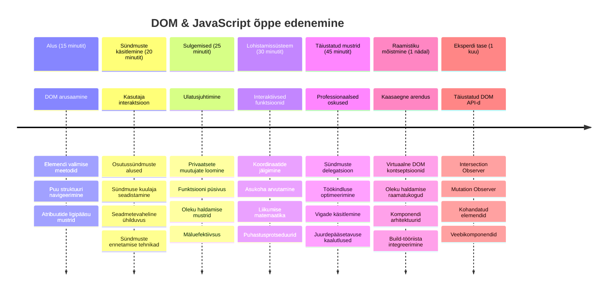
### 🛠️ Sinu JavaScripti tööriistakasti kokkuvõte

Pärast selle õppetunni lõpetamist valdavad sind:
- **DOM meisterlikkus**: Elemendi valik, omaduste muutmine ja puu navigeerimine
- **Sündmuste kogemus**: Seadmeülene interaktsioonide käitlemine pointer sündmustega
- **Sulgemiste tundmine**: Privaatse oleku haldamine ja funktsioonide püsivus
- **Interaktiivsed süsteemid**: Täielik lohistamis- ja kukutamissüsteemi realiseerimine nullist
- **Tõhususe teadlikkus**: Õige sündmuste puhastus ja mäluhalduse kontroll
- **Kaasaegsed mustrid**: Koodi organiseerimise tehnikad, mida kasutatakse professionaalses arenduses
- **Kasutajakogemus**: Intuitiivsete ja reageerivate liideste loomine

**Professionaalsed oskused**: Sa ehitasid funktsioone kasutades samu tehnikaid nagu:
- **Trello/Kanban lauad**: Kaardi lohistamine veergude vahel
- **Failide üleslaadimise süsteemid**: Loositav failihaldus
- **Pildigalerii**: Fotode paigutamise liidese lahendused
- **Mobiilirakendused**: Puutekäsitluse mustrid

**Järgmine tase**: Oled valmis avastama kaasaegseid raamistikke nagu React, Vue või Angular, mis põhinevad neil põhilistel DOM manipuleerimise kontseptsioonidel!

## Kodutöö

[Tee natuke rohkem tööd DOM-iga](assignment.md)

---

<!-- CO-OP TRANSLATOR DISCLAIMER START -->
**Vastutusest loobumine**:
See dokument on tõlgitud kasutades tehisintellekti tõlketeenust [Co-op Translator](https://github.com/Azure/co-op-translator). Kuigi püüame saavutada täpsust, palun arvestage, et automatiseeritud tõlked võivad sisaldada vigu või ebatäpsusi. Originaaldokument selle emakeeles tuleks pidada lõplikuks allikaks. Olulise info puhul soovitatakse professionaalset inimtõlget. Me ei vastuta selle tõlke kasutamisest tingitud arusaamatuste ega väärinterpreteerimiste eest.
<!-- CO-OP TRANSLATOR DISCLAIMER END -->