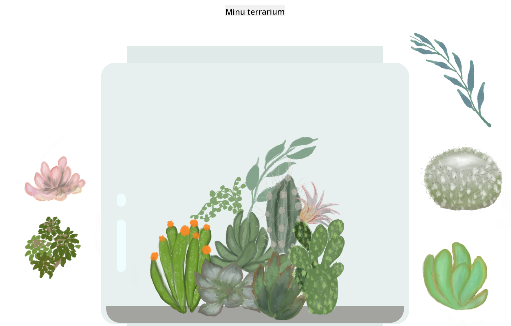

<!--
CO_OP_TRANSLATOR_METADATA:
{
  "original_hash": "7965cd2bc5dc92ad888dc4c6ab2ab70a",
  "translation_date": "2025-10-11T11:55:30+00:00",
  "source_file": "3-terrarium/README.md",
  "language_code": "et"
}
-->
# Minu Terrarium: Projekt HTML-i, CSS-i ja DOM-i manipuleerimise õppimiseks JavaScripti abil 🌵🌱

Väike lohistamise ja kodeerimise harjutus. Natukese HTML-i, JS-i ja CSS-i abil saad luua veebiliidese, kujundada seda ja lisada mitmesuguseid interaktsioone vastavalt oma soovile.

# Õppetunnid

1. [Sissejuhatus HTML-i](./1-intro-to-html/README.md)
2. [Sissejuhatus CSS-i](./2-intro-to-css/README.md)
3. [Sissejuhatus DOM-i ja JS-i sulgudesse](./3-intro-to-DOM-and-closures/README.md)

## Autorid

Kirjutatud ♥️-ga [Jen Looper](https://www.twitter.com/jenlooper) poolt.

CSS-i abil loodud terrarium on inspireeritud Jakub Mandra klaaspurgi [Codepenist](https://codepen.io/Rotarepmi/pen/rjpNZY).

Kunstiteosed on käsitsi joonistatud [Jen Looper](http://jenlooper.com) poolt Procreate'i abiga.

## Terrariumi avaldamine

Sa saad oma terrariumi veebis avaldada, kasutades Azure Static Web Apps'i.

1. Forki see repo

2. Vajuta sellele nupule

3. Järgi juhiseid oma rakenduse loomiseks. Veendu, et määrad rakenduse juureks kas `/solution` või oma koodibaasi juure. Selles rakenduses API-d ei ole, seega selle pärast ei pea muretsema. Forkitud repositooriumisse luuakse GitHubi kaust, mis aitab Azure Static Web Apps'i ehitusteenustel sinu rakenduse ehitada ja avaldada uuel URL-il.

---

**Lahtiütlus**:  
See dokument on tõlgitud, kasutades AI tõlketeenust [Co-op Translator](https://github.com/Azure/co-op-translator). Kuigi püüame tagada täpsust, palun arvestage, et automaatsed tõlked võivad sisaldada vigu või ebatäpsusi. Algne dokument selle algkeeles tuleks lugeda autoriteetseks allikaks. Olulise teabe puhul on soovitatav kasutada professionaalset inimtõlget. Me ei vastuta selle tõlke kasutamisest tulenevate arusaamatuste või valede tõlgenduste eest.