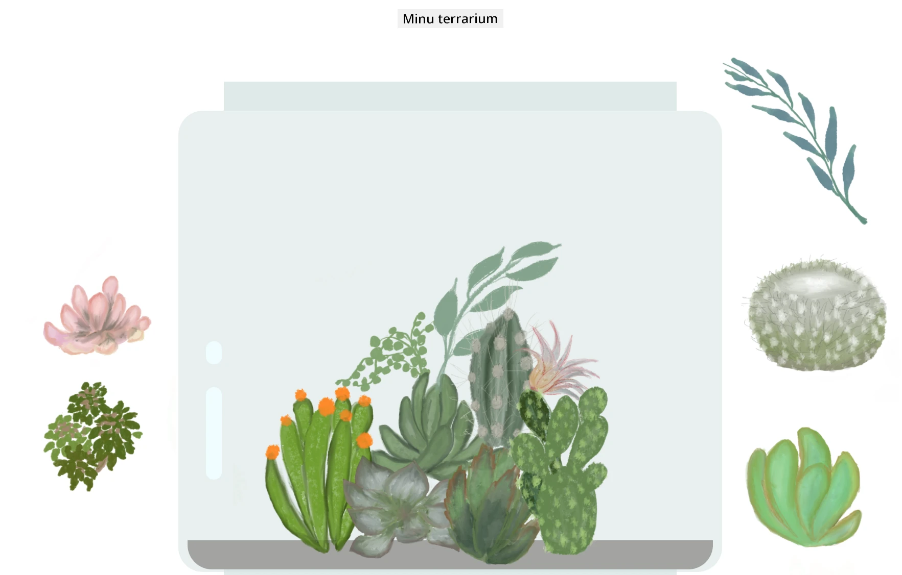

# Minu Terrarium: Projekt HTML-i, CSS-i ja DOM-i manipuleerimise õppimiseks JavaScripti abil 🌵🌱

Väike lohistamise ja kodeerimise harjutus. Natukese HTML-i, JS-i ja CSS-i abil saad luua veebiliidese, kujundada selle ja lisada interaktsiooni.

## Autorid

Kirjutatud ♥️ poolt [Jen Looper](https://www.twitter.com/jenlooper)

CSS-i abil loodud terrarium on inspireeritud Jakub Mandra klaaspurgi [codepenist](https://codepen.io/Rotarepmi/pen/rjpNZY).

Kunstiteosed on käsitsi joonistanud [Jen Looper](http://jenlooper.com) kasutades Procreate'i.

## Terrariumi avaldamine

Sa saad oma terrariumi veebis avaldada, kasutades Azure Static Web Apps-i.

1. Forki see repo

2. Vajuta sellele nupule

3. Järgi juhiseid oma rakenduse loomiseks. Veendu, et määrad rakenduse juureks kas `/solution` või oma koodibaasi juure. Selles rakenduses API-d ei ole, seega pole vaja selle lisamise pärast muretseda. Forkitud repo-sse luuakse .github kaust, mis aitab Azure Static Web Apps-i ehitusteenusel sinu rakenduse ehitada ja avaldada uuel URL-il.

---

**Lahtiütlus**:  
See dokument on tõlgitud AI tõlketeenuse [Co-op Translator](https://github.com/Azure/co-op-translator) abil. Kuigi püüame tagada täpsust, palume arvestada, et automaatsed tõlked võivad sisaldada vigu või ebatäpsusi. Algne dokument selle algses keeles tuleks pidada autoriteetseks allikaks. Olulise teabe puhul soovitame kasutada professionaalset inimtõlget. Me ei vastuta selle tõlke kasutamisest tulenevate arusaamatuste või valesti tõlgenduste eest.