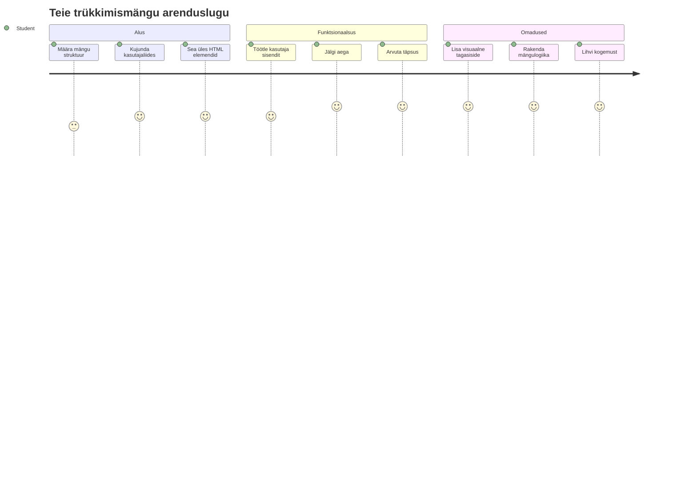
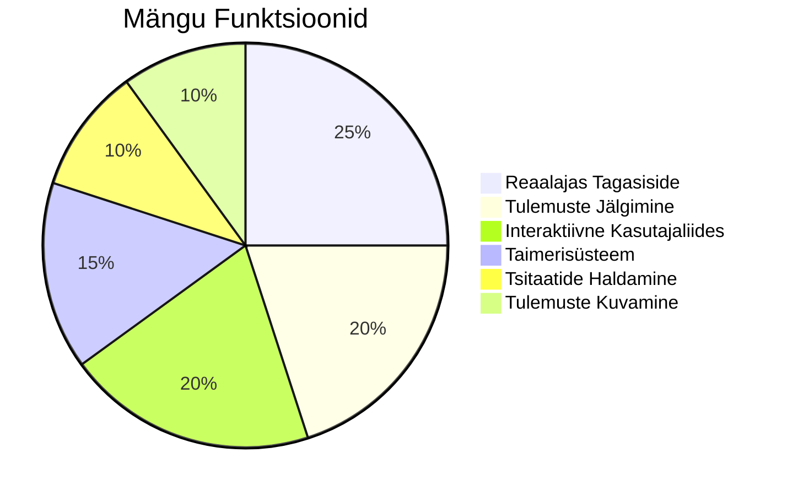
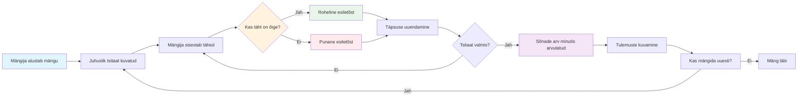
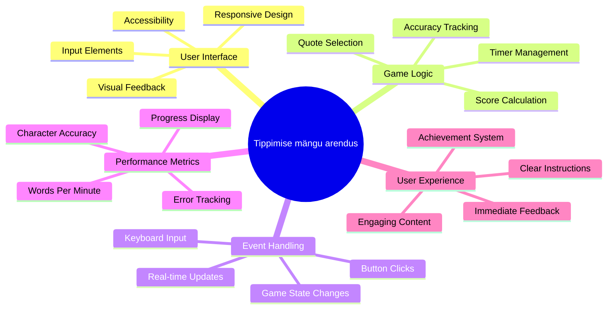
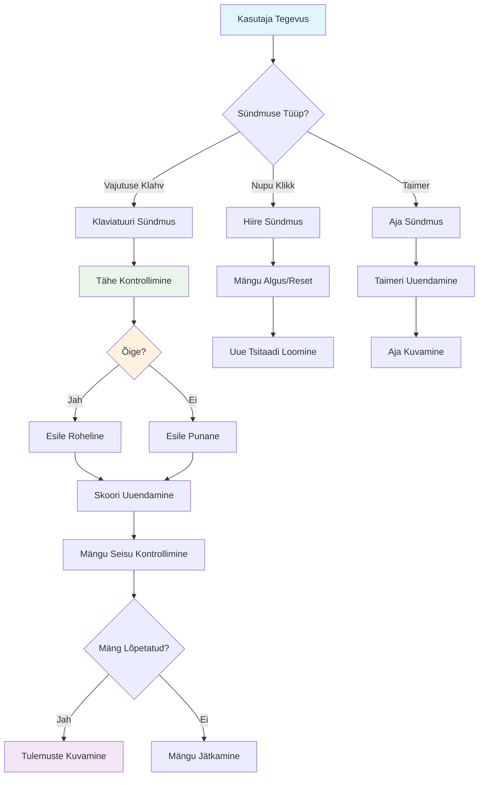
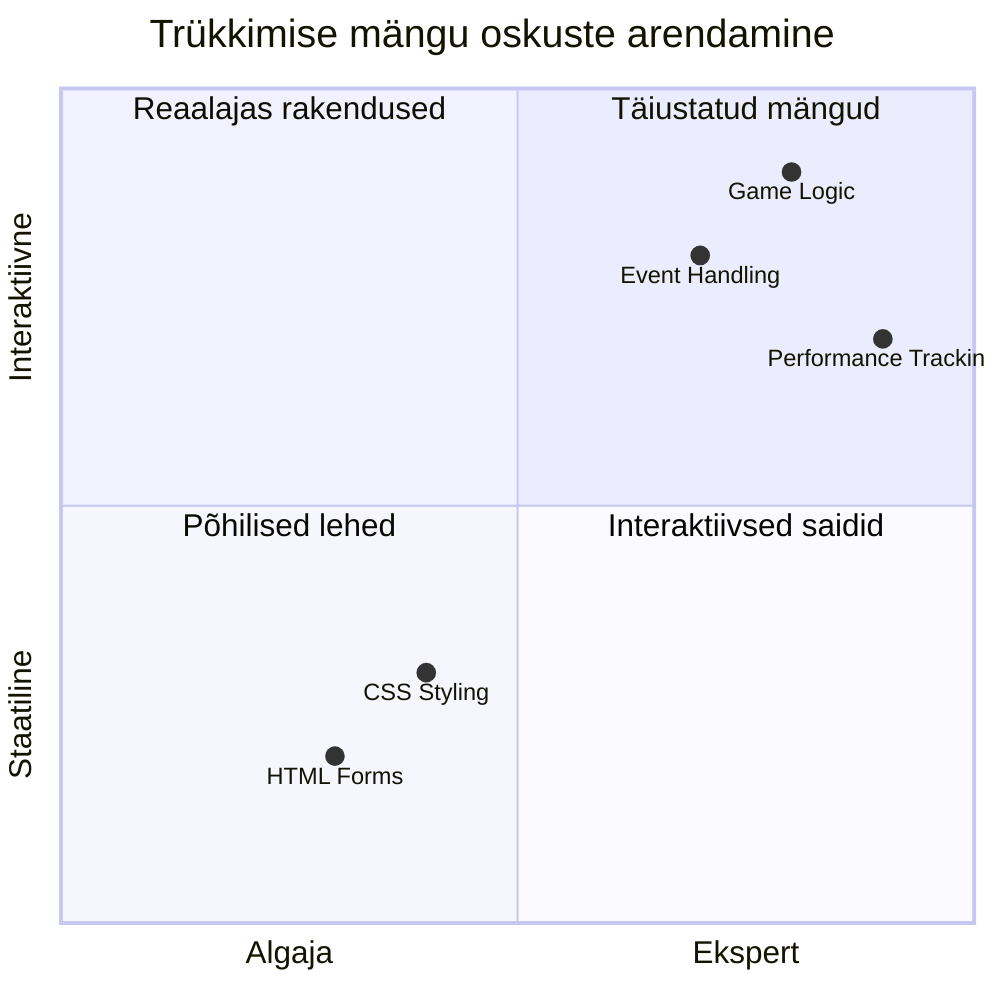
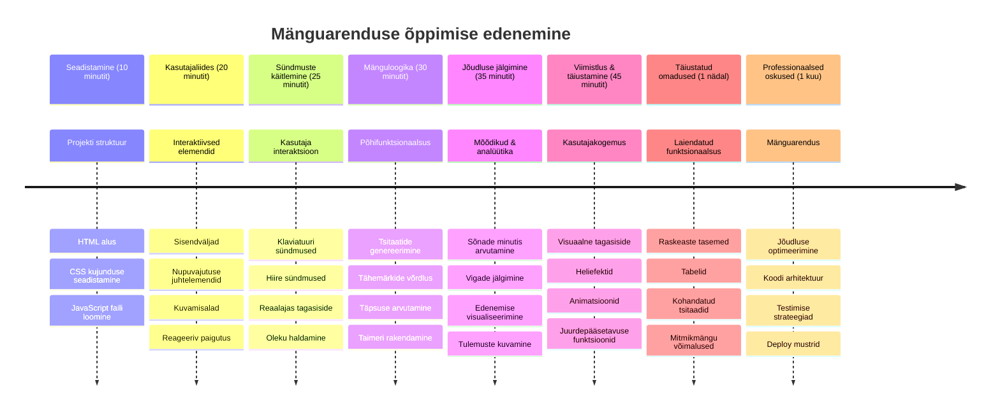

# Sündmustepõhine programmeerimine - Ehita tippimismäng

## Sissejuhatus

Siin on midagi, mida iga arendaja teab, aga harva räägib: kiirelt tippimine on supervõime! 🚀 Mõtle selle peale – mida kiiremini suudad oma ideed ajust koodiredaktorisse viia, seda rohkem saab su loovus voolata. See on nagu otsetee su mõtete ja ekraani vahel.

Tahad teada üht parimat viisi selle oskuse arendamiseks? Arvasid õigesti – hakkame mängu ehitama!

> Loome koos laheda tippimismängu!

Oled valmis panema kogu selle JavaScripti, HTMLi ja CSSi oskuse tööle, mida oled õppinud? Me ehitame tippimismängu, mis paneb sind proovile juhuslike tsitaatidega legendaarse detektiivi [Sherlock Holmesi](https://en.wikipedia.org/wiki/Sherlock_Holmes) loomingust. Mäng jälgib, kui kiiresti ja täpselt sa tippida suudad – ja usu mind, see on palju sõltuvust tekitavam, kui arvad!

## Mida sul peab olema oskusteavet

Enne sukeldumist veendu, et tunneksid neid kontseptsioone (ära muretse, kui vajad kiiret värskendust – me kõik oleme seal olnud!):

- Tekstisisendi ja nupukontrollide loomine
- CSS ja stiilide määramine klasside abil  
- JavaScripti alused
  - Massiivide loomine
  - Juhuslike arvude genereerimine
  - Praeguse aja hankimine

Kui mõni neist tundub pisut roostes, pole see üldse probleem! Mõnikord on parim viis oma teadmisi tugevdada see, kui sukeldud projekti ja hakkad asju lahendama jooksvalt.

### 🔄 **Pedagoogiline kontrollpunkt**
**Põhioskuste hindamine**: Enne arenduse alustamist veendu, et mõistad:
- ✅ Kuidas HTML vormid ja sisendi elemendid töötavad
- ✅ CSS klassid ja dünaamiline stiilimine
- ✅ JavaScripti sündmuste kuulajad ja käsitlejad
- ✅ Massiivide manipuleerimine ja juhuslik valik
- ✅ Aja mõõtmine ja arvutused

**Kiire enesetest**: Kas suudad selgitada, kuidas need kontseptsioonid interaktiivses mängus koos toimivad?
- **Sündmused** käivituvad, kui kasutajad elementidega suhtlevad
- **Käsitlejad** töötlevad neid sündmusi ja uuendavad mängu seisundit
- **CSS** annab visuaalset tagasisidet kasutaja tegevustele
- **Ajastus** võimaldab mõõta sooritust ja mängu edenemist

## Hakakem seda asja ehitama!

[Tippimismängu loomine sündmustepõhise programmeerimise abil](./typing-game/README.md)

### ⚡ **Mida saad teha järgmise 5 minutiga**
- [ ] Ava oma brauseri konsool ja proovi kuulata klaviatuuri sündmusi `addEventListener` abil
- [ ] Loo lihtne HTML leht sisendväljaga ja testi tippimise tuvastamist
- [ ] Harjuta stringide manipuleerimist, võrreldes tippitud teksti sihttekstiga
- [ ] Katseta `setTimeout`i, et aru saada ajafunktsioonidest

### 🎯 **Mida saad selle tunni jooksul saavutada**
- [ ] Täida peatunni test ja saa aru sündmustepõhisest programmeerimisest
- [ ] Ehita lihtne versioon tippimismängust koos sõnade valideerimisega
- [ ] Lisa visuaalne tagasiside korrektsel ja valel tippimisel
- [ ] Rakenda lihtne punktisüsteem kiiruse ja täpsuse põhjal
- [ ] Stiilita oma mäng CSS-iga, et muuta see visuaalselt atraktiivseks

### 📅 **Sinu nädalane mänguarendus**
- [ ] Valmista terve tippimismäng koos kõigi funktsioonide ja lihviga
- [ ] Lisa raskusastmed erineva sõnakompleksusega
- [ ] Rakenda kasutajastatistika jälgimist (WPM, täpsus aja jooksul)
- [ ] Loo heliefektid ja animatsioonid parema kasutajakogemuse jaoks
- [ ] Tee mäng mobiilseadmete jaoks puutetundlikuks
- [ ] Jaga oma mängu internetis ja kogu kasutajate tagasisidet

### 🌟 **Sinu kuu pikkune interaktiivne arendus**
- [ ] Ehitada mitu mängu, mis uurivad erinevaid interaktsioonimustreid
- [ ] Õpi mängutsüklitest, seisundihaldusest ja jõudluse optimeerimisest
- [ ] Panusta avatud lähtekoodiga mänguarendusprojektidesse
- [ ] Valda keerukaid ajastamise kontseptsioone ja sujuvaid animatsioone
- [ ] Koosta portfoolio erinevatest interaktiivsetest rakendustest
- [ ] Juhenda teisi, kes on huvitatud mänguarendusest ja kasutajate interaktsioonist

## 🎯 Sinu tippimismängu meisterlikkuse ajagraafik

### 🛠️ Sinu mänguarenduse tööriistakasti kokkuvõte

Pärast selle projekti lõpetamist oled valdanud:
- **Sündmustepõhine programmeerimine**: reageerivad kasutajaliidesed, mis vastavad sisendile
- **Reaalajas tagasiside**: kohesed visuaalsed ja jõudluslikud uuendused
- **Jõudluse mõõtmine**: täpsed ajastus- ja punktisüsteemid
- **Mänguseisundi haldus**: rakenduse voo ja kasutajakogemuse kontrollimine
- **Interaktiivne disain**: kaasahaaravate ja sõltuvusttekitavate kasutajakogemuste loomine
- **Moodne veebipõhine API**: brauserivõimaluste kasutamine rikkalike interaktsioonide jaoks
- **Juurdepääsetavuse mustrid**: kaasav disain kõigile kasutajatele

**Reaalmaailma rakendused**: Need oskused kehtivad otseselt järgmistes valdkondades:
- **Veebirakendused**: igasugused interaktiivsed liidesed või juhtpaneelid
- **Haridustarkvara**: õppimisplatvormid ja oskuste hindamise tööriistad
- **Tootlikkustööriistad**: tekstiredaktorid, IDEd ja koostöö tarkvara
- **Mängutööstus**: brauserimängud ja interaktiivne meelelahutus
- **Mobiiliarendus**: puutetundlikud liidesed ja žestide käsitlemine

**Järgmine tase**: oled valmis avastama keerukamaid mänguraamistikke, reaalajas mitmikmängusüsteeme või keerulisi interaktiivseid rakendusi!

## Tänusõnad

Kirjutas ♥️ [Christopher Harrison](http://www.twitter.com/geektrainer)

---

<!-- CO-OP TRANSLATOR DISCLAIMER START -->
**Vastutusest loobumine**:
See dokument on tõlgitud tehisintellekti tõlketeenuse [Co-op Translator](https://github.com/Azure/co-op-translator) abil. Kuigi püüame täpsust, tuleb arvestada, et automaatsed tõlked võivad sisaldada vigu või ebatäpsusi. Originaaldokument oma algkeeles tuleks pidada autoriteetseks allikaks. Kriitilise teabe puhul soovitatakse kasutada professionaalset inimtõlget. Me ei vastuta selle tõlke kasutamisest tingitud arusaamatuste või valesti tõlgendamise eest.
<!-- CO-OP TRANSLATOR DISCLAIMER END -->