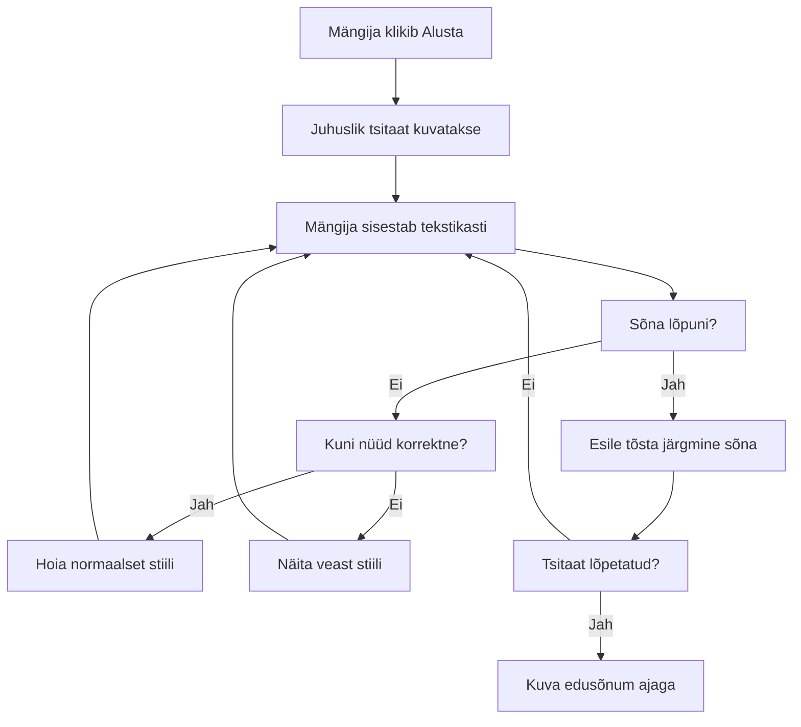
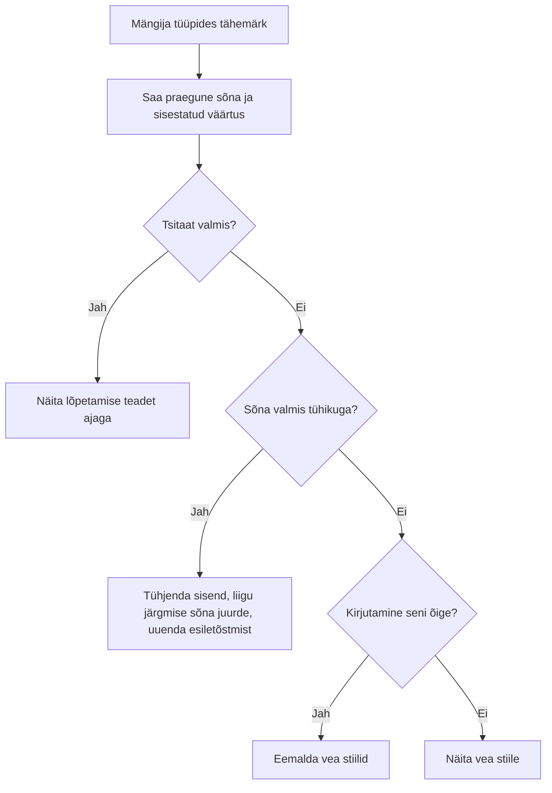
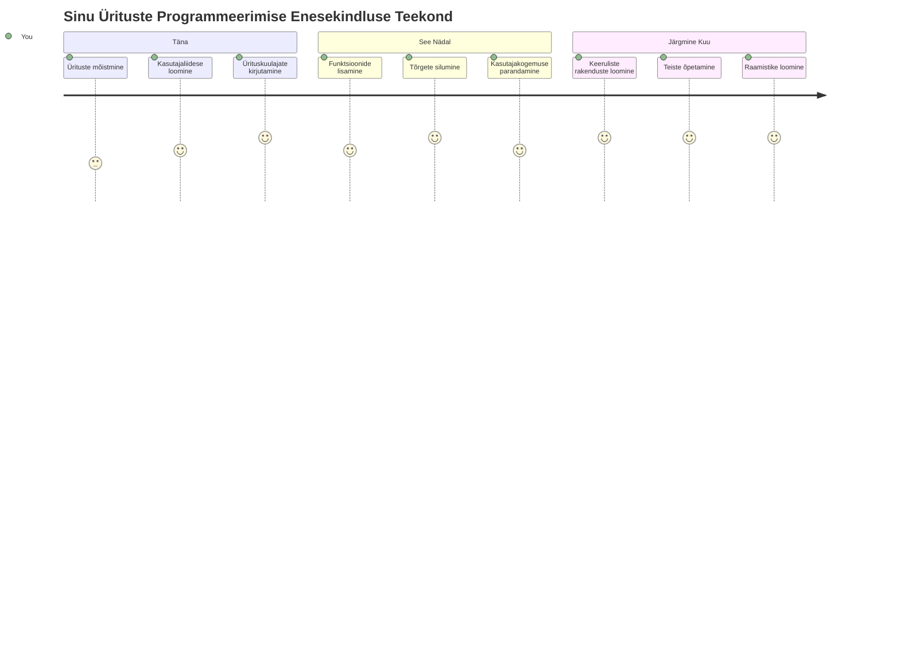

# Mängu loomine sündmuste abil

Kas oled kunagi mõelnud, kuidas veebisaidid teavad, millal sa klõpsad nuppu või tippid tekstikasti? See on sündmustepõhise programmeerimise võlu! Mis oleks parem viis selle olulise oskuse õppimiseks, kui ehitada midagi kasulikku – tippimiskiiruse mäng, mis reageerib iga su tehtud klahvivajutuse peale.

Sa näed ise, kuidas veebibrauserid "räägivad" su JavaScript koodiga. Iga kord, kui sa klõpsad, tipsid või lohistad hiirt, saadab brauser sinu koodile väikeseid sõnumeid (me nimetame neid sündmusteks), ja sina otsustad, kuidas reageerida!

Siin lõpus oled ehitanud pärismaailma tippimismängu, mis jälgib su kiirust ja täpsust. Veelgi olulisem on see, et sa saad aru põhimõistetest, mis juhivad iga interaktiivset veebisaiti, mida sa oled kasutanud. Hakkame pihta!

## Enne loengut test

[Pre-lecture quiz](https://ff-quizzes.netlify.app/web/quiz/21)

## Sündmustepõhine programmeerimine

Mõtle oma lemmikrakendusele või veebisaidile – mis teeb selle elavaks ja reageerivaks? Kõik saab alguse sellest, kuidas see reageerib su tegevustele! Iga koputus, klõps, libistus või klahvivajutus tekitab seda, mida me nimetame "sündmuseks", ja just siin toimub veebiarenduse tõeline võlu.

See teeb veebiprogrammeerimise väga huvitavaks: me ei tea kunagi, millal keegi selle nupu klõpsab või tekstikasti hakkab tippima. Nad võivad klõpsata kohe, oodata viis minutit või võib-olla ei klõpsa üldse! See ettearvamatus nõuab, et me mõtleksime teisiti koodi kirjutamisele.

Selle asemel, et kirjutada kood, mis jookseb ülevalt alla nagu retsept, kirjutame koodi, mis ootab kannatlikult, kuni midagi juhtub. See on nagu 1800. aastate telegraafitöötajad, kes istusid oma masinate kõrval valmis, et kohe reageerida, kui sõnum traat läbi tuli.

Mis on siis täpsemalt "sündmus"? Lihtsalt öeldes: see on midagi, mis juhtub! Kui sa klõpsad nuppu – see on sündmus. Kui sa tippid tähe – see on sündmus. Kui sa liigutad hiirt – see on teine sündmus.

Sündmustepõhine programmeerimine laseb meil seadistada koodi kuulama ja reageerima. Loome spetsiaalsed funktsioonid, mida nimetatakse **sündmusekõrvutajateks (event listeners)**, mis ootavad kannatlikult konkreetsete sündmuste juhtumist ja reageerivad kohe, kui see juhtub.

Mõtle sündmusekõrvutaja peale nagu uksekella oma koodi jaoks. Sa seadistad uksekella (`addEventListener()`), ütled, millist heli kuulata (näiteks 'click' või 'keypress'), ja määrad, mis peaks juhtuma, kui keegi selle helistab (sinu kohandatud funktsioon).

**Nii toimivad sündmusekõrvutajad:**
- **Kuulavad** konkreetseid kasutaja tegevusi nagu klõpsud, klahvivajutused või hiire liigutused
- **Käivitatakse** sinu kohandatud kood, kui määratud sündmus toimub
- **Reageerivad** kohe kasutaja interaktsioonidele, luues sujuva kogemuse
- **Haldavad** mitut sündmust sama elemendi peal erinevate kõrvutajate kaudu

> **MÄRKUS:** Tasub rõhutada, et sündmusekõrvutajaid on mitut moodi luua. Võid kasutada anonüümseid funktsioone või luua nimelisi. Sa võid kasutada erinevaid otseteid, nagu `click` omaduse seadistamine või `addEventListener()`. Meie ülesandes keskendume `addEventListener()` ja anonüümsete funktsioonide kasutamisele, kuna see on tõenäoliselt kõige tavalisem tehnika veebiarendajate seas. Samuti on see kõige paindlikum, sest `addEventListener()` töötab kõigi sündmustega ja sündmuse nimi saab olla parameetrina.

### Levinumad sündmused

Kuigi veebibrauserid pakuvad mitmekümneid erinevaid sündmusi, mida kuulata, toetuvad enamus interaktiivseid rakendusi vaid mõnele olulisemale sündmusele. Nende põhielementide mõistmine annab sulle vundamendi keerukamate kasutajaliideste loomiseks.

On olemas [kümneid sündmusi](https://developer.mozilla.org/docs/Web/Events), mida saad rakenduses kuulata. Peaaegu iga kasutaja tegevus lehel tekitab sündmuse, mis annab sulle palju võimu tagada soovitud kasutajakogemus. Õnneks vajad sa tavaliselt vaid väikest valikut sündmusi. Siin on mõned levinumad (sealhulgas kaks, mida kasutame oma mängu loomisel):

| Sündmus | Kirjeldus | Levinumad kasutusjuhtumid |
|---------|-----------|----------------------------|
| `click` | Kasutaja klõpsas millegi peal | Nupud, lingid, interaktiivsed elemendid |
| `contextmenu` | Kasutaja klõpsas parema hiirenupuga | Kohandatud paremklõpsumenüüd |
| `select` | Kasutaja märgistas teksti | Tekstiredigeerimine, kopeerimine |
| `input` | Kasutaja sisestas teksti | Vormide valideerimine, reaalajas otsing |

**Nende sündmustüüpide mõistmine:**
- **Käivitub**, kui kasutajad suhtlevad konkreetsete elementidega sinu lehel
- **Pakkuvad** detailset infot kasutaja tegevuse kohta sündmuse objektide kaudu
- **Võimaldavad** sul luua vastutulelikke ja interaktiivseid veebiäppe
- **Töötavad** järjekindlalt erinevates brauserites ja seadmetes

## Mängu loomine

Nüüd, kui sa tead, kuidas sündmused töötavad, paneme selle teadmise praktikasse, luues midagi kasulikku. Loome tippimiskiiruse mängu, mis demonstreerib sündmuste käsitlemist ja aitab sul arendada olulist arendaja oskust.

Me hakkame looma mängu, et uurida, kuidas JavaScriptis sündmused töötavad. Meie mäng testib mängija tippimisoskust, mis on üks alahinnatud oskusi, mida iga arendaja peaks valdama. Huvitav fakt: klaviatuuripaigutus QWERTY, mida me tänapäeval kasutame, töötati tegelikult välja 1870. aastatel kirjutusmasinate jaoks – ja head tippimisoskused on programmeerijatele tänaseni väga väärtuslikud! Mängu üldine voog näeb välja järgmine:


**Mäng töötab nii:**
- **Algab**, kui mängija klõpsab start nupul ja kuvab juhusliku tsitaadi
- **Jälgib** mängija tippimise edenemist sõna haaval reaalajas
- **Tõstab esile** praeguse sõna, et juhatada mängija tähelepanu
- **Anname** kohese visuaalse tagasiside tippimisvigade kohta
- **Arvutab** ja kuvab koguaega, kui tsitaat on lõpetatud

Teeme ära ja õpime sündmuste kohta!

### Failide struktuur

Enne kui hakkame koodi kirjutama, tehkem endale selgeks failistruktuur! Alates algusest korras olev failistruktuur säästab hiljem peavalu ja teeb su projekti professionaalsemaks. 😊

Hoidke asjad lihtsana kolme failiga: `index.html` meie lehe struktuuri jaoks, `script.js` kogu mängu loogika jaoks ja `style.css`, et kõik ilus välja näeks. See on klassikaline trioon, mis paneb suurema osa veebist tööle!

**Loo uus kaust oma töö jaoks, avades konsooli või terminali ning käivitades järgmise käsu:**

```bash
# Linux või macOS
mkdir typing-game && cd typing-game

# Windows
md typing-game && cd typing-game
```

**Need käsud teevad järgmist:**
- **Loovad** uue kausta nimega `typing-game` sinu projekti failide jaoks
- **Liiguvad** automaatselt äsja loodud kausta
- **Seadistavad** puhta tööruumi sinu mänguarenduseks

**Ava Visual Studio Code:**

```bash
code .
```

**See käsk:**
- **Avab** Visual Studio Code'i praeguses kaustas
- **Laeb** sinu projekti kausta redaktoris
- **Pakkuvab** juurdepääsu kõikidele vajalikele arendusvahenditele

**Lisa Visual Studio Codes kausta kolm faili järgmiste nimedega:**
- `index.html` – sisaldab mängu struktuuri ja sisu
- `script.js` – haldab kogu mängu loogikat ja sündmusekõrvutajaid
- `style.css` – määratleb visuaalse välimuse ja stiilid

## Kasutajaliidese loomine

Korteri ehitamiseks leiame nüüd ruumi, kus kogu meie mängutegelane toimub! Mõtle sellele kui kosmoselaeva juhtpaneeli kujundamine – me peame tagama, et kõik, mida mängijad vajavad, on täpselt seal, kus nad seda ootavad.

Vaatame, mida meie mäng tegelikult vajab. Kui sa mängiksid tippimismängu, mida sa tahaksid ekraanil näha? Siin on, mida me vajame:

| Kasutajaliidese element | Eesmärk | HTML element |
|-------------------------|---------|--------------|
| Tsitaadi kuvamine       | Kuvab teksti, mida tippida | `<p>` koos `id="quote"` |
| Sõnumiala              | Kuvab staatuse ja edusõnumeid | `<p>` koos `id="message"` |
| Tekstisisestus         | Koht, kuhu mängijad tsitaati tipivad | `<input>` koos `id="typed-value"` |
| Start-nupp             | Algatab mängu | `<button>` koos `id="start"` |

**Kasutajaliidese struktuuri mõistmine:**
- **Organiseerib** sisu loogiliselt ülevalt alla
- **Määrab** unikaalsed ID-d elementidele JavaScripti sihtimiseks
- **Pakub** selget visuaalset hierarhiat parema kasutajakogemuse jaoks
- **Sisaldab** semantilisi HTML elemente ligipääsetavuse tagamiseks

Igaühel neist peab olema ID, et saaksime nendega meie JavaScriptis töötada. Lisame ka CSS ja JavaScripti failide viited, mida hakkame looma.

Loo uus fail nimega `index.html`. Lisa järgnev HTML:

```html
<!-- inside index.html -->
<html>
<head>
  <title>Typing game</title>
  <link rel="stylesheet" href="style.css">
</head>
<body>
  <h1>Typing game!</h1>
  <p>Practice your typing skills with a quote from Sherlock Holmes. Click **start** to begin!</p>
  <p id="quote"></p> <!-- This will display our quote -->
  <p id="message"></p> <!-- This will display any status messages -->
  <div>
    <input type="text" aria-label="current word" id="typed-value" /> <!-- The textbox for typing -->
    <button type="button" id="start">Start</button> <!-- To start the game -->
  </div>
  <script src="script.js"></script>
</body>
</html>
```

**Mida see HTML struktuur saavutab:**
- **Seob** CSS stiililehe `<head>` sees stiilimiseks
- **Loob** selge pealkirja ja kasutaja juhised
- **Määrab** reservalapeatavad lõigud konkreetsete ID-dega dünaamiliseks sisuks
- **Lisab** tekstivälja ligipääsetavuse atribuutidega
- **Pakub** start-nuppu mängu käivitamiseks
- **Laeb** JavaScripti faili lõpus optimaalseks jõudluseks

### Rakenduse käivitamine

Rakenduse tihe testimine arenduse käigus aitab vigu varakult avastada ja näha oma edenemist reaalajas. Live Server on hindamatu tööriist, mis värskendab brauserit automaatselt iga kord, kui salvestad muudatuse, muutes arendamise palju tõhusamaks.

On alati parim arendada järjestikku, et näha, kuidas asjad välja näevad. Käivitame oma rakenduse. Visual Studio Code'ile on olemas imeline laiendus nimega [Live Server](https://marketplace.visualstudio.com/items?itemName=ritwickdey.LiveServer&WT.mc_id=academic-77807-sagibbon), mis majutab su rakendust lokaalselt ja värskendab brauserit iga kord, kui fail salvestatakse.

**Paigalda [Live Server](https://marketplace.visualstudio.com/items?itemName=ritwickdey.LiveServer&WT.mc_id=academic-77807-sagibbon), järgides linki ja klikkides Install:**

**Paigaldamise käigus juhtub:**
- **Avab** brauseri Visual Studio Code'i kasutajaliidesele
- **Juhendab** sind laienduse paigaldamise protsessis
- **Võib nõuda** Visual Studio Code'i taaskäivitamist seadistuse lõpetamiseks

**Kui paigaldatud, vajuta Visual Studio Codes Ctrl-Shift-P (või Cmd-Shift-P), et avada käsupalett:**

**Käsupaleti mõistmine:**
- **Pakub** kiiret juurdepääsu kõigile VS Code käskudele
- **Otsib** käskusid juba trükkimise ajal
- **Pakkub** klaviatuuri otseteid arenduse kiirendamiseks

**Tippige "Live Server: Open with Live Server":**

**Mida Live Server teeb:**
- **Käivitab** kohaliku arendusserveri sinu projekti jaoks
- **Värskendab** automaatselt brauserit, kui salvestad faile
- **Serveerib** su faile lokaalsest URL-ist (tavaliselt `localhost:5500`)

**Ava brauser ja navigeeri aadressile `https://localhost:5500`:**

Sa peaksid nüüd nägema enda loodud lehte! Lisame nüüd funktsionaalsuse.

## Lisa CSS

Nüüd teeme asjad ilusaks! Visuaalne tagasiside on olnud kasutajaliideste jaoks oluline juba arvutamise algusaegadest saati. 1980ndatel avastati, et kohene visuaalne tagasiside parandab drastiliselt kasutaja sooritust ja vähendab vigu. Just selle me nüüd ka loome.

Meie mäng peab olema kristallselge, mis toimub. Mängijad peaksid kohe teadma, millist sõna nad peaksid tippima, ja kui nad teevad vea, siis peaksid nad seda kohe ka nägema. Teeme lihtsa, ent efektiivse stiili:

Loo uus fail nimega `style.css` ja lisa järgmine süntaks.

```css
/* inside style.css */
.highlight {
  background-color: yellow;
}

.error {
  background-color: lightcoral;
  border: red;
}
```

**Mida need CSS klassid teevad:**
- **Tõstavad esile** praeguse sõna kollase taustavärviga selgeks visuaalseks juhiseks
- **Näitavad** tippimisvigu helekorallikirju taustaga
- **Annavad** kohe Tagasisidet ilma kasutaja tippimisteekonda segamata
- **Kasuttavad** kontrastseid värve ligipääsetavuse ja selge visuaalse kommunikatsiooni jaoks

✅ CSS-i puhul võid oma lehte kujundada, kuidas soovid. Võta veidi aega ja tee lehekülg visuaalselt atraktiivsemaks:

- Vali mõni muu font
- Värvusta päised
- Muuda elementide suurusi

## JavaScript

Siin läheb asi huvitavaks! 🎉 Meil on meie HTML struktuur ja CSS stiilid, aga praegu on meie mäng nagu ilus auto ilma mootorita. JavaScript on see mootor – see teeb kõik tegelikult tööle ja reageerib mängijate tegevusele.

Siin näed palju oma loomingut ellu ärkamas. Võtame selle sammhaaval, et mitte üle jõu käia:

| Samm | Eesmärk | Mida õpid |
|------|---------|-----------|
| [Lisa konstandid](../../../../4-typing-game/typing-game) | Määratle tsitaadid ja DOM viited | Muutuja haldus ja DOM valik |
| [Sündmusekõrvutaja mängu alustamiseks](../../../../4-typing-game/typing-game) | Käivita mängu initsialiseerimine | Sündmuste käsitlemine ja UI uuendused |
| [Sündmusekõrvutaja tippimiseks](../../../../4-typing-game/typing-game) | Töötle kasutaja sisendit reaalajas | Sisendi valideerimine ja dünaamiline tagasiside |

**See struktureeritud lähenemine aitab sul:**
- **Korraldada** oma koodi loogilisteks ja hallatavateks osadeks
- **Luua** funktsionaalsust samm-sammult, et oleks lihtsam siluda vigu
- **Mõista**, kuidas erinevad rakenduse osad omavahel töötavad
- **Luua** taaskasutatavaid mustreid tulevikuprojektide jaoks

Aga esmalt loo uus fail nimega `script.js`.

### Lisa konstandid

Enne kui sukelduda tegevusse, kogume kokku kõik vajalikud ressursid! Nagu NASA missioonijuhtimine seab kõik oma jälgimissüsteemid enne starti valmis, on palju lihtsam, kui sul on kõik ette valmistatud. See säästab meid hilisema otsimise ja kirjavigade otsimise eest.

Siin on, mida peame esmalt seadistama:

| Andmetüüp | Eesmärk | Näide |
|-----------|---------|-------|
| Tsitaatide massiiv | Salvestab kõik mängu võimalikud tsitaadid | `['Quote 1', 'Quote 2', ...]` |
| Sõnade massiiv | Jagab praeguse tsitaadi üksikuteks sõnadeks | `['When', 'you', 'have', ...]` |
| Sõna indeks | Jälgib, millist sõna mängija parasjagu kirjutab | `0, 1, 2, 3...` |
| Algusaeg | Arvutab möödunud aja punktisüsteemi jaoks | `Date.now()` |

**Meil on vaja ka viiteid meie kasutajaliidese elementidele:**
| Element | ID | Eesmärk |
|---------|----|---------|
| Teksti sisend | `typed-value` | Kus mängijad kirjutavad |
| Tsitaadi kuvamine | `quote` | Kuvab tsitaadi, mida kirjutada |
| Sõnumiala | `message` | Kuvab oleku uuendusi |

```javascript
// skripti.js sees
// kõik meie tsitaadid
const quotes = [
    'When you have eliminated the impossible, whatever remains, however improbable, must be the truth.',
    'There is nothing more deceptive than an obvious fact.',
    'I ought to know by this time that when a fact appears to be opposed to a long train of deductions it invariably proves to be capable of bearing some other interpretation.',
    'I never make exceptions. An exception disproves the rule.',
    'What one man can invent another can discover.',
    'Nothing clears up a case so much as stating it to another person.',
    'Education never ends, Watson. It is a series of lessons, with the greatest for the last.',
];
// salvesta sõnade nimekiri ja sõna indeks, mida mängija hetkel kirjutab
let words = [];
let wordIndex = 0;
// algusaeg
let startTime = Date.now();
// lehe elemendid
const quoteElement = document.getElementById('quote');
const messageElement = document.getElementById('message');
const typedValueElement = document.getElementById('typed-value');
```

**Lähemalt, mida see kooditegur teeb:**
- **Salvestab** Sherlock Holmesi tsitaatide massiivi kasutades `const`, kuna tsitaadid ei muutu
- **Algatab** jälgimismuutujaid kasutades `let`, sest need väärtused muutuvad mängu jooksul
- **Püüab kinni** os viited DOM elementidele kasutades `document.getElementById()` efektiivseks ligipääsuks
- **Seadistab** aluse kogu mängu funktsionaalsusele selgete, kirjeldavate muutujate nimedega
- **Korraldab** seotud andmeid ja elemente loogiliselt lihtsamaks koodi hoolduseks

✅ Lisa oma mängule julgesti rohkem tsitaate

> 💡 **Nipp**: Saame elemente saada koodis igal ajal, kasutades `document.getElementById()`. Kuna me viitame neile elementidele regulaarselt, väldime kirjavigu stringikonstantide abil. Karkassid nagu [Vue.js](https://vuejs.org/) või [React](https://reactjs.org/) aitavad sul koodi paremini tsentraliseerida.
>
**Miks see lähenemine nii hästi töötab:**
- **Väldib** õigekirjavigu, viidates elementidele korduvalt
- **Parandab** koodi loetavust kirjeldavate konstantide nimede kaudu
- **Võimaldab** paremat IDE tuge autokomplekteerimise ja veakontrolliga
- **Lihtsustab** ümberkorraldust, kui elementide ID-d hiljem muutuvad

Võta hetk ning vaata videot `const`, `let` ja `var` kasutamisest

[](https://youtube.com/watch?v=JNIXfGiDWM8 "Muud tüüpi muutujad")

> 🎥 Klõpsa ülaloleval pildil, et vaadata videot muutujatest.

### Lisa käivitamise loogika

Siin läheb kõik paika! 🚀 Sa oled valmis kirjutama oma esimese tõelise sündmuse kuulaja ja see tunne, kui näed oma koodi reageerimas nupu klõpsule, on väga rahuldustpakkuv.

Mõtle sellele: kuskil seal väljas klõpsab mängija "Start" nuppu ja su kood peab sellele valmis olema. Me ei tea, millal ta seda teeb – võib olla kohe, võib olla pärast kohvi – kuid kui ta seda teeb, ärkab sinu mäng ellu.

Kui kasutaja klikib `start`, peame valima tsitaadi, seadistama kasutajaliidese ning alustama praeguse sõna ja aja jälgimist. Allpool on JavaScript, mida pead lisama; sellest räägime täpsemalt kohe pärast skripti plokki.

```javascript
// skripti.js lõpus
document.getElementById('start').addEventListener('click', () => {
  // saada tsitaat
  const quoteIndex = Math.floor(Math.random() * quotes.length);
  const quote = quotes[quoteIndex];
  // pane tsitaat sõnade massiivi
  words = quote.split(' ');
  // lähtesta sõna indeks jälgimiseks
  wordIndex = 0;

  // kasutajaliidese uuendused
  // loo span-elementide massiiv, et saaksime määrata klassi
  const spanWords = words.map(function(word) { return `<span>${word} </span>`});
  // muuda stringiks ja sea innerHTML tsitaadi kuvamisel
  quoteElement.innerHTML = spanWords.join('');
  // esile tõsta esimene sõna
  quoteElement.childNodes[0].className = 'highlight';
  // tühjenda kõik varasemad sõnumid
  messageElement.innerText = '';

  // seadista tekstikast
  // tühjenda tekstikast
  typedValueElement.value = '';
  // sea fookus
  typedValueElement.focus();
  // sea sündmuse töötleja

  // alusta taimerit
  startTime = new Date().getTime();
});
```

**Lahutame koodi loogilistesse osadesse:**

**📊 Sõnajälgimise seadistus:**
- **Valib** juhusliku tsitaadi kasutades `Math.floor()` ja `Math.random()`, et varieerida
- **Konverteerib** tsitaadi üksikutesse sõnadesse, kasutades `split(' ')`
- **Lähtestab** `wordIndex` nulli, sest mängijad alustavad esimesest sõnast
- **Valmistab** mängu oleku uueks vooruks ette

**🎨 Kasutajaliidese seadistamine ja kuvamine:**
- **Luuakse** `<span>` elementide massiiv, iga sõna pakitakse eraldi stiilimiseks
- **Kombineerib** span elemendid ühte stringi efektiivseks DOM uuenduseks
- **Tõstab esile** esimese sõna, lisades CSS klassi `highlight`
- **Tühjendab** kõik varasemad mängu sõnumid, et alustada puhtalt

**⌨️ Tekstikasti ettevalmistus:**
- **Tühjendab** sisendväljale varem sisestatud teksti
- **Seab fookuse** tekstikastile, et mängijad saaksid kohe kirjutama hakata
- **Valmistab** sisendala uueks mängukorraks ette

**⏱️ Taimeri algatamine:**
- **Püüab kinni** praeguse aja templi kasutades `new Date().getTime()`
- **Võimaldab** täpset kirjutamiskiiruse ja lõpetamisaja arvutamist
- **Alustab** soorituse jälgimist mängusessioonil

### Lisa kirjutamise loogika

Siin tegeleme meie mängu tuumaga! Ära muretse, kui see tundub alguses palju – me käime läbi iga tüki ja lõpus näed, kui loogiline see kõik on.

See, mida me ehitame, on üsna keerukas: iga kord, kui keegi kirjuta tähe, kontrollib meie kood, mida kirjutati, annab tagasisidet ja otsustab, mis edasi teha. See on sarnane esimeste 1970ndate sõnastikupõhiste tekstiprotsessoritega nagu WordStar, mis andsid otse kirjutajale tagasisidet.

```javascript
// script.js lõpus
typedValueElement.addEventListener('input', () => {
  // Hangi praegune sõna
  const currentWord = words[wordIndex];
  // Hangi praegune väärtus
  const typedValue = typedValueElement.value;

  if (typedValue === currentWord && wordIndex === words.length - 1) {
    // lause lõpp
    // Kuvage edu
    const elapsedTime = new Date().getTime() - startTime;
    const message = `CONGRATULATIONS! You finished in ${elapsedTime / 1000} seconds.`;
    messageElement.innerText = message;
  } else if (typedValue.endsWith(' ') && typedValue.trim() === currentWord) {
    // sõna lõpp
    // tühjenda typedValueElement uue sõna jaoks
    typedValueElement.value = '';
    // liigu järgmise sõna juurde
    wordIndex++;
    // lähtesta kõigi tsitaadi elementide klassinimi
    for (const wordElement of quoteElement.childNodes) {
      wordElement.className = '';
    }
    // esile tõsta uus sõna
    quoteElement.childNodes[wordIndex].className = 'highlight';
  } else if (currentWord.startsWith(typedValue)) {
    // praegu õige
    // esile tõsta järgmine sõna
    typedValueElement.className = '';
  } else {
    // veateade
    typedValueElement.className = 'error';
  }
});
```

**Kirjutamise loogika voog:**

See funktsioon kasutab järjestikust meetodit, kontrollides tingimusi kõige spetsiifilisemast kõige üldisemani. Vaatame iga stsenaariumi lähemalt:


**🏁 Tsitaat lõpetatud (stsenaarium 1):**
- **Kontrollib**, kas kirjutatud väärtus vastab praegusele sõnale JA me oleme viimase sõna juures
- **Arvutab** möödunud aja, lahutades algusaja praegusest ajast
- **Konverteerib** millisekundid sekunditeks, jagades 1000-ga
- **Kuvab** õnnitlus-sõnumi koos lõpetamisajaga

**✅ Sõna lõpetatud (stsenaarium 2):**
- **Tuletab** sõna lõpetamist, kui sisendi lõpus on tühik
- **Kontrollib**, et kärbitud sisend vastab täpselt praegusele sõnale
- **Puhastab** sisendväljale järgmise sõna jaoks
- **Liigutab** edasi järgmisele sõnale, suurendades `wordIndex` väärtust
- **Uuendab** visuaalset rõhutust, eemaldades kõik klassid ja rõhutades uut sõna

**📝 Kirjutamine käib (stsenaarium 3):**
- **Kontrollib**, et praegune sõna algab kirjutatud tekstiga
- **Eemaldab** veaklassi, näitamaks sisendi õigsust
- **Lubab** jätkata kirjutamist katkestuseta

**❌ Vea seisund (stsenaarium 4):**
- **Tekib**, kui kirjutatud tekst ei vasta oodatud sõna algusele
- **Rakendab** vea CSS klassi, et anda kohene visuaalne tagasiside
- **Aitab** mängijatel kiiresti vigu märgata ja parandada

## Testi oma rakendust

Vaata, mida oled saavutanud! 🎉 Sa just ehitasid nullist toimiva kirjutamismängu sündmuste-põhise programmeerimise abil. Võta hetk ja tunnusta seda – see pole sugugi väiklane saavutus!

Nüüd algab testimise faas! Kas kõik töötab ootuspäraselt? Kas midagi jäi kahe silma vahele? Asi on selles: kui midagi ei tööta esimesel korral ideaalselt, on see täiesti normaalne. Ka kogenud arendajad leiavad regulaarselt koodist vigu. See on osa arendusprotsessist!

Klikka `start` nuppu ja alusta kirjutamist! See peaks välja nägema veidi nagu animatsioon, mida me varem nägime.


**Mida testida rakenduses:**
- **Kontrollib**, et Start nupu vajutus kuvab juhusliku tsitaadi
- **Veendub**, et kirjutamine rõhutab õigesti praegust sõna
- **Kontrollib**, et vigase kirjutamise korral kuvatakse vea stiilid
- **Tagab**, et sõnade lõpetamine liigutab rõhutust õigesti edasi
- **Testib**, et tsitaadi lõpetamisel kuvatakse lõpetamise sõnum koos ajaga

**Üldised silumise nipid:**
- **Kontrolli** brauseri konsooli (F12) JavaScripti vigade jaoks
- **Veendu**, et kõik failinimed vastavad täpselt (tõstutundlikult)
- **Kontrolli**, et Live Server töötab ja värskendab korralikult
- **Testi** erinevaid tsitaate, et veenduda juhusliku valiku toimimises

---

## GitHub Copiloti Agendi Väljakutse 🎮

Kasuta agendi režiimi, et lahendada järgmine ülesanne:

**Kirjeldus:** Laienda kirjutamismängu rakendades raskustaseme süsteemi, mis kohandab mängu mängija soorituse põhjal. See väljakutse aitab sul harjutada täiustatud sündmuste haldamist, andmete analüüsi ja dünaamilisi kasutajaliidese uuendusi.

**Ülesanne:** Loo raskustaseme häälestussüsteem, mis:
1. Jälgib mängija kirjutamiskiirust (sõnu minutis) ja täpsuse protsenti
2. Kohandub automaatselt kolme raskustasemega: Lihtne (lihtsad tsitaadid), Keskmine (praegused tsitaadid), Raske (keerukad tsitaadid, punktuatsiooniga)
3. Kuvab kasutajaliidesel praeguse raskustaseme ja mängija statistika
4. Rakendab järjestikuse soorituse loendurit, mis tõstab raskustaset pärast 3 järjestikust head tulemust
5. Lisab visuaalse tagasiside (värvid, animatsioonid), mis näitab raskustaseme muutusi

Lisa vajalikud HTML elemendid, CSS stiilid ja JavaScripti funktsioonid selle funktsionaalsuse rakendamiseks. Kaasa korralik veahaldus ja tagada mängu ligipääsetavus sobivate ARIA siltidega.

Lisateave [agendi režiimi](https://code.visualstudio.com/blogs/2025/02/24/introducing-copilot-agent-mode) kohta.

## 🚀 Väljakutse

Kas oled valmis viima oma kirjutamismängu järgmisele tasemele? Proovi rakendada neid täiustatud funktsioone, et süvendada oma teadmisi sündmuste haldamisest ja DOM manipuleerimisest:

**Lisa rohkem funktsionaalsust:**

| Funktsioon | Kirjeldus | Oskused, mida harjutad |
|------------|-----------|-------------------------|
| **Sisendi kontroll** | Keela `input` sündmuse kuulaja lõpetamisel ning luba see uuesti nupu vajutusel | Sündmuste haldamine ja oleku kontroll |
| **Kasutajaliidese oleku haldus** | Keela tekstikast, kui mängija lõpetab tsitaadi | DOM omaduste manipuleerimine |
| **Modaalaken** | Kuvab õnnestumise sõnumiga modaalakna | Täiustatud kasutajaliidese mustrid ja ligipääsetavus |
| **Kõrgeima skoori süsteem** | Salvestab kõrgeima tulemuse kasutades `localStorage` | Brauseri salvestus API-d ja andmete püsivus |

**Rakendusnipid:**
- **Uuri** `localStorage.setItem()` ja `localStorage.getItem()` püsiva salvestuse jaoks
- **Harjuta** sündmuste kuulajate dünaamilist lisamist ja eemaldamist
- **Uuri** HTML dialoogielemente või CSS modaal-mustreid
- **Arvesta** ligipääsetavust vormikontrollide keelamisel ja lubamisel

## Loengujärgne viktoriin

[Loengujärgne viktoriin](https://ff-quizzes.netlify.app/web/quiz/22)

---

## 🚀 Sinu kirjutamismängu meistriklassi ajaskaala

### ⚡ **Mida saad teha järgmise 5 minutiga**
- [ ] Testi oma kirjutamismängu erinevate tsitaatidega, veendumaks, et see töötab sujuvalt
- [ ] Katseta CSS stiile – muuda rõhutuse ja vea värve
- [ ] Ava brauseri arendajatööriistad (F12) ja jälgi konsooli mängimise ajal
- [ ] Sea endale eesmärgiks lõpetada tsitaat võimalikult kiiresti

### ⏰ **Mida saad selle tunni jooksul saavutada**
- [ ] Lisa massiivi veel tsitaate (näiteks oma lemmikraamatutest või filmidest)
- [ ] Rakenda väljakutsetes kirjeldatud localStorage põhine kõrgeima skoori süsteem
- [ ] Loo sõnade minutis kalkulaator, mis kuvab tulemuse pärast mängu
- [ ] Lisa heliefektid õigeks kirjutamiseks, vigadeks ja lõpetamiseks

### 📅 **Sinu nädala pikkune seiklus**
- [ ] Ehita mitmikmängu versioon, kus sõbrad saavad võistelda kõrvuti
- [ ] Loo erinevad raskustasemed, kasutades tsitaatide keerukust
- [ ] Lisa edenemisriba, mis näitab tsitaadi kirjutamise protsenti
- [ ] Rakenda kasutajakontosid isiklike statistika jälgimiseks
- [ ] Kujunda kohandatud teemad ja lase kasutajatel valida eelistatud stiil

### 🗓️ **Sinu kuu pikkune transformatsioon**
- [ ] Loo kirjutamiskursus, mis samm-sammult õpetab õigete sõrmede asetust
- [ ] Ehita analüütika, mis näitab, millised tähed või sõnad põhjustavad kõige rohkem vigu
- [ ] Lisa tugi erinevatele keeltele ja klaviatuuripaigutustele
- [ ] Integreeri hariduslikke API-sid, et importida tsitaate kirjanduse andmebaasidest
- [ ] Avalda oma täiustatud kirjutamismäng teistele kasutamiseks ja nautimiseks

### 🎯 **Lõpumõtisklused**

**Enne edasi liikumist, võta hetk ja tähista:**
- Mis oli kõige rahuldustpakkuvam hetk selle mängu ehitamisel?
- Kuidas sa nüüd tunnetad sündmuspõhist programmeerimist võrreldes algusega?
- Millise funktsiooni lisamine teeb selle mängu sinu jaoks ainulaadseks ja põnevaks?
- Kuidas võiksid sündmuste haldamise kontseptsioone rakendada teistes projektides?


> 🌟 **Mäleta:** Sa oled just valdanud ühe põhikontseptsiooni, mis annab jõudu igale interaktiivsele veebilehele ja rakendusele. Sündmuspõhine programmeerimine muudab veebi elavaks ja reageerivaks. Iga kord kui näed rippmenüüd, vormi, mis kontrollib sisestust kirjutamisel või mängu, mis reageerib su klõpsudele, mõistad nüüd selle taga olevat võlu. Sa ei õpi lihtsalt kodeerima – sa õpid looma kogemusi, mis tunduvad intuitiivsed ja kaasahaaravad! 🎉

---

## Ülevaade & Iseseisev õpe

Loe lähemalt [kõigi veebibrauseri sündmuste kohta](https://developer.mozilla.org/docs/Web/Events) ning mõtle, millistes olukordades sa neid kasutaksid.

## Kodune ülesanne

[Loo uus klahvimäng](assignment.md)

---

<!-- CO-OP TRANSLATOR DISCLAIMER START -->
**Vastutusest loobumine**:
See dokument on tõlgitud kasutades tehisintellektil põhinevat tõlketeenust [Co-op Translator](https://github.com/Azure/co-op-translator). Kuigi me püüame täpsust, palun arvestage, et automaatsed tõlked võivad sisaldada vigu või ebatäpsusi. Originaaldokument selle emakeeles tuleks lugeda autoriteetseks allikaks. Olulise teabe puhul soovitatakse kasutada professionaalset inimtõlget. Me ei vastuta selle tõlke kasutamisest tingitud arusaamatuste ega valesti mõistmiste eest.
<!-- CO-OP TRANSLATOR DISCLAIMER END -->