# Brauserilaienduse projekt 1. osa: Kõik brauseritest

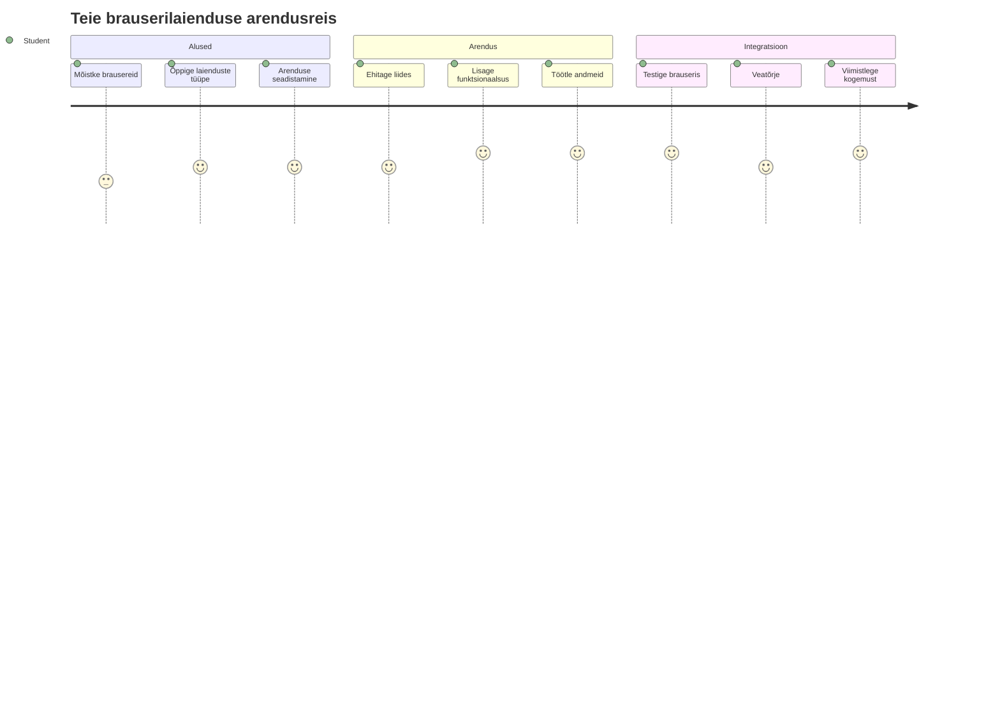
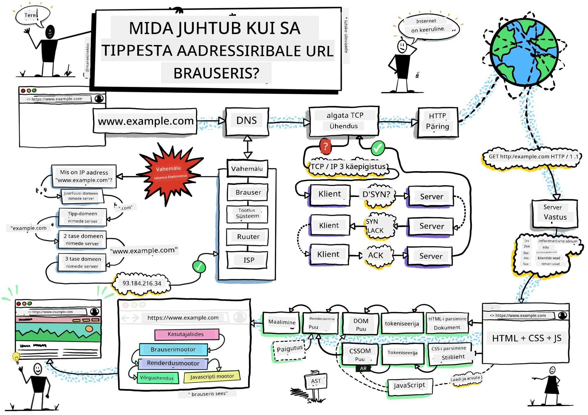
> Sketchnote autorilt [Wassim Chegham](https://dev.to/wassimchegham/ever-wondered-what-happens-when-you-type-in-a-url-in-an-address-bar-in-a-browser-3dob)

## Esimene viktoriin enne loengut

[Esimene viktoriin enne loengut](https://ff-quizzes.netlify.app/web/quiz/23)

### Sissejuhatus

Brauserilaiendused on mini-rakendused, mis parandavad sinu veebibrausimise kogemust. Nagu Tim Berners-Lee originaalne visioon interaktiivsest veebist, laiendavad laiendused brauseri võimekust lihtsast dokumentide vaatamisest kaugemale. Alates paroolihalduritest, mis hoiavad sinu kontod turvaliselt, kuni värvipüüdjateni, mis aitavad disaineritel leida täiuslikke toone – laiendused lahendavad igapäevaseid sirvimisväljakutseid.

Enne kui ehitame sinu esimest laiendust, saame aru, kuidas brauserid töötavad. Nii nagu Alexander Graham Bell pidi enne telefoni leiutamist mõistma heli edastamist, aitab brauserite põhitõdede teadmine sul luua laiendusi, mis integreeruvad sujuvalt olemasolevate brauserisüsteemidega.

Selle õppetunni lõpuks mõistad brauseri arhitektuuri ja oled hakanud ehitama oma esimest laiendust.

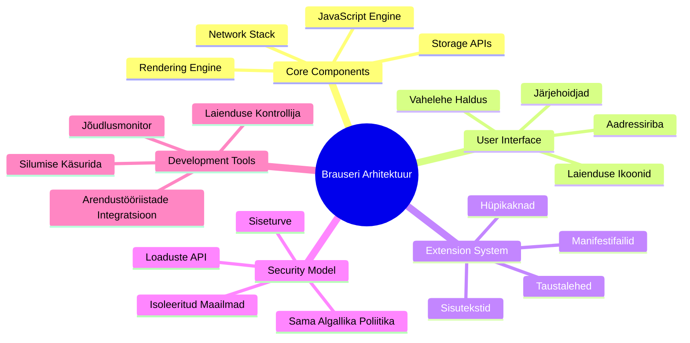
## Veebibrauserite mõistmine

Veebibrauser on sisuliselt keerukas dokumendi tõlgendaja. Kui sisestad aadressiribale "google.com", teostab brauser keeruka toimingute jada – taotleb sisu serveritest üle kogu maailma, seejärel analüüsib ja kuvab selle koodi interaktiivsete veebilehtedena, mida näed.

See protsess peegeldab, kuidas esimene veebibrauser, WorldWideWeb, kavandas Tim Berners-Lee 1990. aastal, et teha hüperlinkidega dokumendid kõigile kättesaadavaks.

✅ **Veidi ajalugu**: Esimene brauser kandis nime 'WorldWideWeb' ja selle lõi Sir Timothy Berners-Lee 1990. aastal.

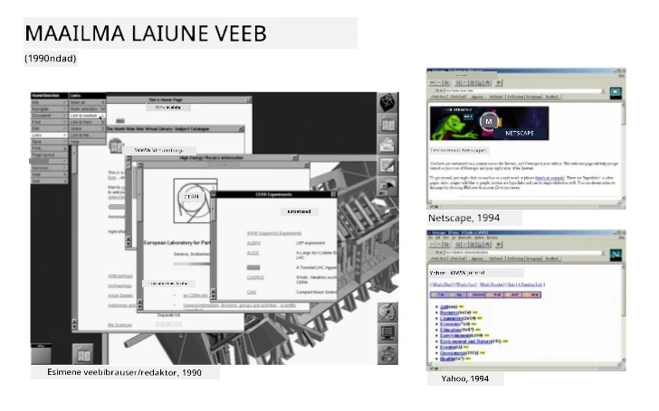
> Mõned varased brauserid, allikas [Karen McGrane](https://www.slideshare.net/KMcGrane/week-4-ixd-history-personal-computing)

### Kuidas brauserid veebisisu töötlevad

Protsess URL-i sisestamise ja veebilehe nägemise vahel hõlmab mitut koordineeritud sammu, mis toimuvad sekundite jooksul:

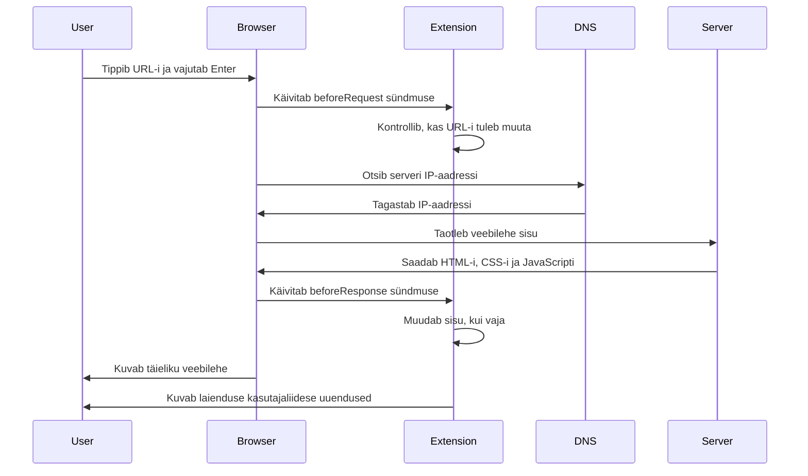
**Seda protsessi tehakse:**
- **Tõlgib** masinloetava URL-i serveri IP-aadressiks DNS-päringu abil
- **Loodab** turvalise ühenduse veebiserveriga HTTP või HTTPS protokollide kaudu
- **Taotleb** serverilt konkreetset veebilehe sisu
- **Vastuvõtt** HTML märgistust, CSS stiile ja JavaScripti koodi serverist
- **Renderdab** kogu sisu interaktiivseks veebileheks, mida näed

### Brauseri põhiomadused

Kaasaegsed brauserid pakuvad mitmeid funktsioone, mida laienduste arendajad võivad kasutada:

| Funktsioon | Eesmärk | Laienduste võimalused |
|---------|---------|------------------------|
| **Renderdamismootor** | Kuvab HTML-i, CSS-i ja JavaScripti | Sisu modifitseerimine, stiilide süstimine |
| **JavaScripti mootor** | Käivitab JavaScripti koodi | Kohandatud skriptid, API suhtlus |
| **Kohalik salvestus** | Salvestab andmeid kohalikult | Kasutaja eelistused, vahemälu andmed |
| **Võrgu virn** | Haldab veebipäringuid | Päringute jälgimine, andmete analüüs |
| **Turvemudel** | Kaitseb kasutajaid pahatahtliku sisu eest | Sisu filtreerimine, turvalisuse täiustused |

**Neid omadusi mõistes saad:**
- **Tuvastada**, kus su laiendus saab kõige rohkem väärtust lisada
- **Valida** oma laienduse funktsionaalsuse jaoks sobivad brauseri API-d
- **Disainida** laiendusi, mis töötavad efektiivselt brauserisüsteemidega koos
- **Tagada**, et su laiendus järgib brauseri turvalisuse parimaid tavasid

### Mitme brauseri arendamise kaalutlused

Erinevad brauserid rakendavad standardeid väikeste erinevustega, sarnaselt sellele, kuidas erinevad programmeerimiskeeled võivad sama algoritmi erinevalt käidelda. Chrome, Firefox ja Safari omavad igaüks unikaalseid omadusi, mida arendajad laienduse loomisel peavad arvesse võtma.

> 💡 **Professionaalne näpunäide**: Kasuta [caniuse.com](https://www.caniuse.com), et kontrollida, milliseid veebitehnoloogiaid erinevad brauserid toetavad. See on hindamatu, kui planeerid oma laienduse funktsioone!

**Olulised kaalutlused laienduse arendamisel:**
- **Testi** oma laiendust Chrome, Firefox ja Edge brauseridel
- **Kohanda** end erinevate brauserilaienduse API-de ja manifestifailide formaadiga
- **Halda** erinevaid jõudlusomadusi ja piiranguid
- **Paku** varuvaateid brauseripõhistele funktsioonidele, mis võivad mitte toetatud olla

✅ **Analüütika näpunäide**: Saad määratleda, milliseid brausereid sinu kasutajad eelistavad, paigaldades analüütika pakette oma veebiarendusprojektidesse. See info aitab sul toetada esmalt just neid brausereid.

## Brauserilaienduste mõistmine

Brauserilaiendused lahendavad tavalisi veebisirvimise väljakutseid, lisades funktsionaalsust otse brauseri liidesesse. Selle asemel, et nõuda eraldi rakendusi või keerukaid töövooge, pakuvad laiendused kohe juurdepääsu tööriistadele ja funktsioonidele.

See kontseptsioon peegeldab, kuidas varajased arvutipioneerid nagu Douglas Engelbart nägid inimvõimekuste suurendamist tehnoloogiaga – laiendused suurendavad sinu brauseri põhifunktsionaalsust.

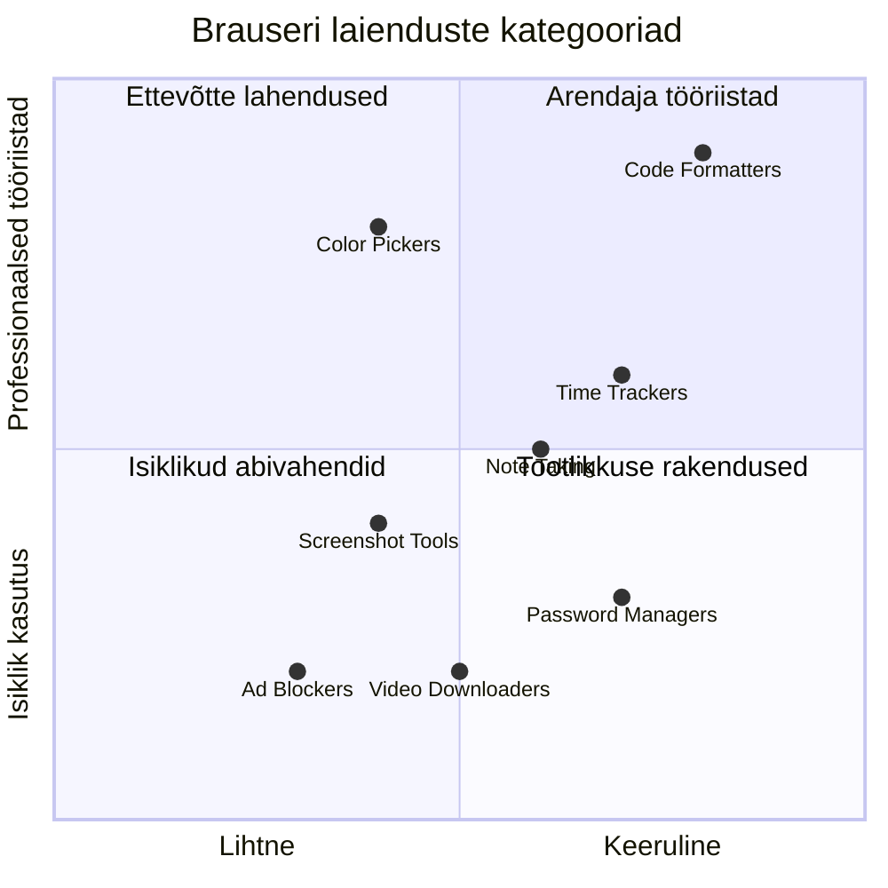
**Populaarsed laienduse kategooriad ja nende eelised:**
- **Produktiivsustööriistad**: Ülesannete haldurid, märkmete tegemise rakendused ja ajaluguri jälgijad, mis aitavad sul organiseeritud püsida
- **Turbetäiustused**: Paroolihaldurid, reklaamiblokaatorid ja privaatsustööriistad, mis kaitsevad sinu andmeid
- **Arendajatööriistad**: Koodi formaadijad, värvi valijad ja silumisabilised, mis lihtsustavad arendustööd
- **Sisu täiustamine**: Lugemisrežiimid, videotõmbajad ja ekraanipiltide tööriistad, mis parandavad sinu veebikogemust

✅ **Mõtisklusküsimus**: Millised on sinu lemmik brauserilaiendid? Milliseid spetsiifilisi ülesandeid nad täidavad ja kuidas nad parandavad sinu sirvimiskogemust?

### 🔄 **Pedagoogiline kontroll**
**Brauseri arhitektuuri mõistmine**: Enne laienduse arendamise juurde liikumist veendu, et suudad:
- ✅ Selgitada, kuidas brauserid töötlevad veebipäringuid ja kuvavad sisu
- ✅ Tuvastada brauseri arhitektuuri peamised komponendid
- ✅ Mõista, kuidas laiendused integreeruvad brauseri funktsionaalsusega
- ✅ Tuvastada turvemudel, mis kasutajaid kaitseb

**Kiire enesetest**: Kas suudad jälgida teekonda URL-i sisestamisest veebileheni?
1. **DNS-päring** konverteerib URL-i IP-aadressiks
2. **HTTP-päring** hangib sisu serverist
3. **Analüüs** töötleb HTML-i, CSS-i ja JavaScripti
4. **Renderdamine** kuvab lõpliku veebilehe
5. **Laiendused** võivad sisu modifitseerida mitmes etapis

## Laienduste paigaldamine ja haldamine

Laienduste paigaldamise protsessi mõistmine aitab sul ette näha kasutajakogemust, kui inimesed paigaldavad sinu laienduse. Paigaldamine on standardiseeritud kaasaegsetes brauserid, väikeste erinevustega liidese kujunduses.

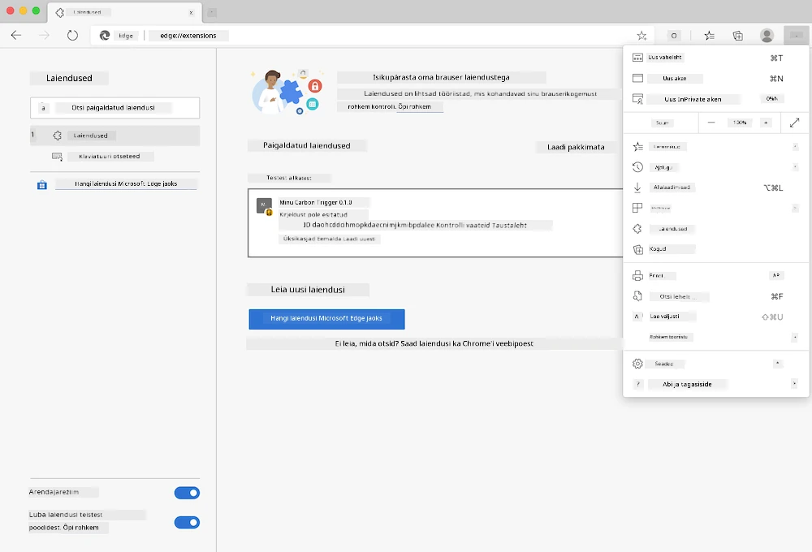

> **Oluline**: Veendu, et lülitad sisse arendajarežiimi ja lubad laiendusi teistest poodidest, kui testid oma laiendusi.

### Arenduse laienduse paigaldamise protsess

Kui arendad ja testid oma laiendusi, järgi seda töövoogu:

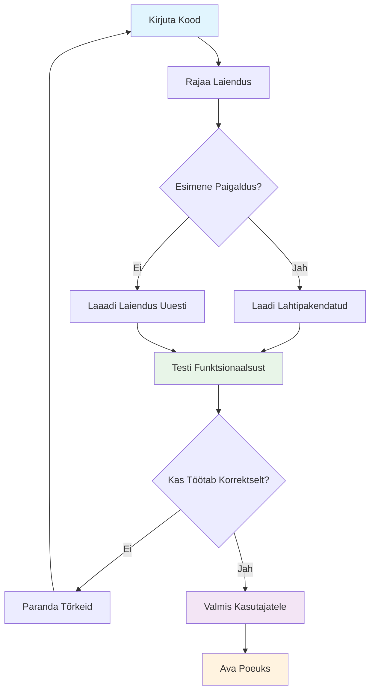
```bash
# 1. samm: Ehita oma laiendus
npm run build
```

**Seda käsklust teostatakse:**
- **Kompileerib** sinu lähtekoodi brauseri jaoks valmis failideks
- **Pakendib** JavaScripti moodulid optimeeritud pakkideks
- **Loob** lõpliku laienduse failid kausta `/dist`
- **Valmistab** su laienduse paigaldamiseks ja testimiseks ette

**Samm 2: Navigeeri brauserilaienduste haldamise lehele**
1. **Ava** oma brauseri laienduste haldamise leht
2. **Kliki** “Seaded ja muu” nupule (ikoon `...`) üleval paremal
3. **Vali** rippmenüüst "Laiendused"

**Samm 3: Laadi oma laiendus**
- **Uue paigaldusena**: vali `load unpacked` ja vali oma `/dist` kaust
- **Uuendusteks**: kliki `reload` juba paigaldatud laienduse kõrval
- **Testimiseks**: lülita sisse "Arendajarežiim", et pääseda juurde täiendavatele silumisfunktsioonidele

### Tootmise laienduse paigaldamine

> ✅ **Märkus**: Need arendusjuhised kehtivad eelkõige oma ehitatud laiendustele. Avaldatud laienduste paigaldamiseks külasta ametlikke brauserilaienduste poode, näiteks [Microsoft Edge'i lisandmoodulite poodi](https://microsoftedge.microsoft.com/addons/Microsoft-Edge-Extensions-Home).

**Arusaam erinevusest:**
- **Arenduspaigaldused** võimaldavad testida avaldamata laiendusi arenduse käigus
- **Poepäevad** pakuvad kontrollitud ja avaldatud laiendusi automaatsete uuendustega
- **Sideloading** lubab paigaldada laiendusi väljaspool ametlikke poode (nõuab arendajarežiimi)

## Sinu süsinikujalajälje laienduse loomine

Loome brauserilaienduse, mis kuvab sinu regiooni energiakasutuse süsinikujalajälje. See projekt demonstreerib olulisi laienduse arenduse kontseptsioone, luues praktilise vahendi keskkonnateadlikkuse tõstmiseks.

See lähenemine järgib "tegemise kaudu õppimise" põhimõtet, mis on tõestanud oma efektiivsust alates John Dewey haridusteooriatest – kombineerides tehnilisi oskusi mõtestatud maailmas kasutamiseks.

### Projekti nõuded

Enne arendust alustamist kogume vajalikud ressursid ja sõltuvused:

**Nõutav API ligipääs:**
- **[CO2 Signal API võti](https://www.co2signal.com/)**: Sisesta oma e-posti aadress, et saada tasuta API võti
- **[Regionaalne kood](http://api.electricitymap.org/v3/zones)**: Leia oma regioonikood [Electricity Mapi](https://www.electricitymap.org/map) abil (näiteks Boston kasutab 'US-NEISO')

**Arendustööriistad:**
- **[Node.js ja NPM](https://www.npmjs.com)**: Pakendihaldus tööriist projekti sõltuvuste paigaldamiseks
- **[Stardikood](../../../../5-browser-extension/start)**: Lae alla kaust `start` arenduse alustamiseks

✅ **Õpi veel**: Paranda oma pakendihalduse oskusi selle [laiendatud õpimooduliga](https://docs.microsoft.com/learn/modules/create-nodejs-project-dependencies/?WT.mc_id=academic-77807-sagibbon)

### Projekti struktuuri mõistmine

Projekti struktuuri mõistmine aitab korraldada arendustööd tõhusalt. Nii nagu Aleksandria raamatukogu oli organiseeritud lihtsaks teadmiste leidmiseks, teeb hästi struktureeritud koodibaas arenduse tõhusamaks:

```
project-root/
├── dist/                    # Built extension files
│   ├── manifest.json        # Extension configuration
│   ├── index.html           # User interface markup
│   ├── background.js        # Background script functionality
│   └── main.js              # Compiled JavaScript bundle
├── src/                     # Source development files
│   └── index.js             # Your main JavaScript code
├── package.json             # Project dependencies and scripts
└── webpack.config.js        # Build configuration
```

**Mis iga fail teeb:**
- **`manifest.json`**: **Määratleb** laienduse metaandmed, õigused ja sisenemispunktid
- **`index.html`**: **Loomise** kasutajaliides, mis kuvatakse, kui kasutajad klikivad laiendusel
- **`background.js`**: **Haldab** taustatööid ja brauseri sündmuste kuulajaid
- **`main.js`**: **Sisaldab** lõplikku kokku pakitud JavaScripti pärast build protsessi
- **`src/index.js`**: **Majutab** sinu peamist arenduskoodi, mis kompileeritakse `main.js`-ks

> 💡 **Organiseerimise näpunäide**: Hoia oma API võti ja regioonikood turvalises märkmikus, et neid oleks arendamise ajal lihtne leida. Vajad neid väärtusi, et testida laienduse funktsionaalsust.

✅ **Turvanõuanne**: Ära kunagi pane API võtmeid või tundlikke mandaate oma koodirepositoriumi. Järgmisena näitame, kuidas neid turvaliselt käsitleda.

## Laiendi liidese loomine

Nüüd ehitame kasutajaliidese komponente. Laiendus kasutab kahte ekraani: seadistamise ekraani esialgseks häälestuseks ja tulemuste ekraani andmete kuvamiseks.

See järgib progressiivse avaldamise põhimõtet, mida kasutatakse liidese disainis alates arvutite varajasest ajast – info ja valikute loogiline esitlemine, et mitte kasutajat üle koormata.

### Laiendi ülevaated

**Seadistamise vaade** – kasutaja esimese sõidu konfigureerimine:
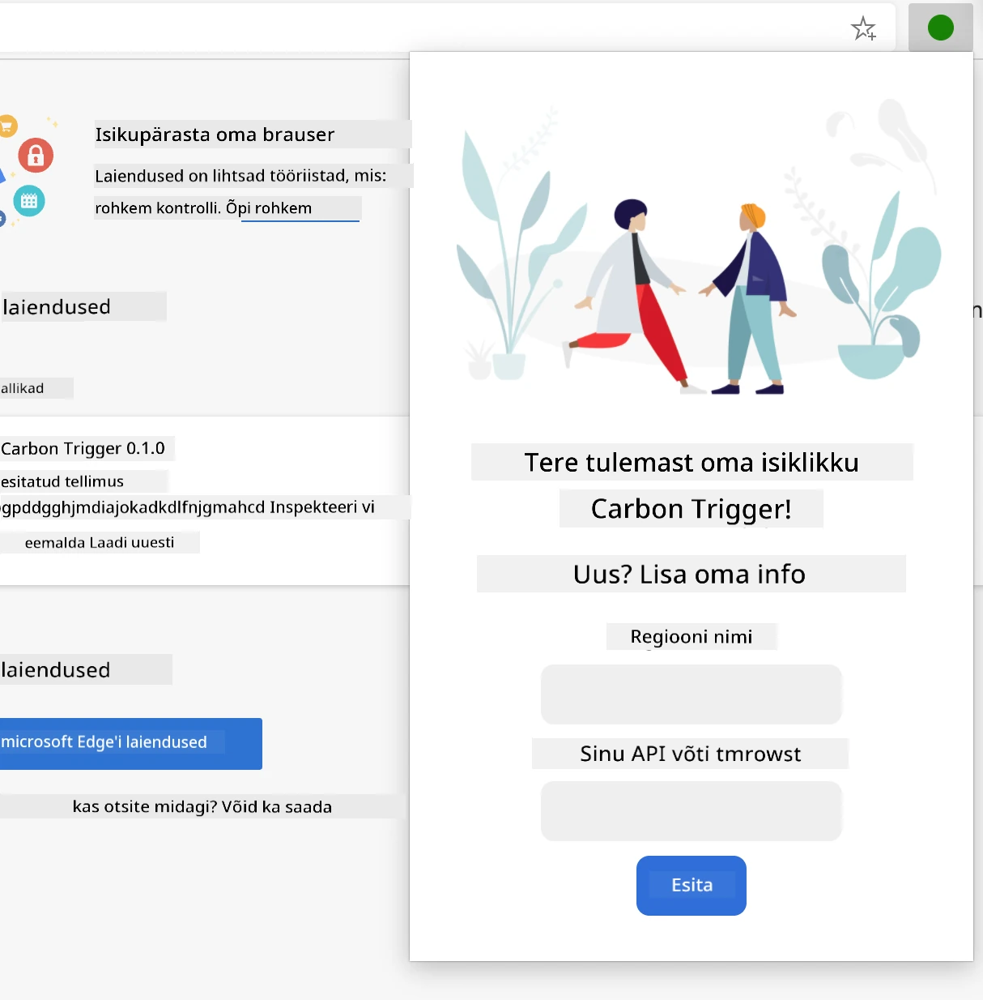

**Tulemuste vaade** – süsiniku jalajälje andmete kuvamine:
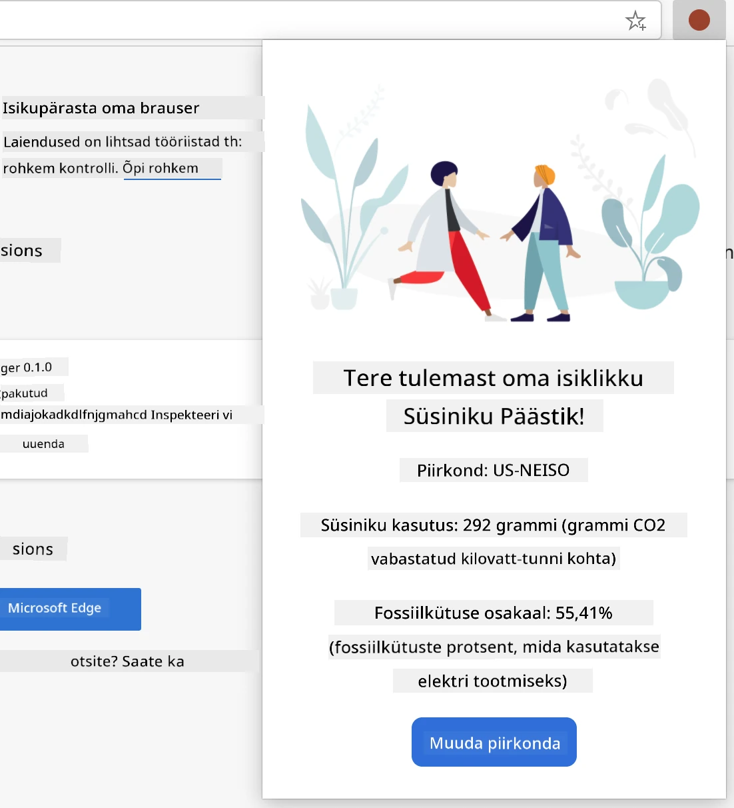

### Seadistusvormi ehitamine

Seadistusvorm kogub kasutaja seadistusandmeid esmasel kasutamisel. Kui see on seadistatud, säilib info brauseri salvestuses edaspidisteks sessioonideks.

Failis `/dist/index.html` lisa see vormi struktuur:

```html
<form class="form-data" autocomplete="on">
    <div>
        <h2>New? Add your Information</h2>
    </div>
    <div>
        <label for="region">Region Name</label>
        <input type="text" id="region" required class="region-name" />
    </div>
    <div>
        <label for="api">Your API Key from tmrow</label>
        <input type="text" id="api" required class="api-key" />
    </div>
    <button class="search-btn">Submit</button>
</form>
```

**Seda vormi tehakse:**
- **Loomine** semantilise vormi struktuur koos korrektselt seotud sildiste ja sisenditega
- **Lubamine** brauseri automaatse täitmise funktsioonile paremaks kasutajakogemuseks
- **Nõutakse** mõlema välja täitmist enne vormi esitamist, kasutades atribuuti `required`
- **Korraldamine** sisendid kirjeldavate klassinimedega stiilimiseks ja JavaScripti valimiseks
- **Juhiste pakkumine** kasutajatele, kes täidavad laienduse esimest korda

### Tulemuste kuvamise loomine

Järgmine, loo tulemuste ala, mis kuvab süsiniku jalajälje andmeid. Lisa see HTML vormi alla:

```html
<div class="result">
    <div class="loading">loading...</div>
    <div class="errors"></div>
    <div class="data"></div>
    <div class="result-container">
        <p><strong>Region: </strong><span class="my-region"></span></p>
        <p><strong>Carbon Usage: </strong><span class="carbon-usage"></span></p>
        <p><strong>Fossil Fuel Percentage: </strong><span class="fossil-fuel"></span></p>
    </div>
    <button class="clear-btn">Change region</button>
</div>
```

**See struktuur teeb võimalikult:**
- **`loading`**: kuvab laadimise sõnumi, kuni API päring on töös
- **`errors`**: näitab veateateid, kui API kõned ebaõnnestuvad või andmed on vigased
- **`data`**: hoiab tooraineandmeid silumiseks arenduse ajal
- **`result-container`**: esitab kasutajatele vormindatud süsiniku jalajälje info
- **`clear-btn`**: võimaldab kasutajatel regiooni muuta ja laiendust uuesti seadistada

### Build protsessi seadistamine

Nüüd paigaldame projekti sõltuvused ja testime build protsessi:

```bash
npm install
```

**Seda paigaldusprotsessi tehakse:**
- **Laeb alla** Webpacki ja muud arendussõltuvused, mis on määratud `package.json`-is
- **Seadistab** build tööriistakomplekti kaasaegse JavaScripti kompileerimiseks
- **Valmistab** arenduskeskkonna ette laienduse ehitamiseks ja testimiseks
- **Lubab** koodi pakendamise, optimeerimise ja mitme brauseriga ühilduvuse omadused

> 💡 **Build protsessi mõistmine**: Webpack pakendab sinu lähtekoodi failist `/src/index.js` faili `/dist/main.js`. See protsess optimeerib koodi tootmiseks ja tagab brauseri ühilduvuse.

### Oma edenemise testimine

Nüüd saad oma laiendust testida:
1. **Käivita** build-käsk, et kompileerida oma kood
2. **Laadi** laiendus brauserisse arendajarežiimi abil
3. **Kontrolli**, et vorm kuvatakse õigesti ja näeb professionaalne välja
4. **Veendu**, et kõik vormielemendid on korralikult joondatud ja funktsionaalsed

**Mida oled saavutanud:**
- **Ehitanud** laienduse aluseks oleva HTML struktuuri
- **Loonud** nii konfiguratsiooni- kui ka tulemuste liidesed õige semantilise märgistusega
- **Määranud** kaasaegse arendusvoo tööstusharu standardseid vahendeid kasutades
- **Valmistanud** aluse interaktiivse JavaScript funktsionaalsuse lisamiseks

### 🔄 **Pedagoogiline kontroll**
**Laienduse arendamise edenemine**: Kinnita oma arusaam enne jätkamist:
- ✅ Kas suudad selgitada iga projekti struktuuri faili eesmärki?
- ✅ Kas mõistad, kuidas build-protsess teisendab sinu lähtekoodi?
- ✅ Miks me eraldame konfiguratsiooni ja tulemused erinevatesse kliendiliidese osadesse?
- ✅ Kuidas vormi struktuur toetab nii kasutatavust kui ligipääsetavust?

**Arendusvoo mõistmine**: Nüüd peaksid suutma:
1. **Muuta** HTMLi ja CSSi oma laienduse liidese jaoks
2. **Käivita** build-käsk, et koostada muudatused
3. **Laadi** laiendus uuesti brauseris, et testida uuendusi
4. **Siluda** probleeme brauseri arendajatööriistade abil

Oled lõpetanud esimese etapi brauserilaienduse arendamises. Nagu Wrighti vennad pidid muuseas mõistma aerodünaamikat enne lendu, valmistab nende aluseks olevate kontseptsioonide tundmine sind ette keerukamate interaktiivsete funktsioonide loomisele järgmises õppetükis.

## GitHub Copiloti agendi väljakutse 🚀

Kasuta agendi režiimi, et lahendada järgmine väljakutse:

**Kirjeldus:** Täienda brauserilaiendust, lisades vormi valideerimise ja kasutajatagasiside funktsioonid, et parandada kasutajakogemust API võtmete ja piirkonnakoodide sisestamisel.

**Prompt:** Loo JavaScripti valideerimisfunktsioonid, mis kontrollivad, kas API võtmepaik sisaldab vähemalt 20 märki ning kas piirkonnakood vastab õigele vormingule (nt „US-NEISO“). Lisa visuaalne tagasiside, muutes sisendi servavärvi roheliseks kehtiva sisendi puhul ja punaseks kehtetu puhul. Lisa ka lüliti funktsioon API võtme näitamiseks/peitmiseks turvalisuse tagamiseks.

Õpi rohkem [agendi režiimi](https://code.visualstudio.com/blogs/2025/02/24/introducing-copilot-agent-mode) kohta siit.

## 🚀 Väljakutse

Vaata ringi mõnes brauserilaienduste poest ja installeeri üks oma brauserisse. Sa saad selle faile huvitavalt uurida. Mida avastad?

## Loengu järgne test

[Loengu järgne test](https://ff-quizzes.netlify.app/web/quiz/24)

## Ülevaade ja iseseisev õppimine

Selles õppetükis õppisid veidi veebibrauseri ajaloost; kasuta võimalust ja loe rohkem selle ajaloost ning kuidas Maailma Terviku Veebi looja selle kasutust ette kujutas. Mõned kasulikud leheküljed on:

[Veebibrauserite ajalugu](https://www.mozilla.org/firefox/browsers/browser-history/)

[Veebi ajalugu](https://webfoundation.org/about/vision/history-of-the-web/)

[Intervjuu Tim Berners-Leega](https://www.theguardian.com/technology/2019/mar/12/tim-berners-lee-on-30-years-of-the-web-if-we-dream-a-little-we-can-get-the-web-we-want)

### ⚡ **Mida saad järgmise 5 minutiga teha**
- [ ] Ava Chrome/Edge laienduste leht (chrome://extensions) ja vaata, mis sul paigaldatud on
- [ ] Vaata oma brauseri DevToolsi Network vahekaarti veebilehe laadimisel
- [ ] Proovi veebilehe allikat vaadata (Ctrl+U), et näha HTML struktuuri
- [ ] Inspekteeri suvalist veebilehe elementi ja muuda selle CSSi DevToolsis

### 🎯 **Mida saad selle tunni jooksul saavutada**
- [ ] Täida loengu järgne test ja mõista brauserite põhialuseid
- [ ] Loo lihtne manifest.json fail brauserilaienduse jaoks
- [ ] Ehita lihtne „Hello World“ laiendus, mis kuvab hüpikakna
- [ ] Testi laienduse laadimist arendajarežiimis
- [ ] Uuri sihtbrauseri laienduste dokumentatsiooni

### 📅 **Sinu nädala pikkune laienduste arendusretk**
- [ ] Loo funktsionaalne brauserilaiendus, millel on kasulik otstarve
- [ ] Õpi sisu skripte, taustaskripte ja hüpikakende interaktsioone
- [ ] Saavuta meisterlikkus brauseri APIde nagu storage, tabs ja messaging kasutamises
- [ ] Kujunda kasutajasõbralikud liidesed oma laiendusele
- [ ] Testi laiendust erinevatel veebisaitidel ja olukordades
- [ ] Avalda oma laiendus brauseri laienduste poes

### 🌟 **Sinu kuu pikkune brauseriarenduse teekond**
- [ ] Ehita mitmeid laiendusi, mis lahendavad erinevaid kasutajaprobleeme
- [ ] Õpi edasijõudnud brauseri APIsid ja turvalise arenduse parimaid praktikaid
- [ ] Panusta avatud lähtekoodiga brauserilaienduste projektidesse
- [ ] Saavuta meisterlikkus ristbrauseri ühilduvuses ja progressiivses täiendamises
- [ ] Loo laienduste arendamise tööriistu ja malle teistele
- [ ] Saa brauserilaienduste ekspert, kes aitab teisi arendajaid

## 🎯 Sinu brauserilaienduse meistriklassi ajajoon

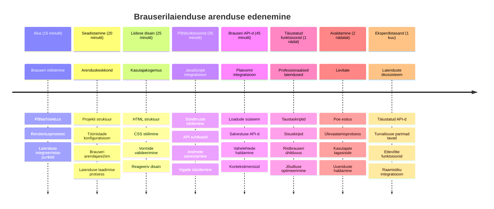
### 🛠️ Sinu laienduse arendustööriistade kokkuvõte

Pärast selle õppetüki lõpetamist oled omandanud:
- **Brauseri arhitektuuri teadmised**: arusaam renderdusmootoritest, turvemudelitest ja laienduste integreerimisest
- **Arenduskeskkond**: kaasaegne tööriistade komplekt Webpackiga, NPM ja silumiste võimalustega
- **UI/UX alused**: semantiline HTML struktuur progressiivsed paljastamise mustrid
- **Turvateadlikkus**: arusaam brauseri õigustest ja turvalisest arendamisest
- **Ristbrauseri kontseptsioonid**: teadmised ühilduvusnõuetest ja testimisviisidest
- **API integreerimine**: alus väliste andmeallikatega töötamiseks
- **Professionaalne arendusvoog**: tööstusharu standardite järgi arendamine ja testimine

**Reaalsetes ülesannetes** rakendatavad oskused:
- **Veebiarendus**: ühelt lehelt rakendused ja progressiivsed veebirakendused
- **Lauaarvutirakendused**: Electron ja veebipõhised lauaarvuti tarkvaralahendused
- **Mobiiliarendus**: hübriidrakendused ja veebipõhised mobiililahendused
- **Ettevõtte tööriistad**: sisemised tootlikkuse rakendused ja töövoo automatiseerimine
- **Avatud lähtekood**: panustamine brauserilaienduste projektidesse ja veebistandarditesse

**Järgmine tasand**: oled valmis lisama interaktiivset funktsionaalsust, töötama brauseri APIdega ja looma laiendusi, mis lahendavad reaalseid kasutajaprobleeme!

## Kodutöö

[Muuda oma laienduse stiili](assignment.md)

---

<!-- CO-OP TRANSLATOR DISCLAIMER START -->
**Vastutusest loobumine**:
See dokument on tõlgitud kasutades AI tõlketeenust [Co-op Translator](https://github.com/Azure/co-op-translator). Kuigi püüame tagada täpsust, palun arvestage, et automatiseeritud tõlked võivad sisaldada vigu või ebatäpsusi. Algne dokument selle emakeeles tuleks pidada autoriteetseks allikaks. Kriitilise teabe puhul soovitatakse kasutada professionaalset inimtõlget. Me ei vastuta selle tõlke kasutamisest tingitud arusaamatuste või valesti tõlgendamise eest.
<!-- CO-OP TRANSLATOR DISCLAIMER END -->