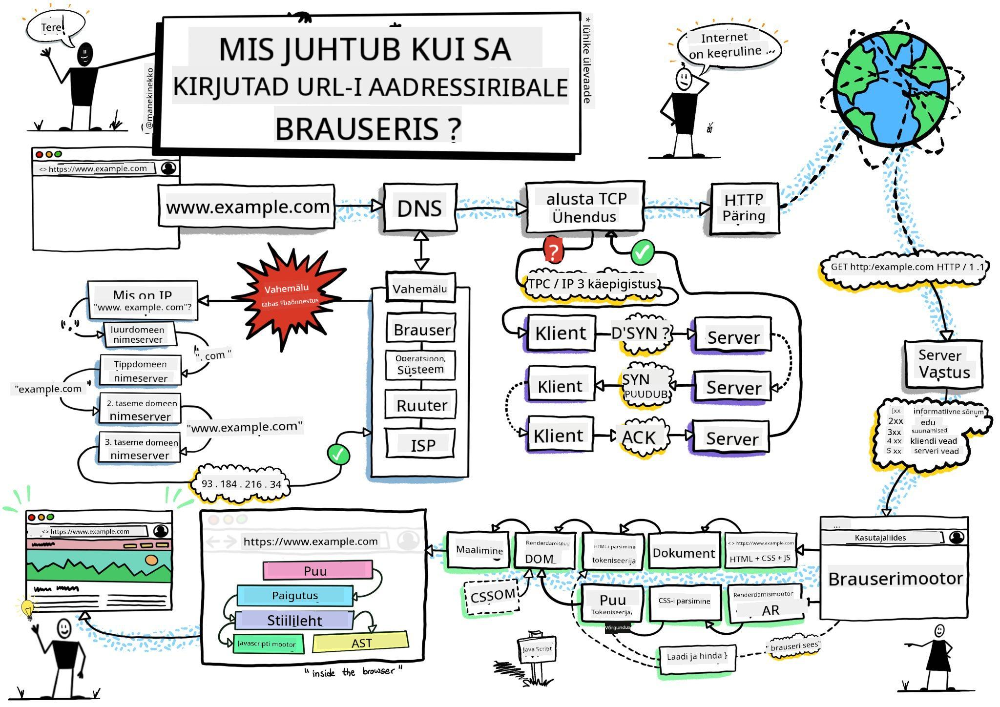
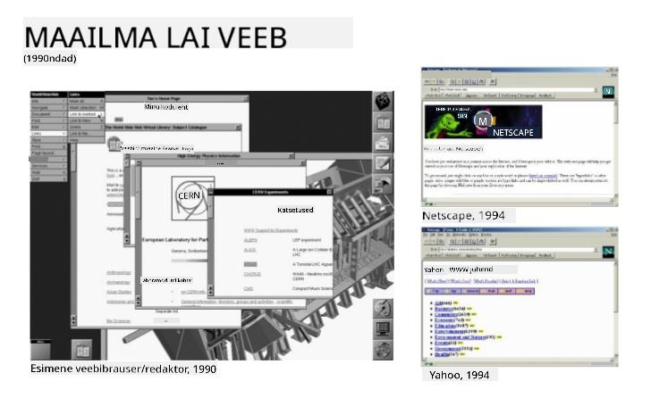
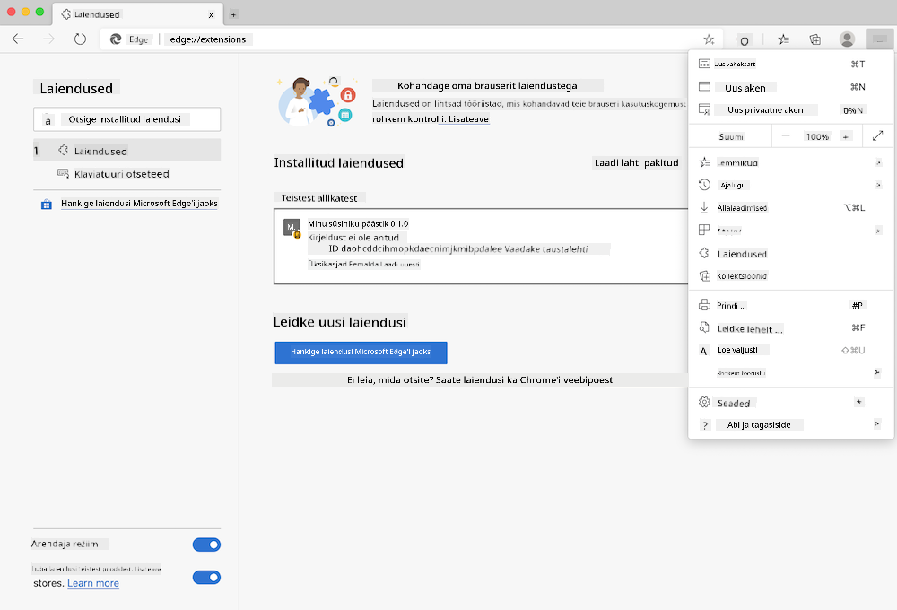
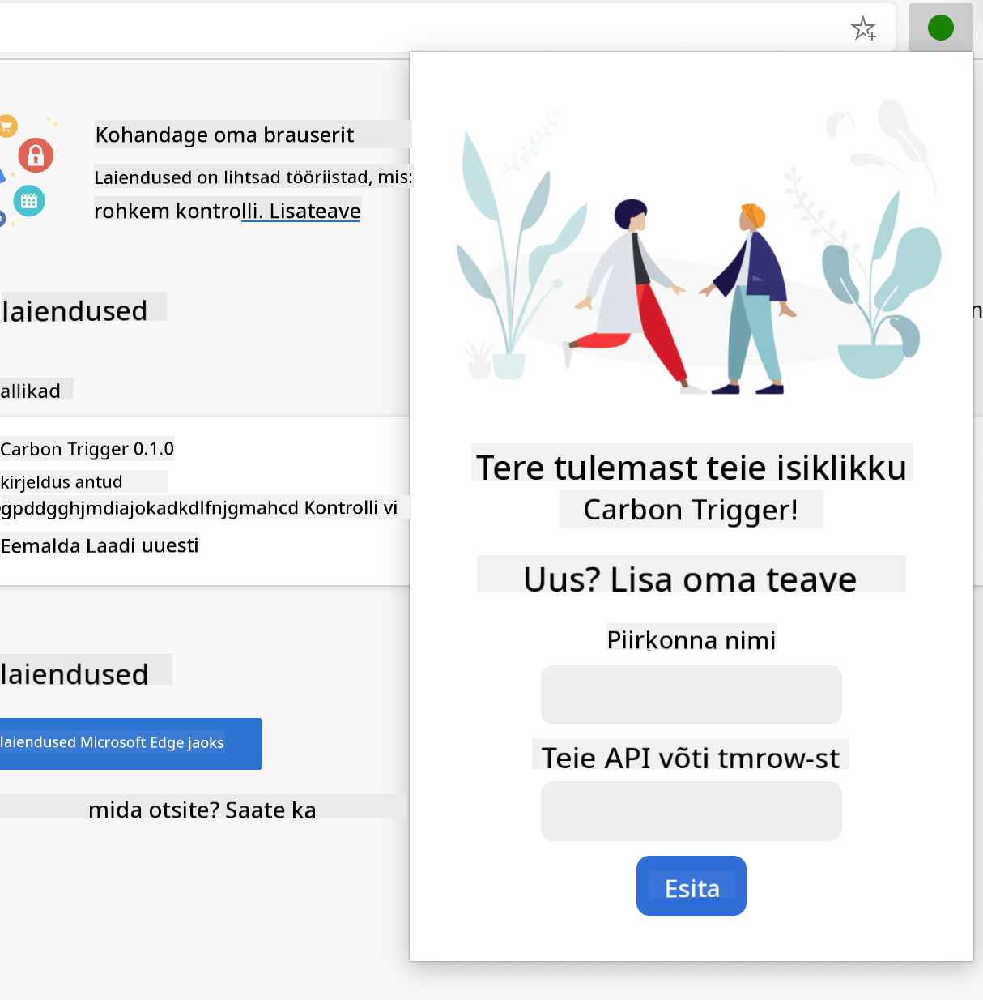
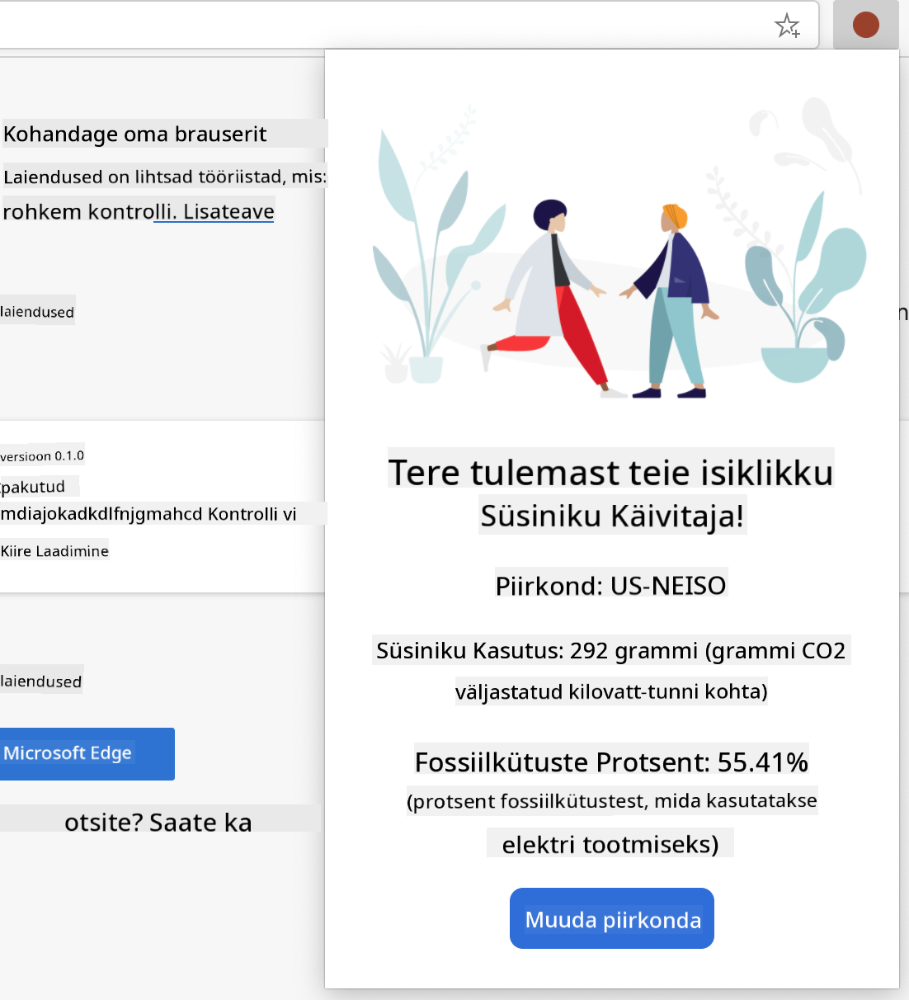

<!--
CO_OP_TRANSLATOR_METADATA:
{
  "original_hash": "2326d04e194a10aa760b51f5e5a1f61d",
  "translation_date": "2025-10-11T12:22:18+00:00",
  "source_file": "5-browser-extension/1-about-browsers/README.md",
  "language_code": "et"
}
-->
# Brauserilaiendite projekt, 1. osa: Kõik brauseritest


> Visandi autor [Wassim Chegham](https://dev.to/wassimchegham/ever-wondered-what-happens-when-you-type-in-a-url-in-an-address-bar-in-a-browser-3dob)

## Eelloengu viktoriin

[Eelloengu viktoriin](https://ff-quizzes.netlify.app/web/quiz/23)

### Sissejuhatus

Brauserilaiendid lisavad brauserile täiendavat funktsionaalsust. Enne kui hakkad ühte looma, peaksid veidi õppima, kuidas brauserid oma tööd teevad.

### Brauseri kohta

Selles õppetundide sarjas õpid, kuidas luua brauserilaiendit, mis töötab Chrome'i, Firefoxi ja Edge'i brauserites. Selles osas avastad, kuidas brauserid töötavad, ja paned paika brauserilaiendi elemendid.

Aga mis on brauser täpsemalt? See on tarkvararakendus, mis võimaldab lõppkasutajal serverist sisu juurde pääseda ja seda veebilehtedel kuvada.

✅ Väike ajalugu: esimene brauser kandis nime 'WorldWideWeb' ja selle lõi Sir Timothy Berners-Lee 1990. aastal.


> Mõned varased brauserid, autor [Karen McGrane](https://www.slideshare.net/KMcGrane/week-4-ixd-history-personal-computing)

Kui kasutaja ühendub internetiga, kasutades URL-i (Uniform Resource Locator) aadressi, tavaliselt Hypertext Transfer Protocol'i kaudu `http` või `https` aadressiga, suhtleb brauser veebiserveriga ja toob veebilehe.

Sel hetkel kuvab brauseri renderdamismootor selle kasutaja seadmes, olgu selleks mobiiltelefon, lauaarvuti või sülearvuti.

Brauserid suudavad ka sisu vahemällu salvestada, et seda ei peaks iga kord serverist uuesti tooma. Nad võivad salvestada kasutaja sirvimisajaloo, talletada 'küpsiseid', mis on väikesed andmeosad, mis sisaldavad teavet kasutaja tegevuse kohta, ja palju muud.

Oluline on meeles pidada, et brauserid ei ole kõik ühesugused! Igal brauseril on oma tugevused ja nõrkused, ning professionaalne veebiarendaja peab mõistma, kuidas veebilehti erinevates brauserites hästi toimima panna. See hõlmab väikeste vaateakende, näiteks mobiiltelefoni ekraani, käsitlemist, samuti kasutaja, kes on võrguühenduseta.

Väga kasulik veebisait, mida tasub oma eelistatud brauseris järjehoidjatesse lisada, on [caniuse.com](https://www.caniuse.com). Veebilehti luues on väga abiks kasutada caniuse'i toetatud tehnoloogiate loendeid, et pakkuda oma kasutajatele parimat tuge.

✅ Kuidas saad teada, millised brauserid on sinu veebisaidi kasutajate seas kõige populaarsemad? Kontrolli oma analüütikat – veebiarenduse käigus saad paigaldada erinevaid analüütikapakette, mis näitavad, milliseid brausereid kasutavad erinevad populaarsed brauserid.

## Brauserilaiendid

Miks võiksid soovida luua brauserilaiendit? See on mugav lisand brauserile, kui vajad kiiret juurdepääsu korduvatele ülesannetele. Näiteks, kui sul on vaja sageli kontrollida värve erinevatel veebilehtedel, mida kasutad, võid paigaldada värvivalija brauserilaiendi. Kui sul on raskusi paroolide meelespidamisega, võid kasutada paroolihalduri brauserilaiendit.

Brauserilaiendite loomine on ka lõbus. Need keskenduvad piiratud arvule ülesannetele, mida nad hästi täidavad.

✅ Millised on sinu lemmikbrauserilaiendid? Milliseid ülesandeid nad täidavad?

### Laiendite paigaldamine

Enne kui hakkad looma, vaata brauserilaiendi loomise ja juurutamise protsessi. Kuigi iga brauser haldab seda ülesannet veidi erinevalt, on protsess Chrome'is ja Firefoxis sarnane Edge'i näitega:



> Märkus: Veendu, et lülitad sisse arendaja režiimi ja lubad laiendite paigaldamise teistest poodidest.

Sisuliselt on protsess järgmine:

- loo oma laiend, kasutades `npm run build` 
- navigeeri brauseris laiendite paneelile, kasutades paremas ülanurgas olevat "Seaded ja veel" nuppu (ikoon `...`)
- kui see on uus paigaldus, vali `load unpacked`, et laadida värske laiend selle ehituskaustast (meie puhul `/dist`) 
- või klõpsa `reload`, kui uuendad juba paigaldatud laiendit

✅ Need juhised kehtivad ise loodud laiendite kohta; et paigaldada laiendeid, mis on avaldatud iga brauseri laiendite poes, peaksid navigeerima nende [poodidesse](https://microsoftedge.microsoft.com/addons/Microsoft-Edge-Extensions-Home) ja paigaldama soovitud laiendi.

### Alustamine

Sa hakkad looma brauserilaiendit, mis kuvab sinu piirkonna süsinikujalajälge, näidates energia kasutust ja energiaallikat. Laiendil on vorm, mis kogub API-võtme, et pääseda CO2 Signal'i API-le.

**Sul on vaja:**

- [API-võtit](https://www.co2signal.com/); sisesta oma e-post sellel lehel ja sulle saadetakse võti
- [koodi oma piirkonna jaoks](http://api.electricitymap.org/v3/zones), mis vastab [Electricity Map](https://www.electricitymap.org/map) kaardile (näiteks Bostonis kasutan 'US-NEISO').
- [algkoodi](../../../../5-browser-extension/start). Laadi alla `start` kaust; sa täidad koodi selles kaustas.
- [NPM](https://www.npmjs.com) - NPM on paketihaldustööriist; paigalda see kohalikult ja paketid, mis on loetletud sinu `package.json` failis, paigaldatakse sinu veebivarade jaoks.

✅ Õpi rohkem paketihalduse kohta selles [suurepärases õppe moodulis](https://docs.microsoft.com/learn/modules/create-nodejs-project-dependencies/?WT.mc_id=academic-77807-sagibbon)

Võta hetk, et koodibaasi läbi vaadata:

dist
    -|manifest.json (vaikeseaded siin)
    -|index.html (esikülje HTML märgistus siin)
    -|background.js (taust JS siin)
    -|main.js (koostatud JS)
src
    -|index.js (sinu JS-kood läheb siia)

✅ Kui sul on API-võti ja piirkonna kood käepärast, salvesta need kuskile märkmetesse tulevaseks kasutamiseks.

### Laiendi HTML-i loomine

Sellel laiendil on kaks vaadet. Üks API-võtme ja piirkonna koodi kogumiseks:



Ja teine piirkonna süsinikukasutuse kuvamiseks:



Alustame vormi HTML-i loomisega ja selle stiilimisega CSS-i abil.

Kaustas `/dist` ehitad vormi ja tulemuste ala. Failis `index.html` täida määratud vormiala:

```HTML
<form class="form-data" autocomplete="on">
	<div>
		<h2>New? Add your Information</h2>
	</div>
	<div>
		<label for="region">Region Name</label>
		<input type="text" id="region" required class="region-name" />
	</div>
	<div>
		<label for="api">Your API Key from tmrow</label>
		<input type="text" id="api" required class="api-key" />
	</div>
	<button class="search-btn">Submit</button>
</form>	
```
See on vorm, kuhu salvestatud teave sisestatakse ja salvestatakse kohalikku salvestusse.

Järgmiseks loo tulemuste ala; lisa lõpliku vormi sildi alla mõned div-id:

```HTML
<div class="result">
	<div class="loading">loading...</div>
	<div class="errors"></div>
	<div class="data"></div>
	<div class="result-container">
		<p><strong>Region: </strong><span class="my-region"></span></p>
		<p><strong>Carbon Usage: </strong><span class="carbon-usage"></span></p>
		<p><strong>Fossil Fuel Percentage: </strong><span class="fossil-fuel"></span></p>
	</div>
	<button class="clear-btn">Change region</button>
</div>
```
Sel hetkel võid proovida ehitust. Veendu, et paigaldad selle laiendi paketisõltuvused:

```
npm install
```

See käsk kasutab npm-i, Node Package Manager'it, et paigaldada webpack sinu laiendi ehitusprotsessi jaoks. Webpack on komplekteerija, mis haldab koodi kompileerimist. Selle protsessi väljundit näed, vaadates `/dist/main.js` - näed, et kood on komplekteeritud.

Praegu peaks laiend ehituma ja kui juurutad selle Edge'i brauserisse laiendina, näed vormi kenasti kuvatuna.

Palju õnne, oled astunud esimesed sammud brauserilaiendi loomise suunas. Järgmistes õppetundides teed selle funktsionaalsemaks ja kasulikumaks.

---

## 🚀 Väljakutse

Vaata brauserilaiendite poodi ja paigalda üks oma brauserisse. Saad selle faile huvitaval viisil uurida. Mida avastad?

## Järelloengu viktoriin

[Järelloengu viktoriin](https://ff-quizzes.netlify.app/web/quiz/24)

## Ülevaade ja iseseisev õpe

Selles õppetunnis õppisid veidi veebibrauseri ajaloost; kasuta seda võimalust, et õppida, kuidas World Wide Web'i loojad kujutasid ette selle kasutamist, lugedes rohkem selle ajaloost. Mõned kasulikud saidid on:

[Veebibrauserite ajalugu](https://www.mozilla.org/firefox/browsers/browser-history/)

[Veebi ajalugu](https://webfoundation.org/about/vision/history-of-the-web/)

[Intervjuu Tim Berners-Lee'ga](https://www.theguardian.com/technology/2019/mar/12/tim-berners-lee-on-30-years-of-the-web-if-we-dream-a-little-we-can-get-the-web-we-want)

## Ülesanne 

[Muuda oma laiendi stiili](assignment.md)

---

**Lahtiütlus**:  
See dokument on tõlgitud AI tõlketeenuse [Co-op Translator](https://github.com/Azure/co-op-translator) abil. Kuigi püüame tagada täpsust, palume arvestada, et automaatsed tõlked võivad sisaldada vigu või ebatäpsusi. Algne dokument selle algses keeles tuleks pidada autoriteetseks allikaks. Olulise teabe puhul soovitame kasutada professionaalset inimtõlget. Me ei vastuta selle tõlke kasutamisest tulenevate arusaamatuste või valesti tõlgenduste eest.