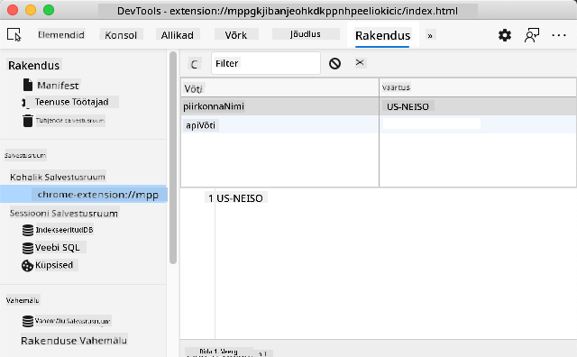

<!--
CO_OP_TRANSLATOR_METADATA:
{
  "original_hash": "a7587943d38d095de8613e1b508609f5",
  "translation_date": "2025-10-11T12:21:12+00:00",
  "source_file": "5-browser-extension/2-forms-browsers-local-storage/README.md",
  "language_code": "et"
}
-->
# Brauserilaiendi projekt, osa 2: API kasutamine ja kohalik salvestus

## Eelloengu viktoriin

[Eelloengu viktoriin](https://ff-quizzes.netlify.app/web/quiz/25)

### Sissejuhatus

Selles tunnis õpid, kuidas API-d kasutada, esitades oma brauserilaiendi vormi ja kuvades tulemused laiendis. Lisaks õpid, kuidas salvestada andmeid brauseri kohalikku salvestusse, et neid hiljem kasutada.

✅ Järgi nummerdatud segmente vastavates failides, et teada, kuhu oma kood paigutada.

### Laiendi elementide seadistamine:

Selleks ajaks oled juba loonud HTML-vormi ja tulemuste `<div>` oma brauserilaiendi jaoks. Edaspidi tuleb töötada `/src/index.js` failis ja ehitada laiendit järk-järgult. Vaata [eelmist tundi](../1-about-browsers/README.md), et saada juhiseid projekti seadistamise ja ehitamise protsessi kohta.

Töötades `index.js` failis, alusta mõne `const` muutujaga, et hoida väärtusi, mis on seotud erinevate väljadega:

```JavaScript
// form fields
const form = document.querySelector('.form-data');
const region = document.querySelector('.region-name');
const apiKey = document.querySelector('.api-key');

// results
const errors = document.querySelector('.errors');
const loading = document.querySelector('.loading');
const results = document.querySelector('.result-container');
const usage = document.querySelector('.carbon-usage');
const fossilfuel = document.querySelector('.fossil-fuel');
const myregion = document.querySelector('.my-region');
const clearBtn = document.querySelector('.clear-btn');
```

Kõik need väljad viitavad nende CSS klassidele, nagu sa HTML-is eelmises tunnis seadistasid.

### Lisage kuulajad

Järgmisena lisa vormile ja tühjendusnupule sündmuste kuulajad, et midagi juhtuks, kui kasutaja esitab vormi või klõpsab tühjendusnuppu. Lisa ka rakenduse initsialiseerimise kutse faili lõppu:

```JavaScript
form.addEventListener('submit', (e) => handleSubmit(e));
clearBtn.addEventListener('click', (e) => reset(e));
init();
```

✅ Pane tähele lühendatud süntaksit, mida kasutatakse submit- või click-sündmuse kuulamiseks, ja kuidas sündmus edastatakse handleSubmit või reset funktsioonidele. Kas suudad kirjutada selle lühendatud süntaksi pikemas vormis? Kumb variant sulle rohkem meeldib?

### Ehita init() ja reset() funktsioonid:

Nüüd ehitad funktsiooni, mis initsialiseerib laiendi, mida nimetatakse init():

```JavaScript
function init() {
	//if anything is in localStorage, pick it up
	const storedApiKey = localStorage.getItem('apiKey');
	const storedRegion = localStorage.getItem('regionName');

	//set icon to be generic green
	//todo

	if (storedApiKey === null || storedRegion === null) {
		//if we don't have the keys, show the form
		form.style.display = 'block';
		results.style.display = 'none';
		loading.style.display = 'none';
		clearBtn.style.display = 'none';
		errors.textContent = '';
	} else {
        //if we have saved keys/regions in localStorage, show results when they load
        displayCarbonUsage(storedApiKey, storedRegion);
		results.style.display = 'none';
		form.style.display = 'none';
		clearBtn.style.display = 'block';
	}
};

function reset(e) {
	e.preventDefault();
	//clear local storage for region only
	localStorage.removeItem('regionName');
	init();
}

```

Selles funktsioonis on huvitav loogika. Lugedes seda, kas näed, mis toimub?

- Kaks `const` muutujat on seadistatud kontrollima, kas kasutaja on salvestanud APIKey ja piirkonna koodi kohalikku salvestusse.
- Kui üks neist on null, kuvatakse vorm, muutes selle stiili 'block'-iks.
- Peidetakse tulemused, laadimisala ja clearBtn ning tühjendatakse veatekst.
- Kui olemas on võti ja piirkond, alustatakse rutiini:
  - API kutsumine, et saada süsiniku kasutuse andmeid.
  - Tulemuste ala peitmine.
  - Vormi peitmine.
  - Tühjendusnupu kuvamine.

Enne edasi liikumist on kasulik õppida brauserites saadaval olevast olulisest kontseptsioonist: [LocalStorage](https://developer.mozilla.org/docs/Web/API/Window/localStorage). LocalStorage on kasulik viis stringide salvestamiseks brauseris `key-value` paarina. Seda tüüpi veebisalvestust saab JavaScripti abil manipuleerida, et hallata andmeid brauseris. LocalStorage ei aegu, samas kui SessionStorage, teine veebisalvestuse tüüp, kustutatakse brauseri sulgemisel. Erinevatel salvestustüüpidel on nende kasutamisel plusse ja miinuseid.

> Märkus - sinu brauserilaiendil on oma kohalik salvestus; peamine brauseriaken on eraldi instants ja käitub eraldi.

Sa seadistad oma APIKey stringiväärtusega, näiteks, ja näed, et see on Edge'is seadistatud, kui "inspekteerid" veebilehte (saad brauseris paremklõpsuga inspekteerida) ja lähed rakenduste vahekaardile, et näha salvestust.



✅ Mõtle olukordadele, kus sa EI tahaks salvestada andmeid LocalStorage'is. Üldiselt on API võtmete salvestamine LocalStorage'is halb idee! Kas näed, miks? Meie puhul, kuna meie rakendus on ainult õppimiseks ja seda ei avaldata rakenduste poes, kasutame seda meetodit.

Pane tähele, et kasutad veebirakenduse API-d LocalStorage'i manipuleerimiseks, kas `getItem()`, `setItem()` või `removeItem()` abil. See on laialdaselt toetatud erinevates brauserites.

Enne `displayCarbonUsage()` funktsiooni loomist, mida kutsutakse `init()` sees, loome funktsionaalsuse, mis käsitleb esialgset vormi esitust.

### Vormiesituse käsitlemine

Loo funktsioon nimega `handleSubmit`, mis võtab argumendiks sündmuse `(e)`. Peata sündmuse levik (antud juhul tahame peatada brauseri värskendamise) ja kutsu uut funktsiooni `setUpUser`, edastades argumendid `apiKey.value` ja `region.value`. Sel viisil kasutad kahte väärtust, mis tuuakse esialgse vormi kaudu, kui vastavad väljad on täidetud.

```JavaScript
function handleSubmit(e) {
	e.preventDefault();
	setUpUser(apiKey.value, region.value);
}
```

✅ Värskenda oma mälu - HTML, mille sa eelmises tunnis seadistasid, sisaldab kahte sisendvälja, mille `values` on haaratud `const` abil, mille sa faili alguses seadistasid, ja need on mõlemad `required`, nii et brauser takistab kasutajatel sisestamast nullväärtusi.

### Kasutaja seadistamine

Liikudes edasi `setUpUser` funktsiooni juurde, siin seadistad kohalikus salvestuses väärtused apiKey ja regionName jaoks. Lisa uus funktsioon:

```JavaScript
function setUpUser(apiKey, regionName) {
	localStorage.setItem('apiKey', apiKey);
	localStorage.setItem('regionName', regionName);
	loading.style.display = 'block';
	errors.textContent = '';
	clearBtn.style.display = 'block';
	//make initial call
	displayCarbonUsage(apiKey, regionName);
}
```

See funktsioon kuvab laadimissõnumi, kuni API-d kutsutakse. Selleks ajaks oled jõudnud selle brauserilaiendi kõige olulisema funktsiooni loomiseni!

### Süsiniku kasutuse kuvamine

Lõpuks on aeg API-d pärida!

Enne edasi liikumist peaksime arutama API-sid. API-d ehk [Rakenduste Programmeerimisliidesed](https://www.webopedia.com/TERM/A/API.html) on veebiarendaja tööriistakasti kriitiline element. Need pakuvad standardseid viise programmide omavaheliseks suhtlemiseks ja liidestamiseks. Näiteks, kui ehitad veebisaiti, mis vajab andmebaasi päringut, võib keegi olla loonud API, mida saad kasutada. Kuigi API-sid on palju erinevaid tüüpe, on üks populaarsemaid [REST API](https://www.smashingmagazine.com/2018/01/understanding-using-rest-api/).

✅ Termin 'REST' tähistab 'Representational State Transfer' ja hõlmab erinevalt konfigureeritud URL-ide kasutamist andmete hankimiseks. Tee veidi uurimistööd erinevate API tüüpide kohta, mis arendajatele saadaval on. Milline formaat sulle kõige rohkem meeldib?

Selles funktsioonis on olulisi asju, mida tähele panna. Esiteks, pane tähele [`async` märksõna](https://developer.mozilla.org/docs/Web/JavaScript/Reference/Statements/async_function). Funktsioonide kirjutamine nii, et need töötavad asünkroonselt, tähendab, et nad ootavad tegevuse, näiteks andmete tagastamise, lõpetamist enne jätkamist.

Siin on kiire video `async` kohta:

[](https://youtube.com/watch?v=YwmlRkrxvkk "Async ja Await lubaduste haldamiseks")

> 🎥 Klõpsa ülaloleval pildil, et vaadata videot async/await kohta.

Loo uus funktsioon, et pärida C02Signal API-d:

```JavaScript
import axios from '../node_modules/axios';

async function displayCarbonUsage(apiKey, region) {
	try {
		await axios
			.get('https://api.co2signal.com/v1/latest', {
				params: {
					countryCode: region,
				},
				headers: {
					'auth-token': apiKey,
				},
			})
			.then((response) => {
				let CO2 = Math.floor(response.data.data.carbonIntensity);

				//calculateColor(CO2);

				loading.style.display = 'none';
				form.style.display = 'none';
				myregion.textContent = region;
				usage.textContent =
					Math.round(response.data.data.carbonIntensity) + ' grams (grams C02 emitted per kilowatt hour)';
				fossilfuel.textContent =
					response.data.data.fossilFuelPercentage.toFixed(2) +
					'% (percentage of fossil fuels used to generate electricity)';
				results.style.display = 'block';
			});
	} catch (error) {
		console.log(error);
		loading.style.display = 'none';
		results.style.display = 'none';
		errors.textContent = 'Sorry, we have no data for the region you have requested.';
	}
}
```

See on suur funktsioon. Mis siin toimub?

- Parimate tavade järgimiseks kasutad `async` märksõna, et muuta see funktsioon asünkroonseks. Funktsioon sisaldab `try/catch` plokki, kuna see tagastab lubaduse, kui API tagastab andmed. Kuna sul pole kontrolli API vastamise kiiruse üle (see ei pruugi üldse vastata!), pead seda ebakindlust käsitlema, kutsudes seda asünkroonselt.
- Pärid co2signal API-d, et saada oma piirkonna andmeid, kasutades oma API võtit. Selle võtme kasutamiseks pead kasutama autentimist oma päise parameetrites.
- Kui API vastab, määrad selle vastuse andmete erinevad elemendid ekraaniosadele, mille seadistasid nende andmete kuvamiseks.
- Kui tekib viga või kui tulemust pole, kuvad veateate.

✅ Asünkroonsete programmeerimismustrite kasutamine on veel üks väga kasulik tööriist sinu tööriistakastis. Loe [erinevatest viisidest](https://developer.mozilla.org/docs/Web/JavaScript/Reference/Statements/async_function), kuidas seda tüüpi koodi konfigureerida.

Palju õnne! Kui ehitad oma laiendi (`npm run build`) ja värskendad seda laiendite paneelil, on sul töötav laiend! Ainus asi, mis ei tööta, on ikoon, ja selle parandad järgmises tunnis.

---

## 🚀 Väljakutse

Oleme nendes tundides arutanud mitut tüüpi API-sid. Vali üks veebirakenduse API ja uuri põhjalikult, mida see pakub. Näiteks vaata brauserites saadaval olevaid API-sid, nagu [HTML Drag and Drop API](https://developer.mozilla.org/docs/Web/API/HTML_Drag_and_Drop_API). Mis teeb sinu arvates API suurepäraseks?

## Järelloengu viktoriin

[Järelloengu viktoriin](https://ff-quizzes.netlify.app/web/quiz/26)

## Ülevaade ja iseseisev õppimine

Selles tunnis õppisid LocalStorage'i ja API-de kohta, mis mõlemad on professionaalse veebiarendaja jaoks väga kasulikud. Kas suudad mõelda, kuidas need kaks asja koos töötavad? Mõtle, kuidas arhitektiksid veebisaiti, mis salvestaks esemeid, mida API kasutaks.

## Ülesanne

[Adopteeri API](assignment.md)

---

**Lahtiütlus**:  
See dokument on tõlgitud AI tõlketeenuse [Co-op Translator](https://github.com/Azure/co-op-translator) abil. Kuigi püüame tagada täpsust, palume arvestada, et automaatsed tõlked võivad sisaldada vigu või ebatäpsusi. Algne dokument selle algses keeles tuleks pidada autoriteetseks allikaks. Olulise teabe puhul soovitame kasutada professionaalset inimtõlget. Me ei vastuta selle tõlke kasutamisest tulenevate arusaamatuste või valesti tõlgenduste eest.