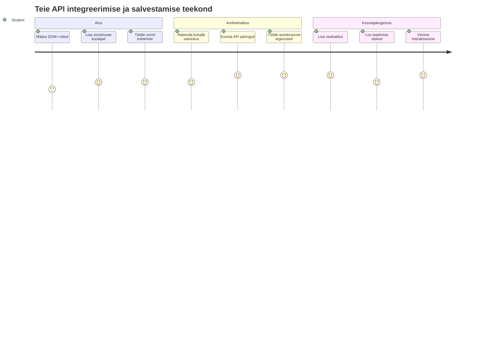
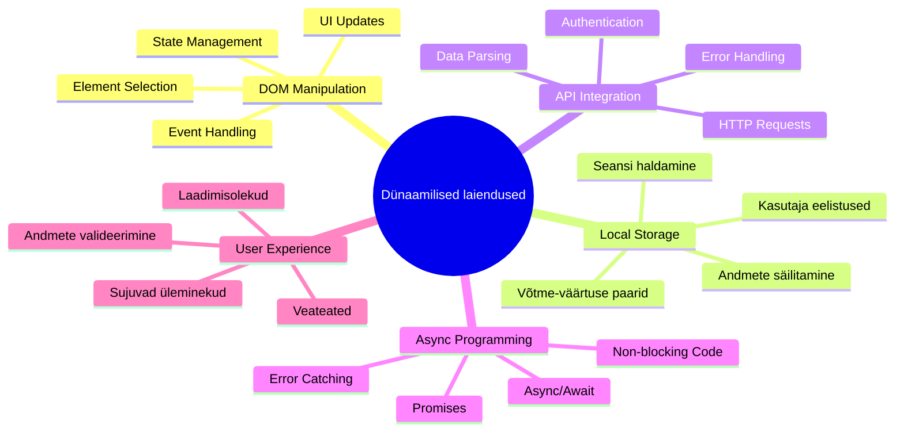
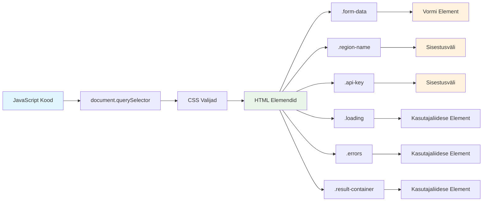
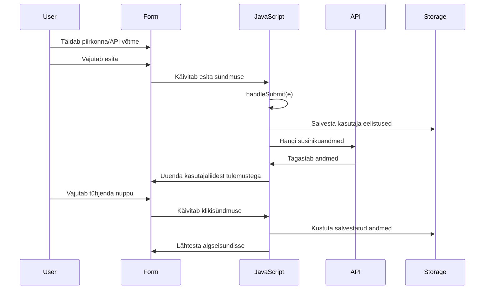
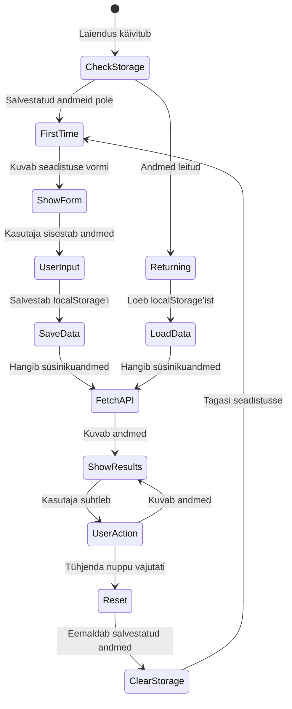
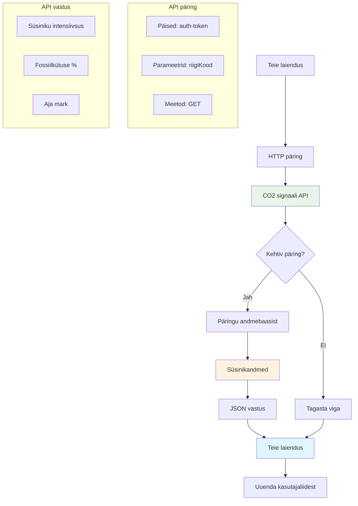
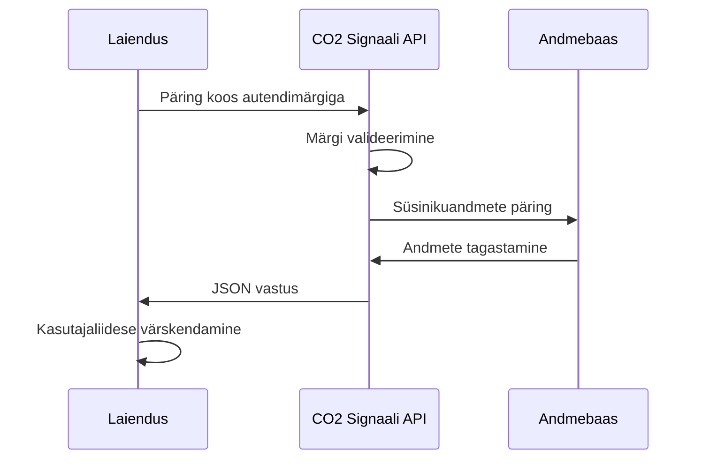
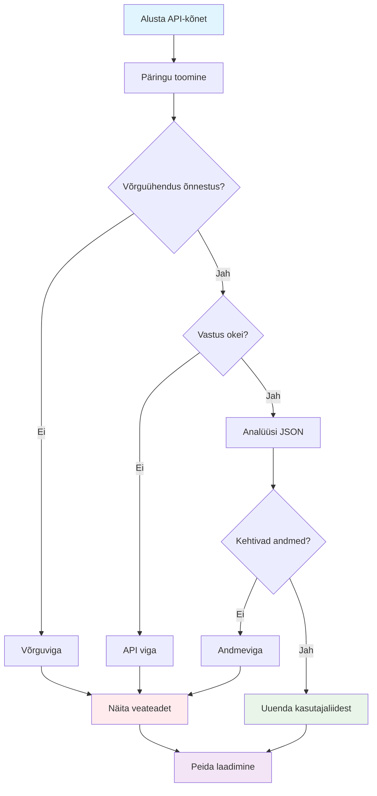
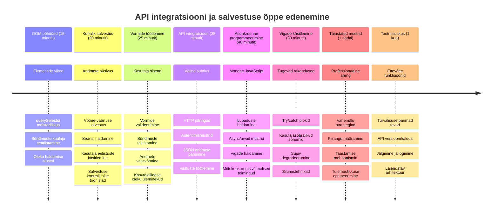

<!--
CO_OP_TRANSLATOR_METADATA:
{
  "original_hash": "2b6203a48c48d8234e0948353b47d84e",
  "translation_date": "2026-01-08T09:20:40+00:00",
  "source_file": "5-browser-extension/2-forms-browsers-local-storage/README.md",
  "language_code": "et"
}
-->
# Brauserilaiendi projekt Osa 2: API kõne tegemine, lokaalse salvestuse kasutamine


## Eel-loengu viktoriin

[Eel-loengu viktoriin](https://ff-quizzes.netlify.app/web/quiz/25)

## Sissejuhatus

Kas mäletad seda brauserilaiendit, mida hakkasid ehitama? Praegu on sul ilus vorm, kuid see on sisuliselt staatiline. Täna anname sellele elu, ühendades selle tõelise andmeallikaga ja andes sellele mälu.

Mõtle Apollo missioonikontrolli arvutitele – nad ei näidanud vaid fikseeritud teavet. Nad suhtlesid pidevalt kosmoselaevadega, uuendasid telemeetria andmeid ning mäletasid olulisi missiooni parameetreid. Just sellist dünaamilist käitumist me täna loome. Sinu laiend võtab internetist päris keskkonnateavet ja mäletab sinu seadeid järgmiseks korraks.

API integreerimine võib tunduda keeruline, kuid see on lihtsalt õpetamine sinu koodile, kuidas suhelda teiste teenustega. Olgu see siis ilmastikuandmete, sotsiaalmeedia voogude või süsiniku jalajälje info pärimine nagu täna teeme — kõik seisneb nende digitaalsete ühenduste loomises. Vaatame ka, kuidas brauserid suudavad teavet salvestada — sarnaselt sellele, kuidas raamatukogud kasutasid kaardikatalooge raamatute asukoha meelespidamiseks.

Selle tunni lõpuks on sul brauserilaiend, mis toob tavalise andmetest, salvestab kasutajaelistused ja pakub sujuvat kasutuskogemust. Alustame!


✅ Järgi nummerdatud segmentide juhiseid vastavates failides, et teada, kuhu oma koodi paigutada

## Määratle laiendi elemendid, mida manipuleerida

Enne kui su JavaScript saab kasutajaliidest muuta, vajab see viiteid konkreetsetele HTML elementidele. Võid seda mõelda nagu teleskoop, mis peab olema suunatud kindlatele tähtedele – enne kui Galileo võis uurida Jupiteri kuid, pidi ta esmalt Jupiteri üles leidma ja fookusesse seadma.

Sinu `index.js` failis loome `const` muutujad, mis salvestavad viited igale olulisemale vormi elemendile. See on nagu teadlased, kes märgistavad oma seadmed — selle asemel, et otsida kogu labori ulatuses, saavad nad otse ligi sellele, mida vajavad.


```javascript
// vormiväljad
const form = document.querySelector('.form-data');
const region = document.querySelector('.region-name');
const apiKey = document.querySelector('.api-key');

// tulemused
const errors = document.querySelector('.errors');
const loading = document.querySelector('.loading');
const results = document.querySelector('.result-container');
const usage = document.querySelector('.carbon-usage');
const fossilfuel = document.querySelector('.fossil-fuel');
const myregion = document.querySelector('.my-region');
const clearBtn = document.querySelector('.clear-btn');
```

**See kood teeb järgmist:**
- **Püüab kinni** vormi elemendid kasutades `document.querySelector()` koos CSS klassi selektoritega
- **Loodab** viited sisendväljadele regiooni nime ja API võtme jaoks
- **Ühendab** tulemite kuvamise elementidega süsiniku kasutusandmete jaoks
- **Seadistab** juurdepääsu kasutajaliidese elementidele nagu laadimisindikaatorid ja tõrketeated
- **Salvestab** iga elemendi viite `const` muutujatesse, et neid oleks lihtne kogu koodis korduvkasutada

## Lisa sündmuste kuulajad

Nüüd paneme laiendi reageerima kasutaja tegevustele. Sündmuste kuulajad on su koodi viis jälgida kasutaja interaktsioone. Võid neid mõelda nagu varased telefonivahetuskeskuse operaatorid — nad kuulasid saabuvat kõnet ja ühendasid õiged traatkeskused, kui keegi soovis ühendust luua.


```javascript
form.addEventListener('submit', (e) => handleSubmit(e));
clearBtn.addEventListener('click', (e) => reset(e));
init();
```

**Nende mõistete selgitus:**
- **Lisab** esitamissündmuse kuulaja vormile, mis käivitub, kui kasutaja vajutab Enter või klõpsab esita nuppu
- **Seob** klikikuulaja tühjendusnupuga, et vormi lähtestada
- **Annetab** sündmuse objekti `(e)` käsitlejafunktsioonidele täiendavaks kontrolliks
- **Kutsutakse** `init()` funktsioon kohe algsesse seisu seadmiseks

✅ Pane tähele siin kasutatud noolefunktsiooni süntaksit. See kaasaegne JavaScripti lähenemine on organiseeritum kui traditsioonilised funktsioonid, kuid mõlemad töötavad võrdselt hästi!

### 🔄 **Pedagoogiline kontrollpunkt**
**Sündmuste käsitlemise mõistmine**: Enne initsialiseerimise juurde liikumist kontrolleeri, kas sa suudad:
- ✅ Selgitada, kuidas `addEventListener` ühendab kasutaja tegevused JavaScripti funktsioonidega
- ✅ Mõista, miks me edastame sündmuse objekti `(e)` käsitlejatele
- ✅ Erinevustada `submit` ja `click` sündmusi
- ✅ Kirjeldada, millal ja miks `init()` funktsioon käivitatakse

**Kiire enese-test**: Mis juhtub, kui unustad vormi esitamises `e.preventDefault()`?
*Vastus: Leht laeb ümber, kaotades kogu JavaScripti oleku ja katkestades kasutajakogemuse*

## Ehita initsialiseerimise ja lähtestamise funktsioonid

Loome nüüd initsialiseerimisloogika sinu laiendile. `init()` funktsioon on nagu laeva navigatsioonisüsteem, mis kontrollib oma instrumente – ta määrab praeguse seisundi ja kohandab liidest vastavalt. Ta kontrollib, kas keegi on sinu laiendit juba kasutanud, ja laadib nende eelmised seaded.

`reset()` funktsioon annab kasutajatele võimaluse alustada nullist — nagu teadlased, kes lähtestavad seadmed katsete vahel, et tagada puhtad andmed.

```javascript
function init() {
	// Kontrolli, kas kasutaja on varem salvestanud API mandaadid
	const storedApiKey = localStorage.getItem('apiKey');
	const storedRegion = localStorage.getItem('regionName');

	// Sea laienduse ikoon üldiseks roheliseks (kohatäide tulevase tunni jaoks)
	// TODO: Rakenda ikooni uuendus järgmisel tunnil

	if (storedApiKey === null || storedRegion === null) {
		// Esmakordne kasutaja: näita seadistuse vormi
		form.style.display = 'block';
		results.style.display = 'none';
		loading.style.display = 'none';
		clearBtn.style.display = 'none';
		errors.textContent = '';
	} else {
		// Tagasi tulev kasutaja: laadige nende salvestatud andmed automaatselt
		displayCarbonUsage(storedApiKey, storedRegion);
		results.style.display = 'none';
		form.style.display = 'none';
		clearBtn.style.display = 'block';
	}
}

function reset(e) {
	e.preventDefault();
	// Tühjenda salvestatud piirkond, et lubada kasutajal valida uus asukoht
	localStorage.removeItem('regionName');
	// Taaskäivita initsialiseerimisprotsess
	init();
}
```

**Siin toimub:**
- **Hangitakse** salvestatud API võti ja regioon brauseri lokaalsest salvestusest
- **Kontrollitakse**, kas kasutaja on esimene kord (puuduvad salvestatud andmed) või korduvkasutaja
- **Kuvatakse** seadistusvorm uutele kasutajatele ja peidetakse teised liidese elemendid
- **Laetakse** automaatselt salvestatud andmed korduvkasutajatele ning kuvatakse lähtestamise võimalus
- **Haldatakse** kasutajaliidese seisundit vastavalt olemasolevatele andmetele

**Lokaalse salvestuse peamised mõisted:**
- **Püsib** andmed brauseri sessioonide vahel (vastandina session storage’i)
- **Salvestab** andmeid võtme-väärtuse paaridena kasutades `getItem()` ja `setItem()` meetodeid
- **Tagastab** `null`, kui vastavat võtit ei leita
- **Pakkuge** lihtsat viisi kasutajaelistuste ja seadete meelespidamiseks

> 💡 **Brauseri salvestuse mõistmine**: [LocalStorage](https://developer.mozilla.org/docs/Web/API/Window/localStorage) on nagu laiendi püsiv mälu. Mõtle vanale Aleksandria raamatukogule, mis hoidis käsikirju – info jäi kättesaadavaks isegi siis, kui teadlased lahkusid ja tagasi tulid.
>
> **Peamised omadused:**
> - **Püsib** andmed ka pärast brauseri sulgemist
> - **Üle elab** arvuti taaskäivitused ja brauseri kokkujooksmised
> - **Pakub** märkimisväärset salvestusmahtu kasutajaelistustele
> - **Annab** viivitamatu juurdepääsu ilma võrgu viivitusteta

> **Tähelepanu**: Sinu brauserilaiendil on oma isoleeritud lokaalne salvestus, mis on eraldatud tavapärastest veebilehtedest. See tagab turvalisuse ja takistab konflikte teiste veebisaitidega.

Sa saad oma salvestatud andmeid vaadata, avades brauseri arendajatööriistad (F12), liikudes vahekaardile **Application** ja avades sektsiooni **Local Storage**.




> ⚠️ **Turvalisuse kaalutlus**: Produktionsrakendustes tähendab API võtmete salvestamine LocalStorage’is turvariske, sest JavaScript saab neid andmeid lugeda. Õppimise eesmärgil see lähenemine sobib, aga päris rakendustes tuleb tundlikud võtmed hoida turvaliselt serveripoolses salvestuses.

## Töötle vormi esitamist

Nüüd vaatame, mis juhtub, kui keegi esitab su vormi. Vaikimisi laadib brauserid pärast vormi esitamist lehe uuesti, aga me püüame selle käitumise kinni, et luua sujuvam kogemus.

See lähenemine sarnaneb missioonikontrolli suhtlemisele kosmoselaevadega – selle asemel, et kogu süsteemi iga saatmise järel lähtestada, hoitakse pidevat tööd ja töödeldakse uusi andmeid.

Loo funktsioon, mis püüab vormi esitamise sündmuse ja võtab kasutaja sisendi:

```javascript
function handleSubmit(e) {
	e.preventDefault();
	setUpUser(apiKey.value, region.value);
}
```

**Ülal oleme:**
- **Takistanud** vormi vaikimisi esitamiskäitumise, mis värskendaks lehte
- **Eraldanud** kasutajasisendi API võtme ja regiooni väljadest
- **Edastanud** vormi andmed `setUpUser()` funktsioonile töötlemiseks
- **Hoianud** ühe lehe rakenduse käitumist ilma lehe laadimisteta

✅ Pea meeles, et sinu HTML-vormi väljad sisaldavad atribuuti `required`, seega brauser kontrollib automaatselt, et kasutaja sisestab nii API võtme kui regiooni enne selle funktsiooni käivitumist.

## Määra kasutaja eelistused

`setUpUser` funktsioon vastutab kasutaja mandaadi salvestamise eest ja käivitab esimese API päringu. See loob sujuva ülemineku seadistamisest tulemite kuvamiseni.

```javascript
function setUpUser(apiKey, regionName) {
	// Salvesta kasutaja mandaadid tulevasteks sessioonideks
	localStorage.setItem('apiKey', apiKey);
	localStorage.setItem('regionName', regionName);
	
	// Uuenda kasutajaliidest laadimisoleku kuvamiseks
	loading.style.display = 'block';
	errors.textContent = '';
	clearBtn.style.display = 'block';
	
	// Hangige süsiniku kasutamise andmed kasutaja mandaatidega
	displayCarbonUsage(apiKey, regionName);
}
```

**Samm-sammult toimub:**
- **Salvestab** API võtme ja regiooni nime lokaalsesse salvestusse tulevaks kasutamiseks
- **Kuvab** laadimisindikatsiooni, et teada anda, et andmeid hangitakse
- **Kustutab** kõik varasemad tõrketeated kuvast
- **Näitab** tühjendusnuppu, et kasutajad saaksid oma seadeid hiljem lähtestada
- **Käivitab** API päringu, et tuua päris süsiniku kasutusandmed

See funktsioon loob sujuva kasutajakogemuse, haldades nii andmete püsivust kui ka kasutajaliidese värskendusi koordineeritult.

## Kuvage süsiniku kasutusandmed

Nüüd ühendame su laiendi väliste andmeallikatega API-de abil. See muudab su laiendi iseseisvast tööriistast midagi, mis saab ligi reaalajas infole kogu internetist.

**API mõistmine**

[API-d](https://www.webopedia.com/TERM/A/API.html) on viis, kuidas erinevad rakendused omavahel suhtlevad. Võid neid mõelda nagu telegraafisüsteemi, mis ühendas 19. sajandil kaugeid linnu — operaatorid saatsid päringuid kaugetejaamadele ja said vastuseid soovitud teabega. Iga kord, kui kontrollid sotsiaalmeediat, küsid häälassistendilt või kasutad kullerirakendust, vahendavad API-d neid andmevahetusi.


**REST API põhimõtted:**
- **REST** tähendab 'Representational State Transfer'
- **Kasutab** tavalisi HTTP meetodeid (GET, POST, PUT, DELETE) andmetega suhtlemiseks
- **Tagastab** andmed prognoositavas vormingus, tavaliselt JSON-is
- **Pakub** järjekindlaid, URL-põhiseid lõpp-punkte erinevate päringute jaoks

✅ [CO2 Signal API](https://www.co2signal.com/), mida täna kasutame, pakub reaalajas süsiniku intensiivsuse andmeid elektrivõrkudest üle maailma. See aitab kasutajatel mõista nende elektritarbimise keskkonnamõju!

> 💡 **Asünkroonse JavaScripti mõistmine**: [`async` märksõna](https://developer.mozilla.org/docs/Web/JavaScript/Reference/Statements/async_function) võimaldab su koodil korraga mitut toimingut hallata. Kui küsid serverist andmeid, ei taha sa, et kogu allalaadimine seisaks — see oleks nagu lennujuhtimise peatamine ühe lennuki ootamise ajal.
>
> **Peamised eelised:**
> - **Hoiab** laiendi reageerimisvõimelisena andmete laadimise ajal
> - **Lubab** muul koodil jätkata töötamist võrgu päringute käigus
> - **Parandab** koodi loetavust võrreldes traditsiooniliste tagasiside-põhiste mustritega
> - **Võimaldab** elegantset tõrkehalduse lahendust võrgu probleemide korral

Siin on lühike video async kohta:

[](https://youtube.com/watch?v=YwmlRkrxvkk "Async ja Await lubade haldamiseks")

> 🎥 Vajuta ülalpildil videole async/await teemal.

### 🔄 **Pedagoogiline kontrollpunkt**
**Asünkroonse programmeerimise mõistmine**: Enne API funktsiooni süübimist veendu, et sa mõistad:
- ✅ Miks kasutame `async/await` asemel kogu laiendi blokeerimist
- ✅ Kuidas `try/catch` plokid võrgutõrkeid ilusasti käsitlevad
- ✅ Milline on erinevus sünkroonse ja asünkroonse toimingu vahel
- ✅ Miks API-kõned võivad ebaõnnestuda ja kuidas neid juhtida

**Igapäevased asünkroonsed näited**:
- **Tellige toitu**: Sa ei oota köögi juures - saad kviitungi ja tegeled muude tegevustega
- **Saatke e-kirju**: Sinu e-posti rakendus ei jää saatmise ajal tardunuks - saad jätkata kirjade kirjutamist
- **Laadige veebilehti**: Pildid laadivad järk-järgult, samal ajal kui teksti näed kohe

**API autentimisvoog**:

Loo funktsioon süsiniku kasutusandmete toomiseks ja kuvamiseks:

```javascript
// Kaasaegne fetch API lähenemine (väliseid sõltuvusi pole vaja)
async function displayCarbonUsage(apiKey, region) {
	try {
		// Hangi süsiniku intensiivsuse andmed CO2 Signaali API-st
		const response = await fetch('https://api.co2signal.com/v1/latest', {
			method: 'GET',
			headers: {
				'auth-token': apiKey,
				'Content-Type': 'application/json'
			},
			// Lisa päringuparameetrid konkreetse piirkonna jaoks
			...new URLSearchParams({ countryCode: region }) && {
				url: `https://api.co2signal.com/v1/latest?countryCode=${region}`
			}
		});

		// Kontrolli, kas API päring õnnestus
		if (!response.ok) {
			throw new Error(`API request failed: ${response.status}`);
		}

		const data = await response.json();
		const carbonData = data.data;

		// Arvuta ümardatud süsiniku intensiivsuse väärtus
		const carbonIntensity = Math.round(carbonData.carbonIntensity);

		// Uuenda kasutajaliidest hangitud andmetega
		loading.style.display = 'none';
		form.style.display = 'none';
		myregion.textContent = region.toUpperCase();
		usage.textContent = `${carbonIntensity} grams (grams CO₂ emitted per kilowatt hour)`;
		fossilfuel.textContent = `${carbonData.fossilFuelPercentage.toFixed(2)}% (percentage of fossil fuels used to generate electricity)`;
		results.style.display = 'block';

		// TODO: calculateColor(carbonIntensity) - rakenda järgmises õppetükis

	} catch (error) {
		console.error('Error fetching carbon data:', error);
		
		// Näita kasutajasõbralikku veateadet
		loading.style.display = 'none';
		results.style.display = 'none';
		errors.textContent = 'Sorry, we couldn\'t fetch data for that region. Please check your API key and region code.';
	}
}
```

**Mis siin toimub:**
- **Kasutab** kaasaegset `fetch()` API-t ega vaja lisaraamatukogusid nagu Axios, muutes koodi puhtamaks ja sõltumatuks
- **Rakendab** õiget veakontrolli `response.ok` abil, et varakult tuvastada API tõrked
- **Halda** asünkroonseid toiminguid `async/await` abil koodi loetavuse tõstmiseks
- **Autendib** CO2 Signal API:ga kasutades `auth-token` päist
- **Parsib** JSON vastust ja eraldab süsiniku intensiivsusandmeid
- **Uuendab** mitut kasutajaliidese elementi vormindatud keskkonnaandmetega
- **Pakub** kasutajasõbralikke veateateid, kui API-kutsed ebaõnnestuvad

**Näidatud kaasaegsed JavaScripti mõisted:**
- **Mallistamisliteralid** `${}` süntaksiga puhtaks stringide vormindamiseks
- **Tõrkehaldus** `try/catch` plokkidega robustsete rakenduste jaoks
- **Async/await** muster võrgupäringute ilusti käsitlemiseks
- **Objekti destruktureerimine** API vastuste andmete eraldamiseks
- **Meetodite kettimine** mitme DOM manipulatsiooni jaoks

✅ See funktsioon demonstreerib mitmeid olulisi veebiarenduse kontseptsioone — suhtlemist väliste serveritega, autentimist, andmetöötlust, kasutajaliidese uuendamist ja tõrgete haldamist. Need on põhilised oskused, mida professionaalsed arendajad regulaarselt kasutavad.


### 🔄 **Pedagoogiline kontrollpunkt**
**Täielik süsteemimõistmine**: Kontrolli oma valdamist kogu tööprotsessist:
- ✅ Kuidas DOM viited võimaldavad JavaScriptil liidest kontrollida
- ✅ Miks lokaalne salvestus loob püsivuse brauseri sessioonide vahel
- ✅ Kuidas async/await võimaldab API-kõnesid ilma laiendi tardumiseta
- ✅ Mis juhtub API-kõnede ebaõnnestumisel ja kuidas tõrkeid käsitletakse
- ✅ Miks kasutajakogemus sisaldab laadimise staate ja veateateid

🎉 **Sinu saavutus:** Sa oled loonud brauserilaiendi, mis:
- **Ühendub** internetiga ja hangib päris keskkonnateavet
- **Püsib** kasutaja seadetes sessioonide vahel
- **Haldb** tõrkeid ilusti, ilma et äpp kokku jookseks
- **Pakub** sujuvat, professionaalset kasutajakogemust

Testi oma tööd, käivitades `npm run build` ja värskendades laiendit brauseris. Sul on nüüd toimiv süsiniku jalajälje jälgija. Järgmine tund lisab dünaamilise ikoonifunktsionaalsuse, et laiend täiendada.

---

## GitHub Copilot Agenti väljakutse 🚀

Kasuta agent-režiimi, et täita järgmine väljakutse:
**Kirjeldus:** Täienda brauserilaiendit, lisades veahaldust parandavaid funktsioone ja kasutajakogemuse täiustusi. See väljakutse aitab sul harjutada API-de, kohaliku salvestuse ja DOM-i manipuleerimisega tänapäevaste JavaScripti mustrite abil.

**Ülesanne:** Loo täiustatud versioon funktsioonist displayCarbonUsage, mis hõlmab: 1) Edasilükkamise mehhanismi ebaõnnestunud API-päringute korral koos eksponentsiaalse tagasilöögiga, 2) Sisevuse valideerimine piirkonna koodi jaoks enne API-päringut, 3) Laadimisanimatsioon edenemisindikaatoritega, 4) API vastuste vahemällu salvestamine localStorage-s koos aegumistähtaegadega (vahemälu kestab 30 minutit) ning 5) Võimalus kuvada ajaloolisi andmeid varasematest API-päringutest. Lisa ka korrektsete TypeScript-stiilis JSDoc kommentaaride abil dokumentatsioon kõigile funktsiooni parameetritele ja tagastustüüpidele.

Lisateavet leiad aadressilt [agent mode](https://code.visualstudio.com/blogs/2025/02/24/introducing-copilot-agent-mode).

## 🚀 Väljakutse

Suurenda oma arusaamist API-dest, uurides rohkelt brauseripõhiseid API-sid, mis on veebiarenduseks kättesaadavad. Vali üks neist brauseri API-dest ja loo väike demonstratsioon:

- [Geolocation API](https://developer.mozilla.org/docs/Web/API/Geolocation_API) - Kasutaja praeguse asukoha määramine
- [Notification API](https://developer.mozilla.org/docs/Web/API/Notifications_API) - Lauaarvuti teavituste saatmine
- [HTML Drag and Drop API](https://developer.mozilla.org/docs/Web/API/HTML_Drag_and_Drop_API) - Interaktiivsete lohistamisliideste loomine
- [Web Storage API](https://developer.mozilla.org/docs/Web/API/Web_Storage_API) - Täiustatud kohaliku salvestuse tehnikad
- [Fetch API](https://developer.mozilla.org/docs/Web/API/Fetch_API) - Kaasaegne alternatiiv XMLHttpRequest-ile

**Uurimisküsimused, mida kaaluda:**
- Milliseid reaalse maailma probleeme see API lahendab?
- Kuidas API käsitleb vigu ja servajuhtumeid?
- Millised turvaküsimused tuleb selle API kasutamisel arvesse võtta?
- Kui laialdaselt on see API erinevates brauserites toetatud?

Pärast uurimist mõtle, millised omadused muudavad API arendajasõbralikuks ja usaldusväärseks.

## Loengu järgne viktoriin

[Loengu järgne viktoriin](https://ff-quizzes.netlify.app/web/quiz/26)

## Kordamine ja iseseisev õpe

Selles õppetükis õppisid LocalStorage’i ja API-de kohta, mis on mõlemad professionaalse veebiarendaja jaoks väga kasulikud. Kas oskad mõelda, kuidas need kaks koos töötavad? Mõtle, kuidas kavandaksid veebisaiti, mis salvestab elemente, mida API kasutab.

### ⚡ **Mida saad teha järgmise 5 minuti jooksul**
- [ ] Ava arendajatööriistades vahekaart Application ja uuri localStorage’i suvalisel veebisaidil
- [ ] Loo lihtne HTML-vorm ja testi vormi valideerimist brauseris
- [ ] Proovi salvestada ja laadida andmeid localStorage’i abil brauseri konsoolis
- [ ] Kontrolli võrgukaardil vormiandmete esitamist

### 🎯 **Mida saad selle tunni jooksul saavutada**
- [ ] Täida loengu järgne viktoriin ja mõista vormi käsitlemise kontseptsioone
- [ ] Loo brauserilaiendi vorm, mis salvestab kasutaja eelistusi
- [ ] Rakenda kliendipoolne vormi valideerimine kasulike veateadetega
- [ ] Harjuta chrome.storage API kasutamist laienduse andmete püsivuseks
- [ ] Loo kasutajaliides, mis reageerib salvestatud kasutajaseadetega

### 📅 **Sinu nädala pikkune laiendi ehitamise plaan**
- [ ] Loo täielikult funktsioneeriv brauserilaiendi vormi funktsionaalsusega
- [ ] Omandi erinevad salvestusvõimalused: local, sync ja session storage
- [ ] Rakenda täiustatud vormifunktsioone nagu automaattäitmine ja valideerimine
- [ ] Lisa kasutajaandmete importimise/eksportimise funktsionaalsus
- [ ] Testi oma laiendust põhjalikult erinevates brauserites
- [ ] Viimistle laiendi kasutajakogemust ja veakäsitlust

### 🌟 **Sinu kuu pikkune veeb API meistriklass**
- [ ] Ehita keerukaid rakendusi, kasutades erinevaid brauseri salvestuse API-sid
- [ ] Õpi offline-eelse arenduse mustreid
- [ ] Panusta avatud lähtekoodiga projektidesse, mis käsitlevad andmete püsivust
- [ ] Omandi privaatsuskeskse arenduse ja GDPR-i nõuete tundmaõppimine
- [ ] Loo korduvkasutatavaid raamatukogusid vormide käsitlemiseks ja andmete haldamiseks
- [ ] Jaga teadmisi veeb API-de ja laienduste arendamise kohta

## 🎯 Sinu laiendi arenduse meistriklassi ajakava


### 🛠️ Sinu täisfunktsionaalne arenduskomplekti kokkuvõte

Pärast selle õppetüki lõpetamist on sul nüüd:
- **DOM oskuslikkus**: Täpne elementide suunamine ja manipuleerimine
- **Salvestuskogemus**: Andmete püsiv haldamine localStorage abil
- **API integreerimine**: Reaalajas andmete päring ja autentimine
- **Asünkroonne programmeerimine**: Mitteblokeerivad toimingud tänapäevase JavaScriptiga
- **Veahaldus**: Vastupidavad rakendused, mis suudavad ebaõnnestumisi väärikalt käsitleda
- **Kasutajakogemus**: Laadimisolekud, valideerimine ja sujuvad interaktsioonid
- **Kaasaegsed mustrid**: fetch API, async/await ja ES6+ omadused

**Omandatud professionaalsed oskused**: Sa oled rakendanud mustreid, mida kasutatakse:
- **Veebirakendustes**: Ühelehelised rakendused väliste andmeallikatega
- **Mobiiliarenduses**: API-põhised rakendused offline-võimalustega
- **Lauarakendustes**: Electron-rakendused püsiva salvestusega
- **Ettevõttesüsteemides**: Autentimine, vahemällu salvestamine ja veahaldus
- **Kaasaegsetes raamistikudes**: React/Vue/Angular andmehalduse mustrid

**Järgmine tase**: Sa oled valmis uurima keerukamaid teemasid, nagu vahemällu salvestamise strateegiad, reaalajas WebSocket ühendused või keerukas oleku haldus!

## Ülesanne

[Adopteeri API](assignment.md)

---

<!-- CO-OP TRANSLATOR DISCLAIMER START -->
**Vastutusest loobumine**:
See dokument on tõlgitud kasutades tehisintellekti tõlke teenust [Co-op Translator](https://github.com/Azure/co-op-translator). Kuigi püüame tagada täpsust, palun arvestage, et automaatsel tõlkel võivad esineda vead või ebatäpsused. Originaaldokument selle esmases keeles tuleks pidada autoriteetseks allikaks. Kriitilise teabe puhul soovitatakse professionaalset inimtõlget. Me ei vastuta selle tõlke kasutamisest tingitud arusaamatuste ega valesti mõistmiste eest.
<!-- CO-OP TRANSLATOR DISCLAIMER END -->