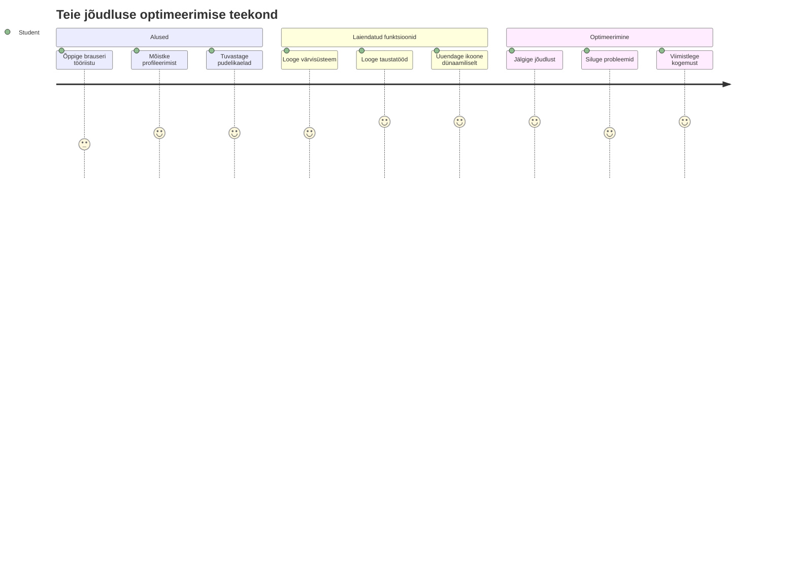
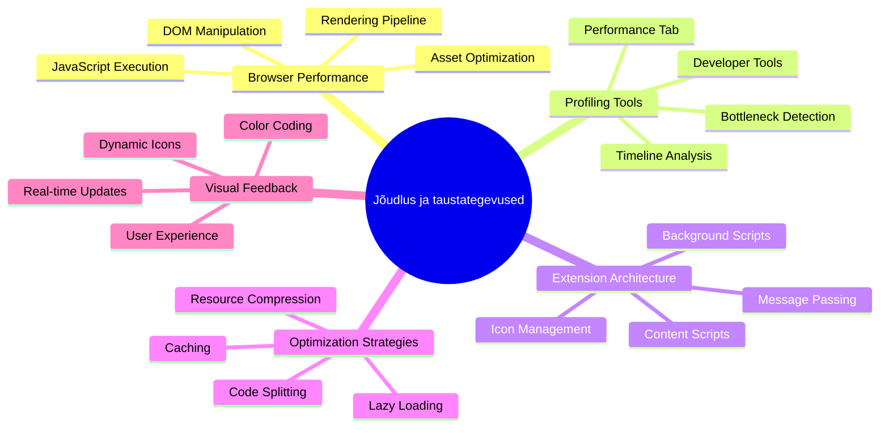
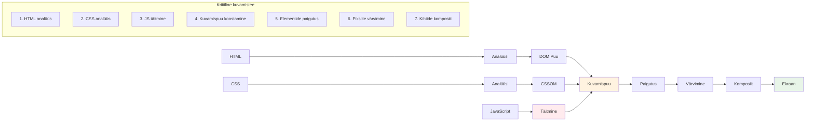
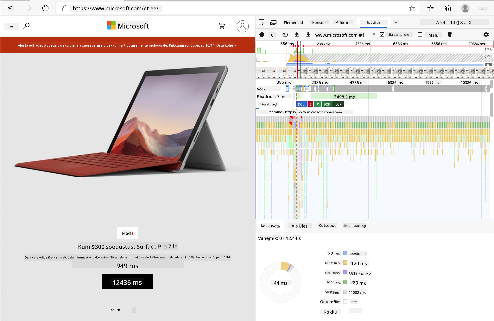
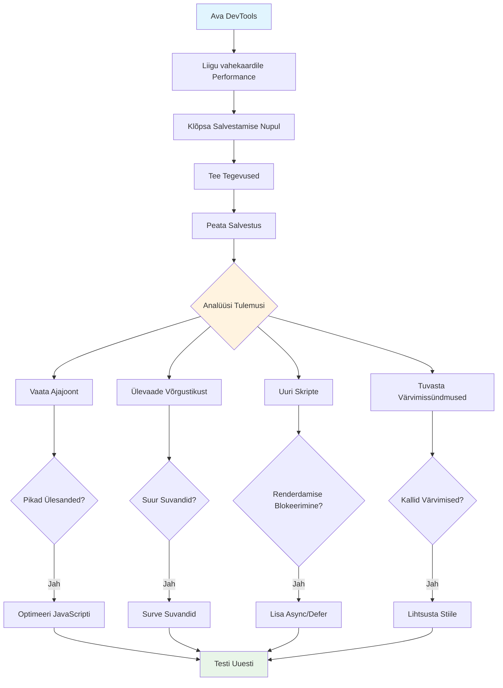
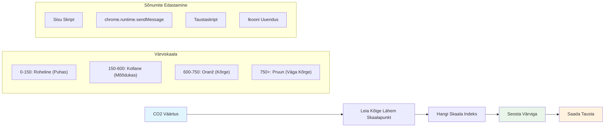
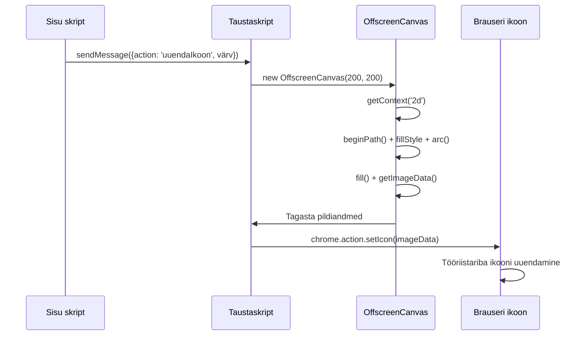
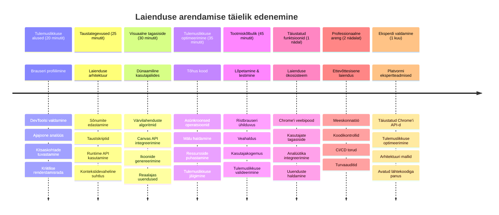

<!--
CO_OP_TRANSLATOR_METADATA:
{
  "original_hash": "b275fed2c6fc90d2b9b6661a3225faa2",
  "translation_date": "2026-01-08T09:23:36+00:00",
  "source_file": "5-browser-extension/3-background-tasks-and-performance/README.md",
  "language_code": "et"
}
-->
# Brauserilaiendi projekt Osa 3: Õpi taustaprotsesside ja jõudluse kohta


Kas oled kunagi mõelnud, mis teeb mõne brauserilaiendi kiiremaks ja reageerivamaks, samas kui teised tunduvad aeglased? Saladus peitub selles, mis toimub lava taga. Kui kasutajad klikivad sinu laiendi kasutajaliideses, juhib kogu maailm taustal vaikselt andmete pärimist, ikoonide uuendamist ja süsteemiresursse.

See on meie viimane õppetund brauserilaiendite seerias ja me teeme sinu süsiniku jalajälje jälgija sujuvalt toimivaks. Sa lisad dünaamilisi ikooni uuendusi ja õpid, kuidas tuvastada jõudlusprobleeme enne, kui need saavad tõsiseks. See on nagu võidusõiduauto häälestamine – pisikesed optimeerimised võivad teha tohutu erinevuse selles, kuidas kõik töötab.

Kui lõpetame, on sul lihvitud laiend ning sa mõistad jõudluse põhimõtteid, mis eristavad häid veebirakendusi suurepärastest. Sukeldume brauseri optimeerimise maailma.

## Enne loengut test

[Enne loengut test](https://ff-quizzes.netlify.app/web/quiz/27)

### Sissejuhatus

Eelmistes õppetundides ehitasid vormi, ühendasid selle API-ga ja tegid asünkroonset andmete pärimist. Sinu laiend on kenasti vormistumas.

Nüüd tuleb lisada viimased lihvid – näiteks muuta laiendi ikooni värvi süsinikuandmete põhjal. See meenutab mulle, kuidas NASA pidi optimeerima iga süsteemi Apollo kosmoselaeval. Nad ei saanud endale lubada raisatud tsükleid või mälu, sest elu sõltus jõudlusest. Kuigi meie brauserilaiend pole täiesti nii kriitiline, kehtivad samad põhimõtted – tõhus kood loob parema kasutajakogemuse.


## Veebijõudluse alused

Kui su kood töötab tõhusalt, tunnevad inimesed tõesti *vahet*. Sa tead seda hetke, kui leht laeb koheselt või animatsioon voolab sujuvalt? See ongi hea jõudlus töös.

Jõudlus ei seisne ainult kiiruses – see on veebikogemuste loomine, mis tunduvad loomulikud, mitte kohmakad ja pettumust valmistavad. Arvutamise algusaegadel hoidis Grace Hopper legendaarset nanosekundit (juhet umbes jalapikkusega) laual, et näidata, kui kaugele valgus jõuab ühe miljardi sekundiosaga. See oli tema viis selgitada, miks iga mikrosekund on arvutamisel oluline. Vaatleme detektiivivahendeid, mis aitavad sul välja selgitada, mis aeglustab asju.

> "Veebisaidi jõudlus on kaks asja: kui kiiresti leht laeb ja kui kiiresti kood sellel töötab." -- [Zack Grossbart](https://www.smashingmagazine.com/2012/06/javascript-profiling-chrome-developer-tools/)

Teema, kuidas teha oma veebileht kõigil seadmetel, kasutajatel ja olukordades kiiresti, on loomulikult tohutu. Siin on mõned punktid, mida meeles pidada, kui ehitad kas standardset veebiprojekti või brauserilaiendit.

Esimene samm saidi optimeerimisel on mõista, mis tegelikult kapoti all toimub. Õnneks on sinu brauserisse ehitatud võimsad detektiivivahendid.


Edge arendajatööriistade avamiseks klõpsa paremas ülanurgas kolmele punktile, seejärel vali Rohkem tööriistu > Arendajatööriistad. Või kasuta klaviatuuri otseteed: `Ctrl` + `Shift` + `I` Windowsis või `Option` + `Command` + `I` Macis. Kui oled seal, klõpsa vahekaardil Jõudlus – siin oledki uurimisajal.

**Siin on su jõudlusdetektiivi tööriistakomplekt:**
- **Ava** arendajatööriistad (kasutad neid arendajana kogu aeg!)
- **Mine** vahekaardile Jõudlus – mõtle sellele kui oma veebirakenduse vormijälgijale
- **Vajuta** nuppu Salvestus ja vaata, mis lehel toimub
- **Uuri** tulemusi, et leida, mis asju aeglustab

Proovime seda. Ava veebileht (näiteks Microsoft.com sobib hästi) ja vajuta 'Salvestus' nuppu. Nüüd värskenda lehte ja jälgi, kuidas profiler kõike jäädvustab. Kui salvestuse lõpetad, näed detailset ülevaadet sellest, kuidas brauser saidi 'skriptib', 'renderdab' ja 'maalib'. See meenutab missioonikontrolli, mis jälgib iga süsteemi raketi stardi ajal – saad reaalajas andmeid täpselt, mis toimub ja millal.



✅ [Microsofti dokumentatsioonis](https://docs.microsoft.com/microsoft-edge/devtools-guide/performance/?WT.mc_id=academic-77807-sagibbon) on veel palju detaile, kui tahad süvitsi minna

> Nõuanne: Puhasta enne testimist oma brauseri vahemälu, et näha, kuidas su sait toimib esmakordsetel külastajatel – see on tavaliselt üsna erinev korduvkülastajatest!

Vali profiili ajajoone osad, et suumida sündmusi, mis lehe laadimise ajal toimuvad.

Saavuta oma lehe jõudlusest kiire ülevaade, valides ajajoone osa ja vaadates kokkuvõttepaneeli:


Vaata Sündmuste logi paneeli, et näha, kas mõni sündmus kestis kauem kui 15 ms:


✅ Tutvu oma profileriga! Ava sellel saidil arendajatööriistad ja vaata, kas on kitsaskohti. Milline ressurss laeb kõige aeglasemalt? Mis kiiremini?


## Mida jälgida profiiili tegemisel

Profili jooksutamine on alles algus – tõeline oskus on mõista, mida need värvilised graafikud sulle tegelikult räägivad. Ära muretse, sa õpid neid lugema. Kogenud arendajad oskavad enne probleemi tekkimist hoiatavaid märke märgata.

Räägime tavapärastest kahtlastest isikutest – jõudlusprobleemidest, mis kipuvad veebiprojektidesse hiilima. Nii nagu Marie Curie pidi hoolikalt jälgima kiirguse taset laboris, peame ka meie jälgima mustreid, mis viitavad probleemide tekkimisele. Nende varane avastamine säästab sind (ja kasutajaid) palju pettumust.

**Ressursside suurused**: Veebisaidid on aastate jooksul "rasvemaks" muutunud ja suur osa sellest lisakaalust tuleb piltidest. See on nagu paneksime üha rohkem ja rohkem digikotti.

✅ Vaata [Internet Archive'i](https://httparchive.org/reports/page-weight), kuidas lehekülje suurused aja jooksul kasvanud on – see on päris kõnekas.

**Kuidas hoida ressursid optimeerituna:**
- **Komprimeeri** pilte! Tänapäeva formaadid nagu WebP saavad failisuurust märkimisväärselt vähendada
- **Serveeri** iga seadme jaoks sobivat pildisuurust – tavalised suured desktopi pildid pole telefonidele vajalikud
- **Minimeeri** CSS-i ja JavaScripti – iga bait loeb
- **Kasuta** laisklaadimist, nii et pilte laaditakse alles, kui kasutaja neid kerib

**DOM-liikumised**: Brauser peab ehitama dokumentide objektimudeli (DOM) sinu kirjutatud koodi põhjal, seega tuleb hea lehe jõudluse huvides hoida oma sildid minimaalsena, kasutades ja stiilides ainult seda, mida leht vajab. Seetõttu saab üleliigse CSS-i, mis on seotud ühe lehega, optimeerida; näiteks stiilid, mida kasutatakse vaid ühel lehel, ei pea olema peamisel stiililehel.

**DOM optimeerimise põhistrateegiad:**
- **Minimeerib** HTML elementide arvu ja pesastustasemeid
- **Eemaldab** kasutamata CSS reeglid ja ühendab stiililehed tõhusalt
- **Korraldab** CSS-i laadima vaid seda, mida iga leht vajab
- **Struktureerib** HTML semantiliselt, et brauser saaks paremini töödelda

**JavaScript**: Iga JavaScripti arendaja peaks jälgima 'renderdamist blokeerivat' skripti, mida tuleb laadida enne, kui DOM suudab edasi liikuda ja lehte maalida. Kaalu kasutusele võtmist `defer` inline skriptide puhul (nagu Terrariumi moodulis).

**Moodsa JavaScripti optimeerimise tehnikad:**
- **Kasutab** `defer` atribuuti skriptide laadimiseks pärast DOM-i parsimist
- **Rakendab** koodijagamist, et laadida ainult vajalik JavaScript
- **Kasutab** laisklaadimist vähem olulise funktsionaalsuse puhul
- **Minimeerib** raskete raamistike ja teekide kasutamist, kui võimalik

✅ Proovi mõnda saiti [Site Speed Test veebilehel](https://www.webpagetest.org/), et õppida, milliseid tavalisi kontrollimisi tehakse saidi jõudluse määramiseks.

### 🔄 **Pedagoogiline vahekokkuvõte**
**Jõudluse mõistmine**: Enne laienduse funktsioonide ehitamist kontrolli, et sa:
- ✅ Suudad selgitada kriitilist renderdamisteed HTML-ist piksliteni
- ✅ Tunned ära tavalised jõudluskitsaskohad veebirakendustes
- ✅ Kasutad brauseri arendajatööriistu lehe jõudluse profiilimiseks
- ✅ Mõistad, kuidas ressursi suurus ja DOM-i keerukus mõjutavad kiirust

**Kiirtest iseendale**: Mis juhtub, kui sul on renderdamist blokeeriv JavaScript?
*Vastus: Brauser peab selle skripti alla laadima ja täitma enne, kui saab jätkata HTML-i parsimist ja lehe renderdamist*

**Reaalne jõudluse mõju:**
- **100 ms viivitus**: kasutajad märkavad aeglustust
- **1 sekund viivitus**: kasutajad hakkavad keskendumist kaotama
- **3+ sekundit**: 40% kasutajatest lahkub lehelt
- **Mobiilsed võrgud**: jõudlus loeb veelgi rohkem

Nüüd, kui sul on ülevaade, kuidas brauser renderdab su saadetavaid ressursse, vaatame viimaseid samme, mida oma laiendi lõpuleviimiseks vaja teha:

### Loo funktsioon värvuse arvutamiseks

Nüüd loome funktsiooni, mis muudab arvulised andmed tähenduslikeks värvideks. Mõtle sellele kui valgusfoorsiüsteemile – roheline puhta energia jaoks, punane kõrge süsinikuintensiivsuse jaoks.

See funktsioon võtab meie API-st CO2 andmed ja määrab, milline värv kõige paremini esindab keskkonnamõju. Sarnaselt teadlastele, kes kasutavad kuumakaartidel värvikodeeringut keeruliste andmemustrite visualiseerimiseks – alates ookeanitemperatuuridest kuni tähtede moodustumiseni. Lisame selle faili `/src/index.js`, kohe pärast neid konstante, mida me varem defineerisime:


```javascript
function calculateColor(value) {
	// Määra CO2 intensiivsuse skaala (grammi kWh kohta)
	const co2Scale = [0, 150, 600, 750, 800];
	// Vastavad värvid rohelisest (puhas) tumepruunini (kõrge süsinikuheidetega)
	const colors = ['#2AA364', '#F5EB4D', '#9E4229', '#381D02', '#381D02'];

	// Leia sisendi lähim skaala väärtus
	const closestNum = co2Scale.sort((a, b) => {
		return Math.abs(a - value) - Math.abs(b - value);
	})[0];
	
	console.log(`${value} is closest to ${closestNum}`);
	
	// Leia värvikaardistuse indeks
	const num = (element) => element > closestNum;
	const scaleIndex = co2Scale.findIndex(num);

	const closestColor = colors[scaleIndex];
	console.log(scaleIndex, closestColor);

	// Saada värvi uuendamise sõnum taustaskripti
	chrome.runtime.sendMessage({ action: 'updateIcon', value: { color: closestColor } });
}
```

**Lähme selle nutika väikese funktsiooni koomale:**
- **Seadistab** kaks massiivi – ühe CO2 tasemetele, teise värvidele (roheline = puhas, pruun = must!)
- **Leiab** lähima vaste tegelikule CO2 väärtusele käepärase massiivi sortimise abil
- **Haagib** vastava värvi `findIndex()` meetodi abil
- **Saadab** sõnumi Chrome taustaskripti valitud värviga
- **Kasutab** mallistringe (need tagurpidi kriipsud) puhtama stringivorminduse jaoks
- **Hoidab** kõik korrektselt konstandi deklaratsioonidega organiseeritud

`chrome.runtime` [API](https://developer.chrome.com/extensions/runtime) on nagu su laiendi närvisüsteem – see haldab kõiki lava taga toimuvaid suhtlusi ja protsesse:

> "Kasuta chrome.runtime API-d, et saada kätte taustaleht, tagastada manifesti üksikasju ja kuulata ning reageerida rakenduse või laiendi elutsükli sündmustele. Sa saad kasutada seda API-d ka URL-ide suhteliste teede teisendamiseks täielikult kvalifitseeritud URL-ideks."

**Miks on Chrome Runtime API nii kasulik:**
- **Laseb** sinu laiendi eri osadel omavahel suhelda
- **Haldb** taustatööd ilma kasutajaliidest külmutamata
- **Haldb** sinu laiendi elutsükli sündmusi
- **Mugav** sõnumite edastamine skriptide vahel

✅ Kui arendad seda brauserilaiendit Edge jaoks, võib sind üllatada, et kasutad Chrome API-d. Uuemad Edge brauseri versioonid töötavad Chromiumi mootoril, seega saad neid tööriistu kasutada.


> **Nõuanne**: Kui soovid profiilida brauserilaiendit, ava arendajatööriistad otse laiendist, sest see on omaette brauseriprotsess. See annab sulle ligipääsu laienduspõhistele jõudlusmõõdikutele.

### Sea ikoonile vaikimisi värv

Enne, kui hakkame pärima päris andmeid, anname oma laiendile lähtepunkti. Keegi ei taha vaadata tühja või katkenud ikooni. Alustame rohelisest värvist, et kasutajad teadaksid kohe, kui laiend on paigaldatud, et see töötab.

Sinu `init()` funktsioonis seadistame vaikimisi rohelist ikooni:

```javascript
chrome.runtime.sendMessage({
	action: 'updateIcon',
	value: {
		color: 'green',
	},
});
```

**Mida see algseadistus saavutab:**
- **Seadistab** neutraalse rohelise värvi vaikeseisundiks
- **Annab** vahetu visuaalse tagasiside laiendi laadimisel
- **Määrab** suhtlusmustri taustaskriptiga
- **Tagab**, et kasutajad näevad toimivat laiendit enne andmete laekumist

### Kutsu funktsioon tööle, käivita see

Nüüd ühendame kõik kokku, nii et kui tuleb värske CO2 andmestik, uuendab su ikoon automaatselt õiget värvi. See on nagu viimase ahela ühendamine elektroonikaseadmes – kõik komponendid hakkavad korraga töötama.

Lisa see rida kohe pärast seda, kui saad API-st CO2 andmed:

```javascript
// Pärast CO2 andmete saamist API-st
// lase CO2 = data.data[0].intensity.actual;
calculateColor(CO2);
```

**See integratsioon saavutab:**
- **Seob** API andmevoo visuaalse indikaatoriga
- **Käivitab** ikooni uuendused automaatselt uute andmete saabumisel
- **Tagab** reaalajas visuaalse tagasiside praeguse süsinikuintensiivsuse põhjal
- **Hoiab** andmete pärimise ja kuvamise loogika selgelt lahus

Ja lõpuks, faili `/dist/background.js` lisa kuulaja nende taustategevuste käsklustele:

```javascript
// Kuula sõnumeid sisutekstist
chrome.runtime.onMessage.addListener(function (msg, sender, sendResponse) {
	if (msg.action === 'updateIcon') {
		chrome.action.setIcon({ imageData: drawIcon(msg.value) });
	}
});

// Joonista dünaamiline ikoon kasutades Canvas API-d
// Laenatud energy lollipop laiendusest - tore omadus!
function drawIcon(value) {
	// Loo ekraaniväline lõuend parema jõudluse jaoks
	const canvas = new OffscreenCanvas(200, 200);
	const context = canvas.getContext('2d');

	// Joonista värvitud ring, mis kujutab süsiniku intensiivsust
	context.beginPath();
	context.fillStyle = value.color;
	context.arc(100, 100, 50, 0, 2 * Math.PI);
	context.fill();

	// Tagasta brauseri ikooni pildidata
	return context.getImageData(50, 50, 100, 100);
}
```

**Mida see taustaskript teeb:**
- **Kuulab** sõnumeid sinu peaskriptist (nagu vastuvõtja kõnesid vastu võttes)
- **Töötleb** need 'updateIcon' taotlused, et muuta tööriistariba ikooni
- **Loodab** uusi ikoone jooksvalt Canvas API abil
- **Joonistab** lihtsa värvilise ringi, mis näitab hetke süsinikuintensiivsust
- **Uuendab** sinu brauseri tööriistariba värske ikooniga
- **Kasutab** OffscreenCanvas'e sujuvaks jõudluseks (ilma kasutajaliidese blokeerimiseta)

✅ Canvas API-st õpid rohkem [Taeva mängu õppetundides](../../6-space-game/2-drawing-to-canvas/README.md).


### 🔄 **Pedagoogiline vahekokkuvõte**
**Laiendi süsteemi täielik mõistmine**: Kontrolli oma valmidust tervikuna:
- ✅ Kuidas sõnumite edastamine töötab eri laiendusskriptide vahel?
- ✅ Miks kasutame OffscreenCanvas'i tavapärase Canvas'i asemel jõudluse pärast?
- ✅ Mis rolli mängib Chrome Runtime API laienduse arhitektuuris?
- ✅ Kuidas värvustamise algoritm seob andmed visuaalse tagasisidega?

**Jõudluse kaalutlused**: Sinu laiendus näitab nüüd:
- **Tõhus sõnumivahetus**: Selge suhtlus skriptide kontekstide vahel
- **Optimeeritud renderdamine**: OffscreenCanvas hoiab kasutajaliidese blokeerimise ära
- **Reaalajas uuendused**: Dünaamilised ikoonimuutused vastavalt elavale andmestikule
- **Mälu haldamine**: Korralik koristus ja ressursihaldus

**On aeg oma laiendust testida:**
- **Koosta** kõik käsuga `npm run build`
- **Laadi** oma laiendus uuesti brauseris (ära unusta seda sammu)
- **Ava** oma laiendus ja vaata, kuidas ikoon värve muudab
- **Kontrolli**, kuidas see reageerib maailma erinevate paikade tegelikele süsinikuandmetele

Nüüd näed pilguheitena, kas on hea aeg pesu pesemiseks või peaksid ootama puhtama energia saabumist. Sa just lõid midagi tõeliselt kasulikku ja õppisid teekonna jooksul brauseri jõudlusest.

## GitHub Copilot Agendi Väljakutse 🚀

Kasuta Agendi režiimi, et täita järgmine väljakutse:

**Kirjeldus:** Täienda brauserilaienduse jõudlusmonitooringu võimeid, lisades funktsiooni, mis jälgib ja kuvab erinevate laienduse komponentide laadimisaegu.

**Päring:** Loo jõudlusmonitooringu süsteem brauserilaiendusele, mis mõõdab ja logib CO2 andmete API-st toomise, värvide arvutamise ja ikoone uuendamise aegasid. Lisa funktsioon nimega `performanceTracker`, mis kasutab Performance API-d nende operatsioonide mõõtmiseks ja kuvab tulemused brauseri konsoolis koos ajatemplite ja kestuse mõõdikuga.

Lisateavet leiad [agent mode](https://code.visualstudio.com/blogs/2025/02/24/introducing-copilot-agent-mode) lehelt.

## 🚀 Väljakutse

Siin on huvitav detektiivitöö: vali mõned avatud lähtekoodiga veebisaidid, mis on olnud olemas juba aastaid (mõtle Wikipedia, GitHub või Stack Overflow) ja uurige nende commit ajalugu. Kas suudad märgata kohti, kus nad tegid jõudluse parandusi? Millised probleemid kordusid?

**Sinu uurimisstrateegia:**
- **Otsi** commit sõnumeid sõnadega nagu "optimize", "performance", või "faster"
- **Vaata** mustreid – kas nad parandavad pidevalt samu tüüpi probleeme?
- **Tuvasta** levinud põhjused, mis veebisaite aeglustavad
- **Jaga** oma avastusi – teised arendajad õpivad pärismaailma näidetest

## Loengu järgne viktoriin

[Post-lecture quiz](https://ff-quizzes.netlify.app/web/quiz/28)

## Kordamine ja iseseisev õppimine

Kaalu tellimust saada [jõudluse uudiskirja](https://perf.email/)

Uuri, kuidas brauserid mõõdavad veebijõudlust, vaadates nende arendajate tööriistade jõudluse vahekaarti. Kas märkad suuri erinevusi?

### ⚡ **Mida saad järgmise 5 minutiga teha**
- [ ] Ava brauseri ülesannete haldur (Shift+Esc Chrome’is), et näha laienduste ressursikasutust
- [ ] Kasuta DevTools jõudluse vahekaarti, et salvestada ja analüüsida veebilehe jõudlust
- [ ] Kontrolli brauseri laienduste lehte, et näha, millised laiendused mõjutavad käivitusaega
- [ ] Proovi ajutiselt laiendused keelata, et näha jõudluse erinevusi

### 🎯 **Mida saad selle tunniga saavutada**
- [ ] Täida loengu järgne viktoriin ja mõista jõudluskontseptsioone
- [ ] Rakenda oma brauserilaienduse jaoks taustaskript
- [ ] Õpi kasutama browser.alarms efektiivsete taustatööde jaoks
- [ ] Harjuta sõnumiedastust sisuskriptide ja taustaskriptide vahel
- [ ] Mõõda ja optimeeri oma laienduse ressursikasutust

### 📅 **Sinu nädala pikkune jõudlusretk**
- [ ] Loo kõrge jõudlusega brauserilaiendus taustafunktsioonidega
- [ ] Valda teenusetöötajaid ja kaasaegset laienduse arhitektuuri
- [ ] Rakenda tõhusaid andmete sünkroniseerimise ja vahemällu salvestamise strateegiaid
- [ ] Õpi edasijõudnud silumisvõtteid laienduste jõudluse tõhustamiseks
- [ ] Optimeeri oma laiendust nii funktsionaalsuse kui ressursitõhususe jaoks
- [ ] Loo põhjalikud testid laienduse jõudlusstsenaariumite jaoks

### 🌟 **Sinu kuu pikkune optimeerimismeisterlikkus**
- [ ] Koosta ettevõtte tasemel brauserilaiendusi optimaalse jõudlusega
- [ ] Õpi Web Workers’i, Service Workers’i ja tänapäevase veebijõudluse kohta
- [ ] Panusta avatud lähtekoodiga projektidesse, mis keskenduvad jõudluse optimeerimisele
- [ ] Valda brauseri sisemust ja edasijõudnud silumisvõtteid
- [ ] Loo jõudluse monitooringutööriistu ja parimate tavade juhendeid
- [ ] Saa jõudluse ekspertiks, kes aitab veebirakenduste optimeerimisel

## 🎯 Sinu brauserilaienduse meisterlikkuse ajaskaala


### 🛠️ Sinu täielik laienduse arenduskomplekt

Pärast selle triloogia läbimist valdad nüüd:
- **Brauseri arhitektuur**: Sügav arusaam, kuidas laiendused integreeruvad brauseri süsteemidega
- **Jõudlusprofiilimine**: Võime tuvastada ja parandada pudelikaelu arendajatööriistade abil
- **Asünkroonne programmeerimine**: Kaasaegsed JavaScript’i mustrid reageerivateks ja mitteblokeerivateks operatsioonideks
- **API integratsioon**: Välistest allikatest andmete pärimine koos autentimise ja veahaldusega
- **Visuaalne kujundus**: Dünaamilised UI uuendused ja Canvase-põhine graafikate loomine
- **Sõnumite edastamine**: Skriptidevaheline suhtlus laienduse arhitektuuris
- **Kasutajakogemus**: Laadimisolekud, veahaldus ja intuitiivsed interaktsioonid
- **Tootmise oskused**: Testimine, silumine ja optimeerimine pärismaailma juurutuseks

**Reaalsed rakendused**: Sinu laienduse arendamise oskused kehtivad otseselt:
- **Progressiivsed veebirakendused**: Sarnased arhitektuuri- ja jõudlusmustrid
- **Electroni töölauarakendused**: Platvormideülene veebitehnoloogiate kasutamine
- **Mobiilsed hübriidrakendused**: Cordova/PhoneGapi arendus veebipõhiste API-de abil
- **Ettevõtte veebirakendused**: Komplekssete juhtpaneelide ja tootlikkuse tööriistade loomine
- **Chrome DevTools laiendused**: Edasijõudnud arendajatööriistad ja silumine
- **Veebipõhiste API-de integratsioon**: Igasuguste väliste teenustega suhtlevad rakendused

**Professionaalne mõju**: Sa saad nüüd:
- **Luua** tootmisvalmis brauserilaiendusi ideest juurutuseni
- **Optimeerida** veebirakenduste jõudlust tööstusstandardsete profiilimistööriistade abil
- **Arhitektuurida** skaleeritavaid süsteeme õige vastutuse jaotusega
- **Siluda** keerulisi asünkroonseid operatsioone ja kontekstidevahelist kommunikatsiooni
- **Panustada** avatud lähtekoodiga laiendusprojektidesse ja brauseristandarditesse

**Järgmise taseme võimalused**:
- **Chrome Web Store arendaja**: Avalda laiendusi miljonitele kasutajatele
- **Veebijõudluse insener**: Specialiseeru optimeerimisele ja kasutajakogemusele
- **Brauseriplatvormi arendaja**: Panusta brauseri mootorite arengusse
- **Laiendusraamistike looja**: Ehita tööriistu, mis aitavad teistel arendajatel
- **Arendajasuhete spetsialist**: Jaga teadmisi õpetamise ja sisuloomega

🌟 **Saavutus saadud**: Sa oled loonud täieliku ja funktsionaalse brauserilaienduse, mis demonstreerib professionaalseid arenduspraktikaid ja tänapäevaseid veebistandardeid!

## Kodutöö

[Analüüsi saidi jõudlust](assignment.md)

---

<!-- CO-OP TRANSLATOR DISCLAIMER START -->
**Vastutusest loobumine**:
See dokument on tõlgitud kasutades AI tõlketeenust [Co-op Translator](https://github.com/Azure/co-op-translator). Kuigi me püüame täpsust, palun arvestage, et automaatsed tõlked võivad sisaldada vigu või ebatäpsusi. Originaaldokument selle emakeeles tuleks lugeda ametlikuks allikaks. Olulise teabe puhul soovitatakse kasutada professionaalset inimtõlget. Me ei vastuta selle tõlke kasutamisest tulenevate arusaamatuste ega valesti mõistmiste eest.
<!-- CO-OP TRANSLATOR DISCLAIMER END -->