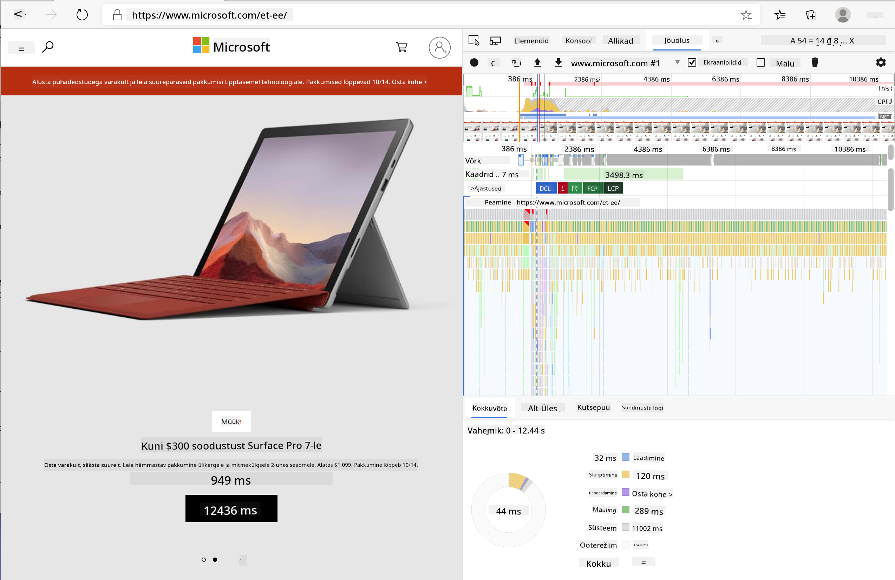
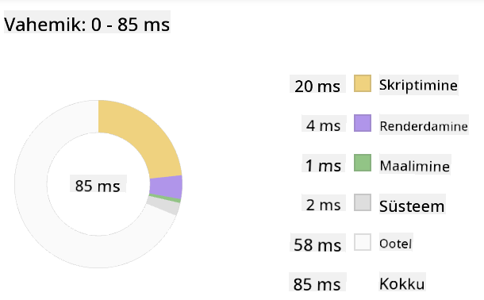
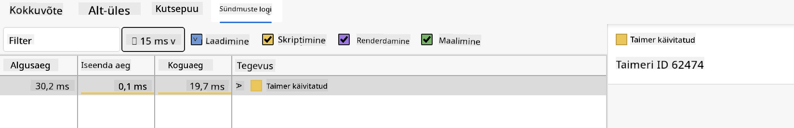

<!--
CO_OP_TRANSLATOR_METADATA:
{
  "original_hash": "b91cbf14240ee59411b96448b994ace1",
  "translation_date": "2025-10-11T12:19:00+00:00",
  "source_file": "5-browser-extension/3-background-tasks-and-performance/README.md",
  "language_code": "et"
}
-->
# Brauserilaiendi projekt, osa 3: Taustülesanded ja jõudlus

## Eelloengu viktoriin

[Eelloengu viktoriin](https://ff-quizzes.netlify.app/web/quiz/27)

### Sissejuhatus

Eelmistes kahes selle mooduli tunnis õppisite, kuidas luua vormi ja kuvamisala API-st saadud andmete jaoks. See on väga tavaline viis veebis kohaloleku loomiseks. Õppisite isegi, kuidas käsitleda andmete asünkroonset toomist. Teie brauserilaiend on peaaegu valmis.

Jäänud on hallata mõningaid taustülesandeid, sealhulgas laiendi ikooni värvi värskendamist, mistõttu on suurepärane aeg rääkida, kuidas brauser selliseid ülesandeid haldab. Mõelgem nende brauseri ülesannete peale teie veebivarade jõudluse kontekstis, kui te neid loote.

## Veebi jõudluse põhitõed

> "Veebisaidi jõudlus seisneb kahes asjas: kui kiiresti leht laadib ja kui kiiresti sellel olev kood töötab." -- [Zack Grossbart](https://www.smashingmagazine.com/2012/06/javascript-profiling-chrome-developer-tools/)

Teema, kuidas muuta oma veebisaidid välkkiireks igasugustel seadmetel, igasuguste kasutajate jaoks ja igasugustes olukordades, on ootuspäraselt ulatuslik. Siin on mõned punktid, mida tasub meeles pidada, kui loote kas tavalist veebiprojekti või brauserilaiendit.

Esimene asi, mida peate tegema, et tagada oma saidi tõhus toimimine, on koguda andmeid selle jõudluse kohta. Esimene koht selleks on teie veebibrauseri arendustööriistad. Edge'is saate valida "Seaded ja veel" nupu (kolme punkti ikoon brauseri paremas ülanurgas), seejärel navigeerida Veel tööriistad > Arendustööriistad ja avada Jõudluse vahekaart. Samuti saate arendustööriistade avamiseks kasutada klaviatuuri otseteid `Ctrl` + `Shift` + `I` Windowsis või `Option` + `Command` + `I` Macis.

Jõudluse vahekaart sisaldab profiilimise tööriista. Avage veebisait (proovige näiteks [https://www.microsoft.com](https://www.microsoft.com/?WT.mc_id=academic-77807-sagibbon)) ja klõpsake nuppu "Salvesta", seejärel värskendage saiti. Salvestuse saate igal ajal peatada ja näete rutiine, mis genereeritakse saidi "skriptimiseks", "renderdamiseks" ja "maalimiseks":



✅ Külastage [Microsofti dokumentatsiooni](https://docs.microsoft.com/microsoft-edge/devtools-guide/performance/?WT.mc_id=academic-77807-sagibbon) Edge'i jõudluse paneeli kohta

> Näpunäide: et saada täpne ülevaade oma veebisaidi käivitamise ajast, tühjendage oma brauseri vahemälu

Valige profiili ajajoone elemendid, et suumida sündmustele, mis toimuvad teie lehe laadimise ajal.

Saage ülevaade oma lehe jõudlusest, valides osa profiili ajajoonest ja vaadates kokkuvõtte paneeli:



Kontrollige sündmuste logi paneeli, et näha, kas mõni sündmus kestis kauem kui 15 ms:



✅ Tutvuge oma profiilijaga! Avage sellel saidil arendustööriistad ja vaadake, kas esineb kitsaskohti. Mis on kõige aeglasemalt laadiv vara? Kõige kiiremini laadiv?

## Profiilimise kontrollid

Üldiselt on mõned "probleemsed valdkonnad", mida iga veebiarendaja peaks saidi loomisel jälgima, et vältida ebameeldivaid üllatusi, kui on aeg tootmisse juurutada.

**Varade suurused**: Veeb on viimastel aastatel muutunud "raskemaks" ja seega aeglasemaks. Osa sellest raskusest on seotud piltide kasutamisega.

✅ Vaadake [Interneti arhiivi](https://httparchive.org/reports/page-weight) ajaloolise ülevaate saamiseks lehe kaalust ja muust.

Hea tava on tagada, et teie pildid oleksid optimeeritud ja tarnitud õiges suuruses ja resolutsioonis teie kasutajatele.

**DOM-i läbimised**: Brauser peab looma oma dokumendiobjektimudeli (DOM) teie kirjutatud koodi põhjal, seega on hea lehe jõudluse huvides hoida sildid minimaalsed, kasutades ja stiilides ainult seda, mida leht vajab. Selle punkti juurde kuulub ka lehega seotud liigse CSS-i optimeerimine; stiilid, mida on vaja kasutada ainult ühel lehel, ei pea olema kaasatud peamisse stiililehte.

**JavaScript**: Iga JavaScripti arendaja peaks jälgima "renderdamist blokeerivaid" skripte, mis tuleb laadida enne, kui ülejäänud DOM-i saab brauseris läbida ja maalida. Kaaluge `defer` kasutamist oma sisemiste skriptidega (nagu tehakse Terrariumi moodulis).

✅ Proovige mõningaid saite [veebisaidi kiirustesti veebisaidil](https://www.webpagetest.org/), et saada rohkem teavet levinud kontrollide kohta, mida tehakse saidi jõudluse määramiseks.

Nüüd, kui teil on aimu, kuidas brauser renderdab varasid, mida te sellele saadate, vaatame viimaseid asju, mida peate tegema, et oma laiend valmis saada:

### Funktsiooni loomine värvi arvutamiseks

Töötades failis `/src/index.js`, lisage funktsioon nimega `calculateColor()` pärast `const` muutujate seeriat, mille määrasite DOM-ile juurdepääsu saamiseks:

```JavaScript
function calculateColor(value) {
	let co2Scale = [0, 150, 600, 750, 800];
	let colors = ['#2AA364', '#F5EB4D', '#9E4229', '#381D02', '#381D02'];

	let closestNum = co2Scale.sort((a, b) => {
		return Math.abs(a - value) - Math.abs(b - value);
	})[0];
	console.log(value + ' is closest to ' + closestNum);
	let num = (element) => element > closestNum;
	let scaleIndex = co2Scale.findIndex(num);

	let closestColor = colors[scaleIndex];
	console.log(scaleIndex, closestColor);

	chrome.runtime.sendMessage({ action: 'updateIcon', value: { color: closestColor } });
}
```

Mis siin toimub? Te edastate väärtuse (süsiniku intensiivsuse) API-kõnest, mille te eelmises tunnis lõpetasite, ja seejärel arvutate, kui lähedal on selle väärtus värvide massiivis esitatud indeksile. Seejärel saadate selle lähima värviväärtuse edasi Chrome'i runtime'ile.

Chrome.runtime'il on [API](https://developer.chrome.com/extensions/runtime), mis haldab igasuguseid taustülesandeid, ja teie laiend kasutab seda:

> "Kasutage chrome.runtime API-d, et hankida taustaleht, tagastada manifesti üksikasjad ning kuulata ja vastata rakenduse või laiendi elutsükli sündmustele. Samuti saate seda API-d kasutada URL-ide suhteliste radade teisendamiseks täielikult kvalifitseeritud URL-ideks."

✅ Kui arendate seda brauserilaiendit Edge'i jaoks, võib teid üllatada, et kasutate Chrome'i API-d. Uuemad Edge'i brauseri versioonid töötavad Chromiumi brauserimootoril, seega saate neid tööriistu kasutada.

> Märkus: kui soovite profiilida brauserilaiendit, käivitage arendustööriistad laiendi enda seest, kuna see on omaette brauseri instants.

### Vaikimisi ikooni värvi määramine

Nüüd määrake `init()` funktsioonis ikooni algvärviks üldine roheline, kutsudes taas Chrome'i `updateIcon` tegevust:

```JavaScript
chrome.runtime.sendMessage({
	action: 'updateIcon',
		value: {
			color: 'green',
		},
});
```

### Funktsiooni kutsumine ja kõne täitmine

Järgmisena kutsuge just loodud funktsioon, lisades selle C02Signal API tagastatud lubadusele:

```JavaScript
//let CO2...
calculateColor(CO2);
```

Ja lõpuks, failis `/dist/background.js`, lisage kuulaja nende taustatoimingute kõnede jaoks:

```JavaScript
chrome.runtime.onMessage.addListener(function (msg, sender, sendResponse) {
	if (msg.action === 'updateIcon') {
		chrome.action.setIcon({ imageData: drawIcon(msg.value) });
	}
});
//borrowed from energy lollipop extension, nice feature!
function drawIcon(value) {
	let canvas = new OffscreenCanvas(200, 200);
	let context = canvas.getContext('2d');

	context.beginPath();
	context.fillStyle = value.color;
	context.arc(100, 100, 50, 0, 2 * Math.PI);
	context.fill();

	return context.getImageData(50, 50, 100, 100);
}
```

Selles koodis lisate kuulaja kõigile sõnumitele, mis jõuavad taustülesannete haldurisse. Kui seda nimetatakse 'updateIcon', siis käivitatakse järgmine kood, et joonistada õige värviga ikoon Canvas API abil.

✅ Õpite Canvas API kohta rohkem [Kosmosemängu tundides](../../6-space-game/2-drawing-to-canvas/README.md).

Nüüd, ehitage oma laiend uuesti (`npm run build`), värskendage ja käivitage oma laiend ning jälgige värvi muutumist. Kas on hea aeg teha mõni majapidamistöö? Nüüd teate!

Palju õnne, olete loonud kasuliku brauserilaiendi ja õppinud rohkem, kuidas brauser töötab ja kuidas selle jõudlust profiilida.

---

## 🚀 Väljakutse

Uurige mõningaid avatud lähtekoodiga veebisaite, mis on olnud olemas juba pikka aega, ja proovige nende GitHubi ajaloo põhjal kindlaks teha, kuidas neid aastate jooksul jõudluse jaoks optimeeriti, kui üldse. Mis on kõige levinum valupunkt?

## Järelloengu viktoriin

[Järelloengu viktoriin](https://ff-quizzes.netlify.app/web/quiz/28)

## Ülevaade ja iseseisev õppimine

Kaaluge registreerumist [jõudluse uudiskirja](https://perf.email) saamiseks.

Uurige mõningaid viise, kuidas brauserid hindavad veebijõudlust, vaadates nende veebitööriistade jõudluse vahekaarte. Kas leiate mingeid olulisi erinevusi?

## Ülesanne

[Analüüsige saidi jõudlust](assignment.md)

---

**Lahtiütlus**:  
See dokument on tõlgitud AI tõlketeenuse [Co-op Translator](https://github.com/Azure/co-op-translator) abil. Kuigi püüame tagada täpsust, palume arvestada, et automaatsed tõlked võivad sisaldada vigu või ebatäpsusi. Algne dokument selle algses keeles tuleks pidada autoriteetseks allikaks. Olulise teabe puhul soovitame kasutada professionaalset inimtõlget. Me ei vastuta selle tõlke kasutamisest tulenevate arusaamatuste või valesti tõlgenduste eest.