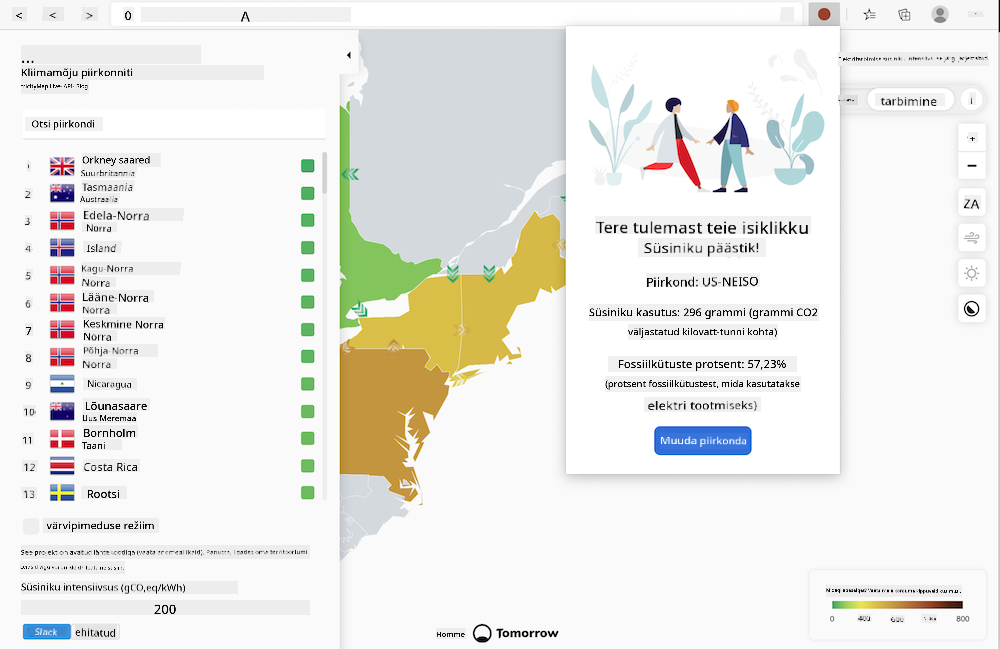
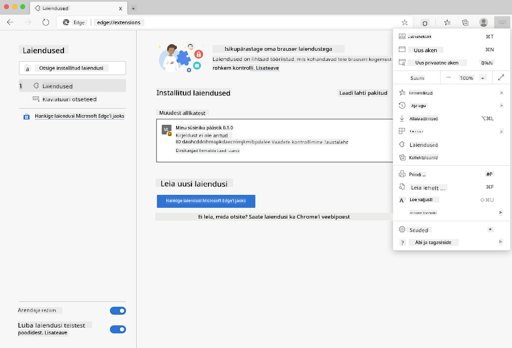

<!--
CO_OP_TRANSLATOR_METADATA:
{
  "original_hash": "fab4e6b4f0efcd587a9029d82991f597",
  "translation_date": "2025-10-11T12:16:26+00:00",
  "source_file": "5-browser-extension/solution/README.md",
  "language_code": "et"
}
-->
# Carbon Trigger brauserilaiendus: Valmis kood

Kasutades tmrow CO2 Signal API-d elektritarbimise jälgimiseks, looge brauserilaiendus, mis tuletab teile meelde, kui suur on teie piirkonna elektritarbimine. Selle laienduse juhuslik kasutamine aitab teil teha teadlikke otsuseid oma tegevuste kohta, lähtudes sellest teabest.



## Alustamine

Teil peab olema [npm](https://npmjs.com) paigaldatud. Laadige selle koodi koopia alla oma arvutisse.

Paigaldage kõik vajalikud paketid:

```
npm install
```

Koostage laiendus, kasutades webpacki

```
npm run build
```

Edge'i brauseris paigaldamiseks kasutage brauseri paremas ülanurgas asuvat 'kolme punkti' menüüd, et leida laienduste paneel. Sealt valige 'Laadi lahti pakkimata', et laadida uus laiendus. Avage 'dist' kaust, kui seda küsitakse, ja laiendus laaditakse. Selle kasutamiseks vajate CO2 Signal API jaoks API-võtit ([hankige see siit e-posti teel](https://www.co2signal.com/) - sisestage oma e-posti aadress sellel lehel olevasse kasti) ja [oma piirkonna koodi](http://api.electricitymap.org/v3/zones), mis vastab [Electricity Map](https://www.electricitymap.org/map) kaardile (näiteks Bostonis kasutan 'US-NEISO').



Kui API-võti ja piirkonna kood on laienduse liidesesse sisestatud, peaks brauserilaienduse ribal olev värviline täpp muutuma, et kajastada teie piirkonna energiatarbimist, ning andma teile vihjeid, millised energiamahukad tegevused oleksid sobivad. Selle 'täpi' süsteemi idee sain [Energy Lollipop laiendusest](https://energylollipop.com/) California heitkoguste jaoks.

---

**Lahtiütlus**:  
See dokument on tõlgitud AI tõlketeenuse [Co-op Translator](https://github.com/Azure/co-op-translator) abil. Kuigi püüame tagada täpsust, palume arvestada, et automaatsed tõlked võivad sisaldada vigu või ebatäpsusi. Algne dokument selle algses keeles tuleks pidada autoriteetseks allikaks. Olulise teabe puhul soovitame kasutada professionaalset inimtõlget. Me ei vastuta selle tõlke kasutamisest tulenevate arusaamatuste või valesti tõlgenduste eest.