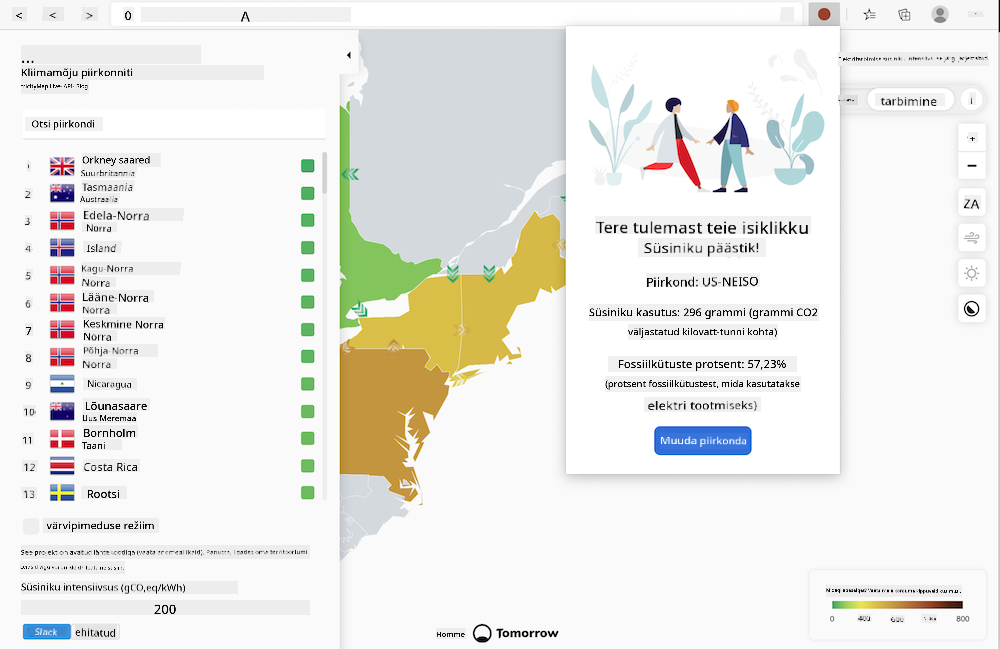

<!--
CO_OP_TRANSLATOR_METADATA:
{
  "original_hash": "9a6b22a2eff0f499b66236be973b24ad",
  "translation_date": "2025-10-11T12:17:31+00:00",
  "source_file": "5-browser-extension/solution/translation/README.it.md",
  "language_code": "et"
}
-->
# Carbon Trigger brauserilaiend: alustuskood

Kasutame tmrow Signal CO2 API-d, et jälgida elektritarbimist ja luua brauserilaiend, mis annab otse brauseris meeldetuletuse selle kohta, kui suur on elektritarbimise koormus teie piirkonnas. Selle spetsiaalse laiendi kasutamine aitab hinnata oma tegevusi nende andmete põhjal.



## Alustamine

Veenduge, et [npm](https://npmjs.com) on installitud. Laadige selle koodi koopia alla oma arvutisse.

Paigaldage kõik vajalikud paketid:

```
npm install
```

Looge laiend Webpackiga:

```
npm run build
```

Edge'i brauserisse installimiseks kasutage brauseri paremas ülanurgas asuvat "kolme punkti" menüüd, et leida laiendite paneel. Kui see pole veel aktiveeritud, lülitage sisse arendajarežiim (vasakus alanurgas). Valige "Laadi lahti pakitud", et laadida uus laiend. Avage viipas kaust "dist" ja laiend laaditakse. Kasutamiseks vajate CO2 Signal API võtmet (saate selle [siit e-posti teel](https://www.co2signal.com/) - sisestage oma e-posti aadress sellel lehel olevasse kasti) ja [oma piirkonna koodi](http://api.electricitymap.org/v3/zones), mis vastab [elektrikaardile](https://www.electricitymap.org/map) (näiteks Bostonis on see "US-NEISO").


Kui API võti ja piirkond on laiendi liideses sisestatud, peaks brauserilaiendi tööriistaribal olev värviline punkt muutuma, et kajastada piirkonna energiatarbimist, ning andma vihjeid selle kohta, millised suure energiatarbimisega tegevused oleksid sobivad. Selle "punktisüsteemi" kontseptsioon on inspireeritud [Energy Lollipop laiendist](https://energylollipop.com/), mis jälgib California heitkoguseid.

---

**Lahtiütlus**:  
See dokument on tõlgitud AI tõlketeenuse [Co-op Translator](https://github.com/Azure/co-op-translator) abil. Kuigi püüame tagada täpsust, palume arvestada, et automaatsed tõlked võivad sisaldada vigu või ebatäpsusi. Algne dokument selle algses keeles tuleks pidada autoriteetseks allikaks. Olulise teabe puhul soovitame kasutada professionaalset inimtõlget. Me ei vastuta selle tõlke kasutamisest tulenevate arusaamatuste või valesti tõlgenduste eest.