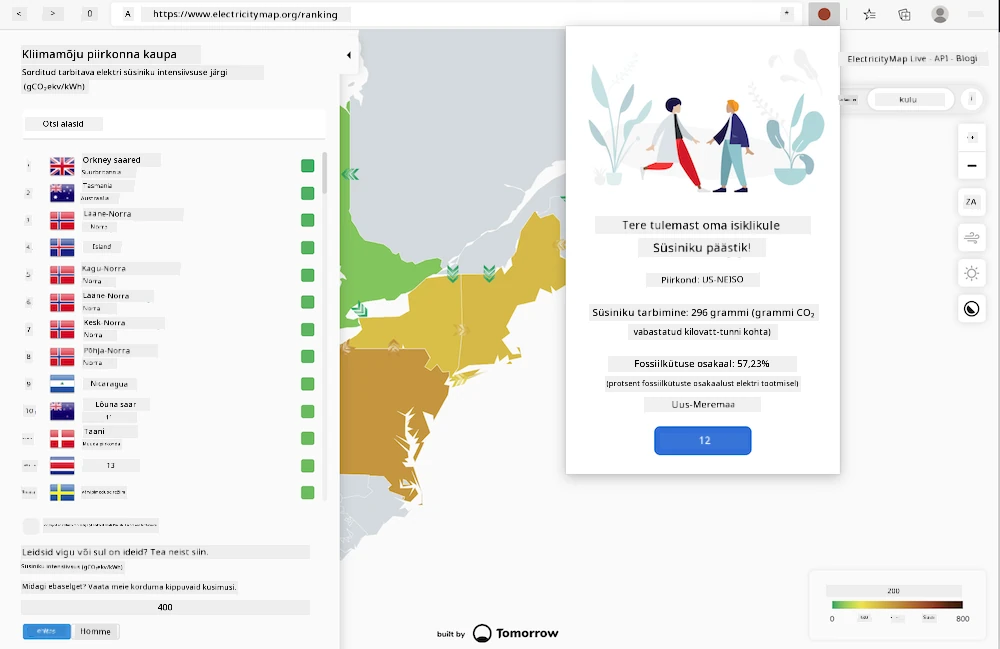
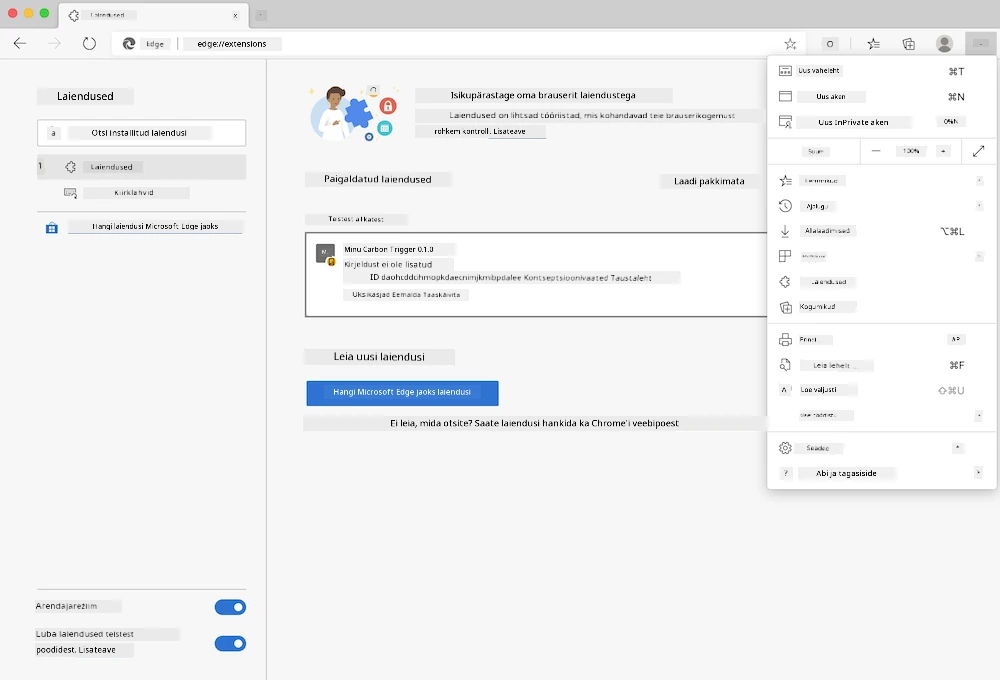

# Carbon Trigger Brauserilaiendus: Täielik Kood

Kasutades tmrow CO2 Signaali API-d elektritarbimise jälgimiseks, loo brauserilaiendus, mis annab sulle brauseris märguandeid selle kohta, kui suur on sinu piirkonna elektritarbimise koormus. Selle laienduse kasutamine aitab sul teha teadlikumaid otsuseid oma tegevuste osas, tuginedes sellele teabele.



## Alustamine

Sul on vaja paigaldada [npm](https://npmjs.com). Laadi alla selle koodi koopia oma arvutisse kausta.

Paigalda kõik vajalikud paketid:

```
npm install
```

Koosta laiendus webpackiga

```
npm run build
```

Edge'i paigaldamiseks kasuta brauseri paremas ülanurgas asuvat kolme punktiga menüüd, et leida Laienduste paneel. Sealt vali 'Load Unpacked', et laadida uus laiendus. Ava 'dist' kaust, kui seda küsitakse, ja laiendus laaditakse. Kasutamiseks vajad CO2 Signaali API võtit ([hankige see siit e-posti teel](https://www.co2signal.com/) - sisesta oma e-posti aadress sellel lehel olevasse kasti) ja [oma piirkonna koodi](http://api.electricitymap.org/v3/zones), mis vastab [Electricity Mapile](https://www.electricitymap.org/map) (näiteks Bostonis kasutan 'US-NEISO').



Kui API võti ja piirkond on laienduse liidesesse sisestatud, muutub brauserilaienduse tööriistaribal olev värviline punkt, et kajastada sinu piirkonna energiatarbimist, ning annab sulle soovitusi, milliseid tegevusi on sobiv teha. Selle 'punktisüsteemi' kontseptsiooni sain inspiratsiooniks [Energy Lollipop brauserilaiendusest](https://energylollipop.com/) California heitkoguste jaoks.

---

**Lahtiütlus**:  
See dokument on tõlgitud, kasutades AI tõlketeenust [Co-op Translator](https://github.com/Azure/co-op-translator). Kuigi püüame tagada täpsust, palun arvestage, et automaatsed tõlked võivad sisaldada vigu või ebatäpsusi. Algne dokument selle algses keeles tuleks lugeda autoriteetseks allikaks. Olulise teabe puhul on soovitatav kasutada professionaalset inimtõlget. Me ei vastuta selle tõlke kasutamisest tulenevate arusaamatuste või valede tõlgenduste eest.