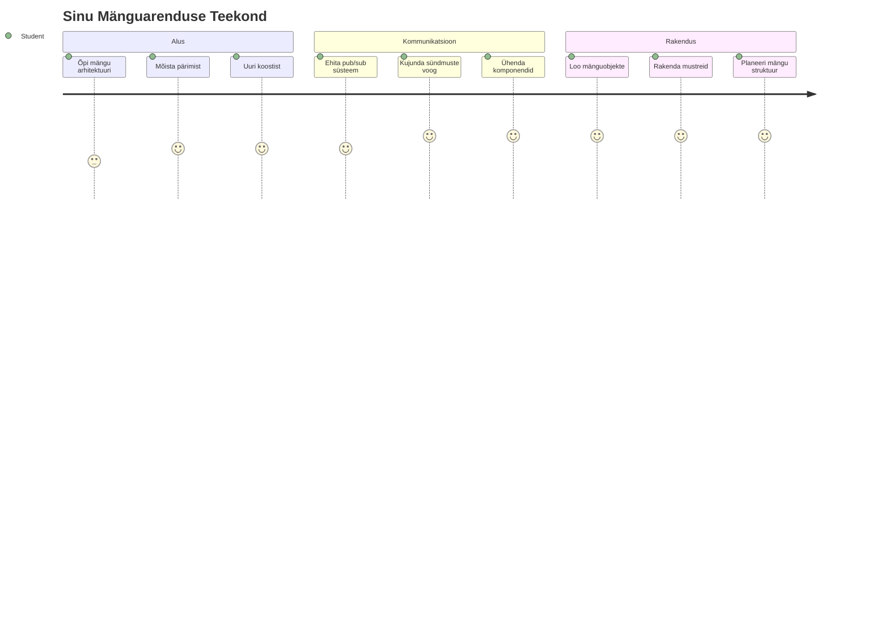
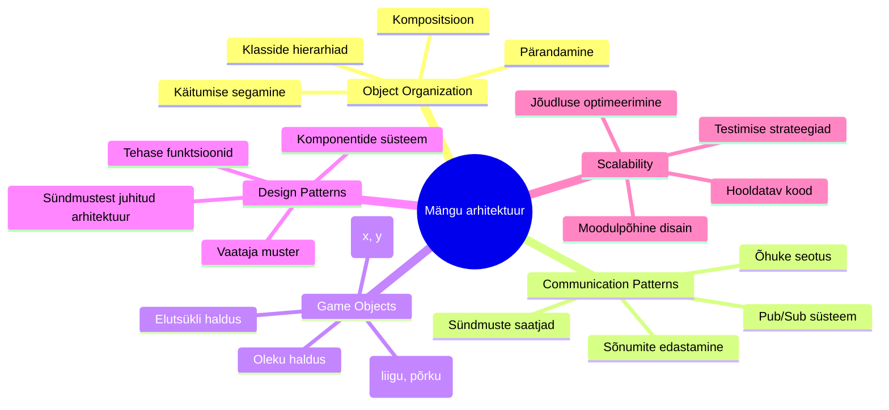
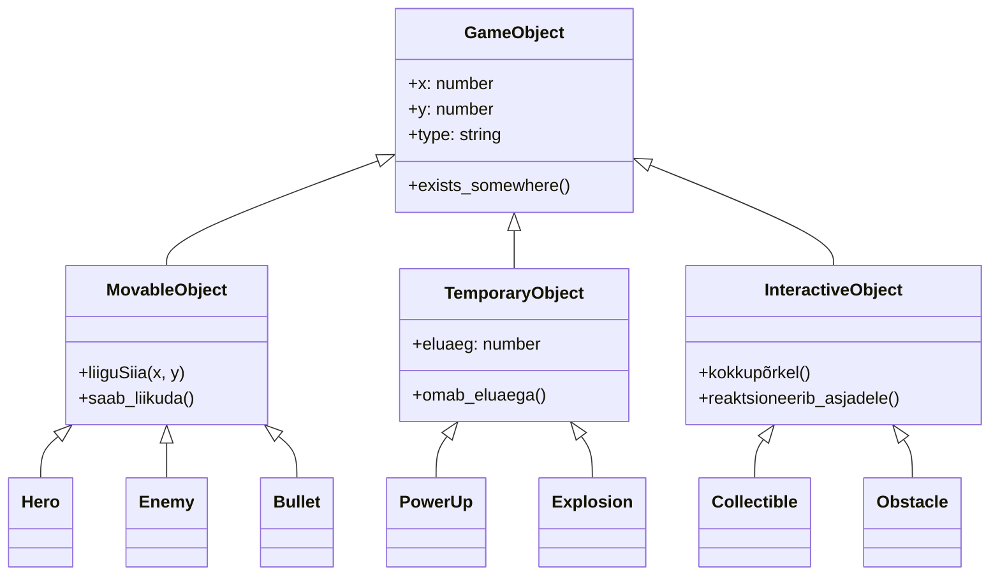
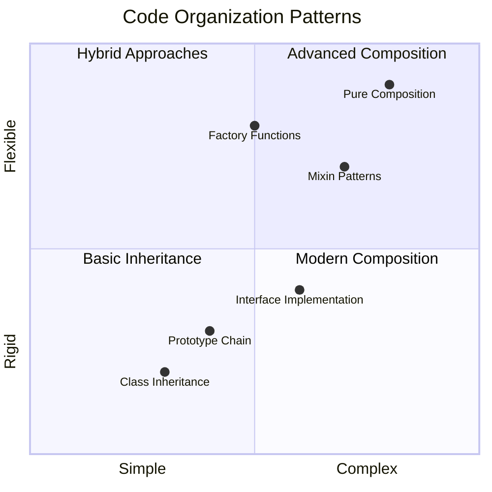
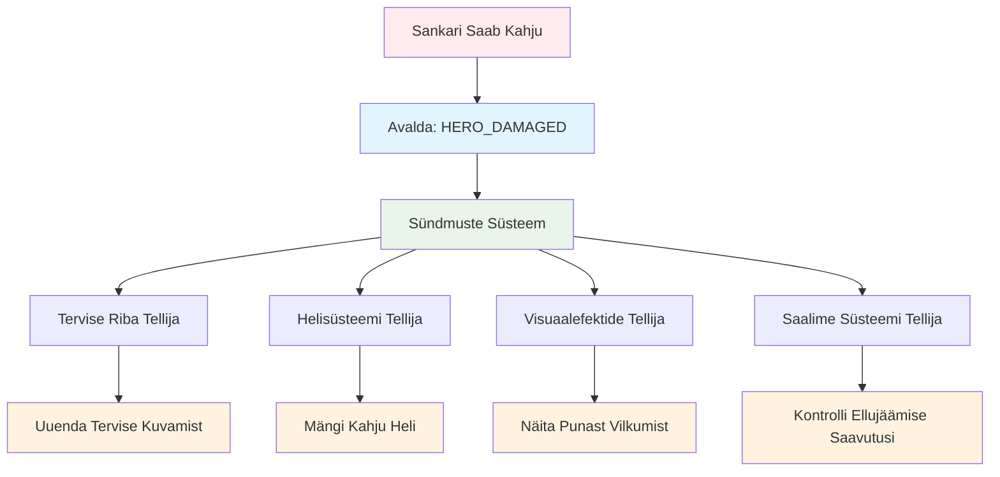
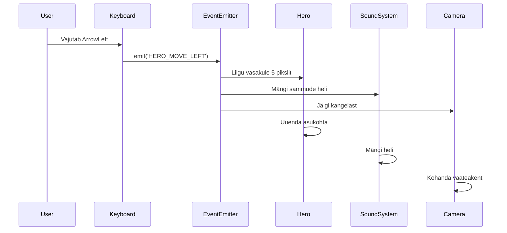
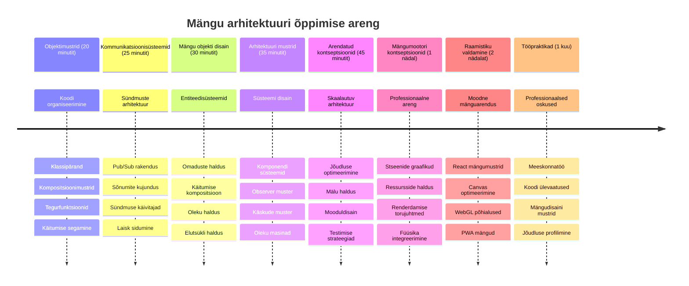

<!--
CO_OP_TRANSLATOR_METADATA:
{
  "original_hash": "a6332a7bb4d0be3bfd24199c83993777",
  "translation_date": "2026-01-08T09:15:31+00:00",
  "source_file": "6-space-game/1-introduction/README.md",
  "language_code": "et"
}
-->
# Kosmose mängu loomine Osa 1: Sissejuhatus




Nii nagu NASA missioonikontroll koordineerib mitut süsteemi kosmoselennu ajal, ehitame me kosmose mängu, mis näitab, kuidas programmi erinevad osad sujuvalt koos töötada saavad. Loo midagi, mida saad ka päriselt mängida, ja samal ajal õpid olulisi programmeerimiskontseptsioone, mis kehtivad igale tarkvaraprojektile.

Uurime kahte põhilist lähenemist koodi organiseerimisel: pärimist ja kompositsiooni. Need pole pelgalt akadeemilised mõisted – need on samad mustrid, mis juhivad kõike alates videomängudest kuni pangandussüsteemideni. Rakendame ka kommunikatsioonisüsteemi nimega pub/sub, mis töötab nagu kosmoselaevade sidevõrgustikud, võimaldades komponentidel infot jagada ilma omavahelisi sõltuvusi tekitamata.

Selle sarja lõpuks saad aru, kuidas luua rakendusi, mis võivad skaleeruda ja areneda – olgu tegemist mängude, veebirakenduste või mõne muu tarkvarasüsteemiga.


## Eelloengu viktoriin

[Eelloengu viktoriin](https://ff-quizzes.netlify.app/web/quiz/29)

## Pärimine ja kompositsioon mänguarenduses

Kui projektid muutuvad keerukamaks, muutub koodi organiseerimine kriitiliseks. See, mis algab lihtsa skriptina, võib muutuda raskesti hooldatavaks ilma korraliku struktuurita – nagu Apollo missioonid nõudsid tuhandete komponentide hoolikat koordineerimist.

Uurime kahte põhilist lähenemist koodi organiseerimisel: pärimist ja kompositsiooni. Igal on erinevad eelised ning mõlema mõistmine aitab valida sobiva lähenemise erinevates olukordades. Näitame neid kontseptsioone meie kosmose mängu näitel, kus kangelased, vaenlased, võimed ja teised objektid peavad tõhusalt suhtlema.

✅ Üks kuulsamaid programmeerimisraamatuid käsitleb [disainimustreid](https://en.wikipedia.org/wiki/Design_Patterns).

Igas mängus on sul `mänguobjektid` – interaktiivsed elemendid, mis täidavad sinu mängumaailma. Kangelased, vaenlased, võimed ja visuaalsed efektid on kõik mänguobjektid. Igaüks asub ekraanil kindlatel `x` ja `y` koordinaatidel, nagu punkti kandmine koordinaatteljel.

Hoolimata visuaalsetest erinevustest jagavad need objektid sageli põhilisi käitumisi:

- **Nad eksisteerivad kuskil** – Iga objekti x ja y koordinaadid ütlevad, kus mäng seda joonistab  
- **Paljud suudavad liikuda** – Kangelased jooksid, vaenlased jooksevad taga, kuulid lendavad üle ekraani  
- **Neil on eluiga** – Mõned jäävad igaveseks, teised (näiteks plahvatused) ilmuvad lühidalt ja kaovad  
- **Nad reageerivad sündmustele** – Kui asjad kokku põrkuvad, võimed kogutakse, terviseribad uuenevad  

✅ Mõtle mängule nagu Pac-Man. Kas suudad selles mängus tuvastada ülaltoodud nelja objekti tüüpi?


### Käitumise väljendamine koodi kaudu

Nüüd, kui mõistad, milliseid ühiseid käitumisi mänguobjektid jagavad, uurime, kuidas neid käitumisi JavaScriptis rakendada. Objektide käitumist saab väljendada meetodite kaudu, mis on seotud kas klasside või üksikute objektidega, ja valida on mitme lähenemise vahel.

**Klassipõhine lähenemine**

Klassid ja pärimine pakuvad struktureeritud lähenemist mänguobjektide organiseerimiseks. Nagu Carl Linnaeuse taksonoomiline klassifikatsioonisüsteem, alustad baas-klassi omadustega ning loome spetsialiseeritud klasse, mis pärivad neid põhifunktsioone ja lisavad spetsiifilised võimed.

✅ Pärimine on oluline mõiste, mida mõista. Loe rohkem [MDN artiklist pärimise kohta](https://developer.mozilla.org/docs/Web/JavaScript/Inheritance_and_the_prototype_chain).

Siin on, kuidas saad mänguobjekte klasside ja pärimise abil rakendada:

```javascript
// Samm 1: Loo baas GameObject klass
class GameObject {
  constructor(x, y, type) {
    this.x = x;
    this.y = y;
    this.type = type;
  }
}
```

**Võtame selle samm-sammult lahti:**
- Loome põhitempli, mida iga mänguobjekt saab kasutada  
- Konstruktor salvestab, kus objekt asub (`x`, `y`) ja mis tüüpi see on  
- See saab aluseks, millele kõik sinu mänguobjektid toetuvad  

```javascript
// 2. samm: Lisa liikumisvõimalus pärimise kaudu
class Movable extends GameObject {
  constructor(x, y, type) {
    super(x, y, type); // Kutsu vanema konstruktor
  }

  // Lisa võime liikuda uude positsiooni
  moveTo(x, y) {
    this.x = x;
    this.y = y;
  }
}
```

**Ülal kandisime ellu:**
- **Laiendasime** GameObject klassi, et lisada liikumisfunktsionaalsus  
- **Kutsusime** vanema konstruktori `super()` abil pärandatud omaduste initsialiseerimiseks  
- **Lisatasime** `moveTo()` meetodi, mis uuendab objekti asukohta  

```javascript
// Samm 3: Loo spetsiifilised mänguobjektide tüübid
class Hero extends Movable {
  constructor(x, y) {
    super(x, y, 'Hero'); // Määra tüüp automaatselt
  }
}

class Tree extends GameObject {
  constructor(x, y) {
    super(x, y, 'Tree'); // Puudel pole liikumist vaja
  }
}

// Samm 4: Kasuta oma mänguobjekte
const hero = new Hero(0, 0);
hero.moveTo(5, 5); // Kangelane saab liikuda!

const tree = new Tree(10, 15);
// tree.moveTo() tekitaks vea - puud ei saa liikuda
```

**Nende kontseptsioonide mõistmine:**
- **Loodab** spetsialiseeritud objektitüüpe, mis pärivad sobivad käitumised  
- **Näitab**, kuidas pärimine võimaldab valida, milliseid funktsioone kaasata  
- **Kuvab**, et kangelased võivad liikuda, samas puuduvad puudel see võimekus  
- **Illustreerib**, kuidas klassihierarhia takistab sobimatuid toiminguid  

✅ Võta mõni minut ja kujuta ette Pac-Man kangelast (näiteks Inky, Pinky või Blinky) ja kuidas seda JavaScriptis kirjutada.

**Kompositsioonilähenemine**

Kompositsioon järgib modulaarset disainifilosoofiat, sarnaselt inseneridele, kes kujundavad kosmoselaevu vahetatavate komponentidega. Läbi vanema klassi pärimise asemel kombineerid spetsiifilisi käitumisi, et luua objekt, millel on täpselt vajalikud funktsioonid. See lähenemine pakub paindlikkust ilma jäikade hierarhiliste piiranguteta.

```javascript
// 1. samm: Loo baas käitumise objektid
const gameObject = {
  x: 0,
  y: 0,
  type: ''
};

const movable = {
  moveTo(x, y) {
    this.x = x;
    this.y = y;
  }
};
```

**See kood teeb järgmist:**
- **Defineerib** baasmänguobjekti positsiooni ja tüübi omadustega  
- **Loo** eraldi `movable` käitumisobjekti liikumisfunktsiooniga  
- **Eraldab** vastutused hoides positsiooniandmed ja liikumisloogika sõltumatuna  

```javascript
// Samm 2: Koosta objekte, kombineerides käitumisi
const movableObject = { ...gameObject, ...movable };

// Samm 3: Loo erinevate objektitüüpide jaoks tehasefunktsioonid
function createHero(x, y) {
  return {
    ...movableObject,
    x,
    y,
    type: 'Hero'
  };
}

function createStatic(x, y, type) {
  return {
    ...gameObject,
    x,
    y,
    type
  };
}
```

**Ülal tegime järgmist:**
- **Kombineerisime** baasiomadused ja liikumiskäitumise leviku süntaksi abil  
- **Loomis** tehasefunktsioonid, mis tagastavad kohandatud objekte  
- **Võimaldas** paindliku objektide loomise ilma jäikade klassihierarhiateta  
- **Lubas** objektidel omada täpselt vajalikke käitumisi  

```javascript
// Samm 4: Loo ja kasuta oma kombineeritud objekte
const hero = createHero(10, 10);
hero.moveTo(5, 5); // Töötas suurepäraselt!

const tree = createStatic(0, 0, 'Tree');
// tree.moveTo() on määratlemata - liikumiskäitumist ei loodud
```

**Olulised punktid:**
- **Komponib** objekte, segades käitumisi pärimise asemel  
- **Pakub** suuremat paindlikkust kui jäigad pärimishierarhiad  
- **Lubab** objektidel olla täpselt vajalikud omadused  
- **Kasutab** kaasaegset JavaScripti leviku süntaksit puhtaks objektide kombineerimiseks  
```

**Which Pattern Should You Choose?**

**Which Pattern Should You Choose?**



> 💡 **Näpunäide**: Mõlemal mustril on oma koht moodsa JavaScripti arenduses. Klassid sobivad hästi selgete hierarhiate jaoks, kompositsioon tõuseb esile maksimaalse paindlikkuse puhul.
> 
**Millal kumbagi kasutada:**
- **Vali** pärimine kui sul on selged "on-üks-..." suhted (näiteks kangelane *on-üks* liigutatav objekt)  
- **Kasuta** kompositsiooni, kui vajad "omab-" suhteid (näiteks kangelane *omab* liikumisvõimet)  
- **Arvesta** oma meeskonna eelistustega ja projekti nõuetega  
- **Pea meeles**, et võid sama rakenduse sees mõlemat lähenemist kombineerida  

### 🔄 **Pedagoogiline seisak**
**Objektide organiseerimise arusaam**: Enne kommunikatsioonimustrite juurde liikumist veendu, et oskad:  
- ✅ Selgitada erinevust pärimise ja kompositsiooni vahel  
- ✅ Tuvastada, millal kasutada klasse versus tehasefunktsioone  
- ✅ Mõista, kuidas pärimisel töötab `super()` märksõna  
- ✅ Tunda ära iga lähenemise eeliseid mänguarenduses  

**Kiire enese test**: Kuidas looksid lendava vaenlase, kes nii liigub kui lendab?  
- **Pärimise lähenemine**: `class FlyingEnemy extends Movable`  
- **Kompositsiooni lähenemine**: `{ ...movable, ...flyable, ...gameObject }`  

**Tegelik maailm**: Need mustrid on kõikjal:  
- **React komponendid**: Props (kompositsioon) vs klassipärimine  
- **Mängumootorid**: Entiteedi-komponendi süsteemid kasutavad kompositsiooni  
- **Mobiilirakendused**: UI raamistikud kasutavad sageli pärimishierarhiaid  

## Kommunikatsioonimustrid: Pub/Sub süsteem

Kui rakendused muutuvad keerukaks, muutub komponentidevaheline kommunikatsioon keerukaks hallata. Avaldamise- tellimise muster (pub/sub) lahendab selle probleemi, kasutades sama põhimõtet nagu raadiolainete levitus – üks saatja võib jõuda mitme vastuvõtjani ilma, et ta teaks kes kuulavad.

Mõtle, mis juhtub, kui kangelane saab vigastuse: terviseriba uuendatakse, mängitakse heliefekte, ilmub visuaalne tagasiside. Pub/sub võimaldab kangelasel avaldada "vigastuse saamine" sõnumit. Iga süsteem, mis peab reageerima, saab sellisele sõnumile tellida ja vastavalt tegutseda.

✅ **Pub/Sub** tähendab 'publish-subscribe' ehk avalda-telli


### Pub/Sub arhitektuuri mõistmine

Pub/sub muster hoiab sinu rakenduse eri osad lahtiselt seotud, mis tähendab, et need võivad töötada koos ilma otseste sõltuvusteta. See lahutus teeb su koodi paremini hooldatavaks, testitavaks ja paindlikuks muutuste osas.

**Olulised osalejad pub/sub-is:**
- **Sõnumid** – Lihtsad tekstisildid nagu `'PLAYER_SCORED'`, mis kirjeldavad, mis juhtus (pluss lisainfo)  
- **Avaldajad** – Objektid, kes hüüavad "Midagi juhtus!" kõigile, kes kuulavad  
- **Tellijad** – Objektid, kes ütlevad "Mind huvitab see sündmus" ja reageerivad, kui see toimub  
- **Sündmuste süsteem** – Vahepealne, mis tagab, et sõnumid jõuavad õigete kuulajateni  

### Sündmuste süsteemi loomine

Teeme lihtsa, kuid võimsa sündmuste süsteemi, mis demonstreerib neid kontseptsioone:

```javascript
// Samm 1: Loo EventEmitter klass
class EventEmitter {
  constructor() {
    this.listeners = {}; // Säilita kõik sündmuste kuulajad
  }
  
  // Registreeri kuulaja konkreetse sõnumitüübi jaoks
  on(message, listener) {
    if (!this.listeners[message]) {
      this.listeners[message] = [];
    }
    this.listeners[message].push(listener);
  }
  
  // Saada sõnum kõigile registreeritud kuulajatele
  emit(message, payload = null) {
    if (this.listeners[message]) {
      this.listeners[message].forEach(listener => {
        listener(message, payload);
      });
    }
  }
}
```

**Eraldame siin toimuvat:**
- **Loodud** keskne sündmuste haldussüsteem lihtsa klassi abil  
- **Hoiab** kuulajaid objektis, mis on korraldatud sõnumitüübi järgi  
- **Registreerib** uusi kuulajaid `on()` meetodi kaudu  
- **Saadab** sõnumeid kõikidele huvitatud kuulajatele `emit()` abil  
- **Toetab** valikulisi andmepakette asjakohase info edastamiseks  

### Kõike koos: praktiline näide

Vaatame seda toimimas! Loome lihtsa liikumissüsteemi, mis näitab, kui puhas ja paindlik pub/sub võib olla:

```javascript
// Samm 1: Määratle oma sõnumitüübid
const Messages = {
  HERO_MOVE_LEFT: 'HERO_MOVE_LEFT',
  HERO_MOVE_RIGHT: 'HERO_MOVE_RIGHT',
  ENEMY_SPOTTED: 'ENEMY_SPOTTED'
};

// Samm 2: Loo oma sündmuste süsteem ja mänguobjektid
const eventEmitter = new EventEmitter();
const hero = createHero(0, 0);
```

**See kood teeb järgmist:**
- **Defineerib** konstantide objekti, et vältida kirjavigu sõnuminimedes  
- **Loo** sündmuste emitteri instantsi kogu kommunikatsiooni haldamiseks  
- **Alustab** kangelase objektiga stardiasukohas  

```javascript
// Samm 3: Seadistage sündmuste kuulajad (tellijad)
eventEmitter.on(Messages.HERO_MOVE_LEFT, () => {
  hero.moveTo(hero.x - 5, hero.y);
  console.log(`Hero moved to position: ${hero.x}, ${hero.y}`);
});

eventEmitter.on(Messages.HERO_MOVE_RIGHT, () => {
  hero.moveTo(hero.x + 5, hero.y);
  console.log(`Hero moved to position: ${hero.x}, ${hero.y}`);
});
```

**Ülal tegime järgmist:**
- **Registreerisime** sündmuste kuulajad, mis reageerivad liikumissõnumitele  
- **Uuendasime** kangelase positsiooni liikumissuuna põhjal  
- **Lisatasime** konsoolilogimise, et jälgida kangelase positsiooni muutusi  
- **Eraldasime** liikumisloogika sisendi käsitlemisest  

```javascript
// Samm 4: Ühenda klaviatuuri sisend sündmustega (väljastajad)
window.addEventListener('keydown', (event) => {
  switch(event.key) {
    case 'ArrowLeft':
      eventEmitter.emit(Messages.HERO_MOVE_LEFT);
      break;
    case 'ArrowRight':
      eventEmitter.emit(Messages.HERO_MOVE_RIGHT);
      break;
  }
});
```

**Mõistame järgmisi kontseptsioone:**
- **Ühendab** klaviatuurisisendi mängusündmustega ilma tugeva sidumiseta  
- **Võimaldab** sisendsüsteemil mänguobjektidega kaudselt suhelda  
- **Lubab** mitmel süsteemil sama klaviatuurisündmusele reageerida  
- **Lihtsustab** klahvikomplektide muutmist või uute sisendimeetodite lisamist  


> 💡 **Näpunäide**: Selle mustri ilu on paindlikkus! Saad lihtsalt lisada heliefekte, ekraani värinat või osakeste efekte – lisa ainult uusi sündmuste kuulajaid, ilma et peaks olemasolevat klaviatuuri või liikumise koodi muutma.  
> 
**Miks see lähenemine on suurepärane:**
- Uute funktsioonide lisamine on ülilihtne – lihtsalt kuula sind huvitavaid sündmusi  
- Mitmed asjad saavad samale sündmusele reageerida ilma segamise riskita  
- Testimine muutub märksa lihtsamaks, sest iga osa töötab iseseisvalt  
- Kui midagi katki läheb, tead täpselt, kust otsida  

### Miks pub/sub tõhusalt skaleerub

Pub/sub muster hoiab lihtsuse alles, kui rakendused muutuvad keerukaks. Olgu tegemist kümnete vaenlastega, dünaamilise kasutajaliidese värskendustega või helisüsteemidega – muster käitleb kasvavat ulatust ilma arhitektuurilisi muudatusi tegemata. Uued funktsioonid integreeruvad olemasolevasse sündmuste süsteemi, mõjutamata senist funktsionaalsust.

> ⚠️ **Levinud viga**: Ära loo liiga palju erisõnumi tüüpe varakult. Alusta üldistest kategooriatest ja täpsusta neid vastavalt mängu vajadustele.  
> 
**Parimad praktikad:**
- **Grupi** seotud sõnumid loogilistesse kategooriatesse  
- **Kasuta** kirjelduvaid nimesid, mis selgelt näitavad, mis juhtus  
- **Hoidke** sõnumi andmepaketid lihtsad ja keskendunud  
- **Dokumenteerige** oma sõnumitüübid meeskonnatöö jaoks  

### 🔄 **Pedagoogiline seisak**
**Sündmustepõhise arhitektuuri mõistmine**: Kontrolli oma arusaamist kogu süsteemist:  
- ✅ Kuidas pub/sub muster takistab tugevat sidumist komponentide vahel?  
- ✅ Miks on ürituspõhise arhitektuuriga lihtsam uusi funktsioone lisada?  
- ✅ Millist rolli mängib EventEmitter kommunikatsioonis?  
- ✅ Kuidas sõnumikonstandid aitavad vältida vigu ja parandavad hooldatavust?  

**Disain väljakutse**: Kuidas lahendaksid järgmised mängustsenaariumid pub/sub abil?  
1. **Vaenlane sureb**: Uuenda skoori, mängi heli, genereeri võime, eemalda ekraanilt  
2. **Tase lõpetatud**: Peata muusika, näita kasutajaliidest, salvesta edenemine, laadi järgmine tase  
3. **Võime korjatud**: Paranda võimed, uuenda kasutajaliidest, mängi efekti, alusta taimerit  

**Professionaalne seos**: See muster on olemas:  
- **Eesliidese raamistikud**: React/Vue sündmusesüsteemid  
- **Tagatöö teenused**: Mikroteenuste kommunikatsioon  
- **Mängumootorid**: Unity sündmuste süsteem  
- **Mobiiliarendus**: iOS/Android teatamissüsteemid  

---

## GitHub Copilot Agendi väljakutse 🚀

Kasuta agendi režiimi, et täita järgmine väljakutse:

**Kirjeldus:** Loo lihtne mänguobjektide süsteem, kasutades nii pärimist kui pub/sub mustrit. Rakenda põhimäng, kus erinevad objektid saavad sündmuste kaudu omavahel suhelda ilma, et tunneksid otseselt üksteist.

**Päring:** Loo JavaScripti mängusüsteem järgmiste nõuetega: 1) Loo baas GameObject klass, millel on x, y koordinaadid ja tüübiväli. 2) Loo Hero klass, mis pärib GameObjecti ja saab liikuda. 3) Loo Enemy klass, mis pärib GameObjecti ja suudab kangelast taga ajada. 4) Rakenda EventEmitter klass pub/sub mustri jaoks. 5) Sea sündmuste kuulajad nii, et kui kangelane liigub, saavad lähistel olevad vaenlased sündmuse 'HERO_MOVED' ning uuendavad oma asukohta liikudes kangelas poole. Lisa konsoolilogid, mis näitavad objektidevahelist suhtlust.

Loe rohkem [agendi režiim](https://code.visualstudio.com/blogs/2025/02/24/introducing-copilot-agent-mode) kohta siin.

## 🚀 Väljakutse
Kaaluge, kuidas pub-sub muster saab täiustada mängu arhitektuuri. Määrake, millised komponendid peaksid sündmusi genereerima ja kuidas süsteem peaks neile reageerima. Mõelge välja mängukontseptsioon ja kaardistage selle komponentidevahelised suhtlemismustrid.

## Loengu järeltest

[Loengu järeltest](https://ff-quizzes.netlify.app/web/quiz/30)

## Ülevaade ja iseõpe

Õppige Pub/Sub kohta rohkem, [lugedes sellest](https://docs.microsoft.com/azure/architecture/patterns/publisher-subscriber/?WT.mc_id=academic-77807-sagibbon).

### ⚡ **Mida saate teha järgmise 5 minutiga**
- [ ] Avage mõni HTML5 mäng veebis ja uurige selle koodi DevToolsi abil
- [ ] Looge lihtne HTML5 Canvas element ja joonistage põhiline kuju
- [ ] Katsetage `setInterval` kasutamist lihtsa animatsiooniloopi loomiseks
- [ ] Uurige Canvas API dokumentatsiooni ja proovige mõnda joonistamismeetodit

### 🎯 **Mida saate selle tunni jooksul saavutada**
- [ ] Täitke loengu järgne test ja mõistke mänguarenduse kontseptsioone
- [ ] Määrake oma mänguprojekti struktuur HTML-, CSS- ja JavaScripti failidega
- [ ] Looge põhjalik mängutsükkel, mis uuendab ja renderdab pidevalt
- [ ] Joonistage oma esimesed mängusprite'id canvasele
- [ ] Tehke lihtne varade laadimine piltide ja helide jaoks

### 📅 **Teie nädala pikkune mänguloomisülesanne**
- [ ] Valmis täielik kosmose-mäng kõigi planeeritud funktsioonidega
- [ ] Lisage lihvitud graafika, heliefektid ja sujuvad animatsioonid
- [ ] Rakendage mängu olekud (alguskuva, mäng, mängu lõpp)
- [ ] Looge skoorisüsteem ja mängija edenemise jälgimine
- [ ] Muutke mäng reageerivaks ja ligipääsetavaks erinevates seadmetes
- [ ] Jagage oma mängu veebis ja koguge tagasisidet mängijatelt

### 🌟 **Teie kuu pikkune mänguarendus**
- [ ] Arendage mitu mänge, uurides erinevaid žanre ja mehhaanikat
- [ ] Õppige mänguarendusraamistikku, näiteks Phaser või Three.js
- [ ] Andke panus avatud lähtekoodiga mänguarendusprojektidesse
- [ ] Valmistuge õppima edasijõudnud mänguprogrammeerimise mustreid ja optimeerimist
- [ ] Looge portfoolio, mis demonstreerib teie mänguarenduse oskusi
- [ ] Mentorige teisi, kes on huvitatud mänguarendusest ja interaktiivsest meediast

## 🎯 Teie mänguarendusmeistrivõistluste ajakava


### 🛠️ Teie mängu arhitektuuri tööriistakasti kokkuvõte

Pärast selle õppetunni lõpetamist on teil:
- **Disainimustri valdamine**: Pärimise ja kompositsiooni kompromisside mõistmine
- **Sündmustepõhine arhitektuur**: Pub/sub rakendamine skaleeritava suhtluse jaoks
- **Objekti-orienteeritud disain**: Klasside hierarhiad ja käitumise kompositsioon
- **Moodne JavaScript**: Tegutsemisfunktsioonid, spreadi süntaks ja ES6+ mustrid
- **Skaleeritav arhitektuur**: Lahtise sidumise ja mooduldisaini põhimõtted
- **Mänguarenduse alus**: Entiteedi süsteemid ja komponendi mustrid
- **Professionaalsed mustrid**: Töö tööstusharu-koodi organiseerimise lähenemised

**Tegeliku maailma rakendused**: Need mustrid kehtivad otse:
- **Eesliideseraamistikud**: React/Vue komponendi arhitektuur ja olekute haldamine
- **Tagaplaaniteenused**: Mikroteenuste suhtlus ja sündmustepõhised süsteemid
- **Mobiiliarendus**: iOS/Android rakenduste arhitektuur ja teavitussüsteemid
- **Mängumootorid**: Unity, Unreal ja veebipõhine mänguarendus
- **Ettevõttesüsteemid**: Sündmuste allikad ja hajutatud süsteemide disain
- **API disain**: RESTful teenused ja reaalajas suhtlus

**Omandatud professionaalsed oskused**: Te oskate nüüd:
- **Disainida** skaleeritavaid tarkvaraarhitektuure kasutades tõestatud mustreid
- **Rakendada** sündmustepõhiseid süsteeme keerukate interaktsioonide haldamiseks
- **Valida** sobiva koodi organiseerimise strateegia erinevate stsenaariumite jaoks
- **Siluda** ja hooldada lahtise sidumisega süsteeme tõhusalt
- **Suhelda** tehnilisi otsuseid tööstusharu standardite terminoloogiaga

**Järgmine tase**: Olete valmis neid mustreid rakendama pärismängus, uurima arenenumat mänguarendust või kasutama neid arhitektuurikontsepte veebirakendustes!

🌟 **Saavutuse avamine**: Olete valdanud fundamentaalsed tarkvaraarhitektuuri mustrid, mis jõustavad kõike alates lihtsatest mängudest kuni keerukate ettevõttesüsteemideni!

## Kodune ülesanne

[Mock up a game](assignment.md)

---

<!-- CO-OP TRANSLATOR DISCLAIMER START -->
**Loaandmine**:  
See dokument on tõlgitud kasutades tehisintellekti tõlke teenust [Co-op Translator](https://github.com/Azure/co-op-translator). Kuigi me püüame tagada täpsust, palun arvestage, et automaatsed tõlked võivad sisaldada vigu või ebatäpsusi. Originaaldokument oma emakeeles tuleks lugeda autoriteetseks allikaks. Olulise info puhul soovitatakse kasutada professionaalset inimtõlget. Me ei vastuta selle tõlke kasutamisest tulenevate arusaamatuste või valesti mõistmiste eest.
<!-- CO-OP TRANSLATOR DISCLAIMER END -->