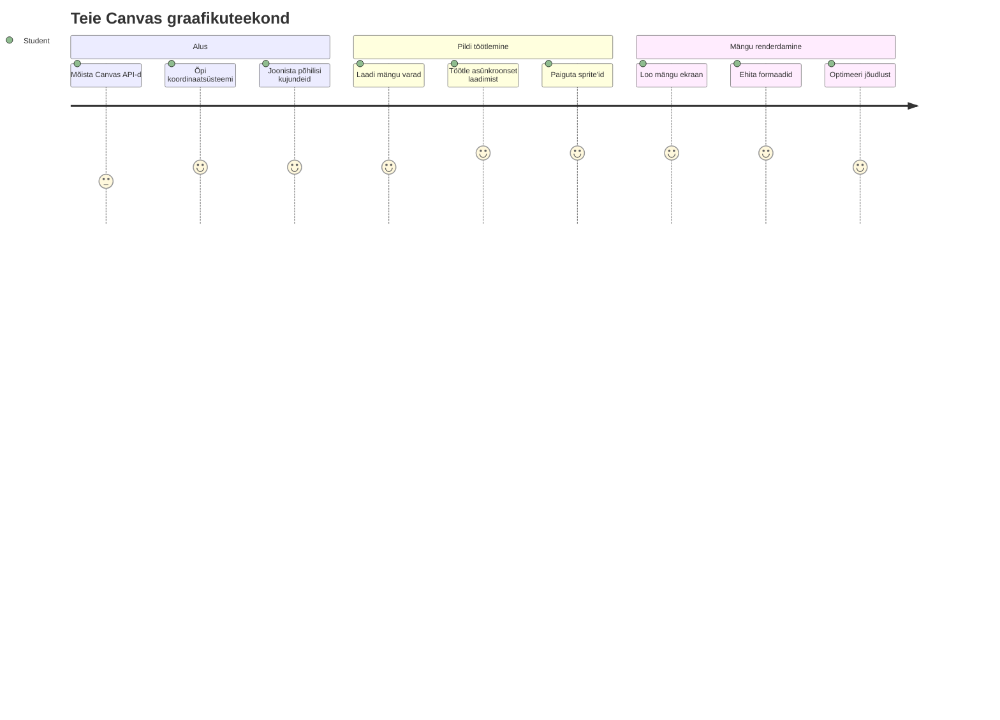
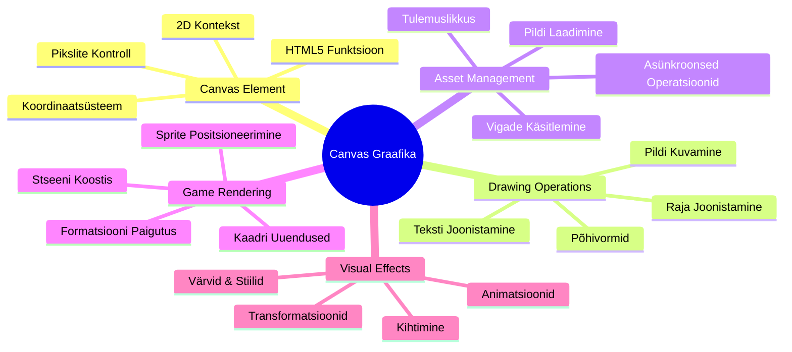
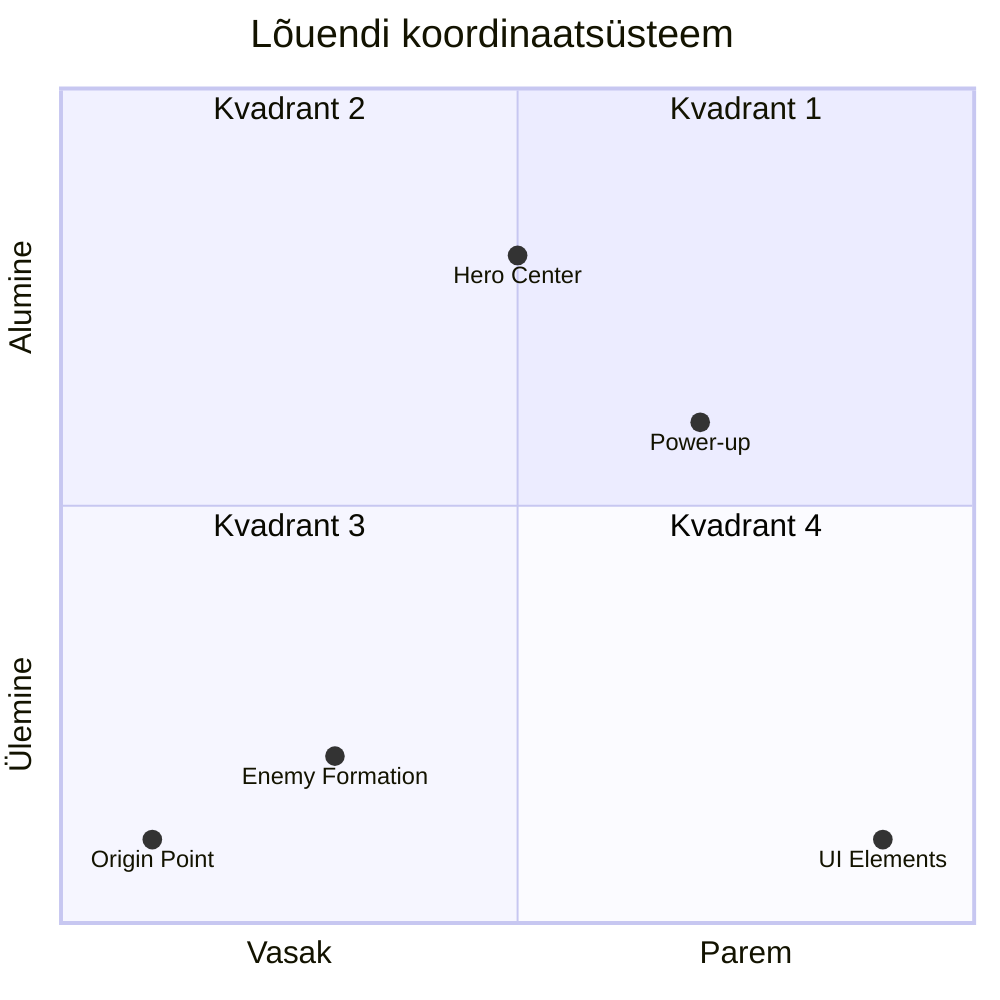
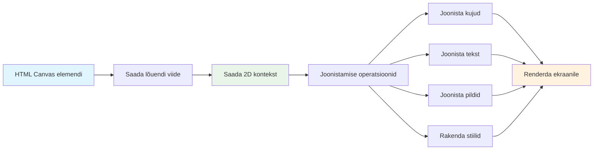
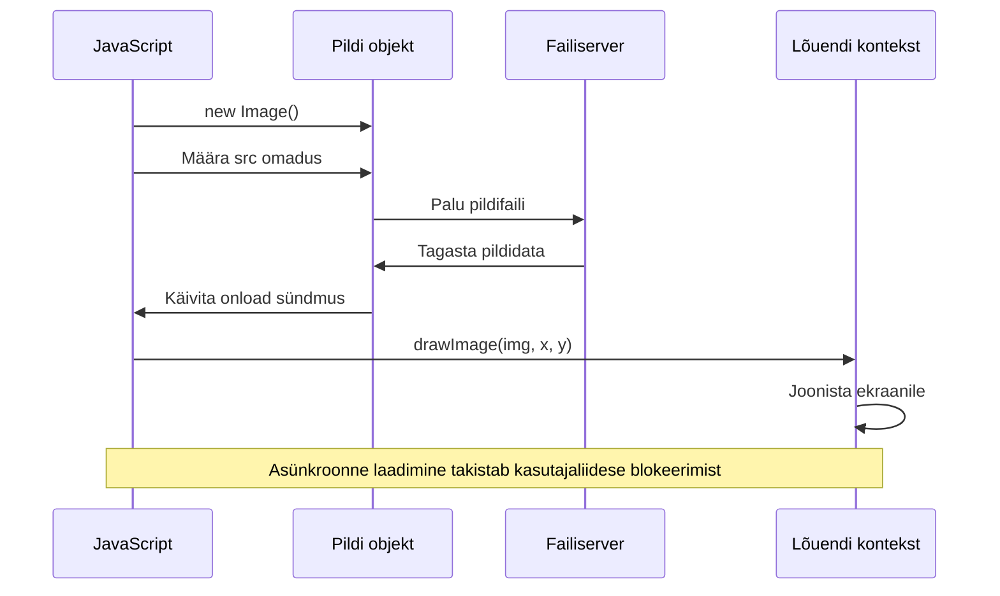
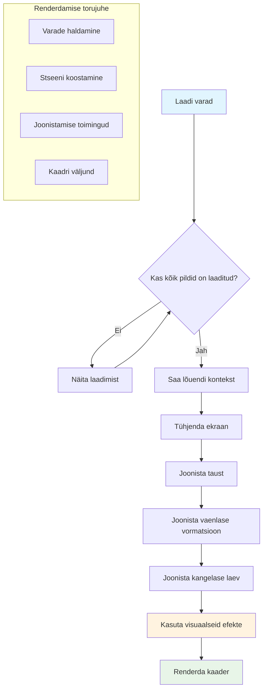
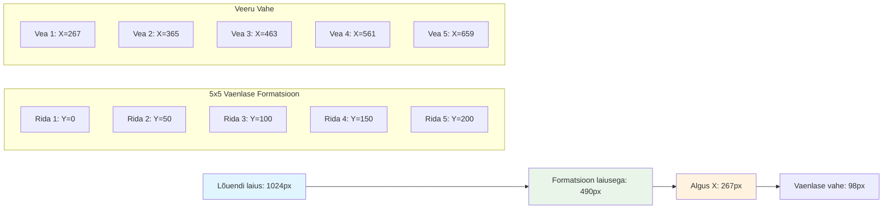
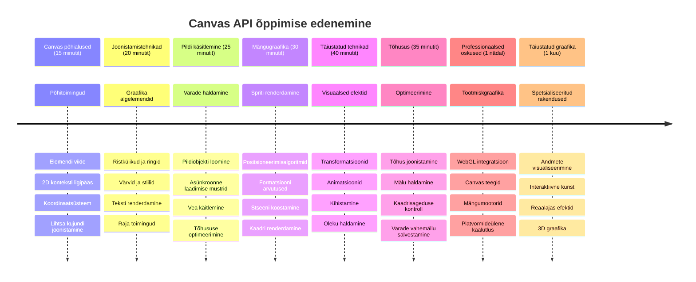

<!--
CO_OP_TRANSLATOR_METADATA:
{
  "original_hash": "7994743c5b21fdcceb36307916ef249a",
  "translation_date": "2026-01-08T09:08:48+00:00",
  "source_file": "6-space-game/2-drawing-to-canvas/README.md",
  "language_code": "et"
}
-->
# Kogu kosmose mängu osa 2: Joonista kangale kangelane ja koletised


Canvas API on üks veebiarenduse võimsamaid vahendeid dünaamiliste, interaktiivsete graafikute loomiseks otse sinu brauseris. Selles tunnis muudame tühja HTML `<canvas>` elemendi mängumaailmaks täis kangelasi ja koletisi. Mõtle kangale kui oma digitaalsele kunstipaneelile, kus kood muutub nähtavaks.

Me ehitame edasi eelmistel tundidel õpitu peale ja nüüd sukeldume visuaalsetesse aspektidesse. Õpid kuidas laadida ja kuvada mängu sprite'e, paigutada elemente täpselt ning luua oma kosmosemängu visuaalne alus. See sillutab teed staatiliste veebilehtede ja dünaamiliste, interaktiivsete kogemuste vahel.

Selle tunni lõpuks on sul täielik mängustseen, kus kangelase laev on õigesse kohta paigutatud ja vaenlased rivistatud lahinguks valmis. Sa mõistad, kuidas tänapäevased mängud kuvavad graafikat brauserites ning omandad oskused luua oma interaktiivseid visuaalseid elamusi. Uurime canvas-graafikat ja toome sinu kosmosemängu ellu!


## Eel-loengu viktoriin

[Eel-loengu viktoriin](https://ff-quizzes.netlify.app/web/quiz/31)

## Canvas

Mis see `<canvas>` element täpsemalt on? See on HTML5 lahendus dünaamiliste graafikute ja animatsioonide loomiseks veebibrauserites. Erinevalt tavalistest staatilistest piltidest või videotest annab canvas sulle pikslitase kontrolli kõige üle, mis ekraanil kuvatakse. See teeb sellest ideaalse vahendi mängude, andmete visualiseerimise ja interaktiivse kunsti jaoks. Mõtle sellele kui programmeeritavale joonistuspinnale, kus JavaScript on su pintsel.

Vaikimisi näeb canvas-element välja nagu tühi, läbipaistev ristkülik sinu lehel. Kuid just siin peitub selle võimekus! Selle tegelik jõud avaldub, kui kasutad JavaScripti kujundite joonistamiseks, piltide laadimiseks, animatsioonide loomiseks ja asjade kasutajate tegevustele reageerimiseks. See on sarnane 1960ndatel Bell Labsis arvutigraafika pioneeri tööviisile, kus iga piksel tuli käsitsi programmeerida, et luua esimesed digitaalsed animatsioonid.

✅ Loe [Canvas API-st lähemalt](https://developer.mozilla.org/docs/Web/API/Canvas_API) MDN-is.

Tavaliselt deklareeritakse see nii, osana lehe body-st:

```html
<canvas id="myCanvas" width="200" height="100"></canvas>
```

**See kood teeb järgmist:**
- **Määrab** `id` atribuudi, et saaksid sellele konkreetsele canvas elemendile JavaScriptis viidata
- **Määrab** `width` pikslites, et kontrollida kanga laiust
- **Seab** `height` pikslites, et määrata kanga kõrgust

## Lihtsa geomeetria joonistamine

Nüüd kui tead, mis on canvas element, vaatame, kuidas seal joonistada! Canvas kasutab koordinaatsüsteemi, mis võib tunduda matemaatikast tuttav, kuid arvutigraafika jaoks on üks oluline erinõks.

Canvas kasutab ristkoordinaate koos x-telje (horisontaalne) ja y-telje (vertikaalne) asukoha määramiseks. Kuid põhiline erinevus on see, et erinevalt matemaatikast, kus koordinaatide alguspunkt (0,0) on tavaolemusena all vasakul, canvas'is on origin (0,0) üleval vasakul, kus x väärtused suurenevad paremale liikumisel ja y väärtused allapoole liikumisel. See lähtub varajastest arvutiekraanidest, kus elektronkiired skaneerisid pilti ülalt alla, muutes vasaku ülanurga loomulikuks alguspunktiks.



> Pilt pärit [MDN-ist](https://developer.mozilla.org/docs/Web/API/Canvas_API/Tutorial/Drawing_shapes)

Canvas elemendi joonistamiseks järgid kolme sammuga protsessi, mis moodustab kõigi canvas graafika aluse. Kui seda mõned korrad teha, saab see loomuomaseks:


1. **Leia viide** oma canvas elemendile DOM-ist (nagu iga teise HTML elemendi puhul)
2. **Hangi 2D joonistamiskontekst** – see pakub kõiki joonistamismeetodeid
3. **Alusta joonistamist!** Kasuta konteksti sisseehitatud meetodeid graafika loomiseks

Siin on koodinäide:

```javascript
// Samm 1: Hangi lõuendi element
const canvas = document.getElementById("myCanvas");

// Samm 2: Hangi 2D joonistamiskontekst
const ctx = canvas.getContext("2d");

// Samm 3: Sea täitevärv ja joonista ristkülik
ctx.fillStyle = 'red';
ctx.fillRect(0, 0, 200, 200); // x, y, laius, kõrgus
```

**Läheme selle läbi samm-sammult:**
- Me **võtame** canvas elemendi selle ID järgi ja salvestame muutuja sisse
- Me **saame** 2D joonistamiskonteksti – see on meie joonistamisvahendite komplekt
- Me **määrame** värviks punase, kasutades `fillStyle` omadust
- Me **joonistame** ristküliku, mis algab punktist (0,0), on 200 pikslit lai ja kõrge

✅ Canvas API keskendub peamiselt 2D kujunditele, kuid veebis 3D elementide joonistamiseks võib kasutada [WebGL API-d](https://developer.mozilla.org/docs/Web/API/WebGL_API).

Canvas API abil võid joonistada väga palju erinevaid asju, näiteks:

- **Geomeetrilisi kujundeid**, nagu näiteks ristkülikuid, kuid ka palju muud.
- **Teksti**, mis võib olla mis tahes fonti ja värvi.
- **Pilte**, kus saad joonistada pilte .jpg või .png failidest.

✅ Proovi joonistada! Sa juba tead, kuidas joonistada ristkülikut, kas oskad joonistada ka ringi? Vaata huvitavaid Canvas joonistusi CodePen'is. Siin on [eriti muljetavaldav näide](https://codepen.io/dissimulate/pen/KrAwx).

### 🔄 **Õppekontroll**
**Canvas'i alused**: Enne piltide laadimisse minekut veendu, et saad:
- ✅ Selgitada, kuidas canvas'i koordinaatsüsteem erineb matemaatilistest koordinaatidest
- ✅ Mõista kolmeastmelist protsessi canvas joonistamise operatsioonides
- ✅ Teada, mida 2D joonistamiskontekst pakub
- ✅ Kirjeldada, kuidas `fillStyle` ja `fillRect` töötavad koos

**Kiire enesetest**: Kuidas joonistaksid sinise ringi positsioonil (100, 50) raadiusega 25?
```javascript
ctx.fillStyle = 'blue';
ctx.beginPath();
ctx.arc(100, 50, 25, 0, 2 * Math.PI);
ctx.fill();
```

**Canvas joonistamismeetodid, mida nüüd tead:**
- **fillRect()**: Joonistab täidetud ristkülikuid
- **fillStyle**: Määrab värvid ja mustrid
- **beginPath()**: Alustab uut joonistusrada
- **arc()**: Loob ringe ja kaareid

## Laadi ja joonista pildiressurss

Põhikujundite joonistamine on hea algus, kuid enamik mänge vajab tegelikke pilte! Sprite'id, taustad ja tekstuurid annavad mängule visuaalse atraktiivsuse. Piltide laadimine ja kuvamine canvas'e'il on natuke erinev kujundite joonistamisest, kuid kui protsessi mõista, on see üsna lihtne.

Me peame looma `Image` objekti, laadima pildifaili (see toimub asünkroonselt ehk "taustal") ja siis joonistama selle canvas'ile, kui see on valmis. See lähenemine tagab, et pildid kuvatakse korrektselt ega blokeeri sinu rakendust laadimise ajal.


### Pildi põhilaadimine

```javascript
const img = new Image();
img.src = 'path/to/my/image.png';
img.onload = () => {
  // Pilt on laaditud ja valmis kasutamiseks
  console.log('Image loaded successfully!');
};
```

**Selles koodis toimub:**
- Loome uue Image objekti, mis hoiab sprite'i või tekstuuri
- Määrame, millist pildifaili laadida, seades allika tee
- Kuulame laadimise sündmust, et teaksime, millal pilt on kasutuskõlblik

### Parem viis piltide laadimiseks

Siin on tugevam viis piltide laadimise käsitlemiseks, mida tavapäraselt kasutavad professionaalsed arendajad. Pakime piltide laadimise Promise-põhisesse funktsiooni – see, mis populaarsust kogus koos JavaScripti Promise'idega ES6 standardis –, teeb sinu koodi organiseeritumaks ja vigade haldamise sujuvamaks:

```javascript
function loadAsset(path) {
  return new Promise((resolve, reject) => {
    const img = new Image();
    img.src = path;
    img.onload = () => {
      resolve(img);
    };
    img.onerror = () => {
      reject(new Error(`Failed to load image: ${path}`));
    };
  });
}

// Kaasaegne kasutus async/await abil
async function initializeGame() {
  try {
    const heroImg = await loadAsset('hero.png');
    const monsterImg = await loadAsset('monster.png');
    // Pildid on nüüd kasutusvalmis
  } catch (error) {
    console.error('Failed to load game assets:', error);
  }
}
```

**Mida siin tegime:**
- Pakisime kogu piltide laadimise loogika Promise'i sisse, et seda paremini hallata
- Lisame vigade haldamise, mis tegelikult teavitab meid probleemidest
- Kasutasime tänapäevast async/await süntaksit, mis on palju loetavam
- Lisasime try/catch plokid, et laadimishäireid sõbralikult käsitleda

Kui pildid on laetud, on nende canvas'ile joonistamine üsna lihtne:

```javascript
async function renderGameScreen() {
  try {
    // Laadi mängu varad
    const heroImg = await loadAsset('hero.png');
    const monsterImg = await loadAsset('monster.png');

    // Saa kanga ja kontekst
    const canvas = document.getElementById("myCanvas");
    const ctx = canvas.getContext("2d");

    // Joonista pildid kindlatele positsioonidele
    ctx.drawImage(heroImg, canvas.width / 2, canvas.height / 2);
    ctx.drawImage(monsterImg, 0, 0);
  } catch (error) {
    console.error('Failed to render game screen:', error);
  }
}
```

**Käime selle samm-sammult läbi:**
- Laeme kangelase ja koletise pildid taustal, kasutades await'i
- Võtame canvas elemendi ja hankime 2D joonistamiskonteksti
- Paigutame kangelase pildi kenasti keskele, kasutades lihtsaid koordinaatide arvutusi
- Paneme koletise pildi algusesse vasakule, et alustada vaenlaste formaati
- Püüame kinni kõik laadimise või joonistamise vead


## Nüüd on aeg alustada oma mängu ehitamist

Nüüd paneme kõik osad kokku, et luua sinu kosmosemängu visuaalne alus. Sul on tugev arusaam canvas'i alustest ja piltide laadimise tehnikatest, seega juhib see praktiline osa sind läbi terve mänguekraani ehitamise õigesti paigutatud sprite'idega.

### Mida ehitada

Ehitad veebilehe Canvas elemendiga. See kuvab musta taustaga ekraani mõõtmetega `1024*768`. Me oleme varustanud sind kahe pildiga:

- Kangelase laev

   

- 5×5 koletise laev

   

### Soovitatud arengusammud

Leia starter-failid kaustast `your-work`. Sinu projekti struktuur peaks sisaldama:

```bash
your-work/
├── assets/
│   ├── enemyShip.png
│   └── player.png
├── index.html
├── app.js
└── package.json
```

**See on sinu töövahend:**
- **Mängu sprite'id** asuvad kaustas `assets/`, et kõik oleks organiseeritud
- **Sinu põhiline HTML fail** seab üles canvas elemendi ja valmistab kõik ette
- **JavaScripti fail**, kuhu kirjutad kogu oma mängu joonistamiskoodi
- **package.json**, mis seab sisse arendusserveri, et saaksid lokaalselt testida

Ava see kaust Visual Studio Code'is ja alusta arendamist. Sul on vaja kohalikku arenduskeskkonda koos Visual Studio Code, NPM ja Node.js installeeritud. Kui sul pole `npm` arvutisse seadistatud, siis [vaata siit, kuidas seda installida](https://www.npmjs.com/get-npm).

Alusta oma arendusserverit, navigeerides kausta `your-work`:

```bash
cd your-work
npm start
```

**See käsk teeb päris toredaid asju:**
- **Käivitab** lokaalse serveri aadressil `http://localhost:5000`, et saaksid oma mängu testida
- **Serveerib** kõik failid korralikult, nii et brauser suudab neid laadida
- **Jälgib** faile muutuste osas, et su arendus sujuks mugavalt
- **Annan** sulle professionaalse arenduskeskkonna kõigi testide jaoks

> 💡 **Märkus**: Alguses näed brauseris tühja lehte – see ongi ootuspärane! Kõigele koodi lisades värskenda lehte, et näha muutusi. See iteratiivne arendus annab sulle võimaluse nagu NASA Apollo juhitarkvara – katsetada iga komponent enne suuremasse süsteemi integreerimist.

### Lisa kood

Lisa vajalik kood faili `your-work/app.js`, et täita järgmised ülesanded:

1. **Joonista musta taustaga canvas**
   > 💡 **Kuidas teha**: Otsi /app.js faili TODO kommentaari ja lisa kaks rida. Sea `ctx.fillStyle` mustaks, seejärel kasuta `ctx.fillRect()` alguspunktiga (0,0) ja oma canvas'i mõõtmetega. Lihtne!

2. **Laadi mängu tekstuurid**
   > 💡 **Kuidas teha**: Kasuta `await loadAsset()` oma mängija ja vaenlase piltide laadimiseks. Salvesta need muutujatesse, et hiljem joonistada. Pane tähele – pildid ise ei kuvata enne, kui neid joonistad!

3. **Joonista kangelase laev keskmise alumise positsiooni peale**
   > 💡 **Kuidas teha**: Kasuta `ctx.drawImage()` kangelase pildi paigutamiseks. X-koordinaadil proovi `canvas.width / 2 - 45`, et see oleks keskendatud, ja Y-koordinaadil `canvas.height - canvas.height / 4`, et asetada see alumisse ossa.

4. **Joonista 5×5 vaenlaste formaati**
   > 💡 **Kuidas teha**: Otsi funktsioon `createEnemies` ja kirjuta sinna pesastatud tsüklid. Pead tegema natuke matemaatikat ruumi ja positsiooni arvutamiseks, kuid ära muretse – ma näitan täpselt, kuidas!

Alustuseks määra konstandid korrektse vaenlaste rivistuse paigutamiseks:

```javascript
const ENEMY_TOTAL = 5;
const ENEMY_SPACING = 98;
const FORMATION_WIDTH = ENEMY_TOTAL * ENEMY_SPACING;
const START_X = (canvas.width - FORMATION_WIDTH) / 2;
const STOP_X = START_X + FORMATION_WIDTH;
```

**Selgitus, mida need konstandid teevad:**
- Määrame 5 vaenlast reas ja veerus (kena 5×5 ruudustik)
- Määrame, kui palju ruumi vaenlaste vahel on, et nad poleks liiga kokku surutud
- Arvutame, kui lai kogu formaad on
- Leiame, kust alustada ja kus lõpetada, et formaat oleks kenasti keskel


Seejärel loo pesastatud tsüklid, et joonistada vaenlaste formaadi:

```javascript
for (let x = START_X; x < STOP_X; x += ENEMY_SPACING) {
  for (let y = 0; y < 50 * 5; y += 50) {
    ctx.drawImage(enemyImg, x, y);
  }
}
```

**See pesastatud tsükkel teeb järgmist:**
- Välimine tsükkel liigub vasakult paremale
- Sisemine tsükkel liigub ülevalt alla, luues korrapäraseid ridu
- Joonistame iga vaenlase sprite'i täpselt arvutatud x,y koordinaatidele
- Kõik on kenasti jaotatud ja organiseeritud professionaalse ilmega

### 🔄 **Õppekontroll**
**Mängu joonistamise meistriklass**: Kontrolli oma terviklikku arusaamist renderdussüsteemist:
- ✅ Kuidas asünkroonne piltide laadimine takistab UI blokeerimist mängu käivitamisel?
- ✅ Miks arvutame vaenlaste positsioonid konstantide abil, mitte ei hardkodeeri neid?
- ✅ Milline on 2D joonistamiskonteksti roll joonistamisoperatsioonides?
- ✅ Kuidas pesastatud tsüklid loovad korraldatud sprite'ide vormistusi?

**Jõudluse kaalutlused**: Sinu mäng demonstreerib nüüd:
- **Tõhusat ressursi laadimist**: Promise-põhine piltide haldus
- **Organiseeritud joonistamist**: Struktureeritud joonistamisoperatsioonid
- **Matemaatilist positsioneerimist**: Arvutatud sprite'i paigutus
- **Vigade haldamist**: Sujuvat vigade käsitlemist

**Visuaalse programmeerimise kontseptsioonid**: Oled õppinud:
- **Koordinaatsüsteemid**: Matemaatika teisendamine ekraaniasenditeks  
- **Sprite’i haldamine**: Mängugraafika laadimine ja kuvamine  
- **Formatsiooni algoritmid**: Matemaatilised mustrid organiseeritud paigutusteks  
- **Asünkroonsed operatsioonid**: Moodne JavaScript sujuvaks kasutajakogemuseks  

## Tulemus

Lõpetatud tulemus peaks välja nägema selline:


## Lahendus

Proovi esmalt ise lahendada, kuid kui jääd hätta, vaata [lahendust](../../../../6-space-game/2-drawing-to-canvas/solution/app.js)

---

## GitHub Copilot Agenti Väljakutse 🚀

Kasuta Agendi režiimi, et täita järgmine väljakutse:

**Kirjeldus:** Täienda oma kosmosemängu lõuendit, lisades visuaalseid efekte ja interaktiivseid elemente Canvas API tehnikate abil, mida oled õppinud.

**Üleskutse:** Loo uus fail nimega `enhanced-canvas.html`, kus lõuendis kuvatakse animatsiooniga taustast säravad tähed, kangelase laeva pulsseeriv eluriba ja vaenlase laevad, mis aeglaselt allapoole liiguvad. Lisa JavaScripti kood, mis joonistab vilkuvaid tähti juhuslike positsioonide ja läbipaistvusega, rakendab eluriba, mis muudab värvi tervise taseme põhjal (roheline > kollane > punane), ja animeerib vaenlase laevade sujuva liikumise allapoole eri kiirustel.

Lisateave [agendi režiimi](https://code.visualstudio.com/blogs/2025/02/24/introducing-copilot-agent-mode) kohta.

## 🚀 Väljakutse

Oled õppinud 2D-le suunatud Canvas API-ga joonistamist; vaata ka [WebGL API-d](https://developer.mozilla.org/docs/Web/API/WebGL_API) ja proovi joonistada 3D-objekti.

## Loengu Järgne Test

[Loengu järel test](https://ff-quizzes.netlify.app/web/quiz/32)

## Ülevaade & Iseõpe

Õpi Canvas API kohta rohkem, [lugedes selle kohta](https://developer.mozilla.org/docs/Web/API/Canvas_API).

### ⚡ **Mida saad teha järgmise 5 minutiga**
- [ ] Ava brauseri konsool ja loo lõuendi element käsuga `document.createElement('canvas')`
- [ ] Proovi joonistada ristkülikut `fillRect()` meetodiga lõuendi kontekstis
- [ ] Katseta erinevate värvidega, kasutades `fillStyle` omadust
- [ ] Joonista lihtne ring kasutades `arc()` meetodit

### 🎯 **Mida saad selle tunni jooksul saavutada**
- [ ] Täida loengu lõpu test ja saa aru lõuendi aluspõhimõtetest  
- [ ] Loo lõuendi joonistusrakendus mitme kujundi ja värviga  
- [ ] Rakenda piltide laadimist ja sprite’ide renderdamist oma mängus  
- [ ] Ehita lihtne animatsioon, mis liigutab objekte lõuendil  
- [ ] Harjuta lõuendi teisendusi nagu skaleerimine, pööramine ja nihutamine  

### 📅 **Sinu nädala pikkune lõuendi teekond**
- [ ] Lõpeta kosmosemäng uhkete graafika ja sprite-animatsioonidega  
- [ ] Õpi keerukaid lõuendi tehnikaid nagu gradientid, mustrid ja kompositsioon  
- [ ] Loo interaktiivseid visualiseeringuid andmete esitamiseks lõuendil  
- [ ] Õpi lõuendi optimeerimistehnikaid sujuvuse tagamiseks  
- [ ] Ehita joonistus- või maalimisrakendus erinevate tööriistadega  
- [ ] Uuri loomingulist kodeerimist ja generatiivset kunsti lõuendil  

### 🌟 **Sinu kuu pikkune graafikateadmiste valdamine**
- [ ] Ehita keerukaid visuaalseid rakendusi Canvas 2D ja WebGL abil  
- [ ] Õpi graafikaprogrammeerimise põhimõtteid ja shader’ite aluseid  
- [ ] Panusta avatud lähtekoodi graafikateekidesse ja visualiseerimistööriistadesse  
- [ ] Valda jõudluse optimeerimist graafikamahukate rakenduste jaoks  
- [ ] Loo hariduslikku materjali lõuendiprogrammeerimisest ja arvutigraafikast  
- [ ] Saa graafikaprogrammeerimise eksperdiks, kes aitab teisi visuaalsete kogemuste loomisel  

## 🎯 Sinu lõuendi graafikateadmiste meisterlikkuse ajaskaala


### 🛠️ Sinu lõuendi graafikatehnikate kokkuvõte

Pärast selle tunni lõpetamist oled omandanud:  
- **Canvas API valdamine**: Täielik arusaamine 2D graafikaprogrammeerimisest  
- **Koordinaatide matemaatika**: Täpsed positsioneerimis- ja paigutusalgoritmid  
- **Varade haldus**: Professionaalne piltide laadimine ja vigade käsitlemine  
- **Renderdus-pipeline**: Struktureeritud lähenemine stseenide koostamisele  
- **Mängugraafika**: Sprite’ide positsioneerimine ja formatsioonide arvutamine  
- **Asünkroonne programmeerimine**: Moodsad JavaScripti mustrid sujuvaks tööks  
- **Visuaalne programmeerimine**: Matemaatika tõlkimine ekraanikujutisteks  

**Reaalmaailma rakendused**: Sinu lõuendi oskused sobivad otse järgmiste jaoks:  
- **Andmete visualiseerimine**: Graafikud, diagrammid ja interaktiivsed juhtpaneelid  
- **Mänguarendus**: 2D-mängud, simulatsioonid ja interaktiivsed kogemused  
- **Digitaalne kunst**: Loominguline kodeerimine ja generatiivsed kunstiprojektid  
- **UI/UX disain**: Kohandatud graafika ja interaktiivsed elemendid  
- **Haridustarkvara**: Visuaalsed õppimisvahendid ja simulatsioonid  
- **Veebirakendused**: Dünaamilised graafikud ja reaalajas visualiseeringud  

**Saadud professionaalsed oskused**: Nüüd oskad:  
- **Ehita** kohandatud graafilahendusi ilma väliste teekideta  
- **Optimeeri** renderdusjõudlust sujuva kasutajakogemuse tagamiseks  
- **Debugi** keerulisi visuaalseid probleeme brauseri arendajatööriistadega  
- **Disaini** skaleeritavaid graafikasüsteeme matemaatiliste põhimõtete alusel  
- **Integreeri** Canvas graafikat kaasaegsete veebi-rakendusraamistikega  

**Canvas API meetodid, mida valdad**:  
- **Elemendi haldus**: getElementById, getContext  
- **Joonistusoperatsioonid**: fillRect, drawImage, fillStyle  
- **Varade laadimine**: Pildiobjektid, Promise-mustrid  
- **Matemaatiline positsioneerimine**: Koordinaatarvutused, formaationalgoritmid  

**Järgmine tase**: Oled valmis lisama animatsiooni, kasutajaliidest, kokkupõrke tuvastust või uurima 3D graafikat WebGL-iga!

🌟 **Saavutus omandatud**: Oled loonud täieliku mängu renderdamissüsteemi, kasutades Canvas API põhitehnikaid!

## Ülesanne

[Mängi Canvas API-ga](assignment.md)

---

<!-- CO-OP TRANSLATOR DISCLAIMER START -->
**Vastutusest loobumine**:
See dokument on tõlgitud tehisintellekti tõlketeenuse [Co-op Translator](https://github.com/Azure/co-op-translator) abil. Kuigi püüdleme täpsuse poole, palun arvestage, et automaatsed tõlked võivad sisaldada vigu või ebatäpsusi. Algne dokument oma emakeeles tuleks lugeda autoriteetseks allikaks. Olulise info puhul on soovitatav kasutada professionaalse inimese tehtud tõlget. Me ei vastuta käesoleva tõlke kasutamisest tulenevate arusaamatuste ega valesti mõistmiste eest.
<!-- CO-OP TRANSLATOR DISCLAIMER END -->