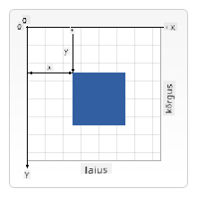

<!--
CO_OP_TRANSLATOR_METADATA:
{
  "original_hash": "056641280211e52fd0adb81b6058ec55",
  "translation_date": "2025-10-11T12:11:28+00:00",
  "source_file": "6-space-game/2-drawing-to-canvas/README.md",
  "language_code": "et"
}
-->
# Kosmosemängu loomine, osa 2: Kangelase ja koletiste joonistamine lõuendile

## Loengu-eelne viktoriin

[Loengu-eelne viktoriin](https://ff-quizzes.netlify.app/web/quiz/31)

## Lõuend

Lõuend on HTML-element, millel vaikimisi pole sisu; see on tühi leht. Sellele tuleb ise midagi joonistada.

✅ Loe [Canvas API kohta rohkem](https://developer.mozilla.org/docs/Web/API/Canvas_API) MDN-is.

Tavaliselt deklareeritakse see lehe keha osana järgmiselt:

```html
<canvas id="myCanvas" width="200" height="100"></canvas>
```

Ülal määrame `id`, `width` ja `height`.

- `id`: määrake see, et saaksite sellele viidata, kui peate sellega töötama.
- `width`: see on elemendi laius.
- `height`: see on elemendi kõrgus.

## Lihtgeomeetria joonistamine

Lõuend kasutab kartesiaanlikku koordinaatsüsteemi asjade joonistamiseks. Seega kasutatakse x-telge ja y-telge, et väljendada, kus miski asub. Asukoht `0,0` on vasak ülemine nurk ja parem alumine nurk vastab lõuendi määratud LAIUSELE ja KÕRGUSELE.


> Pilt [MDN-ist](https://developer.mozilla.org/docs/Web/API/Canvas_API/Tutorial/Drawing_shapes)

Lõuendile joonistamiseks tuleb järgida järgmisi samme:

1. **Hankige viide** lõuendi elemendile.
1. **Hankige viide** konteksti elemendile, mis asub lõuendi elemendil.
1. **Tehke joonistamisoperatsioon** konteksti elemendi abil.

Ülaltoodud sammude kood näeb tavaliselt välja selline:

```javascript
// draws a red rectangle
//1. get the canvas reference
canvas = document.getElementById("myCanvas");

//2. set the context to 2D to draw basic shapes
ctx = canvas.getContext("2d");

//3. fill it with the color red
ctx.fillStyle = 'red';

//4. and draw a rectangle with these parameters, setting location and size
ctx.fillRect(0,0, 200, 200) // x,y,width, height
```

✅ Canvas API keskendub peamiselt 2D-kujunditele, kuid veebilehele saab joonistada ka 3D-elemente; selleks võite kasutada [WebGL API-d](https://developer.mozilla.org/docs/Web/API/WebGL_API).

Canvas API abil saab joonistada mitmesuguseid asju, näiteks:

- **Geomeetrilised kujundid**, me juba näitasime, kuidas joonistada ristkülikut, kuid on palju muud, mida saab joonistada.
- **Tekst**, saate joonistada teksti mis tahes fondi ja värviga.
- **Pildid**, saate joonistada pilti, mis põhineb pildifailil, näiteks .jpg või .png.

✅ Proovi ise! Teate, kuidas joonistada ristkülikut, kas saate joonistada lehele ringi? Vaadake mõningaid huvitavaid Canvas joonistusi CodePenis. Siin on [eriti muljetavaldav näide](https://codepen.io/dissimulate/pen/KrAwx).

## Pildiressursi laadimine ja joonistamine

Pildiressurssi laadimiseks loote `Image` objekti ja määrate selle `src` atribuudi. Seejärel kuulate `load` sündmust, et teada saada, millal see on kasutamiseks valmis. Kood näeb välja selline:

### Ressursi laadimine

```javascript
const img = new Image();
img.src = 'path/to/my/image.png';
img.onload = () => {
  // image loaded and ready to be used
}
```

### Ressursi laadimise muster

Soovitatav on ülaltoodut mähkida konstruktsiooni, nagu allpool näidatud, et seda oleks lihtsam kasutada ja et prooviksite seda manipuleerida ainult siis, kui see on täielikult laaditud:

```javascript
function loadAsset(path) {
  return new Promise((resolve) => {
    const img = new Image();
    img.src = path;
    img.onload = () => {
      // image loaded and ready to be used
      resolve(img);
    }
  })
}

// use like so

async function run() {
  const heroImg = await loadAsset('hero.png')
  const monsterImg = await loadAsset('monster.png')
}

```

Mänguressursside ekraanile joonistamiseks näeks teie kood välja selline:

```javascript
async function run() {
  const heroImg = await loadAsset('hero.png')
  const monsterImg = await loadAsset('monster.png')

  canvas = document.getElementById("myCanvas");
  ctx = canvas.getContext("2d");
  ctx.drawImage(heroImg, canvas.width/2,canvas.height/2);
  ctx.drawImage(monsterImg, 0,0);
}
```

## Nüüd on aeg hakata oma mängu ehitama

### Mida ehitada

Loote veebilehe lõuendi elemendiga. See peaks kuvama musta ekraani `1024*768`. Oleme teile andnud kaks pilti:

- Kangelase laev

   

- 5*5 koletis

   

### Soovitatavad sammud arenduse alustamiseks

Leidke failid, mis on teie jaoks loodud kaustas `your-work`. See peaks sisaldama järgmist:

```bash
-| assets
  -| enemyShip.png
  -| player.png
-| index.html
-| app.js
-| package.json
```

Avage selle kausta koopia Visual Studio Code'is. Teil peaks olema seadistatud kohalik arenduskeskkond, eelistatavalt Visual Studio Code koos NPM-i ja Node'iga. Kui teil pole `npm` arvutis seadistatud, [siin on juhised selle tegemiseks](https://www.npmjs.com/get-npm).

Alustage oma projekti, navigeerides kausta `your_work`:

```bash
cd your-work
npm start
```

Ülaltoodud käivitab HTTP-serveri aadressil `http://localhost:5000`. Avage brauser ja sisestage see aadress. Praegu on see tühi leht, kuid see muutub.

> Märkus: ekraanil muudatuste nägemiseks värskendage brauserit.

### Koodi lisamine

Lisage vajalik kood faili `your-work/app.js`, et lahendada alljärgnev:

1. **Joonistage** lõuend musta taustaga
   > vihje: lisage kaks rida vastava TODO alla `/app.js` failis, määrates `ctx` elemendi mustaks ja ülemise/vasaku koordinaadi väärtuseks 0,0 ning kõrguse ja laiuse lõuendi mõõtmeteks.
2. **Laadige** tekstuurid
   > vihje: lisage mängija ja vaenlase pildid, kasutades `await loadTexture` ja edastades pildi tee. Te ei näe neid veel ekraanil!
3. **Joonistage** kangelane ekraani keskele alumises pooles
   > vihje: kasutage `drawImage` API-d, et joonistada heroImg ekraanile, määrates `canvas.width / 2 - 45` ja `canvas.height - canvas.height / 4)`;
4. **Joonistage** 5*5 koletised
   > vihje: nüüd saate ekraanile koletiste joonistamise koodi lahti kommenteerida. Järgmisena minge funktsiooni `createEnemies` ja täiendage seda.

   Kõigepealt seadistage mõned konstandid:

    ```javascript
    const MONSTER_TOTAL = 5;
    const MONSTER_WIDTH = MONSTER_TOTAL * 98;
    const START_X = (canvas.width - MONSTER_WIDTH) / 2;
    const STOP_X = START_X + MONSTER_WIDTH;
    ```

    seejärel looge tsükkel, et joonistada koletiste massiiv ekraanile:

    ```javascript
    for (let x = START_X; x < STOP_X; x += 98) {
        for (let y = 0; y < 50 * 5; y += 50) {
          ctx.drawImage(enemyImg, x, y);
        }
      }
    ```

## Tulemus

Valmis tulemus peaks välja nägema selline:


## Lahendus

Proovige kõigepealt ise lahendada, kuid kui jääte hätta, vaadake [lahendust](../../../../6-space-game/2-drawing-to-canvas/solution/app.js)

---

## 🚀 Väljakutse

Olete õppinud joonistama 2D-keskse Canvas API-ga; vaadake [WebGL API-d](https://developer.mozilla.org/docs/Web/API/WebGL_API) ja proovige joonistada 3D-objekt.

## Loengu-järgne viktoriin

[Loengu-järgne viktoriin](https://ff-quizzes.netlify.app/web/quiz/32)

## Ülevaade ja iseseisev õppimine

Õppige Canvas API kohta rohkem, [lugedes selle kohta](https://developer.mozilla.org/docs/Web/API/Canvas_API).

## Ülesanne

[Mängige Canvas API-ga](assignment.md)

---

**Lahtiütlus**:  
See dokument on tõlgitud, kasutades AI tõlketeenust [Co-op Translator](https://github.com/Azure/co-op-translator). Kuigi püüame tagada täpsust, palun arvestage, et automaatsed tõlked võivad sisaldada vigu või ebatäpsusi. Algne dokument selle algses keeles tuleks lugeda autoriteetseks allikaks. Olulise teabe puhul on soovitatav kasutada professionaalset inimtõlget. Me ei vastuta selle tõlke kasutamisest tulenevate arusaamatuste või valesti tõlgenduste eest.