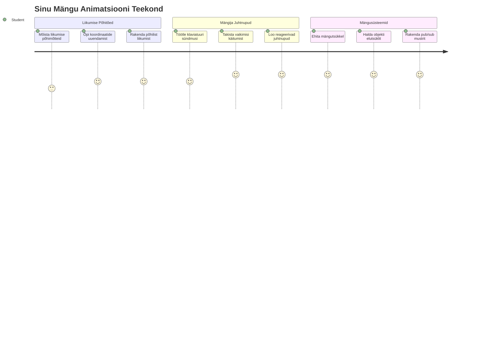
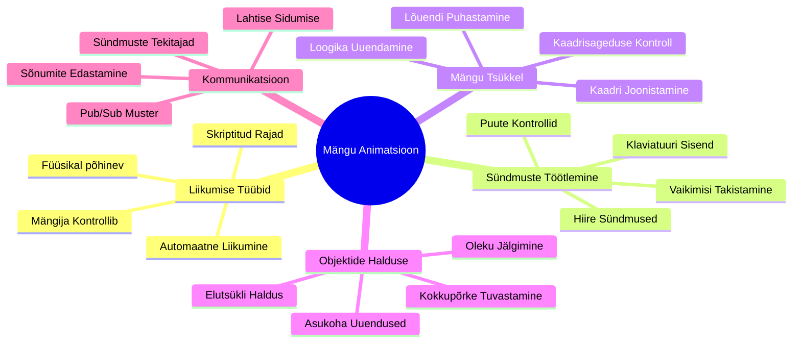
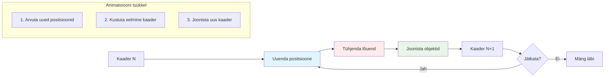
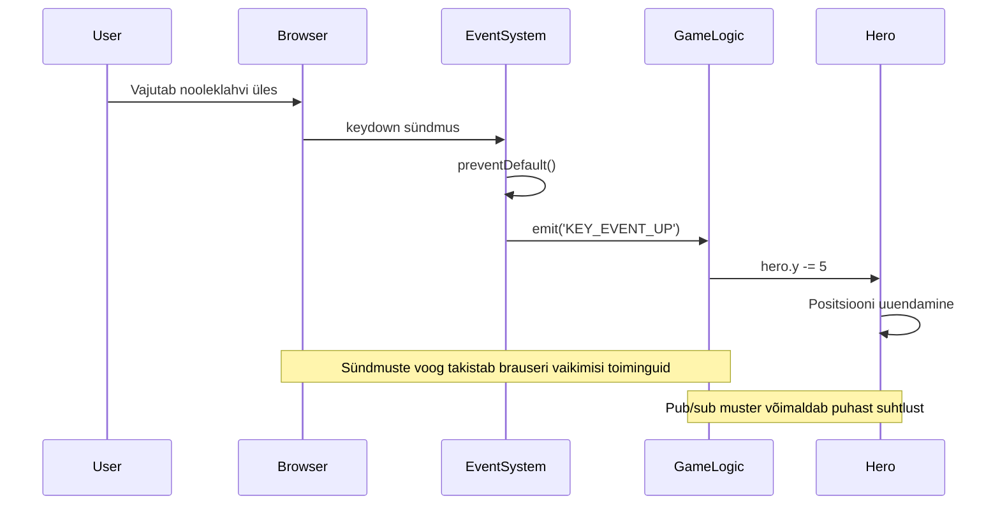
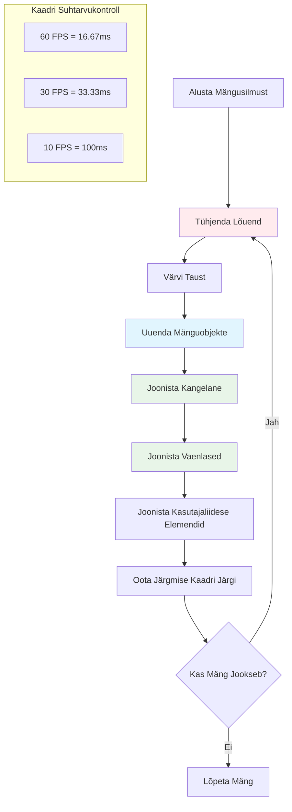
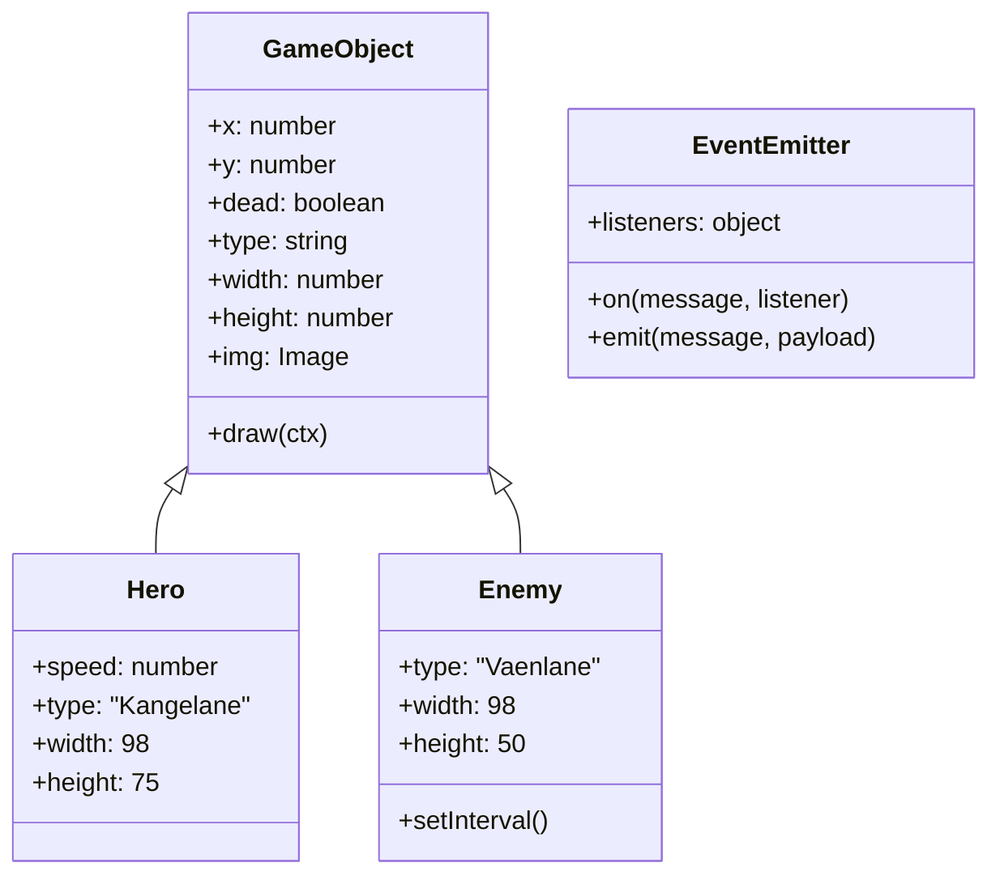
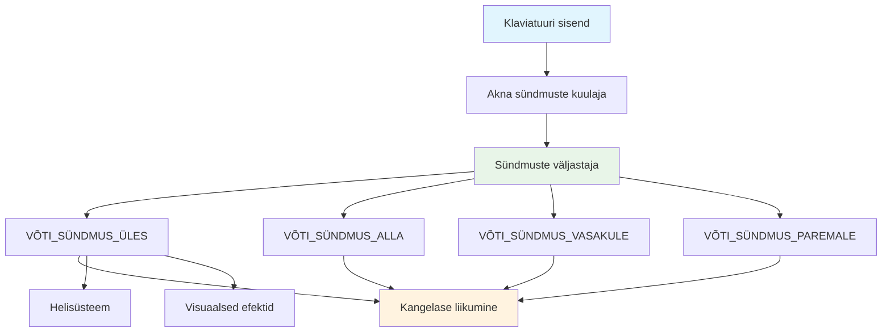
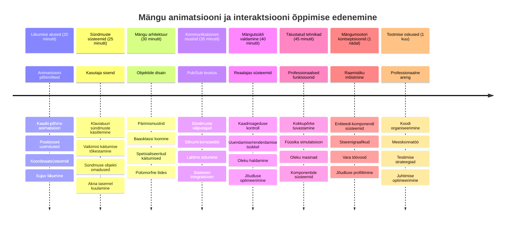

# Ruumu mängu loomine, 3. osa: liikumise lisamine


Mõtle oma lemmikmängudele – mis teeb neist kaasahaaravad, ei ole ainult ilusad graafika, vaid see, kuidas kõik liigub ja reageerib sinu tegevustele. Praegu on sinu ruumu mäng nagu ilus maal, aga me hakkame lisama liikumist, mis toob selle ellu.

Kui NASA insenerid programmeerisid Apollo missioonide juhtrauakompuutrit, seisid nad silmitsi sarnase väljakutsega: kuidas saada kosmoselaev reageerima piloodi sisendile, samal ajal automaatselt teed parandades? Täna õpitud põhimõtted kajastavad samu kontseptsioone – mängija juhitud liikumise ja automaatsete süsteemsete käitumiste juhtimist.

Selles õppetükis õpid, kuidas lasta kosmoselaevadel ekraanil sujuvalt libiseda, reageerida mängija käsklustele ja luua voolavaid liikumismustreid. Me jagame kõik kontseptsioonid hallatavateks osadeks, mis ehituvad üksteisele loomulikult peale.

Lõpuks lendavad mängijad oma kangelase laevaga ümber ekraani, samal ajal kui vaenlase laevad patrulleerivad üleval. Veelgi olulisem on see, et saad aru mängu liikumissüsteemide põhiprintsiipidest.


## Eelkursuse viktoriin

[Eelkursuse viktoriin](https://ff-quizzes.netlify.app/web/quiz/33)

## Mängu liikumise mõistmine

Mängud ärkavad ellu, kui asjad hakkavad ümberringi liikuma, ja põhimõtteliselt saab seda teha kahel moel:

- **Mängija juhitud liikumine**: Kui vajutad klahvi või klikid hiirega, liigub midagi. See on otsene side sinu ja mängumaailma vahel.
- **Automaatne liikumine**: Kui mäng otsustab ise midagi liigutada – näiteks need vaenlase laevad, mis peavad patrulleerima ekraani põhjal, olenemata sellest, kas sina midagi teed või mitte.

Arvutiekraanil objektide liigutamine on lihtsam, kui tundub. Mäletad x- ja y-koordinate matemaatikatunnist? Täpselt nendega me siin töötame. Kui Galileo jälgis 1610. aastal Jupiteri kuu tiiru, tegi ta sisuliselt sama – asukohtade plottimine aja jooksul liikumismustrite mõistmiseks.

Asjade liigutamine ekraanil on nagu flipbook animatsiooni loomine – tuleb järgida neid kolme lihtsat sammu:


1. **Uuenda asukohta** – muuda, kuhu su objekt peaks minema (näiteks liiguta seda 5 pikslit paremale)
2. **Kustuta vana joonis** – puhasta ekraan, et mitte näha kummitusradade järelmaid
3. **Joonista uus joonis** – pane oma objekt uude kohta

Tee seda piisavalt kiiresti ja boom! Sul on sujuv liikumine, mis tundub mängijatele loomulik.

Siin on, kuidas see võib koodis välja näha:

```javascript
// Määra kangelase asukoht
hero.x += 5;
// Puhasta ristkülik, kus kangelane asub
ctx.clearRect(0, 0, canvas.width, canvas.height);
// Joonista mängu taust ja kangelane uuesti
ctx.fillRect(0, 0, canvas.width, canvas.height);
ctx.fillStyle = "black";
ctx.drawImage(heroImg, hero.x, hero.y);
```

**Siin on, mida see kood teeb:**
- **Uuendab** kangelase x-koordinaati 5 piksliga, et liigutada horisontaalselt
- **Puhastab** kogu lõuendi ala, et eemaldada eelmine joonis
- **Täidab** lõuendi musta taustavärviga
- **Joonistab uuesti** kangelase pildi uues asukohas

✅ Kas suudad mõelda, miks kangelast mitu korda sekundis uuesti joonistades võib jõudlus kannatada? Loe [alternatiividest sellele mustrile](https://developer.mozilla.org/en-US/docs/Web/API/Canvas_API/Tutorial/Optimizing_canvas).

## Klaviatuuri sündmuste käsitlemine

Siin ühendame mängija sisendi mängu tegevusega. Kui keegi vajutab tühikuklahvi laseri tulistamiseks või nooleklahvi asteroidist põgenemiseks, peab mäng selle sisendi ära tundma ja reageerima.

Klaviatuuri sündmused toimuvad akna tasandil, mis tähendab, et kogu brauseriaken kuulab neid klahvivajutusi. Hiireklõpsud seevastu võidakse siduda spetsiifiliste elementidega (nt nupu klõps). Meie ruumumängus keskendume klaviatuurikontrollidele, sest need annavad mängijale traditsioonilise arcade tunde.

See meenutab mulle, kuidas 1800ndatel pidid telegraafi operaatorid morse-koodi tõlgendama mõtestatud sõnumiteks – me teeme midagi sarnast, tõlgime klahvivajutused mängukäsklusteks.

Sündmuse käsitlemiseks tuleb kasutada akna `addEventListener()` meetodit ja anda sellele kaks sisendparameetrit. Esimene parameeter on sündmuse nimi, näiteks `keyup`. Teine parameeter on funktsioon, mida kutsutakse, kui sündmus toimub.

Näide:

```javascript
window.addEventListener('keyup', (evt) => {
  // evt.key = võtme stringiesitus
  if (evt.key === 'ArrowUp') {
    // tee midagi
  }
});
```

**Lahti seletatud, mis siin juhtub:**
- **Kuulab** klaviatuuri sündmusi kogu aknas
- **Tabab** sündmuse objekti, mis sisaldab infot, millist klahvi vajutati
- **Kontrollib**, kas vajutatud klahv vastab kindlale klahvile (siin nooleklahv üles)
- **Täidab** koodi, kui tingimus on täidetud

Klahvi sündmuste puhul on sündmusel kaks omadust, mida saab kasutada, et näha, milline klahv vajutati:

- `key` – stringi kujul vajutatud klahv, näiteks `'ArrowUp'`
- `keyCode` – numbriline kujutis, näiteks `37`, mis vastab `ArrowLeft`-le

✅ Klahvi sündmuste manipuleerimine on kasulik ka väljaspool mängude arendust. Milliseid muid kasutusvõimalusi oskad selle tehnikaga seostada?


### Eriklahvid: hoiatus!

Mõned klahvid omavad brauseri sisseehitatud käitumisi, mis võivad segada sinu mängu. Nooleklahvid kerivad lehte ja tühikuklahv hüppab allapoole – käitumised, mida sa ei taha, kui keegi püüab oma kosmoselaeva juhtida.

Saame need vaikimisi käitumised ära keelata ja lasta mängul sisendit töödelda. See sarnaneb sellega, kuidas varased arvutiprograamijad pidid süsteemi katkestusi ülekirjutama spetsiaalsete käitumiste loomiseks – meie teeme seda lihtsalt brauseri tasandil. Näiteks:

```javascript
const onKeyDown = function (e) {
  console.log(e.keyCode);
  switch (e.keyCode) {
    case 37:
    case 39:
    case 38:
    case 40: // Nooleklahvid
    case 32:
      e.preventDefault();
      break; // Tühik
    default:
      break; // ära blokeeri teisi klahve
  }
};

window.addEventListener('keydown', onKeyDown);
```

**Seda vältimist selgitav kood:**
- **Kontrollib** spetsiifilisi klahvikoodid, mis võivad põhjustada soovimatut brauserikäitumist
- **Tõkestab** vaikimisi brauseritoimingud nooleklahvide ja tühiku puhul
- **Lubab** teistel klahvidel töötada tavapäraselt
- **Kasutab** `e.preventDefault()` brauseri vaikimisi käitumise peatamiseks

### 🔄 **Pedagoogiline kontrollpunkt**
**Sündmuste käsitlemise mõistmine**: Enne automaatse liikumise juurde liikumist veendu, et sa suudad:
- ✅ Selgitada vahet `keydown` ja `keyup` sündmuste vahel
- ✅ Mõista, miks me takistame vaikimisi brauserikäske
- ✅ Kirjeldada, kuidas sündmuse kuulajad seovad kasutaja sisendi mängu loogikaga
- ✅ Tuvastada, millised klahvid võivad segada mängujuhtimist

**Kiire enesekontroll**: Mis juhtub, kui sa ei takista nooleklahvide vaikimisi käitumist?
*Vastus: Brauser kerib lehte, segades mängu liikumist*

**Sündmussüsteemi arhitektuur**: Sa saad nüüd aru:
- **Aknatasandi kuulamine**: sündmuste tabamine brauseri tasandil
- **Sündmuse objekti omadused**: `key` stringid vs `keyCode` numbrid
- **Vaikimisi käitumise tõkestamine**: soovimatute brauseritoimingute peatamine
- **Tingimusloogika**: reageerimine kindlatele klahvikombinatsioonidele

## Mängu poolt põhjustatud liikumine

Räägime nüüd objektidest, mis liiguvad ilma mängija sisendita. Mõtle vaenlase laevadele, mis kruiisivad mööda ekraani, kuulidele, mis lendavad sirgjooneliselt, või pilvedele, mis taustal triivivad. See autonoomne liikumine paneb su mängumaailma elama isegi siis, kui keegi kontrollerit ei puutu.

Me kasutame JavaScripti sisseehitatud taimerit, et perioodiliselt positsioone uuendada. See kontseptsioon sarnaneb pendelkella tööpõhimõttega – regulaarne mehaanism, mis tekitab järjepidevaid, ajastatud toiminguid. Niimoodi see lihtne on:

```javascript
const id = setInterval(() => {
  // Move the enemy on the y axis
  enemy.y += 10;
}, 100);
```

**See liikumiskood teeb järgmist:**
- **Luuakse** taimer, mis töötab iga 100 millisekundi tagant
- **Uuendab** vaenlase y-koordinaati iga kord 10 pikslit
- **Salvestab** intervalli ID, et saaks vajadusel peatada
- **Liigutab** vaenlast automaatselt allapoole ekraanil

## Mängutsükkel

See on kontseptsioon, mis seob kõik kokku – mängutsükkel. Kui sinu mäng oleks film, siis mängutsükkel oleks filmiprojektor, mis näitab järjestikku kaadreid nii kiiresti, et kõik tundub sujuvalt liikuvat.

Iga mängus jookseb üks selline tsükkel taga. See on funktsioon, mis uuendab kõiki mänguobjekte, joonistab ekraani uuesti ja kordab seda. See hoiab silma peal kangelasel, kõigil vaenlastel, lendavatel laseritel – kogu mängu seisundil.

See kontseptsioon meenutab mulle, kuidas varased filmianimaatorid, näiteks Walt Disney, pidid tegelasi kaadri kaupa uuesti joonistama, et luua liikumise illusioon. Me teeme sama, aga koodiga, mitte pliiatsitega.

Siin on, kuidas tüüpiline mängutsükkel võib koodis välja näha:


```javascript
const gameLoopId = setInterval(() => {
  function gameLoop() {
    ctx.clearRect(0, 0, canvas.width, canvas.height);
    ctx.fillStyle = "black";
    ctx.fillRect(0, 0, canvas.width, canvas.height);
    drawHero();
    drawEnemies();
    drawStaticObjects();
  }
  gameLoop();
}, 200);
```

**Mängutsükli struktuuri mõistmine:**
- **Puhastab** kogu lõuendi, et eemaldada eelmine kaader
- **Täidab** tausta ühevärviliselt
- **Joonistab** kõik mänguobjektid nende praegustes asukohtades
- **Kordab** seda protsessi iga 200 millisekundi tagant, et luua sujuv animatsioon
- **Halda** kaadrisagedust intervallide ajastamisega

## Ruumu mängu jätkamine

Nüüd lisame liikumise staatilisele stseenile, mille varem viisid ellu. Muudame selle ekraanipildist interaktiivseks kogemuseks. Läbime samm-sammult kõik osad, et iga tükk ehiks loomulikult eelmisele peale.

Võta kood koos eelmisest õppetükist (või alusta värskelt [Part II- starter](../../../../6-space-game/3-moving-elements-around/your-work) kaustast, kui vajad algust).

**Täna ehitame välja:**
- **Kangelase juhtimine**: nooleklahvid juhivad sinu kosmoselaeva ümber ekraani
- **Vaenlaste liikumine**: need tulnukate laevad alustavad oma rünnakut

Alustame funktsioonide rakendamist.

## Soovitatud sammud

Leia faile, mis on loodud sinu jaoks `your-work` alamkaustas. Seal peaks olema järgmised:

```bash
-| assets
  -| enemyShip.png
  -| player.png
-| index.html
-| app.js
-| package.json
```

Alusta oma projekti `your-work` kaustas, tippides:

```bash
cd your-work
npm start
```

**Mis see käsk teeb:**
- **Navigeerib** sinu projekti kataloogi
- **Käivtab** HTTP serveri aadressil `http://localhost:5000`
- **Serverdab** sinu mängufailid, et saaksid neid brauseris testida

Ülaltoodud käsk käivitab HTTP serveri aadressil `http://localhost:5000`. Ava brauser ja sisesta see aadress, praegu peaksid nägema kangelast ja kõiki vaenlasi; aga liikumist veel ei toimu!

### Lisa kood

1. **Lisa eraldi objektid** `hero`, `enemy` ja `game object` jaoks, neil peaksid olema `x` ja `y` omadused. (Mäleta osa [Pärilus või kompositsioon](../README.md)).

   *NÕUANNE* `game object` peaks olema see, millel on `x` ja `y` ning võime lõpetada lõuendile joonistamist.

   > **Vihje**: Alusta uue `GameObject` klassi lisamisest koos alljärgneva konstruktoriga ja siis joonista see lõuendile:

    ```javascript
    class GameObject {
      constructor(x, y) {
        this.x = x;
        this.y = y;
        this.dead = false;
        this.type = "";
        this.width = 0;
        this.height = 0;
        this.img = undefined;
      }
    
      draw(ctx) {
        ctx.drawImage(this.img, this.x, this.y, this.width, this.height);
      }
    }
    ```

    **See baas klass teeb:**
    - **Määratleb** üldised omadused, mida kõik mänguobjektid jagavad (positsioon, suurus, pilt)
    - **Sisaldab** `dead` lippu, et jälgida, kas objekt tuleks eemaldada
    - **Pakku** `draw()` meetodi, mis joonistab objekti lõuendile
    - **Seab** vaikimisi väärtused kõigile omadustele, mida lapsklassid saavad üle kirjutada


    Nüüd laienda seda `GameObject`-i, et luua `Hero` ja `Enemy`:
    
    ```javascript
    class Hero extends GameObject {
      constructor(x, y) {
        super(x, y);
        this.width = 98;
        this.height = 75;
        this.type = "Hero";
        this.speed = 5;
      }
    }
    ```

    ```javascript
    class Enemy extends GameObject {
      constructor(x, y) {
        super(x, y);
        this.width = 98;
        this.height = 50;
        this.type = "Enemy";
        const id = setInterval(() => {
          if (this.y < canvas.height - this.height) {
            this.y += 5;
          } else {
            console.log('Stopped at', this.y);
            clearInterval(id);
          }
        }, 300);
      }
    }
    ```

    **Peamised mõisted nendes klassides:**
    - **Pärineb** `GameObject`-ist, kasutades `extends` märksõna
    - **Kutsub** vanema konstruktorit `super(x, y)` abil
    - **Seab** spetsiifilised mõõtmed ja omadused iga objekti tüübi jaoks
    - **Rakendab** automaatse liikumise vaenlastele, kasutades `setInterval()`

2. **Lisa klahvi sündmuste käitlejad**, mis juhivad kangelase liikumist üles/alla vasakule/paremale

   *MÄRKA*, et tegemist on kordinaatsüsteemiga, kus vasak ülemine nurgas on `(0,0)`. Ära unusta lisada koodi vaikimisi käitumise peatamiseks.

   > **Vihje**: Loo oma `onKeyDown` funktsioon ja seo see aknaga:

   ```javascript
   const onKeyDown = function (e) {
     console.log(e.keyCode);
     // Lisa ülaltoodud tunni kood vaikimisi käitumise peatamiseks
     switch (e.keyCode) {
       case 37:
       case 39:
       case 38:
       case 40: // Nooleklahvid
       case 32:
         e.preventDefault();
         break; // Tühik
       default:
         break; // ära blokeeri teisi klahve
     }
   };

   window.addEventListener("keydown", onKeyDown);
   ```
    
   **Mis see sündmuse käitleja teeb:**
   - **Kuulab** kogu aknale klahvivajutusi (keydown)
   - **Logib** klahvikoodi, et aidata siluda vajutatud klahve
   - **Tõkestab** brauseri vaikimisi käitumise nooleklahvide ja tühiku puhul
   - **Lubab** teistel klahvidel töötada tavaliselt
   
   Jälgi brauseri konsooli selle punkti juures ja vaata klahvivajutuste logisid.

3. **Rakenda** [Pub sub mustrit](../README.md), see hoiab su koodi puhtana järgnevate osade töötlemisel.

   Avaldamise-Tellimise (Publish-Subscribe) muster aitab organiseerida su koodi, eraldades sündmuste tabamise sündmuste käsitlemisest. See muudab su koodi modularsemaks ja kergemaks hooldada.

   Viimase sammu tegemiseks saad:

   1. **Lisada sündmuse kuulaja** aknale:

       ```javascript
       window.addEventListener("keyup", (evt) => {
         if (evt.key === "ArrowUp") {
           eventEmitter.emit(Messages.KEY_EVENT_UP);
         } else if (evt.key === "ArrowDown") {
           eventEmitter.emit(Messages.KEY_EVENT_DOWN);
         } else if (evt.key === "ArrowLeft") {
           eventEmitter.emit(Messages.KEY_EVENT_LEFT);
         } else if (evt.key === "ArrowRight") {
           eventEmitter.emit(Messages.KEY_EVENT_RIGHT);
         }
       });
       ```

   **See sündmussüsteem teeb:**
   - **Tabab** klaviatuuri sisendi ja muudab selle kohandatud mängusündmusteks
   - **Eraldab** sisendi tabamise mänguloogikast
   - **Lihtsustab** juhtimissüsteemide hilisemat muutmist, mõjutamata mängu koodi
   - **Lubab** mitmel süsteemil reageerida samale sisendile


   2. **Loo EventEmitter klass**, et sõnumeid avaldada ja tellida:

       ```javascript
       class EventEmitter {
         constructor() {
           this.listeners = {};
         }
       
         on(message, listener) {
           if (!this.listeners[message]) {
             this.listeners[message] = [];
           }
           this.listeners[message].push(listener);
         }
       
   3. **Lisa konstantid** ja sea üles EventEmitter:

       ```javascript
       const Messages = {
         KEY_EVENT_UP: "KEY_EVENT_UP",
         KEY_EVENT_DOWN: "KEY_EVENT_DOWN",
         KEY_EVENT_LEFT: "KEY_EVENT_LEFT",
         KEY_EVENT_RIGHT: "KEY_EVENT_RIGHT",
       };
       
       let heroImg, 
           enemyImg, 
           laserImg,
           canvas, ctx, 
           gameObjects = [], 
           hero, 
           eventEmitter = new EventEmitter();
       ```

   **Ülesseade mõistmine:**
   - **Määratleb** sõnumi konstantid, et vältida kirjavigu ja lihtsustada refaktoreerimist
   - **Deklaratsioonid** piltide, lõuendi konteksti ja mänguseisu jaoks
   - **Loob** globaalse sündmuste levitaja pub-sub süsteemile
   - **Initsialiseerib** massiivi, kuhu salvestatakse kõik mänguobjektid

   4. **Initsialiseeri mäng**

       ```javascript
       function initGame() {
         gameObjects = [];
         createEnemies();
         createHero();
       
         eventEmitter.on(Messages.KEY_EVENT_UP, () => {
           hero.y -= 5;
         });
       
         eventEmitter.on(Messages.KEY_EVENT_DOWN, () => {
           hero.y += 5;
         });
       
         eventEmitter.on(Messages.KEY_EVENT_LEFT, () => {
           hero.x -= 5;
         });
       
4. **Seadista mängutsükkel**

   Refaktoreeri `window.onload` funktsioon, et initsialiseerida mäng ja seadistada mängutsükkel sobival intervallil. Samuti lisad laserkiire:

    ```javascript
    window.onload = async () => {
      canvas = document.getElementById("canvas");
      ctx = canvas.getContext("2d");
      heroImg = await loadTexture("assets/player.png");
      enemyImg = await loadTexture("assets/enemyShip.png");
      laserImg = await loadTexture("assets/laserRed.png");
    
      initGame();
      const gameLoopId = setInterval(() => {
        ctx.clearRect(0, 0, canvas.width, canvas.height);
        ctx.fillStyle = "black";
        ctx.fillRect(0, 0, canvas.width, canvas.height);
        drawGameObjects(ctx);
      }, 100);
    };
    ```

   **Mängu seadistuse mõistmine:**
   - **Ootab**, kuni leht täielikult laeb enne algust
   - **Hangi** canvas-element ja selle 2D rendering-kontekst
   - **Laeb** kõik pildifailid asünkroonselt, kasutades `await`
   - **Käivitab** mängutsükli, mis töötab 100ms intervallidega (10 FPS)
   - **Puhastab** ja joonistab kogu ekraani iga kaadri järel uuesti

5. **Lisa kood** vaenlaste liigutamiseks kindlal intervallil

    Refaktoreeri `createEnemies()` funktsioon, et luua vaenlased ja lisada nad uude gameObjects klassi:

    ```javascript
    function createEnemies() {
      const MONSTER_TOTAL = 5;
      const MONSTER_WIDTH = MONSTER_TOTAL * 98;
      const START_X = (canvas.width - MONSTER_WIDTH) / 2;
      const STOP_X = START_X + MONSTER_WIDTH;
    
      for (let x = START_X; x < STOP_X; x += 98) {
        for (let y = 0; y < 50 * 5; y += 50) {
          const enemy = new Enemy(x, y);
          enemy.img = enemyImg;
          gameObjects.push(enemy);
        }
      }
    }
    ```

    **Mida vaenlaste loomine teeb:**
    - **Arvutab** positsioonid, et vaenlased oleksid ekraani keskel
    - **Loomise** vaenlaste võru, kasutades pesastatud silmuseid
    - **Määrab** iga vaenlase objektile vaenlase pildi
    - **Lisab** iga vaenlase globaalsesse mänguobjektide massiivi
    
    ja lisa `createHero()` funktsioon, mis teeb sarnase protsessi kangelase jaoks.
    
    ```javascript
    function createHero() {
      hero = new Hero(
        canvas.width / 2 - 45,
        canvas.height - canvas.height / 4
      );
      hero.img = heroImg;
      gameObjects.push(hero);
    }
    ```

    **Mida kangelase loomine teeb:**
    - **Paigutab** kangelase ekraani põhja keskele
    - **Määrab** kangelase objektile kangelase pildi
    - **Lisab** kangelase mänguobjektide massiivi kuvamiseks

    ja lõpuks lisa `drawGameObjects()` funktsioon, et alustada joonistamist:

    ```javascript
    function drawGameObjects(ctx) {
      gameObjects.forEach(go => go.draw(ctx));
    }
    ```

    **Joonistamisfunktsiooni mõistmine:**
    - **Käib läbi** kõik mänguobjektid massiivis
    - **Kutsutakse** iga objekti `draw()` meetodit
    - **Edastab** canvas-konteksti, et objektid saaksid ennast kuvada

    ### 🔄 **Õppe kontrollpunkt**
    **Terve mängusüsteemi mõistmine**: Kontrolli oma arusaamist kogu arhitektuurist:
    - ✅ Kuidas päranduvus võimaldab Hero ja Enemy jagada ühiseid GameObject omadusi?
    - ✅ Miks teeb pub/sub muster sinu koodi paremini hooldatavaks?
    - ✅ Millist rolli mängib mängutsükkel sujuva animatsiooni loomisel?
    - ✅ Kuidas seovad sündmuste kuularid kasutaja sisendi mänguobjektide käitumisega?

    **Süsteemi integratsioon**: Sinu mäng demonstreerib nüüd:
    - **Objektorienteeritud disaini**: Baasklassid spetsialiseeritud pärandusega
    - **Sündmuspõhist arhitektuuri**: Pub/sub muster lahtise sidumise jaoks
    - **Animatsiooniraamistikku**: Mängutsükkel koos järjepidevate kaadrid värskendustega
    - **Sisendi töötlemist**: Klaviatuuri sündmused koos vaikimisi käitumise tõkestamisega
    - **Varahalduse**: Piltide laadimine ja sprite'ide kuvamine

    **Professionaalsed mustrid**: Sa oled rakendanud:
    - **Huvide eraldamist**: Sisend, loogika ja kuvamine on eraldi
    - **Polümorfismi**: Kõik mänguobjektid jagavad ühist joonistamisliidest
    - **Sõnumite edastamist**: Puhtad suhtlusmeetodid komponentide vahel
    - **Ressursside haldamist**: Tõhus sprite'ide ja animatsioonide käsitlus

    Sinu vaenlased peaksid hakkama sinu kangelase kosmoselaeva poole liikuma!
      }
    }
    ```
    
    and add a `createHero()` function to do a similar process for the hero.
    
    ```javascript
    function createHero() {
      hero = new Hero(
        canvas.width / 2 - 45,
        canvas.height - canvas.height / 4
      );
      hero.img = heroImg;
      gameObjects.push(hero);
    }
    ```

    ja lõpuks lisa `drawGameObjects()` funktsioon, et alustada joonistamist:

    ```javascript
    function drawGameObjects(ctx) {
      gameObjects.forEach(go => go.draw(ctx));
    }
    ```

    Sinu vaenlased peaksid hakkama sinu kangelase kosmoselaeva poole liikuma!

---

## GitHub Copilot Agent Challenge 🚀

Siin on väljakutse, mis aitab sinu mängule lisada viimistlust: piirid ja sujuv juhtimine. Praegu võib su kangelane ekraanilt välja lennata ja liikumine võib tunduda katkendlik.

**Sinu ülesanne:** Tee oma kosmoselaev realistlikumaks, rakendades ekraani piire ja sujuvat liikumist. See on sarnane NASA lennujuhtimissüsteemidega, mis takistavad kosmoselaevadel ohutust ületada.

**Mida ehitada:** Loo süsteem, mis hoiab kangelase kosmoselaeva ekraanil ning teeb juhtimise sujuvaks. Kui mängija hoiab nooleklahvi all, peaks laev libisema pidevalt, mitte liigutama käikudena. Mõtle ka visuaalsele tagasisidele, kui laev jõuab piiridesse – näiteks õrn efekt, mis näitab mänguala serva.

Loe rohkem [agent mode](https://code.visualstudio.com/blogs/2025/02/24/introducing-copilot-agent-mode) kohta.

## 🚀 Väljakutse

Koodi organiseerimine muutub projektide kasvades järjest olulisemaks. Võib-olla oled märganud, et fail on täis funktsioone, muutujaid ja klasse segamini. See meenutab mulle, kuidas Apollo missiooni insenerid pidid looma selged ja hooldatavad süsteemid, mille kallal said korraga mitu meeskonda töötada.

**Sinu ülesanne:**
Mõtle nagu tarkvara arhitekt. Kuidas korraldaksid oma koodi nii, et kuue kuu pärast suudad sina või su tiimiliige sellest aru saada? Isegi kui kõik jääb ühte faili, võid paremini organiseerida:

- **Rühmitades omavahel seotud funktsioonid** selgete kommentaaridega päiste all
- **Eraldades huvide valdkonnad** - hoia mängulogiika eraldi kuvamisest
- **Kasuta järjepidevaid nimetamisstandardeid** muutujatele ja funktsioonidele
- **Loo mooduleid** või nimesid, et organiseerida erinevaid mängu aspekte
- **Lisa dokumentatsiooni**, mis selgitab iga suurema osa eesmärki

**Peegeldavad küsimused:**
- Millised osad sinu koodist on raskemini mõistetavad, kui nendega hiljem uuesti tegeleda?
- Kuidas korraldada oma koodi, et keegi teine saaks hõlpsamalt panustada?
- Mida juhtuks, kui tahaksid lisada uusi funktsioone nagu lisa-tugevdused või erinevat tüüpi vaenlased?

## Post-Loengu Test

[Post-loengu test](https://ff-quizzes.netlify.app/web/quiz/34)

## Ülevaade & Iset õppimine

Oleme ehitanud kõike nullist, mis on suurepärane õppimiseks, aga siin on väike saladus – olemas on imelisi JavaScripti raamistikke, mis saavad sinu eest palju rasket tööd ära teha. Kui tunned end põhitõdede osas kindlamalt, tasub [uurida, mis saadaval on](https://github.com/collections/javascript-game-engines).

Raamistikud on nagu hästi varustatud tööriistakast, mitte iga tööriista käsitsi valmistamine. Nad lahendavad palju organiseerimisprobleeme ja pakuvad funktsioone, mis muidu võtaksid nädalaid enda kirjutada.

**Tähtsad uurimisteemad:**
- Kuidas mängumootorid korrastavad koodi – oled üllatunud nutikate mustrite üle
- Jõudluse nipid, kuidas teha canvas-mängud sujuvaks  
- Uued JavaScripti võimalused, mis muudavad koodi puhtamaks ja paremini hooldatavaks
- Erinevad meetodid mänguobjektide ja nende suhete haldamiseks

## 🎯 Sinu Mängu Animatsiooni Meistriklassi Ajakava


### 🛠️ Sinu mänguarenduse tööriistakomplekti kokkuvõte

Pärast selle õppetüki lõpetamist oled valdanud:
- **Animatsiooni põhimõtted**: Kaadripõhine liikumine ja sujuvad üleminekud
- **Sündmustepõhine programmeerimine**: Klaviatuurisisendi töötlemine koos õigete sündmuste haldamistega
- **Objektorienteeritud disain**: Päranduva hierarhia ja polümorfsete liideste kasutamine
- **Suhtlusmustrid**: Pub/sub arhitektuur hooldatava koodi jaoks
- **Mängutsükli arhitektuur**: Reaalaegne uuendus- ja kuvamistsüklid
- **Sisendsüsteemid**: Kasutaja juhtimise kaardistamine koos vaikimisi käitumise tõkestamisega
- **Varahalduse**: Sprite'ide laadimine ja tõhus kuvamine

### ⚡ **Mida saad teha järgmise 5 minutiga**
- [ ] Ava brauseri konsool ja proovi `addEventListener('keydown', console.log)`, et näha klaviatuuri sündmusi
- [ ] Loo lihtne div-element ja liiguta seda nooleklahvidega
- [ ] Katseta `setInterval` abil pideva liikumise loomist
- [ ] Proovi sündmuse vaikimisi käitumise tõkestamist `event.preventDefault()` abil

### 🎯 **Mida saad selle tunni jooksul saavutada**
- [ ] Lõpeta post-loengu test ja mõista sündmustepõhist programmeerimist
- [ ] Ehita liikuv kangelase kosmoselaev täis klaviatuurijuhtimisega
- [ ] Rakenda sujuvat vaenlaste liikumismustrit
- [ ] Lisa piirid, mis takistavad mänguobjektide ekraanilt väljumist
- [ ] Loo põhjalik kokkupõrke tuvastus mänguobjektide vahel

### 📅 **Sinu nädala pikkune animatsioonireis**
- [ ] Lõpeta täielik kosmose-mäng koos lihvitud liikumise ja interaktsioonidega
- [ ] Lisa keerukad liikumismustrid nagu kõverad, kiirendus ja füüsika
- [ ] Rakenda sujuvad üleminekud ja aeglustamise funktsioonid
- [ ] Loo osakeseefektid ja visuaalse tagasiside süsteemid
- [ ] Optimeeri mängu jõudlust sujuvaks 60fps mängimiseks
- [ ] Lisa mobiilseadmete puutejuhtimine ja reageeriv disain

### 🌟 **Sinu kuu pikkune interaktiivne areng**
- [ ] Ehita keerukaid interaktiivseid rakendusi koos arenenud animatsioonisüsteemidega
- [ ] Õpi animatsiooniraamatukogusid nagu GSAP või loo oma animatsioonimootor
- [ ] Panusta avatud lähtekoodiga mänguarenduse ja animatsiooniprojektidesse
- [ ] Saavuta jõudluse optimeerimine graafikamahukate rakenduste jaoks
- [ ] Loo hariduslikku materjali mänguarenduse ja animatsiooni teemadel
- [ ] Koosta portfoolio, mis demonstreerib arenenud interaktiivse programmeerimise oskusi

**Reaalse maailma rakendused**: sinu mänguanimatsiooni oskused kehtivad otseselt:
- **Interaktiivsed veebirakendused**: dünaamilised juhtpaneelid ja reaalaja liidesed
- **Andmete visualiseerimine**: animeeritud diagrammid ja interaktiivsed graafikud
- **Hariduslik tarkvara**: interaktiivsed simulatsioonid ja õppevahendid
- **Mobiiliarendus**: puutepõhised mängud ja žestide töötlemine
- **Töölauarakendused**: Electron rakendused sujuvate animatsioonidega
- **Veebi animatsioonid**: CSS ja JavaScripti animatsiooniraamatukogud

**Sinu poolt omandatud professionaalsed oskused**:
- **Arhitekteeri** sündmustepõhiseid süsteeme, mis kasvavad koos keerukusega
- **Rakenda** sujuvaid animatsioone matemaatiliste põhimõtete abil
- **Veadi** keerukaid interaktsioonisüsteeme brauseri arendajatööriistade abil
- **Optimeeri** mängu jõudlust erinevate seadmete ja brauserite jaoks
- **Kujunda** hooldatavaid koodistruktuure tõestatud mustritega

**Mänguarenduse kontseptsioonide valdamine**:
- **Kaadritiheduse juhtimine**: FPS ja ajastuse kontrolli mõistmine
- **Sisendi töötlemine**: platvormideülene klaviatuuri ja sündmuste süsteem
- **Objektide elutsükkel**: loomine, uuendamine ja hävitamise mustrid
- **Seisundi sünkroniseerimine**: mänguseisundi järjepidevus kaadrite vahel
- **Sündmusarhitektuur**: sidumata suhtlus mängusüsteemide vahel

**Järgmine tase**: oled valmis lisama kokkupõrke tuvastust, punktisüsteemi, heliefekte või uurima kaasaegseid mänguraamistikke nagu Phaser või Three.js!

🌟 **Saavutuse saavutamine**: oled loonud täieliku interaktiivse mängusüsteemi professionaalsete arhitektuurimustritega!

## Kodune ülesanne

[Kommenteeri oma koodi](assignment.md)

---

<!-- CO-OP TRANSLATOR DISCLAIMER START -->
**Vastutusest loobumine**:
See dokument on tõlgitud kasutades tehisintellektil põhinevat tõlketeenust [Co-op Translator](https://github.com/Azure/co-op-translator). Kuigi püüame tagada täpsust, palun arvestage, et automaatsed tõlked võivad sisaldada vigu või ebatäpsusi. Originaaldokument selle emakeeles tuleb pidada autoriteetseks allikaks. Olulise teabe puhul soovitatakse kasutada professionaalset inimtõlget. Me ei vastuta selle tõlkega kaasnevate arusaamatuste või valesti mõistmiste eest.
<!-- CO-OP TRANSLATOR DISCLAIMER END -->