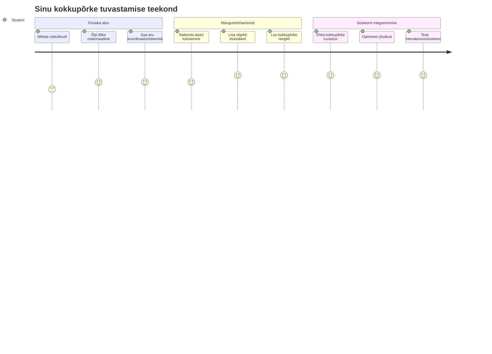
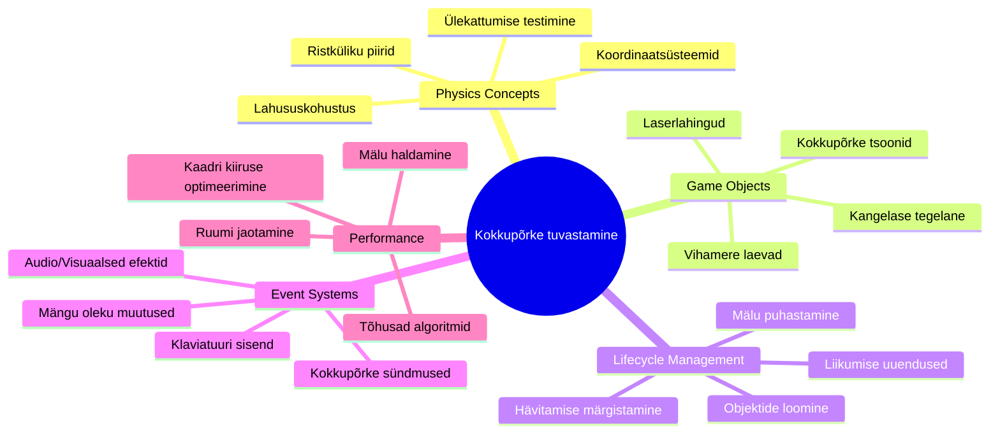
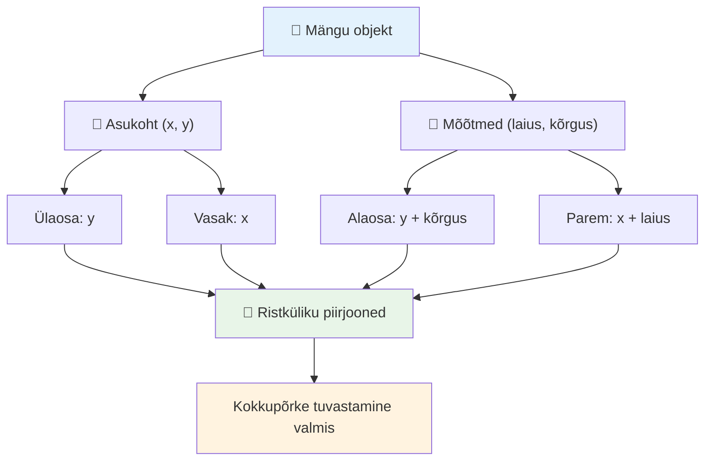
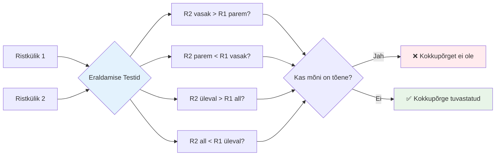
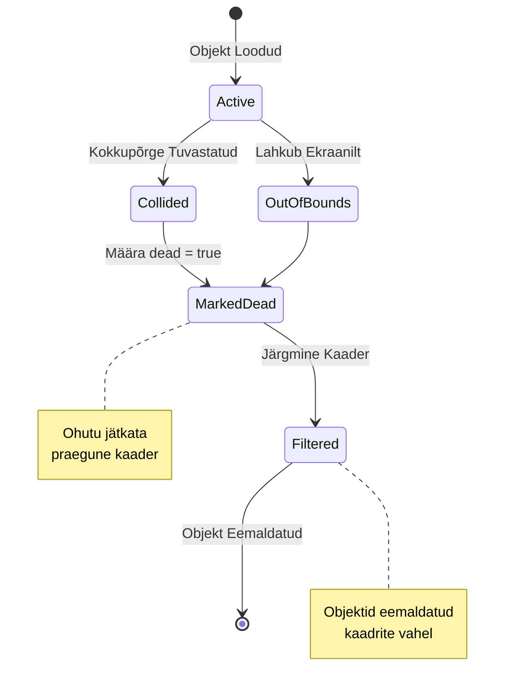
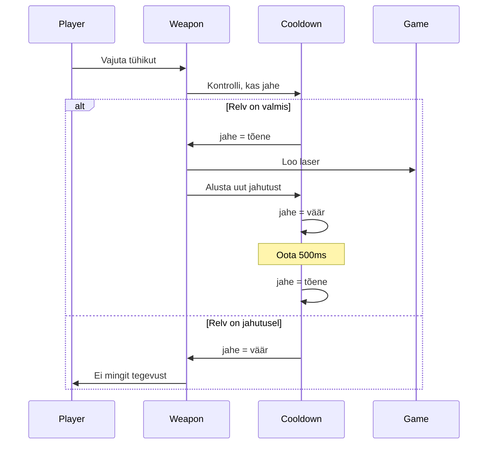
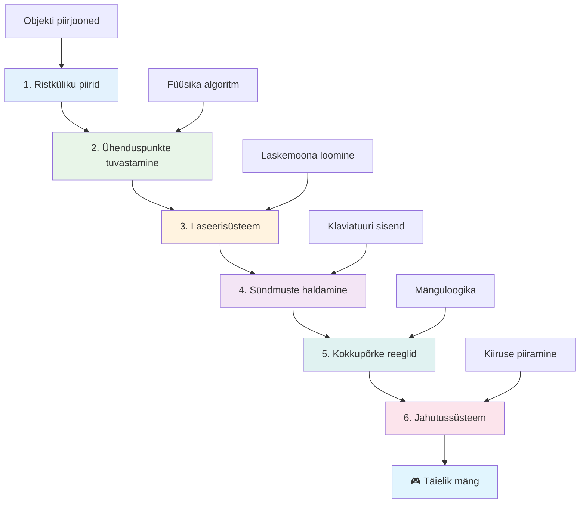
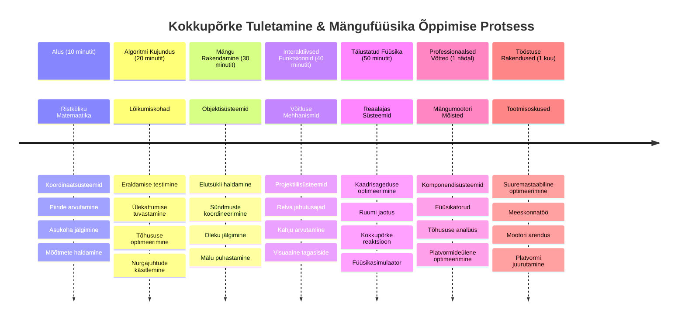

<!--
CO_OP_TRANSLATOR_METADATA:
{
  "original_hash": "039b4d8ce65f5edd82cf48d9c3e6728c",
  "translation_date": "2026-01-08T09:06:08+00:00",
  "source_file": "6-space-game/4-collision-detection/README.md",
  "language_code": "et"
}
-->
# Ehita kosmose mäng osa 4: Laserite lisamine ja kokkupõrgete tuvastamine


## Eel-loengu viktoriin

[Eel-loengu viktoriin](https://ff-quizzes.netlify.app/web/quiz/35)

Mõtle hetk Star Warsist, kui Luke'i prootonitorpeedod tabasid Surmatähe väljalaskesuuna avaust. See täpne kokkupõrgete tuvastus muutis galaktika saatust! Mängudes töötab kokkupõrgete tuvastus samamoodi – see määrab, millal objektid suhtlevad ja mis edasi juhtub.

Selles õppetükis lisad oma kosmosemängule laserrelvad ja rakendad kokkupõrgete tuvastust. Nagu NASA missiooni planeerijad arvutavad kosmoseaparaatide trajektoore, et vältida kosmoseprügi, õpid sa tuvastama, millal mänguobjektid üksteisega ristuvad. Jagame selle hallatavateks sammudeks, mis ehitavad üksteisele tuginedes edasi.

Lõpetuseks on sul toimiv lahingusüsteem, kus laserid hävitavad vaenlasi ja kokkupõrked käivitavad mängusündmusi. Samad kokkupõrdepõhimõtted kehtivad kõikjal alates füüsikatehnikatest kuni interaktiivsete veebiliideste jahtumiseni.


✅ Tee väike uurimistöö ajaloo esimese arvutimängu kohta. Milline oli selle funktsionaalsus?

## Kokkupõrgete tuvastamine

Kokkupõrgete tuvastamine töötab nagu Apollo kuuülemineku mooduli lähedussensorid – see kontrollib pidevalt kauguseid ja annab hoiatuse, kui objektid liiga lähedale satuvad. Mängudes määrab see süsteem, millal objektid omavahel suhtlevad ja mis järgmiseks juhtub.

Me kasutame lähenemist, kus iga mänguobjekt käsitletakse ristkülikuna, sarnaselt lennuliikluse kontrollisüsteemidega, mis kasutavad lihtsustatud geomeetrilisi kujundeid lennukite jälgimiseks. See ristküliku meetod võib tunduda lihtsana, kuid on arvutuslikult efektiivne ja sobib hästi enamiku mängustsenaariumide jaoks.

### Ristküliku esitus

Iga mänguobjektil peab olema koordinaatidega piire, nagu Marsi Pathfinder rover määras oma asukoha Marsi pinnal. Siin on, kuidas me defineerime need piirikoordinaadid:


```javascript
rectFromGameObject() {
  return {
    top: this.y,
    left: this.x,
    bottom: this.y + this.height,
    right: this.x + this.width
  }
}
```

**Selgitus:**
- **Ülemine serv**: See on objekti vertikaalne alguskoht (tema y positsioon)
- **Vasak serv**: Kus see horisontaalselt algab (tema x positsioon)
- **Alumine serv**: Liidad kõrguse y positsioonile - nüüd tead, kus see lõpeb!
- **Parem serv**: Liidad laiuse x positsioonile - ja sul on piiri täpne asukoht

### Ühistamise algoritm

Ristkülikute ristumise tuvastus kasutab loogikat, mis on sarnane Hubble'i kosmoseteleskoobi meetodile, kuidas see kindlaks teeb taevakehade kattumise vaateväljas. Algoritm kontrollib eraldatust:


```javascript
function intersectRect(r1, r2) {
  return !(r2.left > r1.right ||
    r2.right < r1.left ||
    r2.top > r1.bottom ||
    r2.bottom < r1.top);
}
```

**Eraldamise test töötab nagu radarisüsteemid:**
- Kas ristkülik 2 on täiesti ristkülikust 1 paremal?
- Kas ristkülik 2 on täiesti ristkülikust 1 vasakul?
- Kas ristkülik 2 on täiesti ristkülikust 1 all?
- Kas ristkülik 2 on täiesti ristkülikust 1 üleval?

Kui ükski nendest tingimustest ei kehti, peavad ristkülikud kattuma. See lähenemine peegeldab seda, kuidas radarioperaatorid määravad, kas kaks lennukit on ohutult eraldatud.

## Objektide elutsükli haldamine

Kui laser tabab vaenlast, tuleb mõlemad objektid mängust eemaldada. Kuid objektide kustutamine silmuse keskel võib põhjustada süsteemi jäätumist – raske õppetund varajastest arvutisüsteemidest nagu Apollo juhitarkvara puhul. Selle asemel kasutame "märgi kustutamiseks" meetodit, mis eemaldab objektid ohutult kaadrite vahel.


Nii märgime midagi eemaldamiseks:

```javascript
// Märgi objekt eemaldamiseks
enemy.dead = true;
```

**Miks see töötab:**
- Märgime objekti kui "surnud", kuid ei kustuta kohe
- See laseb praegusel mängukaadril ohutult lõpuni saada
- Ei teki tõrkeid, sest ei kasutata enam olemasolematut!

Siis filtreerime märgitud objektid välja enne järgmist joonistamistsüklit:

```javascript
gameObjects = gameObjects.filter(go => !go.dead);
```

**Mida see filtreerimine teeb:**
- Loob värske objektilisti ainult "elavate" objektidega
- Eemaldab kõik, mis on märgitud surnuks
- Hoiab mängu sujuvalt käimas
- Vältab mäluprobleeme, mis tekivad hävinenud objektide kuhjumisel

## Laseri mehaanika rakendamine

Lasertorpeedod mängudes töötavad samal põhimõttel nagu Star Treki footonitorpeedod – need on üksikud objektid, mis liiguvad sirgjooneliselt, kuni tabavad midagi. Iga tühiku vajutamine loob uue laserobjekti, mis liigub ekraanil.

Selle toimimiseks peame koordineerima mitu erinevat osa:

**Põhilised komponendid rakendamiseks:**
- **Loo** laserobjektid, mis tekivad kangelase asukohast
- **Käsitle** klaviatuuri sisendit, mis käivitab laseri loomise
- **Halda** laseri liikumist ja elutsüklit
- **Rakenda** laseri visuaalne kujutus

## Tulistamise kiiruse kontrolli rakendamine

Piiramatu tulistamiskiirus koormaks mängumootorit ja muudaks mängimise liiga lihtsaks. Tõelised relvasüsteemid silmitsi samade piirangutega – isegi USS Enterprise'i lasereid tuli vahel laadida.

Rakendame jahutusaja süsteemi, mis takistab kiirspämmimist, säilitades samal ajal reageerimisvõime:


```javascript
class Cooldown {
  constructor(time) {
    this.cool = false;
    setTimeout(() => {
      this.cool = true;
    }, time);
  }
}

class Weapon {
  constructor() {
    this.cooldown = null;
  }
  
  fire() {
    if (!this.cooldown || this.cooldown.cool) {
      // Loo laseri lask
      this.cooldown = new Cooldown(500);
    } else {
      // Relv on veel jahtumas
    }
  }
}
```

**Kuidas jahutusaeg töötab:**
- Loomise hetkel on relv “kuum” (ei saa veel tulistada)
- Pärast tähtaega muutub relv “jahtunuks” (valmis tulistamiseks)
- Tulistamise eel kontrollime: “Kas relv on jahtunud?”
- See takistab spämmi, hoides samal ajal kontrollid reageerivad

✅ Vaata meelde äratamiseks esimese osa ruumi mängu sarjast jahutusaegade kohta.

## Kokkupõrkesüsteemi loomine

Laiendad oma olemasolevat kosmosemängu koodi, et luua kokkupõrgete tuvastamise süsteem. Nagu Rahvusvahelise Kosmosejaama automaatne kokkupõrgete vältimise süsteem, jälgib sinu mäng pidevalt objektide asukohti ja reageerib ristumistele.

Varasema õppetüki koodist alates lisad kokkupõrgete tuvastamise koos konkreetsete reeglitega, mis juhivad objektide omavahelist suhtlust.

> 💡 **Proftiip**: Laseri pilt on juba su vara kaustas olemas ja koodis viidatud, valmis kasutamiseks.

### Rakendatavad kokkupõrkeseadused

**Mängu mehhanismid lisamiseks:**
1. **Laser tabab vaenlast**: Vaenlane hävitatakse, kui teda laser tabab
2. **Laser tabab ekraani piiri**: Laser eemaldatakse, kui see jõuab ekraani ülemisse serva
3. **Vaenlane ja kangelane põrkuvad**: Mõlemad objektid hävitatakse ristumisel
4. **Vaenlane jõuab alla**: Mäng läbi tingimus, kui vaenlased jõuavad ekraani alla

### 🔄 **Pedagoogiline kontroll**
**Kokkupõrgete tuvastamise alused**: Enne rakendamist veendu, et sa mõistad:
- ✅ Kuidas ristküliku piirid defineerivad kokkupõrke tsoone
- ✅ Miks eraldamise testimine on tõhusam kui ristumise arvutamine
- ✅ Kuidas objektide elutsükli haldamine mängutsüklis on oluline
- ✅ Kuidas sündmuspõhine süsteem koordineerib kokkupõrgete reageerimisi

**Kiire enesehindamine**: Mis juhtuks, kui kustutaksid objekte koheselt märkimise asemel?
*Vastus: Silmuse keskel kustutamine võib põhjustada tõrkeid või jätta mõned objektid vahele*

**Füüsikateadmised**: Sa nüüd mõistad:
- **Koordinaatsüsteeme**: Kuidas asukoht ja mõõtmed loovad piire
- **Ristumise loogikat**: Matemaatilisi põhimõtteid kokkupõrgete tuvastamiseks
- **Jõudluse optimeerimist**: Miks tõhusad algoritmid on reaalajas kasutamiseks olulised
- **Mäluhaldust**: Ohutuid objekti elutsükli mustreid stabiilsuse tagamiseks

## Arenduskeskkonna seadistamine

Hea uudis – enamus alustööd on juba tehtud! Kõik sinu mängu varad ja põhistruktuurid asuvad alamkaustas `your-work`, valmis lahedaid kokkupõrke funktsioone lisama.

### Projekti struktuur

```bash
-| assets
  -| enemyShip.png
  -| player.png
  -| laserRed.png
-| index.html
-| app.js
-| package.json
```

**Failistruktuuri mõistmine:**
- **Sisaldab** kõiki sprite-pilte, mida mänguobjektid vajavad
- **Sisaldab** põhidokumente HTML ja JavaScript rakendust
- **Pakub** pakettide konfiguratsiooni kohaliku arenduserveri jaoks

### Arenduserveri käivitamine

Mine oma projekti kausta ja alusta kohalikku serverit:

```bash
cd your-work
npm start
```

**See käskude jada:**
- **Vahetab** töökaustaks sinu projektikausta
- **Käivitab** kohalikku HTTP-serverit aadressil `http://localhost:5000`
- **Teenindab** sinu mängufailid testimiseks ja arendamiseks
- **Võimaldab** reaalajas arendust automaatse taaskäivitusega

Ava oma brauser ja mine aadressile `http://localhost:5000`, et näha, kuidas sinu praegune mäng olukorras on, kus kangelane ja vaenlased on ekraanil.

### Samm-sammuline rakendamine

Nagu NASA süsteemne lähenemine Voyageri kosmosesondi programmeerimisel, viime kokku põrgete tuvastuse samm-sammult ellu.


#### 1. Lisa ristkülikute kokkupõrke piirid

Õpeta esmalt mänguobjektidele, kuidas oma piire kirjeldada. Lisa see meetod oma `GameObject` klassi:

```javascript
rectFromGameObject() {
    return {
      top: this.y,
      left: this.x,
      bottom: this.y + this.height,
      right: this.x + this.width,
    };
  }
```

**See meetod teeb:**
- **Luuakse** ristküliku objekt täpsete piiri koordinatsioonidega
- **Arvutatakse** alumine ja parem serv positsiooni ja mõõtmete baasil
- **Tagastatakse** objekt valmis kokkupõrke algoritmidena kasutamiseks
- **Pakutakse** standardiseeritud liidest kõigile mänguobjektidele

#### 2. Rakenda ristumiste tuvastamine

Loo nüüd kokkupõrkerakurdi detektiiv – funktsioon, mis ütleb, millal kaks ristkülikut ristuvad:

```javascript
function intersectRect(r1, r2) {
  return !(
    r2.left > r1.right ||
    r2.right < r1.left ||
    r2.top > r1.bottom ||
    r2.bottom < r1.top
  );
}
```

**See algoritm töötab nii:**
- **Testib** nelja eraldamise tingimust ristkülikute vahel
- **Tagastab** `false`, kui ükski eraldustingimus on tõene
- **Näitab** kokkupõrget, kui eraldust pole
- **Kasutab** eituse loogikat efektiivseks ristumise testimiseks

#### 3. Rakenda laseri tulistamissüsteem

Siin läheb põnevaks! Seadistame laseri tulistamissüsteemi.

##### Sõnumikonstandid

Esmalt defineerime mõned sõnumitüübid, et erinevad mängu osad saaksid üksteisega suhelda:

```javascript
KEY_EVENT_SPACE: "KEY_EVENT_SPACE",
COLLISION_ENEMY_LASER: "COLLISION_ENEMY_LASER",
COLLISION_ENEMY_HERO: "COLLISION_ENEMY_HERO",
```

**Need konstandid pakuvad:**
- **Standardiseerivad** sündmuste nimetusi rakenduses
- **Võimaldavad** järjepidevat suhtlust mängusüsteemide vahel
- **Vältida** trükivigu sündmuste registreerimisel

##### Klaviatuuri sisendi käitlemine

Lisa tühiku klahvi avastamine ürituste kuulajasse:

```javascript
} else if(evt.keyCode === 32) {
  eventEmitter.emit(Messages.KEY_EVENT_SPACE);
}
```

**See sisendikäitleja:**
- **Tuvastab** tühiku klahvi vajutamise koodiga 32
- **Saadab** standardiseeritud sündmuse sõnumi
- **Võimaldab** lahtise seotud tulistamisloogikat

##### Sündmuste kuulaja seadistamine

Registreeri tulistamiskäitumine oma `initGame()` funktsioonis:

```javascript
eventEmitter.on(Messages.KEY_EVENT_SPACE, () => {
 if (hero.canFire()) {
   hero.fire();
 }
});
```

**See sündmuste kuulaja:**
- **Reageerib** tühiku klahvi sündmustele
- **Kontrollib** tulistamise jahutust
- **Käivitab** laseri loomise, kui lubatud

Lisa kokkupõrgete käitlemine laser-vaenlase vastasseisus:

```javascript
eventEmitter.on(Messages.COLLISION_ENEMY_LASER, (_, { first, second }) => {
  first.dead = true;
  second.dead = true;
});
```

**See kokkupõrke käitleja:**
- **Saab** kokkupõrkejõude mõlema objekti kohta
- **Märgib** mõlemad objektid eemaldamiseks
- **Tagab** nõuetekohase puhastuse pärast kokkupõrget

#### 4. Loo Laser klass

Rakenda laserprojektile, mis liigub ülespoole ja haldab oma elutsüklit:

```javascript
class Laser extends GameObject {
  constructor(x, y) {
    super(x, y);
    this.width = 9;
    this.height = 33;
    this.type = 'Laser';
    this.img = laserImg;
    
    let id = setInterval(() => {
      if (this.y > 0) {
        this.y -= 15;
      } else {
        this.dead = true;
        clearInterval(id);
      }
    }, 100);
  }
}
```

**See klassi rakendus:**
- **Pikendab** GameObjecti, pärides põhifunktsionaalsuse
- **Seab** laseri sprite sobivad mõõtmed
- **Loo automaatse liikumise ülespoole `setInterval()` abil**
- **Haldab** enesehävitamist, kui jõuab ekraani ülemisse ossa
- **Jälgib** oma animatsiooni ajastamist ja puhastust

#### 5. Rakenda kokkupõrgete tuvastussüsteem

Loo põhjalik kokkupõrgete tuvastamise funktsioon:

```javascript
function updateGameObjects() {
  const enemies = gameObjects.filter(go => go.type === 'Enemy');
  const lasers = gameObjects.filter(go => go.type === "Laser");
  
  // Testi laseri ja vaenlase kokkupõrkeid
  lasers.forEach((laser) => {
    enemies.forEach((enemy) => {
      if (intersectRect(laser.rectFromGameObject(), enemy.rectFromGameObject())) {
        eventEmitter.emit(Messages.COLLISION_ENEMY_LASER, {
          first: laser,
          second: enemy,
        });
      }
    });
  });

  // Eemalda hävitatud objektid
  gameObjects = gameObjects.filter(go => !go.dead);
}
```

**See kokkupõrkesüsteem:**
- **Filtreerib** mänguobjektid tüübi järgi efektiivseks testimiseks
- **Testib** iga laseri kõigi vaenlastega ristumisi
- **Saadab välja** kokkupõrke sündmusi, kui ristumised esinevad
- **Puhastab** hävinenud objektid pärast kokkupõrgete töötlemist

> ⚠️ **Oluline**: Lisa `updateGameObjects()` oma põhimängu tsüklisse `window.onload` sees, et lubada kokkupõrgete tuvastust.

#### 6. Lisa jahutussüsteem Hero klassi

Täienda kangelase klassi tulistamise mehhanismi ja kiiruse piiramisega:

```javascript
class Hero extends GameObject {
  constructor(x, y) {
    super(x, y);
    this.width = 99;
    this.height = 75;
    this.type = "Hero";
    this.speed = { x: 0, y: 0 };
    this.cooldown = 0;
  }
  
  fire() {
    gameObjects.push(new Laser(this.x + 45, this.y - 10));
    this.cooldown = 500;

    let id = setInterval(() => {
      if (this.cooldown > 0) {
        this.cooldown -= 100;
      } else {
        clearInterval(id);
      }
    }, 200);
  }
  
  canFire() {
    return this.cooldown === 0;
  }
}
```

**Mõistmine täiustatud Hero klassist:**
- **Initsialiseerib** jahutustimeri nullist (valmis tulistama)
- **Loo** laserobjektid, mis paiknevad kangelase laeva kohal
- **Seab** jahutusperioodi, et vältida kiiret tulistamist
- **Vähendab** jahutustimerit intervallipõhiste värskendustega
- **Pakub** tulistamisvalmiduse kontrolli `canFire()` meetodi kaudu

### 🔄 **Pedagoogiline kontroll**
**Täielik süsteemimõistmine**: Kontrolli oma oskust kokkupõrkesüsteemi alal:
- ✅ Kuidas ristküliku piirid võimaldavad efektiivset kokkupõrgete tuvastust?
- ✅ Miks on objekti elutsükli haldamine kriitiline mängu stabiilsuse jaoks?
- ✅ Kuidas jahutussüsteem takistab jõudluse langust?
- ✅ Millist rolli mängib sündmuspõhine arhitektuur kokkupõrgete käitlemisel?

**Süsteemi integratsioon**: Sinu kokkupõrkesüsteem demonstreerib:
- **Matemaatilist täpsust**: ristküliku ristumiste algoritmid
- **Jõudluse optimeerimist**: tõhusad kokkupõrketestimise mustrid
- **Mäluhaldust**: ohutu objektide loomine ja hävitamine
- **Sündmuste koordineerimist**: lahutatud süsteemidevaheline suhtlus
- **Reaalajas töötlemist**: kaadritel põhinevad uuendus tsüklid

**Professionaalsed mustrid**: Oled rakendanud:
- **Kohustuste eristamist**: füüsika, rendering ja sisend eraldi
- **Objekti-orienteeritud disaini**: pärimine ja polümorfism
- **Olekute haldust**: objektide elutsükkel ja mängu oleku jälgimine
- **Jõudluse optimeerimist**: efektiivsed algoritmid reaalaja kasutuseks

### Oma rakenduse testimine

Sinu kosmosemäng sisaldab nüüd täielikku kokkupõrgete tuvastust ja lahingumehhanisme. 🚀 Testi neid uusi võimeid:
- **Liigu** noolenuppudega, et kontrollida liikumist
- **Tulista lasega** tühikunupuga – märka, kuidas jahutusaeg takistab spämmi
- **Jälgi kokkupõrkeid** laserite ja vaenlaste vahel, põhjustades eemaldamise
- **Kontrolli puhastust**, kui hävitatud objektid kaovad mängust

Oled edukalt rakendanud kokkupõrgete tuvastussüsteemi, kasutades samu matemaatilisi põhimõtteid, mis juhivad kosmoseaparaatide navigatsiooni ja robotite tööd.

### ⚡ **Mida teha järgmise 5 minutiga**
- [ ] Ava brauseri DevToolsid ja sea murdepunkte oma kokkupõrke tuvastusfunktsiooni
- [ ] Proovi muuta laseri kiirust või vaenlase liikumist, et näha kokkupõrke mõju
- [ ] Eksperimenteeri erinevate jahutusajaga tulistamiskiiruste testimiseks
- [ ] Lisa `console.log` laused kokkupõrgete reaalajas jälgimiseks

### 🎯 **Mida saad selle tunni jooksul saavutada**
- [ ] Täida lõputest ja mõista kokkupõrgete tuvastamise algoritme
- [ ] Lisa visuaalseid efekte, nagu plahvatused, kokkupõrgete korral
- [ ] Rakenda erinevat tüüpi projektiile, millel on erinevad omadused
- [ ] Loo võimsuse lisad, mis ajutiselt tõstavad mängija võimeid
- [ ] Lisa heliefekte, et kokkupõrked oleksid nauditavamad

### 📅 **Sinu nädalane füüsikaprogrammeerimine**
- [ ] Valmista täielik kosmose-mäng lihvitud kokkupõrkesüsteemidega lõpetatuks
- [ ] Rakenda täiustatud kokkupõrkejooned, mis ulatuvad ristkülikutest kaugemale (ringid, hulknurgad)
- [ ] Lisa osakesesüsteemid realistlike plahvatuste jaoks
- [ ] Loo keerukas vaenlase käitumine kokkupõrgete vältimiseks
- [ ] Optimeeri kokkupõrgete tuvastamist hästi suure objektide arvuga esinemiseks
- [ ] Lisa füüsika simulatsioon nagu impulss ja realistlik liikumine

### 🌟 **Sinu kuuajaline mängufüüsika meistriks saamine**
- [ ] Arenda mänge põhjalike füüsikamootorite ja realistlike simulatsioonidega
- [ ] Õpi 3D kokkupõrgete tuvastamist ja ruumilist jaotust
- [ ] Panusta avatud lähtekoodiga füüsikateeki ja mängumootoritesse
- [ ] Valda jõudluse optimeerimist graafika-rasketele rakendustele
- [ ] Loo hariduslikku materjali mängufüüsika ja kokkupõrgete tuvastamisest
- [ ] Koosta portfoolio, mis tutvustab sinu arenenud füüsikaprogrammeerimise oskusi

## 🎯 Sinu kokkupõrgete tuvastamise meistriklassi ajakava


### 🛠️ Sinu mängufüüsika tööriistakasti kokkuvõte

Pärast selle õppetunni läbimist oled omandanud:
- **Kokkupõrgete matemaatika**: ristkülikute lõikumisalgoritmid ja koordinaatsüsteemid
- **Jõudluse optimeerimine**: efektiivne kokkupõrgete tuvastamine reaalajas rakendustele
- **Objekti elutsükli haldus**: ohutud loomise, uuendamise ja hävitamise mustrid
- **Sündmuspõhine arhitektuur**: sidumata süsteemid kokkupõrke reageerimiseks
- **Mängutsükli integreerimine**: kaadripõhised füüsikauuendused ja renderdamise koordineerimine
- **Sisendsüsteemid**: reageerivad juhtnupud piirangute ja tagasisidega
- **Mälu haldamine**: efektiivne objektide taaskasutus ja koristamise strateegiad

**Reaalmaailma rakendused**: sinu kokkupõrgete tuvastamise oskused leiavad kasutust otse:
- **Interaktiivsed simulatsioonid**: teaduslikud mudelid ja õppevahendid
- **Kasutajaliidese disain**: lohista-ja-panna toimingud ja puutetuvastus
- **Andmete visualiseerimine**: interaktiivsed diagrammid ja klikitavad elemendid
- **Mobiilne arendus**: puutekäskluste äratundmine ja kokkupõrgete käsitlemine
- **Robotprogrammimine**: marsruudiplaan ja takistuste vältimine
- **Arvutigraafika**: kiirte jälgimine ja ruumialgsed algoritmid

**Professionaalsed oskused**: nüüd oskad:
- **Kujundada** tõhusaid algoritme reaalaja kokkupõrgete tuvastamiseks
- **Rakendada** füüsikasüsteeme, mis skaleeruvad objekti keerukuse järgi
- **Siluda** keerukaid interaktsioonisüsteeme matemaatiliste põhimõtete abil
- **Optimeerida** jõudlust erinevate riist- ja brauserivõimaluste korral
- **Arhitektuuri** hooldatavaid mängusüsteeme, rakendades tõestatud disainimustreid

**Mänguarenduse mõisted, mida valdad**:
- **Füüsikasimulatsioon**: reaalaja kokkupõrgete tuvastamine ja reageerimine
- **Jõudluse inseneritus**: optimeeritud algoritmid interaktiivsetele rakendustele
- **Sündmussüsteemid**: lahtised suhtluskanalid mängukomponentide vahel
- **Objektihaldus**: efektiivsed elutsükli mustrid dünaamilise sisu jaoks
- **Sisendikäitlemine**: reageerivad juhtnupud sobiva tagasisidega

**Järgmine tase**: oled valmis uurima täiustatud füüsikamootoreid nagu Matter.js, rakendama 3D kokkupõrgete tuvastust või ehitama keerukaid osakesesüsteeme!

🌟 **Saavutatud**: oled loonud täieliku füüsikal põhineva interaktsioonisüsteemi professionaalse kokkupõrgete tuvastamisega!

## GitHub Copiloti agendi väljakutse 🚀

Kasuta agendi režiimi, et lahendada järgmine ülesanne:

**Kirjeldus:** Täienda kokkupõrgete tuvastamise süsteemi, rakendades võimsuse lisasid (power-ups), mis tekivad juhuslikult ja annavad kangelasilale ajutised võimed.

**Üleskutse:** Loo PowerUp klass, mis laiendab GameObjecti, ja rakenda kokkupõrgete tuvastamist kangelase ning võimusuuruste vahel. Lisa vähemalt kaks tüüpi võimsusi: üks suurendab tulekiirust (lühendab taastumisaega) ja teine loob ajutise kilbi. Kaasa generaator, mis loob võimsused juhuslikel ajavahemikel ja positsioonidel.

---


## 🚀 Väljakutse

Lisa plahvatus! Vaata mänguressursse [the Space Art repo](../../../../6-space-game/solution/spaceArt/readme.txt) ja proovi lisada plahvatus, kui laser tabab tulnukat

## Loengu järgne test

[Loengu järgne test](https://ff-quizzes.netlify.app/web/quiz/36)

## Ülevaade ja iseseisev õppimine

Katseta oma mängus seni kasutatud ajavahemikke. Mis juhtub nende muutmisel? Loe lisaks [JavaScripti ajastussündmuste](https://www.freecodecamp.org/news/javascript-timing-events-settimeout-and-setinterval/) kohta.

## Kodutöö

[Uuri kokkupõrkeid](assignment.md)

---

<!-- CO-OP TRANSLATOR DISCLAIMER START -->
**Vastutusest loobumine**:
See dokument on tõlgitud kasutades tehisintellekti tõlke teenust [Co-op Translator](https://github.com/Azure/co-op-translator). Kuigi püüame tagada täpsust, palun arvestage, et automatiseeritud tõlked võivad sisaldada vigu või ebatäpsusi. Algne dokument selle emakeeles tuleks pidada autoriteetseks allikaks. Olulise teabe puhul soovitatakse kasutada professionaalset inimtõlget. Meie ei vastuta selle tõlke kasutamisest tingitud arusaamatuste või valesti mõistmiste eest.
<!-- CO-OP TRANSLATOR DISCLAIMER END -->