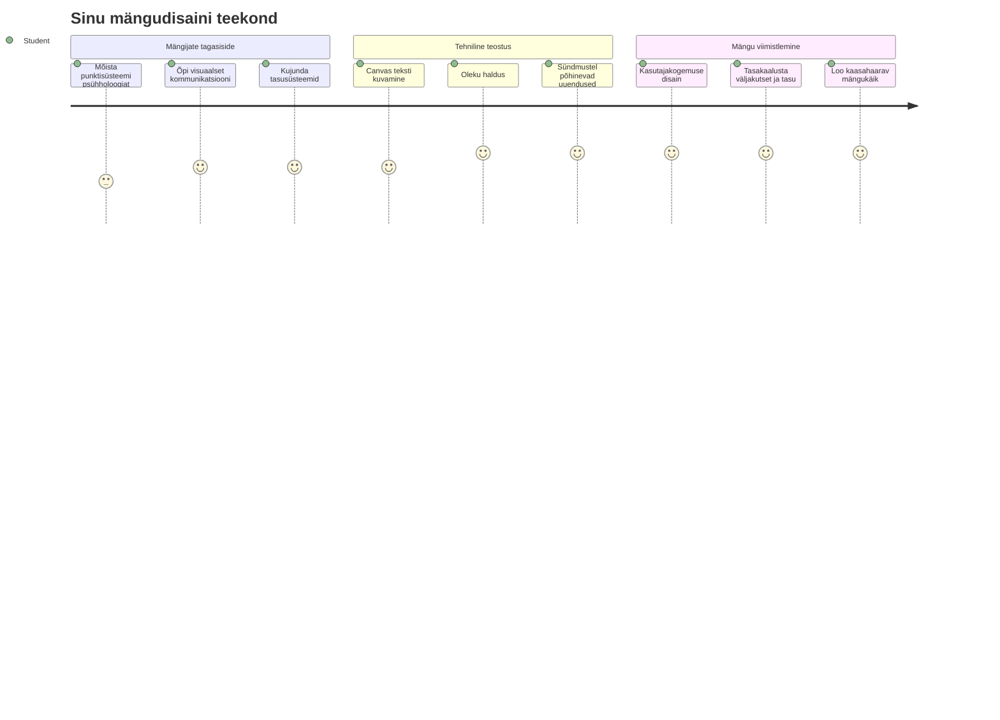
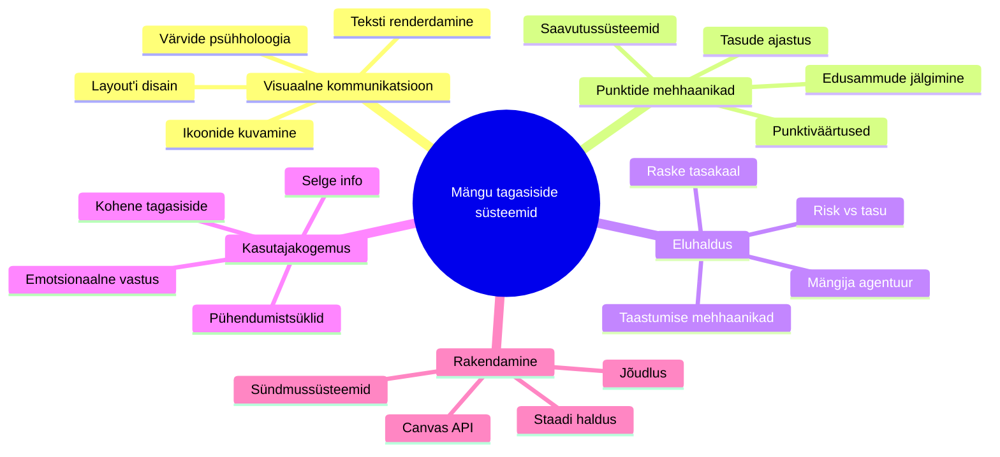
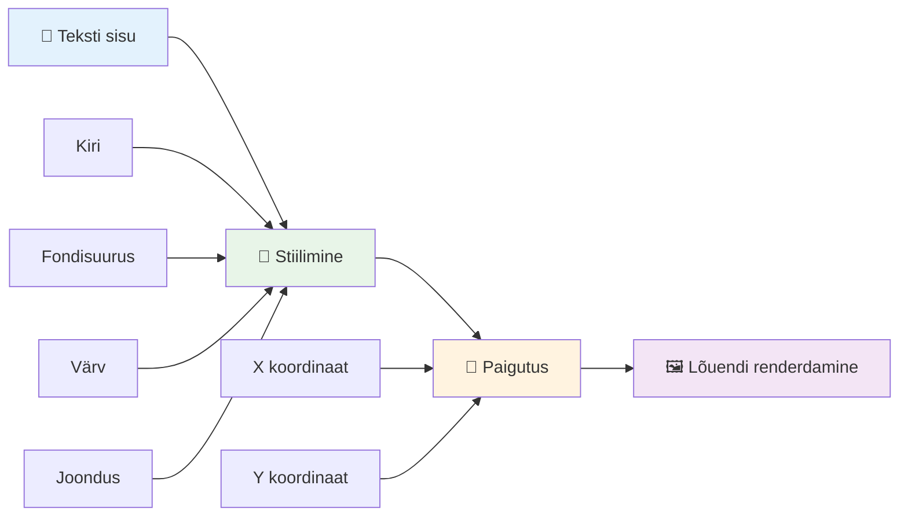
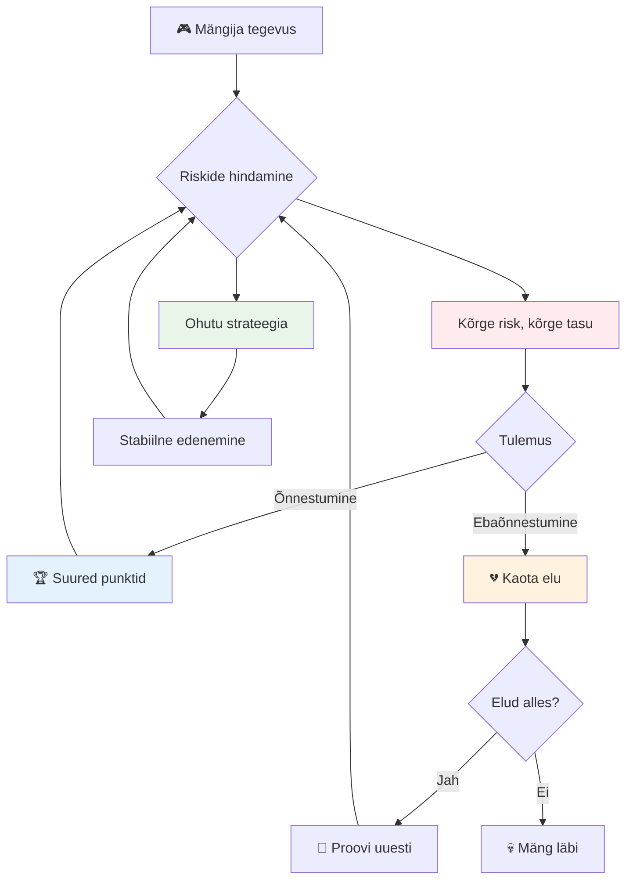
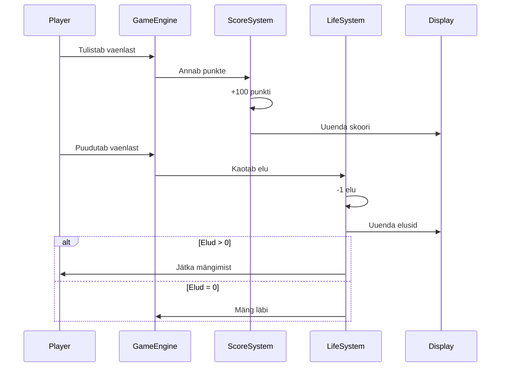
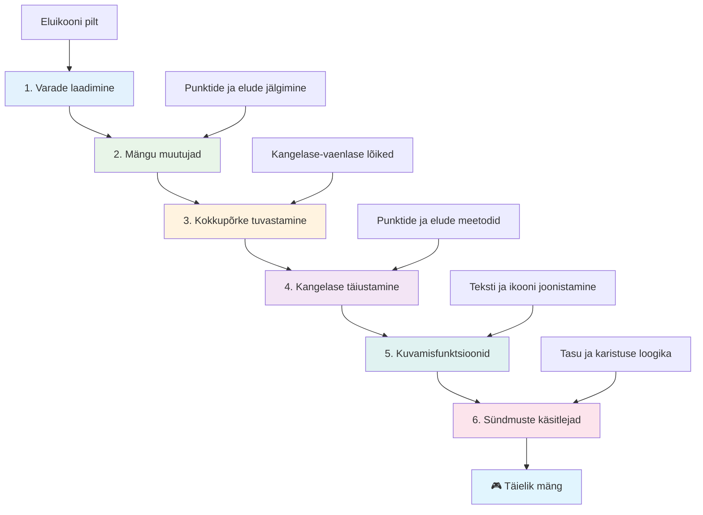
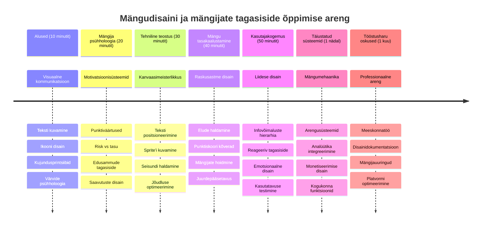

<!--
CO_OP_TRANSLATOR_METADATA:
{
  "original_hash": "2ed9145a16cf576faa2a973dff84d099",
  "translation_date": "2026-01-08T09:14:08+00:00",
  "source_file": "6-space-game/5-keeping-score/README.md",
  "language_code": "et"
}
-->
# Ehita kosmose mäng Osa 5: Skoreerimine ja Elud


## Eel-loengu viktoriin

[Eel-loengu viktoriin](https://ff-quizzes.netlify.app/web/quiz/37)

Oled valmis panema oma kosmosemängu tõeliselt mänguliseks? Lisame punktisüsteemi ja elu haldamise - põhimehhaanika, mis muutis varased arcade-mängud nagu Space Invaders lihtsatest demonstratsioonidest sõltuvust tekitavaks meelelahutuseks. Siin hakkab su mäng tõeliselt mängitavaks muutuma.


## Teksti joonistamine ekraanile - sinu mängu hääl

Skoori kuvamiseks peame õppima, kuidas teksti canvas'ele joonistada. `fillText()` meetod on sinu peamine tööriist - sama tehnika, mida kasutati klassikalistes arcade-mängudes skoori ja staatuse kuvamiseks.


Sul on täielik kontroll teksti välimuse üle:

```javascript
ctx.font = "30px Arial";
ctx.fillStyle = "red";
ctx.textAlign = "right";
ctx.fillText("show this on the screen", 0, 0);
```

✅ Süvene lähemalt [teksti lisamisse canvas'ele](https://developer.mozilla.org/docs/Web/API/Canvas_API/Tutorial/Drawing_text) – võid üllatuda, kui loominguline saad olla fontide ja stiilidega!

## Elud - rohkem kui lihtsalt number

Mängudisainis tähistab "elu" mängija eksimisruumi. See kontseptsioon pärineb flipperimängudest, kus said mängida mitme palliga. Varastes videomängudes nagu Asteroids andsid elud mängijale loa riske võtta ja vigadest õppida.


Visuaalne esitlus on väga oluline – laevaikoonide kuvamine selle asemel, et lihtsalt öelda "Elud: 3", loob kohe visuaalse äratundmise, nagu varased arcade-aparaadid kasutasid ikoonide abil suhtlemiseks keeltest üle.

## Ehita oma mängu tasustamissüsteem

Nüüd rakendame põhifunktsioonid, mis hoiavad mängijaid kaasatud:


- **Skoorisüsteem**: Iga hävitatud vaenlase laev annab 100 punkti (ümarad numbrid on mängijatele kergemini vaimselt arvutatavad). Skoor kuvatakse vasakus alanurgas.
- **Elude lugur**: Sinu kangelane alustab kolme eluga - see on varaste arcade-mängude poolt kehtestatud standard mängimise väljakutse ja tasakaalu jaoks. Iga kokkupõrge vaenlasega maksab ühe elu. Jääke näitame paremas alanurgas laevaikoonidega .

## Hakame ehitama!

Kõigepealt seadista oma tööruum. Liigu vahekausta `your-work` ja peaksid nägema järgmisi faile:

```bash
-| assets
  -| enemyShip.png
  -| player.png
  -| laserRed.png
-| index.html
-| app.js
-| package.json
```

Mängu testimiseks käivita arendusserver kaustast `your_work`:

```bash
cd your-work
npm start
```

See käivitab kohaliku serveri aadressil `http://localhost:5000`. Ava see oma brauseris, et oma mängu näha. Testi juhtnuppe nooleklahvidega ja proovi vaenlasi tulistada, et veenduda, et kõik töötab.


### Aeg kodeerimiseks!

1. **Hangi vajalikud visuaalsed ressursid**. Kopeeri `life.png` fail kaustast `solution/assets/` oma `your-work` kausta. Seejärel lisa lifeImg oma window.onload funktsiooni:

    ```javascript
    lifeImg = await loadTexture("assets/life.png");
    ```

1. Ära unusta lisada `lifeImg` oma varade nimekirja:

    ```javascript
    let heroImg,
    ...
    lifeImg,
    ...
    eventEmitter = new EventEmitter();
    ```
  
2. **Seadista mängu muutujad**. Lisa kood, mis jälgib sinu koguskoori (alustades 0-st) ja järelejäänud elusid (alustades 3). Kuvame need ekraanil, et mängijad teaksid alati oma seisukohta.

3. **Rakenda kokkupõrke tuvastus**. Laienda oma `updateGameObjects()` funktsiooni, et tuvastada, millal vaenlased põrkuvad sinu kangelasega:

    ```javascript
    enemies.forEach(enemy => {
        const heroRect = hero.rectFromGameObject();
        if (intersectRect(heroRect, enemy.rectFromGameObject())) {
          eventEmitter.emit(Messages.COLLISION_ENEMY_HERO, { enemy });
        }
      })
    ```

4. **Lisa elu ja punktide jälgimine oma Kangelasele**. 
   1. **Algata loendurid**. Pane `this.cooldown = 0` alusel Hero klassis elude ja punktide initsialiseerimine:

        ```javascript
        this.life = 3;
        this.points = 0;
        ```

   1. **Näita neid väärtusi mängijale**. Loo funktsioonid, mis joonistavad need väärtused ekraanile:

        ```javascript
        function drawLife() {
          // TEHA, 35, 27
          const START_POS = canvas.width - 180;
          for(let i=0; i < hero.life; i++ ) {
            ctx.drawImage(
              lifeImg, 
              START_POS + (45 * (i+1) ), 
              canvas.height - 37);
          }
        }
        
        function drawPoints() {
          ctx.font = "30px Arial";
          ctx.fillStyle = "red";
          ctx.textAlign = "left";
          drawText("Points: " + hero.points, 10, canvas.height-20);
        }
        
        function drawText(message, x, y) {
          ctx.fillText(message, x, y);
        }

        ```

   1. **Ühenda kõik oma mängutsükliga**. Lisa need funktsioonid window.onload funktsiooni kohe pärast `updateGameObjects()` kutsumist:

        ```javascript
        drawPoints();
        drawLife();
        ```

### 🔄 **Pedagoogiline kontrollpunkt**
**Mängudisaini mõistmine**: Enne tagajärgede rakendamist veendu:
- ✅ Kuidas visuaalne tagasiside suhtleb mängija seisundiga
- ✅ Miks on kasutajaliidese elementide järjepidev asetamine oluline kasutusmugavuse jaoks
- ✅ Punktiväärtuste ja elude haldamise psühholoogia
- ✅ Kuidas canvas teksti renderdamine erineb HTML tekstist

**Kiire enesetest**: Miks kasutavad arcade-mängud tavaliselt ümaraid numbreid punktide vormistamiseks?  
*Vastus: Ümarad numbrid on mängijatele vaimselt kergemini arvutatavad ja loovad rahuldust pakkuva psühholoogilise preemia*

**Kasutajakogemuse põhimõtted**: Rakendad nüüd:
- **Visuaalne hierarhia**: Oluline info on nähtavalt esitatud
- **Kohene tagasiside**: Mängija tegevustest reaalajas värskendused
- **Kognitiivne koormus**: Lihtne ja selge info esitlus
- **Emotsionaalne disain**: Ikoonid ja värvid, mis loovad mängijaga sideme

1. **Rakenda mängu tagajärjed ja tasud**. Lisame nüüd tagasisidesüsteemid, mis teevad mängija tegevused tähendusrikkaks:

   1. **Kokkupõrked maksavad elusid**. Iga kord, kui sinu kangelane põrkab vaenlasega, kaotad ühe elu.
   
      Lisa see meetod oma `Hero` klassile:

        ```javascript
        decrementLife() {
          this.life--;
          if (this.life === 0) {
            this.dead = true;
          }
        }
        ```

   2. **Vaenlaste tulistamine annab punkte**. Iga edukas tabamus annab 100 punkti, pakkudes kohest positiivset tagasisidet täpsele tulistamisele.

      Laienda oma Hero klassi selle punktide suurendamise meetodiga:
    
        ```javascript
          incrementPoints() {
            this.points += 100;
          }
        ```

        Nüüd ühenda need funktsioonid oma kokkupõrke sündmustega:

        ```javascript
        eventEmitter.on(Messages.COLLISION_ENEMY_LASER, (_, { first, second }) => {
           first.dead = true;
           second.dead = true;
           hero.incrementPoints();
        })

        eventEmitter.on(Messages.COLLISION_ENEMY_HERO, (_, { enemy }) => {
           enemy.dead = true;
           hero.decrementLife();
        });
        ```

✅ Huvitab, milliseid teisi mänge on JavaScripti ja Canvas'iga tehtud? Uuri ringi - võid olla üllatunud, kui palju on võimalik!

Pärast nende funktsioonide rakendamist testi oma mängu täieliku tagasisidesüsteemi nägemiseks tegevuses. Peaksid nägema elu ikoone paremas alanurgas, oma skoori vasakus alanurgas ja jälgima, kuidas kokkupõrked vähendavad elusid, samal ajal kui edukad tabamised suurendavad skoori.

Sinu mängul on nüüd põhimehhaanika, mis muutsid varased arcade-mängud niivõrd kaasahaaravaks - selged eesmärgid, kohene tagasiside ja tähenduslikud tagajärjed mängija tegevustele.

### 🔄 **Pedagoogiline kontrollpunkt**
**Täielik mängudisaini süsteem**: Kontrolli oma mängijat tagasiside süsteemide valdamist:
- ✅ Kuidas skoorimehhaanika loob mängijale motivatsiooni ja kaasatust?
- ✅ Miks on visuaalne järjepidevus kasutajaliidese disaini jaoks oluline?
- ✅ Kuidas elusüsteem tasakaalustab väljakutset ja mängija hoidmist?
- ✅ Millist rolli mängib kohene tagasiside rahuldustpakkuva mängukogemuse loomisel?

**Süsteemi integratsioon**: Sinu tagasisidesüsteem demonstreerib:
- **Kasutajakogemuse disain**: Selge visuaalne kommunikatsioon ja infohierarhia
- **Sündmustepõhine arhitektuur**: Mängija tegevustele reageerivad uuendused
- **Seisundi haldus**: Dünaamilise mänguinfo jälgimine ja kuvamine
- **Canvase valdamine**: Teksti renderdamine ja sprite’ide positsioneerimine
- **Mängu psühholoogia**: Mängija motivatsiooni ja kaasatuse mõistmine

**Professionaalsed mustrid**: Oled rakendanud:
- **MVC arhitektuur**: Mänguloogika, andmete ja esituse eraldamine
- **Observer muster**: Sündmustepõhised uuendused mänguoleku muutustele
- **Komponentide disain**: Taaskasutatavad funktsioonid renderdamiseks ja loogikaks
- **Tõhususe optimeerimine**: Efektiivne renderdamine mängutsüklites

### ⚡ **Mida saad teha järgmise 5 minutiga**
- [ ] Katseta erinevate fontide suuruste ja värvidega skoori kuvamisel
- [ ] Muuda punktiarve ja vaata, kuidas see mängutunnetust mõjutab
- [ ] Lisa console.log laused punktide ja elude muutuste jälgimiseks
- [ ] Testi äärmuslikke juhtumeid, näiteks elude lõppemist või kõrget skoori

### 🎯 **Mida saad selle tunni jooksul saavutada**
- [ ] Täida post-õppe viktoriin ja mõista mängudisaini psühholoogiat
- [ ] Lisa heliefektid skoorimiseks ja elude kaotamiseks
- [ ] Rakenda kõrge skoori süsteem localStorage kasutades
- [ ] Loo erinevate vaenlaste tüüpide jaoks erinevad punktisummad
- [ ] Lisa visuaalsed efektid nagu ekraani värin elu kaotamisel

### 📅 **Sinu nädalane mängudisaini teekond**
- [ ] Viimiusta kosmosemäng täpsete tagasisidesüsteemidega
- [ ] Rakenda edasijõudnud skoorimehhaanikaid nagu kombomultiplierid
- [ ] Lisa saavutusi ja avatud sisu
- [ ] Loo raskusastme progresseerumise ja tasakaalu süsteemid
- [ ] Kujunda kasutajaliidesed menüüdele ja mängu lõppkuvadele
- [ ] Õpi teistelt mängudelt nende kaasatusmehhanisme

### 🌟 **Sinu kuuajaline mänguarenduse meistritase**
- [ ] Ehita täismahus mänge keerukate progresseerumise süsteemidega
- [ ] Õpi mänguanalüütikat ja mängijate käitumise mõõtmist
- [ ] Panusta avatud lähtekoodiga mänguarendusprojektidesse
- [ ] Valda edasijõudnud mängudisaini mustreid ja monetiseerimist
- [ ] Loo hariduslikku sisu mängudisaini ja kasutajakogemuse kohta
- [ ] Koosta portfoolio, mis näitab mängudisaini ja arendusoskusi

## 🎯 Sinu mängudisaini meistritabel


### 🛠️ Sinu mängudisaini tööriistakast kokkuvõte

Pärast selle õppetunni lõpetamist valdad nüüd:
- **Mängija psühholoogia**: Motivatsiooni mõistmine, riskide ja tasude mehhanismid ning kaasatusening
- **Visuaalne kommunikatsioon**: Tõhus UI disain teksti, ikoonide ja paigutusega
- **Tagasisidesüsteemid**: Mängija tegevustele ja sündmustele reaalajas reageerimine
- **Seisundihaldus**: Dünaamilise mänguandmete jälgimine ja efektiivne kuvamine
- **Canvase tekstirenderdus**: Professionaalne tekst kuvamine stiili ja positsioneerimisega
- **Sündmuste integratsioon**: Kasutaja tegevuste ühendamine tähenduslike mängu tagajärgedega
- **Mängu tasakaal**: Väljakutsete kõverate ja mängijate progresseerumise süsteemide disain

**Tegelikud rakendused**: Sinu mängudisaini oskused sobivad otse:
- **Kasutajaliidese disain**: Köitvate ja intuitiivsete liideste loomine
- **Tootearendus**: Kasutajamotivatsiooni ja tagasiside mehhanismide mõistmine
- **Haridustehnoloogia**: Gamifikatsioon ja õppimise kaasatavuse süsteemid
- **Andmete visualiseerimine**: Keeruka info kättesaadavaks ja kaasahaaravaks muutmine
- **Mobiilirakenduste arendus**: Säilituse mehhanismid ja kasutajakogemuse disain
- **Turundustehnoloogia**: Kasutajakäitumise ja konversiooni optimeerimise mõistmine

**Omandatud professionaalsed oskused**: Sa oskad nüüd:
- **Disainida** kasutajakogemusi, mis motiveerivad ja kaasavad kasutajaid
- **Rakendada** tagasisidesüsteeme, mis juhivad kasutajate käitumist tõhusalt
- **Tasakaalustada** väljakutset ja ligipääsetavust interaktiivsetes süsteemides
- **Luuа** visuaalset kommunikatsiooni, mis toimib eri kasutajarühmade seas
- **Analüüsida** kasutajakäitumist ja täiustada disaini iteratiivselt

**Valda mänguarenduse põhimõisteid**:
- **Mängija motivatsioon**: Mõista, mis juhib kaasatust ja hoidmist
- **Visuaalne disain**: Loo selge, atraktiivne ja funktsionaalne liides
- **Süsteemi integratsioon**: Ühenda mitu mängusüsteemi sujuvaks kogemuseks
- **Tõhususe optimeerimine**: Efektiivne renderdamine ja seisundihaldus
- **Ligipääsetavus**: Kujunda erinevate oskustega ja vajadustega mängijatele

**Järgmine tase**: Oled valmis uurima edasijõudnud mängudisaini mustreid, rakendama analüütikasüsteeme või õppima mängude monetiseerimise ja mängijate hoidmise strateegiaid!

🌟 **Saavutuse saavutamine**: Oled ehitanud täieliku mängija tagasisidesüsteemi professionaalsete mängudisaini põhimõtetega!

---

## GitHub Copiloti agendi väljakutse 🚀

Kasuta Agendi režiimi, et täita järgmine väljakutse:

**Kirjeldus:** Täienda kosmose mängu skoorisüsteemi kõrgete skooride funktsiooniga, mis kasutab püsivat salvestust ja boonuspunktide mehhanisme.

**Prompt:** Loo kõrge skoori süsteem, mis salvestab mängija parima skoori localStorage'i. Lisa boonuspunkte järjestikuste vaenlaste tapmise eest (kombo süsteem) ja rakenda erinevaid punktiväärtusi erinevate vaenlaste tüüpidele. Näita visuaalset indikaatorit, kui mängija saavutab uue kõrge skoori, ning kuva praegust kõrget skoori mängu ekraanil.


## 🚀 Väljakutse

Sul on nüüd toimiv mäng skoorimise ja eludega. Mõtle, millised täiendavad funktsioonid võiksid mängijakogemust parandada.

## Järgmisel viktoriinil

[Järgnev viktoriin](https://ff-quizzes.netlify.app/web/quiz/38)

## Kordamine & iseseisev õpe

Tahad rohkem avastada? Uuri erinevaid lähenemisi skooride ja elusüsteemide loomisel. Seal on põnevaid mängumootoreid nagu [PlayFab](https://playfab.com), mis haldavad skoorimist, edetabeleid ja mängijate progresseerumist. Kuidas võiks sellise süsteemi integreerimine viia sinu mängu uuele tasemele?

## Kodune ülesanne

[Ehita skoorimäng](assignment.md)

---

<!-- CO-OP TRANSLATOR DISCLAIMER START -->
**Vastutühendus**:  
See dokument on tõlgitud kasutades tehisintellektil põhinevat tõlketeenust [Co-op Translator](https://github.com/Azure/co-op-translator). Kuigi püüame tagada täpsust, tuleb arvestada, et automaatsed tõlked võivad sisaldada vigu või ebatäpsusi. Originaaldokument oma algkeeles tuleks pidada autoriteetseks allikaks. Kriitilise teabe puhul on soovitatav kasutada professionaalset inimtõlget. Me ei vastuta selle tõlke kasutamisest tulenevate arusaamatuste või väärinterpretatsioonide eest.
<!-- CO-OP TRANSLATOR DISCLAIMER END -->