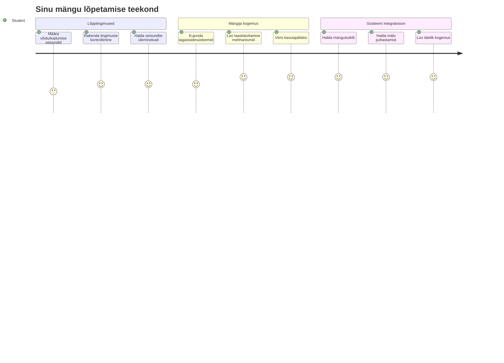
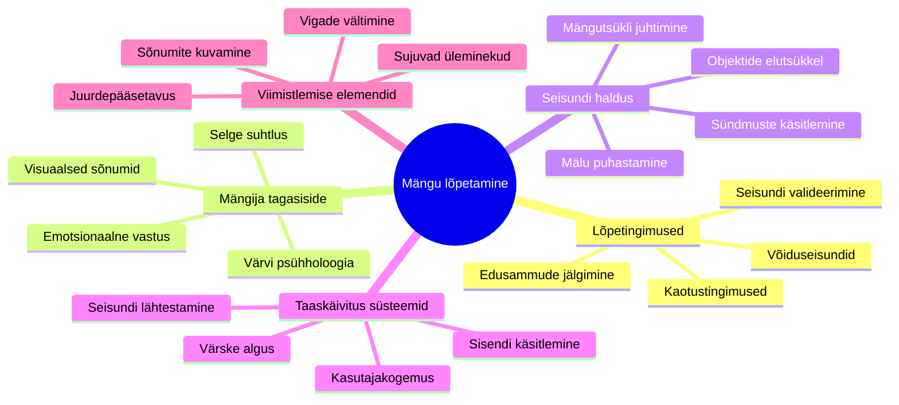
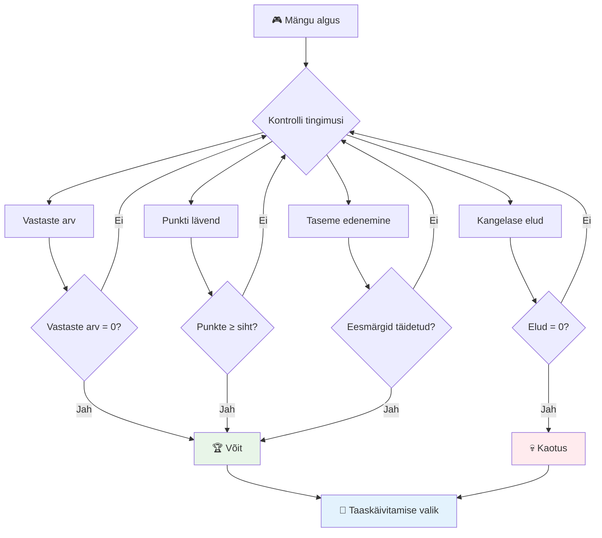
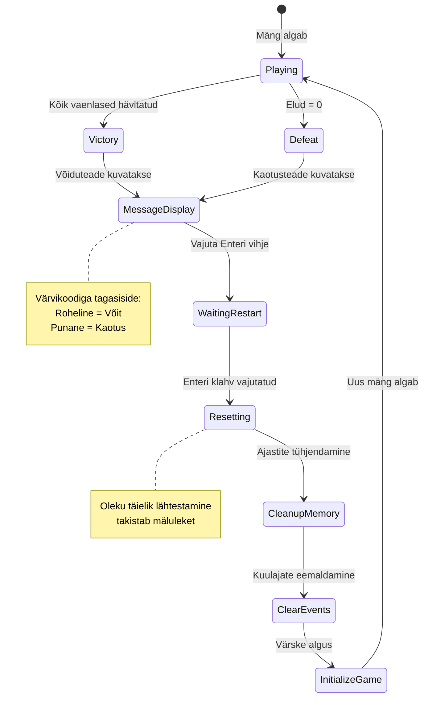
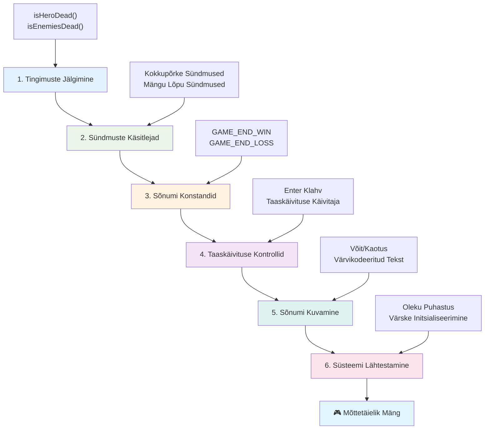
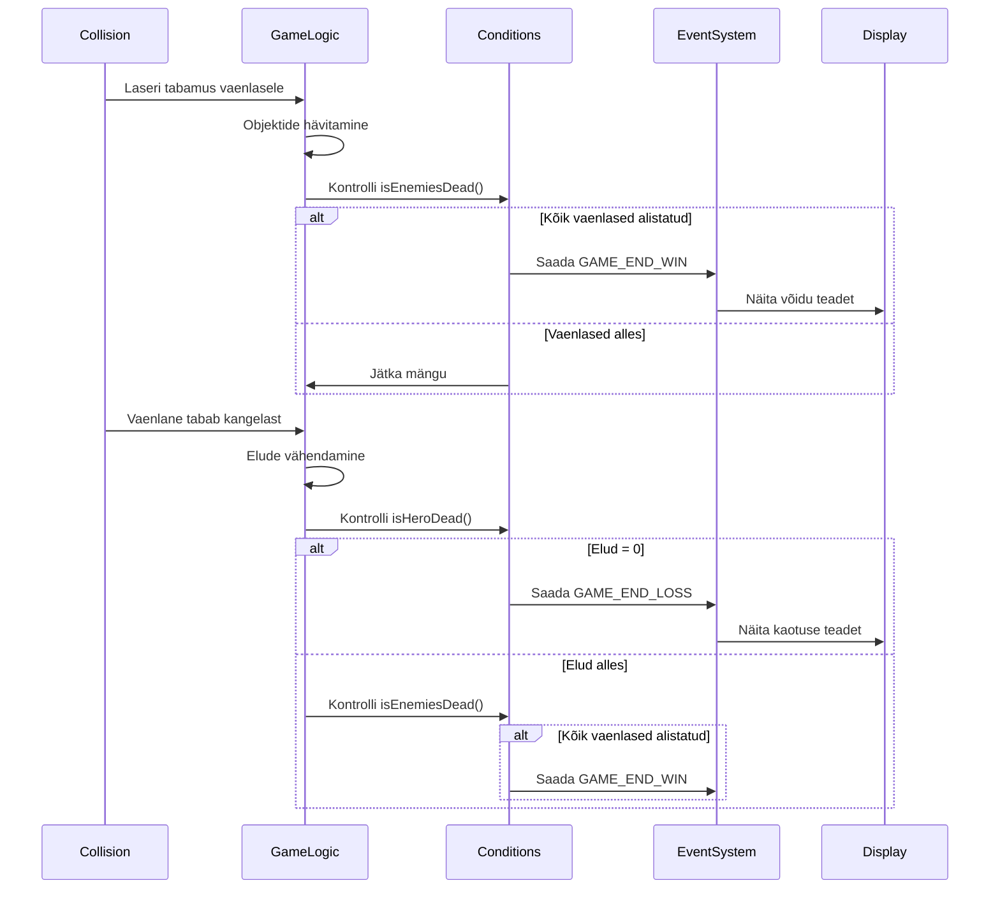
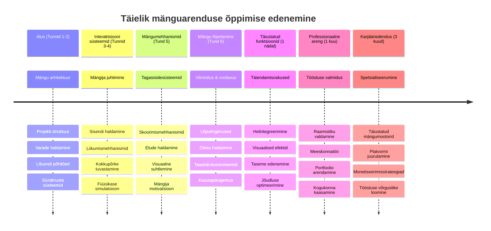

# Ehita kosmosemäng osa 6: Lõpp ja taaskäivitamine


Iga suurepärane mäng vajab selgeid lõpptingimusi ja sujuvat taaskäivitamise mehhanismi. Sa oled loonud muljetavaldava kosmosemängu, kus saab liikuda, võidelda ja punkte teenida – nüüd on aeg lisada viimased tükid, mis teevad selle mängu täielikuks.

Sinu mäng jookseb hetkel lõputult, nagu NASA Voyageri sondid, mis saadeti teele 1977. aastal – nad reisivad jätkuvalt läbi kosmose kümneid aastaid hiljem. Kuigi see sobib kosmoseuuringuteks, vajavad mängud määratletud lõpp-punkte, et pakkuda rahuldustpakkuvat kogemust.

Täna viime ellu nõuetekohased võidu/kaotuse tingimused ja taaskäivitussüsteemi. Selle tunni lõpuks on sul lihvitud mäng, mida mängijad saavad lõpetada ja uuesti mängida, just nagu klassikalised arcade-mängud, mis määratlesid selle meediumi.


## Eelloengu viktoriin

[Eelloengu viktoriin](https://ff-quizzes.netlify.app/web/quiz/39)

## Mängu lõpptingimuste mõistmine

Millal peaks su mäng lõppema? See fundamentaalne küsimus on kujundanud mängudisaini juba varajastest arcade-aegadest alates. Pac-Man lõpeb siis, kui sa vaimude kätte jääd või kõik punktid korjad, samas Space Invaders lõpeb, kui tulnukad jõuavad põhja või sa hävitad kõik.

Mängu loojana määratled võidu ja kaotuse tingimused. Meie kosmosemängu jaoks on siin tõestatud lähenemised, mis loovad kaasahaarava mängukogemuse:


- **`N` vaenlase laeva hävitamine**: Kui mäng jaguneb erinevateks tasemeteks, on tavapärane vajada `N` vaenlase laeva hävitamist, et tase lõpetada.
- **Sinu laev on hävitatud**: On mänge, kus kaotad, kui su laev hävitatakse. Teine levinud lähenemine on elu mõiste olemasolu. Iga kord, kui su laev hävitatakse, kaotad ühe elu. Kui kõik elud on otsas, kaotad mängu.
- **Oled kogunud `N` punkti**: Teine levinud lõpptingimus on punktide kogumine. Punkte saad olenevalt tegevusest, näiteks vaenlase laeva hävitamisest või esemete kogumisest, mis langevad hävitamisel.
- **Taseme lõpetamine**: See võib hõlmata mitut tingimust, nagu `X` vaenlase laeva hävitamine, `Y` punktide kogumine või teatud eseme korjamine.

## Mängu taaskäivitamise funktsionaalsuse rakendamine

Head mängud soodustavad korduvmängimist sujuvate taaskäivitamismehhanismidega. Kui mängijad mängu lõpetavad (või kaotavad), tahavad nad sageli kohe uuesti proovida – kas siis punkte ületada või sooritust parandada.


Tetris on selle suurepäraseks näiteks: kui plokid jõuavad tippu, saad kohe uue mängu alustada ilma keerulistest menüüdest läbi minemata. Me ehitame sarnase taaskäivitussüsteemi, mis puhastab mängu oleku ja võimaldab mängijatel kiiresti tegevusse sukelduda.

✅ **Mõtisklus**: Mõtle mängudele, mida oled mänginud. Millal need lõppevad ja kuidas sind taaskäivitamisele kutsutakse? Mis teeb taaskäivitamise kogemuse sujuvaks või frustreerivaks?

## Mida sa ehitad

Sa rakendad viimased funktsioonid, mis muudavad sinu projekti täielikuks mängukogemuseks. Need elemendid eristavad lihvitud mänge lihtsatest prototüüpidest.

**Täna lisame:**

1. **Võidutingimus**: Hävita kõik vaenlased ja saa vääriline tähistamine (sa oled selle ära teeninud!)
2. **Kaotustingimus**: Kui elud on otsas, näita kaotuse ekraani
3. **Taaskäivitamise mehhanism**: Vajuta Enter ja alusta uuesti – sest üks mäng ei ole kunagi piisav
4. **Olekute haldus**: Iga kord puhas leht – ei vaenlasi ega kummalisi vigu eelmise mängu järgi

## Alustame

Valmistame su arenduskeskkonna ette. Sul peaksid olema olemas kõik kosmosemängu failid eelmistest tundidest.

**Sinu projekt võiks välja näha umbes nii:**

```bash
-| assets
  -| enemyShip.png
  -| player.png
  -| laserRed.png
  -| life.png
-| index.html
-| app.js
-| package.json
```

**Alusta oma arendusserverit:**

```bash
cd your-work
npm start
```

**See käsk:**
- Käivitab lokaalse serveri aadressil `http://localhost:5000`
- Teenindab faile korralikult
- Värskendab automaatselt, kui muudatusi teed

Ava oma brauseris aadress `http://localhost:5000` ja veendu, et mäng jookseb. Sa peaksid saama liikuda, tulistada ja vaenlastega suhelda. Kui see on toimimas, võime minna implimentatsiooni juurde.

> 💡 **Pro näpunäide**: Vältimaks hoiatuste ilmumist Visual Studio Code'is, deklareeri `gameLoopId` faili alguses `let gameLoopId;` asemel, et seda teha `window.onload` funktsiooni sees. See järgib kaasaegseid JavaScripti muutujate deklareerimise parimaid tavasid.


## Rakendamise sammud

### Samm 1: Loo lõpptingimuste jälgimise funktsioonid

Me vajame funktsioone, mis jälgivad, millal mäng peaks lõppema. Nagu rahvusvahelise kosmosejaama sensorid, mis pidevalt olulisi süsteeme kontrollivad, hoiavad need funktsioonid mängu olekut silma peal.

```javascript
function isHeroDead() {
  return hero.life <= 0;
}

function isEnemiesDead() {
  const enemies = gameObjects.filter((go) => go.type === "Enemy" && !go.dead);
  return enemies.length === 0;
}
```

**Ikka põhjalikult selgitatuna:**
- **Kontrollib**, kas meie kangelane on elud otsas (ai!)
- **Lugedes**, mitu vaenlast veel elus on
- **Tagastab** `true`, kui lahinguväli on vaenlastest tühi
- **Kasutab** lihtsat tõene/vale loogikat, et hoida asjad mõistlikud
- **Filtreerib** läbi kõik mängu objektid, et leida ellujääjad

### Samm 2: Uuenda sündmuste töötlejaid lõpptingimuste jaoks

Nüüd ühendame need tingimuste kontrollid mängu sündmuste süsteemiga. Iga kokkupõrke korral hindab mäng, kas see käivitab lõpptingimuse. See loob kohese tagasiside olulistele mängusündmustele.


```javascript
eventEmitter.on(Messages.COLLISION_ENEMY_LASER, (_, { first, second }) => {
    first.dead = true;
    second.dead = true;
    hero.incrementPoints();

    if (isEnemiesDead()) {
      eventEmitter.emit(Messages.GAME_END_WIN);
    }
});

eventEmitter.on(Messages.COLLISION_ENEMY_HERO, (_, { enemy }) => {
    enemy.dead = true;
    hero.decrementLife();
    if (isHeroDead())  {
      eventEmitter.emit(Messages.GAME_END_LOSS);
      return; // kaotus enne võitu
    }
    if (isEnemiesDead()) {
      eventEmitter.emit(Messages.GAME_END_WIN);
    }
});

eventEmitter.on(Messages.GAME_END_WIN, () => {
    endGame(true);
});
  
eventEmitter.on(Messages.GAME_END_LOSS, () => {
  endGame(false);
});
```

**Mida siin tehakse:**
- **Laseri tabamus vaenlasele**: Mõlemad kaovad, saad punkte ja kontrollime, kas oled võitnud
- **Vaenlane tabab sind**: Kaotad elu ja kontrollime, kas oled veel elus
- **Nutikas järjekord**: Kontrollime esmalt kaotust (keegi ei taha korraga võita ja kaotada!)
- **Kohesed reaktsioonid**: Niipea kui tähtis asi juhtub, saab mäng sellest teada

### Samm 3: Lisa uued sõnumikonstandid

Sul tuleb lisada uued sõnumitüübid `Messages` konstandi objekti. Need konstandid aitavad säilitada järjepidevust ja vältida kirjavigu sündmuste süsteemis.

```javascript
GAME_END_LOSS: "GAME_END_LOSS",
GAME_END_WIN: "GAME_END_WIN",
```

**Ülalolevas oleme:**
- **Lisanud** mängu lõpu sündmuste konstante järjepidevuse tagamiseks
- **Kasutanud** kirjeldavaid nimesid, mis selgelt näitavad sündmuse eesmärki
- **Järgnenud** olemasolevat sõnumitüüpide nimetamisstiili

### Samm 4: Rakenda taaskäivitamise juhtimine

Nüüd lisad klaviatuuri juhtnupud, mis lubavad mängijatel mängu uuesti alustada. Enter-klahv on loomulik valik, kuna seda seostatakse tavaliselt toimingu kinnitamise ja uue mängu alustamisega.

**Lisa Enter-klahvi avastamine olemasolevale keydown sündmuse kuulajale:**

```javascript
else if(evt.key === "Enter") {
   eventEmitter.emit(Messages.KEY_EVENT_ENTER);
}
```

**Lisa uus sõnumikonstant:**

```javascript
KEY_EVENT_ENTER: "KEY_EVENT_ENTER",
```

**Mida peaksid teadma:**
- **Laiendab** olemasolevat klaviatuurisündmuste haldussüsteemi
- **Kasutab** Enter-klahvi taaskäivituse käivitamiseks intuitiivse kasutajakogemuse jaoks
- **Saadab** kohandatud sündmuse, mida mängu teised osad kuulata saavad
- **Järgib** sama mustrit nagu teised klaviatuurikontrollid

### Samm 5: Loo sõnumi kuvamise süsteem

Sinu mäng peab selgelt mängijatele tulemusi edastama. Loome sõnumisüsteemi, mis kuvab võidu ja kaotuse olekuid värvikooditud tekstina, sarnaselt varaste arvutisüsteemide terminalidele, kus roheline tähendas edukust ja punane vigu.

**Loo funktsioon `displayMessage()`:**

```javascript
function displayMessage(message, color = "red") {
  ctx.font = "30px Arial";
  ctx.fillStyle = color;
  ctx.textAlign = "center";
  ctx.fillText(message, canvas.width / 2, canvas.height / 2);
}
```

**Samm-sammult toimub siin:**
- **Seab** fonte suuruse ja perekonna selge ja loetava teksti jaoks
- **Kasutab** värviparameetrit, milleks vaikimisi on punane hoiatussõnumeid jaoks
- **Joondab** teksti vastavalt vertikaalselt ja horisontaalselt lõuendil
- **Kasutab** kaasaegseid JavaScripti vaikimisi parameetreid paindliku värvivaliku jaoks
- **Rakendab** lõuendi 2D konteksti otseseks teksti joonistamiseks

**Loo funktsioon `endGame()`:**

```javascript
function endGame(win) {
  clearInterval(gameLoopId);

  // Määra viivitus, et tagada kõik ootel renderdused lõpetatuks
  setTimeout(() => {
    ctx.clearRect(0, 0, canvas.width, canvas.height);
    ctx.fillStyle = "black";
    ctx.fillRect(0, 0, canvas.width, canvas.height);
    if (win) {
      displayMessage(
        "Victory!!! Pew Pew... - Press [Enter] to start a new game Captain Pew Pew",
        "green"
      );
    } else {
      displayMessage(
        "You died !!! Press [Enter] to start a new game Captain Pew Pew"
      );
    }
  }, 200)  
}
```

**Mis see funktsioon teeb:**
- **Jäädvustab** kõik paigale – laevad ja laserid enam ei liigu
- **Võtab** väikese pausi (200ms), et viimane kaader jõuaks joonistada
- **Puhastab** ekraani ja maalib selle dramaatilise efektina mustaks
- **Näitab** erinevaid sõnumeid võitjatele ja kaotajatele
- **Värvikoodib** teavitused – roheline hea jaoks, punane mitte nii hea jaoks
- **Räägib** mängijatele täpselt, kuidas uuesti mängu minna

### 🔄 **Pedagoogiline kontroll**
**Mängu oleku haldus**: Enne lähtestamise funktsionaalsuse rakendamist veendu, et mõistad:
- ✅ Kuidas lõpptingimused loovad selged mängueesmärgid
- ✅ Miks visuaalne tagasiside on mängija mõistmise jaoks oluline
- ✅ Korraliku koristamise tähtsust mälu lekkete vältimiseks
- ✅ Kuidas sündmustest juhitav arhitektuur võimaldab puhtaid olekuelemendi üleminekuid

**Kiire enesehindamine**: Mis juhtub, kui sa ei puhasta sündmuse kuulajaid lähtestamise ajal?
*Vastus: Mälu lekked ja topelt sündmuse töötlejad põhjustavad ettearvamatut käitumist*

**Mängudisaini põhimõtted**: Sa rakendad nüüd:
- **Selged eesmärgid**: Mängijad teavad täpselt, mis on edu ja ebaedu
- **Kohene tagasiside**: Mängu oleku muutused edastatakse viivitamatult
- **Kasutajajuhtimine**: Mängijad saavad uuesti alustada, kui ise valmis on
- **Süsteemi usaldusväärsus**: Korralik koristamine hoiab ära vigade ja jõudlusprobleemide tekkimise

### Samm 6: Rakenda mängu lähtestamise funktsionaalsus

Lähtestamissüsteem peab täielikult puhastama praeguse mängu oleku ja alustama uut mängu sessiooni. See tagab, et mängijad saavad puhast algust ilma eelmise mängu andmeteta.

**Loo funktsioon `resetGame()`:**

```javascript
function resetGame() {
  if (gameLoopId) {
    clearInterval(gameLoopId);
    eventEmitter.clear();
    initGame();
    gameLoopId = setInterval(() => {
      ctx.clearRect(0, 0, canvas.width, canvas.height);
      ctx.fillStyle = "black";
      ctx.fillRect(0, 0, canvas.width, canvas.height);
      drawPoints();
      drawLife();
      updateGameObjects();
      drawGameObjects(ctx);
    }, 100);
  }
}
```

**Mõistame iga osa:**
- **Kontrollib**, kas mängu silmus on juba käimas enne lähtestamist
- **Tühjendab** olemasoleva mängusilmuse, peatades kõik aktiivsed tegevused
- **Eemaldab** kõik sündmuste kuulajad, et vältida mälu lekkimist
- **Algatab** mängu oleku uuesti koos uute objektide ja muutujatega
- **Käivitab** uue mängusilmuse kõigi vajalike mängufunktsioonidega
- **Hoidub** samal 100ms intervallil järjepideva jõudluse saavutamiseks

**Lisa Enter-klahvi sündmuse töötleja oma `initGame()` funktsiooni:**

```javascript
eventEmitter.on(Messages.KEY_EVENT_ENTER, () => {
  resetGame();
});
```

**Lisa `clear()` meetod EventEmitter klassi:**

```javascript
clear() {
  this.listeners = {};
}
```

**Peamised punktid:**
- **Seob** Enter-klahvi vajutuse mängu taaskäivitamise funktsiooniga
- **Registreerib** selle sündmuse kuulaja mängu algatamise ajal
- **Pakub** puhtat viisi kõigi sündmuste kuulajate eemaldamiseks lähtestamisel
- **Vältib** mälu lekkimist, puhastades sündmuste töötlejad mängude vahel
- **Lähtestab** kuulajate objekti tühjaks, et alustada uuesti

## Palju õnne! 🎉

👽 💥 🚀 Sa oled edukalt ehitanud täiesti funktsionaalse mängu algusest lõpuni. Nagu programmiarendajad 1970. aastate esimestes videomängudes, oled sa muutnud koodijupid interaktiivseks kogemuseks, millel on korralikud mängumehhanismid ja kasutajate tagasiside. 🚀 💥 👽

**Sa saavutasid:**
- **Rakendasid** täielikud võidu- ja kaotustingimused koos kasutajate tagasisidega
- **Lõid** sujuva taaskäivitussüsteemi pidevaks mänguks
- **Disainisid** selge visuaalse kommunikatsiooni mängu olekute jaoks
- **Haldasid** keerukaid mängu oleku üleminekuid ja koristamist
- **Koondasid** kõik komponendid ühtseks mänguks

### 🔄 **Pedagoogiline kontroll**
**Täielik mänguarendussüsteem**: Tähista oma oskust täisdana mänguarenduse tsükli osas:
- ✅ Kuidas lõpptingimused loovad mängijale rahuldustpakkuva kogemuse?
- ✅ Miks on õige oleku haldus mängu stabiilsuse jaoks kriitiline?
- ✅ Kuidas visuaalne tagasiside tugevdab mängija arusaamist?
- ✅ Mis rolli mängib taaskäivitussüsteem mängija hoidmisel?

**Süsteemi meistriklass**: Sinu täielik mäng demonstreerib:
- **Täielikku mänguarendust**: Graafika, sisendi ja oleku haldust
- **Professionaalset arhitektuuri**: Sündmustest juhitavad süsteemid koos korraliku koristamisega
- **Kasutajakogemuse disaini**: Selge tagasiside ja intuitiivsed juhid
- **Jõudluse optimeerimist**: Tõhus renderdamine ja mälu haldus
- **Lihvi ja täielikkust**: Kõik detailid, mis muudavad mängu lõpetatuks

**Tööstusvalmis oskused**: Sa oled rakendanud:
- **Mängu silmuse arhitektuuri**: Reaalaegsed süsteemid järjepideva jõudlusega
- **Sündmustest juhitud programmeerimise**: Lahtised süsteemid, mis skaleeruvad hästi
- **Olekute haldust**: Keerulised andmete käsitlemine ja elutsükli juhtimine
- **Kasutajaliidese disaini**: Selge kommunikatsioon ja reageerivad juhid
- **Testimist ja silumist**: Iteratiivne arendus ja probleemide lahendamine

### ⚡ **Mida saad teha järgmise 5 minutiga**
- [ ] Mängida oma täielikku mängu ja testida kõiki võidu- ja kaotustingimusi
- [ ] Katsetada erinevaid lõpptingimuste parameetreid
- [ ] Proovida lisada console.log avaldusi mängu oleku muutuste jälgimiseks
- [ ] Jagada oma mängu sõpradega ja koguda tagasisidet

### 🎯 **Mida saad selle tunni jooksul saavutada**
- [ ] Täita postloengu viktoriin ja mõtiskleda oma mänguarenduse teekonnal
- [ ] Lisada heliefekte võidu ja kaotuse olekutele
- [ ] Mahutada täiendavad lõpptingimused nagu aega piirangud või boonuseesmärgid
- [ ] Luua erinevad raskusastmed, kus vaenlaste arv varieerub
- [ ] Lihvida visuaalset esitust paremate fontide ja värvidega

### 📅 **Sinu nädala pikkune mänguarenduse meisterlikkus**
- [ ] Lõpetada täiustatud kosmosemäng mitme taseme ja edasijõudmistega
- [ ] Lisada arenenud omadusi nagu võimsus-upid, erinevat tüüpi vaenlased ja erirelvad
- [ ] Luua kõrge skoori süsteem püsiva andmesalvestusega
- [ ] Disainida kasutajaliidesed menüüde, seadete ja mängu valikute jaoks
- [ ] Optimeerida jõudlust erinevate seadmete ja brauserite jaoks
- [ ] Avaldada oma mäng veebis ja jagada seda kogukonnaga
### 🌟 **Teie kuuajaline mänguarenduse karjäär**
- [ ] Looge mitu täielikku mängu, uurides erinevaid žanre ja mehaanikaid
- [ ] Õppige arenenud mänguarendusraamistikke nagu Phaser või Three.js
- [ ] Panustage avatud lähtekoodiga mänguarendusprojektidesse
- [ ] Uurige mängudisaini põhimõtteid ja mängijapsühholoogiat
- [ ] Looge portfoolio, mis tutvustab teie mänguarenduse oskusi
- [ ] Looge ühendus mänguarenduse kogukonnaga ja jätkake õppimist

## 🎯 Teie täielik mänguarenduse meistriklassi ajagraafik


### 🛠️ Teie täieliku mänguarenduse tööriistakasti kokkuvõte

Pärast kogu seda kosmose mänguseeriat olete nüüd valdanud:
- **Mängu arhitektuuri**: sündmustepõhised süsteemid, mängutsüklid ja olekute haldus
- **Graafika programmeerimist**: Canvas API, sprite'i kuvamine ja visuaalsed efektid
- **Sisendsüsteeme**: klaviatuuri töötlus, kokkupõrke tuvastus ja reageerivad juhtimised
- **Mängudisaini**: mängija tagasiside, edenemissüsteemid ja kaasahaaravad mehaanika
- **Tulemuse optimeerimist**: tõhus joonistamine, mälu haldus ja kaadritempo juhtimine
- **Kasutajakogemust**: selge suhtlus, intuitiivsed juhtimised ja viimased detailid
- **Professionaalseid mustreid**: puhas kood, silumisvõtted ja projektikorraldus

**Tegelikud rakendused**: Teie mänguarenduse oskused kehtivad otseselt:
- **Interaktiivsetele veebirakendustele**: dünaamilised liidesed ja reaalajas süsteemid
- **Andmete visualiseerimisele**: animeeritud graafikud ja interaktiivsed kujutised
- **Haridustehnoloogiale**: mängustamine ja kaasahaaravad õppimiskogemused
- **Mobiiliarendusele**: puudutusele reageerivad interaktsioonid ja jõudluse optimeerimine
- **Simulatsioonitarkvarale**: füüsikamootorid ja reaalajas modelleerimine
- **Loovatele tööstusharudele**: interaktiivne kunst, meelelahutus ja digikogemused

**Omandatud professionaalsed oskused**: Nüüd saate:
- **Kujundada** keerukaid interaktiivseid süsteeme nullist
- **Siluda** reaalajas rakendusi süsteemsete meetoditega
- **Optimeerida** jõudlust sujuvaks kasutajakogemuseks
- **Disainida** kaasahaaravaid kasutajaliideseid ja interaktsioonimustreid
- **Töötada koostöös** tehnilistes projektides korraliku koodi organiseerimisega

**Valdamisjärgus mänguarenduse kontseptsioonid**:
- **Reaalaja süsteemid**: mängutsüklid, kaadritihedus ja jõudlus
- **Sündmustepõhine arhitektuur**: lahusolevad süsteemid ja sõnumivahetus
- **Olekute haldus**: keerukas andmete käitlemine ja elutsükli juhtimine
- **Kasutajaliidese programmeerimine**: Canvas graafika ja reageeriv disain
- **Mängudisaini teooria**: mängijapsühholoogia ja kaasahaaravad mehaanika

**Järgmine tase**: olete valmis uurima arenenud mänguraamistikke, 3D graafikat, mitmikmängusüsteeme või siirduma professionaalseks mänguarendajaks!

🌟 **Saavutus lukustatud lahti**: olete lõpetanud kogu mänguarendusreisi ja loonud nullist professionaalse kvaliteediga interaktiivse kogemuse!

**Tere tulemast mänguarenduse kogukonda!** 🎮✨

## GitHub Copilot Agendi väljakutse 🚀

Kasutage agendi režiimi järgmise väljakutse lõpetamiseks:

**Kirjeldus:** täiustage kosmosemängu, rakendades taseme edenemissüsteemi, kus raskusaste kasvab ja on boonuselemendid.

**Üleskutse:** Looge mitmetasemeline kosmosemängu süsteem, kus igal tasemel on rohkem vaenlasi, kellel on kõrgem kiirus ja eluvara. Lisage punktide kordaja, mis suureneb iga tasemega, ning rakendage täiustusi (nt kiire tulistamine või kilp), mis ilmuvad juhuslikult, kui vaenlased hävitatakse. Lisage taseme lõpetamise boonus ja kuvage praegune tase ekraanil koos olemasoleva punktide ja elude näiduga.

Lisateavet leiate siit [agent mode](https://code.visualstudio.com/blogs/2025/02/24/introducing-copilot-agent-mode).

## 🚀 Vabatahtlik täiustamise väljakutse

**Lisage oma mängule heli**: täiustage mängukogemust, rakendades heliefekte! Mõelge lisada heli:

- **Laseripursked** mängija tulistamisel
- **Vaenlaste hävitamine**, kui laevad saavad tabamuse
- **Kangelase kahjustused**, kui mängija saab tabamuse
- **Võidumuusika**, kui mäng võidetakse
- **Kaotuse heli**, kui mäng kaotatakse

**Heli rakendamise näide:**

```javascript
// Loo heliobjekte
const laserSound = new Audio('assets/laser.wav');
const explosionSound = new Audio('assets/explosion.wav');

// Mängusündmuste ajal helide esitamine
function playLaserSound() {
  laserSound.currentTime = 0; // Lähtesta algusesse
  laserSound.play();
}
```

**Mida vaja teada:**
- **Luuakse** Audio objektid erinevate heliefektide jaoks
- **Taastatakse** `currentTime`, et võimaldada kiiret tulistamisheli
- **Käsitletakse** brauseri automaatse taasesituse poliitikaid, käivitades helid kasutaja interaktsioonidest
- **Juhtimist** heli helitugevuse ja ajastuse üle parema mängukogemuse jaoks

> 💡 **Õppematerjal**: Uurige seda [heli proovituba](https://www.w3schools.com/jsref/tryit.asp?filename=tryjsref_audio_play), et õppida heli rakendamist JavaScripti mängudes.

## Lõpu loengu viktoriin

[Lõpu loengu viktoriin](https://ff-quizzes.netlify.app/web/quiz/40)

## Ülevaade & Iseseisev õpe

Teie ülesanne on luua uus proovimäng, seega uurige mõningaid huvitavaid mänge, et näha, millist tüüpi mängu võiksite luua.

## Ülesanne

[Ehita proovimäng](assignment.md)

---

<!-- CO-OP TRANSLATOR DISCLAIMER START -->
**Vastutusest loobumine**:  
See dokument on tõlgitud AI-tõlketeenuse [Co-op Translator](https://github.com/Azure/co-op-translator) abil. Kuigi püüame tagada täpsust, palume arvestada, et automatiseeritud tõlked võivad sisaldada vigu või ebatäpsusi. Originaaldokument selle emakeeles tuleb pidada autoriteetseks allikaks. Olulise info puhul soovitatakse professionaalset inimtõlget. Me ei vastuta selle tõlke kasutamisest tingitud arusaamatuste ega valesti mõistmiste eest.
<!-- CO-OP TRANSLATOR DISCLAIMER END -->