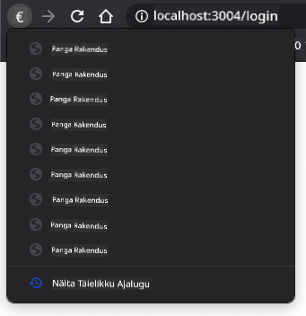

<!--
CO_OP_TRANSLATOR_METADATA:
{
  "original_hash": "8a07db14e75ac62f013b7de5df05981d",
  "translation_date": "2025-10-11T12:05:39+00:00",
  "source_file": "7-bank-project/1-template-route/README.md",
  "language_code": "et"
}
-->
# Pangaäpi loomine, 1. osa: HTML-mallid ja marsruudid veebirakenduses

## Loengu-eelne viktoriin

[Loengu-eelne viktoriin](https://ff-quizzes.netlify.app/web/quiz/41)

### Sissejuhatus

Alates JavaScripti tulekust brauseritesse on veebilehed muutunud interaktiivsemaks ja keerukamaks kui kunagi varem. Veebitehnoloogiaid kasutatakse nüüd sageli täielikult funktsionaalsete rakenduste loomiseks, mis töötavad otse brauseris ja mida nimetatakse [veebirakendusteks](https://en.wikipedia.org/wiki/Web_application). Kuna veebirakendused on väga interaktiivsed, ei soovi kasutajad oodata, kuni kogu leht iga toimingu järel uuesti laaditakse. Seetõttu kasutatakse JavaScripti HTML-i otse värskendamiseks DOM-i abil, et pakkuda sujuvamat kasutajakogemust.

Selles õppetükis loome aluse panga veebirakenduse loomiseks, kasutades HTML-malle mitme ekraani loomiseks, mida saab kuvada ja värskendada ilma kogu HTML-lehte uuesti laadimata.

### Eeltingimus

Selle õppetüki veebirakenduse testimiseks on sul vaja kohalikku veebiserverit. Kui sul seda pole, saad paigaldada [Node.js](https://nodejs.org) ja kasutada käsku `npx lite-server` oma projekti kaustast. See loob kohaliku veebiserveri ja avab sinu rakenduse brauseris.

### Ettevalmistus

Loo oma arvutis kaust nimega `bank` ja selle sees fail nimega `index.html`. Alustame sellest HTML-i [mallist](https://en.wikipedia.org/wiki/Boilerplate_code):

```html
<!DOCTYPE html>
<html lang="en">
  <head>
    <meta charset="UTF-8">
    <meta name="viewport" content="width=device-width, initial-scale=1.0">
    <title>Bank App</title>
  </head>
  <body>
    <!-- This is where you'll work -->
  </body>
</html>
```

---

## HTML-mallid

Kui soovid luua veebilehele mitu ekraani, võiks üheks lahenduseks olla iga ekraani jaoks eraldi HTML-faili loomine. Kuid see lahendus toob kaasa mõningaid ebamugavusi:

- Kogu HTML tuleb ekraani vahetamisel uuesti laadida, mis võib olla aeglane.
- Andmete jagamine erinevate ekraanide vahel on keeruline.

Teine lähenemine on kasutada ainult ühte HTML-faili ja määratleda mitu [HTML-malli](https://developer.mozilla.org/docs/Web/HTML/Element/template) `<template>` elemendi abil. Mall on taaskasutatav HTML-plokk, mida brauser ei kuva ja mis tuleb JavaScripti abil käitamise ajal instantsida.

### Ülesanne

Loome pangaäpi kahe ekraaniga: sisselogimisleht ja juhtpaneel. Kõigepealt lisame HTML-i kehasse kohatäite elemendi, mida kasutame oma rakenduse erinevate ekraanide instantsimiseks:

```html
<div id="app">Loading...</div>
```

Anname sellele `id`, et seda oleks hiljem JavaScriptiga lihtsam leida.

> Näpunäide: kuna selle elemendi sisu asendatakse, võime sinna panna laadimissõnumi või indikaatori, mis kuvatakse rakenduse laadimise ajal.

Järgmisena lisame HTML-malli sisselogimislehe jaoks. Praegu paneme sinna ainult pealkirja ja jaotise, mis sisaldab linki, mida kasutame navigeerimiseks.

```html
<template id="login">
  <h1>Bank App</h1>
  <section>
    <a href="/dashboard">Login</a>
  </section>
</template>
```

Seejärel lisame teise HTML-malli juhtpaneeli lehe jaoks. See leht sisaldab erinevaid jaotisi:

- Päis, kus on pealkiri ja väljalogimise link
- Pangakonto praegune saldo
- Tehingute loetelu, mis kuvatakse tabelis

```html
<template id="dashboard">
  <header>
    <h1>Bank App</h1>
    <a href="/login">Logout</a>
  </header>
  <section>
    Balance: 100$
  </section>
  <section>
    <h2>Transactions</h2>
    <table>
      <thead>
        <tr>
          <th>Date</th>
          <th>Object</th>
          <th>Amount</th>
        </tr>
      </thead>
      <tbody></tbody>
    </table>
  </section>
</template>
```

> Näpunäide: HTML-mallide loomisel, kui soovid näha, kuidas need välja näevad, võid `<template>` ja `</template>` read kommenteerida, ümbritsedes need märkustega `<!-- -->`.

✅ Miks me kasutame mallidel `id` atribuute? Kas võiksime kasutada midagi muud, näiteks klasse?

## Mallide kuvamine JavaScriptiga

Kui proovid oma praegust HTML-faili brauseris, näed, et see jääb kuvama ainult `Laadimine...`. Seda seetõttu, et peame lisama JavaScripti koodi, et HTML-malle instantsida ja kuvada.

Malli instantsimine toimub tavaliselt 3 sammus:

1. Otsi DOM-ist malli element, näiteks kasutades [`document.getElementById`](https://developer.mozilla.org/docs/Web/API/Document/getElementById).
2. Klooni malli element, kasutades [`cloneNode`](https://developer.mozilla.org/docs/Web/API/Node/cloneNode).
3. Lisa see DOM-i nähtava elemendi alla, näiteks kasutades [`appendChild`](https://developer.mozilla.org/docs/Web/API/Node/appendChild).

✅ Miks on vaja mall enne DOM-i lisamist kloonida? Mis juhtuks, kui me selle sammu vahele jätaksime?

### Ülesanne

Loo oma projekti kausta uus fail nimega `app.js` ja impordi see fail oma HTML-i `<head>` sektsiooni:

```html
<script src="app.js" defer></script>
```

Nüüd loome `app.js`-is uue funktsiooni nimega `updateRoute`:

```js
function updateRoute(templateId) {
  const template = document.getElementById(templateId);
  const view = template.content.cloneNode(true);
  const app = document.getElementById('app');
  app.innerHTML = '';
  app.appendChild(view);
}
```

Siin teeme täpselt need 3 ülaltoodud sammu. Instantsime malli, mille id on `templateId`, ja paigutame selle kloonitud sisu oma rakenduse kohatäitesse. Pange tähele, et peame kasutama `cloneNode(true)`, et kopeerida kogu malli alampuu.

Nüüd kutsu see funktsioon välja ühe malliga ja vaata tulemust.

```js
updateRoute('login');
```

✅ Milleks on vajalik see koodirida `app.innerHTML = '';`? Mis juhtub, kui seda ei kasuta?

## Marsruutide loomine

Veebirakenduse puhul nimetatakse *marsruutimiseks* URL-ide kaardistamist konkreetsetele ekraanidele, mida tuleks kuvada. Mitme HTML-failiga veebisaidil tehakse seda automaatselt, kuna failiteed kajastuvad URL-is. Näiteks, kui sinu projekti kaustas on järgmised failid:

```
mywebsite/index.html
mywebsite/login.html
mywebsite/admin/index.html
```

Kui lood veebiserveri, mille juur on `mywebsite`, siis URL-i kaardistus on järgmine:

```
https://site.com            --> mywebsite/index.html
https://site.com/login.html --> mywebsite/login.html
https://site.com/admin/     --> mywebsite/admin/index.html
```

Kuid meie veebirakenduse puhul kasutame ühte HTML-faili, mis sisaldab kõiki ekraane, seega see vaikimisi käitumine meid ei aita. Peame selle kaardi käsitsi looma ja kuvama vastava malli JavaScripti abil.

### Ülesanne

Kasutame lihtsat objekti, et rakendada [kaarti](https://en.wikipedia.org/wiki/Associative_array) URL-i teede ja meie mallide vahel. Lisa see objekt oma `app.js` faili algusesse.

```js
const routes = {
  '/login': { templateId: 'login' },
  '/dashboard': { templateId: 'dashboard' },
};
```

Nüüd muudame veidi `updateRoute` funktsiooni. Selle asemel, et `templateId` otse argumendina edasi anda, tahame selle kõigepealt praegusest URL-ist leida ja seejärel kasutada oma kaarti, et saada vastav malli ID väärtus. Saame kasutada [`window.location.pathname`](https://developer.mozilla.org/docs/Web/API/Location/pathname), et saada URL-ist ainult tee osa.

```js
function updateRoute() {
  const path = window.location.pathname;
  const route = routes[path];

  const template = document.getElementById(route.templateId);
  const view = template.content.cloneNode(true);
  const app = document.getElementById('app');
  app.innerHTML = '';
  app.appendChild(view);
}
```

Siin kaardistasime deklareeritud marsruudid vastavatele mallidele. Saad seda testida, muutes käsitsi URL-i oma brauseris.

✅ Mis juhtub, kui sisestad URL-i tundmatu tee? Kuidas võiksime selle lahendada?

## Navigeerimise lisamine

Järgmine samm meie rakenduse jaoks on lisada võimalus liikuda lehtede vahel ilma URL-i käsitsi muutmata. See hõlmab kahte asja:

1. Praeguse URL-i värskendamine
2. Kuvatud malli värskendamine uue URL-i põhjal

Teise osa eest oleme juba hoolitsenud `updateRoute` funktsiooniga, seega peame välja mõtlema, kuidas praegust URL-i värskendada.

Peame kasutama JavaScripti ja täpsemalt [`history.pushState`](https://developer.mozilla.org/docs/Web/API/History/pushState), mis võimaldab URL-i värskendada ja luua uue kirje sirvimisajalukku ilma HTML-i uuesti laadimata.

> Märkus: Kuigi HTML-i ankruelementi [`<a href>`](https://developer.mozilla.org/docs/Web/HTML/Element/a) saab kasutada iseseisvalt erinevatele URL-idele viitavate hüperlinkide loomiseks, põhjustab see vaikimisi brauseri HTML-i uuesti laadimise. Selle käitumise vältimiseks, kui marsruutimist käsitletakse kohandatud JavaScriptiga, on vaja klõpsuüritusel kasutada preventDefault() funktsiooni.

### Ülesanne

Loome uue funktsiooni, mida saame kasutada oma rakenduses navigeerimiseks:

```js
function navigate(path) {
  window.history.pushState({}, path, path);
  updateRoute();
}
```

See meetod värskendab esmalt praegust URL-i antud tee põhjal ja seejärel värskendab malli. Omadus `window.location.origin` tagastab URL-i juure, võimaldades meil antud teest täieliku URL-i uuesti koostada.

Nüüd, kui meil on see funktsioon olemas, saame lahendada probleemi, mis tekib, kui tee ei vasta ühelegi määratletud marsruudile. Muudame `updateRoute` funktsiooni, lisades tagasipöördumise ühe olemasoleva marsruudi juurde, kui vastet ei leita.

```js
function updateRoute() {
  const path = window.location.pathname;
  const route = routes[path];

  if (!route) {
    return navigate('/login');
  }

  ...
```

Kui marsruuti ei leita, suuname nüüd `login` lehele.

Nüüd loome funktsiooni, mis saab URL-i, kui linki klõpsatakse, ja takistab brauseri vaikimisi linkide käitumist:

```js
function onLinkClick(event) {
  event.preventDefault();
  navigate(event.target.href);
}
```

Täiendame navigeerimissüsteemi, lisades sidumised meie HTML-is olevatele *Login* ja *Logout* linkidele.

```html
<a href="/dashboard" onclick="onLinkClick(event)">Login</a>
...
<a href="/login" onclick="onLinkClick(event)">Logout</a>
```

Ülaltoodud `event` objekt püüab kinni `click` sündmuse ja edastab selle meie `onLinkClick` funktsioonile.

Kasutades [`onclick`](https://developer.mozilla.org/docs/Web/API/GlobalEventHandlers/onclick) atribuuti, seome `click` sündmuse JavaScripti koodiga, siin `navigate()` funktsiooni väljakutsega.

Proovi nendele linkidele klõpsata, nüüd peaksid saama oma rakenduse erinevate ekraanide vahel liikuda.

✅ Meetod `history.pushState` on osa HTML5 standardist ja rakendatud [kõikides kaasaegsetes brauserites](https://caniuse.com/?search=pushState). Kui ehitad veebirakendust vanematele brauseritele, on selle API asemel võimalik kasutada ühte nippi: kasutades [räsimärki (`#`)](https://en.wikipedia.org/wiki/URI_fragment) enne teed, saad rakendada marsruutimist, mis töötab tavalise ankrunavigatsiooniga ja ei lae lehte uuesti, kuna selle eesmärk oli luua sisemisi linke lehe sees.

## Brauseri edasi- ja tagasinuppude käsitlemine

`history.pushState` kasutamine loob uusi kirjeid brauseri navigeerimisajalukku. Saad seda kontrollida, hoides all oma brauseri *tagasinuppu*, see peaks kuvama midagi sellist:



Kui proovid paar korda tagasinuppu klõpsata, näed, et praegune URL muutub ja ajalugu värskendatakse, kuid sama mall jääb kuvatuks.

Seda seetõttu, et rakendus ei tea, et peame iga kord, kui ajalugu muutub, kutsuma `updateRoute()`. Kui vaatad [`history.pushState` dokumentatsiooni](https://developer.mozilla.org/docs/Web/API/History/pushState), näed, et kui olek muutub - st liigume teisele URL-ile - käivitatakse [`popstate`](https://developer.mozilla.org/docs/Web/API/Window/popstate_event) sündmus. Kasutame seda probleemi lahendamiseks.

### Ülesanne

Selleks, et veenduda, et kuvatav mall värskendatakse, kui brauseri ajalugu muutub, lisame uue funktsiooni, mis kutsub `updateRoute()`. Teeme seda oma `app.js` faili lõpus:

```js
window.onpopstate = () => updateRoute();
updateRoute();
```

> Märkus: kasutasime siin [noolefunktsiooni](https://developer.mozilla.org/docs/Web/JavaScript/Reference/Functions/Arrow_functions), et deklareerida oma `popstate` sündmuse käitleja lühidalt, kuid sama hästi töötaks ka tavaline funktsioon.

Siin on meeldetuletusvideo noolefunktsioonide kohta:

[](https://youtube.com/watch?v=OP6eEbOj2sc "Noolefunktsioonid")

> 🎥 Klõpsa ülaloleval pildil, et vaadata videot noolefunktsioonidest.

Nüüd proovi kasutada oma brauseri edasi- ja tagasinuppe ning kontrolli, kas kuvatav marsruut on seekord õigesti värskendatud.

---

## 🚀 Väljakutse

Lisa uus mall ja marsruut kolmanda lehe jaoks, mis näitab selle rakenduse autorite andmeid.

## Loengu-järgne viktoriin

[Loengu-järgne viktoriin](https://ff-quizzes.netlify.app/web/quiz/42)

## Ülevaade ja iseseisev õppimine

Marsruutimine on üks üllatavalt keerulisi veebiarenduse osi, eriti kuna veeb liigub lehe värskendamise käitumiselt ühe lehe rakenduste värskendamisele. Loe veidi [kuidas Azure Static Web App teenus](https://docs.microsoft.com/azure/static-web-apps/routes/?WT.mc_id=academic-77807-sagibbon) käsitleb marsruutimist. Kas oskad selgitada, miks mõned selles dokumendis kirjeldatud otsused on vajalikud?

## Ülesanne

[Paranda marsruutimist](assignment.md)

---

**Lahtiütlus**:  
See dokument on tõlgitud AI tõlketeenuse [Co-op Translator](https://github.com/Azure/co-op-translator) abil. Kuigi püüame tagada täpsust, palume arvestada, et automaatsed tõlked võivad sisaldada vigu või ebatäpsusi. Algne dokument selle algses keeles tuleks pidada autoriteetseks allikaks. Olulise teabe puhul soovitame kasutada professionaalset inimtõlget. Me ei vastuta selle tõlke kasutamisest tulenevate arusaamatuste või valesti tõlgenduste eest.