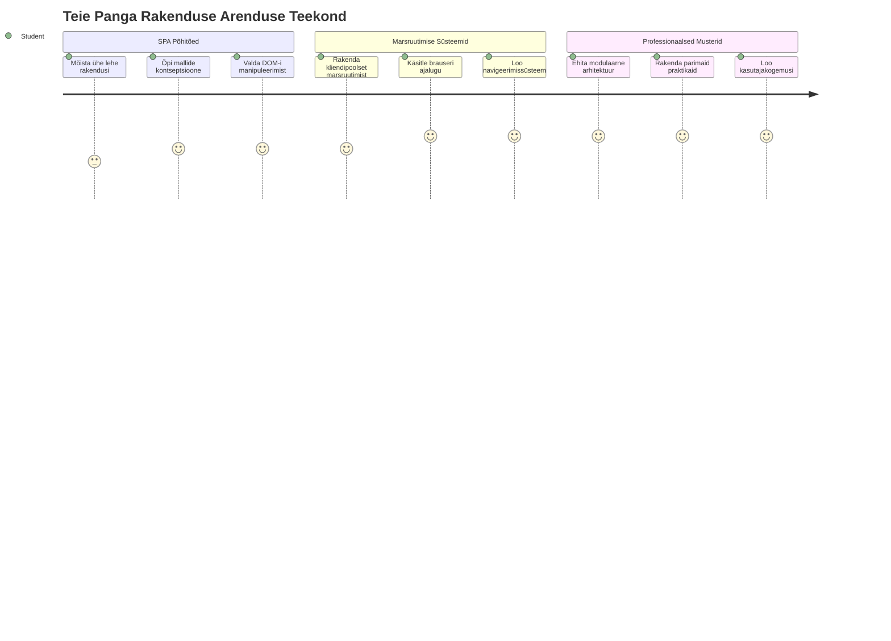
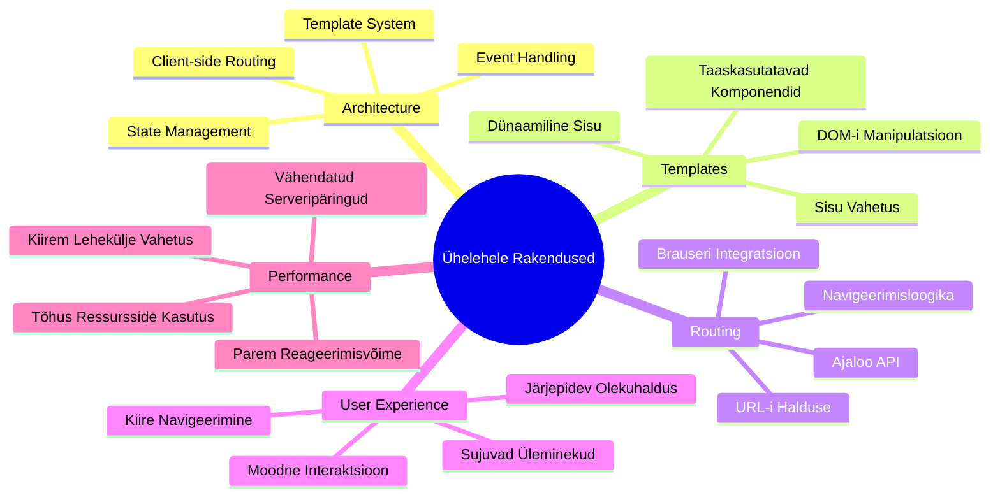
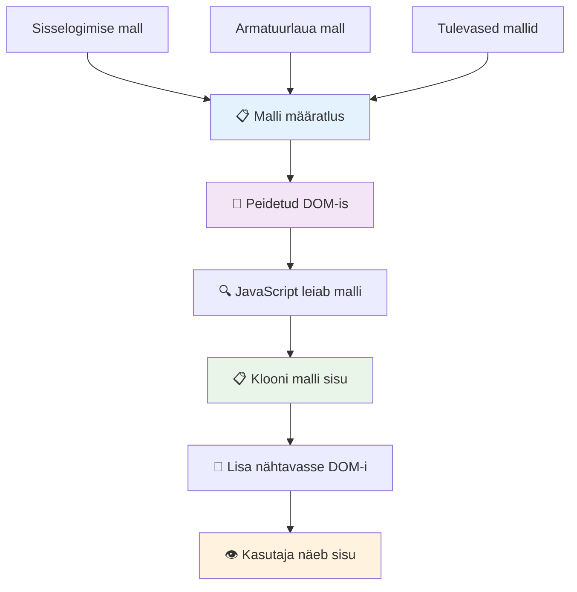
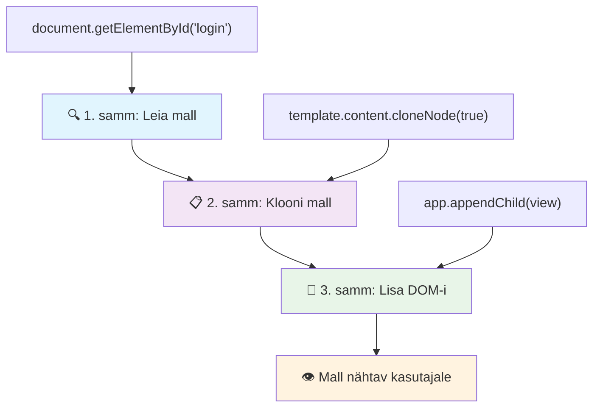
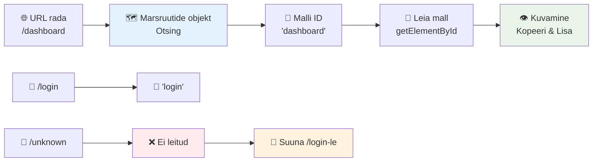
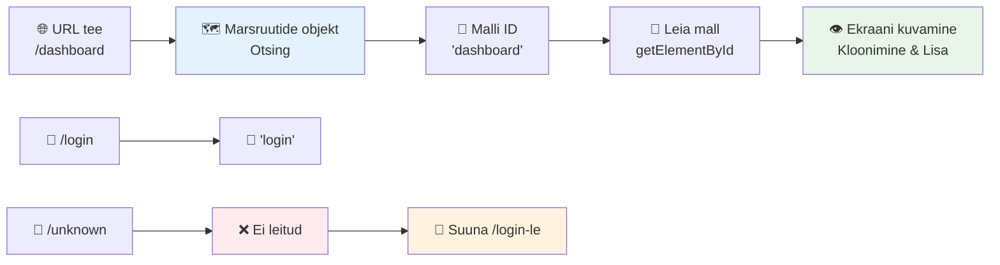
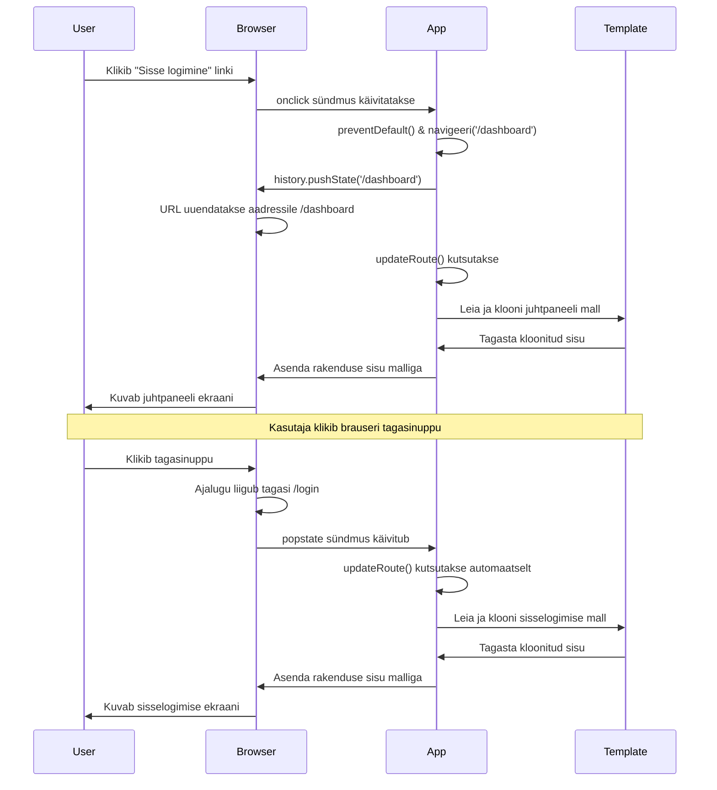
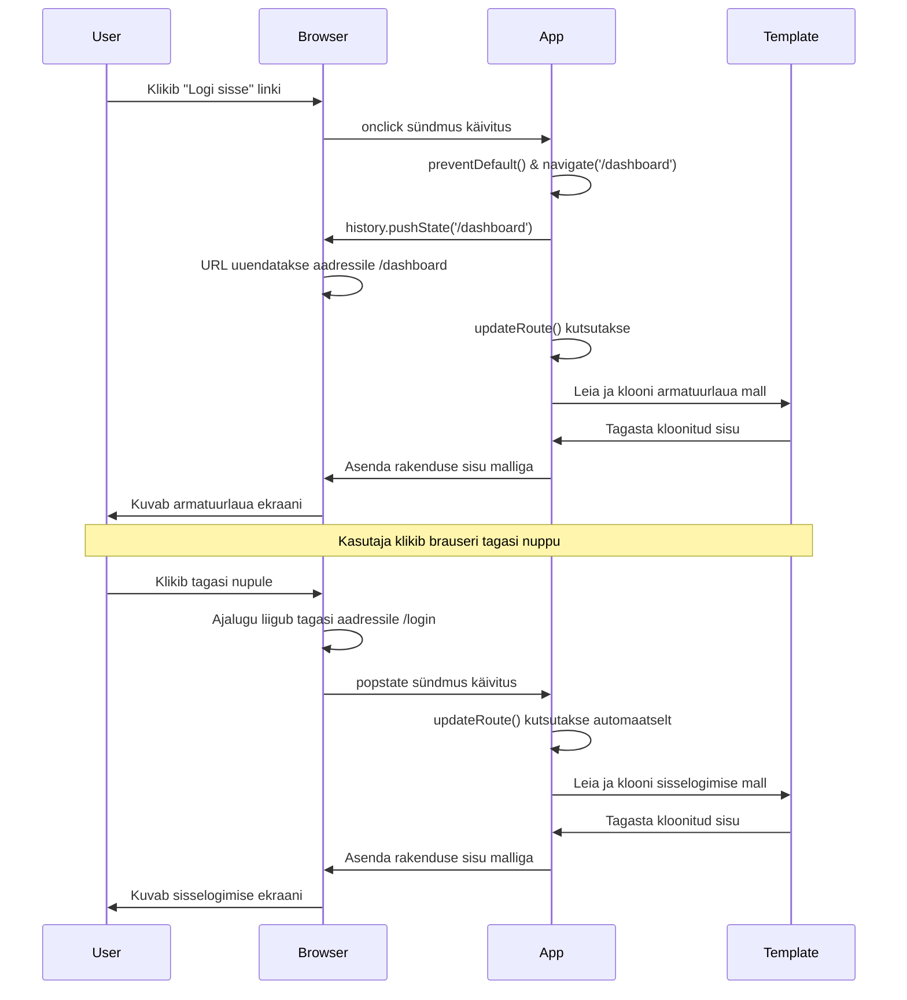
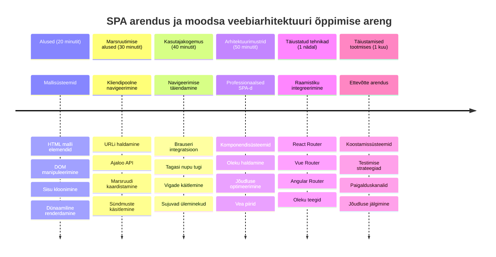

<!--
CO_OP_TRANSLATOR_METADATA:
{
  "original_hash": "351678bece18f07d9daa987a881fb062",
  "translation_date": "2026-01-08T09:33:36+00:00",
  "source_file": "7-bank-project/1-template-route/README.md",
  "language_code": "et"
}
-->
# Ehita pangarakendus osa 1: HTML mallid ja marsruudid veebirakenduses


Kui Apollo 11 juhtimisarvuti navigeeris 1969. aastal Kuule, pidi see lülituma erinevate programmide vahel ilma kogu süsteemi taaskäivitamata. Kaasaegsed veebirakendused töötavad sarnaselt – nad muudavad nähtavat sisu ilma kõike algusest laadimata. See loob sujuva, reageerimisvõimelise kogemuse, mida kasutajad täna ootavad.

Erinevalt traditsioonilistest veebisaitidest, mis laadivad iga toimingu puhul terve lehe uuesti, uuendavad kaasaegsed veebirakendused vaid vajalikke osi. See lähenemine, nagu missioonijuhtimine, mis vahetab ekraane, hoides samal ajal pidevat suhtlust, loob voolava kasutajakogemuse, mida oleme harjunud ootama.

Siin on, mis muudab vahe nii märkimisväärseks:

| Traditsioonilised mitmeleheküljelised rakendused | Kaasaegsed üheleheküljelised rakendused |
|----------------------------|-------------------------|
| **Navigatsioon** | Iga ekraani puhul kogu lehe uuesti laadimine | Kohene sisu vahetamine |
| **Tõhusus** | Aeglasem, kuna laaditakse kogu HTML | Kiirem, osaliste uuendustega |
| **Kasutajakogemus** | Lehe järsud välgatuse efektid | Sujuvad, rakendusetaolised üleminekud |
| **Andmete jagamine** | Raskendatud lehekülgede vahel | Lihtne oleku haldus |
| **Arendus** | Mitmed HTML failid haldamiseks | Üks HTML dünaamiliste mallidega |

**Evolutsiooni mõistmine:**
- **Traditsioonilised rakendused** nõuavad iga navigeerimise jaoks serveripäringut
- **Kaasaegsed SPAd** laadivad ühe korra ja uuendavad sisu dünaamiliselt JavaScripti abil
- **Kasutaja ootused** soosivad nüüd kohest ja sujuvat interaktsiooni
- **Tõhususe eelised** hõlmavad vähendatud andmeedastusmahtu ja kiirust

Selles õppetükis loome pangarakenduse mitme ekraaniga, mis sujuvalt üksteisega liituvad. Nagu teadlased kasutavad modulaarseid instrumente, mida saab katseteks ümber seadistada, kasutame ka HTML malle taaskasutatavate komponentidena, mida kuvatakse vastavalt vajadusele.

Sa töötad HTML mallide (taaskasutatavad ekraanide plaanid), JavaScripti marsruutimise (süsteem, mis lülitab ekraanide vahel) ja brauseri ajaloo API-ga (mis hoiab nupu „tagasi“ ootuspäraselt toimimas). Need on samad põhimõtted, mida kasutavad ka React, Vue ja Angular raamistiku lahendused.

Õppetüki lõpuks on sul toimiv pangarakendus, mis demonstreerib professionaalse üheleheküljelise rakenduse põhimõtteid.


## Eel-loengu viktoriin

[Eel-loengu viktoriin](https://ff-quizzes.netlify.app/web/quiz/41)

### Mida sul vaja läheb

Me vajame kohalikku veebiserverit, et testida meie pangarakendust – ära muretse, see on lihtsam kui kõlab! Kui sul veel pole paigaldatud, siis installi lihtsalt [Node.js](https://nodejs.org) ja käivita projektikaustas `npx lite-server`. See mugav käsklus käivitab kohalik serveri ja avab su rakenduse automaatselt brauseris.

### Ettevalmistus

Loo oma arvutis kaust nimega `bank` ja selle sisse fail `index.html`. Alustame sellest HTML [boilerplate’st](https://en.wikipedia.org/wiki/Boilerplate_code):

```html
<!DOCTYPE html>
<html lang="en">
  <head>
    <meta charset="UTF-8">
    <meta name="viewport" content="width=device-width, initial-scale=1.0">
    <title>Bank App</title>
  </head>
  <body>
    <!-- This is where you'll work -->
  </body>
</html>
```

**See boilerplate sisaldab:**
- **Määrab** HTML5 dokumendi struktuuri koos korrektse DOCTYPE deklaratsiooniga
- **Seab** märgistusena UTF-8 rahvusvahelise teksti toe
- **Lubab** mobiilisõbralikku disaini vaateakna meta-täpi abil
- **Seadistab** kirjeldusega tiitli, mis ilmub brauseri vahekaardil
- **Loodab** puhta body sektsiooni, kuhu ehitame oma rakenduse

> 📁 **Projekti struktuuri eelvaade**
> 
> **Selle õppetüki lõpuks sisaldab su projekt:**
> ```
> bank/
> ├── index.html      <!-- Main HTML with templates -->
> ├── app.js          <!-- Routing and navigation logic -->
> └── style.css       <!-- (Optional for future lessons) -->
> ```
> 
> **Failide ülesanded:**
> - **index.html**: sisaldab kõiki malle ja määrab rakenduse struktuuri
> - **app.js**: haldab marsruute, navigeerimist ja mallide juhtimist
> - **Mallid**: määratlevad sisselogimise, juhtpaneeli ja teiste ekraanide kasutajaliidese

---

## HTML mallid

Mallid lahendavad veebiarenduses põhiprobleemi. Kui Gutenberg leiutas 1440ndatel liikuvate trükikujutiste meetodi, mõistis ta, et terveid lehti pole vaja raiuda, vaid ta saab luua taaskasutatavad täheplokid ja korraldada neid vastavalt vajadusele. HTML mallid töötavad sama põhimõtte järgi – selle asemel, et teha iga ekraani jaoks eraldi HTML faile, defineerid taaskasutatavad struktuurid, mida saab vajadusel kuvada.


Mõtle mallidele kui plaanidele sinu rakenduse erinevate osade jaoks. Nii nagu arhitekt loob ühe plaani ja kasutab seda mitmel korral, selle asemel et joonistada identsed ruumid uuesti, loome ka mallid ühekordselt ja käivitame neid vastavalt vajadusele. Brauser hoiab need mallid peidetuna kuni JavaScript nad aktiveerib.

Kui tahad veebilehe jaoks luua mitu ekraani, võib üks lahendus olla igale ekraanile eraldi HTML faili tegemine. Kuid see lahendus toob kaasa mõned ebamugavused:

- Ekraani vahetades tuleb kogu HTML uuesti laadida, mis võib olla aeglane.
- Andmete jagamine erinevate ekraanide vahel on keeruline.

Teine lähenemine on kõigi ekraanide jaoks kasutada ühte HTML faili ja defineerida mitu [HTML malli](https://developer.mozilla.org/docs/Web/HTML/Element/template) `<template>` elemendi abil. Mall on taaskasutatav HTML plokk, mida brauser tavaliselt ei kuva ja mis tuleb runtime’is JavaScripti abil luua.

### Loome selle üles

Teeme pangarakenduse kahe põhiekraaniga: sisselogimise leht ja juhtpaneel. Esiteks lisame oma HTML kehasse placeholder-elemendi – siia kuvatakse kõik erinevad ekraanid:

```html
<div id="app">Loading...</div>
```

**Selle placeholderi mõistmine:**
- **Loodab** konteineri ID-ga "app", kuhu kuvatakse kõik ekraanid
- **Näitab** laadimissõnumit kuni JavaScript esimest ekraani käivitab
- **Tagab** ühe monumendi meie dünaamilisele sisule
- **Võimaldab** lihtsat sihtimist JavaScriptil `document.getElementById()` abil

> 💡 **Näpunäide:** Kuna selle elemendi sisu asendatakse, võid panna siia laadimise sõnumi või indikaatori, mis näidatakse rakenduse laadimisel.

Järgmisena lisame HTML malli sisselogimislehe jaoks. Praegu paneme sinna ainult pealkirja ja sektsiooni, kus on link navigeerimiseks.

```html
<template id="login">
  <h1>Bank App</h1>
  <section>
    <a href="/dashboard">Login</a>
  </section>
</template>
```

**Selle sisselogimise malli lahtiseletus:**
- **Defineerib** mallina unikaalse ID-ga "login" JavaScripti sihtimiseks
- **Sisaldab** põhielementi, mis kehtestab rakenduse brändingu
- **Omab** semantilist `<section>` elementi seotud sisu rühmitamiseks
- **Pakub** navigeerimislinki, mis viib kasutaja juhtpaneelile

Seejärel lisame teise HTML malli juhtpaneeli jaoks. See leht sisaldab erinevaid sektsioone:

- Päis pealkirja ja väljalogimislingiga
- Hetke pangakonto saldo
- Tehingute nimekiri, kuvatud tabelis

```html
<template id="dashboard">
  <header>
    <h1>Bank App</h1>
    <a href="/login">Logout</a>
  </header>
  <section>
    Balance: 100$
  </section>
  <section>
    <h2>Transactions</h2>
    <table>
      <thead>
        <tr>
          <th>Date</th>
          <th>Object</th>
          <th>Amount</th>
        </tr>
      </thead>
      <tbody></tbody>
    </table>
  </section>
</template>
```

**Seda juhtpaneeli osa mõistmine:**
- **Struktureerib** lehte semantilise `<header>` elemendiga koos navigatsiooniga
- **Kuvab** rakenduse pealkirja ühtselt kõigil ekraanidel brändingu tarbeks
- **Pakub** väljalogimislinki, mis suunab tagasi sisselogimisse
- **Näitab** hetke konto saldot eraldi sektsioonis
- **Korraldab** tehingute andmed korrektselt vormindatud HTML tabelis
- **Defineerib** tabeli päised Kuupäeva, Objekti ja Summa jaoks
- **Jätab** tabeli keha tühjaks dünaamilise sisu lisamiseks hiljem

> 💡 **Näpunäide:** HTML mallide loomisel, kui tahad näha, milline see välja näeb, võid `<template>` ja `</template>` reeglid kommenteerida `<!-- -->` abil.

### 🔄 **Pedagoogiline kontroll**
**Mallide süsteemi mõistmine:** Enne JavaScripti rakendamist veendu, et sa mõistad:
- ✅ Kuidas mallid erinevad tavalistest HTML elementidest
- ✅ Miks mallid jäävad peidetuks kuni JavaScript neid aktiveerib
- ✅ Semantilise HTML struktuuri tähtsus malle luues
- ✅ Kuidas mallid võimaldavad taaskasutatavaid kasutajaliidese komponente

**Kiire enesekontroll:** Mis juhtub, kui eemaldada oma HTML ümbert `<template>` sildid?
*Vastus: sisu muutub koheselt nähtavaks ja kaotab oma malle funktsionaalsuse*

**Arhitektuuri eelised:** Mallid annavad:
- **Taaskasutuse:** üks määratlus, mitu eksemplari
- **Tõhususe:** pole ebaolulist HTML parsimist
- **Haldatavuse:** tsentraliseeritud kasutajaliidese struktuur
- **Paindlikkuse:** dünaamiline sisu vahetamine

✅ Miks sa arvad, et kasutame mallidel `id` atribuute? Kas võiksime kasutada ka klasse?

## Mallide elluäratamine JavaScriptiga

Nüüd peame muutma oma mallid funktsionaalseks. Nii nagu 3D printer võtab digitaalse plaani ja loob füüsilise objekti, võtab JavaScript meie peidetud mallid ja tekitab nähtavad, interaktiivsed elemendid, mida kasutajad saavad näha ja kasutada.

Protsess koosneb kolmest ühtsest etapist, mis on tänapäevase veebiarenduse alus. Kui mõistad seda mustrit, tunned selle ära paljudes raamistikudes ja teekides.

Kui proovid oma praegust HTML faili brauseris, näed, et kuvatakse ainult `Loading...`. See on sellepärast, et peame lisama mõne JavaScripti koodi, mis mallid käivitab ja kuvab.

Malli käivitamine toimub tavaliselt kolmes etapis:

1. Leia mallielement DOM-ist, näiteks kasutades [`document.getElementById`](https://developer.mozilla.org/docs/Web/API/Document/getElementById).
2. Kopeeri mallielement, kasutades [`cloneNode`](https://developer.mozilla.org/docs/Web/API/Node/cloneNode).
3. Lisa see nähtava elemendi alla DOM-i näiteks kasutades [`appendChild`](https://developer.mozilla.org/docs/Web/API/Node/appendChild).


**Visuaalne protsessi lahtiseletus:**
- **1. samm** leiab peidetud malli DOM struktuurist
- **2. samm** loob töötava koopia, mida saab ohutult muuta
- **3. samm** lisab koopia nähtavasse lehe ossa
- **Tulemus** on funktsionaalne ekraan, millega kasutajad saavad suhelda

✅ Miks peame enne malli lisamist DOM-ile kopeerima? Mis juhtuks, kui seda sammu vahele jätta?

### Ülesanne

Loo oma projekti kausta uus fail nimega `app.js` ja impordi see fail oma HTML `<head>` sektsiooni:

```html
<script src="app.js" defer></script>
```

**Selle skripti impordi mõistmine:**
- **Seob** JavaScripti faili meie HTML dokumendiga
- **Kasutab** `defer` atribuuti, et tagada skripti käivitumine peale HTML parsimise lõpetamist
- **Lubab** juurdepääsu kõigile DOM elementidele, sest need on enne skripti käivitamist täielikult laetud
- **Järgis** kaasaegseid parimaid tavasid skriptide laadimisel ja jõudlusel

Nüüd loome `app.js` failis uue funktsiooni `updateRoute`:

```js
function updateRoute(templateId) {
  const template = document.getElementById(templateId);
  const view = template.content.cloneNode(true);
  const app = document.getElementById('app');
  app.innerHTML = '';
  app.appendChild(view);
}
```

**Samm-sammult, mis toimub:**
- **Leiab** malli elemendi unikaalse ID abil
- **Loomistab** sügava koopia malli sisust kasutades `cloneNode(true)`
- **Leiab** konteineri, kuhu sisu kuvatakse
- **Tühjendab** olemasoleva sisu konteinerist
- **Lisab** kloonitud malli sisu nähtavasse DOM-i

Kutsu nüüd see funktsioon ühe malliga ja vaata tulemust.

```js
updateRoute('login');
```

**Mida see funktsioonikõne teeb:**
- **Aktiveerib** sisselogimise malli, saates selle ID parameetrina
- **Demonstreerib** kuidas programmeeritult lülituda erinevate rakenduse ekraanide vahel
- **Kuvab** sisselogimisekraani „Loading...“ asemel

✅ Mis on selle koodi `app.innerHTML = '';` eesmärk? Mis juhtub, kui see puudub?

## Marsruutide loomine

Marsruutimine tähistab URL-ide sidumist õigete sisudega. Mõtle varajastele telefonitöötajatele, kes kasutasid keskjaamu kõnede ühendamiseks – nad võtsid saabunud kõne ja suunasid selle õigele sihtkohale. Veebimarsruutimine toimib samamoodi, võttes URL päringu ja määrates, millist sisu kuvada.


Traditsiooniliselt korraldasid veebiserverid selle, serveerides eri URL-idele erinevaid HTML-faile. Kuna meie ehitame üheleheküljelist rakendust (SPA), peame selle marsruutimise ise JavaScriptiga haldama. See annab meile parema kontrolli kasutajakogemuse ja jõudluse üle.


**Marsruutimise voo mõistmine:**
- **URL muutused** kutsuvad esile marsruudi otsingu meie konfiguratsioonist
- **Kehtivad marsruudid** seovad konkreetsete mallide ID-dega renderdamiseks
- **Kehtetud marsruudid** toovad esile varuplaani rikete vältimiseks
- **Mallide renderdamine** järgib eelnevalt õpitud kolmesammulist protsessi

Kui rääkida veebirakendusest, siis marsruutimise all mõtleme **URL-ide** sidumist konkreetsete ekraanidega, mida kuvatakse. Lehekülgedel, kus on mitu HTML faili, tehakse see automaatselt, kuna failiteed kajastuvad URL-is. Näiteks kui sul on projektikaustas need failid:

```
mywebsite/index.html
mywebsite/login.html
mywebsite/admin/index.html
```

Kui lood veebiserveri juureks kausta `mywebsite`, on URL kaardistus selline:

```
https://site.com            --> mywebsite/index.html
https://site.com/login.html --> mywebsite/login.html
https://site.com/admin/     --> mywebsite/admin/index.html
```

Kuid meie veebirakenduses kasutame ühte HTML faili kõigi ekraanidega, nii et see vaikimisi käitumine ei sobi. Peame selle kaardi ise looma ja kuvamise mallide vahetamise JavaScriptiga tegema.

### Ülesanne

Kasutame lihtsat objekti, et implementeerida [kaart](https://en.wikipedia.org/wiki/Associative_array) URL tee ja mallide vahel. Lisa see objekt oma `app.js` faili algusesse.

```js
const routes = {
  '/login': { templateId: 'login' },
  '/dashboard': { templateId: 'dashboard' },
};
```

**Selle marsruutide konfiguratsiooni mõistmine:**
- **Defineerib** URL tee ja malli identifikaatorite vahelist kaardistust
- **Kasutab** objekti süntaksit, kus võtmed on URL teed ja väärtused sisaldavad malli infot
- **Võimaldab** hõlpsat otsingut, millist malli kuvada etteantud URL-i puhul
- **Annab** lihtsasti laiendatava struktuuri uute marsruutide lisamiseks tulevikus
Muudame natuke `updateRoute` funktsiooni. Selle asemel, et edastada `templateId` otse argumendina, tahame selle esmalt saada praegusest URL-ist ja seejärel kasutada meie kaarti vastava malli ID väärtuse saamiseks. Saame kasutada [`window.location.pathname`](https://developer.mozilla.org/docs/Web/API/Location/pathname), et saada URL-ist ainult tee osa.

```js
function updateRoute() {
  const path = window.location.pathname;
  const route = routes[path];

  const template = document.getElementById(route.templateId);
  const view = template.content.cloneNode(true);
  const app = document.getElementById('app');
  app.innerHTML = '';
  app.appendChild(view);
}
```

**Mis siin toimub, samm-sammult:**
- **Eristab** brauseri URL-ist praeguse tee, kasutades `window.location.pathname`
- **Otsib üles** sobiva marsruudi konfiguratsiooni meie routes objektist
- **Hangib** mallide ID marsruudi konfiguratsioonist
- **Järgib** sama mallide renderdamise protsessi nagu varem
- **Loo** dünaamiline süsteem, mis reageerib URL-i muutustele

Siin sidusime deklareeritud marsruudid vastavate mallidega. Saate proovida, kas see töötab korrektselt, muutes URL-i käsitsi oma brauseris.

✅ Mis juhtub, kui sisestate URL-i tundmatu tee? Kuidas saaksime seda lahendada?

## Navigeerimise lisamine

Pärast marsruutimise seadistamist vajavad kasutajad võimalust rakenduses navigeerida. Traditsioonilised veebilehed laadivad lingile klõpsates kogu lehe uuesti, kuid me tahame uuendada nii URL-i kui sisu ilma lehe värskenduseta. See loob sujuvama kogemuse, sarnaselt sellele, kuidas töölauarakendused vahetavad erinevaid vaateid.

Me peame koordineerima kahte asja: uuenda brauseri URL nii, et kasutajad saaksid lehti järjehoidjatesse lisada ja linke jagada, ning kuvada sobiv sisu. Kui see on korrektselt rakendatud, loob see sujuva navigeerimise, mida kasutajad tänasest ootavad.


### 🔄 **Pedagoogiline kontroll**
**Ühe lehe rakenduse arhitektuur**: Kontrolli oma arusaamist kogu süsteemist:
- ✅ Kuidas erineb kliendipoolne marsruutimine traditsioonilisest serveripoolsest marsruutimisest?
- ✅ Miks on History API vajalik õige SPA navigeerimiseks?
- ✅ Kuidas võimaldavad mallid dünaamilist sisu ilma lehe laadimiseta?
- ✅ Millist rolli mängib sündmuste töötlemine navigeerimise peatamisel?

**Süsteemi integratsioon**: Teie SPA demonstreerib:
- **Malli haldus**: Taaskasutatavad UI komponendid dünaamilise sisuga
- **Kliendipoolne marsruutimine**: URL-i haldamine ilma serveripäringuteta
- **Sündmustepõhine arhitektuur**: Responeeruv navigeerimine ja kasutajategevused
- **Brauseri integratsioon**: Ajaloo ja tagasi/edasi nupu korrektne tugi
- **Jõudluse optimeerimine**: Kiired üleminekud ja vähendatud serverikoormus

**Professionaalsed mustrid**: Sa oled rakendanud:
- **Mudeli-vaate eraldamine**: Mallid eraldatud rakendusloogikast
- **Oleku haldus**: URL-i olek sünkroonitud kuvatava sisuga
- **Järk-järguline täiustamine**: JavaScript täiustab põhilist HTML funktsionaalsust
- **Kasutajakogemus**: Sujuv rakenduslik navigeerimine ilma lehe värskenduseta

> � **Arhitektuuri vaatenurk**: Navigeerimissüsteemi komponendid
>
> **Mida ehitad:**
> - **🔄 URL-i haldus**: Värskendab brauseri aadressiriba ilma lehte laadimata
> - **📋 Mallisüsteem**: Vahetab sisaldust dünaamiliselt vastavalt praegusele marsruudile  
> - **📚 Ajaloo integreerimine**: Säilitab tagasi/edasi nupu funktsionaalsuse
> - **🛡️ Veahaldus**: Õrnad tagasipõrked vigaste või puuduvate marsruutide puhul
>
> **Kuidas komponendid koos töötavad:**
> - **Kuulab** navigeerimise sündmusi (klõpsud, ajaloo muutused)
> - **Uuendab** URL-i History API abil
> - **Renderdab** vastava malli uue marsruudi jaoks
> - **Hoidab** sujuva kasutajakogemuse kogu protsessi vältel

Meie järgmine samm rakenduses on lisada võimalus navigeerida lehtede vahel ilma URL-i käsitsi muutmata. Selleks peame tegema kahte asja:

  1. Uuendama praegust URL-i
  2. Uuendama kuvatavat malli uue URL-i põhjal

Teise osaga tegeleme juba funktsiooniga `updateRoute`, nii et peame välja selgitama, kuidas uuendada praegust URL-i.

Peame kasutama JavaScripti ja täpsemalt [`history.pushState`](https://developer.mozilla.org/docs/Web/API/History/pushState), mis võimaldab uuendada URL-i ja luua uue kirje sirvimisajalukku ilma HTML-i uuesti laadimata.

> ⚠️ **Oluline märkus**: Kuigi HTML-i ankruelementi [`<a href>`](https://developer.mozilla.org/docs/Web/HTML/Element/a) saab kasutada linkide loomiseks erinevatesse URL-idesse, paneb see brauseri vaikimisi laadima kogu HTML-i uuesti. Seda käitumist tuleb marsruutimise käsitlemisel kohandatud JavaScriptiga vältida, kasutades klõpsusündmuse peatumiseks funktsiooni preventDefault().

### Ülesanne

Loome uue funktsiooni, mida saame kasutada navigeerimiseks meie rakenduses:

```js
function navigate(path) {
  window.history.pushState({}, path, path);
  updateRoute();
}
```

**Mida see navigeerimisfunktsioon teeb:**
- **Uuendab** brauseri URL-i uue tee suhtes kasutades `history.pushState`
- **Lisab** uue kirje brauseri ajaloo virna, tagamaks tagasi/edasi nupu toe
- **Käivitab** funktsiooni `updateRoute()`, et kuvada vastav mall
- **Hoidab** ühe lehe rakenduse kogemuse ilma lehe värskenduseta

See meetod uuendab esmalt praeguse URL-i sisendi kaudu ja seejärel uuendab malli. Atribuut `window.location.origin` tagastab URL-i juure, võimaldades meil rekonstrueerida komplekti URL-i antud tee baasil.

Nüüd, kui meil on see funktsioon olemas, saame lahendada probleemi, mis tekib, kui tee ei vasta ühelegi määratletud marsruudile. Muudame `updateRoute` funktsiooni, lisades tagavara marsruudi ühe olemasoleva marsruudi juures, kui vasteid ei leita.

```js
function updateRoute() {
  const path = window.location.pathname;
  const route = routes[path];

  if (!route) {
    return navigate('/login');
  }

  const template = document.getElementById(route.templateId);
  const view = template.content.cloneNode(true);
  const app = document.getElementById('app');
  app.innerHTML = '';
  app.appendChild(view);
}
```

**Olulised punktid, mida meeles pidada:**
- **Kontrollib**, kas praeguse tee jaoks on vastav marsruut olemas
- **Suunab ümber** sisselogimise lehele, kui pääsedakse vigasele marsruudile
- **Pakub** tagavaramehhanismi, mis hoiab ära katkise navigeerimise
- **Tagab**, et kasutajad näevad alati kehtivat lehte, isegi valede URL-idega

Kui marsruuti ei leita, suuname nüüd kasutaja lehele `login`.

Nüüd loome funktsiooni, mis hangib URL-i lingi klõpsamisel ja takistab brauseri vaikimisi lingikäitumist:

```js
function onLinkClick(event) {
  event.preventDefault();
  navigate(event.target.href);
}
```

**Mis toimub selles klõpsukäsitlejas:**
- **Takistab** brauseri vaikimisi lingikäitumist, kasutades `preventDefault()`
- **Eristab** sihtkoha URL-i klõpsatud lingielemendist
- **Kutsume** meie kohandatud navigeerimisfunktsiooni välja lehe uuesti laadimise asemel
- **Hoidab** sujuva ühe lehe rakenduse kogemuse

```html
<a href="/dashboard" onclick="onLinkClick(event)">Login</a>
...
<a href="/login" onclick="onLinkClick(event)">Logout</a>
```

**Mida see onclick sidumine saavutab:**
- **Ühendab** iga lingi meie kohandatud navigeerimissüsteemiga
- **Edastab** klõpsusündmuse meie funktsioonile `onLinkClick` töötlemiseks
- **Võimaldab** sujuvat navigeerimist ilma lehe laadimiseta
- **Hoidab** korrektset URL-i struktuuri, mida kasutajad saavad järjehoidjatesse lisada või jagada

Attribuut [`onclick`](https://developer.mozilla.org/docs/Web/API/GlobalEventHandlers/onclick) seob `click` sündmuse JavaScripti koodiga, siin kutsudes välja funktsiooni `navigate()`.

Proovige klõpsata nendel linkidel, peaksite nüüd saama navigeerida oma rakenduse erinevate ekraanide vahel.

✅ Meetod `history.pushState` on osa HTML5 standardist ning toetatud [kõigis moodsates brauserites](https://caniuse.com/?search=pushState). Kui ehitate veebirakendust vanemate brauserite jaoks, saate selle API asemel kasutada trikki: kasutades tee ees [räsimärki (`#`)](https://en.wikipedia.org/wiki/URI_fragment) saate rakendada marsruutimist, mis töötab tavalise ankrunavigatsiooni korral ja ei lae lehte uuesti, kuna selle eesmärk oli luua sisemised lingid ühelt lehelt teisele.

## Tagasi ja Edasi nupu töölepanek

Tagasi ja edasi nupud on veebisirvimise alustalad, sarnaselt sellele, kuidas NASA missioonikontrollid saavad kosmosemissiooni ajal vaadata varasemaid süsteemi olekuid. Kasutajad ootavad nende nuppude korrektset tööd, ja kui need ei tööta, rikub see ootuspärase sirvimiskogemuse.

Meie ühe lehe rakendus vajab täiendavat seadistust selle toetamiseks. Brauser hoiab ajaloo virna (mida me oleme täitnud funktsiooniga `history.pushState`), aga kui kasutajad neid nuppe kasutavad, peab meie rakendus reageerima, uuendades kuvatavat sisu vastavalt.


**Olulised suhtluspunktid:**
- **Kasutajate tegevused** põhjustavad navigeerimist klõpsude või brauserinuppude abil
- **Rakendus lõikab läbi** lingiklikid, et vältida lehe laadimist
- **History API** haldab URL-i muutusi ja brauseriajalugu
- **Mallid** annavad sisu struktuuri iga ekraani jaoks
- **Sündmuste kuulajad** tagavad, et rakendus reageerib igat tüüpi navigeerimisele

Funktsioon `history.pushState` loob uusi kirjeid brauseri ajaloos. Seda näeb, kui hoiate all oma brauseri *tagasi-nuppu*, mis peaks kuvama midagi sellist:


Kui proovite tunnustada tagasi-nuppu mitu korda, näete, et praegune URL muutub ja ajalugu uuendatakse, kuid sama mall jääb kuvatuks.

Sellepärast, et rakendus ei tea, et meil tuleb kõigil ajaloo muutustel kutsuda `updateRoute()` funktsiooni. Vaadates [`history.pushState` dokumentatsiooni](https://developer.mozilla.org/docs/Web/API/History/pushState), näete, et kui olek muutub – mis tähendab, et liikusime uude URL-i – vallandub [`popstate`](https://developer.mozilla.org/docs/Web/API/Window/popstate_event) sündmus. Me kasutame seda probleemi parandamiseks.

### Ülesanne

Veendumaks, et kuvatav mall uuendatakse brauseriajaloo muutudes, lisame uue funktsiooni, mis kutsub välja `updateRoute()`. Teeme seda faili `app.js` allosas:

```js
window.onpopstate = () => updateRoute();
updateRoute();
```

**Mida see ajaloo integreerimine tähendab:**
- **Kuulab** `popstate` sündmusi, mis toimuvad brauseri nuppudega navigeerimisel
- **Kasutab** noolefunktsiooni lühikese sündmusekäsitleja süntaksi jaoks
- **Kutsutakse** `updateRoute()` automaatselt iga ajaloo oleku muutumise korral
- **Algatatakse** rakendus, kutsudes `updateRoute()` välja lehe laadimisel
- **Tagab** õige malli kuvamise olenemata navigeerimise viisist

> 💡 **Nipp**: Kasutasime siin [noolefunktsiooni](https://developer.mozilla.org/docs/Web/JavaScript/Reference/Functions/Arrow_functions), et deklareerida `popstate` sündmuse käsitleja lühemalt, aga ka tavaline funktsioon toimiks sama hästi.

Siin on värske video noolefunktsioonidest:

[](https://youtube.com/watch?v=OP6eEbOj2sc "Noolefunktsioonid")

> 🎥 Klõpsa ülalolevale pildile, et vaadata videot noolefunktsioonidest.

Proovige nüüd kasutada oma brauseri tagasi ja edasi nuppe, ja kontrollige, et kuvatav marsruut on seekord korrektselt uuendatud.

### ⚡ **Mida saad järgnevate 5 minutiga teha**
- [ ] Testi oma pangarakenduse navigeerimist brauseri tagasi/edasi nuppudega
- [ ] Proovi käsitsi erinevaid URL-e aadressiribale kirjutades juhtida marsruutimist
- [ ] Ava brauseri DevTools ja vaata, kuidas mallid kloneeritakse DOM-i
- [ ] Katseta `console.log` lisamist marsruutimise voo jälgimiseks

### 🎯 **Mida saad selle tunni jooksul saavutada**
- [ ] Täida õppetunni lõpus olev viktoriin ja mõista SPA arhitektuuri kontseptsioone
- [ ] Lisa CSS kujundus, et teha oma pangarakenduse mallid professionaalseks
- [ ] Rakenda 404 vealeht koos korrapärase veahaldusega
- [ ] Loo tänuleht koos täiendava marsruutimise funktsionaalsusega
- [ ] Lisa laadimise olekud ja sujuvad üleminekud mallide vahel

### 📅 **Sinu nädala pikkune SPA arenduse teekond**
- [ ] Valmista kogu pangarakendus koos vormide, andmehalduste ja püsimisega
- [ ] Lisa keerukamaid marsruutimise võimalusi nagu marsruudi parameetrid ja pesastatud marsruudid
- [ ] Rakenda navigeerimiskaitseid ja autentimispõhist marsruutimist
- [ ] Loo taaskasutatavad mallikomponendid ja komponentide teek
- [ ] Lisa animatsioonid ja üleminekud sujuvamaks kasutajakogemuseks
- [ ] Paiguta oma SPA hostimisplatvormile ja seadista marsruutimine korralikult

### 🌟 **Sinu kuu pikkune frontend arhitektuuri meistriklass**
- [ ] Ehita keerukaid SPA-sid kasutades moodsaid raamistikke nagu React, Vue või Angular
- [ ] Õpi edasiarenenud olekuhalduse mustreid ja raamatukogusid
- [ ] Saa meisterlikuks ehitustööriistade ja arendusvoogude kasutamises SPA arenduses
- [ ] Rakenda progressiivse veebirakenduse funktsioone ja võrguühenduseta kasutusvõimalusi
- [ ] Uuri jõudluse optimeerimise tehnikaid suurte SPA-de jaoks
- [ ] Panusta avatud lähtekoodiga SPA projektidesse ja jaga oma teadmisi

## 🎯 Sinu ühe lehe rakenduse meistriklassi ajakava


### 🛠️ Sinu SPA arendustööriistade kokkusaare

Pärast selle õppetunni lõpetamist oled meistriks saanud:
- **Malli arhitektuur**: Taaskasutatavad HTML komponendid dünaamilise sisuga
- **Kliendipoolne marsruutimine**: URL-i haldamine ja navigeerimine ilma lehe laadimiseta
- **Brauseri integratsioon**: History API kasutamine ja tagasi/edasi nupu tugi
- **Sündmustepõhised süsteemid**: Navigeerimise ja kasutajategevuste haldamine
- **DOM-i manipuleerimine**: Mallide kloonimine, sisu vahetamine ja elementide haldus
- **Veahaldus**: Õrnad tagasipõrked vigaste marsruutide ja puuduvate sisude korral
- **Jõudluse mustrid**: Tõhus sisu laadimine ja renderdamisstrateegiad

**Reaalmaailma rakendused**: Sinu SPA arendusoskused kehtivad otse:
- **Moodsa veebirakendustena**: React, Vue, Angular ja teiste raamistikute arendus
- **Progressiivsete veebirakendustena**: Võimalus töötada võrguühenduseta ja läbi rakendusliku kogemuse
- **Ettevõtte juhtpaneelid**: Keerukad ärirakendused mitme vaatega
- **E-kaubanduse platvormid**: Toodete kataloogid, ostukorvid ja kassavood
- **Sisuthaldus**: Dünaamiline sisu loomine ja redigeerimine
- **Mobiiliarendus**: Hübriidrakendused veebitehnoloogiate baasil

**Saadud professionaalsed oskused**: Sa suudad nüüd:
- **Arhitekteeri** ühe lehe rakendused nõuetekohase vastutuse lahutusega  
- **Rakenda** klient-poolseid marsruutimise süsteeme, mis skaleeruvad rakenduse keerukusega  
- **Siluri** keerukaid navigeerimisvooge brauseri arendajatööriistade abil  
- **Optimeeri** rakenduse jõudlust tõhusa mallihalduse kaudu  
- **Disaini** kasutajakogemusi, mis tunduvad loomulikud ja reageerivad  

**Valdab Frontendi Arenduse Põhimõtteid**:  
- **Komponendi Arhitektuur**: Taaskasutatavad kasutajaliidese mustrid ja mallisüsteemid  
- **Oleku Sünkroniseerimine**: URL-i oleku haldamine ja brauseri ajalugu  
- **Sündmuspõhine Programmeerimine**: Kasutajate interaktsioonide käsitlemine ja navigeerimine  
- **Jõudluse Optimeerimine**: Tõhus DOM-i manipuleerimine ja sisu laadimine  
- **Kasutajakogemuse Disain**: Sujuvad üleminekud ja intuitiivne navigeerimine  

**Järgmine tase**: Oled valmis avastama kaasaegseid frontend raamistikuid, täiustatud oleku haldust või ehitama keerukaid ettevõtte rakendusi!  

🌟 **Saavutus avatud**: Oled loonud professionaalse ühe lehe rakenduse aluse kaasaegsete veebiarhitektuuri mustritega!  

---

## GitHub Copilot Agendi Väljakutse 🚀

Kasutage Agendi režiimi, et täita järgmine väljakutse:

**Kirjeldus:** Täienda pangarakendust, rakendades veakäsitlust ja 404 lehe mall, mis parandab kasutajakogemust vigaste marsruutide korral.

**Juhis:** Loo uus HTML mall id-ga "not-found", mis kuvab kasutajasõbraliku 404 vealehe koos stiilidega. Muuda seejärel JavaScripti marsruutimise loogikat nii, et see mall kuvatakse, kui kasutajad navigeerivad kehtetutele URL-idele, ning lisa "Go Home" nupp, mis viib tagasi sisselogimislehele.  

Lisateavet leiad [agent mode](https://code.visualstudio.com/blogs/2025/02/24/introducing-copilot-agent-mode) kohta.  

## 🚀 Väljakutse

Lisa uus mall ja marsruut kolmandale lehele, mis kuvab selle rakenduse krediiti.

**Väljakutse eesmärgid:**  
- **Loo** uus HTML mall asjakohase sisustruktuuriga  
- **Lisa** uus marsruut routes konfiguratsiooni objekti  
- **Lisa** navigeerimislingid krediidile ja krediidilt tagasi  
- **Testi**, et kogu navigeerimine töötab korrektselt brauseri ajaloo abil  

## Loengujärgne test

[Loengujärgne test](https://ff-quizzes.netlify.app/web/quiz/42)  

## Ülevaade & Isetudeng

Marsruutimine on üks üllatavalt keerulisi veebiarenduse osi, eriti kuna veeb liigub lehe värskendustest ühe lehe rakenduste lehe värskendusteni. Loe natuke, kuidas [Azure Static Web App teenus](https://docs.microsoft.com/azure/static-web-apps/routes/?WT.mc_id=academic-77807-sagibbon) marsruutimist käsitleb. Kas suudad selgitada, miks mõned selles dokumendis kirjeldatud otsused on vajalikud?  

**Lisamaterjalid:**  
- **Uuri**, kuidas populaarsed raamistikud nagu React Router ja Vue Router teostavad klient-poolset marsruutimist  
- **Uuri** hash-põhise marsruutimise ja history API marsruutimise erinevusi  
- **Õpi** serveripoolse renderdamise (SSR) kohta ja selle mõju marsruutimisstrateegiatele  
- **Uuri**, kuidas Progressiivsed Veebirakendused (PWA-d) käsitlevad marsruutimist ja navigeerimist  

## Kodutöö  

[Paranda marsruutimist](assignment.md)

---

<!-- CO-OP TRANSLATOR DISCLAIMER START -->
**Vastutusest loobumine**:
See dokument on tõlgitud tehisintellektil põhineva tõlketeenuse [Co-op Translator](https://github.com/Azure/co-op-translator) abil. Kuigi me pingutame täpsuse nimel, palun arvestage, et automaatsed tõlked võivad sisaldada vigu või ebatäpsusi. Originaaldokument selle algses keeles tuleks lugeda autoriteetseks allikaks. Olulise teabe korral soovitatakse professionaalset inimtõlget. Me ei vastuta selle tõlke kasutamisest tekkida võivate arusaamatuste või valesti mõistmiste eest.
<!-- CO-OP TRANSLATOR DISCLAIMER END -->