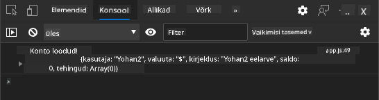
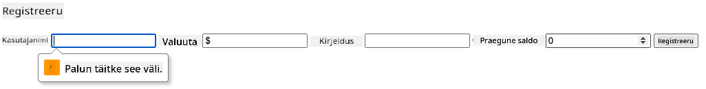
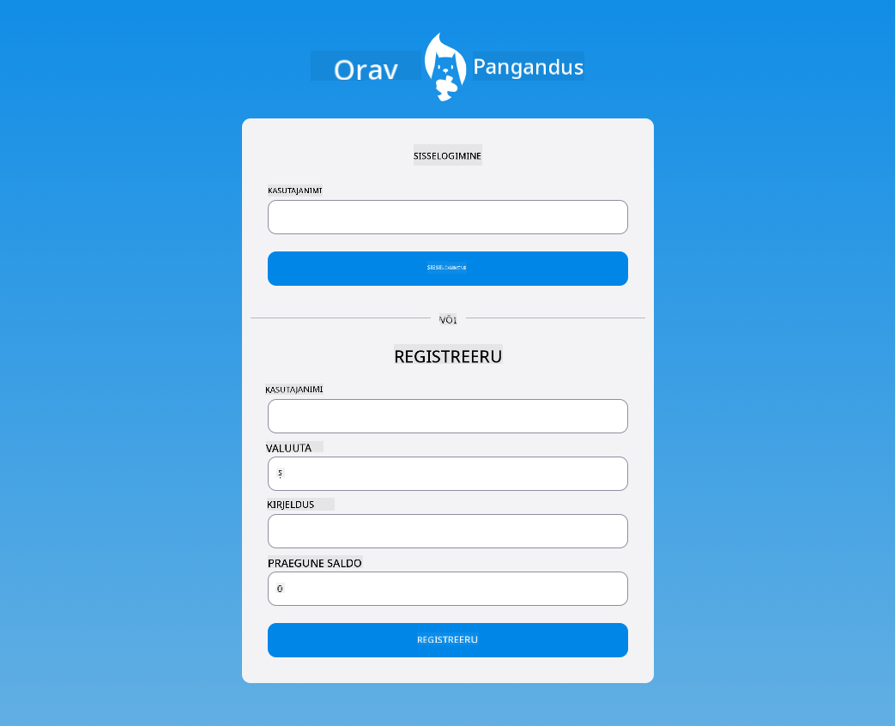

<!--
CO_OP_TRANSLATOR_METADATA:
{
  "original_hash": "8baca047d77a5f43fa4099c0578afa42",
  "translation_date": "2025-10-11T12:07:06+00:00",
  "source_file": "7-bank-project/2-forms/README.md",
  "language_code": "et"
}
-->
# Pangaäpi loomine, 2. osa: Sisselogimise ja registreerimisvormi loomine

## Eelloengu viktoriin

[Eelloengu viktoriin](https://ff-quizzes.netlify.app/web/quiz/43)

### Sissejuhatus

Peaaegu kõigis kaasaegsetes veebirakendustes on võimalik luua konto, et saada oma privaatne ruum. Kuna mitmed kasutajad võivad veebirakendust samaaegselt kasutada, on vaja mehhanismi, et salvestada iga kasutaja isiklikud andmed eraldi ja valida, millist teavet kuvada. Me ei käsitle [kasutaja identiteedi turvalist haldamist](https://en.wikipedia.org/wiki/Authentication), kuna see on omaette ulatuslik teema, kuid tagame, et iga kasutaja saab meie rakenduses luua ühe (või mitu) pangakontot.

Selles osas kasutame HTML-vorme, et lisada meie veebirakendusse sisselogimine ja registreerimine. Õpime, kuidas saata andmeid serveri API-le programmiliselt ja lõpuks määratleme põhilised valideerimisreeglid kasutaja sisendite jaoks.

### Eeltingimused

Peate olema lõpetanud veebirakenduse [HTML-mallide ja marsruutimise](../1-template-route/README.md) osa. Samuti peate installima [Node.js](https://nodejs.org) ja [käivitama serveri API](../api/README.md) lokaalselt, et saaksite kontosid luua.

**Pange tähele**
Teil on korraga avatud kaks terminali, nagu allpool loetletud:
1. Pangaäpi jaoks, mille ehitasime [HTML-mallide ja marsruutimise](../1-template-route/README.md) õppetunnis.
2. [Pangaäpi serveri API](../api/README.md), mille just seadistasime.

Mõlemad serverid peavad olema käimas, et saaksite õppetunniga edasi minna. Need kuulavad erinevatel portidel (port `3000` ja port `5000`), nii et kõik peaks toimima.

Saate testida, kas server töötab korralikult, käivitades terminalis järgmise käsu:

```sh
curl http://localhost:5000/api
# -> should return "Bank API v1.0.0" as a result
```

---

## Vorm ja juhtimisvahendid

`<form>` element kapseldab HTML-dokumendi sektsiooni, kus kasutaja saab sisestada ja esitada andmeid interaktiivsete juhtimisvahendite abil. Vormis saab kasutada mitmesuguseid kasutajaliidese (UI) juhtimisvahendeid, kõige tavalisemad on `<input>` ja `<button>` elemendid.

`<input>` elemendil on palju erinevaid [tüüpe](https://developer.mozilla.org/docs/Web/HTML/Element/input). Näiteks, et luua väli, kuhu kasutaja saab sisestada oma kasutajanime, võite kasutada:

```html
<input id="username" name="username" type="text">
```

`name` atribuut kasutatakse omaduse nimena, kui vormi andmed saadetakse. `id` atribuut seob `<label>` elemendi vormi juhtimisvahendiga.

> Vaadake kogu [`<input>` tüüpide](https://developer.mozilla.org/docs/Web/HTML/Element/input) ja [muude vormi juhtimisvahendite](https://developer.mozilla.org/docs/Learn/Forms/Other_form_controls) loendit, et saada ülevaade kõigist natiivsetest UI elementidest, mida saate oma kasutajaliidese loomisel kasutada.

✅ Pange tähele, et `<input>` on [tühi element](https://developer.mozilla.org/docs/Glossary/Empty_element), millele ei tohiks lisada vastavat sulgemissilti. Võite siiski kasutada isesulguvat `<input/>` notatsiooni, kuid see pole kohustuslik.

`<button>` element vormis on veidi eriline. Kui te ei määra selle `type` atribuuti, esitab see automaatselt vormi andmed serverile, kui seda vajutatakse. Siin on võimalikud `type` väärtused:

- `submit`: Vaikimisi vormis, nupp käivitab vormi esitamise toimingu.
- `reset`: Nupp lähtestab kõik vormi juhtimisvahendid nende algväärtustele.
- `button`: Ei määra vaikimisi käitumist nupu vajutamisel. Võite sellele määrata kohandatud toimingud JavaScripti abil.

### Ülesanne

Alustame vormi lisamisega `login` mallile. Vajame *kasutajanime* välja ja *Sisselogimise* nuppu.

```html
<template id="login">
  <h1>Bank App</h1>
  <section>
    <h2>Login</h2>
    <form id="loginForm">
      <label for="username">Username</label>
      <input id="username" name="user" type="text">
      <button>Login</button>
    </form>
  </section>
</template>
```

Kui vaatate lähemalt, märkate, et lisasime ka `<label>` elemendi. `<label>` elemendid lisavad UI juhtimisvahenditele nime, näiteks meie kasutajanime väljale. Sildid on olulised vormide loetavuse jaoks, kuid neil on ka täiendavaid eeliseid:

- Sildi sidumine vormi juhtimisvahendiga aitab abitehnoloogiaid kasutavatel inimestel (näiteks ekraanilugeja) mõista, milliseid andmeid neilt oodatakse.
- Sildile klõpsates saab otse keskenduda seotud sisendile, muutes selle puutetundlikel seadmetel lihtsamini ligipääsetavaks.

> [Juurdepääsetavus](https://developer.mozilla.org/docs/Learn/Accessibility/What_is_accessibility) veebis on väga oluline teema, mida sageli eiratakse. Tänu [semantilistele HTML-elementidele](https://developer.mozilla.org/docs/Learn/Accessibility/HTML) pole keeruline luua juurdepääsetavat sisu, kui neid õigesti kasutada. Võite [lugeda rohkem juurdepääsetavusest](https://developer.mozilla.org/docs/Web/Accessibility), et vältida levinud vigu ja saada vastutustundlikuks arendajaks.

Nüüd lisame teise vormi registreerimiseks, otse eelmise alla:

```html
<hr/>
<h2>Register</h2>
<form id="registerForm">
  <label for="user">Username</label>
  <input id="user" name="user" type="text">
  <label for="currency">Currency</label>
  <input id="currency" name="currency" type="text" value="$">
  <label for="description">Description</label>
  <input id="description" name="description" type="text">
  <label for="balance">Current balance</label>
  <input id="balance" name="balance" type="number" value="0">
  <button>Register</button>
</form>
```

`value` atribuudi abil saame määrata vaikimisi väärtuse antud sisendile. Pange tähele, et `balance` sisendil on `number` tüüp. Kas see näeb välja teistsugune kui teised sisendid? Proovige sellega suhelda.

✅ Kas saate vorme navigeerida ja nendega suhelda ainult klaviatuuri abil? Kuidas te seda teeksite?

## Andmete saatmine serverile

Nüüd, kui meil on toimiv kasutajaliides, on järgmine samm andmete saatmine serverile. Teeme kiire testi, kasutades praegust koodi: mis juhtub, kui klõpsate *Sisselogimise* või *Registreerimise* nupul?

Kas märkasite muutust oma brauseri URL-i sektsioonis?


Vormi `<form>` vaikimisi toiming on esitada vormi andmed praegusele serveri URL-ile, kasutades [GET meetodit](https://www.w3.org/Protocols/rfc2616/rfc2616-sec9.html#sec9.3), lisades vormi andmed otse URL-i. Sellel meetodil on aga mõned puudused:

- Saadetavate andmete suurus on väga piiratud (umbes 2000 tähemärki).
- Andmed on URL-is otse nähtavad (pole paroolide jaoks ideaalne).
- See ei tööta failide üleslaadimisega.

Seetõttu saate selle muuta, kasutades [POST meetodit](https://www.w3.org/Protocols/rfc2616/rfc2616-sec9.html#sec9.5), mis saadab vormi andmed serverile HTTP-päringu kehas, ilma eelmainitud piiranguteta.

> Kuigi POST on kõige sagedamini kasutatav meetod andmete saatmiseks, [mõnes konkreetses olukorras](https://www.w3.org/2001/tag/doc/whenToUseGet.html) on eelistatav kasutada GET meetodit, näiteks otsinguvälja rakendamisel.

### Ülesanne

Lisage registreerimisvormile `action` ja `method` atribuudid:

```html
<form id="registerForm" action="//localhost:5000/api/accounts" method="POST">
```

Nüüd proovige registreerida uus konto oma nimega. Pärast *Registreerimise* nupule klõpsamist peaksite nägema midagi sellist:


Kui kõik läheb hästi, vastab server teie päringule [JSON](https://www.json.org/json-en.html) vastusega, mis sisaldab loodud konto andmeid.

✅ Proovige uuesti registreerida sama nimega. Mis juhtub?

## Andmete saatmine ilma lehte uuesti laadimata

Nagu ilmselt märkasite, on meie kasutatud lähenemisviisil väike probleem: vormi esitamisel lahkume oma rakendusest ja brauser suunab serveri URL-ile. Püüame vältida kõiki lehe uuesti laadimisi oma veebirakenduses, kuna loome [ühelehe rakendust (SPA)](https://en.wikipedia.org/wiki/Single-page_application).

Et saata vormi andmeid serverile ilma lehte uuesti laadimata, peame kasutama JavaScripti koodi. Selle asemel, et panna URL `<form>` elemendi `action` atribuudile, saate kasutada mis tahes JavaScripti koodi, millele eelneb `javascript:` string, et täita kohandatud toiming. Selle kasutamine tähendab ka seda, et peate rakendama mõned ülesanded, mida brauser varem automaatselt tegi:

- Vormandmete hankimine.
- Vormandmete teisendamine ja kodeerimine sobivasse vormingusse.
- HTTP-päringu loomine ja selle saatmine serverile.

### Ülesanne

Asendage registreerimisvormi `action`:

```html
<form id="registerForm" action="javascript:register()">
```

Avage `app.js` ja lisage uus funktsioon nimega `register`:

```js
function register() {
  const registerForm = document.getElementById('registerForm');
  const formData = new FormData(registerForm);
  const data = Object.fromEntries(formData);
  const jsonData = JSON.stringify(data);
}
```

Siin hangime vormi elemendi, kasutades `getElementById()` ja kasutame [`FormData`](https://developer.mozilla.org/docs/Web/API/FormData) abivahendit, et ekstraheerida väärtused vormi juhtimisvahenditest võtme/väärtuse paaridena. Seejärel teisendame andmed tavaliseks objektiks, kasutades [`Object.fromEntries()`](https://developer.mozilla.org/docs/Web/JavaScript/Reference/Global_Objects/Object/fromEntries) ja lõpuks serialiseerime andmed [JSON](https://www.json.org/json-en.html) vormingusse, mida tavaliselt kasutatakse andmete vahetamiseks veebis.

Andmed on nüüd valmis serverile saatmiseks. Looge uus funktsioon nimega `createAccount`:

```js
async function createAccount(account) {
  try {
    const response = await fetch('//localhost:5000/api/accounts', {
      method: 'POST',
      headers: { 'Content-Type': 'application/json' },
      body: account
    });
    return await response.json();
  } catch (error) {
    return { error: error.message || 'Unknown error' };
  }
}
```

Mida see funktsioon teeb? Esiteks, märkige `async` märksõna siin. See tähendab, et funktsioon sisaldab koodi, mis täidetakse [**asünkroonselt**](https://developer.mozilla.org/docs/Web/JavaScript/Reference/Statements/async_function). Kui seda kasutatakse koos `await` märksõnaga, võimaldab see oodata asünkroonse koodi täitmist - näiteks oodata serveri vastust siin - enne jätkamist.

Siin on kiire video `async/await` kasutamise kohta:

[](https://youtube.com/watch?v=YwmlRkrxvkk "Async ja Await lubaduste haldamiseks")

> 🎥 Klõpsake ülaltoodud pildil, et vaadata videot `async/await` kohta.

Kasutame `fetch()` API-d, et saata JSON-andmeid serverile. See meetod võtab 2 parameetrit:

- Serveri URL, seega paneme siia tagasi `//localhost:5000/api/accounts`.
- Päringu seaded. Siin määrame meetodiks `POST` ja anname päringu `body`. Kuna saadame serverile JSON-andmeid, peame määrama ka `Content-Type` päise väärtuseks `application/json`, et server teaks, kuidas sisu tõlgendada.

Kuna server vastab päringule JSON-iga, saame kasutada `await response.json()`, et JSON-sisu parsida ja tagastada saadud objekt. Pange tähele, et see meetod on asünkroonne, seega kasutame siin märksõna `await`, et veenduda, et kõik vead parsimise ajal on samuti püütud.

Nüüd lisage `register` funktsioonile kood, et kutsuda `createAccount()`:

```js
const result = await createAccount(jsonData);
```

Kuna kasutame siin märksõna `await`, peame lisama `async` märksõna enne `register` funktsiooni:

```js
async function register() {
```

Lõpuks lisame mõned logid, et tulemust kontrollida. Lõplik funktsioon peaks välja nägema selline:

```js
async function register() {
  const registerForm = document.getElementById('registerForm');
  const formData = new FormData(registerForm);
  const jsonData = JSON.stringify(Object.fromEntries(formData));
  const result = await createAccount(jsonData);

  if (result.error) {
    return console.log('An error occurred:', result.error);
  }

  console.log('Account created!', result);
}
```

See oli veidi pikk, kuid jõudsime kohale! Kui avate oma [brauseri arendustööriistad](https://developer.mozilla.org/docs/Learn/Common_questions/What_are_browser_developer_tools) ja proovite registreerida uut kontot, ei tohiks veebilehel muutusi näha, kuid konsoolis ilmub sõnum, mis kinnitab, et kõik töötab.



✅ Kas arvate, et andmed saadetakse serverile turvaliselt? Mis juhtub, kui keegi suudab päringu pealtkuulata? Võite lugeda [HTTPS](https://en.wikipedia.org/wiki/HTTPS) kohta, et rohkem teada saada turvalisest andmesidest.

## Andmete valideerimine

Kui proovite registreerida uut kontot ilma kasutajanime määramata, näete, et server tagastab vea staatusekoodiga [400 (Halb päring)](https://developer.mozilla.org/docs/Web/HTTP/Status/400#:~:text=The%20HyperText%20Transfer%20Protocol%20(HTTP,%2C%20or%20deceptive%20request%20routing).).

Enne andmete saatmist serverile on hea tava [valideerida vormi andmed](https://developer.mozilla.org/docs/Learn/Forms/Form_validation) eelnevalt, kui võimalik, et veenduda, et saadate kehtiva päringu. HTML5 vormi juhtimisvahendid pakuvad sisseehitatud valideerimist, kasutades erinevaid atribuute:

- `required`: väli peab olema täidetud, vastasel juhul ei saa vormi esitada.
- `minlength` ja `maxlength`: määravad tekstiväljade minimaalsete ja maksimaalsete tähemärkide arvu.
- `min` ja `max`: määravad numbrilise välja minimaal- ja maksimaalväärtuse.
- `type`: määrab oodatava andmetüübi, näiteks `number`, `email`, `file` või [muud sisseehitatud tüübid](https://developer.mozilla.org/docs/Web/HTML/Element/input). See atribuut võib muuta ka vormi juhtimisvahendi visuaalset renderdamist.
- `pattern`: võimaldab määrata [regulaaravaldis](https://developer.mozilla.org/docs/Web/JavaScript/Guide/Regular_Expressions) mustri, et testida, kas sisestatud andmed on kehtivad või mitte.
> Näpunäide: saate kohandada oma vormikontrollide välimust sõltuvalt sellest, kas need on kehtivad või mitte, kasutades CSS-i pseudo-klasse `:valid` ja `:invalid`.

### Ülesanne

Uue konto loomiseks on kaks kohustuslikku välja: kasutajanimi ja valuuta, ülejäänud väljad on valikulised. Uuendage vormi HTML-i, kasutades nii `required` atribuuti kui ka teksti välja sildis, et:

```html
<label for="user">Username (required)</label>
<input id="user" name="user" type="text" required>
...
<label for="currency">Currency (required)</label>
<input id="currency" name="currency" type="text" value="$" required>
```

Kuigi selle konkreetse serveri rakendus ei kehtesta väljade maksimaalse pikkuse osas konkreetseid piiranguid, on alati hea tava määrata mõistlikud piirangud mis tahes kasutaja tekstisisestusele.

Lisage tekstiväljadele `maxlength` atribuut:

```html
<input id="user" name="user" type="text" maxlength="20" required>
...
<input id="currency" name="currency" type="text" value="$" maxlength="5" required>
...
<input id="description" name="description" type="text" maxlength="100">
```

Nüüd, kui vajutate *Registreeri* nuppu ja mõni väli ei vasta määratud valideerimisreeglile, peaksite nägema midagi sellist:



Sellist valideerimist, mis toimub *enne* andmete serverisse saatmist, nimetatakse **kliendipoolseks** valideerimiseks. Kuid pidage meeles, et kõiki kontrolle ei ole alati võimalik teha ilma andmeid saatmata. Näiteks ei saa me siin kontrollida, kas sama kasutajanimega konto juba eksisteerib, ilma serverile päringut saatmata. Täiendavat valideerimist, mis toimub serveris, nimetatakse **serveripoolseks** valideerimiseks.

Tavaliselt tuleb rakendada mõlemad, ja kuigi kliendipoolne valideerimine parandab kasutajakogemust, pakkudes kohest tagasisidet, on serveripoolne valideerimine hädavajalik, et tagada manipuleeritavate kasutajaandmete usaldusväärsus ja turvalisus.

---

## 🚀 Väljakutse

Näidake HTML-is veateadet, kui kasutaja juba eksisteerib.

Siin on näide, milline lõplik sisselogimisleht võib välja näha pärast väikest stiilimuudatust:



## Loengu järgne viktoriin

[Loengu järgne viktoriin](https://ff-quizzes.netlify.app/web/quiz/44)

## Ülevaade ja iseseisev õppimine

Arendajad on vormide loomisel, eriti valideerimisstrateegiate osas, olnud väga loovad. Uurige erinevaid vormivooge, sirvides [CodePen](https://codepen.com); kas leiate huvitavaid ja inspireerivaid vorme?

## Ülesanne

[Stiliseerige oma pangarakendus](assignment.md)

---

**Lahtiütlus**:  
See dokument on tõlgitud AI tõlketeenuse [Co-op Translator](https://github.com/Azure/co-op-translator) abil. Kuigi püüame tagada täpsust, palume arvestada, et automaatsed tõlked võivad sisaldada vigu või ebatäpsusi. Algne dokument selle algses keeles tuleks pidada autoriteetseks allikaks. Olulise teabe puhul soovitame kasutada professionaalset inimtõlget. Me ei vastuta selle tõlke kasutamisest tulenevate arusaamatuste või valesti tõlgenduste eest.