<!--
CO_OP_TRANSLATOR_METADATA:
{
  "original_hash": "7cbdbd132d39a2bb493e85bc2a9387cc",
  "translation_date": "2026-01-08T09:29:45+00:00",
  "source_file": "7-bank-project/2-forms/README.md",
  "language_code": "et"
}
-->
# Ehita pangarakendus Osa 2: Ehita sisselogimis- ja registreerimisvorm

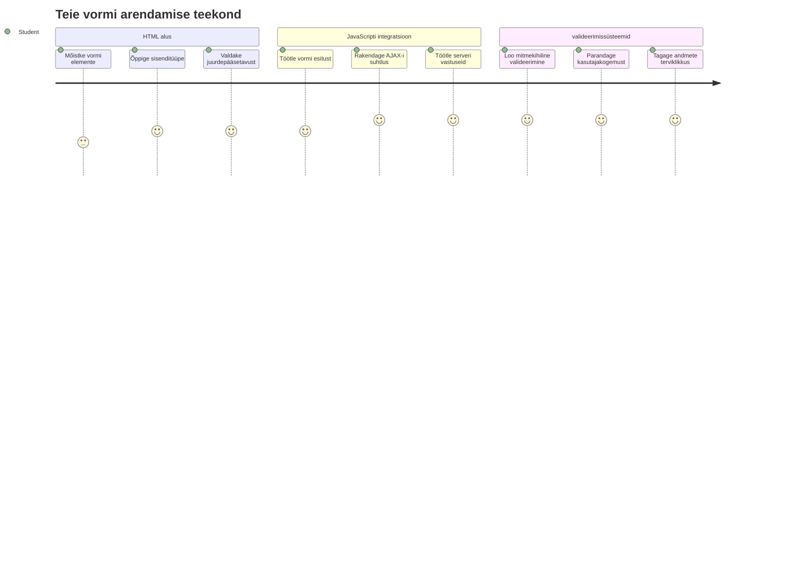
## Eelkontrolli viktoriin

[Eelkontrolli viktoriin](https://ff-quizzes.netlify.app/web/quiz/43)

Kas oled kunagi täitnud veebivormi ja see on sinu e-posti vormingu tagasi lükanud? Või kaotanud kogu info peale esitamist? Me kõik oleme nende tüütute olukordadega kokku puutunud.

Vormid on silla teie kasutajate ja teie rakenduse funktsioonide vahel. Nagu lennujuhtide hoolikad protokollid, mis juhivad lennukeid turvaliselt sihtkohta, annavad hästi kujundatud vormid selget tagasisidet ja hoiavad ära kulukad vead. Halbade vormide puhul võib kasutajaid ära jooksutada kiiremini kui valestimõistmine tihedas lennujaamas.

Selles õppetükis muudame teie staatilise pangarakenduse interaktiivseks rakenduseks. Õpite ehitama vorme, mis valideerivad kasutaja sisendi, suhtlevad serveritega ja annavad kasulikku tagasisidet. Mõelge sellele kui juhtpaneelile, mis laseb kasutajatel navigeerida teie rakenduse funktsioonide vahel.

Õppetüki lõpuks on teil täielik sisselogimise ja registreerimise süsteem koos valideerimisega, mis juhib kasutajad edu, mitte pettumuse poole.

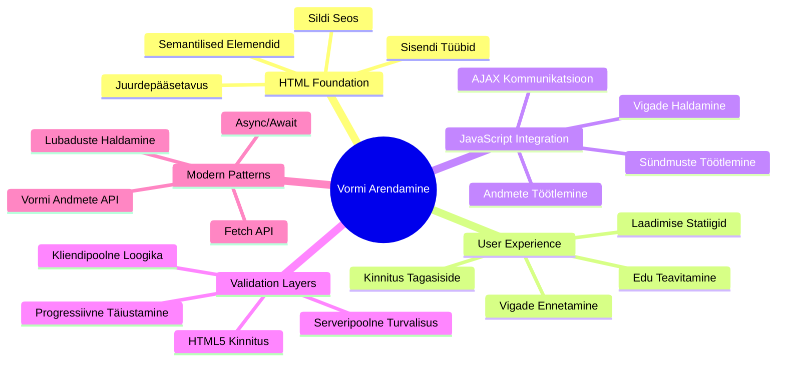
## Nõuded ettevalmistuseks

Enne vormide ehitamist veendume, et teil on kõik õigesti seadistatud. See õppetükk jätkab otse sealt, kus eelmine lõppes, seega kui te hüppasite ettepoole, võiksite kõigepealt põhialused toimima saada.

### Vajalik seadistus

| Komponent | Staatus | Kirjeldus |
|-----------|---------|-----------|
| [HTML mallid](../1-template-route/README.md) | ✅ Nõutav | Teie põhiline pangarakenduse struktuur |
| [Node.js](https://nodejs.org) | ✅ Nõutav | JavaScripti runtime serveri jaoks |
| [Panganduse API server](../api/README.md) | ✅ Nõutav | Tagapõhja teenus andmete salvestamiseks |

> 💡 **Arendaja näpunäide**: Te jooksutate samaaegselt kahte eraldi serverit – ühte teie front-end pangarakendusele ja teist tagapõhja API-le. See seadistus peegeldab reaalse maailma arengut, kus esiplaan ja tagapõhi töötavad iseseisvalt.

### Serveri konfiguratsioon

**Teie arenduskeskkond hõlmab:**
- **Front-end server**: Teenindab teie pangarakendust (tavaliselt port 3000)
- **Tagapõhja API server**: Käitleb andmete salvestamist ja päringuid (port 5000)
- **Mõlemad serverid** saavad töötada samaaegselt ilma konfliktideta

**Testimaks API ühendust:**
```bash
curl http://localhost:5000/api
# Oodatav vastus: "Panga API v1.0.0"
```

**Kui näete API versiooni vastust, olete valmis edasi minema!**

---

## HTML vormide ja kontrollide mõistmine

HTML vormid on vahend, mille kaudu kasutajad suhtlevad teie veebirakendusega. Mõelge neile kui telegrafisüsteemile, mis 19. sajandil ühendaski kaugeid kohti – need on kommunikatsiooniprotokoll kasutaja kavatsuse ja rakenduse vastuse vahel. Hoolikalt kujundatud vormid tabavad vigu, juhivad sisendi vormindamist ja annavad kasulikke soovitusi.

Tänapäevased vormid on oluliselt keerukamad kui lihtsad tekstiväljad. HTML5 tõi sisse eraldi sisenditüübid, mis automaatselt tegelevad e-posti valideerimise, numbrivormingu ja kuupäeva valikuga. Need täiustused parandavad nii ligipääsetavust kui ka mobiilikasutajate kogemust.

### Olulised vormielemendid

**Kõikide vormide ehitusplokid:**

```html
<!-- Basic form structure -->
<form id="userForm" method="POST">
  <label for="username">Username</label>
  <input id="username" name="username" type="text" required>
  
  <button type="submit">Submit</button>
</form>
```

**Mis see kood teeb:**
- **Loob** vormi konteineri unikaalse identifikaatoriga
- **Määrab** HTTP meetodi andmete edastamiseks
- **Sidub** sildid sisenditega ligipääsetavuse tagamiseks
- **Määratleb** nuppu vormi esitamiseks

### Moodsa sisendi tüübid ja atribuudid

| Sisendi tüüp | Eesmärk | Näide kasutusest |
|--------------|---------|------------------|
| `text` | Üldine tekstisisend | `<input type="text" name="username">` |
| `email` | E-posti valideerimine | `<input type="email" name="email">` |
| `password` | Peidetud tekstisisend | `<input type="password" name="password">` |
| `number` | Numbriline sisend | `<input type="number" name="balance" min="0">` |
| `tel` | Telefoninumbrid | `<input type="tel" name="phone">` |

> 💡 **Moodsa HTML5 eelis**: Spetsiifiliste sisenditüüpide kasutamine tagab automaatse valideerimise, sobivad mobiilklaviatuurid ja parema ligipääsetavuse ilma lisajavaskriptita!

### Nuppude tüübid ja käitumine

```html
<!-- Different button behaviors -->
<button type="submit">Save Data</button>     <!-- Submits the form -->
<button type="reset">Clear Form</button>    <!-- Resets all fields -->
<button type="button">Custom Action</button> <!-- No default behavior -->
```

**Mis iga nupu tüüp teeb:**
- **Esitamisnupud**: Käivitavad vormi esitamise ja saadavad andmed määratud aadressile
- **Lähtestamisnupud**: Taastavad kõik vormi väljad algseisundisse
- **Tavalised nupud**: Ei anna vaikimisi käitumist, vajavad kohandatud JavaScripti funktsionaalsust

> ⚠️ **Oluline märkus**: `<input>` element on isesulguv ja ei vaja sulgemistähist. Moodne praktika on kirjutada `<input>` ilma kaldkriipsuta.

### Sisselogimisvormi ehitamine

Teeme praktilise sisselogimisvormi, mis demonstreerib kaasaegseid HTML vormipraktikaid. Alustame lihtsast struktuurist ja täiustame seda järk-järgult ligipääsetavuse funktsioonide ja valideerimisega.

```html
<template id="login">
  <h1>Bank App</h1>
  <section>
    <h2>Login</h2>
    <form id="loginForm" novalidate>
      <div class="form-group">
        <label for="username">Username</label>
        <input id="username" name="user" type="text" required 
               autocomplete="username" placeholder="Enter your username">
      </div>
      <button type="submit">Login</button>
    </form>
  </section>
</template>
```

**Mis siin toimub:**
- **Struktureerib** vormi semantiliste HTML5 elementidega
- **Grupeerib** seotud elemendid `div` konteineritega tähenduslike klassidega
- **Sidub** sildid sisenditega `for` ja `id` atribuutide abil
- **Lisab** moodsad atribuudid nagu `autocomplete` ja `placeholder`, et parandada kasutajakogemust
- **Lisab** `novalidate`, et valideerimist teha JavaScriptiga brauseri vaikimisi asemel

### Õigete siltide jõud

**Miks on sildid tänapäeva veebiarenduses olulised:**

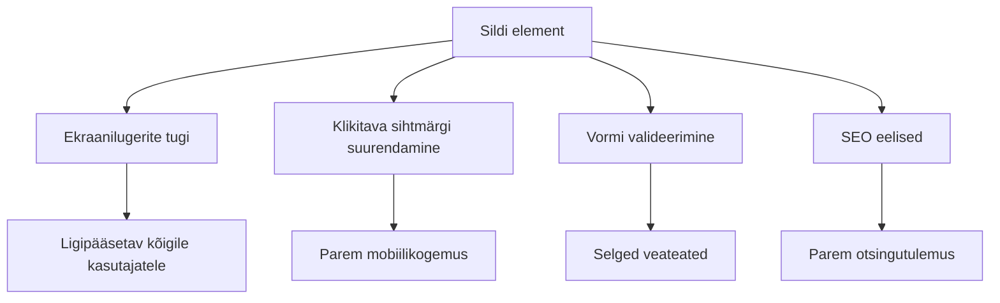
**Mida õiged sildid saavutavad:**
- **Võimaldab** ekraanilugeritel vormivälju selgelt teatada
- **Suurendab** klikkimispinda (sildi vajutamine keskendub sisendile)
- **Parandab** mobiilikasutust suuremate puutepindadega
- **Toetab** vormi valideerimist mõistlike veateadetega
- **Tõstab** SEO-d, andes semantilise tähenduse vormielementidele

> 🎯 **Ligipääsetavuse eesmärk**: Igale vormisisendile peaks olema seotud silt. See lihtne tava teeb teie vormid ligipääsetavaks kõigile, kaasa arvatud puuetega kasutajatele, ja parandab kõigi kasutajate kogemust.

### Registreerimisvormi loomine

Registreerimisvorm nõuab kasutaja konto loomiseks ulatuslikumat teavet. Ehitage see kaasaegsete HTML5 funktsioonide ja parema ligipääsetavusega.

```html
<hr/>
<h2>Register</h2>
<form id="registerForm" novalidate>
  <div class="form-group">
    <label for="user">Username</label>
    <input id="user" name="user" type="text" required 
           autocomplete="username" placeholder="Choose a username">
  </div>
  
  <div class="form-group">
    <label for="currency">Currency</label>
    <input id="currency" name="currency" type="text" value="$" 
           required maxlength="3" placeholder="USD, EUR, etc.">
  </div>
  
  <div class="form-group">
    <label for="description">Account Description</label>
    <input id="description" name="description" type="text" 
           maxlength="100" placeholder="Personal savings, checking, etc.">
  </div>
  
  <div class="form-group">
    <label for="balance">Starting Balance</label>
    <input id="balance" name="balance" type="number" value="0" 
           min="0" step="0.01" placeholder="0.00">
  </div>
  
  <button type="submit">Create Account</button>
</form>
```

**Ülal oleme:**
- **Korraldanud** iga välja konteiner `div`-idesse parema kujunduse ja paigutuse jaoks
- **Lisanud** sobivad `autocomplete` atribuudid brauseri automaatse täitmise toetuseks
- **Lisaks** abistava kohatäitjate tekstiga kasutaja juhendamiseks
- **Seadnud** mõistlikud vaikimisi väärtused `value` atribuudi abil
- **Rakendanud** valideerimisatribuutide `required`, `maxlength` ja `min` kasutuselevõttu
- **Kasutanud** `type="number"` väljal saldo jaoks koos kümnendkoha toega

### Sisendi tüüpide ja käitumise uurimine

**Moodsaid sisendi tüüpe iseloomustab täiustatud funktsionaalsus:**

| Omadus | Eelis | Näide |
|--------|-------|--------|
| `type="number"` | Numbriline klaviatuur mobiilil | Lihtsam saldod sisestada |
| `step="0.01"` | Kümnendkoha täpsus | Lubab sendide kasutamist valuutas |
| `autocomplete` | Brauseri automaatne täitmine | Kiirem vormi täitmine |
| `placeholder` | Kontekstuaalsed vihjed | Juhendab kasutaja ootusi |

> 🎯 **Ligipääsetavuse väljakutse**: Proovige vorme navigeerida ainult klaviatuuri abil! Kasutage `Tab`, et liikuda väljade vahel, `Space` kasti märkimiseks ja `Enter` vormi esitamiseks. See kogemus aitab mõista, kuidas ekraanilugeritega kasutajad vorme kasutavad.

### 🔄 **Pedagoogiline kontroll**
**Vormi aluste mõistmine**: Enne JavaScripti rakendamist veenduge, et mõistate:
- ✅ Kuidas semantiline HTML loob ligipääsetava vormistruktuuri
- ✅ Miks sisenditüübid on olulised mobiilsete klaviatuuride ja valideerimise jaoks
- ✅ Siltide ja vormikontrollide vahelist seost
- ✅ Kuidas vormi atribuudid mõjutavad brauseri vaikimisi käitumist

**Kiire enese-Test**: Mis juhtub, kui esitate vormi ilma JavaScriptita?
*Vastus: Brauser täidab vaikimisi esituse, tavaliselt suunates tegevuse URL-ile*

**HTML5 vormide eelised**: Moodsad vormid pakuvad:
- **Sisseehitatud valideerimist**: Automaatne e-posti ja numbrivormingu kontroll
- **Mobiilioptimeerimist**: Sobivad klaviatuurid erinevate sisenditüüpide jaoks
- **Ligipääsetavust**: Ekraanilugerite tugi ja klaviatuuriga navigatsioon
- **Progressiivset täiustamist**: Töötab ka siis, kui JavaScript on keelatud

## Vormide esitamise meetodite mõistmine

Kui keegi täidab teie vormi ja vajutab esita, peab see info kuhugi minema – tavaliselt serverisse, mis selle salvestab. On mitmeid viise, kuidas seda teha, ja teadmine, millist kasutada, võib teid tulevikus peavalude eest kaitsta.

Vaatame, mis tegelikult juhtub, kui vajutatakse nuppu "esita".

### Vaikimisi vormi käitumine

Esiteks vaatleme, mis juhtub lihtsa vormi esitamisega:

**Testige oma olemasolevaid vorme:**
1. Klõpsake vormis *Registreeri* nuppu
2. Jälgige muudatusi oma brauseri aadressireal
3. Märkake, kuidas leht laaditakse uuesti ja andmed ilmuvad aadressireale


### HTTP meetodite võrdlus

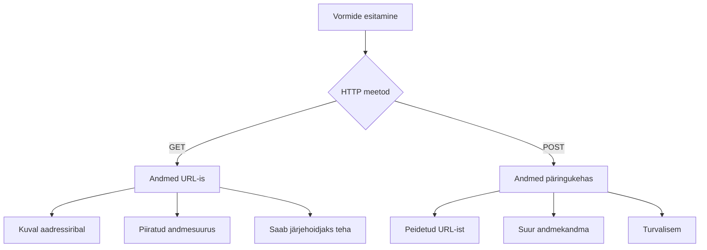
**Erinevuste mõistmine:**

| Meetod | Kasutusjuhtum | Andmete asukoht | Turvalisuse tase | Suuruse piirang |
|--------|---------------|-----------------|------------------|-----------------|
| `GET` | Otsingupäringud, filtrid | URL parameetrid | Madal (nähtav) | ~2000 märki |
| `POST` | Kasutajakontod, tundlik info | Päringu keha | Kõrge (peidetud) | Praktiliselt piiramatult |

**Põhitõdede mõistmine:**
- **GET**: Lisab vormi andmed aadressirea parameetritena (sobib otsinguteks)
- **POST**: Sisestab andmed päringu kehasse (hädavajalik tundlike andmete jaoks)
- **GET piirangud**: Suuruse piirangud, nähtav info, brauseri ajaloo salvestamine
- **POST eelised**: Suur mõõt, privaatsus, failide üleslaadimise tugi

> 💡 **Parim tava**: Kasuta `GET` otsingu- ja filtrivormide tarbeks (andmete pärimine), kasuta `POST` kasutajate registreerimiseks, sisselogimiseks ja andmete loomiseks.

### Vormiesituse konfigureerimine

Seadistame oma registreerimisvormi, et see korrektselt suhtleks tagapõhja API-ga POST meetodiga:

```html
<form id="registerForm" action="//localhost:5000/api/accounts" 
      method="POST" novalidate>
```

**See seadistus teeb järgmist:**
- **Suuname** vormi esitamise API lõpp-punkti
- **Kasutame** POST meetodit turvaliseks andmeedastuseks
- **Lisame** `novalidate`, et kasutada valideerimist JavaScriptiga

### Vormiesituse testimine

**Järgige neid samme, et testida oma vormi:**
1. **Täidke** registreerimisvorm oma andmetega
2. **Vajutage** nuppu "Loo konto"
3. **Vaadake** brauserist serveri vastust

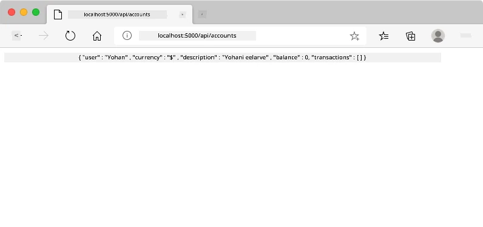

**Mida peaks nägema:**
- **Brauser suunab** API lõpp-punkti URL-ile
- **JSON vastus** sisaldab teie äsja loodud konto andmeid
- **Serveri kinnitus**, et konto loodi edukalt

> 🧪 **Eksperimendi aeg**: Proovige uuesti registreerida sama kasutajanimega. Millise vastuse saate? See aitab mõista, kuidas server käsitleb duplikaate ja vigade olekuid.

### JSON vastuste mõistmine

**Kui server vormi edukalt töötleb:**
```json
{
  "user": "john_doe",
  "currency": "$",
  "description": "Personal savings",
  "balance": 100,
  "id": "unique_account_id"
}
```

**See vastus kinnitab:**
- **Loodud** uus konto teie määratud andmetega
- **Määratud** unikaalne identifikaator edaspidiseks kasutamiseks
- **Tagastatud** kogu konto info kontrolliks
- **Näitab** andmebaasi edukat salvestamist

## Moodne vormikäitlus JavaScriptiga

Traditsiooniline vormiesitus põhjustab kogu lehe uuesti laadimise, sarnaselt varajastele kosmosemissioonidele, mis vajasid täissüsteemi taaskäivitust trajektoori täpsustamiseks. See katkestab kasutajakogemuse ja kaotab rakenduse oleku.

JavaScripti vormikäitlus töötab nagu moodsad kosmoselaevade pidevad juhtelemendid – võimaldades reaalajas kohandusi, ilma navigeerimise konteksti kaotamata. Saame püüda kinni vormiesitused, anda kohest tagasisidet, käsitleda vigu sujuvalt ning uuendada kasutajaliidest serveri vastuste põhjal, hoides kasutaja positsiooni rakenduses.

### Miks vältida lehe uuesti laadimist?

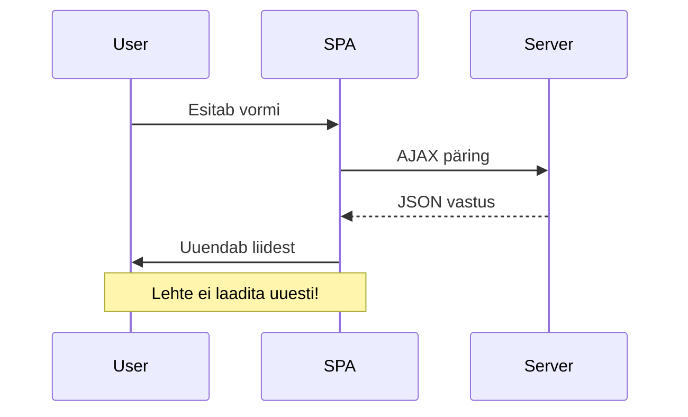
**JavaScripti vormikäitluse eelised:**
- **Hoidab** rakenduse oleku ja kasutajakonteksti
- **Tagab** kohese tagasiside ja laadimisindikaatorid
- **Võimaldab** dünaamilist veakäsitlust ja valideerimist
- **Loob** sujuvaid rakenduse-laadseid kasutajakogemusi
- **Lubab** tingimusloogikat serveri vastuste alusel

### Üleminek traditsiooniliselt vormilt kaasaegsele

**Traditsioonilise lähenemise probleemid:**
- **Suunab** kasutajad rakendusest välja
- **Kaotab** olemasoleva rakenduse oleku ja konteksti
- **Nõuab** lehe täielikku taaskäivitust lihtsate toimingute puhul
- **Piiratud** kontroll kasutajate tagasiside üle

**Moodsa JavaScripti lähenemise eelised:**
- **Hoiab** kasutajad rakenduse sees
- **Hoidab** kogu rakenduse olekut ja andmeid
- **Võimaldab** reaalajas valideerimist ja tagasisidet
- **Toetab** progressiivset täiustamist ja ligipääsetavust

### JavaScripti vormikäitluse rakendamine

Asendame traditsioonilise vormiesituse kaasaegse JavaScript sündmusehaldusega:

```html
<!-- Remove the action attribute and add event handling -->
<form id="registerForm" method="POST" novalidate>
```

**Lisa oma `app.js` faili registreerimisloogika:**

```javascript
// Kaasaegne sündmuspõhine vormi käsitlemine
function register() {
  const registerForm = document.getElementById('registerForm');
  const formData = new FormData(registerForm);
  const data = Object.fromEntries(formData);
  const jsonData = JSON.stringify(data);
  
  console.log('Form data prepared:', data);
}

// Lisa sündmuse kuulaja lehe laadimisel
document.addEventListener('DOMContentLoaded', () => {
  const registerForm = document.getElementById('registerForm');
  registerForm.addEventListener('submit', (event) => {
    event.preventDefault(); // Vältida vormi vaikimisi esitamist
    register();
  });
});
```

**Mis siin toimub:**
- **Takistab** vaikimisi vormi esitamist `event.preventDefault()` abil
- **Leiab** vormi elemendi kaasaegse DOM valiku abil
- **Ekstraheerib** vormi andmed võimsa `FormData` API abil
- **Konverteerib** FormData tavalise objektiks `Object.fromEntries()` abil
- **Serialiseerib** andmed JSON formaati serveriga suhtlemiseks
- **Logib** töödeldud andmed veaotsingu ja kinnituse jaoks

### FormData API mõistmine

**FormData API pakub võimast vormikäitlust:**
```javascript
// Näide sellest, mida FormData hõivab
const formData = new FormData(registerForm);

// FormData hõivab automaatselt:
// {
//   "user": "john_doe",
//   "currency": "$",
//   "description": "Isiklik konto",
//   "balance": "100"
// }
```

**FormData API eelised:**
- **Kattuv kogumine**: Kogub kõik vormielemendid, sealhulgas tekst, failid ja keerukad sisendid
- **Tüübiteadlikkus**: Töötleb automaatselt erinevaid sisenditüüpe ilma kohandatud koodita
- **Tõhusus**: Välistab käsitsi väljavaliku kogumise ühe API-kutsega
- **Kohanduvus**: Säilitab funktsionaalsuse, kui vormi struktuur muutub

### Serveri suhtlemisfunktsiooni loomine

Nüüd loome tugeva funktsiooni suhtlemiseks teie API-serveriga, kasutades kaasaegseid JavaScripti mustreid:

```javascript
async function createAccount(account) {
  try {
    const response = await fetch('//localhost:5000/api/accounts', {
      method: 'POST',
      headers: { 
        'Content-Type': 'application/json',
        'Accept': 'application/json'
      },
      body: account
    });
    
    // Kontrolli, kas vastus oli edukas
    if (!response.ok) {
      throw new Error(`HTTP error! status: ${response.status}`);
    }
    
    return await response.json();
  } catch (error) {
    console.error('Account creation failed:', error);
    return { error: error.message || 'Network error occurred' };
  }
}
```

**Asünkroonse JavaScripti mõistmine:**

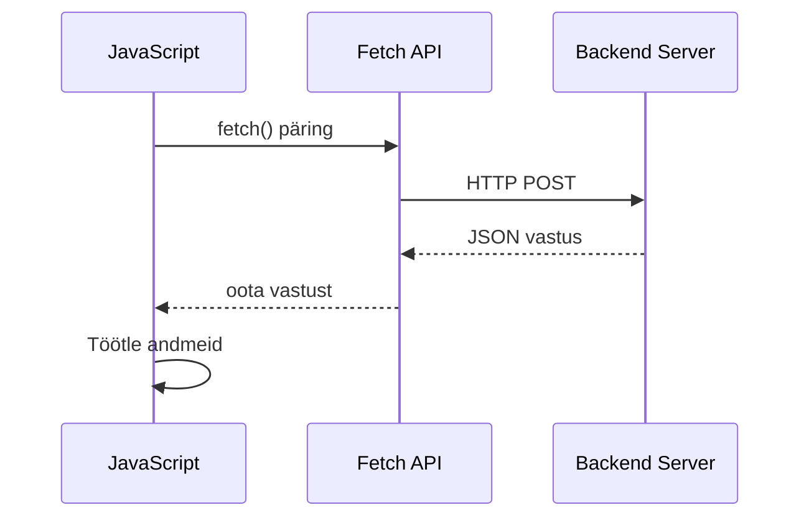
**Mida see kaasaegne teostus saavutab:**
- **Kasutab** `async/await` loetavat asünkroonset koodi
- **Sisaldab** korrektset veahaldust try/catch plokkidega
- **Kontrollib** vastuse staatust enne andmete töötlemist
- **Seab** sobivad päised JSON suhtluseks
- **Annetab** põhjalikud veateated silumiseks
- **Tagastab** järjepideva andmestruktuuri nii õnnestumise kui vea korral

### Kaasaegse Fetch API jõud

**Fetch API eelised vanade meetodite ees:**

| Funktsioon | Eelised | Teostus |
|------------|---------|---------|
| Lubadustepõhine | Puhas asünkroonne kood | `await fetch()` |
| Päringu kohandamine | Täielik HTTP kontroll | Päised, meetodid, keha |
| Vastuse töötlemine | Paindlik andmete parsimine | `.json()`, `.text()`, `.blob()` |
| Veahaldus | Üldine vigade püüdmine | Try/catch plokid |

> 🎥 **Lisainfo**: [Async/Await juhend](https://youtube.com/watch?v=YwmlRkrxvkk) – Asünkroonse JavaScripti mustrite mõistmine kaasaegseks veebiarenduseks.

**Peamised kontseptsioonid serverisuhtluseks:**
- **Asünkroonsed funktsioonid** lubavad peatada täitmise, et oodata serveri vastuseid
- **Await märksõna** muudab asünkroonse koodi lugemise sünkroonseks
- **Fetch API** pakub kaasaegseid lubadustepõhiseid HTTP-päringuid
- **Veahaldus** tagab sujuva rakenduse käitumise võrguvigade korral

### Registreerimisfunktsiooni lõpetamine

Koondame kõik kokku täielikult töövalmis registreerimisfunktsiooniks:

```javascript
async function register() {
  const registerForm = document.getElementById('registerForm');
  const submitButton = registerForm.querySelector('button[type="submit"]');
  
  try {
    // Kuva laadimise olek
    submitButton.disabled = true;
    submitButton.textContent = 'Creating Account...';
    
    // Töötle vormi andmed
    const formData = new FormData(registerForm);
    const jsonData = JSON.stringify(Object.fromEntries(formData));
    
    // Saada serverisse
    const result = await createAccount(jsonData);
    
    if (result.error) {
      console.error('Registration failed:', result.error);
      alert(`Registration failed: ${result.error}`);
      return;
    }
    
    console.log('Account created successfully!', result);
    alert(`Welcome, ${result.user}! Your account has been created.`);
    
    // Lähtesta vorm pärast edukat registreerimist
    registerForm.reset();
    
  } catch (error) {
    console.error('Unexpected error:', error);
    alert('An unexpected error occurred. Please try again.');
  } finally {
    // Taasta nupu olek
    submitButton.disabled = false;
    submitButton.textContent = 'Create Account';
  }
}
```

**See täiustatud teostus sisaldab:**
- **Pakub** visuaalset tagasisidet vormi esitamise ajal
- **Keelab** esitamisklipi topeltklikkide ärahoidmiseks
- **Haldab** nii oodatud kui ootamatuid vigu elegantselt
- **Näitab** kasutajasõbralikke õnnestumise ja veateateid
- **Lähtestab** vormi pärast edukat registreerimist
- **Taastab** kasutajaliidese oleku sõltumata tulemusest

### Teie teostuse testimine

**Avage brauseri arendajate tööriistad ja testige registreerimist:**

1. **Avage** brauseri konsool (F12 → Console vahekaart)
2. **Täitage** registreerimisvorm
3. **Klõpsake** "Loo konto"
4. **Jälgige** konsooli sõnumeid ja kasutajale tagasisidet

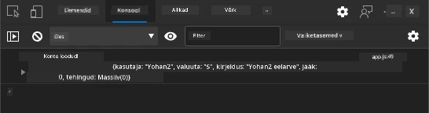

**Mida peaksite nägema:**
- **Laadimisolek** ilmub esitamisklipile
- **Konsooli logid** kuvavad protsessi üksikasju
- **Õnnestumise teade** ilmub konto loomise õnnestumisel
- **Vorm lähtestatakse** automaatselt pärast edukat esitamist

> 🔒 **Turvalisuse aspekt**: Praegu liigutakse andmed HTTP kaudu, mis pole tootmiskeskkonnas turvaline. Tõelistes rakendustes kasutage andmete krüpteerimiseks alati HTTPS-i. Lisateavet leiate [HTTPS turvalisusest](https://en.wikipedia.org/wiki/HTTPS) ja miks see on kasutajaandmete kaitsmiseks oluline.

### 🔄 **Pedagoogiline kontroll**
**Kaasaegne JavaScripti integreerimine**: Kontrollige oma asünkroonse vormihalduse mõistmist:
- ✅ Kuidas muudab `event.preventDefault()` vormi vaikimisi käitumist?
- ✅ Miks on FormData API tõhusam kui käsitsi väljavaliku kogumine?
- ✅ Kuidas parandab async/await mustrite kasutamine koodi loetavust?
- ✅ Milline roll on veahaldusel kasutajakogemuses?

**Süsteemi arhitektuur**: Teie vormihaldust näitab:
- **Sündmuspõhine programmeerimine**: Vormid reageerivad kasutajate tegevustele ilma lehe värskenduseta
- **Asünkroonne suhtlus**: Serveripäringud ei blokeeri kasutajaliidest
- **Veahaldus**: Ilma tõrgeteta langedes võrguvigade korral
- **Oleku haldus**: Kasutajaliidese uuendused peegeldavad sobivalt serveri vastuseid
- **Progressiivne täiendus**: Põhifunktsionaalsus töötab, JavaScript täiustab seda

**Professionaalsed mustrid**: Olete rakendanud:
- **Ühe vastutuse põhimõte**: Funktsioonidel on selged, fokusseeritud ülesanded
- **Vea piires hoidmine**: Try/catch plokid takistavad rakenduse kokkujooksmist
- **Kasutajate tagasiside**: Laadimisolekud ja õnnestumise/veateated
- **Andmete teisendus**: FormData teisendamine JSON-iks serverisuhtluseks

## Kõikehõlmav vormi valideerimine

Vormi valideerimine hoiab ära pettumuse vigade avastamisel alles pärast esitamist. Nagu Rahvusvahelise Kosmosejaama mitmed dubleerivad süsteemid, kasutab tõhus valideerimine mitmest turvakontrolli kihist koosnevat korda.

Optimaalne lähenemine ühendab brauseripõhise valideerimise kohese tagasiside jaoks, JavaScripti valideerimise parandatud kasutajakogemuse saavutamiseks ning serveripoolse valideerimise turvalisuse ja andmete terviklikkuse tagamiseks. See üleliigne süsteem tagab nii kasutajate rahulolu kui ka süsteemi kaitse.

### Valideerimiskihte mõistmine

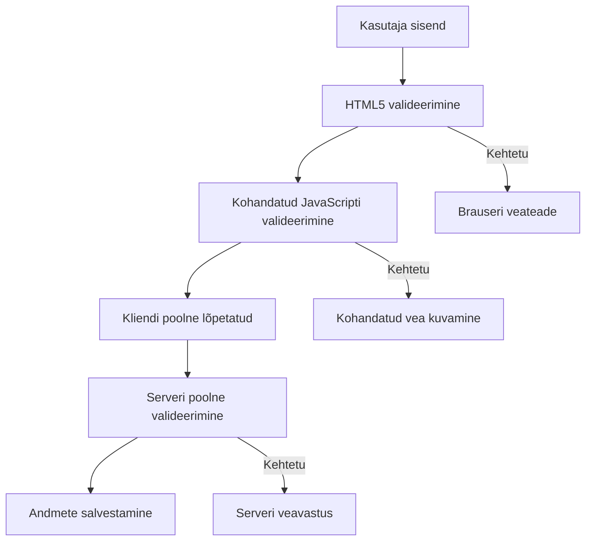
**Mitmekihiline valideerimisstrateegia:**
- **HTML5 valideerimine**: Kohene brauseripõhine kontroll
- **JavaScripti valideerimine**: Kohandatud loogika ja kasutajakogemus
- **Serveripoolne valideerimine**: Lõplik turva- ja andmete terviklikkuse kontroll
- **Progressiivne täiendus**: Töötamine ka JavaScripti puudumisel

### HTML5 valideerimisatribuudid

**Kaasaegsed valideerimistööriistad teie käsutuses:**

| Atribuut | Eesmärk | Näide | Brauseri käitumine |
|----------|---------|-------|--------------------|
| `required` | Kohustuslikud väljad | `<input required>` | Takistab tühja esitust |
| `minlength`/`maxlength` | Teksti pikkuse piirangud | `<input maxlength="20">` | Sundib tähemärkide piire |
| `min`/`max` | Numbrilised vahemikud | `<input min="0" max="1000">` | Kontrollib numbriliste piiride sobivust |
| `pattern` | Kohandatud regulaaravaldiste reeglid | `<input pattern="[A-Za-z]+">` | Vastab kindlatele vormingutele |
| `type` | Andmetüübi valideerimine | `<input type="email">` | Vormingupõhine kontroll |

### CSS valideerimisstiilimine

**Loo visuaalne tagasiside valideerimise olekutele:**

```css
/* Valid input styling */
input:valid {
  border-color: #28a745;
  background-color: #f8fff9;
}

/* Invalid input styling */
input:invalid {
  border-color: #dc3545;
  background-color: #fff5f5;
}

/* Focus states for better accessibility */
input:focus:valid {
  box-shadow: 0 0 0 0.2rem rgba(40, 167, 69, 0.25);
}

input:focus:invalid {
  box-shadow: 0 0 0 0.2rem rgba(220, 53, 69, 0.25);
}
```

**Mida need visuaalsed vihjed saavutavad:**
- **Rohelised äärised**: Näitavad edukat valideerimist, nagu rohelised tuled missioonikontrollis
- **Punased äärised**: Märgistavad valideerimisvead, mis vajavad tähelepanu
- **Fookuse esiletõstmine**: Annab selge visuaalse konteksti praegusele sisendile
- **Järjepidev stiilimine**: Loob kasutajale õpitavad liidese mustrid

> 💡 **Nipp**: Kasuta CSS pseudo-klasse `:valid` ja `:invalid`, et anda kohest visuaalset tagasisidet sisestamisel, luues reageeriva ja kasutajasõbraliku liidese.

### Kõikehõlmava valideerimise rakendamine

Täiustame teie registreerimisvormi tugeva valideerimisega, mis pakub suurepärast kasutajakogemust ja andmete kvaliteeti:

```html
<form id="registerForm" method="POST" novalidate>
  <div class="form-group">
    <label for="user">Username <span class="required">*</span></label>
    <input id="user" name="user" type="text" required 
           minlength="3" maxlength="20" 
           pattern="[a-zA-Z0-9_]+" 
           autocomplete="username"
           title="Username must be 3-20 characters, letters, numbers, and underscores only">
    <small class="form-text">Choose a unique username (3-20 characters)</small>
  </div>
  
  <div class="form-group">
    <label for="currency">Currency <span class="required">*</span></label>
    <input id="currency" name="currency" type="text" required 
           value="$" maxlength="3" 
           pattern="[A-Z$€£¥₹]+" 
           title="Enter a valid currency symbol or code">
    <small class="form-text">Currency symbol (e.g., $, €, £)</small>
  </div>
  
  <div class="form-group">
    <label for="description">Account Description</label>
    <input id="description" name="description" type="text" 
           maxlength="100" 
           placeholder="Personal savings, checking, etc.">
    <small class="form-text">Optional description (up to 100 characters)</small>
  </div>
  
  <div class="form-group">
    <label for="balance">Starting Balance</label>
    <input id="balance" name="balance" type="number" 
           value="0" min="0" step="0.01" 
           title="Enter a positive number for your starting balance">
    <small class="form-text">Initial account balance (minimum $0.00)</small>
  </div>
  
  <button type="submit">Create Account</button>
</form>
```

**Täiustatud valideerimise mõistmine:**
- **Ühendab** kohustuslike väljade näitajad kasulike kirjeldustega
- **Sisaldab** `pattern` atribuute vormingu kontrolliks
- **Pakub** `title` atribuute ligipääsetavuse ja tööriistavihjetena
- **Lisab** abitekste kasutajate juhendamiseks
- **Kasutab** semantilist HTML struktuuri parema ligipääsetavuse nimel

### Täiustatud valideerimise reeglid

**Mida iga invalideerimisreegel saavutab:**

| Väli | Valideerimisreeglid | Kasutaja kasu |
|-------|---------------------|---------------|
| Kasutajanimi | `required`, `minlength="3"`, `maxlength="20"`, `pattern="[a-zA-Z0-9_]+"` | Tagab kehtivad ja unikaalsed ID-d |
| Valuuta | `required`, `maxlength="3"`, `pattern="[A-Z$€£¥₹]+"` | Võtab vastu tavalised valuutasümbolid |
| Saldo | `min="0"`, `step="0.01"`, `type="number"` | Väldib negatiivset saldot |
| Kirjeldus | `maxlength="100"` | Mõistlik pikkuspiirang |

### Valideerimise käitumise testimine

**Proovige järgmisi valideerimissituatsioone:**
1. **Esitage** vorm tühjade kohustuslike väljadega
2. **Sisestage** kasutajanimi, mis on lühem kui 3 tähemärki
3. **Sisestage** kasutajanime välja erimärgid
4. **Sisestage** negatiivne saldosumma

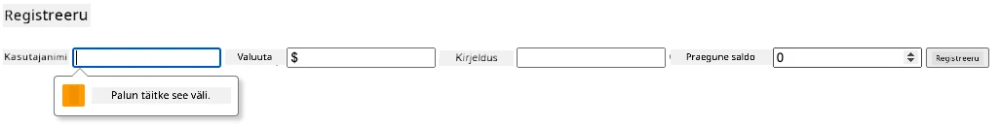

**Mida täheldate:**
- **Brauser kuvab** oma staatilisi valideerimissõnumeid
- **Stiilimuudatused** vastavalt `:valid` ja `:invalid` olekule
- **Vormi esitamine** blokeeritakse seni, kuni kõik valideerimised läbivad
- **Fookus liigub** automaatselt esimesele vigasele väljale

### Klient- vs serveripoolne valideerimine

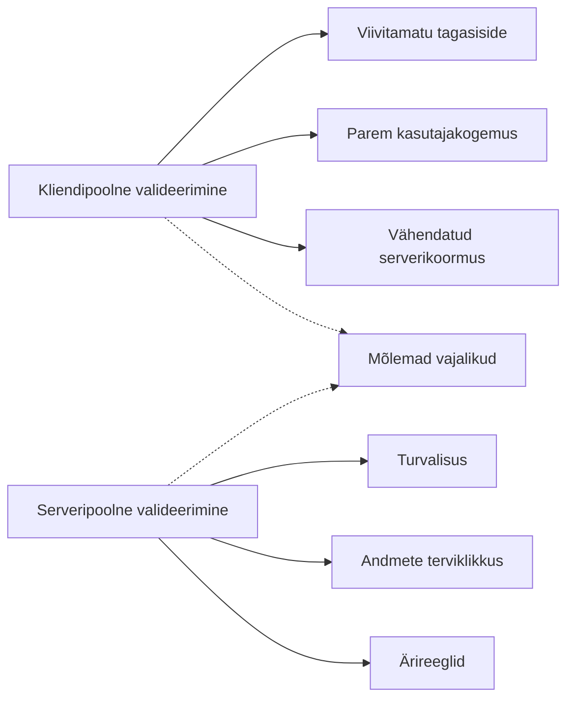
**Miks vajate mõlemat kihti:**
- **Klientpoolne valideerimine**: Kohene tagasiside ja parem kasutajakogemus
- **Serveripoolne valideerimine**: Tagab turvalisuse ja haldab keerukaid ärireegleid
- **Kombineeritud lähenemine**: Loob tugeva, kasutajasõbraliku ja turvalise rakenduse
- **Progressiivne täiendus**: Töötav ka JavaScripti puudumisel

> 🛡️ **Turvatähelepanu**: Ärge usaldage ainult klientpoolselt valideerimist! Pahatahtlikud kasutajad võivad kliendipooli kontrollidest mööda minna, seega on serveripoolne valideerimine oluline turvalisuse ja andmete terviklikkuse tagamiseks.

### ⚡ **Mida saad teha järgmise 5 minutiga**
- [ ] Testi vormi vigaste andmetega, et näha valideerimissõnumeid
- [ ] Proovi vormi esitamist JavaScripti keelatuna, et näha HTML5 valideerimist
- [ ] Ava brauseri DevTools ja vaata serverisse edastatud vormiandmeid
- [ ] Katseta erinevaid sisenditüüpe mobiilse klaviatuuri muutuste nägemiseks

### 🎯 **Mida saad selle tunniga saavutada**
- [ ] Täida postitunniküsimustik ja mõista vormihalduse põhimõtteid
- [ ] Rakenda põhjalik valideerimisülesanne reaalajas tagasisidega
- [ ] Lisa CSS stiilid professionaalse väljanägemisega vormidele
- [ ] Loo veahaldus korduvate kasutajanimede ja serveri vigade jaoks
- [ ] Lisa parooli kinnitamise väljad sobiva valideerimisega

### 📅 **Sinu nädala pikkune vormioskuste teekond**
- [ ] Valmista täisfunktsionaalne pangarakendus koos täiustatud vormifunktsioonidega
- [ ] Lisa failide üleslaadimise võimalused profiilipiltide või dokumentide jaoks
- [ ] Loo mitmeastmelised vormid edenemisnäitajate ja oleku haldusega
- [ ] Arenda dünaamilisi vorme, mis kohanevad kasutajavalikute järgi
- [ ] Rakenda vormi automaatne salvestamine ja taastamine parema kasutajakogemuse nimel
- [ ] Lisa täiendavad valideerimised nagu e-posti ja telefoni numbri kontroll

### 🌟 **Sinu kuu pikkune frontendi arendamise meisterlikkus**
- [ ] Arenda keerukaid vormirakendusi tingimusliku loogika ja töövoogudega
- [ ] Õpi vormiraamatukogusid ja raamistikke kiireks arendamiseks
- [ ] Valda ligipääsetavuse suuniseid ja kaasavat disaini põhimõtteid
- [ ] Rakenda rahvusvahelistumist ja lokaliseerimist globaalselt kasutatavate vormide jaoks
- [ ] Loo taaskasutatavaid vormikomponentide raamatukogusid ja disainisüsteeme
- [ ] Panusta avatud lähtekoodiga vormiprojektidesse ja jaga parimaid praktikaid

## 🎯 Sinu vormiarenduse meistriklassi ajaskaala

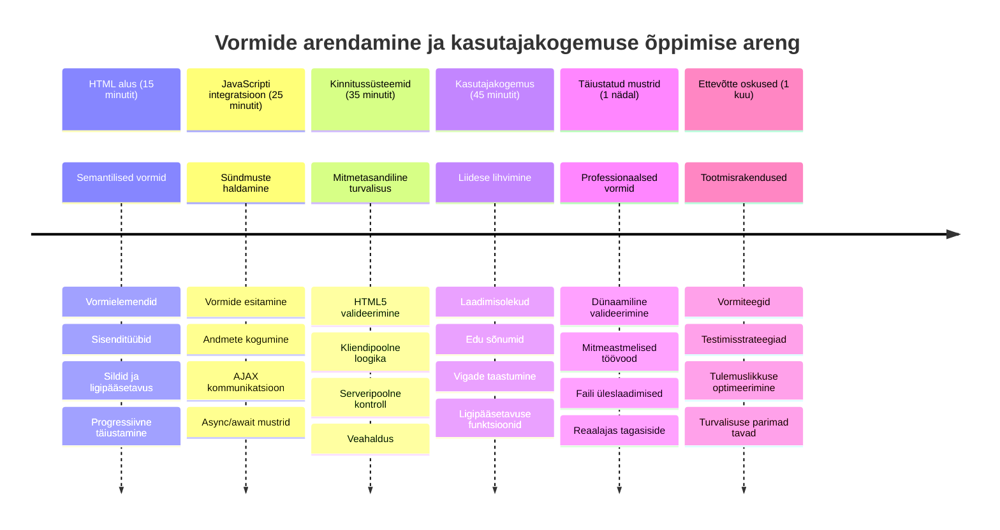
### 🛠️ Sinu vormiarenduse tööriistakomplekti kokkuvõte

Selle õppetunni läbimise järel oled omandanud:
- **HTML5 vormid**: Semantiline struktuur, sisenditüübid ja ligipääsetavusfunktsioonid
- **JavaScripti vormihaldus**: Sündmuste haldus, andmete kogumine ja AJAX suhtlus
- **Valideerimise arhitektuur**: Mitmekihiline valideerimine turvalisuse ja kasutajakogemuse jaoks
- **Asünkroonne programmeerimine**: Kaasaegne fetch API ja async/await mustrid
- **Veahalduse juhtimine**: Põhjalik veahaldus ja kasutajate tagasiside süsteemid
- **Kasutajakogemuse disain**: Laadimisolekud, õnnestumise teated ja vigade taastamine
- **Progressiivne täiendus**: Vormid, mis töötavad kõigis brauserites ja keskkondades

**Rakendused pärismaailmas**: Sinu vormiarenduse oskused kehtivad otseselt:
- **E-kaubanduse rakendused**: Kassa protsessid, konto registreerimine ja maksevormid
- **Ettevõtterakendused**: Andmesisestussüsteemid, aruandeliidesed ja töövoogude rakendused
- **Sisutõrjesüsteemid**: Avaldamise platvormid, kasutajate loodud sisu ja haldusliidesed
- **Finantsrakendused**: Panga liidesed, investeerimisplatvormid ja tehingute süsteemid
- **Tervishoiusüsteemid**: Patsientide portaalid, aja planeerimine ja meditsiinilised vormid
- **Haridusplatvormid**: Kursuse registreerimine, hindamisvahendid ja õppehaldussüsteemid

**Sinu professionaalsed oskused**: Nüüd saad:
- **Disainida** ligipääsetavaid vorme, mis töötavad kõigi kasutajate, sealhulgas erivajadustega inimeste jaoks
- **Rakendada** turvalist vormi valideerimist, mis väldib andmekorruptsiooni ja turvaohtusid
- **Luua** reageerivaid kasutajaliideseid, mis annavad selget tagasisidet ja juhiseid
- **Siluda** keerukaid vormi interaktsioone brauseri arendajatööriistade ja võrguanalüüsi abil
- **Optimeerida** vormi jõudlust tõhusa andmetöötluse ja valideerimisstrateegiatega

**Frontendi arenduse mõisted valdavad:**
- **Sündmuspõhine arhitektuur**: Kasutajate interaktsioonide haldus ja vastusmehhanismid
- **Asünkroonne programmeerimine**: Mitteblokeeriv serverisuhtlus ja veahaldus
- **Andmete valideerimine**: Kliendi- ja serveripoolne turvalisuse ning terviklikkuse kontroll
- **Kasutajakogemuse disain**: Intuitiivsed liidesed, mis juhivad kasutajaid eduni
- **Ligipääsetavuse inseneritöö**: Kaasav disain, mis sobib erinevate kasutajate vajadustele

**Järgmine tase**: Oled valmis uurima täiustatud vormiraamatukogusid, rakendama keerukaid valideerimisreegleid või ehitama ettevõtte tasemel andmekogumise süsteeme!

🌟 **Saavutus saavutatud**: Oled loonud täieliku vormihaldussüsteemi professionaalse valideerimise, veahalduse ja kasutajakogemuse mustritega!

---


---

## GitHub Copilot agentide väljakutse 🚀

Kasuta Agent-režiimi, et lõpetada järgmine ülesanne:

**Kirjeldus:** Täienda registreerimisvormi täieliku kliendipoolse valideerimise ja kasutajate tagasisidega. See väljakutse aitab sul harjutada vormi valideerimist, veahaldust ja kasutajakogemuse parandamist interaktiivse tagasisidega.
**Prompt:** Loo registreerimisvormile täielik valideerimissüsteem, mis sisaldab: 1) Reaalajas valideerimispalautust iga välja kohta, kui kasutaja kirjutab, 2) Kohandatud valideerimissõnumeid, mis kuvatakse iga sisestusvälja all, 3) Parooli kinnitamise väli, millel on sobivuse valideerimine, 4) Visuaalsed näidikud (nt rohelised linnukesed kehtivate väljade jaoks ja punased hoiatused kehtetute jaoks), 5) Esitamisnupp, mis aktiveerub ainult siis, kui kõik valideerimised on läbitud. Kasuta HTML5 valideerimisatribuute, CSS-i valideerimisolekute kujundamiseks ja JavaScripti interaktiivseks käitumiseks.

Lisateave saada agentrežiimi kohta aadressil [agent mode](https://code.visualstudio.com/blogs/2025/02/24/introducing-copilot-agent-mode).

## 🚀 Väljakutse

Kuva HTML-is veateade, kui kasutaja juba eksisteerib.

Näide sellest, kuidas lõplik sisselogimisleht võib välja näha pärast veidi kujundamist:

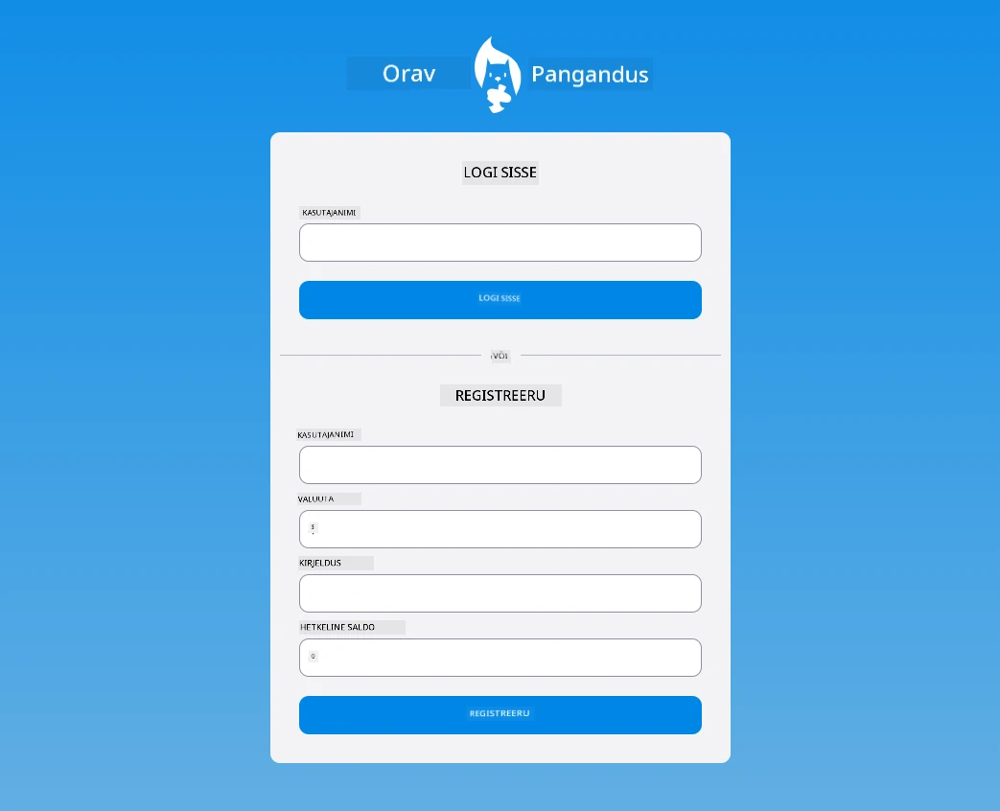

## Loengujärgne viktoriin

[Post-lecture quiz](https://ff-quizzes.netlify.app/web/quiz/44)

## Kordamine ja iseseisev õpe

Arendajad on olnud väga loovad oma vormide loomisel, eriti valideerimisstrateegiate osas. Uuri erinevaid vormivoogusid, sirvides [CodePen](https://codepen.com); kas suudad leida mõnda huvitavat ja inspireerivat vormi?

## Kodutöö

[Stiliseeri oma pangarakendus](assignment.md)

---

<!-- CO-OP TRANSLATOR DISCLAIMER START -->
**Lahtiütlus**:  
See dokument on tõlgitud kasutades tehisintellekti tõlketeenust [Co-op Translator](https://github.com/Azure/co-op-translator). Kuigi püüame tagada täpsust, võib automaatsetes tõlgetes esineda vigu või ebatäpsusi. Originaaldokument selle emakeeles tuleks pidada usaldusväärseks allikaks. Kriitilise teabe puhul soovitatakse professionaalset inimtõlget. Meie ei vastuta selle tõlke kasutamisest tulenevate arusaamatuste või valesti mõistmiste eest.
<!-- CO-OP TRANSLATOR DISCLAIMER END -->