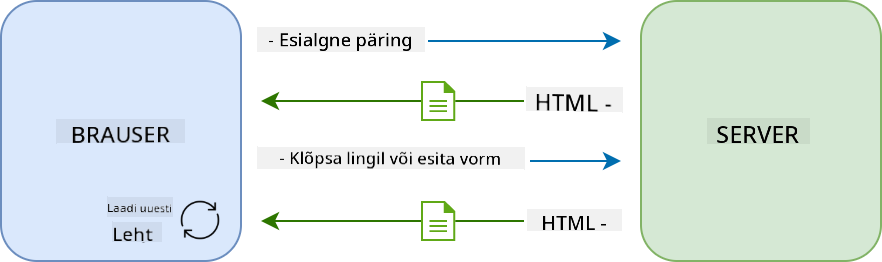
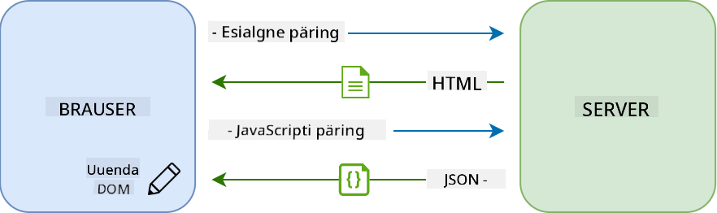
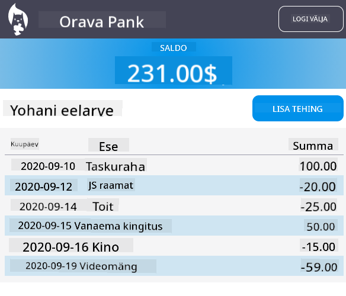

<!--
CO_OP_TRANSLATOR_METADATA:
{
  "original_hash": "89d0df9854ed020f155e94882ae88d4c",
  "translation_date": "2025-10-11T12:04:09+00:00",
  "source_file": "7-bank-project/3-data/README.md",
  "language_code": "et"
}
-->
# Pangaäpi loomine, 3. osa: Andmete hankimise ja kasutamise meetodid

## Eelloengu viktoriin

[Eelloengu viktoriin](https://ff-quizzes.netlify.app/web/quiz/45)

### Sissejuhatus

Iga veebirakenduse keskmes on *andmed*. Andmed võivad olla mitmesugusel kujul, kuid nende peamine eesmärk on alati kuvada kasutajale teavet. Kuna veebirakendused muutuvad üha interaktiivsemaks ja keerukamaks, on see, kuidas kasutaja teabele juurde pääseb ja sellega suhtleb, nüüd veebiarenduse oluline osa.

Selles õppetükis vaatame, kuidas hankida andmeid serverist asünkroonselt ja kasutada neid andmeid teabe kuvamiseks veebilehel ilma HTML-i uuesti laadimata.

### Eeltingimused

Selle õppetüki jaoks peate olema loonud veebirakenduse [sisselogimise ja registreerimise vormi](../2-forms/README.md) osa. Samuti peate installima [Node.js](https://nodejs.org) ja [käivitama serveri API](../api/README.md) lokaalselt, et saada kontoteavet.

Saate testida, kas server töötab korralikult, käivitades terminalis järgmise käsu:

```sh
curl http://localhost:5000/api
# -> should return "Bank API v1.0.0" as a result
```

---

## AJAX ja andmete hankimine

Traditsioonilised veebilehed uuendavad kuvatavat sisu, kui kasutaja valib lingi või esitab vormi kaudu andmeid, laadides HTML-lehe täielikult uuesti. Iga kord, kui on vaja laadida uusi andmeid, tagastab veebiserver täiesti uue HTML-lehe, mida brauser peab töötlema, katkestades praeguse kasutaja tegevuse ja piirates interaktsioone laadimise ajal. Seda töövoogu nimetatakse ka *mitmelehe rakenduseks* ehk *MPA*-ks.



Kui veebirakendused hakkasid muutuma keerukamaks ja interaktiivsemaks, tekkis uus tehnika nimega [AJAX (Asynchronous JavaScript and XML)](https://en.wikipedia.org/wiki/Ajax_(programming)). See tehnika võimaldab veebirakendustel saata ja hankida andmeid serverist asünkroonselt JavaScripti abil, ilma HTML-lehte uuesti laadimata, mis tagab kiiremad uuendused ja sujuvamad kasutajainteraktsioonid. Kui serverist saadakse uusi andmeid, saab praegust HTML-lehte JavaScripti abil uuendada, kasutades [DOM](https://developer.mozilla.org/docs/Web/API/Document_Object_Model) API-d. Aja jooksul on see lähenemine arenenud ja seda nimetatakse nüüd [*ühelehe rakenduseks* ehk *SPA*-ks](https://en.wikipedia.org/wiki/Single-page_application).



Kui AJAX esmakordselt kasutusele võeti, oli ainus API, mis võimaldas andmeid asünkroonselt hankida, [`XMLHttpRequest`](https://developer.mozilla.org/docs/Web/API/XMLHttpRequest/Using_XMLHttpRequest). Kuid tänapäeva brauserid rakendavad nüüd ka mugavamat ja võimsamat [`Fetch` API-d](https://developer.mozilla.org/docs/Web/API/Fetch_API), mis kasutab lubadusi (promises) ja sobib paremini JSON-andmete manipuleerimiseks.

> Kuigi kõik kaasaegsed brauserid toetavad `Fetch API-d`, on alati hea mõte kontrollida [ühilduvustabelit caniuse.com-is](https://caniuse.com/fetch), kui soovite, et teie veebirakendus töötaks vanemates brauserites.

### Ülesanne

[Eelmises õppetükis](../2-forms/README.md) rakendasime registreerimisvormi konto loomiseks. Nüüd lisame koodi, et saaks olemasoleva kontoga sisse logida ja selle andmeid hankida. Avage `app.js` fail ja lisage uus `login` funktsioon:

```js
async function login() {
  const loginForm = document.getElementById('loginForm')
  const user = loginForm.user.value;
}
```

Siin alustame vormielemendi hankimisega `getElementById()` abil ja seejärel saame kasutajanime sisendist `loginForm.user.value`. Iga vormikontrolli saab HTML-is `name` atribuudi abil määratud nime järgi vormi omadusena kasutada.

Sarnaselt sellele, mida tegime registreerimise puhul, loome teise funktsiooni serveripäringu tegemiseks, kuid seekord kontoandmete hankimiseks:

```js
async function getAccount(user) {
  try {
    const response = await fetch('//localhost:5000/api/accounts/' + encodeURIComponent(user));
    return await response.json();
  } catch (error) {
    return { error: error.message || 'Unknown error' };
  }
}
```

Kasutame `fetch` API-d, et küsida andmeid serverist asünkroonselt, kuid seekord ei vaja me mingeid lisaparameetreid peale URL-i, kuna küsime ainult andmeid. Vaikimisi loob `fetch` [`GET`](https://developer.mozilla.org/docs/Web/HTTP/Methods/GET) HTTP-päringu, mis on just see, mida me siin vajame.

✅ `encodeURIComponent()` on funktsioon, mis kodeerib erimärgid URL-i jaoks. Milliseid probleeme võiksime kogeda, kui me ei kutsu seda funktsiooni ja kasutame otse `user` väärtust URL-is?

Nüüd uuendame oma `login` funktsiooni, et kasutada `getAccount`:

```js
async function login() {
  const loginForm = document.getElementById('loginForm')
  const user = loginForm.user.value;
  const data = await getAccount(user);

  if (data.error) {
    return console.log('loginError', data.error);
  }

  account = data;
  navigate('/dashboard');
}
```

Esiteks, kuna `getAccount` on asünkroonne funktsioon, peame selle sobitama `await` märksõnaga, et oodata serveri tulemust. Nagu iga serveripäringu puhul, peame tegelema ka veajuhtumitega. Praegu lisame ainult logisõnumi vea kuvamiseks ja tuleme hiljem selle juurde tagasi.

Seejärel peame andmed kuskile salvestama, et saaksime neid hiljem kasutada armatuurlaua teabe kuvamiseks. Kuna `account` muutujat veel ei eksisteeri, loome selle jaoks globaalse muutuja faili ülaosas:

```js
let account = null;
```

Pärast kasutajaandmete salvestamist muutujasse saame liikuda *sisselogimise* lehelt *armatuurlauale* kasutades funktsiooni `navigate()`, mis meil juba olemas on.

Lõpuks peame kutsuma oma `login` funktsiooni, kui sisselogimisvorm esitatakse, muutes HTML-i:

```html
<form id="loginForm" action="javascript:login()">
```

Testige, kas kõik töötab korralikult, registreerides uue konto ja proovides sama kontoga sisse logida.

Enne järgmise osa juurde liikumist saame ka `register` funktsiooni täiendada, lisades selle funktsiooni lõppu:

```js
account = result;
navigate('/dashboard');
```

✅ Kas teadsite, et vaikimisi saate serveri API-sid kutsuda ainult *samalt domeenilt ja pordilt*, kust vaatate veebilehte? See on brauserite poolt kehtestatud turvamehhanism. Aga oodake, meie veebirakendus töötab `localhost:3000`, samas kui serveri API töötab `localhost:5000`. Miks see töötab? Kasutades tehnikat nimega [Cross-Origin Resource Sharing (CORS)](https://developer.mozilla.org/docs/Web/HTTP/CORS), on võimalik teha ristdomeeni HTTP-päringuid, kui server lisab vastusele spetsiaalsed päised, lubades erandeid konkreetsetele domeenidele.

> Lisateavet API-de kohta saate, kui võtate selle [õppetüki](https://docs.microsoft.com/learn/modules/use-apis-discover-museum-art/?WT.mc_id=academic-77807-sagibbon).

## HTML-i uuendamine andmete kuvamiseks

Nüüd, kui meil on kasutajaandmed, peame olemasolevat HTML-i uuendama, et neid kuvada. Me juba teame, kuidas DOM-ist elementi hankida, näiteks `document.getElementById()` abil. Kui teil on baas-element, siis siin on mõned API-d, mida saate kasutada selle muutmiseks või lapselementide lisamiseks:

- Kasutades [`textContent`](https://developer.mozilla.org/docs/Web/API/Node/textContent) omadust, saate muuta elemendi teksti. Pange tähele, et selle väärtuse muutmine eemaldab kõik elemendi lapsed (kui neid on) ja asendab need antud tekstiga. Seega on see ka tõhus meetod, et eemaldada kõik antud elemendi lapsed, määrates sellele tühja stringi `''`.

- Kasutades [`document.createElement()`](https://developer.mozilla.org/docs/Web/API/Document/createElement) koos [`append()`](https://developer.mozilla.org/docs/Web/API/ParentNode/append) meetodiga, saate luua ja lisada ühe või mitu uut lapselementi.

✅ Kasutades elemendi [`innerHTML`](https://developer.mozilla.org/docs/Web/API/Element/innerHTML) omadust, on samuti võimalik muuta selle HTML-sisu, kuid seda tuleks vältida, kuna see on haavatav [ristveebiskriptimise (XSS)](https://developer.mozilla.org/docs/Glossary/Cross-site_scripting) rünnakute suhtes.

### Ülesanne

Enne armatuurlaua ekraanile liikumist on sisselogimise lehel veel üks asi, mida peaksime tegema. Praegu, kui proovite sisse logida kasutajanimega, mida ei eksisteeri, kuvatakse sõnum konsoolis, kuid tavalise kasutaja jaoks ei muutu midagi ja te ei tea, mis toimub.

Lisame sisselogimisvormi kohatäitelemendi, kuhu vajadusel saame kuvada veateate. Hea koht oleks just enne sisselogimise `<button>` elementi:

```html
...
<div id="loginError"></div>
<button>Login</button>
...
```

See `<div>` element on tühi, mis tähendab, et ekraanil ei kuvata midagi, kuni me sellele sisu lisame. Samuti anname sellele `id`, et saaksime selle JavaScriptiga hõlpsasti kätte.

Minge tagasi `app.js` faili ja looge uus abifunktsioon `updateElement`:

```js
function updateElement(id, text) {
  const element = document.getElementById(id);
  element.textContent = text;
}
```

See on üsna lihtne: antud elemendi *id* ja *tekst* abil uuendab see DOM-i elemendi tekstisisu, millel on vastav `id`. Kasutame seda meetodit eelmise veateate asemel `login` funktsioonis:

```js
if (data.error) {
  return updateElement('loginError', data.error);
}
```

Nüüd, kui proovite sisse logida kehtetu kontoga, peaksite nägema midagi sellist:


Nüüd on meil visuaalselt kuvatav veatekst, kuid kui proovite seda ekraanilugejaga, märkate, et midagi ei teatata. Selleks, et ekraanilugejad teataksid dünaamiliselt lehele lisatud teksti, peab see kasutama midagi, mida nimetatakse [Live Region](https://developer.mozilla.org/docs/Web/Accessibility/ARIA/ARIA_Live_Regions). Siin kasutame konkreetset tüüpi live region'i, mida nimetatakse alert'iks:

```html
<div id="loginError" role="alert"></div>
```

Rakendage sama käitumine `register` funktsiooni vigade jaoks (ärge unustage HTML-i uuendada).

## Teabe kuvamine armatuurlaual

Kasutades samu tehnikaid, mida just nägime, hoolitseme ka kontoandmete kuvamise eest armatuurlaua lehel.

Selline näeb välja serverist saadud konto objekt:

```json
{
  "user": "test",
  "currency": "$",
  "description": "Test account",
  "balance": 75,
  "transactions": [
    { "id": "1", "date": "2020-10-01", "object": "Pocket money", "amount": 50 },
    { "id": "2", "date": "2020-10-03", "object": "Book", "amount": -10 },
    { "id": "3", "date": "2020-10-04", "object": "Sandwich", "amount": -5 }
  ],
}
```

> Märkus: et teie elu lihtsamaks teha, saate kasutada eelnevalt olemasolevat `test` kontot, mis on juba andmetega täidetud.

### Ülesanne

Alustame HTML-i "Saldo" sektsiooni asendamisest, lisades kohatäiteelemendid:

```html
<section>
  Balance: <span id="balance"></span><span id="currency"></span>
</section>
```

Lisame ka uue sektsiooni otse selle alla, et kuvada konto kirjeldust:

```html
<h2 id="description"></h2>
```

✅ Kuna konto kirjeldus toimib sisule allpool pealkirjana, on see semantiliselt märgitud pealkirjana. Lisateavet selle kohta, kui oluline on [pealkirjade struktuur](https://www.nomensa.com/blog/2017/how-structure-headings-web-accessibility) juurdepääsetavuse jaoks, ja vaadake kriitiliselt lehte, et määrata, mis veel võiks olla pealkiri.

Järgmisena loome `app.js` faili uue funktsiooni, et täita kohatäited:

```js
function updateDashboard() {
  if (!account) {
    return navigate('/login');
  }

  updateElement('description', account.description);
  updateElement('balance', account.balance.toFixed(2));
  updateElement('currency', account.currency);
}
```

Esiteks kontrollime, et meil oleks vajalikud kontoandmed, enne kui edasi läheme. Seejärel kasutame varem loodud `updateElement()` funktsiooni HTML-i uuendamiseks.

> Et saldo kuvamine oleks ilusam, kasutame meetodit [`toFixed(2)`](https://developer.mozilla.org/docs/Web/JavaScript/Reference/Global_Objects/Number/toFixed), et sundida väärtust kuvama 2 komakohaga.

Nüüd peame kutsuma oma `updateDashboard()` funktsiooni iga kord, kui armatuurlaua leht laaditakse. Kui olete juba lõpetanud [õppetüki 1 ülesande](../1-template-route/assignment.md), peaks see olema lihtne, vastasel juhul saate kasutada järgmist rakendust.

Lisage see kood `updateRoute()` funktsiooni lõppu:

```js
if (typeof route.init === 'function') {
  route.init();
}
```

Ja uuendage marsruutide määratlust:

```js
const routes = {
  '/login': { templateId: 'login' },
  '/dashboard': { templateId: 'dashboard', init: updateDashboard }
};
```

Selle muudatusega kutsutakse iga kord, kui armatuurlaua leht kuvatakse, funktsioon `updateDashboard()`. Pärast sisselogimist peaksite nägema konto saldot, valuutat ja kirjeldust.

## Tabeliridade dünaamiline loomine HTML-mallidega

[Esimeses õppetükis](../1-template-route/README.md) kasutasime HTML-malle koos [`appendChild()`](https://developer.mozilla.org/docs/Web/API/Node/appendChild) meetodiga, et rakenduses navigeerimist rakendada. Mallid võivad olla ka väiksemad ja neid saab kasutada lehe korduvate osade dünaamiliseks täitmiseks.

Kasutame sarnast lähenemist, et kuvada tehingute loend HTML-tabelis.

### Ülesanne

Lisage HTML `<body>`-sse uus mall:

```html
<template id="transaction">
  <tr>
    <td></td>
    <td></td>
    <td></td>
  </tr>
</template>
```

See mall esindab ühte tabelirida, millel on 3 veergu, mida soovime täita: tehingu *kuupäev*, *objekt* ja *summa*.

Seejärel lisage tabeli `<tbody>` elemendile armatuurlaua mallis see `id` atribuut, et seda JavaScriptiga lihtsam leida:

```html
<tbody id="transactions"></tbody>
```

Meie HTML on valmis, liigume JavaScripti koodi juurde ja loome uue funktsiooni `createTransactionRow`:

```js
function createTransactionRow(transaction) {
  const template = document.getElementById('transaction');
  const transactionRow = template.content.cloneNode(true);
  const tr = transactionRow.querySelector('tr');
  tr.children[0].textContent = transaction.date;
  tr.children[1].textContent = transaction.object;
  tr.children[2].textContent = transaction.amount.toFixed(2);
  return transactionRow;
}
```

See funktsioon teeb täpselt seda, mida selle nimi viitab: kasutades varem loodud malli, loob see uue tabelirea ja täidab selle sisu tehinguandmetega. Kasutame seda oma `updateDashboard()` funktsioonis tabeli täitmiseks:

```js
const transactionsRows = document.createDocumentFragment();
for (const transaction of account.transactions) {
  const transactionRow = createTransactionRow(transaction);
  transactionsRows.appendChild(transactionRow);
}
updateElement('transactions', transactionsRows);
```

Siin kasutame meetodit [`document.createDocumentFragment()`](https://developer.mozilla.org/docs/Web/API/Document/createDocumentFragment), mis loob uue DOM-fragmendi, millega saame töötada, enne kui lõpuks selle HTML-tabelisse lisame.

On veel üks asi, mida peame tegema, enne kui see kood töötab, kuna meie `updateElement()` funktsioon toetab praegu ainult tekstisisu. Muudame selle koodi veidi:

```js
function updateElement(id, textOrNode) {
  const element = document.getElementById(id);
  element.textContent = ''; // Removes all children
  element.append(textOrNode);
}
```

Me kasutame [`append()`](https://developer.mozilla.org/docs/Web/API/ParentNode/append) meetodit, kuna see võimaldab lisada vanemelemendile kas teksti või [DOM Node'id](https://developer.mozilla.org/docs/Web/API/Node), mis sobib ideaalselt kõigi meie kasutusjuhtude jaoks.

Kui proovite `test` kontoga sisse logida, peaksite nüüd nägema armatuurlaual tehingute nimekirja 🎉.

---

## 🚀 Väljakutse

Töötage koos, et muuta armatuurlaua leht tõelise pangarakenduse sarnaseks. Kui olete juba oma rakenduse kujundanud, proovige kasutada [meedia päringuid](https://developer.mozilla.org/docs/Web/CSS/Media_Queries), et luua [responsiivne disain](https://developer.mozilla.org/docs/Web/Progressive_web_apps/Responsive/responsive_design_building_blocks), mis töötab hästi nii lauaarvutites kui ka mobiilseadmetes.

Siin on näide kujundatud armatuurlaua lehe tulemusest:



## Loengu järgne viktoriin

[Loengu järgne viktoriin](https://ff-quizzes.netlify.app/web/quiz/46)

## Ülesanne

[Refaktoreeri ja kommenteeri oma kood](assignment.md)

---

**Lahtiütlus**:  
See dokument on tõlgitud AI tõlketeenuse [Co-op Translator](https://github.com/Azure/co-op-translator) abil. Kuigi püüame tagada täpsust, palume arvestada, et automaatsed tõlked võivad sisaldada vigu või ebatäpsusi. Algne dokument selle algses keeles tuleks pidada autoriteetseks allikaks. Olulise teabe puhul soovitame kasutada professionaalset inimtõlget. Me ei vastuta selle tõlke kasutamisest tulenevate arusaamatuste või valesti tõlgenduste eest.