<!--
CO_OP_TRANSLATOR_METADATA:
{
  "original_hash": "86ee5069f27ea3151389d8687c95fac9",
  "translation_date": "2026-01-08T09:36:50+00:00",
  "source_file": "7-bank-project/3-data/README.md",
  "language_code": "et"
}
-->
# Pangaäpi loomine 3. osa: andmete toomise ja kasutamise meetodid

Mõtle Star Treki Enterprise'i arvutile – kui kapten Picard küsib laeva olekut, ilmub info koheselt ilma kogu liidese sulgemise ja uuesti ülesehitamiseta. See sujuv infovoog ongi täpselt see, mida me siin dünaamilise andmete toomisega ehitame.

Praegu on su pangarakendus nagu trükitud ajaleht – informatiivne, aga staatiline. Muudame selle midagi NASA missioonikontrolli taolisele, kus andmed voolavad pidevalt ja uuenevad reaalajas, katkestamata kasutaja tööd.

Õpid suhtlema serveritega asünkroonselt, käsitlema andmeid, mis saabuvad erinevatel aegadel, ning muutma toored andmed millekski tähenduslikuks oma kasutajatele. See on vahe demo ja tootmiseks valmis tarkvara vahel.

## ⚡ Mida saad teha järgmise 5 minutiga

**Kiire algus hõivatud arendajatele**

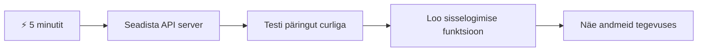
- **Minut 1-2**: Käivita oma API server (`cd api && npm start`) ja testi ühendus
- **Minut 3**: Loo lihtne `getAccount()` funktsioon kasutades fetchi
- **Minut 4**: Seosta sisselogimisvorm `action="javascript:login()"` atribuudiga
- **Minut 5**: Testi sisselogimist ja jälgi kontode andmete ilmumist konsoolis

**Kiired testikäsklused**:
```bash
# Kontrolli, kas API töötab
curl http://localhost:5000/api

# Testkontoga andmete toomine
curl http://localhost:5000/api/accounts/test
```

**Miks see oluline on**: 5 minutiga näed asünkroonse andmete toomise maagiat, mis töötab iga kaasaegse veebirakenduse aluseks. See on vundament, mis paneb äppide tunduma kiire ja elusana.

## 🗺️ Sinu õpiteek andmepõhistesse veebirakendustesse

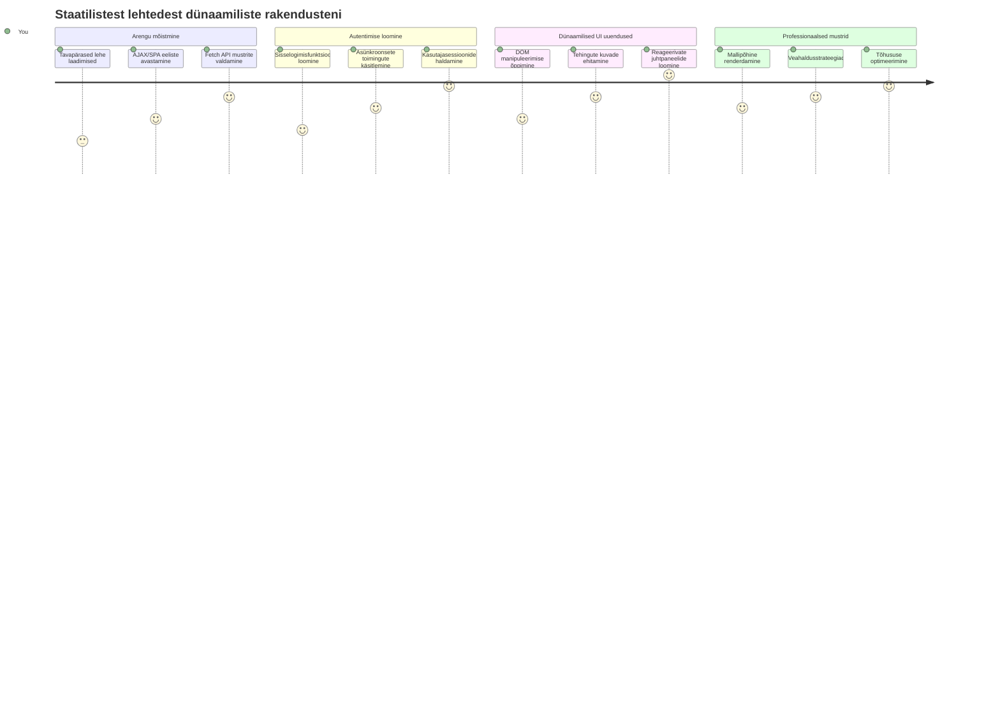
**Õpiteekonnal sihtpunkt**: Selle loengu lõpuks saad aru, kuidas kaasaegsed veebirakendused toovad, töötlevad ja kuvavad andmeid dünaamiliselt, luues professionaalseid kasutajakogemusi, mida me ootame.

## Eelloengu viktoriin

[Eelloengu viktoriin](https://ff-quizzes.netlify.app/web/quiz/45)

### Eeldused

Enne andmete toomise algust veendu, et sul on valmis järgmised komponendid:

- **Eelmine õppetükk**: Lõpeta [Sisselogimis- ja registreerimisvorm](../2-forms/README.md) – ehitame selle peale
- **Kohalik server**: Paigalda [Node.js](https://nodejs.org) ja käivita [serveri API](../api/README.md), et pakkuda kontode andmeid
- **API ühendus**: Testi oma serveri ühendust selle käsuga:

```bash
curl http://localhost:5000/api
# Oodatud vastus: "Panga API v1.0.0"
```

See kiire test tagab, et kõik komponendid suhtlevad korrektselt:
- Kontrollib, et Node.js töötab su süsteemis õigesti
- Kinnitub, et API server on aktiivne ja vastab
- Veendub, et sinu äpp saab serveriga ühendust (nagu raadioside kontroll enne missiooni)

## 🧠 Andmehaldussüsteemi ülevaade

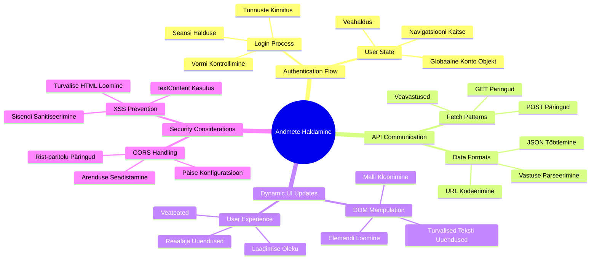
**Põhiprintsiip**: Kaasaegsed veebirakendused on andmete orkestreerimissüsteemid – nad koordineerivad kasutajaliideseid, serveri API-sid ja brauseri turvemudeleid, et luua sujuvaid ja reageerivaid kogemusi.

---

## Arusaamine andmete toomisest kaasaegsetes veebirakendustes

Veebirakenduste viis andmeid käsitleda on viimase kahekümne aastaga oluliselt arenenud. Selle arenguga arusaamine aitab mõista, miks tänapäevased tehnikad nagu AJAX ja Fetch API on nii võimsad ja miks need on saanud veebiarendajate jaoks asendamatuks tööriistaks.

Uurime, kuidas traditsioonilised veebilehed töötasid võrreldes dünaamiliste reageerivate rakendustega, mida täna ehitame.

### Traditsioonilised mitmelehelised rakendused (MPA)

Veebi algusaegadel oli iga klikkimine nagu telekanalite vahetamine vanas teleris – ekraan läks mustaks ja tihkus aeglaselt uue sisuga täituma. Selline oli varajaste veebirakenduste reaalsus, kus iga tegevus tähendas terve lehe nullist uuesti ülesehitamist.

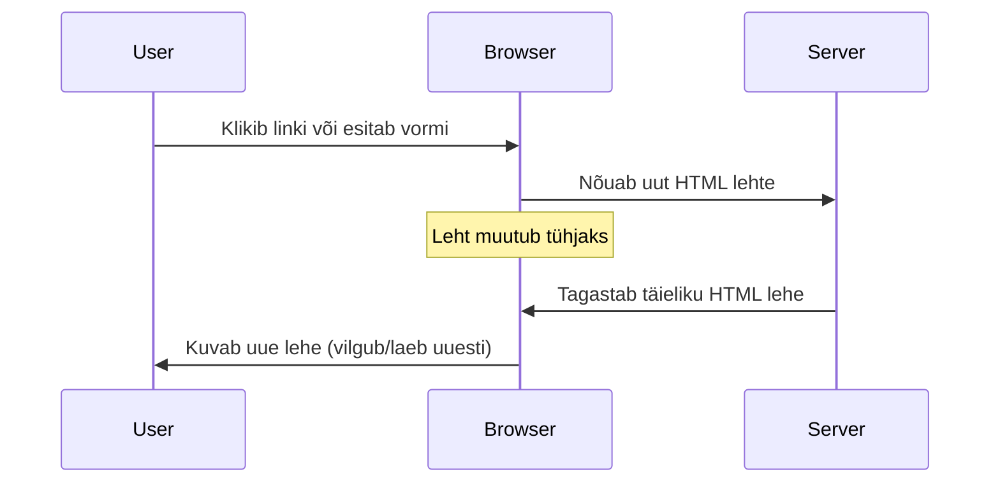
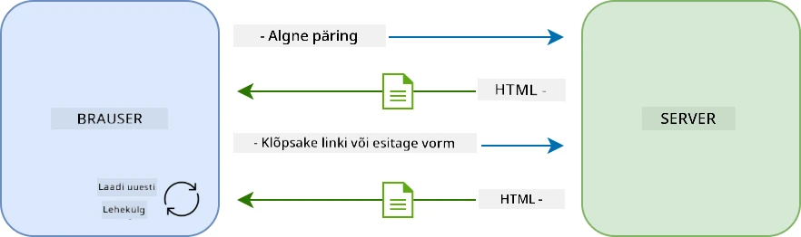

**Miks see tundus kohmakas:**
- Iga klikiga tuli terve leht nullist ehitada
- Kasutajate mõtlemine katkestati nende tüütute lehevilkumistega
- Su internetiühendus töötas ülekoormatud, laadides ikka ja jälle sama päist ja jalust
- Rakendused tundusid pigem kausta sirvimisena kui tarkvara kasutamisena

### Kaasaegsed ühelehelised rakendused (SPA)

AJAX (asünkroonne JavaScript ja XML) muutis selle paradigma täielikult. Nagu Rahvusvahelise Kosmosejaama modulaarne ehitus, kus astronaudid saavad vahetada üksikuid komponente ilma kogu struktuuri uuesti ehitmata, võimaldab AJAX meil uuendada veebilehe kindlaid osi ilma kogu lehte uuesti laadimata. Kuigi nimetus sisaldab XML-i, kasutame enamasti JSON-i, aga põhimõte on sama: uuendame ainult seda, mis vajab muutmist.

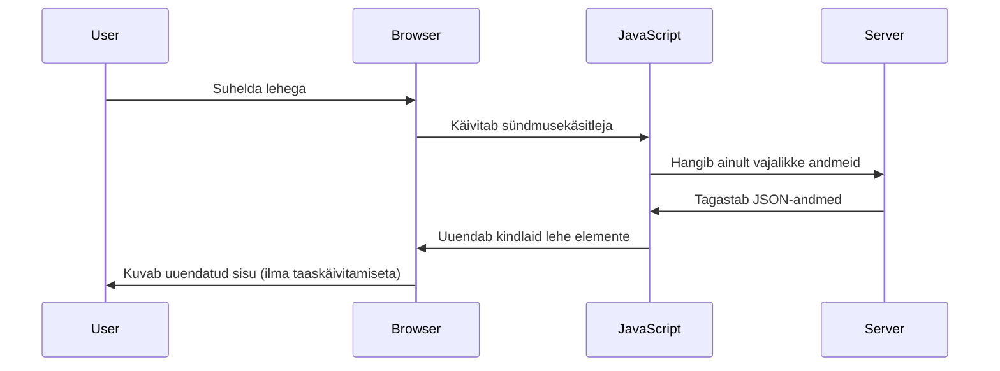
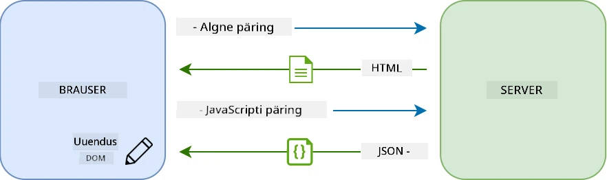

**Miks SPA-d tunduvad nii palju sujuvamad:**
- Uuendatakse ainult neid osi, mis tegelikult muutusid (nutikas, eks?)
- Pole enam ebameeldivaid katkestusi – kasutajad jäävad oma voogu
- Vähem andmeid liigub üle võrgu, seepärast laadimine on kiirem
- Kõik tundub kiirem ja reageerivam, nagu telefoniäpid

### Areng kaasaegse Fetch API-sse

Kaasaegsed brauserid pakuvad [`Fetch` API-d](https://developer.mozilla.org/docs/Web/API/Fetch_API), mis asendab vanema [`XMLHttpRequest`](https://developer.mozilla.org/docs/Web/API/XMLHttpRequest/Using_XMLHttpRequest). Nagu mürale kirjutamise ja e-kirja saatmise vahe – Fetch API kasutab lubadusi (promises) puhtama asünkroonse koodi jaoks ning töötab loomulikult JSON-iga.

| Omadus | XMLHttpRequest | Fetch API |
|---------|----------------|----------|
| **Süntaks** | Komplitseeritud tagasikutsumisega | Puhtalt lubadustel põhinev |
| **JSON käsitlemine** | Vajab käsitsi parsimist | Sisseehitatud `.json()` meetod |
| **Veahaldus** | Piiratud veateave | Ulatuslikud veateated |
| **Kaasaegne tugi** | Pärandkompatibliilsus | ES6+ lubadused ja async/await |

> 💡 **Brauseri ühildumine**: Hea uudis – Fetch API töötab kõigis kaasaegsetes brauserites! Kui huvitab konkreetne versioon, on täielik ühilduvusloetelu [caniuse.com](https://caniuse.com/fetch).
> 
**Põhitõde:**
- Töötab suurepäraselt Chrome, Firefox, Safari ja Edge brauserites (läbi keerulisuse kõikjal, kus su kasutajad on)
- Ainult Internet Explorer vajab lisaabi (ja ausalt öeldes on aeg IE-st loobuda)
- Valmistab sind hästi ette sujuvaks async/await mustrite kasutamiseks, mida hiljem kasutame

### Kasutaja sisselogimise ja andmete pärimise rakendamine

Rakendame nüüd sisselogimissüsteemi, mis muudab su pangarakenduse staatilisest kuvarist funktsionaalseks äpiks. Nagu turvameetmed sõjaväebaaside autentimisel, kontrollime kasutaja volitusi ja seejärel võimaldame ligipääsu nende andmetele.

Ehitame selle sammhaaval, alustades põhilisest autentimisest ja seejärel lisades andmete toomise.

#### Samm 1: Loo sisselogimisfunktsiooni alus

Ava oma `app.js` fail ja lisa uus `login` funktsioon, mis haldab kasutaja autentimist:

```javascript
async function login() {
  const loginForm = document.getElementById('loginForm');
  const user = loginForm.user.value;
}
```

**Läheme selle läbi:**
- See `async` märksõna? See ütleb JavaScriptile: "see funktsioon võib vajada ootamist"
- Saame oma vormi lehelt (midagi erilist, leiame selle lihtsalt ID kaudu)
- Seejärel võtame välja, mida kasutaja kasutajanime lahtrisse kirjutas
- Nüüd üks nipp: igale vormi sisendile pääseb ligi selle `name` atribuudi kaudu – pole vaja keerulist getElementById kutsumist!

> 💡 **Vormile ligipääsu muster**: Iga vormikontrolli saab kätte tema nime järgi (HTML-is määratud `name` atribuudi kaudu) kui vormi omaduse – see annab puhta ja loetava võimaluse vormiandmete saamiseks.

#### Samm 2: Loo kontoandmete toomise funktsioon

Edasi loome pühendatud funktsiooni, mis toob serverist kontoandmeid. See järgib sama mustrit nagu su registreerimisfunktsioon, aga keskendub andmete pärimisele:

```javascript
async function getAccount(user) {
  try {
    const response = await fetch('//localhost:5000/api/accounts/' + encodeURIComponent(user));
    return await response.json();
  } catch (error) {
    return { error: error.message || 'Unknown error' };
  }
}
```

**See kood teeb järgmist:**
- **Kasutab** kaasaegset `fetch` API-d asünkroonseks andmete pärimiseks
- **Ehitatakse** GET päringu URL koos kasutajanime parameetriga
- **Rakendab** `encodeURIComponent()` funktsiooni, et turvaliselt töödelda erisümboleid URL-is
- **Muutab** vastuse JSON-formaati, et hõlpsalt andmeid töödelda
- **Haldab** vigu graatsiliselt, tagastades vea objekti, mitte äpi kokkujooksmise

> ⚠️ **Turvapähekanne**: `encodeURIComponent()` tagab, et erisümbolid URL-ides ei muutu valeks - nagu sõjalaevade sidekodeeringud, tagab see sõnumi õige kohalejõudmise ja väldib näiteks "#" või "&" vale mõistmist.
> 
**Miks see oluline on:**
- Väldib erisümbolitega URL-i rikkeid
- Kaitseb URL manipuleerimise rünnakute eest
- Tagab, et server saab õige päringu
- Järgib turvalise kodeerimise tavasid

#### HTTP GET päringute mõistmine

Siin on üllatav fakt: kui kasutad `fetch` ilma lisavalikuteta, teeb ta automaatselt [`GET`](https://developer.mozilla.org/docs/Web/HTTP/Methods/GET) päringu. See sobib meie eesmärgiks – küsida serverilt "palun näita selle kasutaja kontoandmeid".

GET päring on nagu viisakas raamatukogust raamatu laenamine – sa palud midagi vaadata, mis juba olemas on. POST päringud (mida kasutasime registreerimisel) on pigem nagu uue raamatu esitlemine kogusse.

| GET päring | POST päring |
|-------------|-------------|
| **Eesmärk** | Oleva andme vaatamine | Uue andme saatmine serverisse |
| **Parameetrid** | URL teel/küsimustestringis | Päringu kehas |
| **Vahemällu salvestus** | Brauserid võivad vahemällu salvestada | Tavaliselt ei salvestata |
| **Turvalisus** | Nähtav URL-is ja logides | Peidetud päringu kehas |

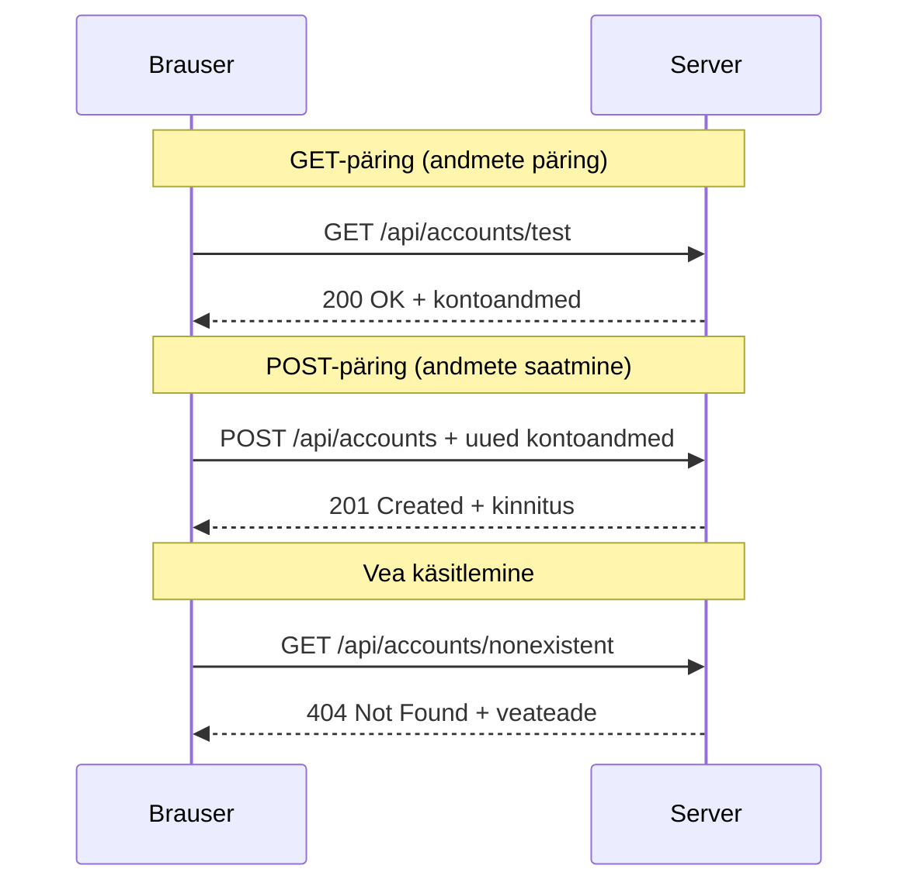
#### Samm 3: Kõike kokku toomine

Selleks rahuldustpakkuvaks osaks ühenda oma kontoandmete pärimise funktsioon sisselogimise protsessiga. Siin kõik omavahel klapib:

```javascript
async function login() {
  const loginForm = document.getElementById('loginForm');
  const user = loginForm.user.value;
  const data = await getAccount(user);

  if (data.error) {
    return console.log('loginError', data.error);
  }

  account = data;
  navigate('/dashboard');
}
```

See funktsioon järgib selget järjestust:
- Võtab kasutajanime vormi sisendist
- Pärib kasutaja kontoandmed serverist
- Haldab tekkivaid vigu
- Salvestab kontoandmed ja liigub edukal sisselogimisel armatuurlauale

> 🎯 **Async/Await muster**: Kuna `getAccount` on asünkroonne, kasutame `await` märksõna, et peatada kood serveri vastuseni ootama. See hoiab ära koodi jooksu määratlemata andmetega.

#### Samm 4: Andmete hoidla loomine

Su äpil peab olema koht, kuhu kontoandmeid pärast laadimist salvestada – kujutle seda kui äpi lühimälu, kus hoitakse käesoleva kasutaja andmeid. Lisa see rida oma `app.js` faili ülaossa:

```javascript
// See hoiab käesoleva kasutaja kontoandmeid
let account = null;
```

**Miks seda vaja on:**
- Hoiab kontoandmed kättesaadavana igast rakenduse osast
- Algväärtus `null` tähendab "keegi pole veel sisse logitud"
- Uuendub, kui keegi edukalt sisse logib või registreerub
- Toimib tõe ühtse allikana – pole segadust, kes on sisse logitud

#### Samm 5: Vormiga ühenduse loomine

Ühenda oma äsja loodud sisselogimisfunktsioon HTML vormiga. Uuenda oma vormi sildi nii:

```html
<form id="loginForm" action="javascript:login()">
  <!-- Your existing form inputs -->
</form>
```

**Milleks see väike muudatus:**
- Takistab vormil oma vaikekäitumist, mis oleks kogu lehe uuesti laadimine
- Kutsutakse selle asemel sinu loodud JavaScripti funktsioon
- Tagab sujuva ühelehelise rakenduse kogemuse
- Annab täieliku kontrolli selle üle, mis juhtub, kui kasutaja klikib "Login"

#### Samm 6: Paranda registreerimisfunktsiooni

Ühtlustamiseks uuenda ka oma `register` funktsiooni nii, et salvestatakse kontodata ja liigutakse armatuurlauale:

```javascript
// Lisage need read oma registreerimisfunktsiooni lõppu
account = result;
navigate('/dashboard');
```

**See täiendus annab:**
- **Sujuva** ülemineku registreerimisest armatuurlauale
- **Ühtse** kasutajakogemuse nii sisselogimise kui registreerimise protsessides
- **Vahetu** ligipääsu kontoandmetele edukal registreerimisel

#### Oma koodi testimine

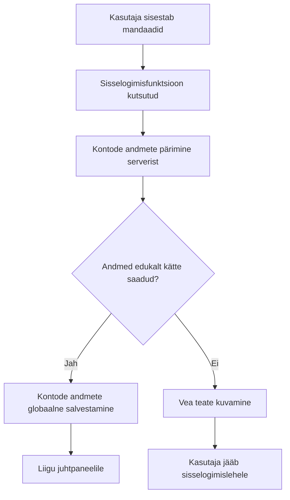
**Nüüd aeg proovida:**
1. Loo uus konto, et veenduda, et kõik töötab
2. Proovi nendega sisse logida
3. Kui midagi tundub paigast, vaata brauseri konsooli (F12)
4. Veendu, et pärast edukat sisselogimist jõuad armatuurlauale

Kui midagi ei tööta, ära paanitse! Enamik probleeme on lihtsad vead, nagu trükivead või API serveri mittetöölepanemine.

#### Kiire märkuse arengutevahelise nõidusest (Cross-Origin)

Võib-olla küsid: "Kuidas mu veebirakendus suhtleb API serveriga, kui nad töötavad erinevatel portidel?" Väga hea küsimus! See puudutab midagi, millega iga veebiarendaja kunagi kokku puutub.

> 🔒 **Cross-Origin turvalisus**: Brauserid rakendavad "same-origin policy" ehk samu-juurte reeglit, et takistada volitamata side loomist erinevate domeenide vahel. Nagu Pentagoni turvafilter, kontrollitakse sideõigust enne andmete edastamist.
> 
**Meie konfiguratsioonis:**
- Sinu veebirakendus jookseb `localhost:3000` (arendusserver)
- Sinu API server töötab `localhost:5000` (tagaruumiserver)
- API server lisab [CORS pealkirjad](https://developer.mozilla.org/docs/Web/HTTP/CORS), mis lubavad su veebirakendusel temaga suhelda

See peegeldab reaalse maailma arendust, kus frontend- ja backend-rakendused tavaliselt jooksevad eraldiseisvatel serveritel.

> 📚 **Lisaks lugemiseks**: Süvene API-de ja andmete toomise teemadesse selle põhjaliku [Microsoft Learn mooduli kaudu](https://docs.microsoft.com/learn/modules/use-apis-discover-museum-art/?WT.mc_id=academic-77807-sagibbon).

## Andmete elustamine HTML-is

Nüüd teeme toodu andmed kasutajatele nähtavaks DOM-i manipuleerimisega. Nagu fotode ilmutamine pimedas ruumis, muudame nähtamatud andmed millekski, mida kasutajad näevad ja millega saavad suhelda.
DOM-manipulatsioon on tehnika, mis muudab staatilisi veebilehti dünaamilisteks rakendusteks, mis uuendavad oma sisu kasutaja interaktsioonide ja serveri vastuste põhjal.

### Õige tööriista valimine

Kui on vaja HTML-i JavaScripti abil uuendada, on sul mitu võimalust. Mõtle neile kui erinevatele tööriistadele tööriistakastis – igaüks sobib kindlateks töödeks:

| Meetod | Milleks see hea on | Millal kasutada | Turvalisuse tase |
|--------|---------------------|----------------|--------------|
| `textContent` | Kasutaja andmete turvaline kuvamine | Igal ajal, kui näitad teksti | ✅ Kindel |
| `createElement()` + `append()` | Komplekssed paigutused | Uute sektsioonide/loendite loomine | ✅ Tõestatud |
| `innerHTML` | HTML sisu määramine | ⚠️ Väldi seda võimalust | ❌ Riskantne |

#### Turvaline tekstikuvamise viis: textContent

[`textContent`](https://developer.mozilla.org/docs/Web/API/Node/textContent) omadus on parim sõber kasutajaandmete kuvamisel. See on nagu turvatöötaja sinu veebilehel – midagi kahjulikku läbi ei saa:

```javascript
// Turvaline ja usaldusväärne viis teksti uuendamiseks
const balanceElement = document.getElementById('balance');
balanceElement.textContent = account.balance;
```

**textContent eelised:**
- Töötleb kõike kui tavalist teksti (takistab skriptide täitmist)
- Eemaldab automaatselt olemasoleva sisu
- Efektiivne lihtsate tekstiuuenduste jaoks
- Pakub sisse ehitatud turvalisust pahatahtliku sisu vastu

#### Dünaamiliste HTML-elementide loomine

Rohkem keerukama sisu jaoks kombineeri [`document.createElement()`](https://developer.mozilla.org/docs/Web/API/Document/createElement) meetodit koos [`append()`](https://developer.mozilla.org/docs/Web/API/ParentNode/append) funktsiooniga:

```javascript
// Ohutu viis uute elementide loomiseks
const transactionItem = document.createElement('div');
transactionItem.className = 'transaction-item';
transactionItem.textContent = `${transaction.date}: ${transaction.description}`;
container.append(transactionItem);
```

**Selle lähenemise mõistmine:**
- **Loob** DOM-elemente programmiliselt
- **Hoiab** täielikku kontrolli elementide atribuutide ja sisu üle
- **Võimaldab** keerukaid, pesastatud elementide struktuure
- **Säilitab** turvalisuse, eraldades struktuuri sisust

> ⚠️ **Turvaküsimus**: Kuigi [`innerHTML`](https://developer.mozilla.org/docs/Web/API/Element/innerHTML) on paljudes juhendites, võib see täita leitud skripte. Nagu CERN-i turvaprotokollid keelavad volitamata koodide käivitamise, pakuvad `textContent` ja `createElement` turvalisemaid alternatiive.
> 
**innerHTML riskid:**
- Täidab kasutajaandmetes olevad `<script>` märgistused
- On haavatav koodi süstimise rünnakutele
- Loob potentsiaalseid turvaauke
- Turvalised alternatiivid pakuvad sama funktsionaalsust

### Veateadete kasutajasõbralikumaks muutmine

Praegu kuvatakse sisselogimise vead ainult brauseri konsoolis, mis kasutajale nähtamatu on. Nagu piloodi sise diagnostika ja reisija info süsteemi erinevus, peame saadetama olulist infot õiges kanalil.

Veateadete nähtavaks muutmine annab kasutajale kohe tagasisidet, mis läks valesti ja kuidas edasi tegutseda.

#### Samm 1: Lisa koht veateadete kuvamiseks

Alustuseks loo oma HTML-is koht veateadetele. Lisa see otse enne sisselogimisnuppu, nii et kasutajad näevad seda loomulikult:

```html
<!-- This is where error messages will appear -->
<div id="loginError" role="alert"></div>
<button>Login</button>
```

**Mis siin toimub:**
- Loome tühja konteineri, mis jääb nähtamatuks seni kuni seda vajatakse
- Asetub sinna, kuhu kasutajad loomulikult vaatavad pärast "Logi sisse" vajutamist
- `role="alert"` on hea lisand ekraanilogejatele – ütleb abi tehnoloogiale "tõsi, see on oluline!"
- Unikaalne `id` annab JavaScriptile lihtsa sihtmärgi

#### Samm 2: Loo abistav funktsioon

Teeme väikese abifunktsiooni, mis uuendab mis tahes elemendi teksti. See on üks neist "kirjuta üks kord, kasuta kõikjal" funktsioonidest, mis säästab aega:

```javascript
function updateElement(id, text) {
  const element = document.getElementById(id);
  element.textContent = text;
}
```

**Funktsiooni eelised:**
- Lihtne liides, mis vajab ainult elemendi ID-d ja teksti
- Turvaliselt leiab ja uuendab DOM-elemente
- Taaskasutatav, vähendab koodi dubleerimist
- Säilitab rakenduses järjekindla uuenduskäitumise

#### Samm 3: Näita veateateid nähtavalt

Asendame varjatud konsoolisõnumi millegagi, mida kasutaja näeb. Uuenda oma sisselogimise funktsiooni:

```javascript
// Selle asemel, et lihtsalt konsooli logida, näita kasutajale, mis on valesti
if (data.error) {
  return updateElement('loginError', data.error);
}
```

**See väike muudatus teeb suure vahe:**
- Veateated ilmuvad kohe sinna, kuhu kasutaja vaatab
- Pole enam salapäraseid vaikivaid ebaõnnestumisi
- Kasutajad saavad kohese ja käegakatsutava tagasiside
- Sinu rakendus hakkab tunduma professionaalsem ja läbimõeldum

Nüüd, kui testid valede andmetega, näed abistavat veateadet otse lehel!


#### Samm 4: Kaasa arvutustel puudega kasutajad

Selle `role="alert"` omaduse juures on midagi ägedat – see pole lihtsalt dekoratsioon! See atribuut loob [Live Region'i](https://developer.mozilla.org/docs/Web/Accessibility/ARIA/ARIA_Live_Regions), mis teatab muudatustest ekraanilugejatele koheselt:

```html
<div id="loginError" role="alert"></div>
```

**Miks see oluline on:**
- Ekraanilugeja kasutajad kuulevad veateadet kohe, kui see ilmub
- Kõik saavad sama olulise info sõltumata navigeerimisviisist
- Lihtne viis muuta rakendus ligipääsetavamaks rohkematele inimestele
- Näitab, et hoolid kaasavatest kogemustest

Sellised väiksed nüansid eristavad häid arendajaid suurepärastest!

### 🎯 Pedagoogiline peatükk: autentimise mustrid

**Peatu ja mõtle:** Sa just rakendasid täieliku autentimiskäigu. See on veebiarenduse fundamentaalse mustri näide.

**Kiire ise-hindamine:**
- Kas suudad seletada, miks kasutame API kõnede puhul async/await?
- Mis juhtuks, kui unustaksime `encodeURIComponent()` funktsiooni?
- Kuidas parandab meie veahaldus kasutajakogemust?

**Tegeliku maailma seos:** Mustreid, mida õppisid (asünkroonne andmete pärimine, veahaldus, kasutajate tagasiside), kasutatakse igas suuremas veebirakenduses alates sotsiaalmeediast kuni e-kaubanduseni. Sa ehitad tööstustasemel oskusi!

**Väljakutse küsimus:** Kuidas muuta autentimissüsteemi, et hallata mitut kasutajate rolli (klient, admin, teller)? Mõtle andmestruktuurile ja kasutajaliidese muutustele.

#### Samm 5: Rakenda sama mustrit registreerimisel

Järjepidevuse huvides rakenda identsed veahaldusmeetodid oma registreerimisvormis:

1. **Lisa** veateate kuvamise element oma registreerimise HTML-i:
```html
<div id="registerError" role="alert"></div>
```

2. **Uuenda** oma registreerimisfunktsiooni sama veateate näitamise mustri järgi:
```javascript
if (data.error) {
  return updateElement('registerError', data.error);
}
```

**Järjepideva veahalduse eelised:**
- **Tagab** ühtlase kasutajakogemuse kõikides vormides
- **Vähendab** kognitiivset koormust tuntud mustrite kasutamisega
- **Lihtsustab** hooldust taaskasutatava koodiga
- **Tagab** juurdepääsetavuse standardite järgimise rakenduses

## Dünaamilise juhtpaneeli loomine

Nüüd muudame sinu staatilise juhtpaneeli dünaamiliseks liideseks, mis kuvab reaalajas kontode andmeid. Nagu vahe trükitud lennugraafiku ja lennujaama reaalajas väljumistöötahvlite vahel – nihkuda staatilisest info kuvamisest otseajaga reageerivale kuvamisele.

Kasutades DOM-manipulatsiooni tehnikaid, mida oled õppinud, loome juhtpaneeli, mis uuendab automaatselt jooksvaid kontoandmeid.

### Tutvu oma andmetega

Enne ehitama asumist piilume, millist tüüpi andmed su server tagastab. Kui keegi edukalt sisse logib, saad kasutada järgmist informatsiooni:

```json
{
  "user": "test",
  "currency": "$",
  "description": "Test account",
  "balance": 75,
  "transactions": [
    { "id": "1", "date": "2020-10-01", "object": "Pocket money", "amount": 50 },
    { "id": "2", "date": "2020-10-03", "object": "Book", "amount": -10 },
    { "id": "3", "date": "2020-10-04", "object": "Sandwich", "amount": -5 }
  ]
}
```

**See andmestruktuur annab:**
- **`user`**: sobib isikupärastamiseks ("Tere tulemast tagasi, Sarah!")
- **`currency`**: tagab rahasummade õige kuvamise
- **`description`**: sõbralik konto nimi
- **`balance`**: oluline jooksva saldona
- **`transactions`**: kogu tehingute ajalugu koos detailidega

Kõik, mida vajad professionaalse pangajuhtepaneeli loomiseks!

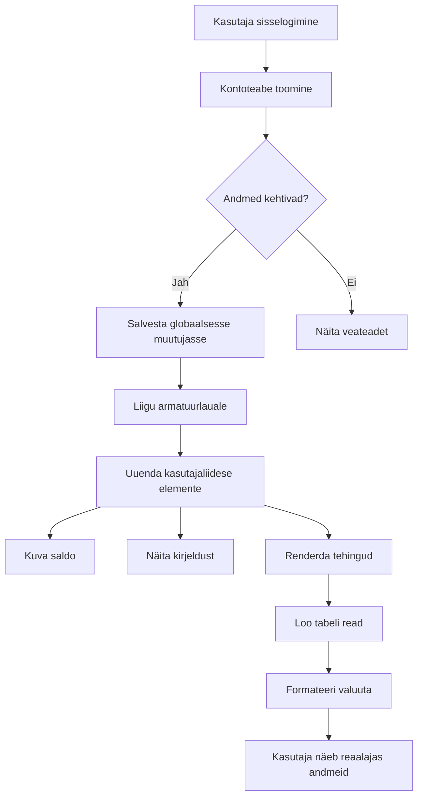
> 💡 **Nipp:** Soovid oma juhtpaneeli kohe näha? Kasuta sisselogimisel kasutajanime `test` – see on eelnevalt täidetud näidisandmetega, et saaksid ilma tehinguid loomata näha kõike toimimas.
> 
**Testkonto eelis:**
- Tuleb realistlike näidisandmetega
- Hea näha, kuidas tehingud kuvatakse
- Väga sobilik juhtpaneeli funktsioonide testimiseks
- Säästab sind kasutu andme loomise tegemisest käsitsi

### Juhtpaneeli kuvamise elementide loomine

Ehita juhmelemendid samm-sammult, alustades konto kokkuvõtte infoga ja seejärel keerulisemate funktsioonide nagu tehingute loendid juurde liikumisega.

#### Samm 1: Uuenda oma HTML struktuuri

Asenda staatiline "Saldo" sektsioon dünaamiliste kohatäiteks, mida saab JavaScript täita:

```html
<section>
  Balance: <span id="balance"></span><span id="currency"></span>
</section>
```

Seejärel lisa sektsioon konto kirjelduse jaoks. Kuna see toimib juhtelemendi tiitli funktsioonina, kasuta semantilist HTML-i:

```html
<h2 id="description"></h2>
```

**HTML struktuuri mõistmine:**
- **Kasuta** eraldi `<span>` elemente saldole ja valuutale, et neid eraldi kontrollida
- **Lisa** igale elemendile unikaalne ID JavaScripti sihtimiseks
- **Kasuta** semantilist märgistust `<h2>` konto kirjelduse jaoks
- **Loo** loogiline hierarhia ekraanilugejate ja SEO jaoks

> ✅ **Juurdepääsetavuse märkus:** Konto kirjeldus töötab juhtelemendi tiitli funktsioonina, seega on see semantiliselt päisega märgistatud. Loe rohkem selle kohta, kuidas [pealkirjastruktuur](https://www.nomensa.com/blog/2017/how-structure-headings-web-accessibility) mõjutab juurdepääsetavust. Kas suudad leida teisi elemente oma lehel, mis võiksid kasu saada päise märgistusest?

#### Samm 2: Loo juhtpaneeli uuendamise funktsioon

Kirjuta funktsioon, mis täidab juhtpaneeli reaalse kontoandmetega:

```javascript
function updateDashboard() {
  if (!account) {
    return navigate('/login');
  }

  updateElement('description', account.description);
  updateElement('balance', account.balance.toFixed(2));
  updateElement('currency', account.currency);
}
```

**Samm-sammult, mida see funktsioon teeb:**
- **Kontrollib**, kas konto andmed on olemas
- **Suunab** sisselogimata kasutajad tagasi sisselogimislehele
- **Uuendab** konto kirjelduse kasutades taaskasutatavat `updateElement` funktsiooni
- **Formaat** saldole, et näidata alati 2 koma järel kohta
- **Kuvab** sobiva valuutamärgi

> 💰 **Raha vormindamine:** See [`toFixed(2)`](https://developer.mozilla.org/docs/Web/JavaScript/Reference/Global_Objects/Number/toFixed) meetod on päästja! See tagab, et saldo näeb alati välja nagu päris raha – "75.00" mitte lihtsalt "75". Kasutajad hindavad tuttavat valuutavormingut.

#### Samm 3: Veendu, et juhtpaneel uuenduks

Selleks, et juhtpaneel laeks uuesti iga kord, kui kasutaja sinna satub, peame lisama selle oma navigeerimissüsteemi. Kui tegid [1. tunni ülesande](../1-template-route/assignment.md), siis peaks see olema tuttav. Kui mitte, siis siin on, mida vajad:

Lisa oma `updateRoute()` funktsiooni lõppu:

```javascript
if (typeof route.init === 'function') {
  route.init();
}
```

Seejärel muuda oma marsruute, et lisada juhtpaneeli initsialiseerimine:

```javascript
const routes = {
  '/login': { templateId: 'login' },
  '/dashboard': { templateId: 'dashboard', init: updateDashboard }
};
```

**Mis see nutikas seadistus teeb:**
- Kontrollib, kas marsruudil on spetsiaalne initsialiseerimiskood
- Käivitab selle koodi automaatselt, kui marsruut laaditakse
- Tagab, et juhtpaneel kuvab alati värskeid andmeid
- Hoiab sinu marsruutimise loogika puhtana ja organiseerituna

#### Juhtpaneeli testimine

Kui oled need muudatused teinud, testi juhtpaneeli:

1. **Logi sisse** testkontoga
2. **Veendu**, et suunatakse juhtpaneelile
3. **Kontrolli**, et konto kirjeldus, saldo ja valuuta kuvatakse korrektselt
4. **Proovi välja logida ja uuesti sisse logida**, et veenduda andmete värskendamises

Sinu juhtpaneel peaks nüüd kuvama dünaamiliselt uuenevat kontoinfot, mis põhineb sisselogitud kasutaja andmetel!

## Tarkade tehingunimekirjade loomine mallide abil

Selle asemel, et iga tehingu HTML-i käsitsi luua, kasutame malle, mis genereerivad järjepideva vormingu automaatselt. Nagu kosmoselaeva tootmisel kasutatavad standardkomponendid, tagavad mallid iga tehingurida järjepideva struktuuri ja välimuse.

See tehnika skaleerub tõhusalt mõnest tehingust tuhandeteni, säilitades järjepideva jõudluse ja esitluse.

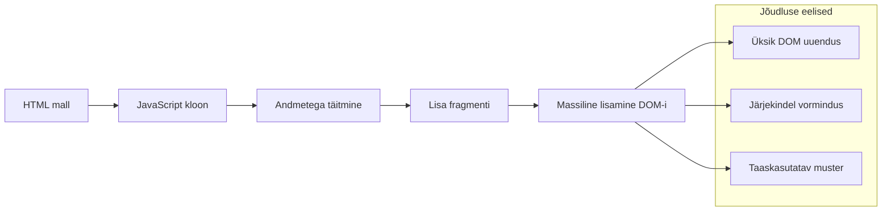
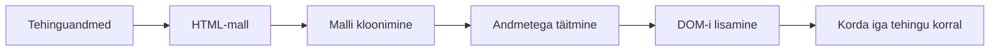
### Samm 1: Loo tehingu mall

Alustuseks lisa oma HTML kehasse taaskasutatav mall tehinguridade jaoks:

```html
<template id="transaction">
  <tr>
    <td></td>
    <td></td>
    <td></td>
  </tr>
</template>
```

**HTML mallide mõistmine:**
- **Määratleb** ühe tabelirea struktuuri
- **Jääb** nähtamatuks kuni kloonitakse ja JavaScriptiga täidetakse
- **Sisaldab** kolme lahtrit kuupäeva, kirjelduse ja summa jaoks
- **Pakku** taaskasutatavat mustrit järjepideva vormingu saavutamiseks

### Samm 2: Valmista oma tabel dünaamiliseks sisuks ette

Lisa tabeli keha elemendile `id`, et JavaScript saaks seda hõlpsalt sihtida:

```html
<tbody id="transactions"></tbody>
```

**Mida see saavutab:**
- **Loomine** selgelt määratletud sihtmärgiks tehinguridade lisamiseks
- **Eraldab** tabeli staatilise struktuuri dünaamilisest sisust
- **Võimaldab** hõlpsat tehingute tühjendamist ja uuesti täitmist

### Samm 3: Kirjuta tehinguridade tehasefunktsioon

Loo funktsioon, mis teisendab tehinguandmed HTML-elementideks:

```javascript
function createTransactionRow(transaction) {
  const template = document.getElementById('transaction');
  const transactionRow = template.content.cloneNode(true);
  const tr = transactionRow.querySelector('tr');
  tr.children[0].textContent = transaction.date;
  tr.children[1].textContent = transaction.object;
  tr.children[2].textContent = transaction.amount.toFixed(2);
  return transactionRow;
}
```

**Selle tehasefunktsiooni lahtimurdmine:**
- **Leiab** malli elemendi ID alusel
- **Kloonib** malli sisu turvaliseks manipuleerimiseks
- **Valib** kloonitud sisu seest tabelirea
- **Täidab** iga lahtri tehinguandmetega
- **Formaat** arve, et näidata korrektseid komakohti
- **Tagastab** lõppläbi valmis rea lisamiseks

### Samm 4: Genereeri mitu tehingurida tõhusalt

Lisa see kood oma `updateDashboard()` funktsiooni, et kuvada kõik tehingud:

```javascript
const transactionsRows = document.createDocumentFragment();
for (const transaction of account.transactions) {
  const transactionRow = createTransactionRow(transaction);
  transactionsRows.appendChild(transactionRow);
}
updateElement('transactions', transactionsRows);
```

**Selles tõhusas lähenemises:**
- **Loomine** dokumendifragmendi abil rühmitatud DOM-operatsioonid
- **Iga** tehingu läbimine konto andmetes
- **Moodustab** rea iga tehingu jaoks tehasefunktsiooni abil
- **Kogub** kõik read fragmendisse enne DOM-i lisamist
- **Teeb** ühe DOM uuenduse mitme eraldi asemel
> ⚡ **Jõudluse optimeerimine**: [`document.createDocumentFragment()`](https://developer.mozilla.org/docs/Web/API/Document/createDocumentFragment) töötab nagu Boeing'i kokkupaneku protsess – komponendid valmistatakse põhijoonest eemal ette ja seejärel paigaldatakse tervikuna. See partiina töötamise meetod vähendab DOM-i ümberjoonistamisi, tehes ühe sisestuse mitme üksiku toimingu asemel.

### Samm 5: Täienda uuendamisfunktsiooni mitmesisuga sisu jaoks

Sinu `updateElement()` funktsioon käsitleb hetkel ainult tekstisisu. Täienda seda nii, et see töötaks nii teksti kui ka DOM-sõlmedega:

```javascript
function updateElement(id, textOrNode) {
  const element = document.getElementById(id);
  element.textContent = ''; // Eemaldab kõik lapsed
  element.append(textOrNode);
}
```

**Peamised parandused selles uuenduses:**
- **Kustutab** olemasoleva sisu enne uue lisamist
- **Võtab vastu** kas tekstistringe või DOM-sõlmi parameetritena
- **Kasutab** [`append()`](https://developer.mozilla.org/docs/Web/API/ParentNode/append) meetodit paindlikkuse tagamiseks
- **Hoidab** tagurpidi ühilduvust olemasoleva tekstipõhise kasutusega

### Sinu juhtpaneeli testimine

Tuleb tõehetk! Vaatame, kuidas sinu dünaamiline juhtpaneel töötab:

1. Logi sisse kasutades `test` kontot (seal on valmis proovandmed)
2. Liigu oma juhtpaneelile
3. Kontrolli, et tehinguridade kuvamine toimib ja on korralikult vormindatud
4. Veendu, et kuupäevad, kirjelduse ja summad on korrektsed

Kui kõik töötab, näed oma juhtpaneelil täielikult funktsioneerivat tehingute nimekirja! 🎉

**Mida sa saavutasid:**
- Ehitasid juhtpaneeli, mis skaleerub ükskõik kui palju andmeid käsitledes
- Loodud taaskasutatavad mallid järjepidevaks vormindamiseks
- Rakendasid tõhusaid DOM-manipulatsiooni tehnikaid
- Arendasid funktsionaalsust, mis on võrreldav tootmispangandusrakendustega

Sa muutsid edukalt staatilise veebilehe dünaamiliseks veebirakenduseks.

### 🎯 Pedagoogiline kontrollpunkt: dünaamiline sisu genereerimine

**Arhitektuuri mõistmine**: Sa oled rakendanud keeruka andmetest UI-sse voogude süsteemi, mis peegeldab raamistikusid nagu React, Vue ja Angular kasutatavaid mustreid.

**Peamised omandatud kontseptsioonid:**
- **Mallipõhine renderdamine**: taaskasutatavate UI komponentide loomine
- **Dokumendifragmendid**: DOM-i jõudluse optimeerimine
- **Turvaline DOM-manipulatsioon**: turvahaavatavuste vältimine
- **Andmete teisendamine**: serveri andmete muutmine kasutajaliideseks

**Tööstuse seos**: Need tehnikad on kaasaegsete esipaneeliraamistike aluseks. Reacti virtuaalne DOM, Vue mallisüsteem ja Angulari komponendiarhitektuur põhinevad kõigil nende põhikontseptsioonide peal.

**Mõtiskluse küsimus**: Kuidas laiendaksid seda süsteemi reaalajas uuenduste käsitlemiseks (nt uued tehingud ilmuvad automaatselt)? Mõtle WebSocketite või serveripoolse sündmuste edastuse peale.

---

## 📈 Sinu andmehalduse meistriklassi ajakava

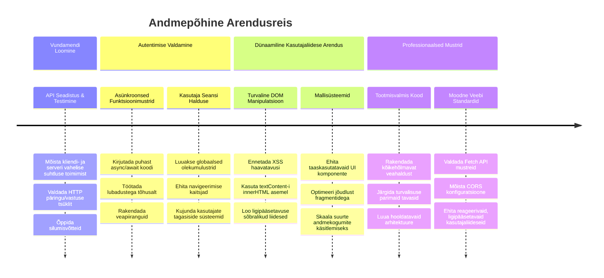
**🎓 Lõputunnistus**: Sa oled edukalt loonud täieliku andmepõhise veebirakenduse, kasutades kaasaegseid JavaScripti mustreid. Need oskused kantakse üle otse Reacti, Vue või Angulari raamistikuga töötamiseks.

**🔄 Järgmise taseme võimed:**
- Valmis uurima esipaneeliraamistikke, mis neid kontseptsioone kasutavad
- Valmis rakendama reaalajas funktsioone WebSocketitega
- Võimeline looma progressiivseid veebirakendusi, mis töötavad ka võrguühenduseta
- Alus edasijõudnud olekuhalduse mustrite õppimiseks on olemas

## GitHub Copilot Agendi väljakutse 🚀

Kasuta Agent režiimi, et lõpetada järgmine ülesanne:

**Kirjeldus:** Täienda pangarakendust, lisades tehingute otsingu ja filtreerimise funktsiooni, mis võimaldab kasutajatel leida tehinguid kuupäevavahemiku, summa või kirjelduse alusel.

**Juhis:** Loo pangarakendusele otsingufunktsionaalsus, mis sisaldab: 1) otsinguvormi sisendväljadega kuupäevavahemiku (alates/kuni), minimaal- ja maksimaal summa ning tehingu kirjelduse märksõnade jaoks, 2) `filterTransactions()` funktsioon, mis filtreerib account.transactions massiivi otsingukriteeriumide põhjal, 3) Uuenda `updateDashboard()` funktsiooni, et näidata filtreeritud tulemusi ja 4) Lisa "Tühjenda filtrid" nupp vaate lähtestamiseks. Kasuta kaasaegseid JavaScripti massiivimeetodeid nagu `filter()` ning käsitle otsingukriteeriumide tühjuse erandeid.

Õpi rohkem [agent režiimi](https://code.visualstudio.com/blogs/2025/02/24/introducing-copilot-agent-mode) kohta siit.

## 🚀 Väljakutse

Valmis viima oma pangarakenduse järgmisele tasemele? Muudame selle väljanägemise ja kasutajakogemuse nii heaks, et soovid seda päriselt kasutadagi. Siin on mõned ideed loomingulisuse süütamiseks:

**Muuda ilusaks**: Lisa CSS stiilid, et muuta sinu funktsionaalne juhtpaneel visuaalselt atraktiivseks. Mõtle puhastele joontele, heale vahele ja võib-olla ka peenetele animatsioonidele.

**Tee responsiivseks**: Proovi kasutades [meedia päringuid](https://developer.mozilla.org/docs/Web/CSS/Media_Queries) luua [responsiivne disain](https://developer.mozilla.org/docs/Web/Progressive_web_apps/Responsive/responsive_design_building_blocks), mis töötab suurepäraselt telefonidel, tahvelarvutitel ja lauaarvutitel. Sinu kasutajad tänavad sind!

**Lisa natuke sära**: Mõtle tehingute värvikoodimisele (roheline sissetuleku jaoks, punane kulude jaoks), ikoonide lisamisele või sellele, et liikumisel hiirega tekiksid efekti, mis muudavad liidese interaktiivseks.

Siin on, kuidas võib välja näha lihvitud juhtpaneel:

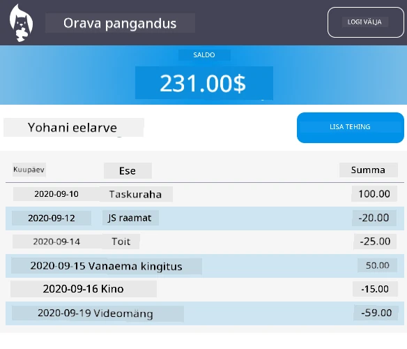

Sa ei pea seda täpselt kopeerima – kasuta seda inspiratsioonina ja loo oma stiil!

## Lõpuloengu viktoriin

[Lõpuloengu viktoriin](https://ff-quizzes.netlify.app/web/quiz/46)

## Kodutöö

[Kodeeri ümber ja kommenteeri oma kood](assignment.md)

---

<!-- CO-OP TRANSLATOR DISCLAIMER START -->
**Vastutusest loobumine**:  
See dokument on tõlgitud kasutades tehisintellekti tõlketeenust [Co-op Translator](https://github.com/Azure/co-op-translator). Kuigi me pingutame täpsuse nimel, palun arvestage, et automatiseeritud tõlked võivad sisaldada vigu või ebatäpsusi. Originaaldokument selle algkeeles on tunnustatud ja usaldusväärne allikas. Oluline info puhul soovitatakse kasutada professionaalset inimtõlget. Me ei vastuta ühegi arusaamatuse või valesti mõistmise eest, mis võib tuleneda selle tõlke kasutamisest.
<!-- CO-OP TRANSLATOR DISCLAIMER END -->