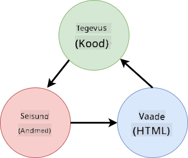

<!--
CO_OP_TRANSLATOR_METADATA:
{
  "original_hash": "b46acf79da8550d76445eed00b06c878",
  "translation_date": "2025-10-11T12:02:04+00:00",
  "source_file": "7-bank-project/4-state-management/README.md",
  "language_code": "et"
}
-->
# Pangaäpi loomine, osa 4: Oleku haldamise põhimõtted

## Eelloengu viktoriin

[Eelloengu viktoriin](https://ff-quizzes.netlify.app/web/quiz/47)

### Sissejuhatus

Kui veebirakendus kasvab, muutub keeruliseks kõigi andmevoogude jälgimine. Milline kood andmeid saab, milline leht neid tarbib, kus ja millal neid tuleb uuendada... on lihtne sattuda segase koodi otsa, mida on raske hallata. See on eriti tõsi, kui peate jagama andmeid rakenduse erinevate lehtede vahel, näiteks kasutajaandmeid. *Oleku haldamise* kontseptsioon on alati eksisteerinud igasugustes programmides, kuid kuna veebirakendused muutuvad üha keerukamaks, on see nüüd arenduse ajal oluline punkt, millele mõelda.

Selles viimases osas vaatame üle rakenduse, mille me ehitasime, et uuesti läbi mõelda, kuidas olekut hallatakse, võimaldades brauseri värskendamist igal hetkel ja andmete säilitamist kasutajaseansside vahel.

### Eeltingimus

Peate olema lõpetanud [andmete hankimise](../3-data/README.md) osa veebirakendusest selle õppetunni jaoks. Samuti peate installima [Node.js](https://nodejs.org) ja [käivitama serveri API](../api/README.md) lokaalselt, et saaksite hallata kontoandmeid.

Saate testida, kas server töötab korralikult, käivitades terminalis järgmise käsu:

```sh
curl http://localhost:5000/api
# -> should return "Bank API v1.0.0" as a result
```

---

## Oleku haldamise ümbermõtestamine

Eelmises õppetunnis [../3-data/README.md] tutvustasime rakenduses oleku põhimõtet globaalse `account` muutujaga, mis sisaldab praegu sisse logitud kasutaja pangandmeid. Kuid meie praegusel rakendusel on mõned puudused. Proovige värskendada lehte, kui olete juhtpaneelil. Mis juhtub?

Praegusel koodil on 3 probleemi:

- Olekuandmeid ei säilitata, kuna brauseri värskendamine viib teid tagasi sisselogimislehele.
- Oleku muutmiseks on mitu funktsiooni. Kui rakendus kasvab, võib see muuta muudatuste jälgimise keeruliseks ja on lihtne unustada ühe uuendamine.
- Olekuandmeid ei puhastata, nii et kui klõpsate *Logi välja*, jäävad kontoandmed alles, kuigi olete sisselogimislehel.

Me võiksime oma koodi uuendada, et neid probleeme ükshaaval lahendada, kuid see tekitaks rohkem koodi dubleerimist ja muudaks rakenduse keerukamaks ning raskemini hallatavaks. Või võiksime võtta paar minutit ja oma strateegia ümber mõelda.

> Milliseid probleeme me siin tegelikult lahendada püüame?

[Oleku haldamine](https://en.wikipedia.org/wiki/State_management) seisneb heade lähenemisviiside leidmises nende kahe konkreetse probleemi lahendamiseks:

- Kuidas hoida rakenduse andmevood arusaadavad?
- Kuidas hoida olekuandmed alati sünkroonis kasutajaliidesega (ja vastupidi)?

Kui olete nende probleemidega tegelenud, võivad kõik muud probleemid, mis teil võivad olla, kas juba lahendatud olla või muutuda lihtsamaks lahendada. Oleku haldamiseks on palju võimalikke lähenemisviise, kuid me valime levinud lahenduse, mis seisneb **andmete ja nende muutmise viiside tsentraliseerimises**. Andmevood toimiksid järgmiselt:



> Me ei käsitle siin osa, kus andmed automaatselt käivitavad vaate uuendamise, kuna see on seotud keerukamate [reaktiivse programmeerimise](https://en.wikipedia.org/wiki/Reactive_programming) kontseptsioonidega. See on hea järgnev teema, kui soovite süvitsi minna.

✅ Olemas on palju teeke, millel on erinevad lähenemisviisid oleku haldamiseks, [Redux](https://redux.js.org) on populaarne valik. Tutvuge kasutatavate kontseptsioonide ja mustritega, kuna see on sageli hea viis õppida, milliste potentsiaalsete probleemidega võite suurtel veebirakendustel silmitsi seista ja kuidas neid lahendada.

### Ülesanne

Alustame väikese refaktoreerimisega. Asendage `account` deklaratsioon:

```js
let account = null;
```

Järgmisega:

```js
let state = {
  account: null
};
```

Idee on *tsentraliseerida* kõik meie rakenduse andmed ühte olekuobjekti. Praegu on meil olekus ainult `account`, nii et see ei muuda palju, kuid loob tee edasisteks arenguteks.

Samuti peame värskendama funktsioone, mis seda kasutavad. Funktsioonides `register()` ja `login()` asendage `account = ...` `state.account = ...`;

Funktsiooni `updateDashboard()` alguses lisage see rida:

```js
const account = state.account;
```

See refaktoreerimine iseenesest ei toonud palju parandusi, kuid idee oli luua alus järgnevateks muudatusteks.

## Andmemuutuste jälgimine

Nüüd, kui oleme loonud `state` objekti andmete salvestamiseks, on järgmine samm värskenduste tsentraliseerimine. Eesmärk on muuta kõik muudatused ja nende toimumise ajad lihtsamini jälgitavaks.

Et vältida muudatusi `state` objektis, on samuti hea tava pidada seda [*muutumatuks*](https://en.wikipedia.org/wiki/Immutable_object), mis tähendab, et seda ei saa üldse muuta. See tähendab ka seda, et kui soovite midagi muuta, peate looma uue olekuobjekti. Sellega ehitate kaitse soovimatute [kõrvalmõjude](https://en.wikipedia.org/wiki/Side_effect_(computer_science)) vastu ja avate võimalused uute funktsioonide rakendamiseks, nagu undo/redo, samal ajal muutes veaallika mõistmise lihtsamaks. Näiteks võiksite logida iga muudatuse, mis olekus tehakse, ja hoida muudatuste ajalugu, et mõista vea allikat.

JavaScriptis saate kasutada [`Object.freeze()`](https://developer.mozilla.org/docs/Web/JavaScript/Reference/Global_Objects/Object/freeze), et luua muutumatu versioon objektist. Kui proovite teha muudatusi muutumatule objektile, visatakse erand.

✅ Kas teate, mis vahe on *madalal* ja *sügaval* muutumatul objektil? Saate sellest lugeda [siin](https://developer.mozilla.org/docs/Web/JavaScript/Reference/Global_Objects/Object/freeze#What_is_shallow_freeze).

### Ülesanne

Loome uue `updateState()` funktsiooni:

```js
function updateState(property, newData) {
  state = Object.freeze({
    ...state,
    [property]: newData
  });
}
```

Selles funktsioonis loome uue olekuobjekti ja kopeerime andmed eelmisest olekust, kasutades [*leviku (`...`) operaatorit*](https://developer.mozilla.org/docs/Web/JavaScript/Reference/Operators/Spread_syntax#Spread_in_object_literals). Seejärel kirjutame olekuobjekti konkreetse omaduse üle uute andmetega, kasutades [sulgude notatsiooni](https://developer.mozilla.org/docs/Web/JavaScript/Guide/Working_with_Objects#Objects_and_properties) `[property]` määramiseks. Lõpuks lukustame objekti, et vältida muudatusi, kasutades `Object.freeze()`. Praegu on olekus ainult `account` omadus, kuid selle lähenemisviisiga saate lisada olekusse nii palju omadusi, kui vaja.

Samuti värskendame `state` algväärtust, et tagada, et algolek oleks samuti lukustatud:

```js
let state = Object.freeze({
  account: null
});
```

Pärast seda värskendage `register` funktsiooni, asendades `state.account = result;` määramisega:

```js
updateState('account', result);
```

Tehke sama `login` funktsiooniga, asendades `state.account = data;` määramisega:

```js
updateState('account', data);
```

Nüüd võtame võimaluse parandada probleemi, kus kontoandmeid ei puhastata, kui kasutaja klõpsab *Logi välja*.

Looge uus funktsioon `logout()`:

```js
function logout() {
  updateState('account', null);
  navigate('/login');
}
```

Funktsioonis `updateDashboard()` asendage ümbersuunamine `return navigate('/login');` `return logout();`-ga.

Proovige registreerida uus konto, välja logida ja uuesti sisse logida, et kontrollida, kas kõik töötab endiselt õigesti.

> Näpunäide: saate vaadata kõiki oleku muudatusi, lisades `console.log(state)` `updateState()` funktsiooni lõppu ja avades oma brauseri arendustööriistade konsooli.

## Oleku säilitamine

Enamik veebirakendusi vajab andmete säilitamist, et korrektselt töötada. Kõik kriitilised andmed salvestatakse tavaliselt andmebaasi ja neile pääsetakse juurde serveri API kaudu, nagu meie puhul kasutajakonto andmed. Kuid mõnikord on huvitav säilitada mõningaid andmeid kliendirakenduses, mis töötab teie brauseris, et pakkuda paremat kasutajakogemust või parandada laadimisjõudlust.

Kui soovite andmeid oma brauseris säilitada, on mõned olulised küsimused, mida peaksite endalt küsima:

- *Kas andmed on tundlikud?* Peaksite vältima tundlike andmete, näiteks kasutajaparoolide, salvestamist kliendis.
- *Kui kaua peate neid andmeid säilitama?* Kas plaanite neid andmeid kasutada ainult praeguse seansi jaoks või soovite, et need salvestataks igaveseks?

Veebirakenduses teabe salvestamiseks on mitu võimalust, sõltuvalt sellest, mida soovite saavutada. Näiteks saate kasutada URL-e otsingupäringu salvestamiseks ja muuta see kasutajate vahel jagatavaks. Samuti saate kasutada [HTTP küpsiseid](https://developer.mozilla.org/docs/Web/HTTP/Cookies), kui andmeid tuleb serveriga jagada, näiteks [autentimise](https://en.wikipedia.org/wiki/Authentication) teavet.

Teine võimalus on kasutada ühte paljudest brauseri API-dest andmete salvestamiseks. Kaks neist on eriti huvitavad:

- [`localStorage`](https://developer.mozilla.org/docs/Web/API/Window/localStorage): [Võtme/Väärtuse andmebaas](https://en.wikipedia.org/wiki/Key%E2%80%93value_database), mis võimaldab säilitada konkreetseid andmeid praeguse veebisaidi jaoks erinevate seansside vahel. Selles salvestatud andmed ei aegu kunagi.
- [`sessionStorage`](https://developer.mozilla.org/docs/Web/API/Window/sessionStorage): see töötab samamoodi nagu `localStorage`, välja arvatud see, et selles salvestatud andmed kustutatakse, kui seanss lõpeb (kui brauser suletakse).

Pange tähele, et mõlemad API-d võimaldavad salvestada ainult [stringe](https://developer.mozilla.org/docs/Web/JavaScript/Reference/Global_Objects/String). Kui soovite salvestada keerukaid objekte, peate need serialiseerima [JSON](https://developer.mozilla.org/docs/Web/JavaScript/Reference/Global_Objects/JSON) formaati, kasutades [`JSON.stringify()`](https://developer.mozilla.org/docs/Web/JavaScript/Reference/Global_Objects/JSON/stringify).

✅ Kui soovite luua veebirakenduse, mis ei tööta serveriga, on võimalik luua andmebaas kliendis, kasutades [`IndexedDB` API-d](https://developer.mozilla.org/docs/Web/API/IndexedDB_API). See on reserveeritud keerukamate kasutusjuhtude jaoks või kui peate salvestama märkimisväärse hulga andmeid, kuna seda on keerulisem kasutada.

### Ülesanne

Me tahame, et meie kasutajad jääksid sisse logituks, kuni nad klikivad *Logi välja* nupule, seega kasutame `localStorage`-i kontoandmete salvestamiseks. Kõigepealt määratleme võtme, mida kasutame andmete salvestamiseks.

```js
const storageKey = 'savedAccount';
```

Seejärel lisage see rida `updateState()` funktsiooni lõppu:

```js
localStorage.setItem(storageKey, JSON.stringify(state.account));
```

Sellega säilitatakse kasutajakonto andmed ja need on alati ajakohased, kuna oleme varem tsentraliseerinud kõik oleku värskendused. Siin hakkame kasu saama kõigist meie varasematest refaktoreerimistest 🙂.

Kuna andmed salvestatakse, peame hoolitsema ka nende taastamise eest, kui rakendus laaditakse. Kuna hakkame lisama rohkem algkoodi, võib olla hea mõte luua uus `init` funktsioon, mis sisaldab ka meie eelmist koodi `app.js` lõpus:

```js
function init() {
  const savedAccount = localStorage.getItem(storageKey);
  if (savedAccount) {
    updateState('account', JSON.parse(savedAccount));
  }

  // Our previous initialization code
  window.onpopstate = () => updateRoute();
  updateRoute();
}

init();
```

Siin taastame salvestatud andmed ja kui neid on, värskendame olekut vastavalt. Oluline on seda teha *enne* marsruudi värskendamist, kuna lehe värskendamise ajal võib olla kood, mis sõltub olekust.

Samuti saame teha *Juhtpaneeli* lehe meie rakenduse vaikimisi leheks, kuna nüüd säilitame kontoandmeid. Kui andmeid ei leita, hoolitseb juhtpaneel sisselogimislehele ümbersuunamise eest. Funktsioonis `updateRoute()` asendage tagasivõtmine `return navigate('/login');` `return navigate('/dashboard');`-ga.

Nüüd logige rakendusse sisse ja proovige lehte värskendada. Peaksite jääma juhtpaneelile. Selle värskendusega oleme lahendanud kõik meie algsed probleemid...

## Andmete värskendamine

...Kuid me võime olla loonud uue probleemi. Oih!

Minge juhtpaneelile, kasutades `test` kontot, ja käivitage see käsk terminalis, et luua uus tehing:

```sh
curl --request POST \
     --header "Content-Type: application/json" \
     --data "{ \"date\": \"2020-07-24\", \"object\": \"Bought book\", \"amount\": -20 }" \
     http://localhost:5000/api/accounts/test/transactions
```

Proovige nüüd oma brauseris juhtpaneeli lehte värskendada. Mis juhtub? Kas näete uut tehingut?

Olekuandmeid säilitatakse määramata ajaks tänu `localStorage`-ile, kuid see tähendab ka seda, et neid ei värskendata kunagi, kuni te rakendusest välja logite ja uuesti sisse logite!

Üks võimalik strateegia selle parandamiseks on kontoandmete uuesti laadimine iga kord, kui juhtpaneel laaditakse, et vältida vananenud andmeid.

### Ülesanne

Looge uus funktsioon `updateAccountData`:

```js
async function updateAccountData() {
  const account = state.account;
  if (!account) {
    return logout();
  }

  const data = await getAccount(account.user);
  if (data.error) {
    return logout();
  }

  updateState('account', data);
}
```

See meetod kontrollib, kas oleme praegu sisse logitud, ja laadib seejärel kontoandmed serverist uuesti.

Looge teine funktsioon nimega `refresh`:

```js
async function refresh() {
  await updateAccountData();
  updateDashboard();
}
```

See funktsioon värskendab kontoandmeid ja hoolitseb seejärel juhtpaneeli lehe HTML-i värskendamise eest. Seda on vaja kutsuda, kui juhtpaneeli marsruut laaditakse. Värskendage marsruudi määratlust:

```js
const routes = {
  '/login': { templateId: 'login' },
  '/dashboard': { templateId: 'dashboard', init: refresh }
};
```

Proovige nüüd juhtpaneeli värskendada, see peaks kuvama värskendatud kontoandmed.

---

## 🚀 Väljakutse

Nüüd, kui me laadime kontoandmed uuesti iga kord, kui juhtpaneel laaditakse, kas arvate, et meil on endiselt vaja säilitada *kogu konto* andmeid?

Proovige koos töötada, et muuta seda, mis salvestatakse ja laaditakse `localStorage`-ist, nii et see sisaldaks ainult seda, mis on rakenduse toimimiseks absoluutselt vajalik.

## Järelloengu viktoriin
[Loengu järgne viktoriin](https://ff-quizzes.netlify.app/web/quiz/48)

## Ülesanne

[Teosta "Lisa tehing" dialoog](assignment.md)

Siin on näide tulemusest pärast ülesande lõpetamist:


---

**Lahtiütlus**:  
See dokument on tõlgitud, kasutades AI tõlketeenust [Co-op Translator](https://github.com/Azure/co-op-translator). Kuigi püüame tagada täpsust, palun arvestage, et automaatsed tõlked võivad sisaldada vigu või ebatäpsusi. Algne dokument selle algkeeles tuleks lugeda autoriteetseks allikaks. Olulise teabe puhul on soovitatav kasutada professionaalset inimtõlget. Me ei vastuta selle tõlke kasutamisest tulenevate arusaamatuste või valede tõlgenduste eest.