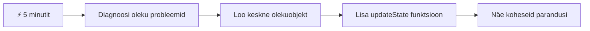
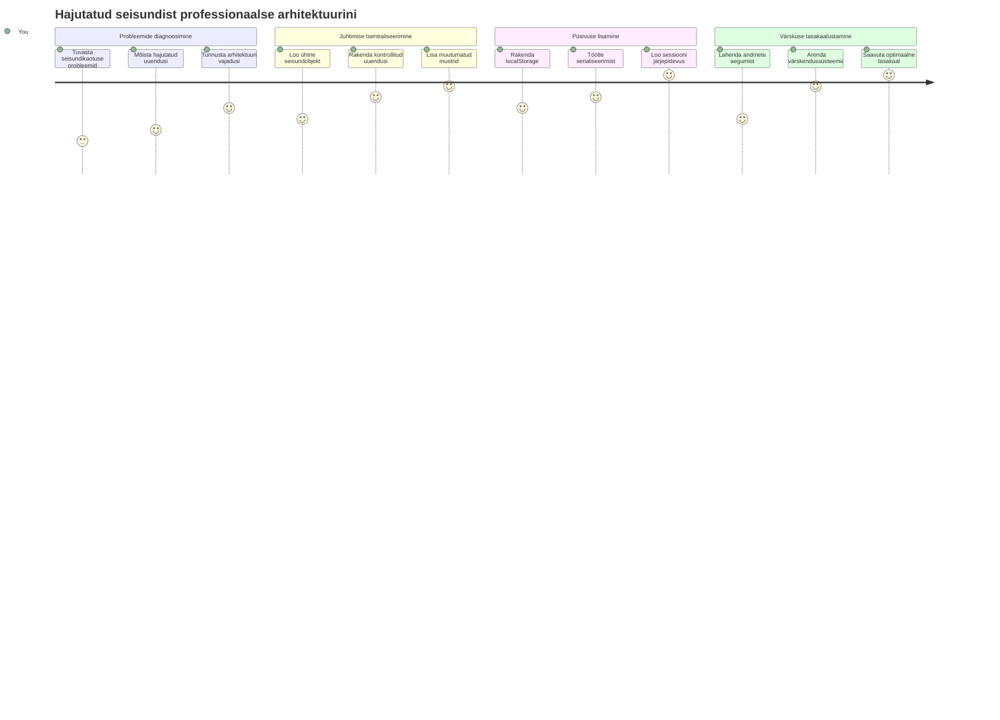
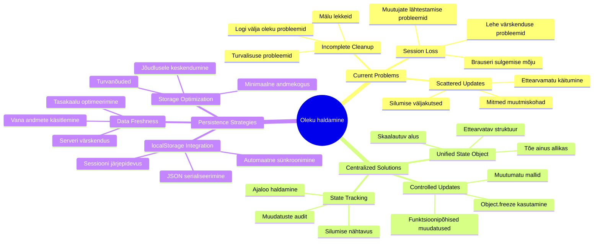
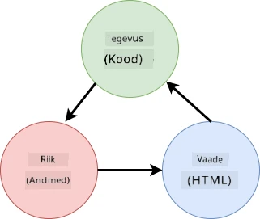
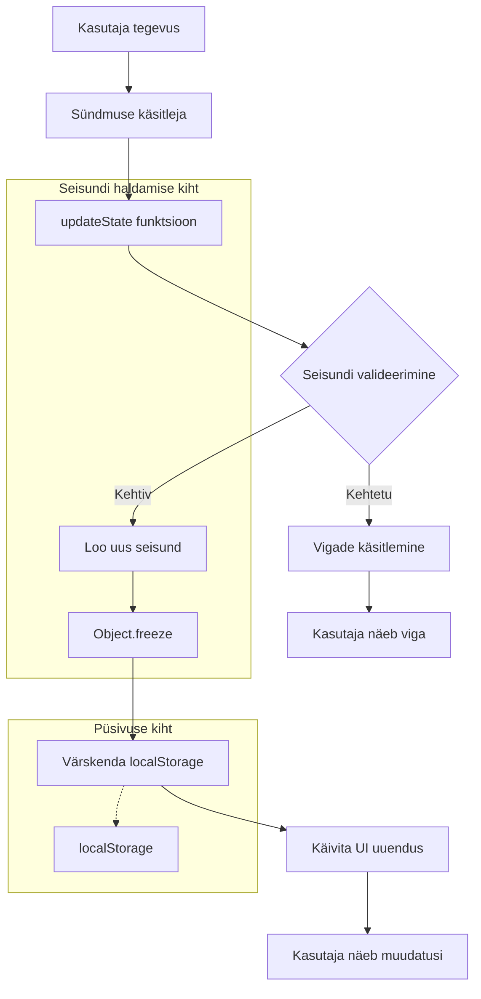
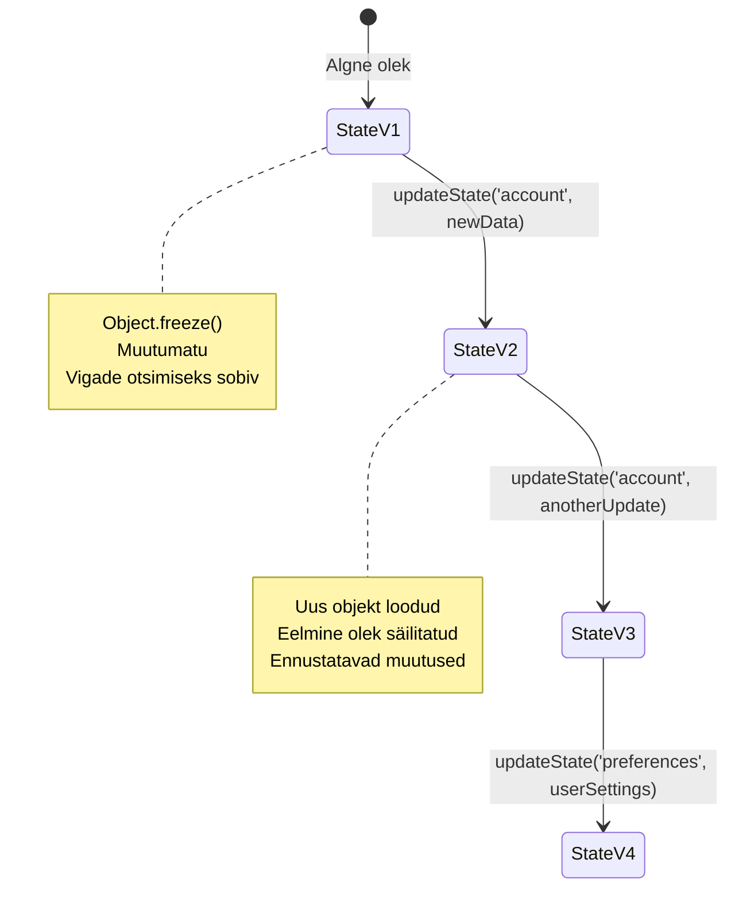
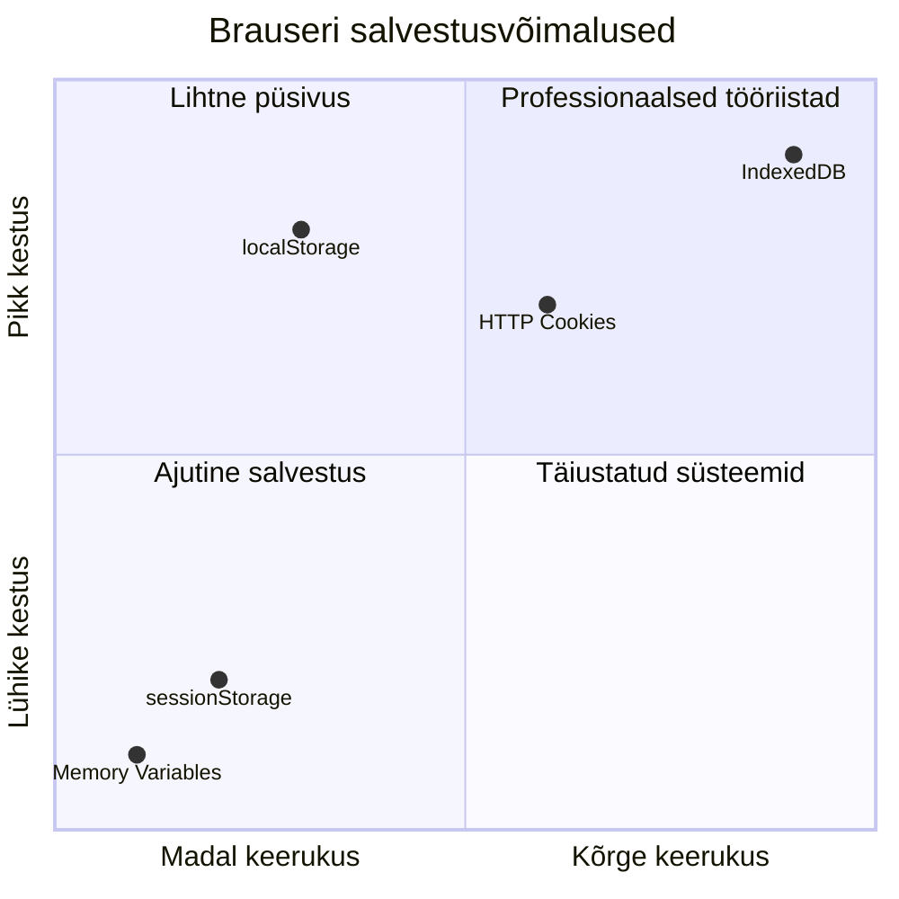
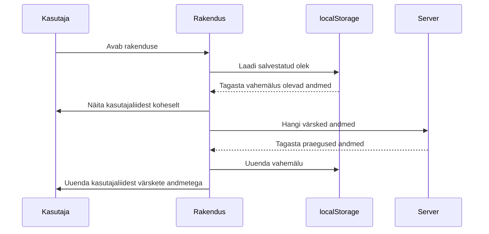
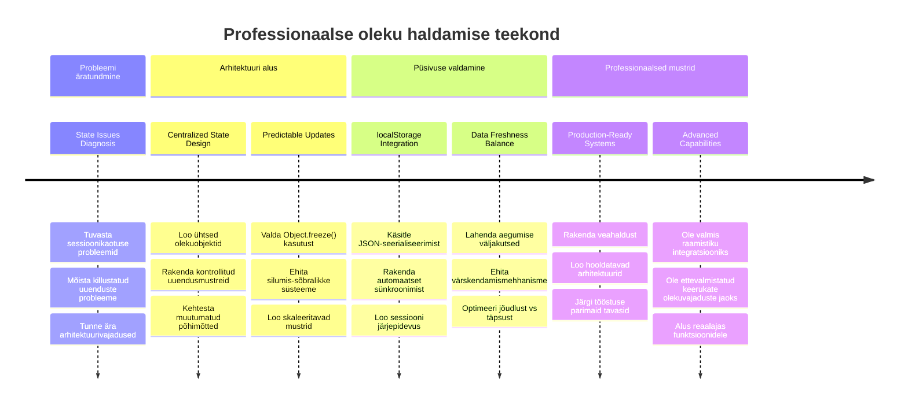

# Pangaäpi loomine Osa 4: Oleku halduse põhimõisted

## ⚡ Mida saad teha järgmise 5 minutiga

**Kiirtee hõivatud arendajatele**


- **1. minut**: Testi praegust oleku probleemi – logi sisse, värskenda leht, jälgi väljalogimist
- **2. minut**: Asenda `let account = null` väärtusega `let state = { account: null }`
- **3. minut**: Loo lihtne kontrollitud uuenduste funktsioon `updateState()`
- **4. minut**: Uuenda üks funktsioon kasutama uut mustrit
- **5. minut**: Testi paremaks läbitavust ja vigadeotsingu võimekust

**Kiire diagnostiline test**:
```javascript
// Enne: Hajutatud olek
let account = null; // Värskendamisel kaob!

// Pärast: Keskendatud olek
let state = Object.freeze({ account: null }); // Kontrollitud ja jälgitav!
```

**Miks see on tähtis**: Viie minutiga koged, kuidas segamine oleku haldusest muutub prognoositavaks ja vigade otsimine foreachis.

## 🗺️ Sinu õppeteek oleku juhtimise valdamisel


**Sinu sihtkoht teekonnal**: Selle loengu lõpuks oled ehitanud professionaalse oleku halduse süsteemi, mis tegeleb püsivusega, andmete värskusega ja prognoositavate uuendustega – samad mustrid nagu tootmiskeskkonna rakendustes.

## Eelloenguküsimustik

[Eelloengu viktoriin](https://ff-quizzes.netlify.app/web/quiz/47)

## Sissejuhatus

Oleku haldus on nagu Voyageri kosmoselaeva navigatsioonisüsteem – kui kõik töötab sujuvalt, ei pane sa seda isegi tähele. Kuid kui midagi läheb valesti, on see erinevus interstellaarsesse ruumi jõudmise ja kadumise vahel kosmose vaakumis. Veebiarenduses tähistab olek kõike, mida sinu rakendus peab meeles pidama: kasutaja sisselogimisolekut, vormiandmeid, navigeerimislugu ja ajutisi liidese olekuid.

Kui su pangarakendus on arenenud lihtsast sisselogimisvormist keerukamaks rakenduseks, oled tõenäoliselt kohanud mõningaid levinud väljakutseid. Värskendad lehte ja kasutaja logitakse ootamatult välja. Sulged brauseri ja kogu edusamm kaob. Tõrkeotsingul otsid läbi mitmeid funktsioone, mis kõik muudavad samu andmeid eri viisidel.

Need pole halbade koodiharjumuste märgid – vaid loomulikud kasvamisprobleemid, mis tekivad rakenduse keerukuse teatud tasemel. Iga arendaja seisab nende väljakutsetega silmitsi, kui nende rakendused liiguvad „kontseptsiooni tõestamisest“ „töökorras produktsiooni“.

Selles loengus rakendame tsentraliseeritud oleku halduse süsteemi, mis muudab su pangarakenduse usaldusväärseks ja professionaalseks rakenduseks. Õpid juhtima andmevooge prognoositavalt, püsivalt salvestama kasutaja seansse ja loomulikult looma sujuva kasutajakogemuse, mida nõuavad tänapäevased veebirakendused.

## Eeldused

Enne oleku halduse mõistete süvaõppesse sukeldumist peab su arenduskeskkond olema korrektselt seadistatud ja sul peab olema pangarakenduse alus valmis. See loeng põhineb otseselt sarja eelnevate osade mõistetel ja koodil.

Veendu, et sul oleksid enne jätkamist valmis järgmised komponendid:

**Nõutud seadistused:**
- Lõpeta [andmete laadimise loeng](../3-data/README.md) – su rakendus peaks edukalt laadima ja kuvama kontode andmeid
- Paigalda oma süsteemi [Node.js](https://nodejs.org) tagumise API käivitamiseks
- Käivita kohalikult [serveri API](../api/README.md) kontode andmete haldamiseks

**Keskkonna testimine:**

Kontrolli, et su API server töötab korrektselt, käivitades terminalis järgmise käsu:

```sh
curl http://localhost:5000/api
# -> peaks tagastama tulemuseks "Panga API v1.0.0"
```

**Mida see käsk teeb:**
- **Saadab** GET-päringu kohalikule API serverile
- **Testib** ühendust ja kontrollib, kas server vastab
- **Tagastab** API versiooni info, kui kõik töötab korrektselt

## 🧠 Oleku halduse arhitektuuri ülevaade


**Põhiprintsiip**: Professionaalne oleku haldus tasakaalustab prognoositavust, püsivust ja jõudlust, et luua usaldusväärne kasutajakogemus, mis skaleerub lihtsatest interaktsioonidest keerukate rakenduste töövoogudeni.

---

## Praeguste olekuprobleemide diagnoosimine

Nagu Sherlock Holmes kuriteopaika uurides, peame mõistma täpselt, mis meie praeguses implementeerimises toimub, enne kui suudame lahendada kadunud kasutajaseansside müsteeriumi.

Teeme lihtsa eksperimendi, mis paljastab oleku halduse põhihetked:

**🧪 Proovi seda diagnostilist testi:**
1. Logi sisse oma pangarakendusse ja mine armatuurlauale
2. Värskenda brauseri lehte
3. Jälgi, mis juhtub sinu sisselogimisolekuga

Kui sind suunatakse tagasi sisselogimisekraanile, oled avastanud klassikalise oleku püsivuse probleemi. See juhtub, sest meie praegune lahendus hoiab kasutaja andmeid JavaScripti muutujates, mis iga lehe laadimisega nullitakse.

**Praeguse implementeerimise probleemid:**

Lihtne `account` muutuja meie [eelmisest loengust](../3-data/README.md) tekitab kolm olulist probleemi, mis mõjutavad nii kasutajakogemust kui koodi hooldatavust:

| Probleem | Tehniline põhjus | Kasutajamõju |
|----------|------------|----------------|
| **Seansi kadumine** | Lehe värskendus tühjendab JavaScripti muutujad | Kasutajad peavad sageli uuesti sisse logima |
| **Laialivalgunud uuendused** | Mitmed funktsioonid muudavad olekut otseselt | Vigade otsimine muutub järjest keerulisemaks |
| **Ebapiisav puhastus** | Väljalogimine ei kustuta kõiki olekureferentse | Võib põhjustada turva- ja privaatsusriske |

**Arhitektuuriline väljakutse:**

Nagu Titanic'i kambrite jaotus, mis tundus tugev kuni mitme kambri samaaegne uppumine, ei lahenda nende probleemide üksikparandused selle aluseks olevat arhitektuurilist küsimust. Me vajame terviklikku olekuhalduse lahendust.

> 💡 **Mida me tegelikult proovime saavutada?**

[Oleku haldus](https://en.wikipedia.org/wiki/State_management) seisneb kahel põhiprobleemil:

1. **Kus mu andmed on?**: Teavet selle kohta, millist infot meil on ja kust see pärineb
2. **Kas kõik on samal lainel?**: Kindlustada, et kasutajate nähtu vastaks tegelikkusele

**Meie tegevuskava:**

Selle asemel, et oma saba taga ajada, loome **tsentraliseeritud oleku juhtimise** süsteemi. Mõtle sellele kui ühele väga organiseeritud inimesele, kes haldab kõike olulist:




**Seda andmevoogu mõistes:**
- **Tsentraliseerib** kogu rakenduse oleku ühes kohas
- **Suunab** kõik oleku muutused kontrollitud funktsioonide kaudu
- **Tagab**, et UI on sünkroonis praeguse olekuga
- **Väljendab** selget, prognoositavat andmehõimu mustrit

> 💡 **Professionaalne näpunäide**: See loeng keskendub põhiteadmistel. Keerukamate rakenduste jaoks pakuvad raamatukogud nagu [Redux](https://redux.js.org) täpsemaid olekuhalduse võimalusi. Nende aluspõhimõtete mõistmine aitab sul valdada ükskõik millist olekuhalduraamatukogu.

> ⚠️ **Edasijõudnutele**: Me ei käsitle automaatseid UI uuendusi olekumuutuste põhjal, kuna see hõlmab [reaktiivprogrammeerimise](https://en.wikipedia.org/wiki/Reactive_programming) kontseptsioone. Olgu see suurepärane järgmine samm su õpiteekonnal!

### Ülesanne: halda oleku struktuur tsentraalselt

Alustame oma laialivalgunud oleku halduse muutmist tsentraliseeritud süsteemiks. See esimene samm loob aluse kõikidele tulevastele parendustele.

**1. samm: loo tsentraliseeritud oleku objekt**

Asenda lihtne `account` deklareerimine:

```js
let account = null;
```

Struktureeritud oleku objektiga:

```js
let state = {
  account: null
};
```

**Miks see muudatus on oluline:**
- **Tsentraliseerib** kogu rakenduse andmed ühes kohas
- **Valmistab** struktuuri ette, et lisada hiljem rohkem oleku omadusi
- **Loob** selge piiri oleku ja teiste muutujate vahel
- **Loo mustri**, mis kasvab koos rakendusega

**2. samm: uuenda oleku kasutusmustreid**

Uuenda oma funktsioonid kasutama uut oleku struktuuri:

**Funktsioonides `register()` ja `login()`**, asenda:
```js
account = ...
```

Väärtusega:
```js
state.account = ...
```

**Funktsioonis `updateDashboard()`**, lisa see rida algusesse:
```js
const account = state.account;
```

**Mida need uuendused saavutavad:**
- **Hoidab** olemasoleva funktsionaalsuse, parandades struktuuri
- **Valmistab** koodi ette keerukamaks oleku halduseks
- **Loob** järjekindlad mustrid olekuandmete kasutamiseks
- **Loo alus tsentraliseeritud oleku uuendustele**

> 💡 **Märkus**: See ümberkorraldus ei lahenda kohe kõiki probleeme, kuid loob tugeva aluse võimsamateks parandusteks, mis tulevad järgmisena!

### 🎯 Õpetlik kontrollpunkt: tsentraliseerimise põhimõtted

**Peatu ja mõtle**: Sa just rakendasid tsentraliseeritud oleku halduse aluse. See on oluline arhitektuurne otsus.

**Kiire enesehindamine**:
- Kas suudad selgitada, miks ühes objektis oleku tsentraliseerimine on parem kui laiali pillutatud muutujad?
- Mis juhtub, kui unustad uuendada mõne funktsiooni kasutama `state.account`?
- Kuidas see muster valmistab su koodi ette keerukamate funktsioonide jaoks?

**Reaalmaailma seos**: Tsentraliseerimismuster, mida õppisid, on aluseks kaasaegsetele raamistikutele nagu Redux, Vuex ja React Context. Sa ehitad sama arhitektuurilist mõtlemist, mida kasutatakse suurtel rakendustel.

**Väljakutse küsimus**: Kui sa peaksid lisama kasutaja eelistused (teema, keel) oma rakendusse, kuhu need oleku struktuuris paigutad? Kuidas see skaleerub?

## Kontrollitud oleku uuenduste rakendamine

Kui olek on tsentraliseeritud, on järgmiseks sammuks kontrollitud mehhanismide loomine andmete muutmiseks. See tagab prognoositavad oleku muudatused ja lihtsama vigade otsimise.

Põhine printsiip meenutab lennujuhtimist: selle asemel, et lasta mitmel funktsioonil iseseisvalt olekut muuta, juhime kõik muutused ühe kontrollitud funktsiooni kaudu. See muster annab selge ülevaate, millal ja kuidas andmeid muudetakse.

**Muutumatu oleku haldus:**

Käsitleme `state` objekti kui [*muutumatut*](https://en.wikipedia.org/wiki/Immutable_object), mis tähendab, et me ei muuda seda otse. Selle asemel loob iga muutus uue oleku objekti koos uuendatud andmetega.

Kuigi see lähenemine võib tunduda võrreldes otseste muutustega alguses ebaefektiivne, pakub see olulisi eeliseid vigade otsimisel, testimisel ja rakenduse prognoositavuse säilitamisel.

**Muutumatu oleku halduse eelised:**

| Eelis | Kirjeldus | Mõju |
|---------|-------------|--------|
| **Prognoositavus** | Muudatused toimuvad ainult kontrollitud funktsioonide kaudu | Lihtsam vigade leidmine ja testimine |
| **Ajaloo jälgimine** | Iga oleku muutus loob uue objekti | Võimaldab tühistamise/tagasi toimimist |
| **Kõrvalmõjude vältimine** | Puuduvad juhuslikud muudatused | Vältib mõistatuslikke vigu |
| **Jõudluse optimeerimine** | Lihtne tuvastada, millal olek muutus | Võimaldab efektiivseid UI uuendusi |

**JavaScripti muutumatuse tagamine `Object.freeze()` abil:**

JavaScript pakub [`Object.freeze()`](https://developer.mozilla.org/docs/Web/JavaScript/Reference/Global_Objects/Object/freeze), mis takistab objekti muutmist:

```js
const immutableState = Object.freeze({ account: userData });
// Igasugune katse muuta immutableState'i tekitab vea
```

**Mis siin tegelikult juhtub:**
- **Takistab** omaduste otsest muutmist või kustutamist
- **Viskab** vead, kui muudetakse püüatakse teha
- **Tagab**, et oleku muutused peavad toimuma kontrollitud funktsioonide kaudu
- **Loo selge kokkulepe, kuidas olekut võib uuendada**

> 💡 **Sügavam arusaam**: Õpi MDN dokumentatsioonist [pealiskaudse (shallow) ja sügava (deep) muutumatuse](https://developer.mozilla.org/docs/Web/JavaScript/Reference/Global_Objects/Object/freeze#What_is_shallow_freeze) erinevust. Seda eristamist mõistmine on oluline keerukate olekustruktuuride puhul.


### Ülesanne

Loome uue `updateState()` funktsiooni:

```js
function updateState(property, newData) {
  state = Object.freeze({
    ...state,
    [property]: newData
  });
}
```

Selles funktsioonis loome uue oleku objekti ja kopeerime andmed eelmisest olekust, kasutades [*levitusoperatsiooni* (`...`)](https://developer.mozilla.org/docs/Web/JavaScript/Reference/Operators/Spread_syntax#Spread_in_object_literals). Seejärel kirjutame oleku objekti kindla omaduse uue andmega kasutades [nurksulgude süntaksit](https://developer.mozilla.org/docs/Web/JavaScript/Guide/Working_with_Objects#Objects_and_properties) `[property]` tingimisel. Lõpuks lukustame objekti `Object.freeze()` abil, et takistada muutmisi. Hetkel on seisus ainult `account` omadus, kuid selle lähenemisega saab lisada nii palju omadusi nagu vaja.

Uuendame ka oleku algväärtust, tagades, et algne olek on samuti külmutatud:

```js
let state = Object.freeze({
  account: null
});
```

Seejärel uuendame funktsiooni `register` asendades `state.account = result;` järgmise koodiga:

```js
updateState('account', result);
```

Tee sama `login` funktsioonis, asendades `state.account = data;`:

```js
updateState('account', data);
```

Parandame ka probleemi, kus konto andmed ei puhastata, kui kasutaja klikib *Logi välja*.

Loo uus funktsioon `logout()`:

```js
function logout() {
  updateState('account', null);
  navigate('/login');
}
```

Funktsioonis `updateDashboard()` asenda suunamise kood `return navigate('/login');` järgmisega: `return logout()`;

Proovi registreerida uus konto, logi välja ja uuesti sisse, et kontrollida, et kõik töötab õigesti.

> Näpunäide: saad kõiki oleku uuendusi jälgida, lisades `console.log(state)` `updateState()` lõppu ja avades brauseri arendusvahendite konsooli.

## Andmete püsivuse rakendamine

Varem tuvastatud seansi kadu vajab püsivuse lahendust, mis säilitab kasutaja oleku brauseri seansside vahel. See muudab meie rakenduse ajutisest kogemusest usaldusväärseks, professionaalseks tööriistaks.

Mõtle, kuidas aatomkellad säilitavad täpset aega isegi elektrikatkestuste ajal, talletades kriitilist olekut mittelenduvasse mällu. Sarnaselt vajavad veebirakendused püsivust toetavaid mehhanisme, mis säilitavad olulist kasutajaandmeid brauseri seansside ja lehe värskenduste vahel.

**Strateegilised küsimused andmepüsivuse kohta:**

Enne kui püsivuse rakendamist alustad, mõtle neile olulistele aspektidele:

| Küsimus | Pangaäpi kontekst | Otsuse mõju |
|----------|-------------------|-------------|
| **Kas andmed on tundlikud?** | Kontojääk, tehinguajalugu | Valida turvalised salvestusmeetodid |
| **Kui kaua see peaks kestma?** | Sisselogimise olek vs ajutised kasutajaliidese eelistused | Valige sobiv salvestamise kestus |
| **Kas server vajab seda?** | Autentimistokenid vs kasutajaliidese seaded | Määrake jagamise nõuded |

**Brauseri salvestusvõimalused:**

Kaasaegsed brauserid pakuvad mitmeid salvestusmehhanisme, millest igaüks on loodud erinevate kasutusjuhtude jaoks:

**Peamised salvestus API-d:**

1. **[`localStorage`](https://developer.mozilla.org/docs/Web/API/Window/localStorage)**: Püsiv [võtme/väärtuse salvestus](https://en.wikipedia.org/wiki/Key%E2%80%93value_database)
   - **Püsib** andmete kohal kogu brauseri sessioonide vältel piiramatu aja
   - **Üle elab** brauseri taaskäivitused ja arvuti taaskäivitused
   - **Piiratud** konkreetse veebisaidi domeeniga
   - **Täiuslik** kasutajapreferentside ja sisselogimise olekute jaoks

2. **[`sessionStorage`](https://developer.mozilla.org/docs/Web/API/Window/sessionStorage)**: Ajutine sessioonisalvestus
   - **Toimib** täpselt nagu localStorage aktiivse sessiooni jooksul
   - **Kustub** automaatselt brauseri vahelehe sulgumisel
   - **Ideaalne** ajutiste andmete jaoks, mis ei tohiks püsida

3. **[HTTP küpsised](https://developer.mozilla.org/docs/Web/HTTP/Cookies)**: Serveriga jagatud salvestus
   - **Saadetakse** automaatselt igal serveripäringul
   - **Täiuslik** [autentimistokenite](https://en.wikipedia.org/wiki/Authentication) jaoks
   - **Piiratud** mahus ja võib mõjutada jõudlust

**Andmete serialiseerimise nõue:**

Nii `localStorage` kui ka `sessionStorage` salvestavad ainult [stringe](https://developer.mozilla.org/docs/Web/JavaScript/Reference/Global_Objects/String):

```js
// Muuda objektid JSON-stringideks salvestamiseks
const accountData = { user: 'john', balance: 150 };
localStorage.setItem('account', JSON.stringify(accountData));

// Tõlgi JSON-stringid tagasi objektideks andmete pärimisel
const savedAccount = JSON.parse(localStorage.getItem('account'));
```

**Serialiseerimise mõistmine:**
- **Muutab** JavaScripti objektid JSON-stringideks, kasutades [`JSON.stringify()`](https://developer.mozilla.org/docs/Web/JavaScript/Reference/Global_Objects/JSON/stringify)
- **Taastab** objektid JSON-ist, kasutades [`JSON.parse()`](https://developer.mozilla.org/docs/Web/JavaScript/Reference/Global_Objects/JSON/parse)
- **Haldb** keerukaid pesastatud objekte ja massiive automaatselt
- **Ebaõnnestub** funktsioonide, määratlemata väärtuste ja ringviidete korral

> 💡 **Täpsem valik**: Keerukate võrguühenduseta rakenduste ja suurte andmekogumite puhul kaaluda [`IndexedDB` API-d](https://developer.mozilla.org/docs/Web/API/IndexedDB_API). See pakub täisväärtuslikku kliendipoolset andmebaasi, kuid vajab keerulisemat rakendust.


### Ülesanne: Rakenda localStorage püsivus

Rakendame püsiva salvestuse, et kasutajad püsiksid sisselogituna kuni nad ise välja logivad. Kasutame `localStorage` kasutajakonto andmete salvestamiseks brauseri sessioonide vahel.

**Samm 1: Määra salvestuse konfiguratsioon**

```js
const storageKey = 'savedAccount';
```

**Mida see konstant pakub:**
- **Loomist** järjepidevaks identifikaatoriks meie salvestatud andmetele
- **Väldib** trükkimisvigu salvestusvõtmete kasutamisel
- **Lihtsustab** võimalikke muudatusi võtmes tulevikus
- **Järgib** parimaid tavasid hooldatava koodi jaoks

**Samm 2: Lisa automaatne püsivus**

Lisa see rida `updateState()` funktsiooni lõppu:

```js
localStorage.setItem(storageKey, JSON.stringify(state.account));
```

**Mis siin toimub:**
- **Muutab** konto objekti JSON-stringiks salvestamiseks
- **Salvestab** andmed järjepideva salvestusvõtme alla
- **Täidetakse** automaatselt iga olekuuuenduse puhul
- **Tagab**, et salvestatud andmed on alati kooskõlas praeguse olekuga

> 💡 **Arhitektuuri eelis**: Kuna kõik olekuuuendused lähevad läbi `updateState()` funktsiooni, piisas püsivuse lisamiseks ühest koodireast. See näitab hea arhitektuurilise otsuse jõudu!

**Samm 3: Taasta olek rakenduse laadimisel**

Loo initsialiseerimisfunktsioon, mis taastab salvestatud andmed:

```js
function init() {
  const savedAccount = localStorage.getItem(storageKey);
  if (savedAccount) {
    updateState('account', JSON.parse(savedAccount));
  }

  // Meie eelmine initsialiseerimiskood
  window.onpopstate = () => updateRoute();
  updateRoute();
}

init();
```

**Initsialiseerimisprotsessi mõistmine:**
- **Hangib** eelmised kontoandmed `localStorage`-st kui need on olemas
- **Parsib** JSON-stringi tagasi JavaScripti objektiks
- **Värskendab** olekut meie kontrollitud uuendusfunktsiooni abil
- **Taastab** kasutaja sessiooni automaatselt lehe laadimisel
- **Täidetakse** enne marsruudi uuendust, et olek oleks kättesaadav

**Samm 4: Optimeeri vaikimisi marsruuti**

Uuenda vaikimisi marsruuti, et kasutada saltuvust:

`updateRoute()` sees asenda:
```js
// Asenda: return navigate('/login');
return navigate('/dashboard');
```

**Miks see muudatus on mõistlik:**
- **Kasutab** meie uut püsivussüsteemi tõhusalt ära
- **Luba** armatuurlaud tegeleda autentimise kontrolliga
- **Suuna** automaatselt sisselogimislehele, kui salvestatud sessiooni ei ole
- **Loo** sujuvam kasutajakogemus

**Rakenduse testimine:**

1. Logi oma pangarakendusse sisse
2. Värskenda brauseri lehekülge
3. Veendu, et oled ikka sisse logitud ja armatuurlaud avanud
4. Sule ja ava brauser uuesti
5. Mine tagasi oma rakendusse ja kontrolli, et sisselogimine säilib

🎉 **Saavutus!** Oled edukalt rakendanud püsiva oleku haldamise! Sinu rakendus käitub nüüd nagu professionaalne veebirakendus.

### 🎯 Pedagoogiline kontrollpunkt: Püsivuse arhitektuur

**Arhitektuuri mõistmine**: Oled loonud keeruka püsivuskihi, mis tasakaalustab kasutajakogemuse ja andmehalduse keerukust.

**Valduses mõisted**:
- **JSON serialiseerimine**: keerukate objektide teisendamine stringideks
- **Automaatne sünkroonimine**: oleku muutused käivitavad püsiva salvestuse
- **Sessiooni taastamine**: rakendused saavad taastada kasutaja konteksti katkestuste järel
- **Tsentraliseeritud püsivus**: üks uuendusfunktsioon haldab kogu salvestust

**Tööstuse seos**: See püsivusmuster on Progressive Web Apps (PWA-de), võrguühenduseta esmalt rakenduste ja moodsate mobiilsete veebikogemuste alus. Sa ehitad tootmistaseme võimeid.

**Mõtisklusküsimus**: Kuidas muudad seda süsteemi, et sama seadme peal saaks hallata mitut kasutajakontot? Mõtle privaatsuse ja turvalisuse aspektidele.

## Püsivuse ja andmete värskuse tasakaal

Meie püsivussüsteem hoiab edukalt kasutaja sessioone, kuid toob kaasa uue väljakutse: andmete aegumist. Kui mitmed kasutajad või rakendused muudavad samu serveri andmeid, muutub kohalik vahemällu salvestatud info vananenuks.

See olukord sarnaneb viikingite meremeestega, kes kasutasid nii salvestatud tähtkaarte kui ka värskeid taeva vaatlustulemusi. Kaardid andsid stabiilsust, kuid navigaatorid vajasid värskeid vaatlusi muutuvate olude jaoks. Sarnaselt vajab meie rakendus nii püsivat kasutaja olekut kui ka värskeid serveri andmeid.

**🧪 Andmete värskuse probleemi avastamine:**

1. Logi armatuurlaud sisse konto "test" abil
2. Käivita terminalis see käsk, et simuleerida tehingu teistest allikatest:

```sh
curl --request POST \
     --header "Content-Type: application/json" \
     --data "{ \"date\": \"2020-07-24\", \"object\": \"Bought book\", \"amount\": -20 }" \
     http://localhost:5000/api/accounts/test/transactions
```

3. Värskenda oma armatuurlaua lehte brauseris
4. Observeeri, kas näed uut tehingut

**Mida see test näitab:**
- **Tõestab**, kuidas kohalik salvestus võib muutuda "aegunuks"
- **Simuleerib** reaalseid olukordi, kus andmed muutuvad väljaspool sinu rakendust
- **Paljastab** püsivuse ja andmete värskuse vahelise pinget

**Andmete aeguse probleem:**

| Probleem | Põhjus | Kasutaja mõju |
|---------|-------|-------------|
| **Aegunud andmed** | localStorage ei aegustu automaatselt | Kasutaja näeb vananenud infot |
| **Serveri muudatused** | Teised rakendused/kasutajad muudavad samu andmeid | Platvormidevahelised ebajärjekindlad vaated |
| **Vahemälu ja tegelikkus** | Kohalik vahemälu ei ühti serveri olekuga | Halb kasutajakogemus ja segadus |

**Lahenduse strateegia:**

Rakendame "värskenda laadimisel" mustri, mis tasakaalustab püsivuse eelised ja vajaduse värskete andmete järele. See lähenemine säilitab sujuva kasutajakogemuse ning tagab andmete õigsuse.


### Ülesanne: Rakenda andmete värskendamise süsteem

Loome süsteemi, mis automaatselt hangib serverist värsked andmed ja samal ajal säilitab meie püsiva oleku eelised.

**Samm 1: Loo kontoandmete uuendaja**

```js
async function updateAccountData() {
  const account = state.account;
  if (!account) {
    return logout();
  }

  const data = await getAccount(account.user);
  if (data.error) {
    return logout();
  }

  updateState('account', data);
}
```

**Selle funktsiooni loogika mõistmine:**
- **Kontrollib**, kas kasutaja on hetkel sisse logitud (state.account olemas)
- **Suunab** välja logimisele, kui kehtivat sessiooni ei leita
- **Hangib** värsked kontoandmed serverist olemasoleva `getAccount()` funktsiooni abil
- **Haldb** serverivigu kenasti, väljalogides vigased sessioonid
- **Värskendab** olekut värske infoga meie kontrollitud uuendussüsteemi kaudu
- **Käivitab** automaatse localStorage salvestuse läbi `updateState()` funktsiooni

**Samm 2: Loo armatuurlaua värskendusfunktsioon**

```js
async function refresh() {
  await updateAccountData();
  updateDashboard();
}
```

**Mida see värskendusfunktsioon saavutab:**
- **Koordineerib** andmevärskendust ja kasutajaliidese uuendust
- **Ootab**, et värsked andmed oleksid laetud, enne kuvamist
- **Tagab**, et armatuurlaud näitab alati kõige värskemat infot
- **Hoidab** selge eristuse andmehalduse ja kasutajaliidese vahel

**Samm 3: Integreeri marsruudisüsteemiga**

Uuenda oma marsruudidi konfiguratsiooni, et käivitada värskendus automaatselt:

```js
const routes = {
  '/login': { templateId: 'login' },
  '/dashboard': { templateId: 'dashboard', init: refresh }
};
```

**See integratsioon töötab nii:**
- **Täidetakse** värskendusfunktsioon iga kord, kui armatuurlaua marsruut laaditakse
- **Tagab**, et alati kuvatakse värsked andmed armatuurlaule minnes
- **Säilitab** olemasoleva marsruutide struktuuri ning lisab andmevärskuse
- **Pakub** järjepidevat mustrit marsruudipõhiseks initsialiseerimiseks

**Andmete värskenduse testimine:**

1. Logi oma pangarakendusse sisse
2. Käivita eelnevalt kasutatud curl käsk, mis lisab uue tehingu
3. Värskenda armatuurlaua lehte või navigeeri mujale ja tagasi
4. Veendu, et uus tehing ilmub koheselt

🎉 **Täiuslik tasakaal saavutatud!** Sinu rakendus ühendab nüüd püsiva oleku sujuvuse ja värskete serveriandmete täpsuse!

## 📈 Sinu olekuhalduse meistriklassi ajaskaala


**🎓 Lõpetamise verstapost**: Oled edukalt loonud täismahus olekuhalduse süsteemi, kasutades samu põhimõtteid, mis juhivad Reduxit, Vuexit ja teisi professionaalseid oleku teeke. Need mustrid skaleeruvad lihtsatest rakendustest kuni ettevõtte tasemeni.

**🔄 Järgmise taseme võimekused**:
- Valmis õppima olekuhalduse raamistikke (Redux, Zustand, Pinia)
- Valmis rakendama reaalajas funktsioone WebSocketsi abil
- Varustatud ehitama võrguühenduseta esmalt Progressive Web Apps'e
- Alus pandud edasijõudnud mustritele nagu olekumasinad ja vaatlejad

## GitHub Copiloti Agendi väljakutse 🚀

Kasuta agentrežiimi, et lõpetada järgmine väljakutse:

**Kirjeldus:** Rakenda pankrakendusele terviklik olekuhalduse süsteem koos undo/redo funktsionaalsusega. See väljakutse aitab sul harjutada sügavamaid olekuhalduse kontseptsioone, sealhulgas olekuajaloo jälgimist, muutumatuid uuendusi ja kasutajaliidese sünkroniseerimist.

**Ülesanne:** Loo täiustatud olekuhalduse süsteem, mis sisaldab: 1) olekuajalooga massiivi kõigi eelnevate olekute jälgimiseks, 2) undo ja redo funktsioonid eelmistele olekutele tagasipöördumiseks, 3) kasutajaliidese nupud undo/redo operatsioonide jaoks armatuurlaual, 4) maksimaalselt 10 olekut ajaloos mälu probleemide vältimiseks, 5) ajaloo korrektsel puhastamisel välja logimisel. Tagada, et undo/redo funktsioon töötab konto saldo muudatustega ja püsib läbi brauseri värskenduste.

Lisateavet agentrežiimi kohta leiad siit: [agent mode](https://code.visualstudio.com/blogs/2025/02/24/introducing-copilot-agent-mode).

## 🚀 Väljakutse: Salvestuse optimeerimine

Sinu rakendus haldab nüüd tõhusalt kasutajasesioone, andmete värskendust ja olekuhaldust. Mõtle aga, kas meie praegune lahendus tasakaalustab optimaalselt salvestusmahtu ja funktsionaalsust.

Nagu male meistrid eristavad olulisi figuure tühistest, nõuab efektiivne olekuhaldus kindlakstegemist, millised andmed peavad püsima ja millised peaksid alati tulema värskelt serverist.

**Optimeerimise analüüs:**

Hinda oma praegust localStorage'i kasutust ja mõtle neile strateegilistele küsimustele:
- Milline minimaalne info on vaja kasutaja autentimise säilitamiseks?
- Millised andmed muutuvad nii tihti, et kohalik vahemälu on väheefektiivne?
- Kuidas saab salvestuse optimeerimine parandada jõudlust, ilma kasutajakogemust halvendamata?

Selline arhitektuurne analüüs eristab kogenud arendajaid, kes võtmavad lahendusi luues arvesse nii funktsionaalsust kui efektiivsust.

**Rakenduse strateegia:**
- **Määra** oluline teave, mis peab püsima (tõenäoliselt ainult kasutaja identifikaator)
- **Muuda** oma localStorage kasutust nii, et salvestatakse ainult kriitilised sessiooniandmed
- **Tagada**, et värsked andmed laetakse alati serverist armatuurlauale minnes
- **Testi**, et optimeeritud lähenemine säilitab sama kasutajakogemuse

**Täpsem kaalumine:**
- **Võrdle** kompromisse täielike kontoandmete ja pelgalt autentimistokenite salvestamise vahel
- **Dokumendi** oma otsused ja põhjendused tulevastele meeskonnaliikmetele

See väljakutse aitab sul mõelda professionaalse arendajana, kes võtab arvesse nii kasutajakogemust kui rakenduse efektiivsust. Katseta erinevaid lähenemisi rahulikult!

## Loengujärgne viktoriin

[Loengujärgne viktoriin](https://ff-quizzes.netlify.app/web/quiz/48)

## Kodune ülesanne

[Rakenda "Lisa tehing" dialoog](assignment.md)

Siin on näidis tulemus peale ülesande täitmist:


---

<!-- CO-OP TRANSLATOR DISCLAIMER START -->
**Vastuustusest loobumine**:  
See dokument on tõlgitud kasutades tehisintellekti tõlketeenust [Co-op Translator](https://github.com/Azure/co-op-translator). Kuigi püüame tagada täpsust, palun arvestage, et automaatsed tõlked võivad sisaldada vigu või ebatäpsusi. Originaaldokument selle emakeeles tuleks lugeda autoriteetseks allikaks. Olulise teabe puhul soovitatakse professionaalset inimtõlget. Me ei vastuta käesoleva tõlke kasutamisest tekkida võivate arusaamatuste või valesti mõistmiste eest.
<!-- CO-OP TRANSLATOR DISCLAIMER END -->