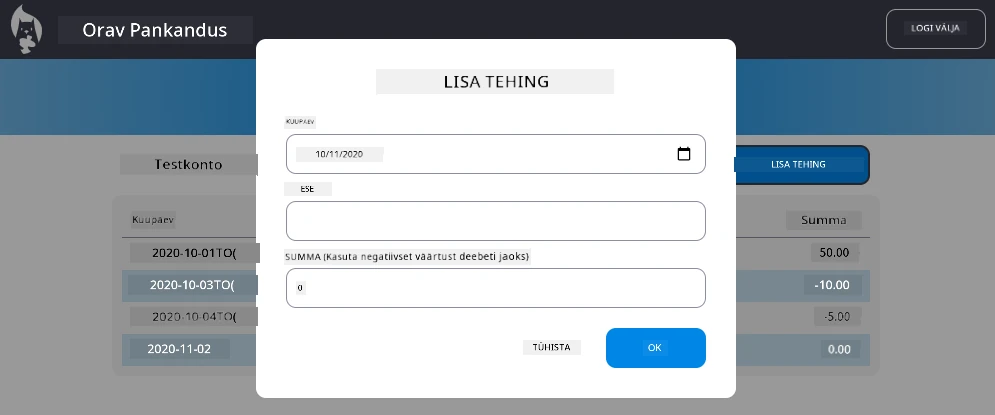

<!--
CO_OP_TRANSLATOR_METADATA:
{
  "original_hash": "50a7783473b39a2e0f133e271a102231",
  "translation_date": "2026-01-08T09:43:26+00:00",
  "source_file": "7-bank-project/4-state-management/assignment.md",
  "language_code": "et"
}
-->
# Rakenda dialoog "Lisa tehing"

## Ülevaade

Sinu pangarakendusel on nüüd tugev olekuhaldus ja andmete säilitamine, kuid see vajab olulist funktsionaalsust, mida tõelised pangarakendused vajavad: võimalust kasutajatel lisada oma tehingud. Selles ülesandes rakendad täieliku "Lisa tehing" dialoogi, mis integreerub sujuvalt olemasoleva olekuhaldussüsteemiga.

See ülesanne ühendab kõik, mida oled õppinud neljas pangatunde: HTML-i mallide koostamine, vormide käsitlemine, API integratsioon ja olekuhaldus.

## Õpieesmärgid

Ülesande lõpetamisel sa:
- **Lood** kasutajasõbraliku dialoogiliidese andmete sisestamiseks
- **Rakendad** ligipääsetava vormidisaini klaviatuuri ja ekraanilugerite toe jaoks
- **Integreerid** uued funktsioonid olemasoleva olekuhaldussüsteemiga
- **Harjutad** API-ga suhtlemist ja vigade käitlemist
- **Rakendad** kaasaegseid veebiarenduse mustreid päris maailma funktsioonile

## Juhised

### Samm 1: Lisa tehingu nupp

**Loo** "Lisa tehing" nupp oma juhtpaneeli lehele, mida kasutajad leiavad ja millele pääsevad hõlpsalt ligi.

**Nõuded:**
- **Aseta** nupp loogilisse kohta juhtpaneelil
- **Kasuta** selget, tegevusele suunatud nupu teksti
- **Stiliseeri** nupp vastavalt olemasolevale kasutajaliidese kujundusele
- **Tagada** nupu klaviatuuriga ligipääsetavus

### Samm 2: Dialoogi rakendamine

Vali üks kahest lähenemisest dialoogi loomisel:

**Variant A: Eraldi leht**
- **Loo** uus HTML mall tehinguvormile
- **Lisa** uus marsruut oma marsruutimissüsteemi
- **Rakenda** navigeerimine vormilehe ja sealt tagasi

**Variant B: Modaalne dialoog (soovitatav)**
- **Kasuta** JavaScripti dialoogi näitamiseks/peitmiseks ilma juhtpaneelilt lahkumata
- **Rakenda** [`hidden` omaduse](https://developer.mozilla.org/docs/Web/HTML/Global_attributes/hidden) või CSS klasside abil
- **Loo** sujuv kasutajakogemus õige fookuse haldusega

### Samm 3: Ligipääsetavuse rakendamine

**Tagada**, et su dialoog vastab [modaalsete dialoogide ligipääsetavuse standarditele](https://developer.paciellogroup.com/blog/2018/06/the-current-state-of-modal-dialog-accessibility/):

**Klaviatuuriga navigeerimine:**
- **Toetada** Escape-klahvi dialoogi sulgemiseks
- **Piira** fookust dialoogi sissedial avamise ajal
- **Tagasta** fookus käivitava nupu juurde sulgemisel

**Ekraanilugeritoe:**
- **Lisa** asjakohased ARIA sildid ja rollid
- **Teavita** dialoogi avanemisest ja sulgemisest ekraanilugeritele
- **Paku** selged vormiväljade sildid ja veateated

### Samm 4: Vormide loomine

**Disaini** HTML-vorm, mis kogub tehinguandmeid:

**Kohustuslikud väljad:**
- **Kuupäev**: millal tehing toimus
- **Kirjeldus**: milleks tehing tehti
- **Summa**: tehingu väärtus (positiivne sissetuleku jaoks, negatiivne väljamineku jaoks)

**Vormi omadused:**
- **Valideeri** kasutaja sisend enne esitamist
- **Paku** selged veateated kehtetute andmete puhul
- **Lisa** abistav kohatäitekiri ja sildid
- **Stiliseeri** vastavalt olemasolevale disainile

### Samm 5: API integratsioon

**Ühenda** oma vorm backend API-ga:

**Rakendusetapid:**
- **Vaata üle** [serveri API spetsifikatsioonid](../api/README.md) õige lõpp-punkti ja andmeformaadi osas
- **Loo** JSON-andmed vormi sisenditest
- **Saada** andmed API-le, kasutades asjakohast vigade käsitlemist
- **Kuva** kasutajale edukuse/ebaõnnestumise teated
- **Käitle** võrguvigu sujuvalt

### Samm 6: Olekuhalduse integratsioon

**Uuenda** oma juhtpaneeli uue tehinguga:

**Integratsiooni nõuded:**
- **Värskenda** kontoandmeid pärast tehingu edukat lisamist
- **Uuenda** juhtpaneeli kuvamist ilma lehte lahti laadimata
- **Tagada**, et uus tehing kuvatakse kohe
- **Hoolda** nõuetekohast oleku järjepidevust protsessi vältel

## Tehnilised spetsifikatsioonid

**API lõpp-punkti detailid:**
Vaata [serveri API dokumentatsiooni](../api/README.md) kohta:
- Vajalik JSON-vorming tehinguandmete jaoks
- HTTP meetod ja lõpp-punkti URL
- Oodatud vastuse formaat
- Vigade käsitlemine vastuste korral

**Oodatav tulemus:**
Pärast selle ülesande lõpetamist peaks su pangarakendus omama täielikult toimivat "Lisa tehing" funktsionaalsust, mis näeb välja ja toimib professionaalselt:

## Oma rakenduse testimine

**Funktsionaalsuse testimine:**
1. **Kontrolli**, et "Lisa tehing" nupp on selgelt nähtav ja ligipääsetav
2. **Testi**, et dialoog avaneb ja sulgub korralikult
3. **Kinnita**, et vormi valideerimine töötab kõigi nõutud väljade puhul
4. **Kontrolli**, et edukad tehingud kuvatakse kohe juhtpaneelil
5. **Veendu**, et veakäsitlus töötab vigaste andmete ja võrgu probleemide korral

**Ligipääsetavuse testimine:**
1. **Navigeeri** kogu protsess läbi ainult klaviatuuri kasutades
2. **Testi** ekraanilugeriga, et veenduda korrektses teavitamises
3. **Kontrolli**, et fookuse haldus toimib õigesti
4. **Veendu**, et kõik vormielemendid on korrektselt sildistatud

## Hindamiskriteeriumid

| Kriteerium | Näidishinne | Piisav | Parandamist vajav |
| -------- | --------- | -------- | ----------------- |
| **Funktsionaalsus** | Lisa tehingu funktsioon töötab laitmatult, pakub suurepärast kasutajakogemust ja järgib kõiki õppetundide parimaid tavasid | Lisa tehingu funktsioon töötab korrektselt, kuid võib puududa mõni parim tava või esineda väikeseid kasutatavusprobleeme | Lisa tehingu funktsioon töötab osaliselt või on oluliselt kasutusmugavust takistav |
| **Koodi kvaliteet** | Kood on hästi organiseeritud, järgib kehtestatud mustreid, sisaldab korralikku vigade käsitlemist ja integreerub sujuvalt olemasoleva olekuhaldusega | Kood töötab, kuid võib olla organiseerimata või järgida ebajärjekindlaid mustreid olemasolevas koodibaasis | Koodis on olulisemad struktuurivead või see ei integreeru hästi olemasolevate mustritega |
| **Ligipääsetavus** | Täielik klaviatuuriga navigeerimise tugi, ekraanilugerite ühilduvus ja WCAG juhiste järgimine suurepärase fookusehaldusega | Põhilised ligipääsetavuse funktsioonid on rakendatud, kuid võib puududa osa klaviatuuriga navigeerimisest või ekraanilugerite toest | Ligipääsetavuse kaalutlused on kas puudulikud või puuduvad täielikult |
| **Kasutajakogemus** | Intuitiivne, lihvitud liides selge tagasiside, sujuvate interaktsioonide ja professionaalse välimusega | Hea kasutajakogemus väikeste parenduskohtadega tagasiside või visuaalses disainis | Kehv kasutajakogemus segase liidese või tagasiside puudumisega |

## Täiendavad väljakutsed (vabatahtlik)

Kui põhinõuded on täidetud, mõtle nende täiustuste peale:

**Täiendatud funktsioonid:**
- **Lisa** tehingukategooriad (toit, transport, meelelahutus jms)
- **Rakenda** sisendi valideerimine reaalajas tagasisidega
- **Loo** kiirklahvid võhmrau kasutajatele
- **Lisa** tehingute redigeerimise ja kustutamise võimalused

**Täiustatud integratsioon:**
- **Rakenda** tagasi võtmise funktsioon hiljuti lisatud tehingutele
- **Lisa** massiline tehingute import CSV failidest
- **Loo** tehingute otsingu- ja filtreerimisvõimalused
- **Rakenda** andmete eksportimise funktsioonid

Need vabatahtlikud funktsioonid aitavad sul harjutada keerukamaid veebiarenduse põhimõtteid ja luua täielikuma pangarakenduse!

---

<!-- CO-OP TRANSLATOR DISCLAIMER START -->
**Vastutusest loobumine**:
See dokument on tõlgitud tehisintellekti tõlketeenuse [Co-op Translator](https://github.com/Azure/co-op-translator) abil. Kuigi püüame tagada täpsust, palun arvestage, et automaatsed tõlked võivad sisaldada vigu või ebatäpsusi. Originaaldokument oma emakeeles tuleks pidada autoriteetseks allikaks. Oluline info puhul on soovitatav kasutada professionaalset inimtõlget. Me ei vastuta selle tõlke kasutamisest tulenevate arusaamatuste või valesti tõlgenduste eest.
<!-- CO-OP TRANSLATOR DISCLAIMER END -->