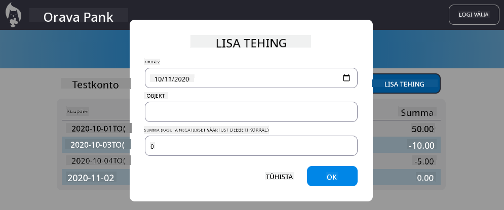

<!--
CO_OP_TRANSLATOR_METADATA:
{
  "original_hash": "f23a868536c07da991b1d4e773161e25",
  "translation_date": "2025-10-11T12:02:50+00:00",
  "source_file": "7-bank-project/4-state-management/assignment.md",
  "language_code": "et"
}
-->
# Rakenda "Lisa tehing" dialoog

## Juhised

Meie pangarakendusel puudub endiselt üks oluline funktsioon: võimalus sisestada uusi tehinguid.
Kasutades kõike, mida oled õppinud neljas eelmises tunnis, rakenda "Lisa tehing" dialoog:

- Lisa "Lisa tehing" nupp armatuurlaua lehele
- Loo kas uus leht HTML-malliga või kasuta JavaScripti, et näidata/peita dialoogi HTML-i ilma armatuurlaua lehelt lahkumata (võid kasutada [`hidden`](https://developer.mozilla.org/docs/Web/HTML/Global_attributes/hidden) atribuuti või CSS klasse)
- Veendu, et dialoogi puhul oleks tagatud [klaviatuuri ja ekraanilugeja ligipääsetavus](https://developer.paciellogroup.com/blog/2018/06/the-current-state-of-modal-dialog-accessibility/)
- Rakenda HTML-vorm sisendi andmete vastuvõtmiseks
- Loo vormi andmetest JSON ja saada see API-le
- Uuenda armatuurlaua lehte uute andmetega

Vaata [serveri API spetsifikatsioone](../api/README.md), et näha, millist API-d tuleb kutsuda ja milline on oodatud JSON-formaat.

Siin on näide tulemusest pärast ülesande täitmist:

## Hindamiskriteeriumid

| Kriteerium | Näidislik                                                                                       | Piisav                                                                                                                 | Vajab parandamist                           |
| ---------- | ----------------------------------------------------------------------------------------------- | ---------------------------------------------------------------------------------------------------------------------- | ------------------------------------------- |
|            | Tehingu lisamine on täielikult rakendatud, järgides kõiki tundides käsitletud parimaid praktikaid. | Tehingu lisamine on rakendatud, kuid ei järgi tundides käsitletud parimaid praktikaid või töötab ainult osaliselt.      | Tehingu lisamine ei tööta üldse.            |

---

**Lahtiütlus**:  
See dokument on tõlgitud AI tõlketeenuse [Co-op Translator](https://github.com/Azure/co-op-translator) abil. Kuigi püüame tagada täpsust, palume arvestada, et automaatsed tõlked võivad sisaldada vigu või ebatäpsusi. Algne dokument selle algses keeles tuleks pidada autoriteetseks allikaks. Olulise teabe puhul soovitame kasutada professionaalset inimtõlget. Me ei vastuta selle tõlke kasutamisest tulenevate arusaamatuste või valesti tõlgenduste eest.