# Koodi redaktori kasutamine: VSCode.devi valdamine

Kas mäletad filmist *Matrix* seda kohta, kus Neo pidi arvutimaailmaga ühenduse saamiseks suure kooditerminaliga liidestuma? Tänapäeva veebiarendusvahendid on selle vastand – uskumatult võimsad võimalused, mis on ligipääsetavad kõikjalt. VSCode.dev on brauseripõhine koodi redaktor, mis toob professionaalsed arendusvahendid igasse internetiühendusega seadmesse.

Nii nagu trükipress tegi raamatud kättesaadavaks kõigile, mitte ainult kloostrite kirjutajatele, demokraatiseerib VSCode.dev kodeerimise. Sa võid töötada projektidega raamatukogu arvutist, kooli laboris või ükskõik kust, kus on brauseri ligipääs. Pole vaja installida, pole "mul on oma spetsiifiline keskkond" piiranguid.

Selle õppetüki lõpuks saad aru, kuidas VSCode.devis navigeerida, avada GitHubi hoidlaid otse brauseris ja kasutada Gitit versioonihalduseks – kõik oskused, millele professionaalsed arendajad iga päev toetuvad.

## ⚡ Mida saad järgnevate 5 minutiga teha

**Kiire algus hõivatud arendajatele**

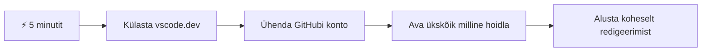
- **1. minut**: Mine aadressile [vscode.dev](https://vscode.dev) – pole vaja midagi installeerida
- **2. minut**: Logi sisse GitHubiga, et oma hoidlaid ühendada
- **3. minut**: Proovi URL-i trikki: muuda mistahes hoidla aadressis `github.com` osaks `vscode.dev/github`
- **4. minut**: Loo uus fail ja vaata, kuidas süntaksi esiletõstmine automaatselt tööle hakkab
- **5. minut**: Tee muudatus ja salvesta see Source Control paneeli kaudu

**Kiirika URL**:
```
# Transform this:
github.com/microsoft/Web-Dev-For-Beginners

# Into this:
vscode.dev/github/microsoft/Web-Dev-For-Beginners
```

**Miks see oluline on**: 5 minutiga saad kogeda vabadust koodida kõikjalt kasutades professionaalseid tööriistu. See tähistab arenduse tulevikku – ligipääsetav, võimas ja vahetu.

## 🗺️ Sinu õpiteek pilvepõhises arenduses

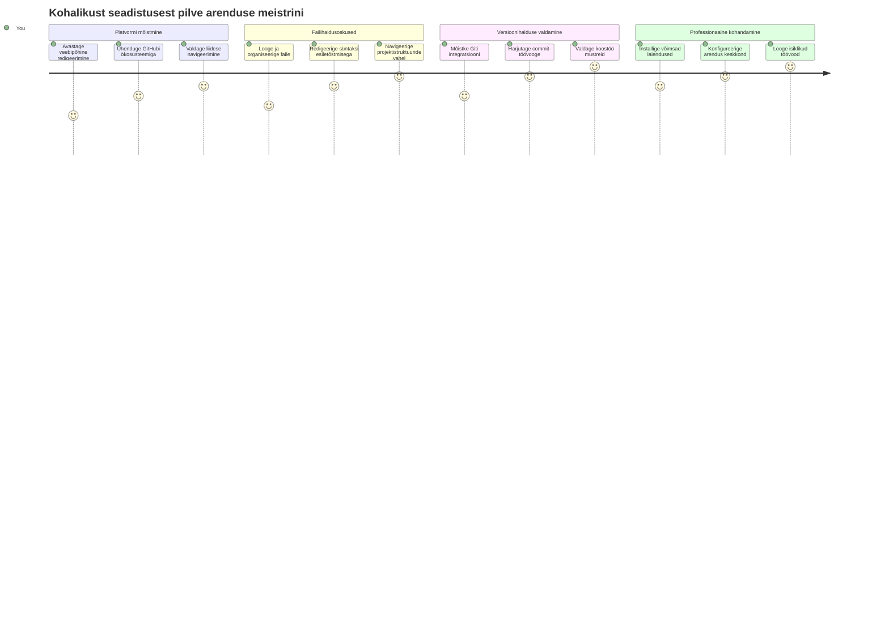
**Sihtpunkt sinu teekonnal**: Selle õppetüki lõpuks valdad professionaalset pilvearenduskeskkonda, mis töötab ükskõik millisest seadmest, võimaldades sul kasutada samu tööriistu, mida kasutavad suured tehnoloogiafirmad.

## Mida õpid

Pärast seda koos läbikäimist saad:

- Navigeerida VSCode.devis nagu see oleks sinu teine kodu – leida kõike vajalikku ilma ekslemata
- Avada mistahes GitHubi hoidla oma brauseris ja kohe hakata seda muutma (see on päris maagiline!)
- Kasutada Giti oma muudatuste jälgimiseks ja edenemise salvestamiseks nagu professionaal
- Kiirendada oma redaktorit laiendustega, mis muudavad kodeerimise kiiremaks ja lõbusamaks
- Luua ja korrastada projektifaile enesekindlalt

## Mida vajad

Nõuded on lihtsad:

- Tasuta [GitHubi konto](https://github.com) (vajadusel juhendame sind selle loomisel)
- Algteadmised veebibrauseritest
- GitHub Basics õppetükk annab kasulikku taustainfot, kuid pole kohustuslik

> 💡 **Uus GitHubis?** Konto loomine on tasuta ja võtab vaid paar minutit. Nii nagu raamatukogu kaart annab ligipääsu raamatutele kogu maailmas, avab GitHubi konto uksi koodihaldushoidlatesse üle interneti.

## 🧠 Pilvearenduse ökosüsteemi ülevaade

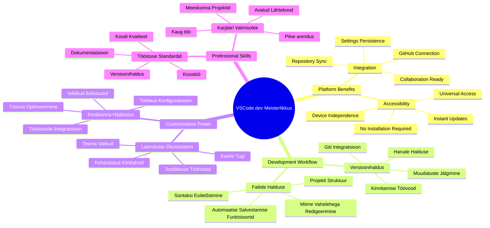
**Põhiprintsiip**: Pilvepõhised arenduskeskkonnad on kodeerimise tulevik – need pakuvad professionaalse taseme tööriistu, mis on ligipääsetavad, koostöövõimelised ja sõltumatud platvormist.

## Miks veebipõhised koodi redaktorid on olulised

Enne internetti ei saanud teadlased erinevatest ülikoolidest kergesti oma uurimistöid jagada. Siis tuli 1960ndail ARPANET, mis ühendas arvuteid kaugustel. Veebipõhised koodi redaktorid järgivad sama printsiipi – teha võimsad tööriistad ligipääsetavaks sõltumata sinu füüsilisest asukohast või seadmest.

Koodi redaktor on su arendustööruum, kus kirjutad, redigeerid ja korraldad koodifaile. Erinevalt lihtsatest tekstiredaktoritest pakuvad professionaalsed redaktorid süntaksi esiletõstmist, vigade tuvastamist ja projektihaldust.

VSCode.dev toob need võimalused su brauserisse:

**Veebipõhise redigeerimise eelised:**

| Omadus | Kirjeldus | Praktiline Eelis |
|---------|-------------|----------|
| **Platvormist sõltumatu** | Töötab igas brauseriga seadmes | Töötamine erinevatel arvutitel sujuvalt |
| **Pole vaja installida** | Ligipääs veebiaadressi kaudu | Vabastus tarkvara installeerimise piirangutest |
| **Automaatvärskendused** | Alati töötab uusima versiooniga | Uued funktsioonid ilma käsitsi uuendamata |
| **Hoidla integratsioon** | Otseühendus GitHubiga | Koodi muutmine ilma kohaliku failihalduseta |

**Praktilised tagajärjed:**
- Töö jätkamine erinevates keskkondades
- Ühtne liides sõltumata operatsioonisüsteemist
- Kohene koostöövõimalus
- Vähenenud kohaliku salvestusruumi vajadus

## VSCode.devi avastamine

Nii nagu Marie Curie labor sisaldas keerulist tehnoloogiat suhteliselt lihtsas ruumis, pakib VSCode.dev professionaalsed arendustööriistad brauseriliidesesse. See veebirakendus pakub samasugust põhifunktsionaalsust nagu lauaarvuti koodi redaktorid.

Alusta, minnes oma brauseris aadressile [vscode.dev](https://vscode.dev). Liides laeb end ilma allalaadimiseta või süsteemi installatsioonita – pilvearvutuse põhimõtete otse rakendus.

### Ühenda oma GitHubi konto

Nii nagu Alexander Graham Bell ühendaski kaugustes kohad telefoni abil, seob GitHubi konto ühendamine VSCode.devi sinu koodihaldushoidlatele ligipääsu. Kui küsitakse sisselogimist GitHubiga, soovitatakse see ühendus aktsepteerida.

**GitHubi integratsioon pakub:**
- Otse ligipääsu sinu hoidlatele redaktoris
- Sünkroonitud seadistused ja laiendused seadmete vahel
- Sujuv salvestuskäik GitHubi
- Isikupärastatud arenduskeskkond

### Tutvu oma uue tööruumiga

Kui kõik laeb, näed ilusat ja puhtat töölaua keskkonda, mis on loodud sind keskenduma olulisele – koodile!

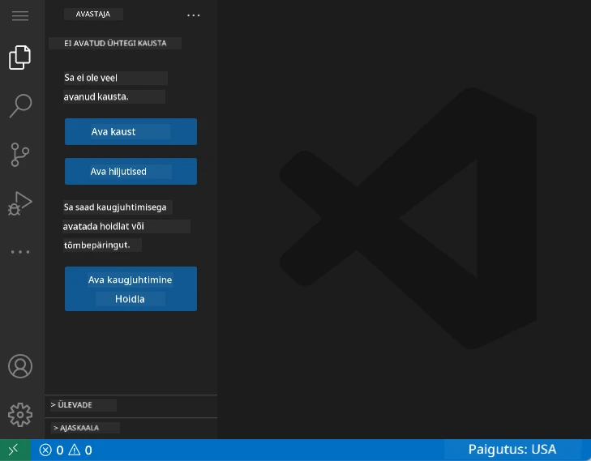

**Siin on ülevaade su ümbrusest:**
- **Activity Bar** (vasakul olev riba): Sinu peamine navigeerimisriba, kus on Explorer 📁, Search 🔍, Source Control 🌿, Extensions 🧩 ja Settings ⚙️
- **Sidebar** (naabruses asuv paneel): Muutub sõltuvalt sinu valikutest ja näitab asjakohast infot
- **Editor Area** (suur keskmine ala): Siin käib võlu – sinu peamine kodeerimisala

**Võta hetk uurimiseks:**
- Klõpsa Activity Bari ikoonidel ja vaata, mida igaüks teeb
- Märka, kuidas sidriba muutub, näidates erinevat informatsiooni – päris äge, eks?
- Explorer vaade (📁) on koht, kus veedad tõenäoliselt kõige enam aega, harju sellega

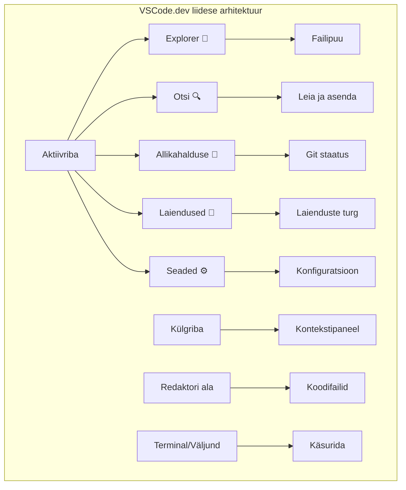
## GitHubi hoidlate avamine

Enne internetti pidid teadlased füüsiliselt raamatukogudesse sõitma dokumentidele ligipääsuks. GitHubi hoidlad töötavad samamoodi – need on kaugel hoitavad koodikogumikud. VSCode.dev kaotab traditsioonilise sammu, kus hoidlaid tuli esmalt alla laadida oma kohalikku masinasse enne muutmist.

See võimaldab kohest ligipääsu igale avalikule hoidla vaatamiseks, redigeerimiseks või panustamiseks. Siin on kaks hoidlate avamise meetodit:

### Meetod 1: Osuta ja klõpsa

Sobib ideaalselt, kui alustad VSCode.devis nullist ja soovid konkreetset hoidlat avada. Lihtne ja algajasõbralik:

**Nii teed seda:**

1. Mine aadressile [vscode.dev](https://vscode.dev), kui sa pole seal veel
2. Otsi tervituslehel nuppu "Open Remote Repository" ja klõpsa

   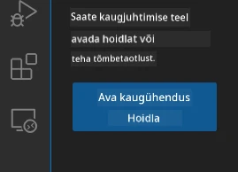

3. Kleebi siia mistahes GitHubi hoidla URL (proovi seda: `https://github.com/microsoft/Web-Dev-For-Beginners`)
4. Vajuta Enter ja vaata imet!

**Pro nipp – Command Palette otsetee:**

Tahad tunda end nagu koodimise võlur? Proovi klaviatuuri otseteed Ctrl+Shift+P (või Cmd+Shift+P Macil), et avada Command Palette:

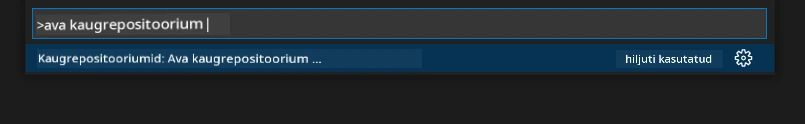

**Command Palette on nagu otsingumootor kõigile sinu tehtavatele asjadele:**
- Kirjuta "open remote" ja see leiab hoidla avaja sinu eest
- Mäletab viimati avatud hoidlaid (üllatavalt kasulik!)
- Kui harjud selle kasutama, tundub nagu kodeeriksid välkkiirusel
- Tegelikult on see VSCode.devi variatsioon sellele, nagu öelda "Hey Siri, aga koodi jaoks"

### Meetod 2: URL-i muutmise meetod

Nii nagu HTTP ja HTTPS kasutavad erinevaid protokolle, hoides samas domeeni struktuuri, kasutab VSCode.dev URL-it, mis peegeldab GitHubi aadressimustrit. Iga GitHubi hoidla URL-i saab muuta, et see avada otse VSCode.devis.

**URL-i teisendamise muster:**

| Hoidla tüüp | GitHubi URL | VSCode.devi URL |
|----------------|---------------------|----------------|
| **Avalik hoidla** | `github.com/microsoft/Web-Dev-For-Beginners` | `vscode.dev/github/microsoft/Web-Dev-For-Beginners` |
| **Isiklik projekt** | `github.com/sinu-kasutajanimi/minu-projekt` | `vscode.dev/github/sinu-kasutajanimi/minu-projekt` |
| **Mingi ligipääsetav hoidla** | `github.com/nende-kasutajanimi/lahe-hoidla` | `vscode.dev/github/nende-kasutajanimi/lahe-hoidla` |

**Rakendus:**
- Asenda `github.com` osaks `vscode.dev/github`
- Kõik teised URL-i osad jäävad muutmata
- Toimib kõikide avalikult ligipääsetavate hoidlate puhul
- Pakub kohest redigeerimisvõimalust

> 💡 **Elumuutev nipp**: Jäädvusta järjehoidjatena VSCode.devi versioonid oma lemmikhoidlatest. Mul on järjehoidjad nagu "Redigeeri oma portfooliot" ja "Paranda dokumentatsiooni", mis viivad mind otse redigeerimisrežiimi!

**Millist meetodit kasutada?**
- **Liidese meetod**: Hea, kui uurid või ei mäleta kokkulepitud hoidlate nimesid
- **URL trikiga**: Täiuslik kiireks ligipääsuks, kui tead täpselt, kuhu minna

### 🎯 Pedagoogiline paus: Pilvearenduse ligipääs

**Peatu ja mõtle**: Õppisid just kahte viisi, kuidas veebibrauseri kaudu koodihaldushoidlatesse ligipääsu saada. See tähistab fundamentaalset muutust arendustegevuses.

**Kiire enesehindamine**:
- Kas oskad selgitada, miks veebipõhine redigeerimine kaotab traditsioonilise “arenduskeskkonna seadistamise” vajaduse?
- Milliseid eeliseid pakub URL-i muutmisvõte võrreldes kohaliku git kloonimisega?
- Kuidas muudab see lähenemine sinu võimalikku panust avatud lähtekoodiga projektidesse?

**Tegelik maailm**: Suured firmad nagu GitHub, GitLab ja Replit on ehitanud oma arendusplatvormid nende pilve-esmastel põhimõtetel. Õpid samu töövooge, mida kasutavad professionaalsed arendusmeeskonnad üle maailma.

**Väljakutse küsimus**: Kuidas võib pilvepõhine arendus muuta koodi õpetamist koolides? Mõtle seadmete nõuetele, tarkvara haldusele ja koostöövõimalustele.

## Failide ja projektidega töötamine

Kui hoidla on avatud, asume ehitama! VSCode.dev annab kõik vahendid, mida vajad, et luua, redigeerida ja korrastada oma koodifaile. Mõtle sellest kui oma digitaalsest töökojast – iga tööriist on täpselt seal, kus vaja.

Vaatame iga päevaseid toiminguid, mis moodustavad suurema osa sinu koodi töövoost.

### Uute failide loomine

Nii nagu arhitekti kontoris sinised trükid organiseeritud on, järgib faililoome VSCode.devis struktureeritud lähenemist. Süsteem toetab kõiki tavalisi veebiarenduse failitüüpe.

**Faili loomise protsess:**

1. Navigeeri Explorer külgpaanil sihtkausta
2. Liigu hiirega kausta nime kohale, et ilmuks ikoon "New File" (📄+)
3. Sisesta failinimi koos sobiva laiendiga (`style.css`, `script.js`, `index.html`)
4. Vajuta Enter, et fail luua

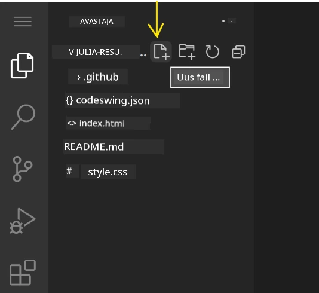

**Nimeandmise soovitused:**
- Kasuta kirjeldavaid nimesid, mis viitavad faili eesmärgile
- Lisa faililaiendid, et süntaksi esiletõstmine töötaks
- Järgi projektides järjepidevaid nimetamismustreid
- Kasuta väiketähti ja sidekriipse tühikute asemel

### Failide redigeerimine ja salvestamine

Siin algab tõeline lõbu! VSCode.devi redaktor on täis abistavaid omadusi, mis muudavad kodeerimise sujuvaks ja intuitiivseks. See on nagu väga nutikas kirjutamisassistent, aga koodile.

**Sinu redigeerimisvoog:**

1. Klõpsa suvalisel Exploreris oleval failil, et avada see peaaknas
2. Hakka kirjutama ja jälgi, kuidas VSCode.dev aitab värvide, soovituste ja vigade leidmisega
3. Salvesta töö Ctrl+S (Windows/Linux) või Cmd+S (Mac) – kuigi see salvestab ka automaatselt!

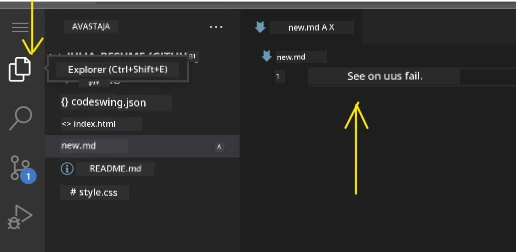

**Mis toimub, kui koodid:**
- Sinu kood saab kaunilt värvitud ja on lihtsam lugeda
- VSCode.dev pakub täitmisi, kui tipid (nagu õigekirjakontroll, aga palju nutikam)
- Enne salvestamist tabab trükivigu ja vigu
- Sa võid avada mitu faili vahelehtedel nagu brauseris
- Kõik salvestatakse taustal automaatselt

> ⚠️ **Kiire nipp**: Kuigi automaatsalvestus on aktiivne, on hea harjumus vajutada Ctrl+S või Cmd+S. See salvestab koheselt kõik ja käivitab lisafunktsioonid nagu vigade kontrolli.

### Versioonihaldus Gitiga

Nii nagu arheoloogid teevad täpseid kirjeid kaevamiskihistest, jälgib Git sinu koodi muudatusi aja jooksul. See süsteem säilitab projekti ajaloo ja võimaldab vajadusel varasemate versioonide juurde tagasi minna. VSCode.dev sisaldab integreeritud Git funktsionaalsust.

**Source Control liides:**

1. Ava Source Control paneel 🌿 ikooni kaudu Activity Baril
2. Muudetud failid ilmuvad jaotises "Changes"
3. Värvikood näitab muudatuste liike: roheline lisandumised, punane kustutamised

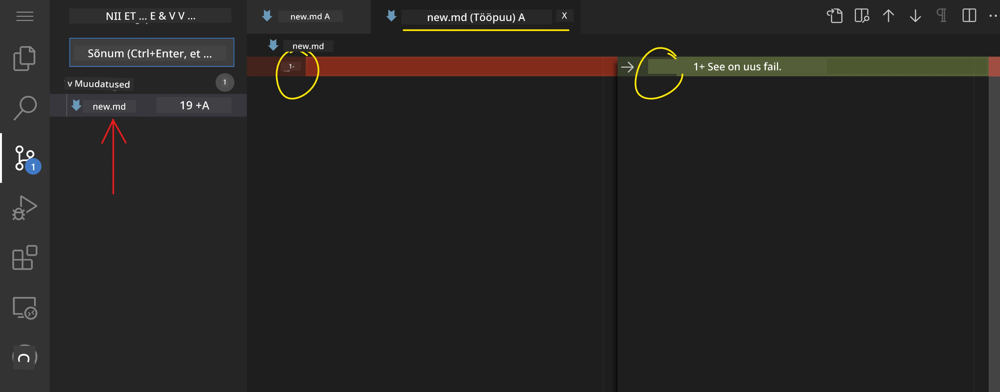

**Töö salvestamine (commit töövoog):**

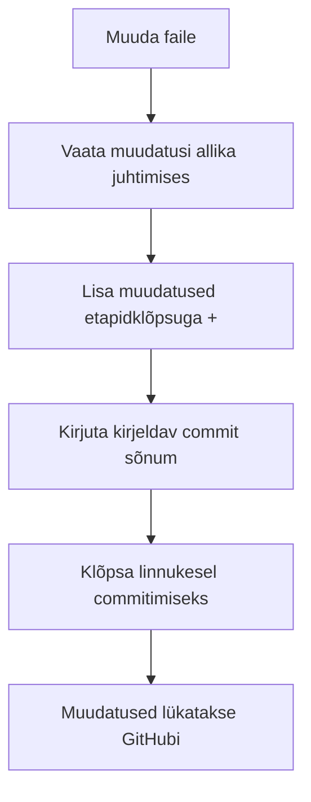
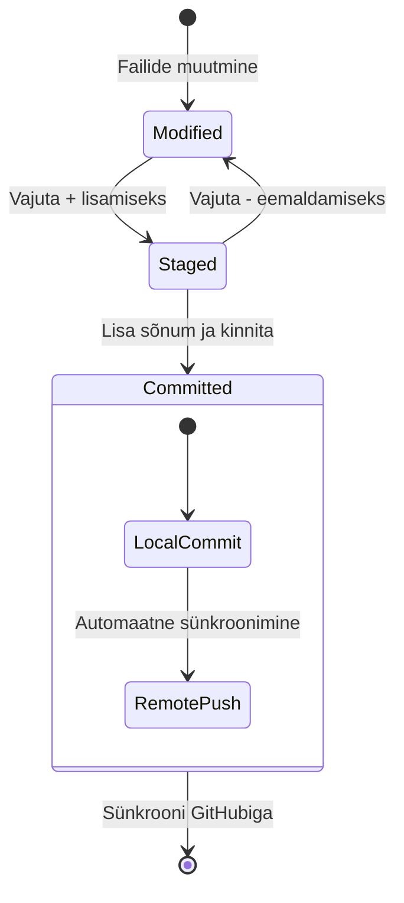
**Sinu samm-sammuline protsess:**
- Klõpsa "+" ikoonile nende failide kõrval, mida soovid salvestada (see "stage'-ib" need)
- Kontrolli hoolikalt, kas oled rahul kõigi oma lavastatud muudatustega
- Kirjuta lühike märkus, mis selgitab, mida tegid (see on sinu "commit message")
- Klõpsa linnukese ikoonil, et kõik GitHubi salvestada
- Kui muudad meelt, laseb tagasi võtmise ikoon muudatused tagasi võtta

**Heade commit-kirjete kirjutamine (see on lihtsam kui arvad!):**
- Kirjelda lihtsalt, mida tegid, näiteks "Lisa kontaktvorm" või "Paranda katkine navigeerimine"
- Hoia see lühike ja mõnus – mõtle tweet pikkusele, mitte esseele
- Alusta tegusõnaga nagu "Lisa", "Paranda", "Uuenda" või "Eemalda"
- **Head näited:** "Lisa responsiivne navigeerimismenüü", "Paranda mobiilivaate probleemid", "Uuenda värve parema ligipääsetavuse jaoks"

> 💡 **Kiirnavigeerimise näpunäide**: Kasuta hamburger-menüüd (☰) vasakus ülanurgas, et hüpata tagasi oma GitHubi repositooriumi ja näha oma commititud muudatusi veebis. See on nagu portaal sinu redigeerimiskeskkonna ja projekti kodu GitHubis vahel!

## Funktsionaalsuse täiustamine laiendustega

Nii nagu käsitöölise töökojas on spetsiaalsed tööriistad erinevate ülesannete jaoks, saab ka VSCode.devi kohandada laiendustega, mis lisavad spetsiifilisi võimeid. Need kogukonna loodud pluginad lahendavad levinud arendaja vajadusi nagu koodi vormindamine, reaalajas eelvaade ja täiustatud Git integratsioon.

Laienduste turg sisaldab tuhandeid tasuta tööriistu, mida on loonud arendajad üle kogu maailma. Iga laiendus lahendab konkreetseid töövoo väljakutseid, võimaldades sul luua isikupärastatud arenduskeskkonna, mis vastab sinu spetsiifilistele vajadustele ja eelistustele.

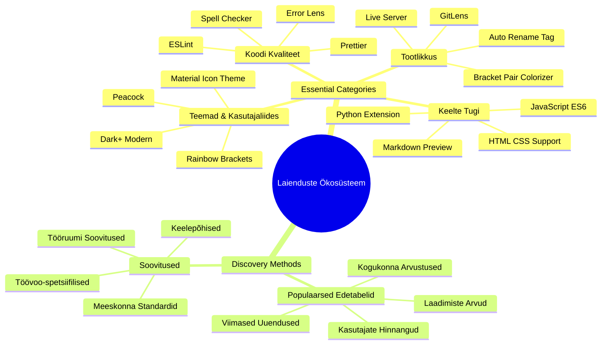
### Sinu täiuslike laienduste leidmine

Laienduste turg on tõesti hästi organiseeritud, seega sa ei eksle, kui otsid, mida vajad. See on loodud aitama avastada nii spetsiifilisi tööriistu kui ka lahedaid asju, millest sa varem teadlik ei olnud!

**Kuidas turule jõuda:**

1. Klõpsa tegevusribal laienduste ikoonile (🧩)
2. Sirvi või otsi midagi kindlat
3. Klõpsa kõigile huvitavatele laiendustele, et rohkem teada saada

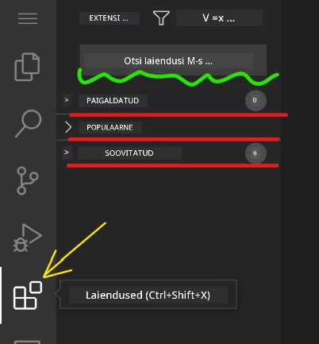

**Mida seal näed:**

| Sektsioon | Sisu | Miks see kasulik on |
|----------|---------|----------|
| **Paigaldatud** | Laiendused, mille oled juba lisanud | Sinu isiklik kooditööriistakast |
| **Populaarsed** | Rahva lemmikud | Mis paljude arendajate lemmikud on |
| **Soovitatud** | Nutikad soovitused sinu projektile | VSCode.devi kasulikud soovitused |

**Mugavaks sirvimiseks:**
- Iga laiendus näitab hinnanguid, allalaadimiste arvu ja kasutajate arvustusi
- Saad ekraanipilte ja selgeid kirjeldusi, mida igaüks teha saab
- Kõik on selgelt märgistatud ühilduvusinfoga
- Pakutakse sarnaseid laiendusi, et saaksid võrrelda võimalusi

### Laienduste paigaldamine (see on väga lihtne!)

Uute võimaluste lisamine oma redaktorile on sama lihtne kui ühe nupu klõpsamine. Laiendused paigaldatakse sekunditega ja hakkavad kohe tööle – pole vaja taaskäivitada ega oodata.

**Kõik, mida pead tegema:**

1. Otsi see, mida tahad (proovi otsida "live server" või "prettier")
2. Klõpsa ühele, mis tundub hea, et näha rohkem detaile
3. Loe, mida see teeb, ja vaata hinnanguid
4. Vajuta sinist "Paigalda" nuppu ja ongi tehtud!


**Mis toimub tagaplaanil:**
- Laiendus laaditakse alla ja seadistatakse automaatselt
- Uued funktsioonid ilmuvad kohe su liidesesse
- Kõik hakkab koheselt tööle (tõesti, nii kiiresti!)
- Kui oled sisse logitud, sünkroniseeritakse laiendus kõigi su seadmetega

**Mõned laiendused, mida soovitan alustada:**
- **Live Server**: Näed oma veebilehe muudatusi reaalajas koodides (see on maagiline!)
- **Prettier**: Muudab su koodi automaatselt puhtaks ja professionaalseks
- **Auto Rename Tag**: Muudad ühe HTML sildi ja selle paar uuendatakse ka
- **Bracket Pair Colorizer**: Värvib sulud nii, et sa ei kao kunagi ära
- **GitLens**: Tugevdab su Git funktsioone hulga kasuliku infoga

### Oma laienduste kohandamine

Enamikul laiendustest on seaded, mida saad muuta, et need töötaksid just nii nagu sulle meeldib. Mõtle sellele nagu auto iste ja peeglite seadistamine – kõigil on omad eelistused!

**Laienduste seadete muutmine:**

1. Leia oma paigaldatud laiendus laienduste paneelis
2. Otsi selle nime kõrval väikest hammasratta ikooni (⚙️) ja klõpsa sellel
3. Vali rippmenüüst "Extension Settings"
4. Muuda seadeid, kuni need sobivad su töövooga ideaalselt

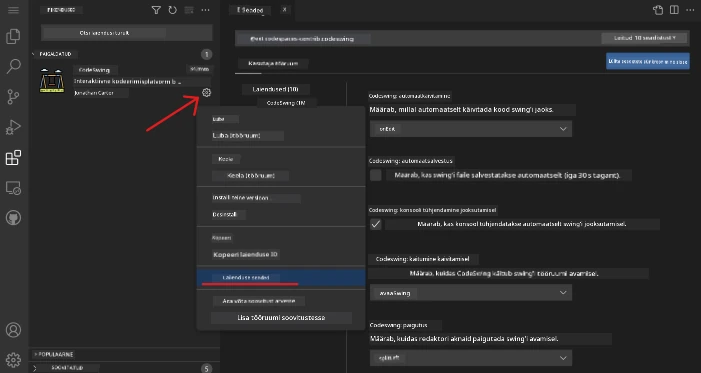

**Tavalised asjad, mida võid tahtagi sättida:**
- Kuidas su kood vormindatakse (tabid vs tühikud, rea pikkus jms)
- Millised kiirklahvid käivitavad erinevaid toiminguid
- Millist tüüpi failidega laiendus peaks töötama
- Spetsiifiliste funktsioonide sisse- või väljalülitamine, et hoida puhtust

### Oma laienduste korrashoid

Kui avastad rohkem lahedaid laiendusi, tahad hoida oma kollektsiooni korras ja sujuvalt töötavana. VSCode.dev teeb selle väga lihtsaks hallata.

**Sinu laienduste haldamise võimalused:**

| Mida Sa Võid Teha | Millal See Kasulik On | Pro näpunäide |
|--------|---------|----------|
| **Keela** | Testimaks, kas mõni laiendus põhjustab probleeme | Parem kui desinstallida, kui võib hiljem tarvis minna |
| **Desinstalli** | Täielikult vabane laiendustest, mida ei vaja | Hoiab su keskkonna puhtana ja kiiremana |
| **Uuenda** | Saa uusimad funktsioonid ja vigade parandused | Tavaliselt käib automaatselt, aga tasub kontrollida |

**Kuidas mulle meeldib laiendusi hallata:**
- Mõne kuu tagant vaatan üle, mida olen paigaldanud ja eemaldan mittevajalikud
- Hoian laiendusi kursis, et saada uusimaid täiustusi ja turvaparandusi
- Kui midagi tundub aeglane, keelan ajutiselt laiendused, et näha, kas mõni neist on põhjus
- Loe uuenduste märkmeid, kui tuleb suuri uuendusi – mõnikord on lahedad uued funktsioonid!

> ⚠️ **Jõudluse näpunäide**: Laiendused on toredad, aga liiga palju võib aeglustada. Keskendu neile, mis päriselt su elu lihtsamaks teevad, ja ära karda eemaldada neid, mida sa kunagi ei kasuta.

### 🎯 Pedagoogiline kontroll: Arenduskeskkonna kohandamine

**Arhitektuuri mõistmine**: Oled õppinud kohandama professionaalset arenduskeskkonda kogukonna loodud laienduste abil. See peegeldab, kuidas ettevõtete arendusmeeskonnad ehitavad standardiseeritud tööriistakomplekte.

**Olulised kontseptsioonid, mida omandatud**:
- **Laienduste leidmine**: Leida tööriistu, mis lahendavad kindlaid arenduse väljakutseid
- **Keskkonna konfiguratsioon**: Kohandada tööriistu vastavalt isiklikele või meeskonna eelistustele
- **Jõudluse optimeerimine**: Tasakaalustada funktsionaalsus süsteemi jõudlusega
- **Kogukonna koostöö**: Kasutada ülemaailmse arendajate kogukonna loodud tööriistu

**Tööstuse seos**: Laienduste ökosüsteemid toidavad suuri arendusplatvorme nagu VS Code, Chrome DevTools ja moodsad IDE-d. Laienduste hindamise, installimise ja seadistamise oskus on professionaalsete arendusprotsesside jaoks hädavajalik.

**Mõtiskluse küsimus**: Kuidas sa läheneksid 10-liikmelise arendusmeeskonna standardiseeritud arenduskeskkonna ülesseadmisel? Mõtle järjepidevusele, jõudlusele ja individuaalsetele eelistustele.

## 📈 Sinu pilvepõhise arenduse meistriklassi ajaskaala

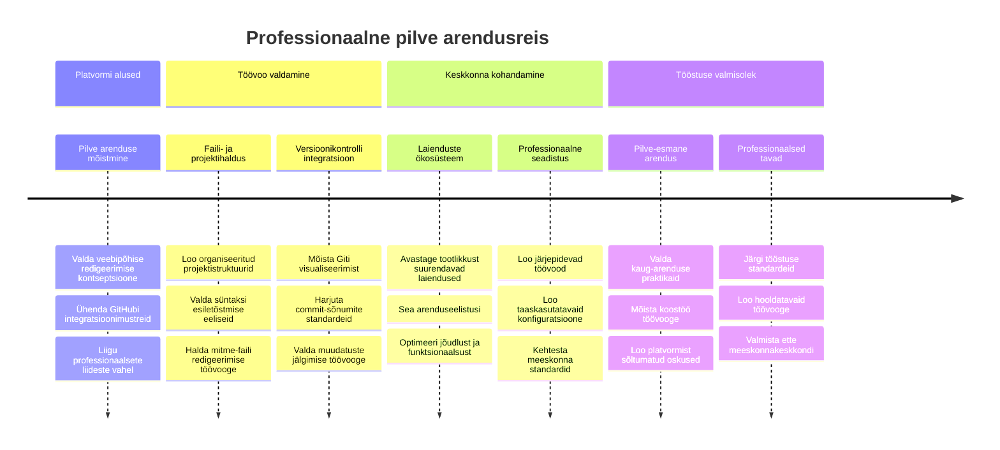
**🎓 Lõpetamise verstapost**: Oled edukalt omandanud pilvepõhise arenduse kasutades samu tööriistu ja töövooge, mida kasutavad professionaalsed arendajad suurtes tehnoloogiafirmades. Need oskused tähistavad tarkvaraarenduse tulevikku.

**🔄 Järgmise taseme võimed**:
- Valmis avastama arenenud pilvearenduse platvorme (Codespaces, GitPod)
- Valmis töötama hajutatud arendusmeeskondades
- Võimeline panustama avatud lähtekoodiga projektidesse üle maailma
- Vundament moodsale DevOpsi ja pideva integratsiooni praktikatele

## GitHub Copilot Agent Väljakutse 🚀

Nii nagu NASA kasutab kosmosemissioonide jaoks struktureeritud lähenemist, hõlmab see väljakutse VSCode.devi oskuste süsteemset rakendamist terviklikus töövoo stsenaariumis.

**Eesmärk:** Tõesta oma oskusi VSCode.devis, luues põhjaliku veebiarenduse töövoo.

**Projekti nõuded:** Agent režiimi abiga tee ära järgmised ülesanded:
1. Tee olemasolevast repositooriumist fork või loo uus
2. Loo toimiv projektistruktuur HTML, CSS ja JavaScript failidega
3. Paigalda ja konfigureeri kolm arendust täiustavat laiendust
4. Harjuta versioonihaldust kirjeldavate commit-kirjetega
5. Katseta funktsiooniharude loomist ja muutmist
6. Dokumenteeri protsess ja õppetunnid README.md faili

See harjutus koondab kõik VSCode.devi kontseptsioonid praktiliseks töövooks, mida saad rakendada tulevates arendusprojektides.

Loe rohkem [agent-režiimi](https://code.visualstudio.com/blogs/2025/02/24/introducing-copilot-agent-mode) kohta siin.

## Ülesanne

On aeg proovile panna need oskused päris projektis! Mul on praktiline ülesanne, mis laseb sul harjutada kõike, mida oleme käsitlenud: [Loo CV veebileht kasutades VSCode.devi](./assignment.md)

See ülesanne juhendab sind läbi professionaalse CV veebisaidi loomise täielikult brauseris. Kasutad kõiki VSCode.devi funktsioone, mida oleme uurinud, ja lõpuks on sul nii suurepärane veebileht kui ka kindel enesetunne uue töövoo osas.

## Jätka avastamist ja oma oskuste kasvatamist

Sul on nüüd tugev vundament olemas, aga on veel nii palju lahedaid asju, mida avastada! Siin on mõned ressursid ja ideed, kuidas viia oma VSCode.devi oskused järgmisele tasandile:

**Ametlik dokumentatsioon, mida tasub järjehoidjates hoida:**
- [VSCode Web Dokumentatsioon](https://code.visualstudio.com/docs/editor/vscode-web?WT.mc_id=academic-0000-alfredodeza) – Täielik juhend brauseripõhiseks redigeerimiseks
- [GitHub Codespaces](https://docs.github.com/en/codespaces) – Kui vajad pilves veelgi rohkem võimsust

**Lahedad funktsioonid, millega järgmisena katsetada:**
- **Klaviatuuri kiirklahvid**: Õpi kombinatsioone, mis teevad sinust koodipeedi ninja
- **Tööruumi sätted**: Sea üles erinevad keskkonnad erinevate projektitüüpide jaoks
- **Mitme juurega tööruumid**: Töötle mitut repositooriumi samaaegselt (väga mugav!)
- **Terminali integratsioon**: Kasuta käsurea tööriistu otse brauseris

**Praktikaks mõtted:**
- Sukeldu mõnda avatud lähtekoodiga projekti ja panusta VSCode.devi abil – see on suurepärane viis tagasi anda!
- Proovi erinevaid laiendusi, et leida oma ideaalne seadistus
- Loo projektimallid kõige sagedamini ehitatavate saitide jaoks
- Harjuta Git töövooge nagu harude loomine ja ühendamine – need oskused on meeskonnaprojektides kullaväärtusega

---

**Oled omandanud brauseripõhise arenduse meistriks!** 🎉 Nii nagu kaasaskantavate instrumentide leiutamine võimaldas teadlastel uurimistööd teha kaugetes paikades, võimaldab VSCode.dev professionaalset kodeerimist mis tahes internetiühendusega seadmest.

Need oskused peegeldavad tänaseid tööstustavasid – paljud professionaalsed arendajad kasutavad pilvepõhiseid arenduskeskkondi nende paindlikkuse ja ligipääsetavuse tõttu. Oled õppinud töövoo, mis skaleerub üksikprojektidest kuni suurte meeskonnatööde koostöödeni.

Rakenda neid tehnikaid oma järgmises arendusprojektis! 🚀

---

<!-- CO-OP TRANSLATOR DISCLAIMER START -->
**Vastutusest loobumine**:
See dokument on tõlgitud AI tõlketeenuse [Co-op Translator](https://github.com/Azure/co-op-translator) abil. Kuigi püüdleme täpsuse poole, tuleb arvestada, et automaatsed tõlked võivad sisaldada vigu või ebatäpsusi. Originaaldokument selle emakeeles tuleks pidada autoriteetseks allikaks. Olulise teabe puhul soovitatakse kasutada professionaalset inimtõlget. Me ei vastuta selle tõlke kasutamisest tingitud arusaamatuste või valesti mõistmiste eest.
<!-- CO-OP TRANSLATOR DISCLAIMER END -->