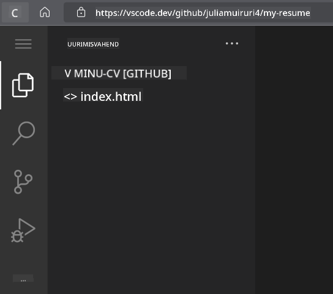

<!--
CO_OP_TRANSLATOR_METADATA:
{
  "original_hash": "bd3aa6d2b879c30ea496c43aec1c49ed",
  "translation_date": "2025-10-11T11:47:35+00:00",
  "source_file": "8-code-editor/1-using-a-code-editor/assignment.md",
  "language_code": "et"
}
-->
# Loo CV-veebileht kasutades vscode.dev

_Kui lahe oleks, kui värbaja küsiks sinu CV-d ja sa saadaksid talle lihtsalt URL-i?_ 😎

<!----
TODO: lisa valikuline pilt

> Sketšmärkus [Autori nimi](https://example.com)
---->

<!---
## Eelloengu viktoriin
[Eelloengu viktoriin](https://ff-quizzes.netlify.app/web/quiz/3)
---->

## Eesmärgid

Pärast seda ülesannet õpid:

- Looma veebilehte, et esitleda oma CV-d

### Eeltingimused

1. GitHubi konto. Mine [GitHub](https://github.com/) lehele ja loo konto, kui sul seda veel pole.

## Sammud

**Samm 1:** Loo uus GitHubi repositoorium ja anna sellele nimi `my-resume`

**Samm 2:** Loo `index.html` fail oma repositooriumis. Lisame vähemalt ühe faili otse github.com lehel, kuna tühja repositooriumi ei saa avada vscode.dev keskkonnas.

Klõpsa lingil `creating a new file`, sisesta failinimi `index.html` ja vali nupp `Commit new file`.


**Samm 3:** Ava [VSCode.dev](https://vscode.dev) ja vali nupp `Open Remote Repository`.

Kopeeri URL repositooriumist, mille just oma CV-lehe jaoks lõid, ja kleebi see sisendkasti:

_Asenda `your-username` oma GitHubi kasutajanimega._

```
https://github.com/your-username/my-resume
```

✅ Kui edukas, näed oma projekti ja index.html faili avatud tekstiredaktoris brauseris.



**Samm 4:** Ava `index.html` fail, kleebi allolev kood oma koodialale ja salvesta.

<details>
    <summary><b>HTML-kood, mis vastutab sinu CV-veebilehe sisu eest.</b></summary>
    
        <html>

            <head>
                <link href="style.css" rel="stylesheet">
                <link rel="stylesheet" href="https://cdnjs.cloudflare.com/ajax/libs/font-awesome/5.15.4/css/all.min.css">
                <title>Siia tuleb sinu nimi!</title>
            </head>
            <body>
                <header id="header">
                    <!-- CV päis sinu nime ja ametiga -->
                    <h1>Siia tuleb sinu nimi!</h1>
                    <hr>
                    Sinu amet!
                    <hr>
                </header>
                <main>
                    <article id="mainLeft">
                        <section>
                            <h2>KONTAKT</h2>
                            <!-- kontaktinfo, sealhulgas sotsiaalmeedia -->
                            <p>
                                <i class="fa fa-envelope" aria-hidden="true"></i>
                                <a href="mailto:username@domain.top-level domain">Kirjuta siia oma e-post</a>
                            </p>
                            <p>
                                <i class="fab fa-github" aria-hidden="true"></i>
                                <a href="github.com/yourGitHubUsername">Kirjuta siia oma kasutajanimi!</a>
                            </p>
                            <p>
                                <i class="fab fa-linkedin" aria-hidden="true"></i>
                                <a href="linkedin.com/yourLinkedInUsername">Kirjuta siia oma kasutajanimi!</a>
                            </p>
                        </section>
                        <section>
                            <h2>OSKUSED</h2>
                            <!-- sinu oskused -->
                            <ul>
                                <li>Oskus 1!</li>
                                <li>Oskus 2!</li>
                                <li>Oskus 3!</li>
                                <li>Oskus 4!</li>
                            </ul>
                        </section>
                        <section>
                            <h2>HARIDUS</h2>
                            <!-- sinu haridus -->
                            <h3>Kirjuta siia oma kursus!</h3>
                            <p>
                                Kirjuta siia oma õppeasutus!
                            </p>
                            <p>
                                Algus - Lõpp kuupäev
                            </p>
                        </section>            
                    </article>
                    <article id="mainRight">
                        <section>
                            <h2>MINUST</h2>
                            <!-- sinust -->
                            <p>Kirjuta siia lühike tutvustus endast!</p>
                        </section>
                        <section>
                            <h2>TÖÖKOGEMUS</h2>
                            <!-- sinu töökogemus -->
                            <h3>Ametinimetus</h3>
                            <p>
                                Siia tuleb organisatsiooni nimi | Alguskuu – Lõppkuu
                            </p>
                            <ul>
                                    <li>Ülesanne 1 - Kirjuta, mida tegid!</li>
                                    <li>Ülesanne 2 - Kirjuta, mida tegid!</li>
                                    <li>Kirjuta oma panuse tulemused/mõju</li>
                                    
                            </ul>
                            <h3>Ametinimetus 2</h3>
                            <p>
                                Siia tuleb organisatsiooni nimi | Alguskuu – Lõppkuu
                            </p>
                            <ul>
                                    <li>Ülesanne 1 - Kirjuta, mida tegid!</li>
                                    <li>Ülesanne 2 - Kirjuta, mida tegid!</li>
                                    <li>Kirjuta oma panuse tulemused/mõju</li>
                                    
                            </ul>
                        </section>
                    </article>
                </main>
            </body>
        </html>
</details>

Lisa oma CV andmed, et asendada _kohatäite tekst_ HTML-koodis.

**Samm 5:** Liigu My-Resume kausta peale, klõpsa `New File ...` ikoonil ja loo oma projekti jaoks 2 uut faili: `style.css` ja `codeswing.json`.

**Samm 6:** Ava `style.css` fail, kleebi allolev kood ja salvesta.

<details>
        <summary><b>CSS-kood, mis kujundab lehe paigutust.</b></summary>
            
            body {
                font-family: 'Segoe UI', Tahoma, Geneva, Verdana, sans-serif;
                font-size: 16px;
                max-width: 960px;
                margin: auto;
            }
            h1 {
                font-size: 3em;
                letter-spacing: .6em;
                padding-top: 1em;
                padding-bottom: 1em;
            }

            h2 {
                font-size: 1.5em;
                padding-bottom: 1em;
            }

            h3 {
                font-size: 1em;
                padding-bottom: 1em;
            }
            main { 
                display: grid;
                grid-template-columns: 40% 60%;
                margin-top: 3em;
            }
            header {
                text-align: center;
                margin: auto 2em;
            }

            section {
                margin: auto 1em 4em 2em;
            }

            i {
                margin-right: .5em;
            }

            p {
                margin: .2em auto
            }

            hr {
                border: none;
                background-color: lightgray;
                height: 1px;
            }

            h1, h2, h3 {
                font-weight: 100;
                margin-bottom: 0;
            }
            #mainLeft {
                border-right: 1px solid lightgray;
            }
            
</details>

**Samm 6:** Ava `codeswing.json` fail, kleebi allolev kood ja salvesta.

    {
    "scripts": [],
    "styles": []
    }

**Samm 7:** Paigalda `Codeswing laiendus`, et visualiseerida CV-veebilehte koodialal.

Klõpsa _`Extensions`_ ikoonil tegevusribal ja sisesta Codeswing. Kas klõpsa _sinist installimisnuppu_ laiendatud tegevusribal, et paigaldada, või kasuta installimisnuppu, mis ilmub koodialale, kui valid laienduse, et laadida lisainfot. Kohe pärast laienduse paigaldamist näed oma koodialal muudatusi projektis 😃.


See on, mida näed oma ekraanil pärast laienduse paigaldamist.


Kui oled tehtud muudatustega rahul, liigu `Changes` kausta peale ja klõpsa `+` nuppu, et muudatused lavastada.

Sisesta commit-sõnum _(Kirjeldus muudatusest, mille tegid projektis)_ ja kinnita muudatused, klõpsates `check`. Kui oled projektiga lõpetanud, vali vasakult ülanurgast hamburgerimenüü ikoon, et naasta GitHubi repositooriumisse.

Palju õnne 🎉 Sa oled just loonud oma CV-veebilehe kasutades vscode.dev mõne sammuga.

## 🚀 Väljakutse

Ava kaugrepositoorium, millel sul on õigused muudatuste tegemiseks, ja uuenda mõningaid faile. Järgmiseks proovi luua uus haru oma muudatustega ja tee Pull Request.

<!----
## Järelloengu viktoriin
[Järelloengu viktoriin](https://ff-quizzes.netlify.app/web/quiz/4)
---->

## Ülevaade ja iseseisev õppimine

Loe rohkem [VSCode.dev](https://code.visualstudio.com/docs/editor/vscode-web?WT.mc_id=academic-0000-alfredodeza) kohta ja selle muudest funktsioonidest.

---

**Lahtiütlus**:  
See dokument on tõlgitud AI tõlketeenuse [Co-op Translator](https://github.com/Azure/co-op-translator) abil. Kuigi püüame tagada täpsust, palume arvestada, et automaatsed tõlked võivad sisaldada vigu või ebatäpsusi. Algne dokument selle algses keeles tuleks pidada autoriteetseks allikaks. Olulise teabe puhul soovitame kasutada professionaalset inimtõlget. Me ei vastuta selle tõlke kasutamisest tulenevate arusaamatuste või valesti tõlgenduste eest.