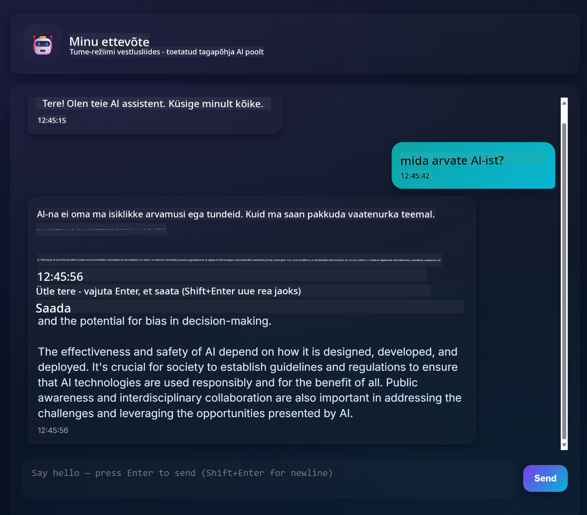
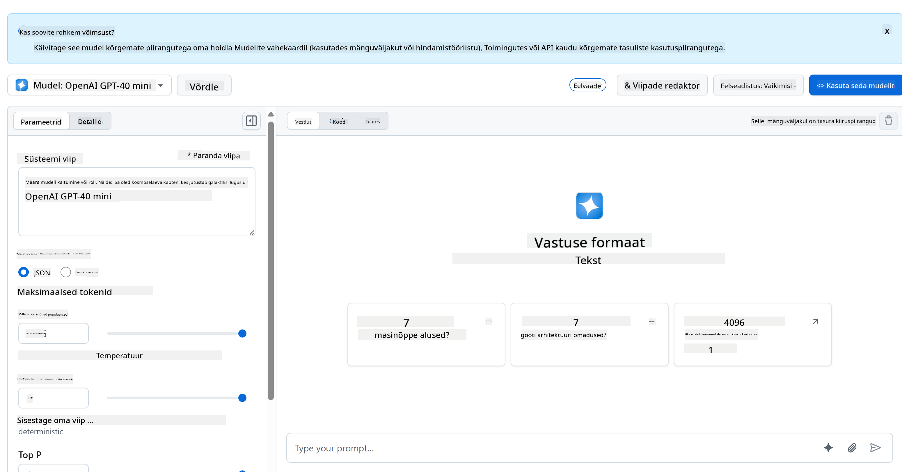
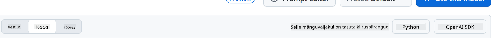
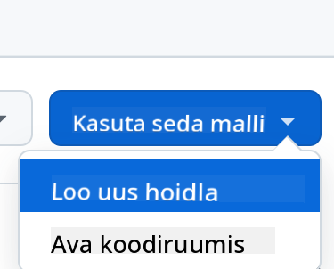
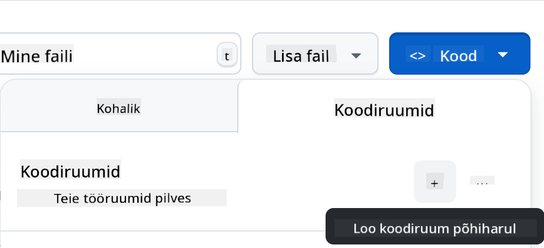

<!--
CO_OP_TRANSLATOR_METADATA:
{
  "original_hash": "11cf36165c243947b6cd85b88cf6faa6",
  "translation_date": "2025-10-11T11:54:20+00:00",
  "source_file": "9-chat-project/README.md",
  "language_code": "et"
}
-->
# Vestlusprojekt

See vestlusprojekt näitab, kuidas luua vestlusassistent, kasutades GitHubi mudeleid.

Siin on valmis projekti näidis:



Natuke tausta: generatiivse tehisintellekti abil vestlusassistentide loomine on suurepärane viis AI-ga tutvumiseks. Selle õppetunni käigus õpid, kuidas integreerida generatiivset AI-d veebirakendusse. Alustame!

## Ühendamine generatiivse AI-ga

Tagapõhja jaoks kasutame GitHubi mudeleid. See on suurepärane teenus, mis võimaldab AI-d tasuta kasutada. Mine selle mänguväljakule ja võta kood, mis vastab sinu valitud tagapõhja keelele. Vaata, kuidas see välja näeb [GitHub Models Playground](https://github.com/marketplace/models/azure-openai/gpt-4o-mini/playground).



Nagu öeldud, vali "Code" vahekaart ja oma valitud käituskeskkond.



### Pythoniga

Sel juhul valime Pythoni, mis tähendab, et võtame selle koodi:

```python
"""Run this model in Python

> pip install openai
"""
import os
from openai import OpenAI

# To authenticate with the model you will need to generate a personal access token (PAT) in your GitHub settings. 
# Create your PAT token by following instructions here: https://docs.github.com/en/authentication/keeping-your-account-and-data-secure/managing-your-personal-access-tokens
client = OpenAI(
    base_url="https://models.github.ai/inference",
    api_key=os.environ["GITHUB_TOKEN"],
)

response = client.chat.completions.create(
    messages=[
        {
            "role": "system",
            "content": "",
        },
        {
            "role": "user",
            "content": "What is the capital of France?",
        }
    ],
    model="openai/gpt-4o-mini",
    temperature=1,
    max_tokens=4096,
    top_p=1
)

print(response.choices[0].message.content)
```

Puhastame seda koodi natuke, et see oleks taaskasutatav:

```python
def call_llm(prompt: str, system_message: str):
    response = client.chat.completions.create(
        messages=[
            {
                "role": "system",
                "content": system_message,
            },
            {
                "role": "user",
                "content": prompt,
            }
        ],
        model="openai/gpt-4o-mini",
        temperature=1,
        max_tokens=4096,
        top_p=1
    )

    return response.choices[0].message.content
```

Funktsiooniga `call_llm` saame nüüd võtta sisendi ja süsteemi sisendi, ning funktsioon tagastab tulemuse.

### AI assistendi kohandamine

Kui soovid AI assistenti kohandada, saad määrata, kuidas soovid, et see käituks, täites süsteemi sisendi näiteks nii:

```python
call_llm("Tell me about you", "You're Albert Einstein, you only know of things in the time you were alive")
```

## Veebirakenduse API loomine

Suurepärane, AI osa on valmis. Vaatame, kuidas seda integreerida veebirakenduse API-sse. Veebirakenduse API jaoks valime Flaski, kuid sobib ka mõni muu veebiraamistik. Vaatame selle koodi:

### Pythoniga

```python
# api.py
from flask import Flask, request, jsonify
from llm import call_llm
from flask_cors import CORS

app = Flask(__name__)
CORS(app)   # *   example.com

@app.route("/", methods=["GET"])
def index():
    return "Welcome to this API. Call POST /hello with 'message': 'my message' as JSON payload"


@app.route("/hello", methods=["POST"])
def hello():
    # get message from request body  { "message": "do this taks for me" }
    data = request.get_json()
    message = data.get("message", "")

    response = call_llm(message, "You are a helpful assistant.")
    return jsonify({
        "response": response
    })

if __name__ == "__main__":
    app.run(host="0.0.0.0", port=5000)
```

Siin loome Flaski API ja määrame vaikimisi marsruudi "/" ja "/chat". Viimane on mõeldud meie esiküljele, et edastada küsimusi tagapõhja.

Et integreerida *llm.py*, tuleb teha järgmist:

- Impordi funktsioon `call_llm`:

   ```python
   from llm import call_llm
   from flask import Flask, request
   ```

- Kutsu seda "/chat" marsruudilt:

   ```python
   @app.route("/hello", methods=["POST"])
   def hello():
      # get message from request body  { "message": "do this taks for me" }
      data = request.get_json()
      message = data.get("message", "")

      response = call_llm(message, "You are a helpful assistant.")
      return jsonify({
         "response": response
      })
   ```

   Siin analüüsime sissetulevat päringut, et saada JSON-kehast `message` omadus. Seejärel kutsume LLM-i selle käsuga:

   ```python
   response = call_llm(message, "You are a helpful assistant")

   # return the response as JSON
   return jsonify({
      "response": response 
   })
   ```

Suurepärane, nüüd on vajalik tehtud.

## Cors-i seadistamine

Peame mainima, et seadistame midagi nagu CORS (cross-origin resource sharing). See tähendab, et kuna meie tagapõhi ja esikülg töötavad erinevatel portidel, peame lubama esiküljel tagapõhja kutsuda.

### Pythoniga

Failis *api.py* on koodijupp, mis selle seadistab:

```python
from flask_cors import CORS

app = Flask(__name__)
CORS(app)   # *   example.com
```

Praegu on see seadistatud lubama "*", mis tähendab kõiki päritolusid, kuid see on natuke ebaturvaline. Tootmises peaksime selle piirama.

## Projekti käivitamine

Projekti käivitamiseks tuleb esmalt käivitada tagapõhi ja seejärel esikülg.

### Pythoniga

Olgu, meil on *llm.py* ja *api.py*. Kuidas saame tagapõhja tööle panna? Siin on kaks asja, mida tuleb teha:

- Paigalda sõltuvused:

   ```sh
   cd backend
   python -m venv venv
   source ./venv/bin/activate

   pip install openai flask flask-cors openai
   ```

- Käivita API

   ```sh
   python api.py
   ```

   Kui oled Codespaces'is, mine redaktori alumises osas Ports-i, klõpsa sellel parema hiireklahviga ja vali "Port Visibility" ning vali "Public".

### Esikülje loomine

Nüüd, kui API töötab, loome sellele esikülje. Minimaalne esikülg, mida me järk-järgult täiustame. Kaustas *frontend* loo järgmine:

```text
backend/
frontend/
index.html
app.js
styles.css
```

Alustame **index.html**-ga:

```html
<html>
    <head>
        <link rel="stylesheet" href="styles.css">
    </head>
    <body>
      <form>
        <textarea id="messages"></textarea>
        <input id="input" type="text" />
        <button type="submit" id="sendBtn">Send</button>  
      </form>  
      <script src="app.js" />
    </body>
</html>    
```

Ülaltoodud on absoluutne miinimum, mida vajad vestlusakna toetamiseks. See koosneb tekstialast, kuhu sõnumid kuvatakse, sisendväljast, kuhu sõnum kirjutada, ja nupust, et sõnum tagapõhja saata. Vaatame järgmisena JavaScripti failis *app.js*.

**app.js**

```js
// app.js

(function(){
  // 1. set up elements  
  const messages = document.getElementById("messages");
  const form = document.getElementById("form");
  const input = document.getElementById("input");

  const BASE_URL = "change this";
  const API_ENDPOINT = `${BASE_URL}/hello`;

  // 2. create a function that talks to our backend
  async function callApi(text) {
    const response = await fetch(API_ENDPOINT, {
      method: "POST",
      headers: { "Content-Type": "application/json" },
      body: JSON.stringify({ message: text })
    });
    let json = await response.json();
    return json.response;
  }

  // 3. add response to our textarea
  function appendMessage(text, role) {
    const el = document.createElement("div");
    el.className = `message ${role}`;
    el.innerHTML = text;
    messages.appendChild(el);
  }

  // 4. listen to submit events
  form.addEventListener("submit", async(e) => {
    e.preventDefault();
   // someone clicked the button in the form
   
   // get input
   const text = input.value.trim();

   appendMessage(text, "user")

   // reset it
   input.value = '';

   const reply = await callApi(text);

   // add to messages
   appendMessage(reply, "assistant");

  })
})();
```

Läheme koodi osade kaupa läbi:

- 1) Siin saame viited kõigile elementidele, mida hiljem koodis kasutame.
- 2) Selles osas loome funktsiooni, mis kasutab sisseehitatud `fetch` meetodit, et kutsuda meie tagapõhja.
- 3) `appendMessage` aitab lisada vastuseid ja seda, mida kasutaja sisestab.
- 4) Siin kuulame submit-sündmust, loeme sisendvälja, lisame kasutaja sõnumi tekstialale, kutsume API-d ja kuvame vastuse tekstialal.

Vaatame järgmisena stiile. Siin saad olla loov ja kujundada, kuidas soovid, kuid siin on mõned soovitused:

**styles.css**

```
.message {
    background: #222;
    box-shadow: 0 0 0 10px orange;
    padding: 10px:
    margin: 5px;
}

.message.user {
    background: blue;
}

.message.assistant {
    background: grey;
} 
```

Nende kolme klassiga saad kujundada sõnumeid erinevalt, sõltuvalt sellest, kas need tulevad assistendilt või sinult kui kasutajalt. Inspiratsiooni saamiseks vaata kausta `solution/frontend/styles.css`.

### Baasaadressi muutmine

Siin oli üks asi, mida me ei seadistanud, ja see oli `BASE_URL`. Seda ei teata enne, kui tagapõhi on käivitatud. Selle seadistamiseks:

- Kui API töötab kohalikult, peaks see olema midagi nagu `http://localhost:5000`.
- Kui töötab Codespaces'is, peaks see olema midagi nagu "[name]app.github.dev".

## Ülesanne

Loo oma kaust *project* järgmise sisuga:

```text
project/
  frontend/
    index.html
    app.js
    styles.css
  backend/
    ...
```

Kopeeri sisu sellest, mis ülaltoodud juhistes on, kuid kohanda seda vastavalt oma soovile.

## Lahendus

[Lahendus](./solution/README.md)

## Boonus

Proovi muuta AI assistendi isikupära.

### Pythoniga

Kui kutsud `call_llm` funktsiooni failis *api.py*, saad muuta teist argumenti vastavalt oma soovile, näiteks:

```python
call_llm(message, "You are Captain Picard")
```

### Esikülg

Muuda ka CSS-i ja teksti vastavalt oma soovile, tehes muudatusi *index.html*-is ja *styles.css*-is.

## Kokkuvõte

Suurepärane, oled õppinud nullist, kuidas luua isiklikku assistenti, kasutades AI-d. Kasutasime selleks GitHubi mudeleid, tagapõhja Pythonis ja esikülge HTML-is, CSS-is ja JavaScriptis.

## Seadistamine Codespaces'iga

- Navigeeri: [Web Dev For Beginners repo](https://github.com/microsoft/Web-Dev-For-Beginners)
- Loo mallist (veendu, et oled GitHubi sisse logitud) paremas ülanurgas:

    

- Kui oled oma repos, loo Codespace:

    

    See peaks käivitama keskkonna, millega saad nüüd töötada.

---

**Lahtiütlus**:  
See dokument on tõlgitud AI tõlketeenuse [Co-op Translator](https://github.com/Azure/co-op-translator) abil. Kuigi püüame tagada täpsust, palume arvestada, et automaatsed tõlked võivad sisaldada vigu või ebatäpsusi. Algne dokument selle algses keeles tuleks pidada autoriteetseks allikaks. Olulise teabe puhul soovitame kasutada professionaalset inimtõlget. Me ei vastuta selle tõlke kasutamisest tulenevate arusaamatuste või valesti tõlgenduste eest.