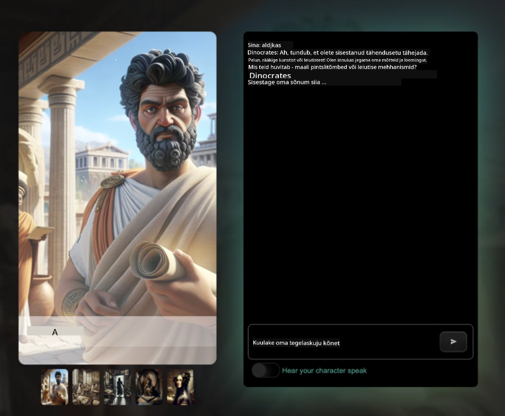
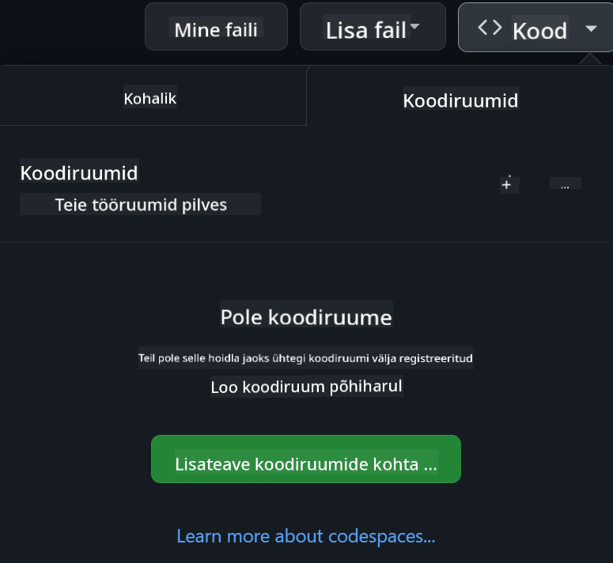

<!--
CO_OP_TRANSLATOR_METADATA:
{
  "original_hash": "caf2ca695e9d259153d24a5cf3e07ef5",
  "translation_date": "2025-10-11T11:38:55+00:00",
  "source_file": "README.md",
  "language_code": "et"
}
-->
[](https://github.com/microsoft/Web-Dev-For-Beginners/blob/master/LICENSE)  
[](https://GitHub.com/microsoft/Web-Dev-For-Beginners/graphs/contributors/)  
[](https://GitHub.com/microsoft/Web-Dev-For-Beginners/issues/)  
[](https://GitHub.com/microsoft/Web-Dev-For-Beginners/pulls/)  
[](http://makeapullrequest.com)  

[](https://GitHub.com/microsoft/Web-Dev-For-Beginners/watchers/)  
[](https://GitHub.com/microsoft/Web-Dev-For-Beginners/network/)  
[](https://GitHub.com/microsoft/Web-Dev-For-Beginners/stargazers/)  

[](https://discord.gg/zxKYvhSnVp?WT.mc_id=academic-000002-leestott)  

# Veebiarendus algajatele - õppekava  

Õpi veebiarenduse põhitõdesid Microsoft Cloud Advocates'i 12-nädalase põhjaliku kursuse abil. Iga 24 õppetundi keskendub JavaScriptile, CSS-ile ja HTML-ile praktiliste projektide kaudu, nagu terraariumid, brauserilaiendused ja kosmosemängud. Osale viktoriinides, aruteludes ja praktilistes ülesannetes. Arenda oma oskusi ja optimeeri teadmiste omandamist meie tõhusa projektipõhise metoodikaga. Alusta oma kodeerimise teekonda juba täna!  

Liitu Azure AI Foundry Discordi kogukonnaga  

[](https://discord.com/invite/ByRwuEEgH4)  

Järgi neid samme, et alustada nende ressursside kasutamist:  
1. **Forki repositoorium**: Klõpsa [](https://GitHub.com/microsoft/Web-Dev-For-Beginners/fork)  
2. **Klooni repositoorium**:   `git clone https://github.com/microsoft/Web-Dev-For-Beginners.git`  
3. [**Liitu Azure AI Foundry Discordiga ja kohtume ekspertide ning teiste arendajatega**](https://discord.com/invite/ByRwuEEgH4)  

### 🌐 Mitmekeelne tugi  

#### Toetatud GitHub Actioni kaudu (automaatne ja alati ajakohane)  

<!-- CO-OP TRANSLATOR LANGUAGES TABLE START -->  
[Araabia](../ar/README.md) | [Bengali](../bn/README.md) | [Bulgaaria](../bg/README.md) | [Birma (Myanmar)](../my/README.md) | [Hiina (lihtsustatud)](../zh/README.md) | [Hiina (traditsiooniline, Hongkong)](../hk/README.md) | [Hiina (traditsiooniline, Macau)](../mo/README.md) | [Hiina (traditsiooniline, Taiwan)](../tw/README.md) | [Horvaatia](../hr/README.md) | [Tšehhi](../cs/README.md) | [Taani](../da/README.md) | [Hollandi](../nl/README.md) | [Eesti](./README.md) | [Soome](../fi/README.md) | [Prantsuse](../fr/README.md) | [Saksa](../de/README.md) | [Kreeka](../el/README.md) | [Heebrea](../he/README.md) | [Hindi](../hi/README.md) | [Ungari](../hu/README.md) | [Indoneesia](../id/README.md) | [Itaalia](../it/README.md) | [Jaapani](../ja/README.md) | [Korea](../ko/README.md) | [Leedu](../lt/README.md) | [Malai](../ms/README.md) | [Marathi](../mr/README.md) | [Nepali](../ne/README.md) | [Norra](../no/README.md) | [Pärsia (Farsi)](../fa/README.md) | [Poola](../pl/README.md) | [Portugali (Brasiilia)](../br/README.md) | [Portugali (Portugal)](../pt/README.md) | [Pandžabi (Gurmukhi)](../pa/README.md) | [Rumeenia](../ro/README.md) | [Vene](../ru/README.md) | [Serbia (kirillitsa)](../sr/README.md) | [Slovaki](../sk/README.md) | [Sloveeni](../sl/README.md) | [Hispaania](../es/README.md) | [Suahiili](../sw/README.md) | [Rootsi](../sv/README.md) | [Tagalogi (Filipino)](../tl/README.md) | [Tamili](../ta/README.md) | [Tai](../th/README.md) | [Türgi](../tr/README.md) | [Ukraina](../uk/README.md) | [Urdu](../ur/README.md) | [Vietnami](../vi/README.md)  
<!-- CO-OP TRANSLATOR LANGUAGES TABLE END -->  

**Kui soovid lisada täiendavaid tõlkeid, on toetatud keeled loetletud [siin](https://github.com/Azure/co-op-translator/blob/main/getting_started/supported-languages.md)**  

[](https://open.vscode.dev/microsoft/Web-Dev-For-Beginners)  

#### 🧑‍🎓 _Kas oled tudeng?_  

Külasta [**Student Hub lehte**](https://docs.microsoft.com/learn/student-hub/?WT.mc_id=academic-77807-sagibbon), kus leiad algajatele mõeldud ressursse, tudengipakette ja isegi võimalusi tasuta sertifikaadi saamiseks. See on leht, mida tasub järjehoidjatesse lisada ja aeg-ajalt külastada, kuna sisu vahetub igakuiselt.  

### 📣 Teade - _Uus projekt generatiivse tehisintellekti kasutamiseks_  

Just lisatud uus AI assistendi projekt, vaata [projekti](./09-chat-project/README.md)  

### 📣 Teade - _Uus õppekava_ generatiivse tehisintellekti kohta JavaScriptis on just avaldatud  

Ära jäta vahele meie uut generatiivse tehisintellekti õppekava!  

Külasta [https://aka.ms/genai-js-course](https://aka.ms/genai-js-course), et alustada!  

  

- Õppetunnid, mis hõlmavad kõike alates põhitõdedest kuni RAG-ni.  
- Suhtle ajalooliste tegelastega GenAI ja meie kaaslase rakenduse abil.  
- Lõbus ja kaasahaarav narratiiv, mis viib sind ajarännakule!  

  

Iga õppetund sisaldab ülesannet, mida täita, teadmiste kontrolli ja väljakutset, mis juhendab sind õppima järgmisi teemasid:  
- Küsitluste loomine ja nende optimeerimine  
- Teksti- ja pildirakenduste loomine  
- Otsingurakendused  

Külasta [https://aka.ms/genai-js-course](../../[https:/aka.ms/genai-js-course), et alustada!  

## 🌱 Alustamine  

> **Õpetajad**, oleme [lisanud mõned soovitused](for-teachers.md), kuidas seda õppekava kasutada. Ootame teie tagasisidet [meie arutelufoorumis](https://github.com/microsoft/Web-Dev-For-Beginners/discussions/categories/teacher-corner)!  

**[Õppijad](https://aka.ms/student-page/?WT.mc_id=academic-77807-sagibbon)**, iga õppetunni puhul alustage eelloengu viktoriiniga, lugege loengumaterjali, täitke erinevaid tegevusi ja kontrollige oma arusaamist järelloengu viktoriiniga.  

Et oma õpikogemust täiustada, tehke koostööd kaasõppijatega projektide kallal! Arutelud on teretulnud meie [arutelufoorumis](https://github.com/microsoft/Web-Dev-For-Beginners/discussions), kus meie moderaatorite meeskond on valmis vastama teie küsimustele.  

Hariduse edendamiseks soovitame tungivalt uurida [Microsoft Learn](https://learn.microsoft.com/users/wirelesslife/collections/p1ddcy5jwy0jkm?WT.mc_id=academic-77807-sagibbon) täiendavate õppematerjalide jaoks.  

### 📋 Keskkonna seadistamine  

Sellel õppekaval on valmis arenduskeskkond! Alustades saate valida, kas käivitada õppekava [Codespace'is](https://github.com/features/codespaces/) (_brauseripõhine keskkond, kus pole vaja midagi installida_) või kohapeal oma arvutis, kasutades tekstiredaktorit, näiteks [Visual Studio Code](https://code.visualstudio.com/?WT.mc_id=academic-77807-sagibbon).  

#### Loo oma repositoorium  
Et saaksid oma tööd hõlpsasti salvestada, soovitame luua selle repositooriumi koopia. Seda saab teha, klõpsates lehe ülaosas nuppu **Use this template**. See loob sinu GitHubi kontole uue repositooriumi koos õppekava koopiaga.  

Järgi neid samme:  
1. **Forki repositoorium**: Klõpsa lehe paremas ülanurgas nuppu "Fork".  
2. **Klooni repositoorium**:   `git clone https://github.com/microsoft/Web-Dev-For-Beginners.git`  

#### Õppekava käivitamine Codespace'is  

Selles repositooriumis, mille sa lõid, klõpsa nuppu **Code** ja vali **Open with Codespaces**. See loob sulle uue Codespace'i, kus saad töötada.  

  

#### Õppekava käivitamine kohapeal oma arvutis  

Et käivitada õppekava kohapeal oma arvutis, vajad tekstiredaktorit, brauserit ja käsurea tööriista. Meie esimene õppetund, [Sissejuhatus programmeerimiskeeltesse ja tööriistadesse](../../1-getting-started-lessons/1-intro-to-programming-languages), juhendab sind erinevate tööriistade valimisel, et leida endale sobivaim.  

Meie soovitus on kasutada [Visual Studio Code'i](https://code.visualstudio.com/?WT.mc_id=academic-77807-sagibbon) redaktorina, millel on ka sisseehitatud [Terminal](https://code.visualstudio.com/docs/terminal/basics/?WT.mc_id=academic-77807-sagibbon). Saad Visual Studio Code'i alla laadida [siit](https://code.visualstudio.com/?WT.mc_id=academic-77807-sagibbon).  

1. Klooni oma repositoorium arvutisse. Seda saab teha, klõpsates nuppu **Code** ja kopeerides URL-i:  

    [CodeSpace](./images/createcodespace.png)  

    Seejärel ava [Terminal](https://code.visualstudio.com/docs/terminal/basics/?WT.mc_id=academic-77807-sagibbon) [Visual Studio Code'is](https://code.visualstudio.com/?WT.mc_id=academic-77807-sagibbon) ja käivita järgmine käsk, asendades `<your-repository-url>` just kopeeritud URL-iga:  

    ```bash 
    git clone <your-repository-url>
    ```
  
2. Ava kaust Visual Studio Code'is. Seda saab teha, klõpsates **File** > **Open Folder** ja valides just kloonitud kausta.  

> Soovitatavad Visual Studio Code'i laiendused:  
>  
> * [Live Server](https://marketplace.visualstudio.com/items?itemName=ritwickdey.LiveServer&WT.mc_id=academic-77807-sagibbon) - HTML-lehtede eelvaateks Visual Studio Code'is  
> * [Copilot](https://marketplace.visualstudio.com/items?itemName=GitHub.copilot&WT.mc_id=academic-77807-sagibbon) - aitab kiiremini koodi kirjutada  

## 📂 Iga õppetund sisaldab:  

- valikulist visuaalset märkmete komplekti  
- valikulist täiendavat videot  
- eelloengu soojendusviktoriini  
- kirjalik õppetund  
- projektipõhiste õppetundide jaoks samm-sammult juhendid projekti loomiseks  
- teadmiste kontrollid  
- väljakutse  
- täiendav lugemine  
- ülesanne  
- [järgnev viktoriin](https://ff-quizzes.netlify.app/web/)  

> **Märkus viktoriinide kohta**: Kõik viktoriinid asuvad Quiz-app kaustas, kokku 48 viktoriini, igaühes kolm küsimust. Need on saadaval [siin](https://ff-quizzes.netlify.app/web/). Viktoriinirakendust saab käivitada lokaalselt või Azure'is; järgige juhiseid `quiz-app` kaustas.  

## 🗃️ Õppetunnid  

|     |                       Projekti nimi                       |                            Õpetatavad kontseptsioonid                            | Õpieesmärgid                                                                                                                 |                                                         Lingitud õppetund                                                          |         Autor          |  
| :-: | :------------------------------------------------------: | :--------------------------------------------------------------------: | ----------------------------------------------------------------------------------------------------------------------------------- | :----------------------------------------------------------------------------------------------------------------------------: | :---------------------: |  
| 01  |                     Alustamine                      |           Programmeerimise sissejuhatus ja tööriistad           | Õpi programmeerimiskeelte põhialuseid ja tarkvara, mis aitab professionaalsetel arendajatel oma tööd teha | [Sissejuhatus programmeerimiskeeltesse ja tööriistadesse](./1-getting-started-lessons/1-intro-to-programming-languages/README.md) |         Jasmine         |  
| 02  |                     Alustamine                      |             GitHubi põhialused, sealhulgas meeskonnatöö             | Kuidas kasutada GitHubi oma projektis ja teha koostööd teistega koodibaasis                                                    |                            [Sissejuhatus GitHubi](./1-getting-started-lessons/2-github-basics/README.md)                             |          Floor          |  
| 03  |                     Alustamine                      |                             Juurdepääsetavus                              | Õpi veebijuurdepääsetavuse põhialuseid                                                                                               |                       [Juurdepääsetavuse alused](./1-getting-started-lessons/3-accessibility/README.md)                       |       Christopher       |  
| 04  |                        JS põhialused                         |                         JavaScripti andmetüübid                          | JavaScripti andmetüüpide põhialused                                                                                                 |                                       [Andmetüübid](./2-js-basics/1-data-types/README.md)                                        |         Jasmine         |  
| 05  |                        JS põhialused                         |                         Funktsioonid ja meetodid                          | Õpi funktsioonide ja meetodite kohta, et hallata rakenduse loogikavoogu                                                             |                              [Funktsioonid ja meetodid](./2-js-basics/2-functions-methods/README.md)                               | Jasmine ja Christopher |  
| 06  |                        JS põhialused                         |                        Otsuste tegemine JavaScriptiga                        | Õpi looma tingimusi oma koodis, kasutades otsuste tegemise meetodeid                                                           |                                 [Otsuste tegemine](./2-js-basics/3-making-decisions/README.md)                                  |         Jasmine         |  
| 07  |                        JS põhialused                         |                            Massiivid ja tsüklid                            | Töötamine andmetega, kasutades JavaScripti massiive ja tsükleid                                                                                 |                                   [Massiivid ja tsüklid](./2-js-basics/4-arrays-loops/README.md)                                    |         Jasmine         |  
| 08  |       [Terrarium](./3-terrarium/solution/README.md)       |                            HTML praktikas                            | Loo HTML, et luua veebipõhine terrarium, keskendudes paigutuse loomisele                                                         |                                 [Sissejuhatus HTML-i](./3-terrarium/1-intro-to-html/README.md)                                 |           Jen           |  
| 09  |       [Terrarium](./3-terrarium/solution/README.md)       |                            CSS praktikas                             | Loo CSS, et kujundada veebipõhine terrarium, keskendudes CSS-i põhialustele, sealhulgas lehe reageerimisvõimekusele                     |                                  [Sissejuhatus CSS-i](./3-terrarium/2-intro-to-css/README.md)                                  |           Jen           |  
| 10  |            [Terrarium](./3-terrarium/solution/README.md)            |                 JavaScripti sulgemised, DOM-i manipuleerimine                  | Loo JavaScript, et muuta terrarium lohistamisfunktsiooniga liideseks, keskendudes sulgemistele ja DOM-i manipuleerimisele             |                  [JavaScripti sulgemised, DOM-i manipuleerimine](./3-terrarium/3-intro-to-DOM-and-closures/README.md)                   |           Jen           |  
| 11  |          [Trükimäng](./4-typing-game/solution/README.md)          |                          Loo trükimäng                           | Õpi kasutama klaviatuuri sündmusi, et juhtida oma JavaScripti rakenduse loogikat                                                          |                                [Sündmustepõhine programmeerimine](./4-typing-game/typing-game/README.md)                                |       Christopher       |  
| 12  | [Roheline brauserilaiendus](./5-browser-extension/solution/README.md) |                         Töö brauseritega                          | Õpi, kuidas brauserid töötavad, nende ajalugu ja kuidas luua brauserilaienduse esimesed elemendid                               |                               [Brauseritest](./5-browser-extension/1-about-browsers/README.md)                                |           Jen           |  
| 13  | [Roheline brauserilaiendus](./5-browser-extension/solution/README.md) | Vormide loomine, API-de kutsumine ja muutujate salvestamine lokaalsesse mällu | Loo oma brauserilaienduse JavaScripti elemendid, et kutsuda API-d, kasutades lokaalsesse mällu salvestatud muutujaid                      |                [API-d, vormid ja lokaalne mälu](./5-browser-extension/2-forms-browsers-local-storage/README.md)                 |           Jen           |  
| 14  | [Roheline brauserilaiendus](./5-browser-extension/solution/README.md) |          Taustaprotsessid brauseris, veebijõudlus          | Kasuta brauseri taustaprotsesse laienduse ikooni haldamiseks; õpi veebijõudluse kohta ja mõningaid optimeerimisi   |             [Taustaprotsessid ja jõudlus](./5-browser-extension/3-background-tasks-and-performance/README.md)              |           Jen           |  
| 15  |           [Kosmosemäng](./6-space-game/solution/README.md)           |             Täiustatud mänguarendus JavaScriptiga             | Õpi päriluse kohta, kasutades nii klasse kui kompositsiooni, ja Pub/Sub mustrit, valmistudes mängu loomiseks              |                      [Sissejuhatus täiustatud mänguarendusse](./6-space-game/1-introduction/README.md)                       |          Chris          |  
| 16  |           [Kosmosemäng](./6-space-game/solution/README.md)           |                           Joonistamine lõuendile                            | Õpi lõuendi API kohta, mida kasutatakse elementide ekraanile joonistamiseks                                                                       |                                [Joonistamine lõuendile](./6-space-game/2-drawing-to-canvas/README.md)                                |          Chris          |  
| 17  |           [Kosmosemäng](./6-space-game/solution/README.md)           |                   Elementide liigutamine ekraanil                    | Avastage, kuidas elemendid saavad liikuda, kasutades koordinaatsüsteemi ja lõuendi API-d                                            |                           [Elementide liigutamine](./6-space-game/3-moving-elements-around/README.md)                           |          Chris          |  
| 18  |           [Kosmosemäng](./6-space-game/solution/README.md)           |                          Kokkupõrke tuvastamine                           | Muutke elemendid üksteisega kokku põrkama ja reageerima, kasutades klahvivajutusi, ning lisage jahtumisfunktsioon, et tagada mängu jõudlus    |                              [Kokkupõrke tuvastamine](./6-space-game/4-collision-detection/README.md)                              |          Chris          |  
| 19  |           [Kosmosemäng](./6-space-game/solution/README.md)           |                             Punktide arvestamine                              | Tehke matemaatilisi arvutusi mängu oleku ja jõudluse põhjal                                                                |                                    [Punktide arvestamine](./6-space-game/5-keeping-score/README.md)                                    |          Chris          |  
| 20  |           [Kosmosemäng](./6-space-game/solution/README.md)           |                     Mängu lõpetamine ja taaskäivitamine                     | Õpi mängu lõpetamise ja taaskäivitamise kohta, sealhulgas ressursside puhastamine ja muutujate väärtuste lähtestamine                              |                                [Lõppetingimus](./6-space-game/6-end-condition/README.md)                                 |          Chris          |  
| 21  |         [Pangarakendus](./7-bank-project/solution/README.md)          |                 HTML-i mallid ja marsruudid veebirakenduses                 | Õpi looma mitmeleheküljelise veebisaidi arhitektuuri karkassi, kasutades marsruutimist ja HTML-i malle                             |                            [HTML-i mallid ja marsruudid](./7-bank-project/1-template-route/README.md)                             |          Yohan          |  
| 22  |         [Pangarakendus](./7-bank-project/solution/README.md)          |                  Sisselogimis- ja registreerimisvormi loomine                   | Õpi vormide loomise ja valideerimisrutiinide käsitlemise kohta                                                                          |                                           [Vormid](./7-bank-project/2-forms/README.md)                                           |          Yohan          |  
| 23  |         [Pangarakendus](./7-bank-project/solution/README.md)          |                   Andmete hankimise ja kasutamise meetodid                   | Kuidas andmed voolavad rakendusse ja sealt välja, kuidas neid hankida, salvestada ja kustutada                                                 |                                            [Andmed](./7-bank-project/3-data/README.md)                                            |          Yohan          |  
| 24  |         [Pangarakendus](./7-bank-project/solution/README.md)          |                      Oleku haldamise kontseptsioonid                      | Õpi, kuidas rakendus säilitab olekut ja kuidas seda programmiliselt hallata                                                              |                                [Oleku haldamine](./7-bank-project/4-state-management/README.md)                                |          Yohan          |  
| 25 | [Brauser/VScode kood](../../8-code-editor) | Töö VScode'iga | Õpi, kuidas kasutada koodiredaktorit| [VScode koodiredaktori kasutamine](./8-code-editor/1-using-a-code-editor/README.md) | Chris |  
| 26 | [AI assistendid](./9-chat-project/README.md) | Töö AI-ga | Õpi, kuidas luua oma AI assistent | [AI assistendi projekt](./9-chat-project/README.md) | Chris |  

## 🏫 Pedagoogika  

Meie õppekava on loodud kahe peamise pedagoogilise põhimõtte järgi:  
* projektipõhine õpe  
* sagedased viktoriinid  

Programm õpetab JavaScripti, HTML-i ja CSS-i põhialuseid ning tänapäeva veebiarendajate kasutatavaid uusimaid tööriistu ja tehnikaid. Õpilastel on võimalus omandada praktilisi kogemusi, luues trükimängu, virtuaalse terrariumi, keskkonnasõbraliku brauserilaienduse, kosmosemängu ja äripangarakenduse. Kursuse lõpuks on õpilased omandanud põhjalikud teadmised veebiarendusest.  

> 🎓 Selle õppekava esimesi tunde saate läbida [õppeprogrammi](https://docs.microsoft.com/learn/paths/web-development-101/?WT.mc_id=academic-77807-sagibbon) osana Microsoft Learnis!  

Tagades, et sisu vastab projektidele, muutub õppeprotsess õpilaste jaoks kaasahaaravamaks ja kontseptsioonide meeldejätmine paraneb. Oleme kirjutanud ka mitmeid JavaScripti põhialuste algtunde, et tutvustada kontseptsioone, koos videoga "[Algajate sari: JavaScript](https://channel9.msdn.com/Series/Beginners-Series-to-JavaScript/?WT.mc_id=academic-77807-sagibbon)" videokogust, mille autorid on osaliselt panustanud ka sellesse õppekavasse.  

Lisaks aitab madala panusega viktoriin enne tundi suunata õpilase tähelepanu teema õppimisele, samas kui teine viktoriin pärast tundi tagab parema meeldejätmise. See õppekava on loodud paindlikuks ja lõbusaks ning seda saab läbida tervikuna või osaliselt. Projektid algavad väikestest ja muutuvad 12-nädalase tsükli lõpuks järjest keerukamaks.  

Kuigi oleme teadlikult vältinud JavaScripti raamistikke, et keskenduda veebiarendaja põhioskustele enne raamistikuga tutvumist, oleks selle õppekava lõpetamise järel hea järgmine samm õppida Node.js-i teise videokogu kaudu: "[Algajate sari: Node.js](https://channel9.msdn.com/Series/Beginners-Series-to-Nodejs/?WT.mc_id=academic-77807-sagibbon)".  

> Külastage meie [käitumisjuhendit](CODE_OF_CONDUCT.md) ja [panustamise](CONTRIBUTING.md) juhiseid. Ootame teie konstruktiivset tagasisidet!  

## 🧭 Võimalus kasutada võrguühenduseta  

Seda dokumentatsiooni saab kasutada võrguühenduseta, kasutades [Docsify](https://docsify.js.org/#/). Forkige see repo, [installige Docsify](https://docsify.js.org/#/quickstart) oma kohalikku arvutisse ja seejärel sisestage selle repo juurkaustas `docsify serve`. Veebisait avatakse pordil 3000 teie localhostis: `localhost:3000`.  

## 📘 PDF  

Kõigi õppetundide PDF-i leiate [siit](https://microsoft.github.io/Web-Dev-For-Beginners/pdf/readme.pdf).  

## 🎒 Muud kursused  

Meie meeskond koostab ka teisi kursusi! Vaadake:  

- [MCP algajatele](https://aka.ms/mcp-for-beginners)  
- [Edge AI algajatele](https://aka.ms/edgeai-for-beginners)  
- [AI agendid algajatele](https://aka.ms/ai-agents-beginners)  
- [Generatiivne AI algajatele .NET](https://github.com/microsoft/Generative-AI-for-beginners-dotnet)  
- [Generatiivne AI JavaScriptiga](https://github.com/microsoft/generative-ai-with-javascript)  
- [Generatiivne AI Javaga](https://github.com/microsoft/Generative-AI-for-beginners-java)  
- [AI algajatele](https://aka.ms/ai-beginners)  
- [Andmeteadus algajatele](https://aka.ms/datascience-beginners)  
- [ML algajatele](https://aka.ms/ml-beginners)  
- [Küberturvalisus algajatele](https://github.com/microsoft/Security-101)  
- [Veebiarendus algajatele](https://aka.ms/webdev-beginners)  
- [IoT algajatele](https://aka.ms/iot-beginners)  
- [XR Arendamine Algajatele](https://github.com/microsoft/xr-development-for-beginners)  
- [GitHub Copiloti Valdamine Agentlikuks Kasutamiseks](https://github.com/microsoft/Mastering-GitHub-Copilot-for-Paired-Programming)  
- [GitHub Copiloti Valdamine C#/.NET Arendajatele](https://github.com/microsoft/mastering-github-copilot-for-dotnet-csharp-developers)  
- [Vali Oma Copiloti Seiklus](https://github.com/microsoft/CopilotAdventures)  

## Abi Saamine  

Kui jääd hätta või sul on küsimusi AI rakenduste loomise kohta, liitu:  

[](https://aka.ms/foundry/discord)  

Kui sul on tagasisidet toodete kohta või esineb vigu arendamisel, külasta:  

[](https://aka.ms/foundry/forum)  

## Litsents  

See repositoorium on litsentseeritud MIT litsentsi alusel. Lisateabe saamiseks vaata [LICENSE](../../LICENSE) faili.  

---

**Lahtiütlus**:  
See dokument on tõlgitud AI tõlketeenuse [Co-op Translator](https://github.com/Azure/co-op-translator) abil. Kuigi püüame tagada täpsust, palume arvestada, et automaatsed tõlked võivad sisaldada vigu või ebatäpsusi. Algne dokument selle algses keeles tuleks pidada autoriteetseks allikaks. Olulise teabe puhul soovitame kasutada professionaalset inimtõlget. Me ei vastuta selle tõlke kasutamisest tulenevate arusaamatuste või valesti tõlgenduste eest.