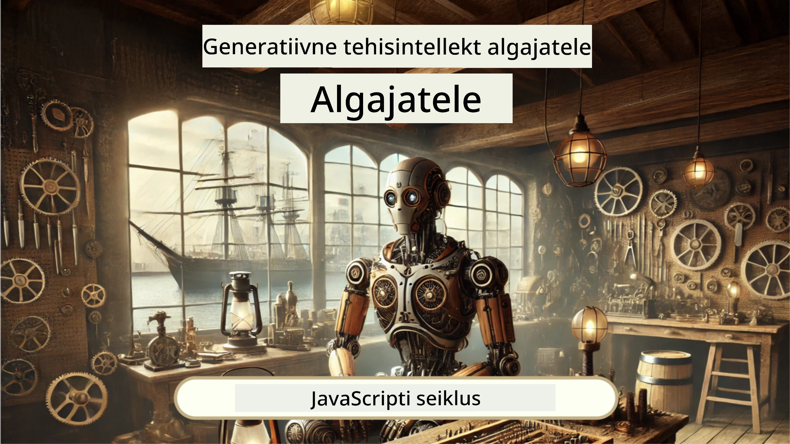
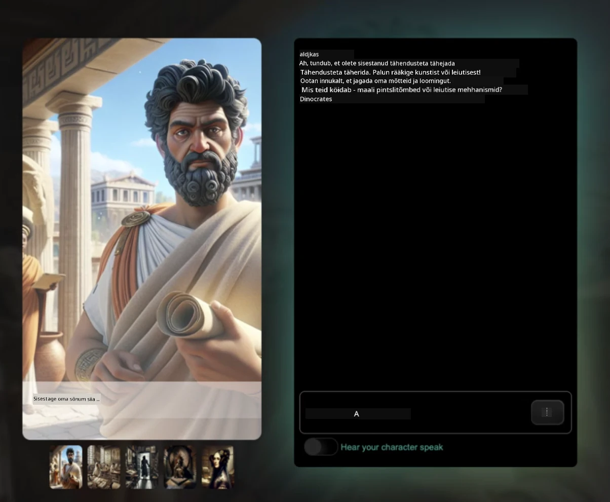
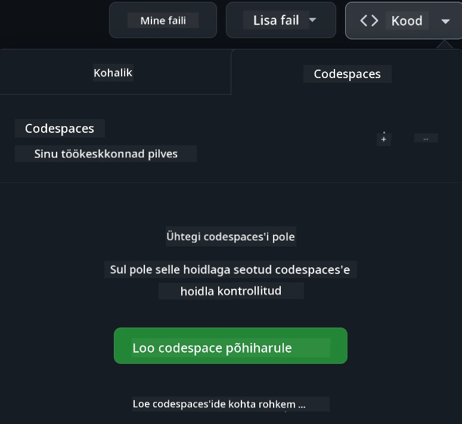

[](https://github.com/microsoft/Web-Dev-For-Beginners/blob/master/LICENSE)
[](https://GitHub.com/microsoft/Web-Dev-For-Beginners/graphs/contributors/)
[](https://GitHub.com/microsoft/Web-Dev-For-Beginners/issues/)
[](https://GitHub.com/microsoft/Web-Dev-For-Beginners/pulls/)
[](http://makeapullrequest.com) 

[](https://GitHub.com/microsoft/Web-Dev-For-Beginners/watchers/)
[](https://GitHub.com/microsoft/Web-Dev-For-Beginners/network/)
[](https://GitHub.com/microsoft/Web-Dev-For-Beginners/stargazers/)

[](https://discord.gg/nTYy5BXMWG)

# Veebiarendus algajatele – Õppekava

Õpi veebiarenduse põhialuseid meie 12-nädalase põhjaliku kursusega, mida viivad läbi Microsoft Cloud Advocates. Kõik 24 õppetundi süvenevad JavaScripti, CSS-i ja HTML-i praktiliste projektide kaudu, näiteks terrariumid, brauserilaiendid ja kosmose mängud. Osale viktoriinides, aruteludes ja praktilistes ülesannetes. Paranda oma oskusi ja optimeeri teadmiste meeldejätmist meie tõhusa projektipõhise pedagoogikaga. Alusta oma programmeerimisteekonda juba täna!

Liitu Azure AI Foundry Discordi kogukonnaga

[](https://discord.gg/nTYy5BXMWG)

Järgige neid samme, et alustada nende ressursside kasutamist:
1. **Jaga hoidlaga**: Klõpsake [](https://GitHub.com/microsoft/Web-Dev-For-Beginners/fork)
2. **Kloonige hoidla**:   `git clone https://github.com/microsoft/Web-Dev-For-Beginners.git`
3. [**Liitu Azure AI Foundry Discordiga ning kohtuge ekspertide ja teiste arendajatega**](https://discord.com/invite/ByRwuEEgH4)

### 🌐 Mitmekeelne tugi

#### Toetatud GitHub Actioni kaudu (automatiseeritud ja alati ajakohane)

<!-- CO-OP TRANSLATOR LANGUAGES TABLE START -->
[Arabic](../ar/README.md) | [Bengali](../bn/README.md) | [Bulgarian](../bg/README.md) | [Burmese (Myanmar)](../my/README.md) | [Chinese (Simplified)](../zh-CN/README.md) | [Chinese (Traditional, Hong Kong)](../zh-HK/README.md) | [Chinese (Traditional, Macau)](../zh-MO/README.md) | [Chinese (Traditional, Taiwan)](../zh-TW/README.md) | [Croatian](../hr/README.md) | [Czech](../cs/README.md) | [Danish](../da/README.md) | [Dutch](../nl/README.md) | [Estonian](./README.md) | [Finnish](../fi/README.md) | [French](../fr/README.md) | [German](../de/README.md) | [Greek](../el/README.md) | [Hebrew](../he/README.md) | [Hindi](../hi/README.md) | [Hungarian](../hu/README.md) | [Indonesian](../id/README.md) | [Italian](../it/README.md) | [Japanese](../ja/README.md) | [Kannada](../kn/README.md) | [Korean](../ko/README.md) | [Lithuanian](../lt/README.md) | [Malay](../ms/README.md) | [Malayalam](../ml/README.md) | [Marathi](../mr/README.md) | [Nepali](../ne/README.md) | [Nigerian Pidgin](../pcm/README.md) | [Norwegian](../no/README.md) | [Persian (Farsi)](../fa/README.md) | [Polish](../pl/README.md) | [Portuguese (Brazil)](../pt-BR/README.md) | [Portuguese (Portugal)](../pt-PT/README.md) | [Punjabi (Gurmukhi)](../pa/README.md) | [Romanian](../ro/README.md) | [Russian](../ru/README.md) | [Serbian (Cyrillic)](../sr/README.md) | [Slovak](../sk/README.md) | [Slovenian](../sl/README.md) | [Spanish](../es/README.md) | [Swahili](../sw/README.md) | [Swedish](../sv/README.md) | [Tagalog (Filipino)](../tl/README.md) | [Tamil](../ta/README.md) | [Telugu](../te/README.md) | [Thai](../th/README.md) | [Turkish](../tr/README.md) | [Ukrainian](../uk/README.md) | [Urdu](../ur/README.md) | [Vietnamese](../vi/README.md)

> **Eelistad kohalikku kloonimist?**

> See hoidla sisaldab üle 50 keele tõlget, mis suurendab oluliselt allalaadimismahtu. Tõlgeteta kloonimiseks kasuta harva allalaaditava sisuga kloonimist (sparse checkout):
> ```bash
> git clone --filter=blob:none --sparse https://github.com/microsoft/Web-Dev-For-Beginners.git
> cd Web-Dev-For-Beginners
> git sparse-checkout set --no-cone '/*' '!translations' '!translated_images'
> ```
> See annab sulle kõik vajaliku kursuse läbimiseks palju kiiremalt.
<!-- CO-OP TRANSLATOR LANGUAGES TABLE END -->

**Kui soovid toetada täiendavaid tõlkekeeli, on nende loetelu [siin](https://github.com/Azure/co-op-translator/blob/main/getting_started/supported-languages.md)**

[](https://open.vscode.dev/microsoft/Web-Dev-For-Beginners)

#### 🧑‍🎓 _Oled tudeng?_

Külasta [**Tudengikeskuse lehte**](https://docs.microsoft.com/learn/student-hub/?WT.mc_id=academic-77807-sagibbon), kus leiad algajale suunatud ressursid, tudengipakid ja isegi võimalused saada tasuta sertifikaadikupong. See on leht, mille soovid järjehoidjaks panna ja aeg-ajalt külastada, sest sisu uuendatakse igakuiselt.

### 📣 Teade – Uued väljakutsed GitHub Copilot Agent režiimis, mida lõpuni viia!

Lisandus uus väljakutse, otsi enamikest peatükkidest "GitHub Copilot Agent Challenge 🚀". See on uus väljakutse, mida saad täita GitHub Copilot ja Agent režiimi abil. Kui sa pole varem Agent režiimi kasutanud, siis see suudab mitte ainult teksti genereerida, vaid ka faile luua ja muuta, käivitada käske ja palju muud.

### 📣 Teade – _Uus generatiivse tehisintellekti abil ehitatav projekt_

Lisandus uus AI assistendi projekt, vaata lähemalt [projektist](./9-chat-project/README.md)

### 📣 Teade – _Uus Generative AI õppekava JavaScriptile_

Ära jäta vahele meie uut Generatiivse AI õppekava!

Alusta aadressil [https://aka.ms/genai-js-course](https://aka.ms/genai-js-course)!



- Õppetunnid käsitlevad kõike alates põhitõdedest kuni RAG-ni.
- Suhtle ajalooliste tegelastega GenAI ja meie kaasrakenduse abil.
- Lõbus ja kaasahaarav jutustus, kus rändad ajas!




Iga õppetund sisaldab sooritamiseks ülesannet, teadmiste kontrolli ja väljakutset, mis aitavad õpitavates valdkondades nagu:
- Päringute koostamine ja päringute inseneritehnika
- Teksti ja pildirakenduste genereerimine
- Otsingurakendused

Alusta aadressil [https://aka.ms/genai-js-course](https://aka.ms/genai-js-course)!


## 🌱 Alustamine

> **Õpetajad**, me oleme lisanud mõned soovitused [siin](for-teachers.md), kuidas seda õppekava kasutada. Hindame väga teie tagasisidet [meie arutelufoorumis](https://github.com/microsoft/Web-Dev-For-Beginners/discussions/categories/teacher-corner)!

**[Õppijad](https://aka.ms/student-page/?WT.mc_id=academic-77807-sagibbon)**, alustage iga õppetundi eeloengu viktoriiniga, järgige loengumaterjali lugemist, sooritage erinevad tegevused ja kontrollige arusaamist järelõppe viktoriiniga.

Õppimise kogemuse parandamiseks looge ühendus oma eakaaslastega, et koos projektidega töötada! Arutelud on teretulnud meie [arutelufoorumis](https://github.com/microsoft/Web-Dev-For-Beginners/discussions), kus meie moderaatorite meeskond on valmis teie küsimustele vastama.

Veelgi rohkem õppimiseks soovitame tungivalt uurida [Microsoft Learni](https://learn.microsoft.com/users/wirelesslife/collections/p1ddcy5jwy0jkm?WT.mc_id=academic-77807-sagibbon) lisastudiumimaterjale.

### 📋 Keskkonna seadistamine

Sellel õppekaval on valmis arenduskeskkond! Kursuse alustamisel võid valida selle käivitamise [Codespace’is](https://github.com/features/codespaces/) (_brauseripõhine, pole vaja midagi paigaldada_), või kohalikult oma arvutis tekstitöötlusprogrammi nagu [Visual Studio Code](https://code.visualstudio.com/?WT.mc_id=academic-77807-sagibbon) abil.

#### Loo oma hoidla
Selleks, et oleks lihtsam oma tööd salvestada, soovitatakse luua selle hoidla koopia. Seda saad teha, klõpsates lehe ülaosas nuppu **Use this template**. See loob uue hoidla sinu GitHubi kontole koos õppekava koopiaga.

Järgi neid samme:
1. **Jaga hoidlaga**: Klõpsa selle lehe paremas ülanurgas nuppu "Fork".
2. **Kloonige hoidla**:   `git clone https://github.com/microsoft/Web-Dev-For-Beginners.git`

#### Õppekava käivitamine Codespaces keskkonnas

Selles hoidla koopias, mille lõid, klõpsa nuppu **Code** ja vali **Open with Codespaces**. See loob sulle uue Codespace’i töötamiseks.



#### Õppekava käivitamine kohalikult arvutis

Selle õppekava kohalikuks käivitamiseks vajad tekstitöötlusprogrammi, brauserit ja käsurea tööriista. Meie esimene õppetund, [Sissejuhatus programmeerimiskeeltesse ja tööriistadesse](../../1-getting-started-lessons/1-intro-to-programming-languages), juhatab sind läbi erinevate võimaluste ning aitab valida sobivad tööriistad.

Soovitame kasutada [Visual Studio Code’i](https://code.visualstudio.com/?WT.mc_id=academic-77807-sagibbon) tekstiredaktorina, millel on ka sisseehitatud [Terminal](https://code.visualstudio.com/docs/terminal/basics/?WT.mc_id=academic-77807-sagibbon). Visual Studio Code’i saad alla laadida [siit](https://code.visualstudio.com/?WT.mc_id=academic-77807-sagibbon).


1. Kloonige oma hoidla oma arvutisse. Seda saad teha, klõpsates nuppu **Code** ja kopeerides URL:

    [CodeSpace](./images/createcodespace.png)
Seejärel ava [Terminal](https://code.visualstudio.com/docs/terminal/basics/?WT.mc_id=academic-77807-sagibbon) [Visual Studio Code'i](https://code.visualstudio.com/?WT.mc_id=academic-77807-sagibbon) sees ja käivita järgmine käsk, asendades `<your-repository-url>` äsja kopeeritud URL-iga:

    ```bash 
    git clone <your-repository-url>
    ```
  
2. Ava kaust Visual Studio Code'is. Seda saad teha, klõpsates **File** > **Open Folder** ja valides äsja kloonitud kausta.

>  Soovitatud Visual Studio Code laiendused:
>
> * [Live Server](https://marketplace.visualstudio.com/items?itemName=ritwickdey.LiveServer&WT.mc_id=academic-77807-sagibbon) – HTML-lehtede eelvaate kuvamiseks Visual Studio Code'is
> * [Copilot](https://marketplace.visualstudio.com/items?itemName=GitHub.copilot&WT.mc_id=academic-77807-sagibbon) – aitab sul koodi kiiremini kirjutada

## 📂 Iga õppetund sisaldab:

- valikuline visand   
- valikuline lisavidin
- eelõppe soojendus-quiz
- kirjalik õppetund
- projektipõhiste õppetundide korral samm-sammult juhised projekti ehitamiseks
- teadmiste kontroll
- väljakutse
- lisalugemine
- ülesanne
- [järgnev quiz](https://ff-quizzes.netlify.app/web/)

> **Märkused quizide kohta**: Kõik quizid asuvad Quiz-app kaustas, kokku 48 quiz'i, igas kolm küsimust. Need on kättesaadavad [siin](https://ff-quizzes.netlify.app/web/). Quiz-rakendust saab käivitada lokaalselt või paigaldada Azure'i; järgi juhiseid `quiz-app` kaustas.

## 🗃️ Õppetunnid

|     |                       Projekti nimi                       |                            Õppekäsitlused                             | Õpieesmärgid                                                                                                                 |                                                         Seotud õppetund                                                          |         Autor          |
| :-: | :------------------------------------------------------: | :------------------------------------------------------------------: | ---------------------------------------------------------------------------------------------------------------------------- | :----------------------------------------------------------------------------------------------------------------------------: | :---------------------: |
| 01  |                     Alustamine                          |           Programmeerimise ja tööriistade tutvustus                  | Õpi programmeerimiskeelte alustalasid ja tarkvara, mis aitab arendajatel tööd teha                                           | [Sihtprogrammide ja tööriistade sissejuhatus](./1-getting-started-lessons/1-intro-to-programming-languages/README.md)          |         Jasmine         |
| 02  |                     Alustamine                          |             GitHub'i alused, meeskonnatöö                          | Õpi kasutama GitHubi projektis ja koostööd koodibaasil                                                       |                            [GitHub'i alused](./1-getting-started-lessons/2-github-basics/README.md)                             |          Floor          |
| 03  |                     Alustamine                          |                             Ligipääsetavus                          | Õpi veebipõhise ligipääsetavuse aluseid                                                                                       |                       [Ligipääsetavuse alused](./1-getting-started-lessons/3-accessibility/README.md)                          |       Christopher       |
| 04  |                        JS algtõed                        |                         JavaScripti andmetüübid                    | JavaScripti andmetüüpide alused                                                                                                |                                       [Andmetüübid](./2-js-basics/1-data-types/README.md)                                        |         Jasmine         |
| 05  |                        JS algtõed                        |                         Funktsioonid ja meetodid                   | Õpi rakenduse loogika juhtimise funktsioonide ja meetodite kohta                                                             |                              [Funktsioonid ja meetodid](./2-js-basics/2-functions-methods/README.md)                             | Jasmine ja Christopher  |
| 06  |                        JS algtõed                        |                        Otsuste tegemine JS abil                     | Õpi, kuidas koodis luua tingimusi otsustusmeetodite abil                                                                     |                                 [Otsuste tegemine](./2-js-basics/3-making-decisions/README.md)                                   |         Jasmine         |
| 07  |                        JS algtõed                        |                            Massiivid ja tsüklid                     | Töötle andmeid massiivide ja tsüklite abil JavaScriptis                                                                       |                                   [Massiivid ja tsüklid](./2-js-basics/4-arrays-loops/README.md)                                  |         Jasmine         |
| 08  |       [Terrarium](./3-terrarium/solution/README.md)       |                            HTML praktikas                           | Ehitada HTML, et luua veebiterrarium, keskendudes paigutuse loomisele                                                        |                                 [Sissejuhatus HTML-i](./3-terrarium/1-intro-to-html/README.md)                                  |           Jen           |
| 09  |       [Terrarium](./3-terrarium/solution/README.md)       |                            CSS praktikas                            | Ehita CSS veebiterrariumi stiiliks, keskendudes CSS põhialustele sh lehe reageerivusele                                       |                                  [Sissejuhatus CSS-i](./3-terrarium/2-intro-to-css/README.md)                                  |           Jen           |
| 10  |            [Terrarium](./3-terrarium/solution/README.md)            |                 JavaScripti sulgemised, DOM manipulatsioon           | Ehita JavaScript, mis teeb terrariumi lohistamiskogemuseks, keskendudes sulgemistele ja DOM manipulatsioonile                |                  [JavaScript sulgemised, DOM manipulatsioon](./3-terrarium/3-intro-to-DOM-and-closures/README.md)              |           Jen           |
| 11  |          [Typing Game](./4-typing-game/solution/README.md)          |                          Tippimismängu ehitamine                     | Õpi kasutama klaviatuurisündmusi oma JavaScripti rakenduse loogika juhtimiseks                                                 |                                [Sündmustepõhine programmeerimine](./4-typing-game/typing-game/README.md)                      |       Christopher       |
| 12  | [Green Browser Extension](./5-browser-extension/solution/README.md) |                         Brauseritega töötamine                      | Õpi, kuidas brauserid toimivad, nende ajalugu ja kuidas esimesed elemendid brauserilaienduse jaoks üles seada                 |                               [BROWSERID](./5-browser-extension/1-about-browsers/README.md)                                     |           Jen           |
| 13  | [Green Browser Extension](./5-browser-extension/solution/README.md) | Vormide loomine, API kasutamine ja muutujate salvestamine kohalikku salve | Ehita oma brauserilaienduse JavaScripti osad API kutsumiseks ja kohalikku salvesse muutujate salvestamiseks                  |               [API-d, vormid ja kohalik salvestus](./5-browser-extension/2-forms-browsers-local-storage/README.md)             |           Jen           |
| 14  | [Green Browser Extension](./5-browser-extension/solution/README.md) |          Brauseril taustaprotsessid, veebitöötluse optimeerimine          | Kasuta brauseri taustaprotsesse laiendi ikooni haldamiseks; õpi veebitöötluse ja optimeerimisvõtteid                            |             [Taustatöö ja jõudlus](./5-browser-extension/3-background-tasks-and-performance/README.md)                        |           Jen           |
| 15  |           [Space Game](./6-space-game/solution/README.md)           |             Täiustatud mänguarendus JavaScriptiga                    | Õpi pärandamist nii klasside kui kompositsiooni kaudu ning Pub/Sub mudelit, et valmistuda mängu ehitamiseks                   |                      [Täpsem mänguarendus](./6-space-game/1-introduction/README.md)                                            |          Chris          |
| 16  |           [Space Game](./6-space-game/solution/README.md)           |                           Joonistamine Canvasel                      | Õpi Canvas API kasutamist elementide joonistamiseks ekraanile                                                                |                                [Joonistamine Canvasel](./6-space-game/2-drawing-to-canvas/README.md)                          |          Chris          |
| 17  |           [Space Game](./6-space-game/solution/README.md)           |                   Elementide liigutamine ekraanil                    | Avastage, kuidas objektid saavad liikuma kardiniaalsete koordinaatide ja Canvas API abil                                       |                           [Elementide liigutamine](./6-space-game/3-moving-elements-around/README.md)                           |          Chris          |
| 18  |           [Space Game](./6-space-game/solution/README.md)           |                          Kokkupõrgete tuvastamine                     | Pane objektid põrkama ja teineteisega reageerima klahvivajutuste abil, lisa jahutuse funktsioon mängu jõudluse tagamiseks    |                              [Kokkupõrgete tuvastamine](./6-space-game/4-collision-detection/README.md)                        |          Chris          |
| 19  |           [Space Game](./6-space-game/solution/README.md)           |                             Tulemustabeli hoidmine                    | Tee matemaatilisi arvutusi mängu oleku ja jõudluse põhjal                                                                    |                                    [Tulemustabeli hoidmine](./6-space-game/5-keeping-score/README.md)                            |          Chris          |
| 20  |           [Space Game](./6-space-game/solution/README.md)           |                     Mängu lõpetamine ja taaskäivitamine              | Õpi mängu lõpetamise ja taaskäivitamise protsessidest, sh ressursside vabastamine ja muutujate lähtestamine                   |                                [Lõpetingimus](./6-space-game/6-end-condition/README.md)                                          |          Chris          |
| 21  |         [Banking App](./7-bank-project/solution/README.md)          |                 Veebirakenduse HTML mallid ja marsruutimine         | Õpi, kuidas luua mitme leheküljega veebilehe arhitektuur, kasutades marsruutimist ja HTML malle                             |                            [HTML mallid ja marsruudid](./7-bank-project/1-template-route/README.md)                               |          Yohan          |
| 22  |         [Banking App](./7-bank-project/solution/README.md)          |                  Sisselogimis- ja registreerimisvorm                | Õpi vormide loomist ja valideerimise haldamist                                                                                 |                                           [Vormid](./7-bank-project/2-forms/README.md)                                         |          Yohan          |
| 23  |         [Banking App](./7-bank-project/solution/README.md)          |                   Andmete pärimine ja kasutamine                     | Kuidas andmed sinu rakendusse sisenevad ja sealt väljuvad, kuidas neid pärida, salvestada ja lõpetada                        |                                            [Andmed](./7-bank-project/3-data/README.md)                                           |          Yohan          |
| 24  |         [Banking App](./7-bank-project/solution/README.md)          |                      Staatuse halduse kontseptsioonid               | Õpi, kuidas rakenduses hallata ja programmiliselt kontrollida olekut                                                         |                                [Oleku haldus](./7-bank-project/4-state-management/README.md)                                       |          Yohan          |
| 25  | [Browser/VScode Code](../../8-code-editor) | VScode kasutamine | Õpi kasutama koodi redaktorit | [VScode koodi redaktori kasutamine](./8-code-editor/1-using-a-code-editor/README.md) | Chris |
| 26  | [AI Assistants](./9-chat-project/README.md) | Tehisintellekti kasutamine | Õpi looma oma AI assistenti | [AI assistendi projekt](./9-chat-project/README.md) | Chris |

## 🏫 Pedagoogika

Meie õppekava on loodud kahe peamise pedagoogilise printsiibi alusel:  
* projektipõhine õpe  
* sagedased testid

Programm õpetab JavaScripti, HTML-i ja CSS-i põhialuseid ning tänapäevaste veebiarendajate kasutatavaid uusimaid tööriistu ja meetodeid. Õpilased saavad praktilise kogemuse, luues tippimismängu, virtuaalse terrariumi, keskkonnasõbraliku brauserilaienduse, kosmosesissetungiva stiilis mängu ja pangarakenduse ettevõtetele. Sarja lõpus on õpilastel kindel arusaam veebiarendusest.

> 🎓 Võid võtta selle õppekava esimesed õppetunnid Microsoft Learn’i [Õppeteekina](https://docs.microsoft.com/learn/paths/web-development-101/?WT.mc_id=academic-77807-sagibbon)!

Sisuga, mis on kooskõlas projektidega, muutub õppeprotsess õpilastele kaasahaaravamaks ja kontseptsioonide meeldejätmine paremini toimivaks. Samuti kirjutasime mitu JavaScripti baasõppetundi, et tutvustada kontseptsioone, kombineerituna videoga "[Algajate sari: JavaScript](https://channel9.msdn.com/Series/Beginners-Series-to-JavaScript/?WT.mc_id=academic-77807-sagibbon)" videotundide kogumikust, mille autorid sellest õppekavast osa võtsid.

Lisaks seab madala panusega quiz enne tundi õpilase fookuse teema õppimisele, ja teine quiz tunni järel aitab veelgi teadmisi kinnistada. See õppekava on mõeldud paindlikuks ja lõbusaks ning seda saab võtta tervikuna või osade kaupa. Projektid algavad väikselt ja muutuvad 12-nädalase tsükli lõpuks järjest keerukamaks.

Kuigi oleme teadlikult vältinud JavaScripti raamistikute tutvustamist, et keskenduda esmalt veebiarendajana vajalikele põhioskustele enne raamistikku omaksvõttu, oleks järgmine samm selle õppekava lõpetamisel õppida Node.js kohta teise videotundide sarja kaudu: "[Algajate sari: Node.js](https://channel9.msdn.com/Series/Beginners-Series-to-Nodejs/?WT.mc_id=academic-77807-sagibbon)".

> Visiit meie [käitumisjuhisele](CODE_OF_CONDUCT.md) ja [panustamise](CONTRIBUTING.md) suunistele. Ootame sinu konstruktiivset tagasisidet!

## 🧭 Offline ligipääs

Seda dokumentatsiooni saab kasutada võrguühenduseta, kasutades [Docsify](https://docsify.js.org/#/). Pane see repo fork ja paigalda oma arvutisse [Docsify](https://docsify.js.org/#/quickstart). Selles repo juurkaustas käivita `docsify serve`. Veebileht on kättesaadav pordi 3000 kaudu sinu kohaliku arvutis: `localhost:3000`.

## 📘 PDF

Kõik õppetunnid koos PDF-ina on saadaval [siin](https://microsoft.github.io/Web-Dev-For-Beginners/pdf/readme.pdf).

## 🎒 Muud kursused
Meie meeskond toodab ka teisi kursusi! Vaadake lähemalt:

<!-- CO-OP TRANSLATOR OTHER COURSES START -->
### LangChain
[](https://aka.ms/langchain4j-for-beginners)
[](https://aka.ms/langchainjs-for-beginners?WT.mc_id=m365-94501-dwahlin)
[](https://github.com/microsoft/langchain-for-beginners?WT.mc_id=m365-94501-dwahlin)
---

### Azure / Edge / MCP / Agents
[](https://github.com/microsoft/AZD-for-beginners?WT.mc_id=academic-105485-koreyst)
[](https://github.com/microsoft/edgeai-for-beginners?WT.mc_id=academic-105485-koreyst)
[](https://github.com/microsoft/mcp-for-beginners?WT.mc_id=academic-105485-koreyst)
[](https://github.com/microsoft/ai-agents-for-beginners?WT.mc_id=academic-105485-koreyst)

---
 
### Generative AI Series
[](https://github.com/microsoft/generative-ai-for-beginners?WT.mc_id=academic-105485-koreyst)
[-9333EA?style=for-the-badge&labelColor=E5E7EB&color=9333EA)](https://github.com/microsoft/Generative-AI-for-beginners-dotnet?WT.mc_id=academic-105485-koreyst)
[-C084FC?style=for-the-badge&labelColor=E5E7EB&color=C084FC)](https://github.com/microsoft/generative-ai-for-beginners-java?WT.mc_id=academic-105485-koreyst)
[-E879F9?style=for-the-badge&labelColor=E5E7EB&color=E879F9)](https://github.com/microsoft/generative-ai-with-javascript?WT.mc_id=academic-105485-koreyst)

---
 
### Core Learning
[](https://aka.ms/ml-beginners?WT.mc_id=academic-105485-koreyst)
[](https://aka.ms/datascience-beginners?WT.mc_id=academic-105485-koreyst)
[](https://aka.ms/ai-beginners?WT.mc_id=academic-105485-koreyst)
[](https://github.com/microsoft/Security-101?WT.mc_id=academic-96948-sayoung)
[](https://aka.ms/webdev-beginners?WT.mc_id=academic-105485-koreyst)
[](https://aka.ms/iot-beginners?WT.mc_id=academic-105485-koreyst)
[](https://github.com/microsoft/xr-development-for-beginners?WT.mc_id=academic-105485-koreyst)

---
 
### Copilot Series
[](https://aka.ms/GitHubCopilotAI?WT.mc_id=academic-105485-koreyst)
[](https://github.com/microsoft/mastering-github-copilot-for-dotnet-csharp-developers?WT.mc_id=academic-105485-koreyst)
[](https://github.com/microsoft/CopilotAdventures?WT.mc_id=academic-105485-koreyst)
<!-- CO-OP TRANSLATOR OTHER COURSES END -->

## Abi saamine

Kui takerdud või sul on küsimusi tehisintellekti rakenduste loomise kohta, liitu teiste õppijate ja kogenud arendajatega MCP aruteludes. See on toetav kogukond, kus küsimused on teretulnud ja teadmisi jagatakse vabalt.

[](https://discord.gg/nTYy5BXMWG)

Kui sul on toote tagasisidet või tekib ehitamise käigus vigu, külastage:

[](https://aka.ms/foundry/forum)

## Litsents

See hoidla on litsentseeritud MIT litsentsi alusel. Lisateabe saamiseks vaata [LICENSE](../../LICENSE) faili.

---

<!-- CO-OP TRANSLATOR DISCLAIMER START -->
**Loaandmene**:  
See dokument on tõlgitud tehisintellekti tõlketeenuse [Co-op Translator](https://github.com/Azure/co-op-translator) abil. Kuigi püüame tagada tõlke täpsust, palun arvestage, et automatiseeritud tõlked võivad sisaldada vigu või ebatäpsusi. Originaaldokument oma algkeeles tuleks pidada usaldusväärseks allikaks. Olulise info puhul soovitatakse kasutada professionaalse inimese tõlget. Me ei vastuta võimalike arusaamatuste ega valesti mõistmiste eest, mis võivad tekkida selle tõlke kasutamisest.
<!-- CO-OP TRANSLATOR DISCLAIMER END -->