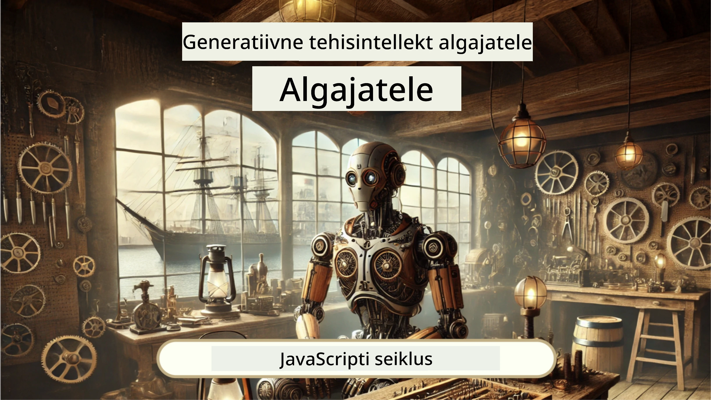
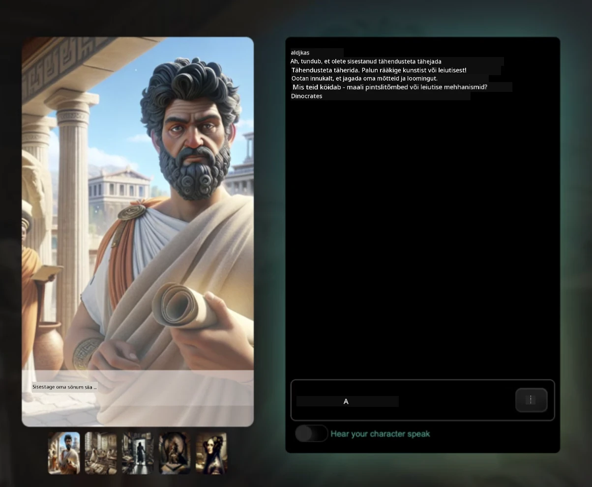
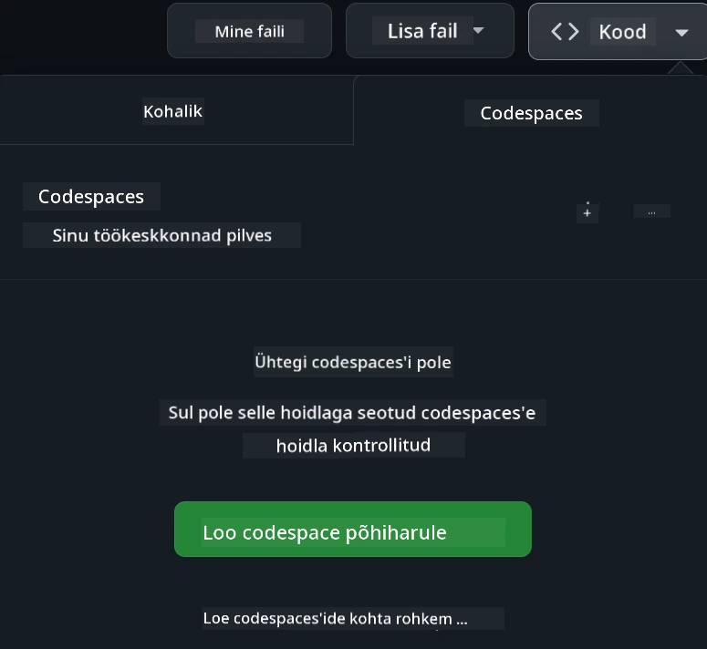

[](https://github.com/microsoft/Web-Dev-For-Beginners/blob/master/LICENSE)
[](https://GitHub.com/microsoft/Web-Dev-For-Beginners/graphs/contributors/)
[](https://GitHub.com/microsoft/Web-Dev-For-Beginners/issues/)
[](https://GitHub.com/microsoft/Web-Dev-For-Beginners/pulls/)
[](http://makeapullrequest.com) 

[](https://GitHub.com/microsoft/Web-Dev-For-Beginners/watchers/)
[](https://GitHub.com/microsoft/Web-Dev-For-Beginners/network/)
[](https://GitHub.com/microsoft/Web-Dev-For-Beginners/stargazers/)

[](https://discord.gg/nTYy5BXMWG)

# Veebiarendus algajatele - õppekava

Õppige veebiarenduse aluseid meie 12-nädalase põhjaliku kursusega, mida viivad läbi Microsoft Cloud Advocates. Iga 24 õppetundi süveneb JavaScripti, CSS-i ja HTML-i tundmaõppimisse praktiliste projektide kaudu, nagu terrariumid, brauserilaiendused ja kosmosemängud. Osalege viktoriinides, aruteludes ja praktilistes ülesannetes. Parandage oma oskusi ja optimeerige teadmiste omandamist meie tõhusa projektipõhise pedagoogika abil. Alustage oma programmeerimisteekonda juba täna!

Liituge Azure AI Foundry Discordi kogukonnaga

[](https://discord.gg/nTYy5BXMWG)

Järgige neid samme, et alustada nende ressursside kasutamist:
1. **Tehke fork**: Klõpsake [](https://GitHub.com/microsoft/Web-Dev-For-Beginners/fork)
2. **Kloonige hoidla**:   `git clone https://github.com/microsoft/Web-Dev-For-Beginners.git`
3. [**Liituge Azure AI Foundry Discordiga ja kohtuge ekspertide ning kaasarendajatega**](https://discord.com/invite/ByRwuEEgH4)

### 🌐 Mitmekeelse toe võimalus

#### Tugineb GitHub Actionile (automatiseeritud ja alati ajakohane)

<!-- CO-OP TRANSLATOR LANGUAGES TABLE START -->
[Arabic](../ar/README.md) | [Bengali](../bn/README.md) | [Bulgarian](../bg/README.md) | [Burmese (Myanmar)](../my/README.md) | [Chinese (Simplified)](../zh-CN/README.md) | [Chinese (Traditional, Hong Kong)](../zh-HK/README.md) | [Chinese (Traditional, Macau)](../zh-MO/README.md) | [Chinese (Traditional, Taiwan)](../zh-TW/README.md) | [Croatian](../hr/README.md) | [Czech](../cs/README.md) | [Danish](../da/README.md) | [Dutch](../nl/README.md) | [Estonian](./README.md) | [Finnish](../fi/README.md) | [French](../fr/README.md) | [German](../de/README.md) | [Greek](../el/README.md) | [Hebrew](../he/README.md) | [Hindi](../hi/README.md) | [Hungarian](../hu/README.md) | [Indonesian](../id/README.md) | [Italian](../it/README.md) | [Japanese](../ja/README.md) | [Kannada](../kn/README.md) | [Korean](../ko/README.md) | [Lithuanian](../lt/README.md) | [Malay](../ms/README.md) | [Malayalam](../ml/README.md) | [Marathi](../mr/README.md) | [Nepali](../ne/README.md) | [Nigerian Pidgin](../pcm/README.md) | [Norwegian](../no/README.md) | [Persian (Farsi)](../fa/README.md) | [Polish](../pl/README.md) | [Portuguese (Brazil)](../pt-BR/README.md) | [Portuguese (Portugal)](../pt-PT/README.md) | [Punjabi (Gurmukhi)](../pa/README.md) | [Romanian](../ro/README.md) | [Russian](../ru/README.md) | [Serbian (Cyrillic)](../sr/README.md) | [Slovak](../sk/README.md) | [Slovenian](../sl/README.md) | [Spanish](../es/README.md) | [Swahili](../sw/README.md) | [Swedish](../sv/README.md) | [Tagalog (Filipino)](../tl/README.md) | [Tamil](../ta/README.md) | [Telugu](../te/README.md) | [Thai](../th/README.md) | [Turkish](../tr/README.md) | [Ukrainian](../uk/README.md) | [Urdu](../ur/README.md) | [Vietnamese](../vi/README.md)

> **Eelistate kohalikku kloonimist?**
>
> See hoidla sisaldab üle 50 keele tõlget, mis suurendab allalaadimismahu oluliselt. Tõlgeteta kloonimiseks kasutage sparsel checkouti:
>
> **Bash / macOS / Linux:**
> ```bash
> git clone --filter=blob:none --sparse https://github.com/microsoft/Web-Dev-For-Beginners.git
> cd Web-Dev-For-Beginners
> git sparse-checkout set --no-cone '/*' '!translations' '!translated_images'
> ```
>
> **CMD (Windows):**
> ```cmd
> git clone --filter=blob:none --sparse https://github.com/microsoft/Web-Dev-For-Beginners.git
> cd Web-Dev-For-Beginners
> git sparse-checkout set --no-cone "/*" "!translations" "!translated_images"
> ```
>
> See annab teile kõik vajaliku kursuse läbimiseks palju kiirema allalaadimisega.
<!-- CO-OP TRANSLATOR LANGUAGES TABLE END -->

**Kui soovite lisada uusi toetatud tõlkekeeli, on need loetletud [siin](https://github.com/Azure/co-op-translator/blob/main/getting_started/supported-languages.md)**

[](https://open.vscode.dev/microsoft/Web-Dev-For-Beginners)

#### 🧑‍🎓 _Oled õpilane?_

Külasta [**Öpilaskeskuse lehte**](https://docs.microsoft.com/learn/student-hub/?WT.mc_id=academic-77807-sagibbon), kus leiad algajatele mõeldud ressursse, õpilaspakette ja isegi võimalusi saada tasuta sertifikaadikuponge. See on leht, mida soovid järjehoidjatesse lisada ja aeg-ajalt vaadata, sest sisu uuendatakse iga kuu.

### 📣 Teade - uued GitHub Copilot Agendi režiimi väljakutsed täitmiseks!

Uus väljakutse lisatud, otsi enamikes peatükkides "GitHub Copilot Agent Challenge 🚀". See on uus väljakutse teile, mida täita GitHub Copiloti ja agendi režiimi abil. Kui te ei ole varem agendi režiimi kasutanud, on see võimeline genereerima mitte ainult teksti, vaid ka looma ja redigeerima faile, käivitama käske ja muud.

### 📣 Teade - _uus projekt, mille saab luua Generatiivse AI abil_

Uus AI assistendi projekt on just lisatud, vaata projekti [siit](./9-chat-project/README.md)

### 📣 Teade - _Uus õppekava_ Generatiivse AI kohta JavaScriptile on just välja antud

Ära jää ilma meie uuest Generatiivse AI õppekavast!

Külasta [https://aka.ms/genai-js-course](https://aka.ms/genai-js-course) alustamiseks!



- Õppetunnid hõlmavad kõike alates algteadmistest kuni RAG-ini.
- Suhtle ajalooliste tegelastega GenAI ja meie kaaslase rakenduse abil.
- Lõbus ja kaasahaarav jutustus, kus sa rändad ajas!




Iga õppetund sisaldab täidetavat ülesannet, teadmiste kontrolli ja väljakutset, mis juhib õppimist teemadel nagu:
- Käsutamine ja käsu koostamine
- Teksti- ja pildirakenduste genereerimine
- Otsingurakendused

Külasta [https://aka.ms/genai-js-course](https://aka.ms/genai-js-course) alustamiseks!


## 🌱 Alustamine

> **Õpetajad**, oleme lisanud [mõningaid soovitusi](for-teachers.md), kuidas seda õppekava kasutada. Ootame teie tagasisidet [meie arutelufoorumis](https://github.com/microsoft/Web-Dev-For-Beginners/discussions/categories/teacher-corner)!

**[Õppijad](https://aka.ms/student-page/?WT.mc_id=academic-77807-sagibbon)**, iga õppetunni puhul alustage eel-loengu viktoriiniga ja jätkake õppetükiga, täites erinevaid tegevusi ja kontrollides arusaamist järel-loengu viktoriiniga.

Õppimiskogemuse parandamiseks ühenduge oma eakaaslastega, et koos projekte teha! Arutelud on julgustatud meie [arutelufoorumis](https://github.com/microsoft/Web-Dev-For-Beginners/discussions), kus meie moderaatorimeeskond vastab teie küsimustele.

Haridusteekonna süvendamiseks soovitame tungivalt uurida [Microsoft Learni](https://learn.microsoft.com/users/wirelesslife/collections/p1ddcy5jwy0jkm?WT.mc_id=academic-77807-sagibbon) täiendavaid õppematerjale.

### 📋 Keskkonna seadistamine

Sellel õppekaval on arenduskeskkond kohe kasutamiseks valmis! Alustades võite valida, kas kasutada õppekava [Codespaces](https://github.com/features/codespaces/) keskkonnas (_brauseripõhine, installimist mitte nõudev keskkond_) või oma arvutis lokaalselt tekstiredaktorit, näiteks [Visual Studio Code](https://code.visualstudio.com/?WT.mc_id=academic-77807-sagibbon).

#### Loo oma hoidla
Selleks, et oma tööd hõlpsasti salvestada, soovitame luua oma koopia sellest hoidlast. Seda saab teha, klõpsates lehe ülaosas nuppu **Use this template**. See loob uue hoidla teie GitHubi kontole koos õppekava koopiaga.

Järgige neid samme:
1. **Tehke fork**: Klõpsake selle lehe paremas ülanurgas nuppu "Fork".
2. **Kloonige hoidla**:   `git clone https://github.com/microsoft/Web-Dev-For-Beginners.git`

#### Õppekava käitamine Codespaces keskkonnas

Oma loodud hoidla koopias klõpsake nuppu **Code** ja valige **Open with Codespaces**. See loob teile uue Codespace'i, kus tööd teha.



#### Õppekava käitamine lokaalselt oma arvutis

Õppekava lokaalseks käivitamiseks vajate tekstiredaktorit, veebilehitsejat ja käsurea tööriista. Meie esimene õppetund, [Sissejuhatus programmeerimiskeeltesse ja tööriistadesse](../../1-getting-started-lessons/1-intro-to-programming-languages), juhendab teid erinevate võimaluste valikul iga tööriista jaoks.

Soovitame kasutada [Visual Studio Code'i](https://code.visualstudio.com/?WT.mc_id=academic-77807-sagibbon) redaktorina, millel on sisseehitatud [Terminal](https://code.visualstudio.com/docs/terminal/basics/?WT.mc_id=academic-77807-sagibbon). Visual Studio Code'i saate alla laadida [siit](https://code.visualstudio.com/?WT.mc_id=academic-77807-sagibbon).
1. Kopeeri oma hoidla arvutisse. Seda saad teha, klõpsates nuppu **Code** ning kopeerides URL-i:

    [CodeSpace](./images/createcodespace.png)

    Seejärel ava [Terminal](https://code.visualstudio.com/docs/terminal/basics/?WT.mc_id=academic-77807-sagibbon) [Visual Studio Code](https://code.visualstudio.com/?WT.mc_id=academic-77807-sagibbon) sees ning käivita järgmine käsk, asendades `<your-repository-url>` just äsja kopeeritud URL-iga:

    ```bash 
    git clone <your-repository-url>
    ```

2. Ava Visual Studio Code’is kaust. Seda saad teha, klõpsates **File** > **Open Folder** ning valides kausta, mille just kloonisid.


>  Soovitatud Visual Studio Code'i laiendused:
>
> * [Live Server](https://marketplace.visualstudio.com/items?itemName=ritwickdey.LiveServer&WT.mc_id=academic-77807-sagibbon) - HTML-lehtede eelvaade Visual Studio Code’is
> * [Copilot](https://marketplace.visualstudio.com/items?itemName=GitHub.copilot&WT.mc_id=academic-77807-sagibbon) - aitab kirjutada koodi kiiremini

## 📂 Iga õppetükk sisaldab:

- valikulist visandit
- valikulist täiendavat videot
- soojendusharjutust enne tundi
- kirjalikku õppetükki
- projektipõhiste õppetükkide puhul samm-sammulisi juhendeid, kuidas projekti ehitada
- teadmiste kontrolli küsimustikke
- väljakutset
- täiendavat lugemist
- ülesannet
- [pärastundi viktoriini](https://ff-quizzes.netlify.app/web/)

> **Märkus viktoriinide kohta**: Kõik viktoriinid asuvad Quiz-app kaustas, kokku 48 viktoriini, milles igas on kolm küsimust. Need on kättesaadavad [siin](https://ff-quizzes.netlify.app/web/). Viktoriini rakendus saab käivitada lokaalselt või paigaldada Azure’i; järgige juhiseid `quiz-app` kaustas.

## 🗃️ Õppetükid

|     |                       Projekti nimi                       |                            Õpitavad kontseptsioonid                             | Õpieesmärgid                                                                                                                 |                                                         Seotud õppetükk                                                          |         Autor          |
| :-: | :-------------------------------------------------------: | :--------------------------------------------------------------------: | ----------------------------------------------------------------------------------------------------------------------------------- | :----------------------------------------------------------------------------------------------------------------------------: | :---------------------: |
| 01  |                     Alustamine                      |           Sissejuhatus programmeerimisse ja tööriistadesse           | Õpi programmeerimiskeelte põhialuseid ja tarkvara, mis aitab professionaalsel arendajal tööd teha                                  | [Sissejuhatus programmeerimiskeeltesse ja tööriistadesse](./1-getting-started-lessons/1-intro-to-programming-languages/README.md) |         Jasmine         |
| 02  |                     Alustamine                      |             GitHub põhialused, sh meeskonnatöö             | Kuidas kasutada GitHubi projektis ja kuidas meeskonnana koodil koos töötada                                                    |                            [Sissejuhatus GitHubi](./1-getting-started-lessons/2-github-basics/README.md)                             |          Floor          |
| 03  |                     Alustamine                      |                             Juurdepääsetavus                              | Õpi veebipõhise juurdepääsetavuse aluseid                                                                                               |                       [Juurdepääsetavuse alused](./1-getting-started-lessons/3-accessibility/README.md)                       |       Christopher       |
| 04  |                        JS põhitõed                         |                         JavaScripti andmetüübid                          | JavaScripti andmetüüpide põhialused                                                                                                 |                                       [Andmetüübid](./2-js-basics/1-data-types/README.md)                                        |         Jasmine         |
| 05  |                        JS põhitõed                         |                         Funktsioonid ja meetodid                          | Õpi funktsioonidest ja meetoditest rakenduse loogika juhtimisel                                                             |                              [Funktsioonid ja meetodid](./2-js-basics/2-functions-methods/README.md)                               | Jasmine ja Christopher |
| 06  |                        JS põhitõed                         |                        Otsuste tegemine JS-ga                        | Õpi, kuidas luua tingimusi oma koodis otsustuste tegemise meetodite abil                                                           |                                 [Otsuste tegemine](./2-js-basics/3-making-decisions/README.md)                                  |         Jasmine         |
| 07  |                        JS põhitõed                         |                            Massiivid ja tsüklid                            | Töötle andmeid JavaScripti massiivide ja tsüklite abil                                                                                 |                                   [Massiivid ja tsüklid](./2-js-basics/4-arrays-loops/README.md)                                    |         Jasmine         |
| 08  |       [Terrarium](./3-terrarium/solution/README.md)       |                            HTML praktikas                            | Ehita HTML, et luua veebipõhine terrarium, keskendudes paigutuse loomisele                                                         |                                 [Sissejuhatus HTML-i](./3-terrarium/1-intro-to-html/README.md)                                 |           Jen           |
| 09  |       [Terrarium](./3-terrarium/solution/README.md)       |                            CSS praktikas                             | Ehita CSS veebiterrariumi kujundamiseks, keskendudes CSS põhialustele ja lehe reageerivusele                     |                                  [Sissejuhatus CSS-i](./3-terrarium/2-intro-to-css/README.md)                                  |           Jen           |
| 10  |            [Terrarium](./3-terrarium/solution/README.md)            |                 JavaScripti sulgemised, DOM-i manipuleerimine                  | Ehita JavaScript, mis muudab terrariumi lohistatavaks kasutajaliideseks, keskendudes sulgemistele ja DOM-i manipuleerimisele             |                  [JavaScript sulgemised ja DOM-i manipuleerimine](./3-terrarium/3-intro-to-DOM-and-closures/README.md)                   |           Jen           |
| 11  |          [Tippimismäng](./4-typing-game/solution/README.md)          |                          Tippimismängu loomine                           | Õpi kasutama klaviatuuri sündmusi, et juhtida oma JavaScripti rakenduse loogikat                                                          |                                [Sündmuspõhine programmeerimine](./4-typing-game/typing-game/README.md)                                |       Christopher       |
| 12  | [Roheline brauserilaiend](./5-browser-extension/solution/README.md) |                         Brauseritega töötamine                          | Õpi, kuidas brauserid töötavad, nende ajalugu ja kuidas luua brauserilaiendi esimesed elemendid                               |                               [Brauserite kohta](./5-browser-extension/1-about-browsers/README.md)                                |           Jen           |
| 13  | [Roheline brauserilaiend](./5-browser-extension/solution/README.md) | Vormide loomine, API kutsumine ja muutujate salvestamine lokaalsesse mällu | Ehita brauserilaiendi JavaScripti osad API kutsumiseks, kasutades lokaalsesse mällu salvestatud muutujaid                      |                [API-d, vormid ja lokaalne mälu](./5-browser-extension/2-forms-browsers-local-storage/README.md)                 |           Jen           |
| 14  | [Roheline brauserilaiend](./5-browser-extension/solution/README.md) |          Taustaprotsessid brauseris, veebitööjõudlus          | Kasuta brauseri taustaprotsesse laiendi ikooni juhtimiseks; õpi veebitööjõudlusest ja mõningatest optimeerimistest                  |             [Taustaprotsessid ja tööjõudlus](./5-browser-extension/3-background-tasks-and-performance/README.md)              |           Jen           |
| 15  |           [Kosmosemäng](./6-space-game/solution/README.md)           |             Täiustatud mänguarendus JavaScriptiga             | Õpi pärandamise kohta klasside ja koostise kaudu ning Pub/Sub mustrit, ettevalmistuseks mängu loomiseks              |                      [Täiustatud mänguarenduse sissejuhatus](./6-space-game/1-introduction/README.md)                       |          Chris          |
| 16  |           [Kosmosemäng](./6-space-game/solution/README.md)           |                           Joonistamine lõuendile                           | Õpi Canvas API kasutamist ekraanile elementide joonistamiseks                                                                       |                                [Joonistamine lõuendile](./6-space-game/2-drawing-to-canvas/README.md)                                |          Chris          |
| 17  |           [Kosmosemäng](./6-space-game/solution/README.md)           |                   Elementide liigutamine ekraanil                       | Avastage, kuidas elementidele anda liikumist kasutades kaarteesia koordinaate ja Canvas API-d                                            |                           [Elementide liigutamine](./6-space-game/3-moving-elements-around/README.md)                           |          Chris          |
| 18  |           [Kosmosemäng](./6-space-game/solution/README.md)           |                          Kokkupõrke tuvastamine                           | Tee elementide kokkupõrked ja reageerimine kasutades klahvivajutusi ning lisa jahutusfunktsioon, mis tagab mängu sujuvuse    |                              [Kokkupõrke tuvastamine](./6-space-game/4-collision-detection/README.md)                              |          Chris          |
| 19  |           [Kosmosemäng](./6-space-game/solution/README.md)           |                             Skoriga arvestamine                              | Tee matemaatilisi arvutusi mängu staatuse ja jõudluse alusel                                                                |                                    [Skoori pidamine](./6-space-game/5-keeping-score/README.md)                                    |          Chris          |
| 20  |           [Kosmosemäng](./6-space-game/solution/README.md)           |                     Mängu lõpetamine ja taaskäivitamine                     | Õpi mängu lõpetamise ja taaskäivitamise kohta, sh ressursside puhastamine ja muutuja väärtuste lähtestamine                              |                                [Lõputingimus](./6-space-game/6-end-condition/README.md)                                 |          Chris          |
| 21  |         [Pangarakendus](./7-bank-project/solution/README.md)          |                 HTML mallid ja marsruudid veebirakenduses                 | Õpi, kuidas luua mitmeleheküljelise veebilehe arhitektuuri tugistruktuur marsruutimise ja HTML mallide abil                             |                            [HTML mallid ja marsruudid](./7-bank-project/1-template-route/README.md)                             |          Yohan          |
| 22  |         [Pangarakendus](./7-bank-project/solution/README.md)          |                  Logimise ja registreerimise vormi loomine                   | Õpi vormide loomist ja valideerimise teostamist                                                                           |                                           [Vormid](./7-bank-project/2-forms/README.md)                                           |          Yohan          |
| 23  |         [Pangarakendus](./7-bank-project/solution/README.md)          |                   Andmete pärimise ja kasutamise meetodid                   | Kuidas andmed voolavad sinu rakendusse ja sealt välja, kuidas neid pärida, salvestada ja eemaldada                                                 |                                            [Andmed](./7-bank-project/3-data/README.md)                                            |          Yohan          |
| 24  |         [Pangarakendus](./7-bank-project/solution/README.md)          |                      Seisundihalduse kontseptsioonid                      | Õpi, kuidas sinu rakendus säilitab seisundit ja kuidas seda programmeeritult hallata                                                              |                                [Seisundihaldus](./7-bank-project/4-state-management/README.md)                                |          Yohan          |
| 25 | [Brauser/VScode Kood](../../8-code-editor) | Töötamine VScode'iga | Õpi, kuidas kasutada koodiredaktorit| [Kasuta VScode koodiredaktorit](./8-code-editor/1-using-a-code-editor/README.md) | Chris |
| 26 | [Tehisintellekti assistendid](./9-chat-project/README.md) | Töötamine tehisintellektiga | Õpi, kuidas ehitada oma tehisintellekti assistent | [Tehisintellekti assistendi projekt](./9-chat-project/README.md) | Chris |

## 🏫 Pedagoogika

Meie õppekava on kavandatud kahe peamise pedagoogilise põhimõtte järgi:
* projektipõhine õpe
* sagedased viktoriinid

Programm õpetab JavaScripti, HTML-i ja CSS-i põhialuseid ning uusimaid tööriistu ja tehnikaid, mida kasutavad tänapäeva veebiarendajad. Õpilastel on võimalus praktiliselt kogeda, ehitades tippimismängu, virtuaalse terrariumi, keskkonnasõbraliku brauserilaiendi, kosmose-invader stiilis mängu ja pangarakenduse ettevõtetele. Perioodi lõpuks omandavad õpilased tugeva arusaama veebiarendusest.

> 🎓 Võid esimesed paar õppetükki sellest õppekavast läbida ka [Õppeteekina](https://docs.microsoft.com/learn/paths/web-development-101/?WT.mc_id=academic-77807-sagibbon) Microsoft Learn platvormil!

Sisule vastavate projektide abil tehakse õppimisprotsess kaasahaaravamaks ning mõistete meeldejätmine paraneb. Kirjutasime ka mitu algõpetust JavaScripti põhialuste kohta, tutvustamaks mõisteid koos videoga "[Algajate sari: JavaScript](https://channel9.msdn.com/Series/Beginners-Series-to-JavaScript/?WT.mc_id=academic-77807-sagibbon)", mille mõned autorid panustasid sellesse õppekavasse.

Lisaks seab klassieelse lihtsalt stressivaba viktoriiniga õpilase eesmärgi konkreetse teema õppimiseks, ning teine viktoriin klassijärgsel ajal tagab teadmiste edasi kinnistamise. See õppekava on loodud olema paindlik ja lõbus ning seda saab läbida tervikuna või osaliselt. Projektid alustavad väikestest ja muutuvad 12-nädalase tsükli jooksul järjest keerukamaks.

Kuigi oleme teadlikult hoidunud JavaScripti raamistikest, et keskenduda esmalt vajalikele oskustele veebiarendajana enne raamistikku omaksvõttu, võiks järgmine samm selle õppekava lõpetamisel olla Node.js õppimine teise videosarja kaudu: "[Algajate sari: Node.js](https://channel9.msdn.com/Series/Beginners-Series-to-Nodejs/?WT.mc_id=academic-77807-sagibbon)".

> Vaata meie [käitumisreegleid](CODE_OF_CONDUCT.md) ja [panustamise juhiseid](CONTRIBUTING.md). Oleme avatud konstruktiivsele tagasisidele!


## 🧭 Võimalus töötada offline

Seda dokumentatsiooni saad kasutada offline režiimis, kasutades [Docsify](https://docsify.js.org/#/). Hargne see hoidla, [paigalda Docsify](https://docsify.js.org/#/quickstart) oma arvutisse ja seejärel käivita hoidla juurkataloogis käsk `docsify serve`. Veebileht on kättesaadav aadressil `localhost:3000` pordil 3000.

## 📘 PDF
Kõigi õppetundide PDF-versiooni leiate siit [here](https://microsoft.github.io/Web-Dev-For-Beginners/pdf/readme.pdf).


## 🎒 Teised kursused

Meie meeskond toodab ka teisi kursusi! Vaadake:

<!-- CO-OP TRANSLATOR OTHER COURSES START -->
### LangChain
[](https://aka.ms/langchain4j-for-beginners)
[](https://aka.ms/langchainjs-for-beginners?WT.mc_id=m365-94501-dwahlin)
[](https://github.com/microsoft/langchain-for-beginners?WT.mc_id=m365-94501-dwahlin)
---

### Azure / Edge / MCP / Agendid
[](https://github.com/microsoft/AZD-for-beginners?WT.mc_id=academic-105485-koreyst)
[](https://github.com/microsoft/edgeai-for-beginners?WT.mc_id=academic-105485-koreyst)
[](https://github.com/microsoft/mcp-for-beginners?WT.mc_id=academic-105485-koreyst)
[](https://github.com/microsoft/ai-agents-for-beginners?WT.mc_id=academic-105485-koreyst)

---
 
### Generatiivse tehisintellekti seeria
[](https://github.com/microsoft/generative-ai-for-beginners?WT.mc_id=academic-105485-koreyst)
[-9333EA?style=for-the-badge&labelColor=E5E7EB&color=9333EA)](https://github.com/microsoft/Generative-AI-for-beginners-dotnet?WT.mc_id=academic-105485-koreyst)
[-C084FC?style=for-the-badge&labelColor=E5E7EB&color=C084FC)](https://github.com/microsoft/generative-ai-for-beginners-java?WT.mc_id=academic-105485-koreyst)
[-E879F9?style=for-the-badge&labelColor=E5E7EB&color=E879F9)](https://github.com/microsoft/generative-ai-with-javascript?WT.mc_id=academic-105485-koreyst)

---
 
### Põhiline õppimine
[](https://aka.ms/ml-beginners?WT.mc_id=academic-105485-koreyst)
[](https://aka.ms/datascience-beginners?WT.mc_id=academic-105485-koreyst)
[](https://aka.ms/ai-beginners?WT.mc_id=academic-105485-koreyst)
[](https://github.com/microsoft/Security-101?WT.mc_id=academic-96948-sayoung)
[](https://aka.ms/webdev-beginners?WT.mc_id=academic-105485-koreyst)
[](https://aka.ms/iot-beginners?WT.mc_id=academic-105485-koreyst)
[](https://github.com/microsoft/xr-development-for-beginners?WT.mc_id=academic-105485-koreyst)

---
 
### Copiloti seeria
[](https://aka.ms/GitHubCopilotAI?WT.mc_id=academic-105485-koreyst)
[](https://github.com/microsoft/mastering-github-copilot-for-dotnet-csharp-developers?WT.mc_id=academic-105485-koreyst)
[](https://github.com/microsoft/CopilotAdventures?WT.mc_id=academic-105485-koreyst)
<!-- CO-OP TRANSLATOR OTHER COURSES END -->

## Abi saamine

Kui teil tekib takistusi või küsimusi AI-rakenduste loomisel, liituge teiste õppijate ja kogenud arendajatega aruteludes MCP kohta. See on toetav kogukond, kus küsimused on teretulnud ja teadmisi jagatakse vabalt.

[](https://discord.gg/nTYy5BXMWG)

Kui teil on toodete kohta tagasisidet või ehitamise ajal ilmnevad vead, külastage:

[](https://aka.ms/foundry/forum)

## Litsents

See hoidla on litsentseeritud MIT litsentsi all. Lisateabe saamiseks vaadake faili [LICENSE](../../LICENSE).

---

<!-- CO-OP TRANSLATOR DISCLAIMER START -->
**Vastutusest loobumine**:  
See dokument on tõlgitud kasutades tehisintellekti tõlketeenust [Co-op Translator](https://github.com/Azure/co-op-translator). Kuigi püüame tagada täpsust, palun pidage meeles, et automaatsed tõlked võivad sisaldada vigu või ebatäpsusi. Originaaldokument selle algkeeles tuleks pidada autoriteetseks allikaks. Kriitilise informatsiooni puhul soovitatakse kasutada professionaalset inimtõlget. Me ei vastuta ühegi arusaamatuse ega valesti mõistmise eest, mis võib tuleneda sellest tõlkest.
<!-- CO-OP TRANSLATOR DISCLAIMER END -->