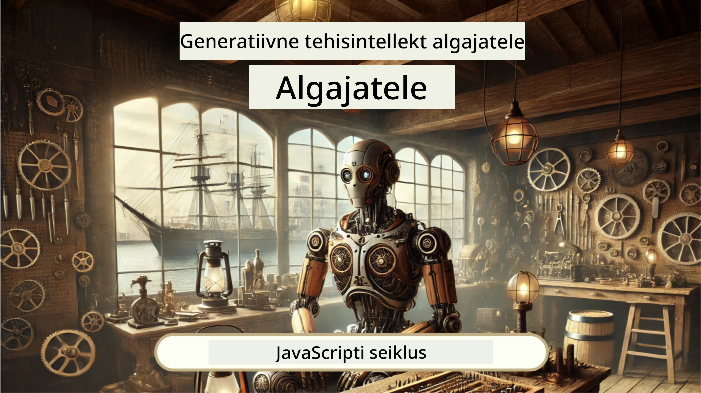
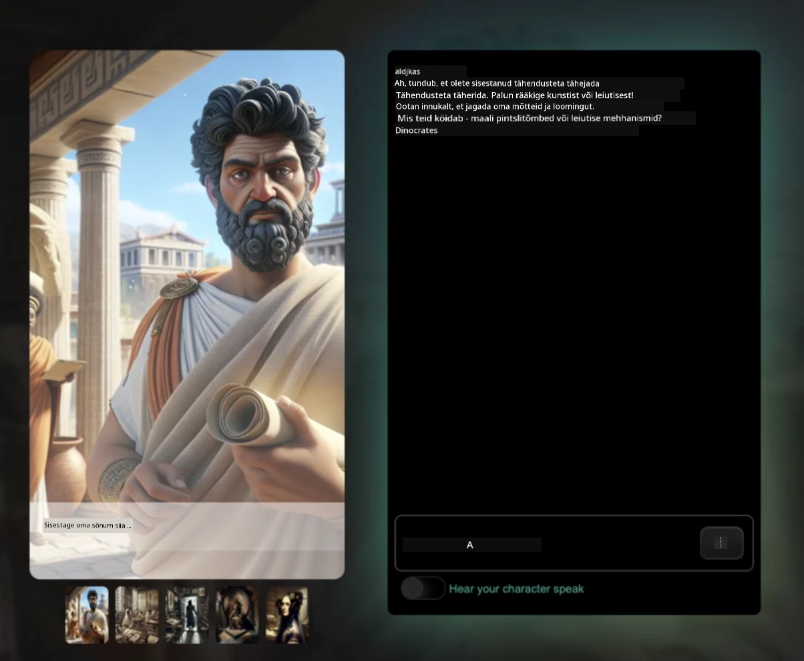
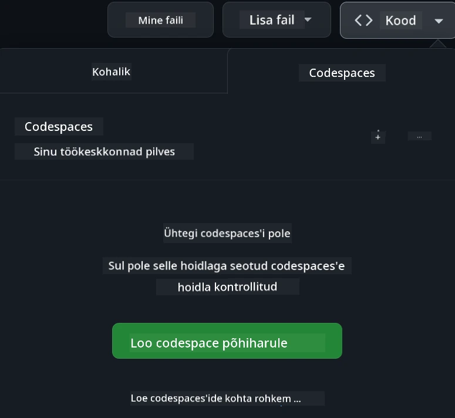

[](https://github.com/microsoft/Web-Dev-For-Beginners/blob/master/LICENSE)
[](https://GitHub.com/microsoft/Web-Dev-For-Beginners/graphs/contributors/)
[](https://GitHub.com/microsoft/Web-Dev-For-Beginners/issues/)
[](https://GitHub.com/microsoft/Web-Dev-For-Beginners/pulls/)
[](http://makeapullrequest.com) 

[](https://GitHub.com/microsoft/Web-Dev-For-Beginners/watchers/)
[](https://GitHub.com/microsoft/Web-Dev-For-Beginners/network/)
[](https://GitHub.com/microsoft/Web-Dev-For-Beginners/stargazers/)

[](https://discord.gg/nTYy5BXMWG)

# Veebiarendus algajatele – õppematerjal

Õpi veebiarenduse põhitõdesid meie 12-nädalase põhjaliku kursusega, mille on koostanud Microsoft Cloud Advocates. Iga 24-st õppetunnist süüvib JavaScripti, CSS-i ja HTML-i käsipõhiste projektide kaudu, näiteks terrariumid, brauserilaiendid ja kosmosemängud. Osale viktoriinides, aruteludes ja praktilistes ülesannetes. Paranda oma oskusi ja loo teadmiste paremat kinnistamist tõhusa projektipõhise õpetamismeetodi abil. Alusta oma kodeerimisteekonda juba täna!

Liitu Azure AI Foundry Discordiga ja kohtle eksperte ning kaasprogrammeerejaid.

[](https://discord.gg/nTYy5BXMWG)

Järgige neid samme, et alustada nende ressursside kasutamist:
1. **Tee hoidlast oma versioon (fork)**: Vajuta [](https://GitHub.com/microsoft/Web-Dev-For-Beginners/fork)
2. **Klooni hoidla**:   `git clone https://github.com/microsoft/Web-Dev-For-Beginners.git`
3. [**Liitu Azure AI Foundry Discordiga ja kohtle eksperte ning kaasprogrammeerejaid**](https://discord.com/invite/ByRwuEEgH4)

### 🌐 Mitmekeelne tugi

#### Toetatud GitHub Actioni kaudu (automaatne ja alati ajakohane)

<!-- CO-OP TRANSLATOR LANGUAGES TABLE START -->
[Arabic](../ar/README.md) | [Bengali](../bn/README.md) | [Bulgarian](../bg/README.md) | [Burmese (Myanmar)](../my/README.md) | [Chinese (Simplified)](../zh-CN/README.md) | [Chinese (Traditional, Hong Kong)](../zh-HK/README.md) | [Chinese (Traditional, Macau)](../zh-MO/README.md) | [Chinese (Traditional, Taiwan)](../zh-TW/README.md) | [Croatian](../hr/README.md) | [Czech](../cs/README.md) | [Danish](../da/README.md) | [Dutch](../nl/README.md) | [Estonian](./README.md) | [Finnish](../fi/README.md) | [French](../fr/README.md) | [German](../de/README.md) | [Greek](../el/README.md) | [Hebrew](../he/README.md) | [Hindi](../hi/README.md) | [Hungarian](../hu/README.md) | [Indonesian](../id/README.md) | [Italian](../it/README.md) | [Japanese](../ja/README.md) | [Kannada](../kn/README.md) | [Khmer](../km/README.md) | [Korean](../ko/README.md) | [Lithuanian](../lt/README.md) | [Malay](../ms/README.md) | [Malayalam](../ml/README.md) | [Marathi](../mr/README.md) | [Nepali](../ne/README.md) | [Nigerian Pidgin](../pcm/README.md) | [Norwegian](../no/README.md) | [Persian (Farsi)](../fa/README.md) | [Polish](../pl/README.md) | [Portuguese (Brazil)](../pt-BR/README.md) | [Portuguese (Portugal)](../pt-PT/README.md) | [Punjabi (Gurmukhi)](../pa/README.md) | [Romanian](../ro/README.md) | [Russian](../ru/README.md) | [Serbian (Cyrillic)](../sr/README.md) | [Slovak](../sk/README.md) | [Slovenian](../sl/README.md) | [Spanish](../es/README.md) | [Swahili](../sw/README.md) | [Swedish](../sv/README.md) | [Tagalog (Filipino)](../tl/README.md) | [Tamil](../ta/README.md) | [Telugu](../te/README.md) | [Thai](../th/README.md) | [Turkish](../tr/README.md) | [Ukrainian](../uk/README.md) | [Urdu](../ur/README.md) | [Vietnamese](../vi/README.md)

> **Eelistad kloonimist kohapeal?**
>
> See hoidla sisaldab üle 50 keele tõlkeid, mis suurendab oluliselt allalaadimismahtu. Kui soovid kloonida ilma tõlgeteta, kasuta sparse checkouti:
>
> **Bash / macOS / Linux:**
> ```bash
> git clone --filter=blob:none --sparse https://github.com/microsoft/Web-Dev-For-Beginners.git
> cd Web-Dev-For-Beginners
> git sparse-checkout set --no-cone '/*' '!translations' '!translated_images'
> ```
>
> **CMD (Windows):**
> ```cmd
> git clone --filter=blob:none --sparse https://github.com/microsoft/Web-Dev-For-Beginners.git
> cd Web-Dev-For-Beginners
> git sparse-checkout set --no-cone "/*" "!translations" "!translated_images"
> ```
>
> See annab sulle kõik vajaliku, et kursuse lõpetada palju kiirema allalaadimisega.
<!-- CO-OP TRANSLATOR LANGUAGES TABLE END -->

**Kui soovid lisatõlkeid, siis toetatud keeled on loetletud siin. [siin](https://github.com/Azure/co-op-translator/blob/main/getting_started/supported-languages.md)**

[](https://open.vscode.dev/microsoft/Web-Dev-For-Beginners)

#### 🧑‍🎓 _Oled tudeng?_

Külasta [**Student Hub lehekülge**](https://docs.microsoft.com/learn/student-hub/?WT.mc_id=academic-77807-sagibbon), kus leiad algajale mõeldud ressursse, tudengipakette ja isegi võimalusi saada tasuta tunnistuse vautšer. See on lehekülg, mida tasub järjehoidjates hoida ja aeg-ajalt kontrollida, sest sisu uuendatakse igakuiselt.

### 📣 Teade – Uued väljakutsed GitHub Copilot Agent režiimis!

Lisandunud on uus väljakutse, otsi enamikust peatükkidest "GitHub Copilot Agent Challenge 🚀". See on uus väljakutse, mille saad lahendada GitHub Copiloti ja Agendi režiimis. Kui sa pole Agendi režiimi varem kasutanud, siis see suudab mitte ainult teksti genereerida, vaid ka luua ja muuta faile, käivitada käske ja palju muud.

### 📣 Teade – _uus projekt generatiivse tehisintellekti abil arendamiseks_

Täiesti uus AI assistendi projekt lisatud, vaata [projekti](./9-chat-project/README.md)

### 📣 Teade – _uus õppekava_ generatiivsele tehisintellektile JavaScripti jaoks avaldatud

Ära jäta tähelepanuta meie uut generatiivse tehisintellekti õppekava!

Alusta siin: [https://aka.ms/genai-js-course](https://aka.ms/genai-js-course)



- Õppetunnid katavad kõike alates algtõdedest kuni RAG-ini.
- Suhtle ajalooliste tegelastega GenAI ja meie kaasrakenduse abil.
- Lõbus ja kaasahaarav jutustus, mis viib sind ajas rändama!



Iga õppetund sisaldab lõpetamiseks ülesannet, teadmiste kontrolli ja väljakutset, mis juhendab teemasid nagu:
- Päringud ja päringu inseneriteadus
- Teksti- ja pildirakenduste genereerimine
- Otsingurakendused

Alusta siin: [https://aka.ms/genai-js-course](https://aka.ms/genai-js-course)


## 🌱 Alustamine

> **Õpetajad**, me oleme lisanud [mõned soovitused](for-teachers.md) selle õppekava kasutamiseks. Ootame teie tagasisidet [meie aruteluvõrgustikus](https://github.com/microsoft/Web-Dev-For-Beginners/discussions/categories/teacher-corner)!

**[Õppijad](https://aka.ms/student-page/?WT.mc_id=academic-77807-sagibbon)**, iga õppetunni puhul alusta eelloenguviktoriinist ja jätka loengumaterjalide lugemisega, erinevate tegevuste lõpetamisega ning testi oma arusaamist järelloengu viktoriiniga.

Õppimise rikastamiseks seo end eakaaslastega, et töötada projektide kallal koos! Arutelud on soovitatavad meie [arutelufoorumis](https://github.com/microsoft/Web-Dev-For-Beginners/discussions), kus meie moderaatorid aitavad sul küsimustele vastuseid leida.

Edasise hariduse jaoks soovitame tungivalt uurida [Microsoft Learn’i](https://learn.microsoft.com/users/wirelesslife/collections/p1ddcy5jwy0jkm?WT.mc_id=academic-77807-sagibbon) lisamaterjale.

### 📋 Keskkonna seadistamine

See õppekava on varustatud arenduskeskkonnaga, mis on kohe kasutusvalmis! Alguses saad otsustada, kas jooksutad õppekava [Codespaces’is](https://github.com/features/codespaces/) (_brauseripõhine, ilma paigaldusteta keskkond_) või kohapeal oma arvutis tekstiredaktori nagu [Visual Studio Code](https://code.visualstudio.com/?WT.mc_id=academic-77807-sagibbon) abil.

#### Loo oma hoidla
Selleks, et saaksid oma tööd mugavalt salvestada, soovitame teha sellest hoidlast oma koopia. Seda saad teha, klikkides lehe ülaosas **Use this template** nupule. See loob sinu GitHubi kontole uue hoidla koos selle õppekava koopiaga.

Järgi järgmisi samme:
1. **Tee hoidlast oma versioon (fork)**: Vajuta nupule "Fork" selle lehe paremas ülanurgas.
2. **Klooni hoidla**:   `git clone https://github.com/microsoft/Web-Dev-For-Beginners.git`

#### Õppekava jooksutamine Codespaces’is

Loetud hoidlas, mille lõid, kliki nupul **Code** ja vali **Open with Codespaces**. See loob uue Codespace’i, kus saad töötada.



#### Õppekava jooksutamine kohalikus arvutis

Selle õppekava kohalikuks jooksutamiseks vajad tekstiredaktorit, veebibrauserit ja käsurea tööriista. Meie esimene õppetund, [Sissejuhatus programmeerimiskeeltesse ja tööriistadesse](../../1-getting-started-lessons/1-intro-to-programming-languages), juhatab sind nende tööriistade erinevate valikuvõimalusteni, et saaksid valida enda jaoks sobivaima.

Soovitame kasutada [Visual Studio Code’i](https://code.visualstudio.com/?WT.mc_id=academic-77807-sagibbon) tekstiredaktorina, mis sisaldab ka integreeritud [terminali](https://code.visualstudio.com/docs/terminal/basics/?WT.mc_id=academic-77807-sagibbon). Visual Studio Code’i saad alla laadida [siit](https://code.visualstudio.com/?WT.mc_id=academic-77807-sagibbon).
1. Kopeeri oma hoidla oma arvutisse. Seda saad teha, klõpsates nuppu **Code** ja kopeerides URL-i:

    [CodeSpace](./images/createcodespace.png)

    Seejärel ava [Terminal](https://code.visualstudio.com/docs/terminal/basics/?WT.mc_id=academic-77807-sagibbon) [Visual Studio Code](https://code.visualstudio.com/?WT.mc_id=academic-77807-sagibbon) sees ja käivita järgmine käsk, asendades `<your-repository-url>` äsja kopeeritud URL-iga:

    ```bash 
    git clone <your-repository-url>
    ```

2. Ava kaust Visual Studio Code'is. Seda saad teha, valides **File** > **Open Folder** ja valides äsja kloonitud kausta.


>  Soovitatud Visual Studio Code laiendused:
>
> * [Live Server](https://marketplace.visualstudio.com/items?itemName=ritwickdey.LiveServer&WT.mc_id=academic-77807-sagibbon) - HTML-lehtede eelvaate jaoks Visual Studio Code'is
> * [Copilot](https://marketplace.visualstudio.com/items?itemName=GitHub.copilot&WT.mc_id=academic-77807-sagibbon) - aitab sul koodi kiiremini kirjutada

## 📂 Igas õppetükis sisaldub:

- valikuline sketšimärkme
- valikuline täiendav video
- soojenduskvizz enne tundi
- kirjalik õppetükk
- projektipõhiste õppetükkide korral samm-sammulised juhised projekti loomiseks
- teadmiste kontrollid
- väljakutse
- täiendav lugemine
- ülesanne
- [järgnev kvizz](https://ff-quizzes.netlify.app/web/)

> **Märkuse kvizzide kohta**: Kõik kvizzid on Quiz-app kaustas, kokku 48 kvizzi, igaühes kolm küsimust. Need on saadaval [siin](https://ff-quizzes.netlify.app/web/), kvizzi rakendust saab käivitada lokaalselt või paigutada Azure'i; jälgi juhiseid `quiz-app` kaustas.

## 🗃️ Õppetükid

|     |                       Projekti nimi                        |                            Õpitud kontseptsioonid                            | Õpieesmärgid                                                                                                                     |                                                         Lingitud õppetükk                                                          |         Autor           |
| :-: | :-------------------------------------------------------: | :-------------------------------------------------------------------------: | -------------------------------------------------------------------------------------------------------------------------------- | :------------------------------------------------------------------------------------------------------------------------------: | :---------------------: |
| 01  |                     Esimesed sammud                       |           Programmeerimise ja tööriistade tutvustus                          | Õpi programmeerimiskeelte põhitõdesid ja tarkvara, mis aitab professionaalseid arendajaid                                             | [Programmeerimiskeelte ja tööriistade tutvustus](./1-getting-started-lessons/1-intro-to-programming-languages/README.md)          |         Jasmine         |
| 02  |                     Esimesed sammud                       |             GitHub'i alused, meeskonnatöö                                   | Kuidas kasutada GitHubi oma projektis ja teha koostööd koodibaasil                                                               |                            [GitHubi sissejuhatus](./1-getting-started-lessons/2-github-basics/README.md)                           |          Floor          |
| 03  |                     Esimesed sammud                       |                             Juurdepääsetavus                                | Õpi veebipõhise juurdepääsetavuse põhialuseid                                                                                      |                       [Juurdepääsetavuse alused](./1-getting-started-lessons/3-accessibility/README.md)                            |       Christopher       |
| 04  |                        JS alused                          |                         JavaScript andmetüübid                             | JavaScripti andmetüüpide põhitõed                                                                                                 |                                       [Andmetüübid](./2-js-basics/1-data-types/README.md)                                         |         Jasmine         |
| 05  |                        JS alused                          |                         Funktsioonid ja meetodid                           | Õpi funktsioone ja meetodeid rakenduse loogika juhtimiseks                                                                         |                              [Funktsioonid ja meetodid](./2-js-basics/2-functions-methods/README.md)                               | Jasmine ja Christopher  |
| 06  |                        JS alused                          |                        Otsuste tegemine JavaScriptiga                      | Õpi, kuidas luua tingimusi oma koodis otsustamise abil                                                                             |                                 [Otsuste tegemine](./2-js-basics/3-making-decisions/README.md)                                   |         Jasmine         |
| 07  |                        JS alused                          |                            Massiivid ja tsüklid                            | Töötle andmeid massiivide ja tsüklite abil JavaScriptis                                                                            |                                   [Massiivid ja tsüklid](./2-js-basics/4-arrays-loops/README.md)                                  |         Jasmine         |
| 08  |       [Terrarium](./3-terrarium/solution/README.md)       |                            HTML praktikas                                  | Ehita HTML, et luua veebipõhine terrarium, keskendudes paigutuse loomisele                                                         |                                 [HTML sissejuhatus](./3-terrarium/1-intro-to-html/README.md)                                     |           Jen           |
| 09  |       [Terrarium](./3-terrarium/solution/README.md)       |                            CSS praktikas                                   | Ehita CSS, et kujundada veebiterrarium, keskendudes CSS põhialustele ja lehe kohandamisele                                           |                                  [CSS sissejuhatus](./3-terrarium/2-intro-to-css/README.md)                                    |           Jen           |
| 10  |            [Terrarium](./3-terrarium/solution/README.md)            |                 JavaScripti sulgud, DOM-i manipuleerimine                  | Tee terrarium funktsionaalseks lohistamisliidese abil, keskendudes sulgude ja DOM-i manipuleerimise õppimisele                     |                  [JavaScripti sulgud, DOM-i manipuleerimine](./3-terrarium/3-intro-to-DOM-and-closures/README.md)                |           Jen           |
| 11  |          [Trükkimismäng](./4-typing-game/solution/README.md)          |                          Trükkimismängu loomine                            | Õpi kasutama klaviatuuri sündmusi oma JavaScripti rakenduse loogika juhtimiseks                                                      |                                [Sündmuspõhine programmeerimine](./4-typing-game/typing-game/README.md)                            |       Christopher       |
| 12  | [Roheline brauserilaiend](./5-browser-extension/solution/README.md) |                         Brauseritega töötamine                            | Õpi, kuidas brauserid töötavad, nende ajalugu ja kuidas üles ehitada brauserilaiendi esimesed elemendid                            |                               [Brauseritest](./5-browser-extension/1-about-browsers/README.md)                                   |           Jen           |
| 13  | [Roheline brauserilaiend](./5-browser-extension/solution/README.md) | Vormide loomine, API kutsumine ja andmete salvestamine kohalikku mällu   | Ehita oma brauserilaiendi JavaScripti osad, mis kutsuvad API-t ja kasutavad kohalikus mälus hoitavaid muutujaid                     |                [API-d, vormid ja kohalik mälu](./5-browser-extension/2-forms-browsers-local-storage/README.md)                   |           Jen           |
| 14  | [Roheline brauserilaiend](./5-browser-extension/solution/README.md) |           Brauseri taustaprotsessid ja veebipõhine jõudlus                 | Kasuta brauseri taustaprotsesse laiendi ikooni haldamiseks; õpi veebijõudluse kohta ja mõningaid optimeerimisi                     |             [Taustaprotsessid ja jõudlus](./5-browser-extension/3-background-tasks-and-performance/README.md)                  |           Jen           |
| 15  |           [Kosmosemäng](./6-space-game/solution/README.md)           |             Täiustatud mänguarendus JavaScriptiga                         | Õpi pärimist nii klasside kui kompositsiooni kaudu ning Pub/Sub mustrit, valmistudes mängu loomiseks                               |                      [Täiustatud mänguarenduse sissejuhatus](./6-space-game/1-introduction/README.md)                           |          Chris          |
| 16  |           [Kosmosemäng](./6-space-game/solution/README.md)           |                           Joonistamine lõuendile                           | Õpi Canvas API kasutamist ekraanile elementide joonistamiseks                                                                       |                                [Joonistamine lõuendile](./6-space-game/2-drawing-to-canvas/README.md)                            |          Chris          |
| 17  |           [Kosmosemäng](./6-space-game/solution/README.md)           |                    Elementide liigutamine ekraanil                        | Avasta, kuidas elementidele anda liikumist koordinaatide ja Canvas API abil                                                        |                          [Elementide liigutamine](./6-space-game/3-moving-elements-around/README.md)                             |          Chris          |
| 18  |           [Kosmosemäng](./6-space-game/solution/README.md)           |                          Kokkupõrgete tuvastamine                         | Pane elemendid põrkuma ning reageerima üksteisele võtmete vajutuste abil; lisa cooldown funktsioon mängu jõudluse tagamiseks        |                              [Kokkupõrgete tuvastamine](./6-space-game/4-collision-detection/README.md)                         |          Chris          |
| 19  |           [Kosmosemäng](./6-space-game/solution/README.md)           |                             Punktide lugemine                            | Tee arvutusi mängu oleku ja soorituse põhjal                                                                                        |                                    [Punktide lugemine](./6-space-game/5-keeping-score/README.md)                                 |          Chris          |
| 20  |           [Kosmosemäng](./6-space-game/solution/README.md)           |                     Mängu lõpetamine ja taaskäivitamine                   | Õpi mängu lõpetamist ja taaskäivitamist, sealhulgas varade puhastamist ja muutujate lähtestamist                                   |                                [Lõpetingimus](./6-space-game/6-end-condition/README.md)                                         |          Chris          |
| 21  |         [Pangarakendus](./7-bank-project/solution/README.md)          |                 HTML mallid ja marsruudid veebirakenduses                | Õpi looma mitmeleheküljelise veebilehe arhitektuuri marsruutimise ja HTML mallide abil                                            |                            [HTML mallid ja marsruudid](./7-bank-project/1-template-route/README.md)                              |          Yohan          |
| 22  |         [Pangarakendus](./7-bank-project/solution/README.md)          |                  Sisselogimise ja registreerimisvormi loomine             | Õpi vormide loomist ja valideerimise teostamist                                                                                     |                                           [Vormid](./7-bank-project/2-forms/README.md)                                        |          Yohan          |
| 23  |         [Pangarakendus](./7-bank-project/solution/README.md)          |                   Andmete pärimise ja kasutamise meetodid                 | Kuidas andmed rakenduses voolavad, neid pärida, salvestada ja eemaldada                                                           |                                            [Andmed](./7-bank-project/3-data/README.md)                                         |          Yohan          |
| 24  |         [Pangarakendus](./7-bank-project/solution/README.md)          |                      Oleku halduse kontseptsioonid                        | Õpi, kuidas rakendus säilitab olekut ja kuidas seda programmeeritult hallata                                                      |                                [Oleku haldus](./7-bank-project/4-state-management/README.md)                                      |          Yohan          |
| 25  | [Brauser/VScode kood](../../8-code-editor) | VScode kasutamine | Õpi kasutama koodi redaktorit | [VScode koodi redaktori kasutamine](./8-code-editor/1-using-a-code-editor/README.md) | Chris |
| 26  | [AI assistendid](./9-chat-project/README.md) | Töötamine tehisintellektiga | Õpi looma oma AI assistenti | [AI assistendi projekt](./9-chat-project/README.md) | Chris |

## 🏫 Pedagoogika

Meie õppekava põhineb kahel peamisel pedagoogilisel põhimõttel:
* projektipõhine õppimine
* sagedased kvizzid

Programm õpetab JavaScripti, HTML-i ja CSS-i põhialuseid ning ka tänapäevaste veebiarendajate kasutatavaid uusimaid tööriistu ja tehnikaid. Õpilastel on võimalus praktiliste kogemuste saamiseks luua trükkimismängu, virtuaalne terrarium, keskkonnasõbralik brauserilaiend, kosmosesõdalase stiilis mäng ning äripangarakendus. Sarja lõpus on tudengitel hea arusaam veebiarendusest.

> 🎓 Saad esimeseid õppetükke selles õppekavas võtta ka [õppeteekidena](https://docs.microsoft.com/learn/paths/web-development-101/?WT.mc_id=academic-77807-sagibbon) Microsoft Learn'is!

Sisuga projektide sobitamine muudab õppimise huvitavamaks ja tugevdab mõistete meeldejätmist. Kirjutasime ka mitu algajatele mõeldud JavaScripti põhialuste õppetükki, mis tutvustavad kontseptsioone koos videoga „[Beginners Series to: JavaScript](https://channel9.msdn.com/Series/Beginners-Series-to-JavaScript/?WT.mc_id=academic-77807-sagibbon)“ videotest, mille mõningaid autoreid kaasasime ka sellesse õppekavasse.

Lisaks seab madala panusega kvizz enne tundi õpilasele eesmärgi teemat õppida, ning teine kvizz tunni järel aitab teadmisi kinnistada. See õppekava on loodud olema paindlik ja lõbus ning seda võib läbida tervikuna või ositi. Projektid algavad lihtsamatena ja muutuvad 12 nädala jooksul järjest keerukamaks.

Kuigi me teadlikult vältisime JavaScripti raamistikku tutvustamist, et keskenduda esmalt põhioskustele veebiarendajana enne raamistikku kasutama hakkamist, oleks järgmiseks loogiliseks sammuks selles õppekavas õppida Node.js teistest videotest koosneva kogumiku abil: "[Beginner Series to: Node.js](https://channel9.msdn.com/Series/Beginners-Series-to-Nodejs/?WT.mc_id=academic-77807-sagibbon)".

> Tutvu meie [käitumisreeglite](CODE_OF_CONDUCT.md) ja [panustamise](CONTRIBUTING.md) juhistega. Ootame konstruktiivset tagasisidet!


## 🧭 Offline ligipääs

Seda dokumentatsiooni saab vaadata ka võrguühenduseta, kasutades [Docsify](https://docsify.js.org/#/). Tee repo fork, [paigalda Docsify](https://docsify.js.org/#/quickstart) oma lokaalsele masinale ja seejärel selle repo juurkaustas kirjuta käsureale `docsify serve`. Veebileht jookseb sinu lokaalarvutis pordi 3000 peal: `localhost:3000`.

## 📘 PDF
Kõikide õppetundide PDF-fail on leitav [siit](https://microsoft.github.io/Web-Dev-For-Beginners/pdf/readme.pdf).


## 🎒 Teised kursused

Meie meeskond teeb ka teisi kursuseid! Vaata:

<!-- CO-OP TRANSLATOR OTHER COURSES START -->
### LangChain
[](https://aka.ms/langchain4j-for-beginners)
[](https://aka.ms/langchainjs-for-beginners?WT.mc_id=m365-94501-dwahlin)
[](https://github.com/microsoft/langchain-for-beginners?WT.mc_id=m365-94501-dwahlin)
---

### Azure / Edge / MCP / Agendid
[](https://github.com/microsoft/AZD-for-beginners?WT.mc_id=academic-105485-koreyst)
[](https://github.com/microsoft/edgeai-for-beginners?WT.mc_id=academic-105485-koreyst)
[](https://github.com/microsoft/mcp-for-beginners?WT.mc_id=academic-105485-koreyst)
[](https://github.com/microsoft/ai-agents-for-beginners?WT.mc_id=academic-105485-koreyst)

---
 
### Generatiivse tehisintellekti sari
[](https://github.com/microsoft/generative-ai-for-beginners?WT.mc_id=academic-105485-koreyst)
[-9333EA?style=for-the-badge&labelColor=E5E7EB&color=9333EA)](https://github.com/microsoft/Generative-AI-for-beginners-dotnet?WT.mc_id=academic-105485-koreyst)
[-C084FC?style=for-the-badge&labelColor=E5E7EB&color=C084FC)](https://github.com/microsoft/generative-ai-for-beginners-java?WT.mc_id=academic-105485-koreyst)
[-E879F9?style=for-the-badge&labelColor=E5E7EB&color=E879F9)](https://github.com/microsoft/generative-ai-with-javascript?WT.mc_id=academic-105485-koreyst)

---
 
### Põhiõpe
[](https://aka.ms/ml-beginners?WT.mc_id=academic-105485-koreyst)
[](https://aka.ms/datascience-beginners?WT.mc_id=academic-105485-koreyst)
[](https://aka.ms/ai-beginners?WT.mc_id=academic-105485-koreyst)
[](https://github.com/microsoft/Security-101?WT.mc_id=academic-96948-sayoung)
[](https://aka.ms/webdev-beginners?WT.mc_id=academic-105485-koreyst)
[](https://aka.ms/iot-beginners?WT.mc_id=academic-105485-koreyst)
[](https://github.com/microsoft/xr-development-for-beginners?WT.mc_id=academic-105485-koreyst)

---
 
### Copilot sari
[](https://aka.ms/GitHubCopilotAI?WT.mc_id=academic-105485-koreyst)
[](https://github.com/microsoft/mastering-github-copilot-for-dotnet-csharp-developers?WT.mc_id=academic-105485-koreyst)
[](https://github.com/microsoft/CopilotAdventures?WT.mc_id=academic-105485-koreyst)
<!-- CO-OP TRANSLATOR OTHER COURSES END -->

## Abi saamine

Kui takerduse või küsimusi tehisintellektirakenduste loomisel tekib, liitu teiste õppurite ja kogenud arendajatega MCP aruteludes. See on toetav kogukond, kus küsimused on teretulnud ja teadmisi jagatakse vabalt.

[](https://discord.gg/nTYy5BXMWG)

Kui sul on tagasisidet või ehitamisel vigu, külasta:

[](https://aka.ms/foundry/forum)

## Litsents

See hoidla on litsentseeritud MIT litsentsi alusel. Lisateabe saamiseks vaata [LICENSE](../../LICENSE) faili.

---

<!-- CO-OP TRANSLATOR DISCLAIMER START -->
**Lahtiütlus**:  
See dokument on tõlgitud kasutades tehisintellektil põhinevat tõlketeenust [Co-op Translator](https://github.com/Azure/co-op-translator). Kuigi püüame täpsust, palun arvestage, et automatiseeritud tõlked võivad sisaldada vigu või ebatäpsusi. Originaaldokument oma emakeeles on autoriteetne allikas. Olulise info puhul soovitatakse kasutada professionaalset inimtõlget. Me ei vastuta selle tõlke kasutamisest tingitud arusaamatuste ega valesti mõistmiste eest.
<!-- CO-OP TRANSLATOR DISCLAIMER END -->