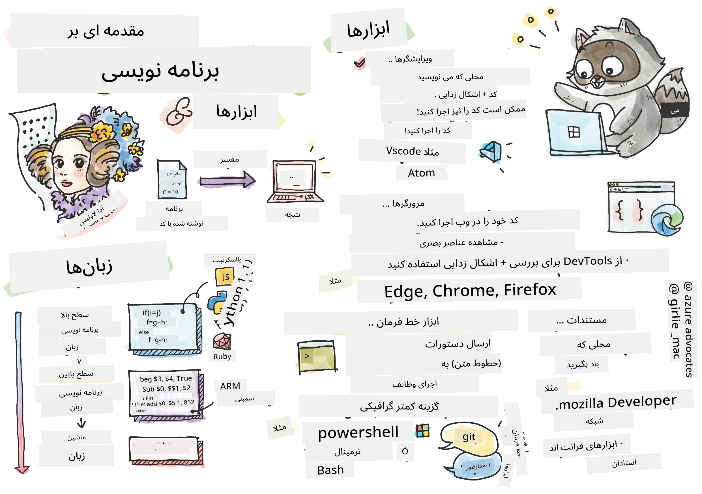
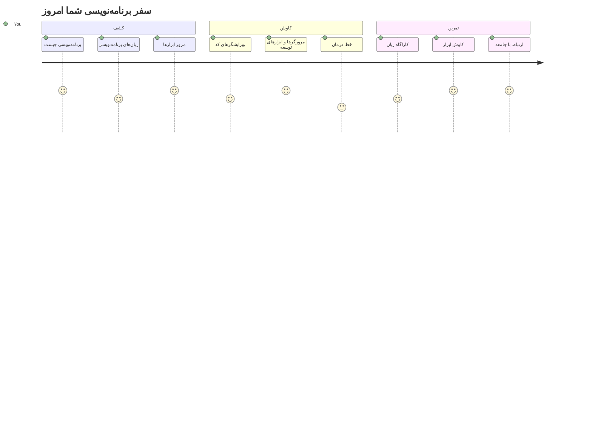
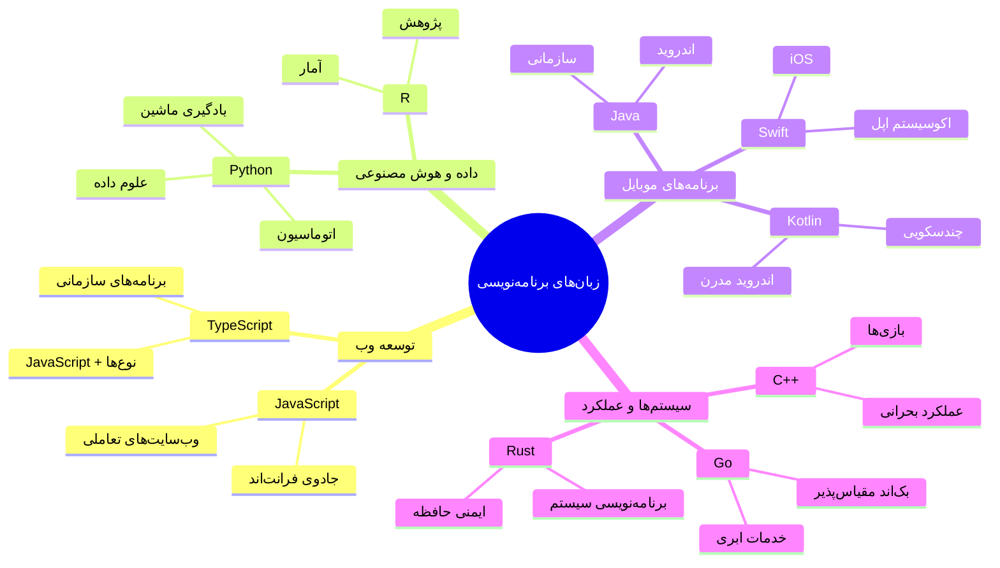
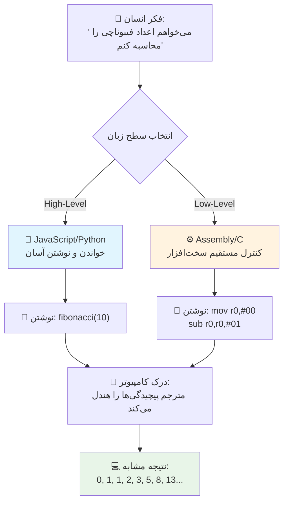
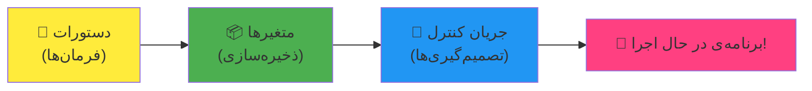
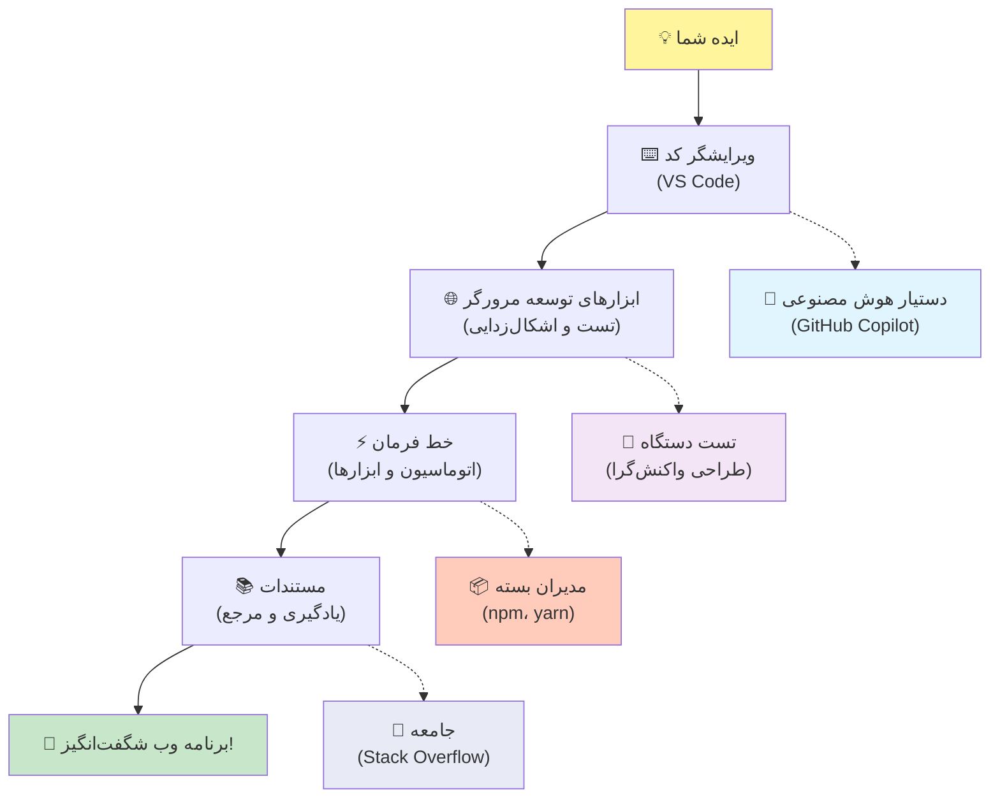
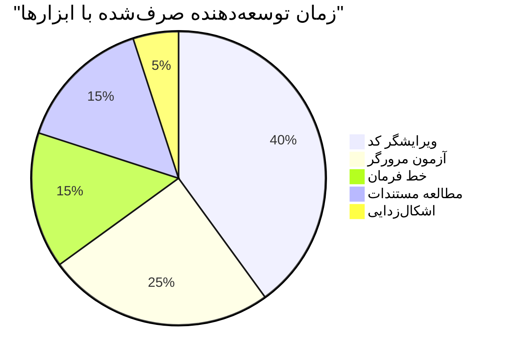
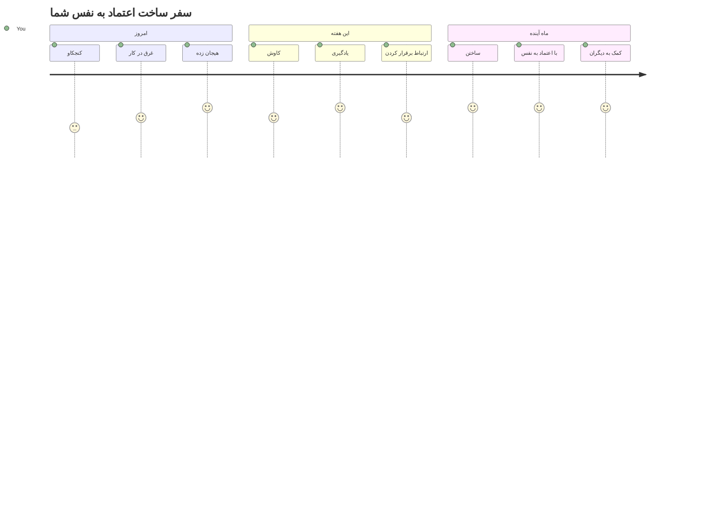

# مقدمه‌ای بر زبان‌های برنامه‌نویسی و ابزارهای مدرن توسعه‌دهندگان

سلام به تو، توسعه‌دهنده آینده! 👋 می‌توانم چیزی به تو بگویم که هر روز برایم هیجان‌انگیز است؟ تو در آستانه کشف این هستی که برنامه‌نویسی فقط درباره کامپیوترها نیست – بلکه درباره داشتن نیروهای فوق‌العاده واقعی است که ایده‌های wild تو را به زندگی می‌آورد!

می‌دانی آن لحظه‌ای که از برنامه محبوبت استفاده می‌کنی و همه چیز دقیقاً بی‌نقص است؟ وقتی روی یک دکمه فشار می‌دهی و چیز جادویی‌ای اتفاق می‌افتد که تو را به حیرت وا می‌دارد «وای، چطور این کار را کردند؟» خوب، کسی دقیقاً مثل تو – احتمالاً نشسته در کافی‌شاپ محبوبش در ساعت ۲ صبح با سومین اسپرسو – کدی نوشته که آن جادو را ساخته. و این چیزی است که ذهنت را منفجر می‌کند: تا پایان این درس، نه تنها فهمیده‌ای چگونه این کار را کردند، بلکه خودت هم مشتاق می‌شوی که اینکار را امتحان کنی!

ببین، کاملاً می‌فهمم اگر برنامه‌نویسی الان کمی ترسناک به نظر برسد. وقتی من شروع کردم، واقعاً فکر می‌کردم باید نابغه ریاضی باشی یا از پنج سالگی کدنویسی کنی. اما این چیزی بود که کاملاً دیدم را تغییر داد: برنامه‌نویسی دقیقاً مثل یادگیری صحبت کردن به زبان جدید است. با "سلام" و "متشکرم" شروع می‌کنی، بعد سفارش قهوه می‌دهی، و پیش از آنکه بدانی، در بحث‌های فلسفی عمیق شرکت می‌کنی! فقط در اینجا، تو داری با کامپیوترها صحبت می‌کنی و واقعاً؟ آنها صبورترین شریک‌های مکالمه‌ای هستند که می‌توانی داشته باشی – هرگز اشتباهاتت را قضاوت نمی‌کنند و همیشه مشتاقند دوباره امتحان کنند!

امروز، ما به ابزارهای شگفت‌انگیزی می‌پردازیم که توسعه وب مدرن را نه تنها ممکن بلکه واقعاً اعتیادآور کرده‌اند. منظورم دقیقاً همان ویرایشگرها، مرورگرها و جریان‌های کاری است که توسعه‌دهندگان شرکت‌های Netflix، Spotify و استودیوی اپلیکیشن‌های مستقل محبوب تو هر روز استفاده می‌کنند. و این بخشی است که باعث شادی تو می‌شود: بیشتر این ابزارهای حرفه‌ای و استاندارد صنعت کاملاً رایگان هستند!


> یادداشت تصویری توسط [Tomomi Imura](https://twitter.com/girlie_mac)


## بیایید ببینیم چقدر می‌دانی!

قبل از اینکه وارد بخش هیجان‌انگیز شویم، کنجکاوم – چه چیزهایی درباره دنیای برنامه‌نویسی قبلاً می‌دانی؟ و گوش کن، اگر به این سوال‌ها نگاه می‌کنی و فکر می‌کنی «من واقعاً هیچ ایده‌ای درباره این ندارم»، این فقط خوب نیست، بلکه عالی است! یعنی تو دقیقاً در جای درست هستی. این آزمون را مثل گرم کردن قبل از ورزش در نظر بگیر – ما داریم فقط آن عضلات مغز را آماده می‌کنیم!

[آزمون پیش-درس را انجام بده](https://forms.office.com/r/dru4TE0U9n?origin=lprLink)

## ماجراجویی که با هم خواهیم داشت

خب، واقعاً من پر از هیجان برای آن چیزی هستم که امروز کشف خواهیم کرد! واقعاً، آرزو می‌کنم می‌توانستم صورتی که وقتی برخی از این مفاهیم برات روشن می‌شود ببینم. این سفر شگفت‌انگیز ما با هم است:

- **برنامه‌نویسی واقعاً چیست (و چرا هیجان‌انگیزترین چیز دنیاست!)** – ما کشف می‌کنیم که چگونه کد دقیقاً همان جادوی نامرئی است که همه چیز اطراف تو را قدرت می‌دهد، از آن زنگ هشدار که به طرز عجیبی می‌داند دوشنبه صبح است تا الگوریتمی که توصیه‌های دقیق Netflix تو را سامان می‌دهد
- **زبان‌های برنامه‌نویسی و شخصیت‌های فوق‌العاده آنها** – تصور کن وارد مهمانی می‌شوی که هر نفر نیروهای فوق‌العاده و روش‌های کاملاً متفاوت برای حل مسائل دارد. دنیای زبان‌های برنامه‌نویسی دقیقاً همین‌طور است و تو عاشق آشنایی با آنها خواهی شد!
- **بلوک‌های بنیادینی که جادوی دیجیتال را می‌سازند** – آنها را مثل بهترین مجموعه لگوی خلاقانه تصور کن. وقتی بفهمی این قطعات چطور کنار هم می‌آیند، می‌فهمی که می‌توانی هر چیزی را که در تصور داری بسازی
- **ابزارهای حرفه‌ای که باعث می‌شود حس کنی همین الان عصای جادوگری به تو داده شده** – واقعاً اغراق نمی‌کنم – این ابزارها واقعاً باعث می‌شوند حس کنی قدرت فوق‌العاده داری، و بهترین بخش؟ همان‌هایی هستند که حرفه‌ای‌ها استفاده می‌کنند!

> 💡 **نکته مهم**: امروز سعی نکن همه چیز را حفظ کنی! الان فقط می‌خواهم آن جرقه هیجان درباره امکانات احتمالی را حس کنی. جزئیات به شکل طبیعی با تمرین مشترک ما جا می‌افتند – این است راه حقیقی یادگیری!

> تو می‌توانی این درس را در [Microsoft Learn](https://docs.microsoft.com/learn/modules/web-development-101/introduction-programming/?WT.mc_id=academic-77807-sagibbon) هم بگیری!

## پس برنامه‌نویسی دقیقاً *چیست*؟

خب، بیایید به سوال میلیون دلاری بپردازیم: برنامه‌نویسی واقعاً چیست؟

داستانی به تو می‌گویم که دید من را کاملاً تغییر داد. هفته گذشته داشتم به مادرم توضیح می‌دادم چطور از کنترل تلویزیون هوشمند جدیدمان استفاده کند. خودم را گرفتم که می‌گویم «دکمه قرمز را فشار بده، اما نه دکمه بزرگ قرمز، دکمه کوچکتر قرمز سمت چپ... نه، سمت چپ دیگرت... اوکی، الآن دو ثانیه نگه دار، نه یک ثانیه، نه سه...» آشنا نیست؟ 😅

همان برنامه‌نویسی است! هنر دادن دستورالعمل‌های فوق‌العاده دقیق و مرحله‌به‌مرحله به چیزی است که بسیار قدرتمند است ولی نیاز دارد همه چیز کاملاً واضح بیان شود. فقط به جای اینکه به مادرت توضیح بدهی (که می‌تواند سوال کند «کدام دکمه قرمز؟!»)، به کامپیوتر توضیح می‌دهی (که دقیقاً همان چیزی را انجام می‌دهد که گفتی، حتی اگر آن چیزی نباشد که منظورت بود).

آن چیزی که برایم بسیار شگفت‌انگیز بود وقتی یاد گرفتم: کامپیوترها در اصل خیلی ساده‌اند. آنها فقط دو چیز را می‌فهمند – ۱ و ۰، که اساساً یعنی «بله» و «خیر» یا «روشن» و «خاموش». فقط همین! اما اینجا جادوی واقعی است – ما لازم نیست دقیقا در ۱ و ۰ حرف بزنیم مثل فیلم ماتریکس. اینجا زبان‌های برنامه‌نویسی به کمک ما می‌آیند. آنها مثل بهترین مترجم دنیا هستند که افکار کاملاً طبیعی انسانیت را به زبان کامپیوتر تبدیل می‌کنند.

و این چیزی است که هر صبح وقتی بیدار می‌شوم هنوز مرا به هیجان می‌آورد: دقیقاً *همه چیز* دیجیتال در زندگی تو با کسی شروع شده که مثل تو بوده، احتمالا در حالتی راحت و با یک فنجان قهوه، کد روی لپ‌تاپش تایپ می‌کرده. آن فیلتر اینستاگرامی که تو را بی‌نقص نشان می‌دهد؟ کسی آن را کد زده. توصیه‌ای که تو را به آهنگ جدید مورد علاقه‌ات رساند؟ یک توسعه‌دهنده آن الگوریتم را ساخته. اپی که به تو کمک می‌کند صورت حساب شام را با دوستان تقسیم کنی؟ بله، کسی فکر کرده «این آزاردهنده است، مطمئنم می‌توانم این را درست کنم» و بعد... درستش کرد!

وقتی برنامه‌نویسی یاد می‌گیری، فقط مهارت جدیدی کسب نمی‌کنی – بخشی از این جامعه شگفت‌انگیز حل مسئله می‌شوی که روزهایشان را صرف فکر کردن می‌کنند، «اگر چیزی می‌ساختم که روز کسی را کمی بهتر کند چی؟» راستش، چیزی بهتر از این هست؟

✅ **شکار حقیقت جالب**: وقتی وقت آزاد داشتی این را جستجو کن – فکر می‌کنی اولین برنامه‌نویس دنیا کی بوده؟ یک اشاره می‌دهم: شاید کسی که انتظارش را داری نباشد! داستان پشت این شخص کاملاً جذاب است و نشان می‌دهد برنامه‌نویسی همیشه درباره حل خلاقانه مسائل و تفکر خارج از چارچوب بوده است.

### 🧠 **زمان بررسی: حالت چطوره؟**

**کمی وقت بگذار و فکر کن:**
- آیا حالا ایده «دستور دادن به کامپیوترها» برایت منطقی است؟
- می‌توانی یک کار روزانه را فکر کنی که دوست داری با برنامه‌نویسی خودکار کنی؟
- چه سوال‌هایی در ذهنت درباره این دنیای برنامه‌نویسی جوش می‌زند؟

> **یادت باشد**: طبیعی است اگر بعضی مفاهیم هنوز کمی مبهم باشد. یادگیری برنامه‌نویسی مثل یادگیری زبان جدید است – نیازمند زمان است که مغز آن مسیرهای عصبی را بسازد. تو عالی هستی!

## زبان‌های برنامه‌نویسی مثل طعم‌های متفاوت جادو هستند

خب، این شاید عجیب به نظر برسد، اما با من همراه باش – زبان‌های برنامه‌نویسی مثل انواع مختلف موسیقی هستند. فکر کن: جاز که نرم و بداهه است، راک که قدرتمند و راحت است، کلاسیک که شیک و ساختارمند است، و هیپ‌هاپ که خلاقانه و بیانگر است. هر سبک حال و هوای خودش را دارد، جامعه طرفداران پرشور خودش را دارد، و هر کدام برای حالات و موقعیت‌های مختلف عالی هستند.

زبان‌های برنامه‌نویسی هم دقیقاً همین‌طور کار می‌کنند! تو برای ساختن یک بازی موبایل سرگرم‌کننده همان زبان را به کار نمی‌بری که برای پردازش مقادیر عظیم داده‌های اقلیمی استفاده می‌کنی، درست همان‌طور که در کلاس یوگا متال دث گوش نمی‌دهی (البته اکثر کلاس‌های یوگا اینطورند! 😄).

اما چیزی که هر بار مرا به شدت شگفت‌زده می‌کند: این زبان‌ها مثل داشتن صبورترین و باهوش‌ترین مترجم دنیا هستند که کنارت نشسته است. تو می‌توانی ایده‌هایت را طوری بیان کنی که برای مغز انسانی‌ات طبیعی باشد، و آنها تمام تبدیل‌های پیچیده را به ۱ و ۰ که کامپیوترها واقعاً می‌فهمند انجام می‌دهند. مثل داشتن دوستی که هم در «خلاقیت انسانی» و هم در «منطق کامپیوتر» کاملاً مسلط است – و هرگز خسته نمی‌شود، نیازی به استراحت‌های قهوه ندارد و هرگز تو را برای پرسیدن یک سوال دوباره قضاوت نمی‌کند!

### زبان‌های محبوب برنامه‌نویسی و کاربردهایشان


| زبان | بهترین کاربرد | دلیل محبوبیت |
|----------|--------------|--------------------|
| **JavaScript** | توسعه وب، رابط‌های کاربری | اجرا در مرورگرها و قوت‌بخشی به وب‌سایت‌های تعاملی |
| **Python** | علم داده، اتوماسیون، هوش مصنوعی | خواندن و یادگیری آسان، کتابخانه‌های قدرتمند |
| **Java** | اپلیکیشن‌های شرکتی، اندروید | مستقل از پلتفرم، مناسب سیستم‌های بزرگ |
| **C#** | اپلیکیشن‌های ویندوز، توسعه بازی | پشتیبانی قوی از اکوسیستم مایکروسافت |
| **Go** | خدمات ابری، سیستم‌های back-end | سریع، ساده، طراحی شده برای محاسبات مدرن |

### زبان‌های سطح بالا در مقابل سطح پایین

خب، این واقعاً مفهومی بود که وقتی شروع به یادگیری کردم مغزم را به هم ریخت، پس آن قیاس را با تو به اشتراک می‌گذارم که کلید فهم من بود – و امیدوارم برای تو هم مفید باشد!

تصور کن به کشوری سفر کرده‌ای که زبان آن را بلد نیستی و به شدت دنبال سرویس بهداشتی نزدیک‌ترین هستی (همه این حالت را تجربه کرده‌ایم، درسته؟ 😅):

- **برنامه‌نویسی سطح پایین** مثل یادگیری کامل لهجه محلی است که بتوانی با مادربزرگ فروشنده میوه در گوشه خیابان با ارجاعات فرهنگی، زبان محلی و جک‌های داخلی که فقط کسی که آنجا بزرگ شده می‌فهمد گپ بزنی. خیلی تاثیرگذار و فوق‌العاده کارآمد است... اگر بتوانی روان صحبت کنی! اما وقتی فقط دنبال سرویس بهداشتی می‌گردی کمی طاقت‌فرسا است.

- **برنامه‌نویسی سطح بالا** مثل داشتن یک دوست محلی فوق‌العاده است که کاملاً تو را می‌فهمد. تو می‌توانی بگویی «من واقعاً باید یک دستشویی پیدا کنم» به زبان ساده، و او تمام ترجمه‌های فرهنگی را انجام می‌دهد و راهنمایی می‌کند طوری که برای مغز غیرمحلی تو کاملاً منطقی است.

از نظر برنامه‌نویسی:
- **زبان‌های سطح پایین** (مثل Assembly یا C) به تو اجازه می‌دهند مکالمات فوق‌العاده دقیق با سخت‌افزار واقعی کامپیوتر داشته باشی، ولی باید مثل یک ماشین فکر کنی، که... خوب، بگذار بگویم تغییر ذهنی بزرگی است!
- **زبان‌های سطح بالا** (مثل JavaScript، Python یا C#) به تو اجازه می‌دهند مانند یک انسان فکر کنی در حالی که آنها همه زبان ماشین را پشت صحنه اداره می‌کنند. ضمن اینکه دارای جوامع فوق‌العاده خوش‌آمدگو هستند پر از افرادی که یادشان می‌آید چطور بود تازه‌کار بودن و واقعاً می‌خواهند کمک کنند!

حدس بزن می‌خواهم با کدام‌ها شروع کنی؟ 😉 زبان‌های سطح بالا مثل چرخ‌های کمکی هستند که هیچوقت دوست نداری از آنها جدا شوی چون کل تجربه را خیلی لذت‌بخش‌تر می‌کنند!


### بگذار نشان دهم چرا زبان‌های سطح بالا دوستانه‌تر هستند

خب، می‌خواهم چیزی به تو نشان دهم که چرا عاشق زبان‌های سطح بالا شدم، اما اول – باید قول بدهی. وقتی اولین نمونه کد را می‌بینی، نترس! قرار است کمی ترسناک به نظر برسد. این دقیقاً نکته‌ای است که می‌خواهم بگویم!

ما به همان کار دقیق نگاه می‌کنیم که به دو سبک کاملاً متفاوت نوشته شده. هر دو دنباله فیبوناچی را می‌سازند – این یک الگوی ریاضی زیبا است که هر عدد مجموع دو عدد قبلی است: ۰، ۱، ۱، ۲، ۳، ۵، ۸، ۱۳... (نکته جالب: این الگو را تقریباً در همه چیز طبیعت پیدا می‌کنی – مارپیچ دانه‌های آفتابگردان، الگوی کاج‌میوه‌ها، حتی شکل‌گیری کهکشان‌ها!)

آماده‌ای تفاوت را ببینی؟ بزن بریم!

**زبان سطح بالا (JavaScript) – انسان‌دوست:**

```javascript
// مرحله ۱: تنظیمات اولیه فیبوناچی
const fibonacciCount = 10;
let current = 0;
let next = 1;

console.log('Fibonacci sequence:');
```

**این کد چه کار می‌کند:**
- **تعریف** یک ثابت برای مشخص کردن تعداد اعداد فیبوناچی که می‌خواهیم تولید کنیم
- **مقدارسازی اولیه** دو متغیر برای دنبال کردن عدد فعلی و عدد بعدی در دنباله
- **تنظیم** مقادیر شروع (۰ و ۱) که الگوی فیبوناچی را تعریف می‌کنند
- **نمایش** پیام سرصفحه برای شناسایی خروجی ما

```javascript
// مرحله ۲: تولید دنباله با استفاده از یک حلقه
for (let i = 0; i < fibonacciCount; i++) {
  console.log(`Position ${i + 1}: ${current}`);
  
  // محاسبه عدد بعدی در دنباله
  const sum = current + next;
  current = next;
  next = sum;
}
```

**شرح کاری که اینجا انجام می‌شود:**
- **حلقه** زدن در هر موقعیت از دنباله با استفاده از حلقه `for`
- **نمایش** هر عدد با موقعیت آن به کمک قالب‌بندی template literal
- **محاسبه** عدد فیبوناچی بعدی با جمع مقادیر جاری و بعدی
- **بروزرسانی** متغیرهای پیگیری برای حرکت به تکرار بعدی

```javascript
// مرحله ۳: رویکرد تابعی مدرن
const generateFibonacci = (count) => {
  const sequence = [0, 1];
  
  for (let i = 2; i < count; i++) {
    sequence[i] = sequence[i - 1] + sequence[i - 2];
  }
  
  return sequence;
};

// مثال استفاده
const fibSequence = generateFibonacci(10);
console.log(fibSequence);
```

**در بالا، ما:**
- **ساختیم** یک تابع قابل استفاده مجدد با نحو تابع پیکانی مدرن
- **ساختیم** آرایه‌ای برای ذخیره کل دنباله به جای نمایش تک‌تک اعداد
- **استفاده کردیم** از اندیس آرایه برای محاسبه هر عدد جدید از اعداد قبلی
- **بازگرداندیم** کل دنباله برای استفاده انعطاف‌پذیر در قسمت‌های دیگر برنامه

**زبان سطح پایین (ARM Assembly) – کامپیوتر-دوست:**

```assembly
 area ascen,code,readonly
 entry
 code32
 adr r0,thumb+1
 bx r0
 code16
thumb
 mov r0,#00
 sub r0,r0,#01
 mov r1,#01
 mov r4,#10
 ldr r2,=0x40000000
back add r0,r1
 str r0,[r2]
 add r2,#04
 mov r3,r0
 mov r0,r1
 mov r1,r3
 sub r4,#01
 cmp r4,#00
 bne back
 end
```

توجه کن که نسخه JavaScript تقریباً مثل دستورالعمل‌های انگلیسی خوانده می‌شود، در حالی که نسخه Assembly از دستورهای رمزی استفاده می‌کند که مستقیماً پردازنده کامپیوتر را کنترل می‌کنند. هر دو همان کار را انجام می‌دهند، اما زبان سطح بالا برای انسان‌ها بسیار آسان‌تر برای فهمیدن، نوشتن و نگهداری است.

**تفاوت‌های اصلی که متوجه خواهی شد:**
- **خوانایی**: JavaScript از نام‌های توصیفی مثل `fibonacciCount` استفاده می‌کند در حالی که Assembly از برچسب‌های رمزی مثل `r0`، `r1` بهره می‌برد
- **نظرات**: زبان‌های سطح بالا تشویق به افزودن نظرات توضیحی می‌کنند که کد را خودمستندسازی می‌کنند  
- **ساختار**: جریان منطقی جاوااسکریپت با طرز تفکر انسان‌ها درباره مشکلات به صورت گام به گام مطابقت دارد  
- **نگهداری**: به‌روزرسانی نسخه جاوااسکریپت برای نیازهای مختلف بسیار ساده و واضح است  

✅ **درباره دنباله فیبوناچی**: این الگوی عددی فوق‌العاده زیبا (که هر عدد برابر با جمع دو عدد قبلی‌اش است: ۰، ۱، ۱، ۲، ۳، ۵، ۸...) واقعاً در *همه جا* در طبیعت دیده می‌شود! آن را در حلزون خورشیدی، الگوهای کاج، نحوه خم شدن پوسته‌های ناوتیلس و حتی در رشد شاخه‌های درخت خواهید یافت. خیلی حیرت‌آور است که چگونه ریاضی و کد به ما کمک می‌کنند تا الگوهایی را که طبیعت برای خلق زیبایی استفاده می‌کند، درک و بازتولید کنیم!  

## قطعات سازنده‌ای که جادو را رقم می‌زنند  

خوب، حالا که دیدید زبان‌های برنامه‌نویسی در عمل چه شکلی هستند، اجازه دهید اجزای بنیادی که اساساً هر برنامه‌ای را ساخته‌اند، بشکنیم. این‌ها را مانند مواد ضروری در دستور غذایی مورد علاقه‌تان در نظر بگیرید – وقتی فهمیدید هر کدام چه کاری انجام می‌دهند، می‌توانید تقریباً هر زبان برنامه‌نویسی را بخوانید و بنویسید!  

این کمی شبیه یادگیری دستور زبان برنامه‌نویسی است. به یاد دارید زمانی که در مدرسه درباره اسم، فعل و نحوه ساخت جمله یاد می‌گرفتید؟ برنامه‌نویسی هم نسخه‌ای از دستور زبان خودش را دارد و واقعاً خیلی منطقی‌تر و معقول‌تر از دستور زبان انگلیسی است! 😄  

### عبارت‌ها: دستورالعمل‌های گام به گام  

بیایید با **عبارت‌ها** شروع کنیم – این‌ها مانند جملات جداگانه در گفتگو با کامپیوترتان هستند. هر عبارت به کامپیوتر می‌گوید یک کار مشخص را انجام دهد، مثل دادن دستور: «اینجا بپیچ به چپ»، «سر چراغ قرمز توقف کن»، «اینجا پارک کن».  

چیزی که من در مورد عبارت‌ها دوست دارم، قابل‌خواندن بودن معمولاً آن‌هاست. این را ببینید:  

```javascript
// عبارات پایه‌ای که یک عمل را انجام می‌دهند
const userName = "Alex";                    
console.log("Hello, world!");              
const sum = 5 + 3;                         
```
  
**این کد چه کاری انجام می‌دهد:**  
- **اعلان** یک متغیر ثابت برای ذخیره نام کاربر  
- **نمایش** پیغام سلام در خروجی کنسول  
- **محاسبه** و ذخیره نتیجه یک عملیات ریاضی  

```javascript
// دستوراتی که با صفحات وب تعامل دارند
document.title = "My Awesome Website";      
document.body.style.backgroundColor = "lightblue";
```
  
**گام به گام، این اتفاقات می‌افتد:**  
- **تغییر** عنوان صفحه وب که در تب مرورگر نمایش داده می‌شود  
- **تغییر** رنگ پس‌زمینه کل بدنه صفحه  

### متغیرها: حافظه برنامه شما  

خوب، **متغیرها** واقعاً یکی از مفاهیم مورد علاقه من برای آموزش هستند چون خیلی شبیه چیزهایی هستند که شما هر روز استفاده می‌کنید!  

برای یک لحظه به دفترچه تلفن گوشی خود فکر کنید. شماره همه را حفظ نمی‌کنید – بلکه «مامان»، «بهترین دوست» یا «پیتزافروشی که تا ساعت ۲ صبح سفارش تحویل می‌دهد» را ذخیره می‌کنید و می‌گذارید گوشی‌تان شماره‌ها را به خاطر بسپارد. متغیرها دقیقاً همینطور عمل می‌کنند! آن‌ها مانند ظروف برچسب‌خورده‌ای هستند که برنامه شما می‌تواند اطلاعات را ذخیره کند و بعداً با استفاده از نامی که واقعاً معنی‌دار است، بازیابی کند.  

چیزی که واقعاً جالب است: متغیرها می‌توانند در حین اجرای برنامه تغییر کنند (از همین رو نام‌شان «متغیر» است – متوجه شدید؟). درست مثل زمانی که ممکن است آن تماس پیتزا را وقتی مکان بهتری پیدا می‌کنید به‌روزرسانی کنید، متغیرها می‌توانند هنگامی که برنامه شما اطلاعات جدید یاد می‌گیرد یا شرایط تغییر می‌کنند، به‌روزرسانی شوند!  

اجازه دهید نشان دهم چقدر ساده و زیبا می‌تواند باشد:  

```javascript
// مرحله ۱: ایجاد متغیرهای پایه
const siteName = "Weather Dashboard";        
let currentWeather = "sunny";               
let temperature = 75;                       
let isRaining = false;                      
```
  
**درک این مفاهیم:**  
- **ذخیره** مقادیر ثابت در متغیرهای `const` (مثل نام سایت)  
- **استفاده** از `let` برای مقادیری که ممکن است در طول برنامه تغییر کنند  
- **اختصاص** انواع داده مختلف: رشته (متن)، عدد، و بولی (درست/نادرست)  
- **انتخاب** نام‌های توصیفی که توضیح دهند هر متغیر چه چیزی را در خود دارد  

```javascript
// مرحله ۲: کار با اشیاء برای گروه‌بندی داده‌های مرتبط
const weatherData = {                       
  location: "San Francisco",
  humidity: 65,
  windSpeed: 12
};
```
  
**در بالا، ما:**  
- **ایجاد** یک شیء برای گروه‌بندی اطلاعات مربوط به آب‌وهوا  
- **سازماندهی** چندین داده تحت یک نام متغیر  
- **استفاده** از جفت‌های کلید-مقدار برای برچسب‌گذاری واضح هر قطعه اطلاعات  

```javascript
// مرحله ۳: استفاده و به‌روزرسانی متغیرها
console.log(`${siteName}: Today is ${currentWeather} and ${temperature}°F`);
console.log(`Wind speed: ${weatherData.windSpeed} mph`);

// به‌روزرسانی متغیرهای قابل تغییر
currentWeather = "cloudy";                  
temperature = 68;                          
```
  
**بگذارید هر بخش را بفهمیم:**  
- **نمایش** اطلاعات با استفاده از قالب‌های رشته‌ای با سینتکس `${}`  
- **دسترسی** به ویژگی‌های شیء با استفاده از نقطه‌گذاری (`weatherData.windSpeed`)  
- **به‌روزرسانی** متغیرهای اعلان شده با `let` برای انعکاس شرایط متغیر  
- **ترکیب** چند متغیر برای ایجاد پیام‌های معنی‌دار  

```javascript
// مرحله ۴: ساختار شکنی مدرن برای کدی تمیزتر
const { location, humidity } = weatherData; 
console.log(`${location} humidity: ${humidity}%`);
```
  
**چیزی که باید بدانید:**  
- **استخراج** ویژگی‌های خاص از اشیاء با استفاده از تخصیص تخریبی  
- **ایجاد** متغیرهای جدید به طور خودکار با همان نام‌های کلیدهای شیء  
- **ساده‌سازی** کد با جلوگیری از نقطه‌گذاری مکرر  

### جریان کنترل: آموزش برنامه‌تان برای فکر کردن  

خوب، این جایی است که برنامه‌نویسی واقعاً هیجان‌انگیز می‌شود! **جریان کنترل** اساساً آموزش برنامه به نحوی است که تصمیمات هوشمندانه بگیرد، دقیقاً مثل شما که هر روز بدون فکر کردن این کار را انجام می‌دهید.  

تصور کنید: امروز صبح احتمالاً مانند این بوده که «اگر باران بیاید، چتر بردارم. اگر هوا سرد بود، کت بپوشم. اگر دیرم شده بود، صبحانه را حذف کنم و سر راه قهوه بخرم.» مغز شما به طور طبیعی این منطق اگر-آنگاه را ده‌ها بار در روز دنبال می‌کند!  

این چیزی است که برنامه‌ها را هوشمند و زنده می‌کند، نه فقط دنبال کردن یک اسکریپت خسته‌کننده و قابل پیش‌بینی. آن‌ها واقعاً می‌توانند به یک وضعیت نگاه کنند، ارزیابی کنند چه اتفاقی می‌افتد و پاسخ مناسب بدهند. مثل این است که برنامه شما را یک مغز ببخشید که می‌تواند سازگار باشد و انتخاب کند!  

می‌خواهید ببینید چقدر زیبا این کار می‌کند؟ اجازه دهید نشان دهم:  

```javascript
// گام ۱: منطق شرطی پایه
const userAge = 17;

if (userAge >= 18) {
  console.log("You can vote!");
} else {
  const yearsToWait = 18 - userAge;
  console.log(`You'll be able to vote in ${yearsToWait} year(s).`);
}
```
  
**این کد چه کاری می‌کند:**  
- **بررسی** اینکه آیا سن کاربر شرایط رای دادن را دارد  
- **اجرای** بلوک‌های کد مختلف بر اساس نتیجه شرط  
- **محاسبه** و نمایش مدت زمان تا رسیدن به شرایط رای‌دهی اگر زیر ۱۸ سال باشد  
- **ارائه** بازخوردهای خاص و مفید برای هر حالت  

```javascript
// گام ۲: چندین شرط با عملگرهای منطقی
const userAge = 17;
const hasPermission = true;

if (userAge >= 18 && hasPermission) {
  console.log("Access granted: You can enter the venue.");
} else if (userAge >= 16) {
  console.log("You need parent permission to enter.");
} else {
  console.log("Sorry, you must be at least 16 years old.");
}
```
  
**شرح اینکه اینجا چه اتفاقی می‌افتد:**  
- **ترکیب** چندین شرط با استفاده از عملگر `&&` (و)  
- **ایجاد** سلسله مراتبی از شروط با استفاده از `else if` برای چندین حالت  
- **پرداختن** به تمام شرایط ممکن با یک عبارت نهایی `else`  
- **دادن** بازخورد واضح و قابل اجرا برای هر وضعیت متفاوت  

```javascript
// مرحله ۳: شرط مختصر با عملگر سه‌تایی
const votingStatus = userAge >= 18 ? "Can vote" : "Cannot vote yet";
console.log(`Status: ${votingStatus}`);
```
  
**چیزی که باید به یاد داشته باشید:**  
- **استفاده** از عملگر شرطی (`? :`) برای شرایط ساده دو گزینه‌ای  
- **نوشتن** شرط اول، سپس `?`، سپس نتیجه درست، سپس `:`, سپس نتیجه نادرست  
- **استفاده** از این الگو وقتی که نیاز دارید مقدار بر اساس شرط اختصاص دهید  

```javascript
// مرحله ۴: مدیریت چندین مورد خاص مختلف
const dayOfWeek = "Tuesday";

switch (dayOfWeek) {
  case "Monday":
  case "Tuesday":
  case "Wednesday":
  case "Thursday":
  case "Friday":
    console.log("It's a weekday - time to work!");
    break;
  case "Saturday":
  case "Sunday":
    console.log("It's the weekend - time to relax!");
    break;
  default:
    console.log("Invalid day of the week");
}
```
  
**این کد چه کاری انجام می‌دهد:**  
- **مقایسه** مقدار متغیر با چندین حالت خاص  
- **گروه‌بندی** حالات مشابه با هم (روزهای هفته در مقابل تعطیلات آخر هفته)  
- **اجرای** بلوک کد مناسب وقتی تطابق پیدا کند  
- **شامل** یک حالت `default` برای پرداختن به مقادیر غیرمنتظره  
- **استفاده** از عبارات `break` برای جلوگیری از ادامه کد به حالت بعدی  

> 💡 **تشبیه دنیای واقعی**: جریان کنترل را مانند صبوری‌ترین GPS دنیا در نظر بگیرید که مسیرها را به شما نشان می‌دهد. ممکن است بگوید «اگر ترافیک در خیابان اصلی است، به جای آن بزرگراه را برو. اگر ساخت‌وساز بزرگراه را مسدود کرده، مسیر دیدنی را امتحان کن.» برنامه‌ها دقیقاً همین نوع منطق شرطی را برای پاسخ هوشمندانه به شرایط مختلف استفاده می‌کنند و همیشه بهترین تجربه را برای کاربران فراهم می‌آورند.  

### 🎯 **بررسی مفهوم: تسلط بر قطعات سازنده**  

**بیایید ببینیم با اصول چطورید:**  
- می‌توانید تفاوت بین متغیر و عبارت را با کلمات خودتان توضیح دهید؟  
- یک مثال واقعی از وضعیتی که از تصمیم اگر-آنگاه استفاده می‌کنید (مثل مثال رای دادن ما) فکر کنید  
- یک نکته در منطق برنامه‌نویسی که شما را شگفت‌زده کرد چیست؟  

**تقویت سریع اعتماد به نفس:**  

✅ **آنچه در ادامه می‌آید**: قرار است خیلی خوش بگذرانیم و عمیق‌تر به این مفاهیم بپردازیم در حالی که این سفر شگفت‌انگیز را با هم ادامه می‌دهیم! الان فقط روی حس هیجان نسبت به همه امکانات فوق‌العاده پیش‌رو تمرکز کنید. مهارت‌ها و تکنیک‌های خاص به طور طبیعی با تمرین کردن کنار هم شکل می‌گیرند – قول می‌دهم این خیلی بیشتر از آن چیزی باشد که انتظار دارید سرگرم‌کننده باشد!  

## ابزارهای حرفه‌ای  

خوب، صادقانه بگویم این بخش جایی است که آنقدر هیجان‌زده می‌شوم که نمی‌توانم خودم را کنترل کنم! 🚀 قرار است درباره ابزارهای خارق‌العاده‌ای صحبت کنیم که باعث می‌شوند احساس کنید کلیدهای یک سفینه فضایی دیجیتال به دستتان رسیده است.  

می‌دانید که چگونه سرآشپزها چاقوهایی دارند که کاملاً متعادل است و مثل بخشی از دست‌شان می‌ماند؟ یا چگونه یک نوازنده گیتاری دارد که انگار همین که به آن دست می‌زند، شروع به خواندن می‌کند؟ خب، توسعه‌دهندگان هم نسخه خودشان از این ابزارهای جادویی را دارند، و این چیزی است که قطعاً ذهن شما را خواهد برد – اکثر آن‌ها کاملاً رایگان هستند!  

در حال حاضر دارم روی صندلی‌ام بالا و پایین می‌پرم که این‌ها را با شما به اشتراک بگذارم چون کاملاً نحوه ساخت نرم‌افزار را متحول کرده‌اند. داریم درباره دستیارهای کدنویسی مبتنی بر هوش مصنوعی صحبت می‌کنیم که می‌توانند به شما در نوشتن کد کمک کنند (جدی می‌گویم!)، محیط‌های ابری که می‌توانید از هر جایی با اینترنت برنامه‌های کامل بسازید، و ابزارهای اشکال‌زدایی بسیار پیشرفته که مثل داشتن دید ایکس‌ری برای برنامه‌هایتان است.  

و این قسمت هنوز برایم هیجان‌انگیز است: این‌ها ابزارهای «مبتدی» نیستند که وقتی پیشرفت کنید آن‌ها را کنار بگذارید. این‌ها همان ابزارهای سطح حرفه‌ای‌اند که توسعه‌دهندگان گوگل، نتفلیکس و همان استودیو اپلیکیشن مستقل مورد علاقه‌تان دقیقاً همین الان استفاده می‌کنند. با استفاده از آن‌ها احساس می‌کنید حرفه‌ای درجه یک هستید!  


### ویرایشگرهای کد و IDEها: دوستان دیجیتال جدید شما  

بیایید درباره ویرایشگرهای کد صحبت کنیم – این‌ها واقعاً قرار است مکان‌های مورد علاقه جدید شما برای حضور باشند! آن‌ها را مانند پناهگاه شخصی کدنویسی خودتان ببینید که بیشترین زمان خود را صرف ساختن و بهبود خلقیات دیجیتال‌تان خواهید کرد.  

اما چیزی که در ویرایشگرهای مدرن واقعاً جادویی است این است که آن‌ها فقط ویرایشگر متن معمولی نیستند. آن‌ها مثل داشتن درخشان‌ترین و بهترین مربی پشتیبان کدزنی هستند که ۲۴ ساعت کنار شما می‌نشینند. اشتباهات شما را قبل از اینکه خودتان بفهمید می‌گیرند، پیشنهاداتی می‌دهند که شما را نابغه نشان می‌دهد، کمک می‌کنند هر قسمت کد چه کاری انجام می‌دهد را بفهمید و برخی حتی پیش‌بینی می‌کنند که شما ممکن است چه چیزی بنویسید و پیشنهاد می‌کنند که جملات شما را کامل کنند!  

یادم می‌آید وقتی برای اولین بار تکمیل خودکار را کشف کردم – واقعاً احساس می‌کردم در آینده زندگی می‌کنم. شروع به تایپ می‌کنی و ویرایشگر می‌گوید «هی، آیا به این تابع فکر می‌کردی که دقیقاً همان کاری را انجام می‌دهد که نیاز داری؟» انگار یک خواننده ذهن دارید که دوست کدنویسی شماست!  

**چه چیزی این ویرایشگرها را بسیار خارق‌العاده می‌کند؟**  

ویرایشگرهای کد مدرن مجموعه‌ای چشمگیر از ویژگی‌ها را ارائه می‌دهند که طراحی شده‌اند تا بهره‌وری شما را افزایش دهند:  

| ویژگی | کارکرد | چرا مفید است |  
|---------|--------------|--------------|  
| **هایلایت سینتکس** | رنگی کردن بخش‌های مختلف کد شما | خواندن کد و یافتن خطاها را آسان‌تر می‌کند |  
| **تکمیل خودکار** | هنگام تایپ کد پیشنهاد می‌دهد | کدنویسی را سریع‌تر و خطاها را کم می‌کند |  
| **ابزارهای اشکال‌زدایی** | به شما کمک می‌کند خطاها را پیدا و رفع کنید | ساعات زیادی از وقت رفع اشکال را ذخیره می‌کند |  
| **افزونه‌ها** | ویژگی‌های تخصصی اضافه می‌کند | ویرایشگر را برای هر فناوری شخصی‌سازی می‌کند |  
| **دستیارهای هوش مصنوعی** | کد و توضیح پیشنهاد می‌دهند | یادگیری و بهره‌وری را تسریع می‌کند |  

> 🎥 **منبع ویدیویی**: می‌خواهید ببینید این ابزارها در عمل چگونه‌اند؟ این [ویدیوی ابزارهای حرفه‌ای](https://youtube.com/watch?v=69WJeXGBdxg) را برای مرور جامع تماشا کنید.  

#### ویرایشگرهای پیشنهادی برای توسعه وب  

**[Visual Studio Code](https://code.visualstudio.com/?WT.mc_id=academic-77807-sagibbon)** (رایگان)  
- محبوب‌ترین در میان توسعه‌دهندگان وب  
- اکوسیستم عالی افزونه‌ها  
- ترمینال داخلی و ادغام با Git  
- **افزونه‌های ضروری**:  
  - [GitHub Copilot](https://marketplace.visualstudio.com/items?itemName=GitHub.copilot) - پیشنهادات کد با هوش مصنوعی  
  - [Live Share](https://marketplace.visualstudio.com/items?itemName=MS-vsliveshare.vsliveshare) - همکاری همزمان  
  - [Prettier](https://marketplace.visualstudio.com/items?itemName=esbenp.prettier-vscode) - قالب‌بندی خودکار کد  
  - [Code Spell Checker](https://marketplace.visualstudio.com/items?itemName=streetsidesoftware.code-spell-checker) - گرفتن غلط‌های املایی در کد  

**[JetBrains WebStorm](https://www.jetbrains.com/webstorm/)** (پرداختی، رایگان برای دانشجویان)  
- ابزارهای پیشرفته اشکال‌زدایی و تست  
- تکمیل کد هوشمندانه  
- کنترل نسخه داخلی  

**IDEهای ابری** (قیمت‌های متنوع)  
- [GitHub Codespaces](https://github.com/features/codespaces) - VS Code کامل داخل مرورگر شما  
- [Replit](https://replit.com/) - عالی برای یادگیری و اشتراک‌گذاری کد  
- [StackBlitz](https://stackblitz.com/) - توسعه وب فول‌استک فوری  

> 💡 **نکته شروع**: با Visual Studio Code شروع کنید – رایگان است، در صنعت بسیار استفاده می‌شود، و جامعه بزرگی از آموزش‌ها و افزونه‌های مفید دارد.  


### مرورگرهای وب: آزمایشگاه توسعه مخفی شما  

خوب، آماده باشید که ذهنتان کاملاً منفجر شود! می‌دانید که چطور از مرورگر برای گشتن در شبکه‌های اجتماعی و دیدن ویدیوها استفاده می‌کنید؟ خب، معلوم شده که این‌ها کل این مدت یک آزمایشگاه توسعه‌دهنده مخفی داشتند که همیشه منتظر کشف شدن شما بودند!  

هر بار که روی صفحه وب راست‌کلیک می‌کنید و «Inspect Element» را انتخاب می‌کنید، دارید دنیای مخفی ابزارهای توسعه را باز می‌کنید که واقعاً از برخی نرم‌افزارهای گران‌قیمتی که قبلاً صدها دلار برایش می‌پرداختم، قدرتمندتر است. مثل این است که بفهمید آشپزخانه معمولی شما پشت یک پنل مخفی آزمایشگاه سرآشپز حرفه‌ای پنهان کرده است!
اولین باری که کسی ابزارهای توسعه‌دهنده (DevTools) مرورگر را به من نشان داد، تقریباً سه ساعت فقط کلیک می‌کردم و می‌گفتم «صبر کن، اون هم می‌تونه این کار رو بکنه؟!» شما واقعاً می‌توانید هر وب‌سایتی را به صورت زنده ویرایش کنید، دقیقاً ببینید همه چیز چقدر سریع بارگذاری می‌شود، تست کنید سایت‌تان روی دستگاه‌های مختلف چطور به نظر می‌رسد و حتی خطاهای JavaScript را مثل یک حرفه‌ای عیب‌یابی کنید. این واقعاً شگفت‌انگیز است!

**دلیل اینکه مرورگرها سلاح مخفی شما هستند:**

وقتی یک وب‌سایت یا برنامه وب می‌سازید، باید ببینید در دنیای واقعی چطور به نظر می‌رسد و رفتار می‌کند. مرورگرها نه‌تنها کار شما را نمایش می‌دهند بلکه بازخورد دقیق دربارهٔ عملکرد، قابلیت دسترسی و مشکلات احتمالی ارائه می‌کنند.

#### ابزارهای توسعه‌دهنده مرورگر (DevTools)

مرورگرهای مدرن شامل مجموعه‌های توسعه جامعی هستند:

| دسته ابزار | کاری که انجام می‌دهد | نمونه استفاده |
|---------------|--------------|------------------|
| **بازرس عنصر** | مشاهده و ویرایش HTML/CSS به‌صورت زنده | تنظیم استایل برای دیدن نتایج فوری |
| **کنسول** | مشاهده پیام‌های خطا و تست JavaScript | عیب‌یابی مشکلات و آزمایش کد |
| **نظارت بر شبکه** | ردیابی چگونگی بارگذاری منابع | بهینه‌سازی عملکرد و زمان بارگذاری |
| **بررسی قابلیت دسترسی** | تست طراحی فراگیر | اطمینان از کارکرد سایت برای همه کاربران |
| **شبیه‌ساز دستگاه** | پیش‌نمایش در اندازه‌های صفحه متفاوت | تست طراحی پاسخگو بدون نیاز به دستگاه‌های متعدد |

#### مرورگرهای توصیه‌شده برای توسعه

- **[کروم](https://developers.google.com/web/tools/chrome-devtools/)** - ابزارهای توسعه استاندارد صنعت با مستندات گسترده  
- **[فایرفاکس](https://developer.mozilla.org/docs/Tools)** - ابزارهای عالی برای CSS Grid و قابلیت دسترسی  
- **[اج](https://docs.microsoft.com/microsoft-edge/devtools-guide-chromium/?WT.mc_id=academic-77807-sagibbon)** - ساخته شده روی کرومیوم با منابع توسعه‌ دهنده مایکروسافت  

> ⚠️ **نکته مهم در تست**: همیشه سایت‌تان را در چندین مرورگر تست کنید! چیزی که در کروم کاملاً درست کار می‌کند ممکن است در سافاری یا فایرفاکس متفاوت باشد. توسعه‌دهندگان حرفه‌ای روی همه مرورگرهای اصلی تست می‌کنند تا تجربه کاربری یکسان حفظ شود.

### ابزارهای خط فرمان: دروازه ابرقدرت‌های توسعه‌دهنده

وقتش رسیده یک لحظه کاملاً صادقانه درباره خط فرمان داشته باشیم، چون می‌خواهم این را از کسی بشنوید که واقعاً می‌فهمدش. وقتی اولین بار آن را دیدم – فقط این صفحه سیاه ترسناک با متن چشمک‌زن – واقعاً فکر کردم: «نه، قطعاً نه! این شبیه فیلم هکرهای دهه ۸۰ است و من قطعاً به اندازه کافی باهوش نیستم!» 😅

اما چیزی که کاش کسی آن موقع به من می‌گفت و حالا به شما می‌گویم این است: خط فرمان ترسناک نیست – دقیقاً مثل یک گفتگوی مستقیم با کامپیوتر شماست. فکر کنید مثل تفاوت بین سفارش غذا از یک اپ مدرن با عکس‌ها و منوها (که راحت است) و رفتن به رستوران محلی مورد علاقه‌تان است که آشپز دقیقاً می‌داند شما چی دوست دارید و چیزی عالی فقط با گفتن «منو شگفت‌زده کن» می‌پزد.

خط فرمان جایی است که توسعه‌دهندگان احساس جادوگری مطلق می‌کنند. چند کلمه به ظاهر جادویی (باشه، فقط دستورات هستند، ولی جادویی به نظر می‌رسند) تایپ می‌کنید، اینتر می‌زنید و بوم! ساختار کامل پروژه، نصب ابزارهای قدرتمند از سراسر جهان یا بارگذاری برنامه‌تان برای میلیون‌ها نفر انجام می‌شود. وقتی اولین بار این قدرت را بچشید، واقعاً اعتیادآور است!

**چرا خط فرمان تبدیل به ابزار مورد علاقه‌تان می‌شود:**

در حالی که رابط‌های گرافیکی برای انجام بسیاری کارها عالی هستند، خط فرمان در خودکارسازی، دقت و سرعت برتر است. بسیاری از ابزارهای توسعه عمدتاً از طریق خط فرمان کار می‌کنند و یادگیری استفاده مؤثر از آن‌ها باعث بهبود چشمگیر بهره‌وری می‌شود.

```bash
# مرحله 1: ایجاد و انتقال به پوشه پروژه
mkdir my-awesome-website
cd my-awesome-website
```
  
**این کد چه کاری انجام می‌دهد:**  
- **ساخت** یک دایرکتوری جدید به نام "my-awesome-website" برای پروژه شما  
- **رفتن** به دایرکتوری تازه ساخته شده برای شروع کار  

```bash
# مرحله ۲: پروژه را با package.json مقداردهی اولیه کنید
npm init -y

# نصب ابزارهای توسعه مدرن
npm install --save-dev vite prettier eslint
npm install --save-dev @eslint/js
```
  
**گام به گام، این اتفاقات می‌افتد:**  
- **راه‌اندازی** پروژه جدید Node.js با تنظیمات پیش‌فرض با دستور `npm init -y`  
- **نصب** Vite به عنوان ابزار ساخت مدرن برای توسعه سریع و بیلدهای تولید  
- **افزودن** Prettier برای قالب‌بندی خودکار کد و ESLint برای بررسی کیفیت کد  
- **استفاده** از پرچم `--save-dev` برای تعیین اینکه این‌ها فقط وابستگی‌های توسعه هستند  

```bash
# مرحله ۳: ساختار پروژه و فایل‌ها را ایجاد کنید
mkdir src assets
echo '<!DOCTYPE html><html><head><title>My Site</title></head><body><h1>Hello World</h1></body></html>' > index.html

# اجرای سرور توسعه را شروع کنید
npx vite
```
  
**در بالا ما:**  
- **سازماندهی** پروژه با ایجاد پوشه‌های جدا برای کد منبع و دارایی‌ها  
- **ایجاد** فایل HTML پایه با ساختار مستند درست  
- **راه‌اندازی** سرور توسعه Vite برای بارگذاری زنده و جایگزینی ماژول داغ  

#### ابزارهای ضروری خط فرمان برای توسعه وب

| ابزار | هدف | چرا به آن نیاز دارید |
|------|---------|-----------------|
| **[Git](https://git-scm.com/)** | کنترل نسخه | پیگیری تغییرات، همکاری و پشتیبان‌گیری از کار شما |
| **[Node.js & npm](https://nodejs.org/)** | محیط اجرای جاوااسکریپت و مدیریت بسته‌ها | اجرای جاوااسکریپت خارج از مرورگر، نصب ابزارهای توسعه مدرن |
| **[Vite](https://vitejs.dev/)** | ابزار ساخت و سرور توسعه | توسعه خیلی سریع با جایگزینی ماژول داغ |
| **[ESLint](https://eslint.org/)** | کیفیت کد | یافتن و اصلاح خودکار مشکلات در جاوااسکریپت |
| **[Prettier](https://prettier.io/)** | قالب‌بندی کد | نگه داشتن قالب‌بندی کد یکدست و خوانا |

#### گزینه‌های خاص سیستم‌عامل

**ویندوز:**  
- **[Windows Terminal](https://docs.microsoft.com/windows/terminal/?WT.mc_id=academic-77807-sagibbon)** - ترمینال مدرن و غنی از امکانات  
- **[PowerShell](https://docs.microsoft.com/powershell/?WT.mc_id=academic-77807-sagibbon)** 💻 - محیط اسکریپت‌نویسی قدرتمند  
- **[Command Prompt](https://docs.microsoft.com/windows-server/administration/windows-commands/?WT.mc_id=academic-77807-sagibbon)** 💻 - خط فرمان سنتی ویندوز  

**مک‌او‌اس:**  
- **[Terminal](https://support.apple.com/guide/terminal/)** 💻 - اپلیکیشن ترمینال داخلی  
- **[iTerm2](https://iterm2.com/)** - ترمینال پیشرفته با امکانات اضافی  

**لینوکس:**  
- **[Bash](https://www.gnu.org/software/bash/)** 💻 - شل استاندارد لینوکس  
- **[KDE Konsole](https://docs.kde.org/trunk5/en/konsole/konsole/index.html)** - شبیه‌ساز ترمینال پیشرفته  

> 💻 = از قبل روی سیستم عامل نصب شده است  

> 🎯 **مسیر یادگیری**: با دستورات پایه مانند `cd` (تغییر دایرکتوری)، `ls` یا `dir` (فهرست فایل‌ها)، و `mkdir` (ساخت پوشه) شروع کنید. سپس با دستورات گردش کار مدرن مثل `npm install`، `git status` و `code .` (باز کردن دایرکتوری جاری در VS Code) تمرین کنید. هر چقدر بیشتر راحت شوید، دستورات و تکنیک‌های اتوماسیون پیشرفته‌تر را طبیعی یاد می‌گیرید.

### مستندسازی: مربی یادگیری همیشه در دسترس شما

بذار یک راز کوچک باهاتون در میون بذارم که باعث می‌شه تازه وارد بودن شما خیلی بهتر به نظر بیاد: حتی توسعه‌دهندگان باتجربه بخش عظیمی از وقت‌شون رو صرف مطالعه مستندات می‌کنند. و این به این دلیل نیست که نمی‌دونند چکار می‌کنند – بلکه نشانه خرد است!

مستندات انگار دسترسی به صبورترین و دانا‌ترین معلمان جهان است که ۲۴/۷ در دسترس هستند. سر ساعت ۲ صبح گیر کردید؟ مستندات با یک آغوش مجازی گرم و دقیقاً پاسخ لازم آنجا است. می‌خواهید درباره یک ویژگی جدید باحالی که همه درباره‌اش صحبت می‌کنند یاد بگیرید؟ مستندات با مثال‌های گام به گام پشتیبان شماست. می‌خواهید بفهمید چرا یک چیز به شکلی کار می‌کند؟ مستندات آماده است توضیح دهد تا بالاخره برایتان جا بیفتد!

چیزی که نگرش من را کاملاً تغییر داد: دنیای توسعه وب فوق‌العاده سریع حرکت می‌کند، و هیچ‌کس (واقعا هیچ‌کس!) همه چیز را حفظ نمی‌کند. دیدم توسعه‌دهندگان ارشد با ۱۵ سال تجربه هم سینتکس پایه را جستجو می‌کنند، و می‌دانید؟ این خجالت ندارد – هوشمندانه است! موضوع داشتن حافظه عالی نیست؛ موضوع دانستن جایی است که سریع جواب‌های قابل اعتماد پیدا کنید و چطور آنها را به کار ببرید.

**اینجاست که جادوی واقعی رخ می‌دهد:**

توسعه‌دهندگان حرفه‌ای بخش قابل توجهی از زمان‌شان را صرف خواندن مستندات می‌کنند – نه به این دلیل که نمی‌دانند چه کار می‌کنند، بلکه چون دنیای توسعه وب به‌سرعت تکامل می‌یابد و با یادگیری مداوم باید به‌روز بمانند. مستندات عالی به شما کمک می‌کند نه فقط *چگونه* از چیزی استفاده کنید، بلکه *چرا* و *چه وقت* آن را به کار ببرید.

#### منابع ضروری مستندسازی

**[شبکه توسعه‌دهندگان موزیلا (MDN)](https://developer.mozilla.org/docs/Web)**  
- استاندارد طلایی مستندات فناوری وب  
- راهنماهای جامع برای HTML، CSS و JavaScript  
- شامل اطلاعات سازگاری مرورگرها  
- مثال‌های عملی و دموهای تعاملی  

**[Web.dev](https://web.dev)** (توسط گوگل)  
- بهترین روش‌های توسعه وب مدرن  
- راهنماهای بهینه‌سازی عملکرد  
- اصول طراحی فراگیر و قابلیت دسترسی  
- مطالعات موردی از پروژه‌های واقعی  

**[مستندات توسعه‌دهندگان مایکروسافت](https://docs.microsoft.com/microsoft-edge/#microsoft-edge-for-developers)**  
- منابع توسعه مرورگر اج  
- راهنماهای Progressive Web App  
- نکات توسعه چندسکویی  

**[مسیرهای یادگیری Frontend Masters](https://frontendmasters.com/learn/)**  
- دوره‌های ساختارمند آموزشی  
- ویدیوهای آموزشی از کارشناسان صنعت  
- تمرین‌های کدنویسی عملی  

> 📚 **استراتژی مطالعه**: سعی نکنید مستندات را حفظ کنید – به جای آن یاد بگیرید چطور به‌خوبی ناوبری کنید. مراجعات پرکاربرد را بوکمارک کرده و با استفاده از قابلیت جستجو سریعاً اطلاعات خاص را پیدا کنید.

### 🔧 **آزمون تسلط ابزار: چه چیزی با شما هماهنگ است؟**

**کمی فکر کنید:**  
- اولین ابزاری که مشتاقید امتحان کنید چیست؟ (پاسخ اشتباه وجود ندارد!)  
- آیا خط فرمان هنوز ترسناک است یا کنجکاوید بیشتر درباره‌اش بدانید؟  
- می‌توانید تصور کنید از DevTools مرورگر برای دیدن پشت پرده سایت‌های مورد علاقه‌تان استفاده کنید؟  


> **یک نکته جالب**: اکثر توسعه‌دهندگان تقریباً ۴۰٪ زمان‌شان را در ویرایشگر کد می‌گذرانند، اما توجه کنید چقدر زمان صرف تست، یادگیری و حل مشکلات می‌شود. برنامه‌نویسی فقط نوشتن کد نیست – بلکه خلق تجربه است!

✅ **فکری برای تامل**: این موضوع جالب را در نظر بگیرید – چگونه فکر می‌کنید ابزارهای ساخت وب‌سایت (توسعه) ممکن است با ابزارهای طراحی ظاهر آن (طراحی) متفاوت باشند؟ مثل تفاوت بین یک معمار که خانه زیبا طراحی می‌کند و پیمانکاری که واقعاً آن را می‌سازد. هر دو مهمند، ولی جعبه ابزارشان فرق دارد! این نوع تفکر به شما کمک می‌کند تصویر بزرگ‌تری از چگونگی به‌وجود آمدن وب‌سایت‌ها ببینید.

## چالش عامل GitHub Copilot 🚀

با حالت Agent چالش زیر را کامل کنید:

**توضیح:** امکانات یک ویرایشگر کد یا IDE مدرن را کشف کنید و نشان دهید چطور می‌تواند جریان کاری شما را به عنوان یک توسعه‌دهنده وب بهبود بخشد.

**هدایت:** یک ویرایشگر یا IDE انتخاب کنید (مثل Visual Studio Code، WebStorm یا IDE ابری). سه ویژگی یا افزونه‌ای که کمک می‌کند کد را بهتر بنویسید، عیب‌یابی کنید یا نگهداری کنید لیست کنید. برای هر کدام توضیح مختصری بدهید که چگونه به جریان کاری شما کمک می‌کند.

---

## 🚀 چالش

**خب، کارآگاه، برای اولین پرونده‌ات آماده‌ای؟**

حالا که این پایه فوق‌العاده را گرفته‌ای، یک ماجراجویی دارم که به تو کمک می‌کند ببینی دنیای برنامه‌نویسی چقدر متنوع و جالب است. و گوش کن – این هنوز درباره نوشتن کد نیست، پس هیچ فشاری نیست! خودت را مثل یک کارآگاه زبان برنامه‌نویسی در اولین پرونده هیجان‌انگیزت تصور کن!

**ماموریت تو، اگر قبول کنی:**  
1. **محقق زبان‌ها شو:** سه زبان برنامه‌نویسی از جهان‌های کاملاً متفاوت انتخاب کن – مثلاً یکی برای ساخت وب‌سایت‌ها، یکی برای ساخت اپ موبایل و یکی برای پردازش داده‌های علمی. نمونه‌هایی از همان کار ساده نوشته شده در هر زبان پیدا کن. قول می‌دهم شگفت‌زده شوی که چقدر می‌توانند متفاوت به نظر برسند در حالی که دقیقاً همان کار را انجام می‌دهند!  

2. **داستان‌های پیدایش‌شان را کشف کن:** چه چیزی هر زبان را خاص می‌کند؟ یک نکته جالب – هر زبان برنامه‌نویسی ایجاد شده چون کسی فکر کرده «باید راه بهتری برای حل این مشکل خاص باشد.» می‌توانی بفهمی آن مشکلات چه بودند؟ برخی از این داستان‌ها واقعاً جذابند!  

3. **با جوامعشان آشنا شو:** ببین هر جامعه آن زبان چقدر دوستانه و پر اشتیاق است. بعضی میلیون‌ها توسعه‌دهنده دارند که دانش به اشتراک می‌گذارند و به هم کمک می‌کنند، بعضی کوچکتر ولی بسیار هماهنگ و حمایت‌گرند. از دیدن شخصیت‌های مختلف این جوامع لذت خواهی برد!  

4. **به حس درونیت گوش کن:** الان کدام زبان به نظرت رسیدنی‌تر است؟ برای انتخاب «کامل» نگران نباش – فقط به غرایز خودت گوش کن! واقعاً جواب اشتباهی وجود ندارد و همیشه می‌توانی بعداً بقیه را هم کشف کنی.  

**کار کارآگاهی اضافه:** ببین می‌توانی کشف کنی سایت‌ها یا اپ‌های بزرگ با هر زبان ساخته شده‌اند؟ مطمئنم از دانستن اینکه چه چیزی اینستاگرام، نتفلیکس یا بازی موبایلی‌ای که نمی‌توانی ازش دست بکشی را تغذیه می‌کند شوکه می‌شوی!

> 💡 **یادت باشد:** امروز نمی‌خواهی در هیچ‌کدام از این زبان‌ها استاد شوی. فقط می‌خواهی محله را بشناسی قبل از اینکه تصمیم بگیری کجا می‌خواهی اقامت کنی. وقت بگذار، خوش بگذران و اجازه بده کنجکاوی‌ات راهنمایت باشد!

## بگذار جشن بگیریم آنچه کشف کردی!

وای، تو امروز مقدار بسیار زیادی اطلاعات فوق‌العاده جذب کردی! واقعاً هیجان‌زده‌ام ببینم چقدر از این سفر شگفت‌انگیز با تو باقی مانده. و یادت باشد – این یک آزمون نیست که همه چیز را درست جواب بدهی. این بیشتر جشن همه چیزهای جالبی است که درباره این دنیای جذاب که قرار است واردش شوی یاد گرفته‌ای!

[آزمون پس از درس را بگیر](https://ff-quizzes.netlify.app/web/)
## مرور و یادگیری خودآموز

**وقت بگذارید و از کشف آن لذت ببرید!**

امروز پیشرفت زیادی داشته‌اید و این چیز قابل افتخاری است! حالا قسمت جذاب ماجرا شروع می‌شود – کاوش در موضوعاتی که کنجکاوی‌تان را به حرکت درآورده‌اند. به خاطر داشته باشید، این درس نیست – یک ماجراجویی است!

**عمیق‌تر به چیزهایی که شما را هیجان‌زده می‌کند بپردازید:**

**با زبان‌های برنامه‌نویسی آشنا شوید:**
- از وب‌سایت‌های رسمی ۲ تا ۳ زبان که توجه‌تان را جلب کرده‌اند بازدید کنید. هر کدام شخصیت و داستان منحصر به فرد خود را دارند!
- برخی بازی‌گرهای کدنویسی آنلاین مثل [CodePen](https://codepen.io/)، [JSFiddle](https://jsfiddle.net/)، یا [Replit](https://replit.com/) را امتحان کنید. نترسید که آزمایش کنید – نمی‌توانید چیزی را خراب کنید!
- درباره چگونگی شکل‌گیری زبان مورد علاقه‌تان مطالعه کنید. واقعاً، برخی از این داستان‌های ظهور زبان‌ها بسیار جذاب‌اند و به شما کمک می‌کنند بفهمید چرا زبان‌ها به آن شکلی که هستند کار می‌کنند.

**با ابزارهای جدیدتان راحت شوید:**
- اگر هنوز Visual Studio Code را دانلود نکرده‌اید، همین حالا این کار را انجام دهید – رایگان است و قطعاً آن را دوست خواهید داشت!
- چند دقیقه در بازارچه افزونه‌ها بگردید. این مثل یک فروشگاه برنامه برای ویرایشگر کد شماست!
- ابزارهای توسعه‌دهنده مرورگرتان را باز کنید و داخل سایت‌ها کلیک کنید. نگران درک همه چیز نباشید – فقط با آنچه هست آشنا شوید.

**در جامعه برنامه‌نویسان شرکت کنید:**
- برخی از جوامع توسعه‌دهندگان در [Dev.to](https://dev.to/)، [Stack Overflow](https://stackoverflow.com/) یا [GitHub](https://github.com/) را دنبال کنید. جامعه برنامه‌نویسی به شدت از تازه‌واردها استقبال می‌کند!
- ویدیوهای آموزشی مبتدی پسند در یوتیوب تماشا کنید. تعداد زیادی خالق محتوای عالی وجود دارد که به یاد دارند شروع کار چگونه است.
- به فکر شرکت در گروه‌های محلی یا جوامع آنلاین باشید. به من اعتماد کنید، برنامه‌نویسان عاشق کمک به تازه‌واردان هستند!

> 🎯 **گوش کنید، این را بخاطر بسپارید**: از شما انتظار نمی‌رود که یک شبه جادوگر کدنویسی شوید! همین الان شما تازه با این دنیای شگفت‌انگیز که قرار است عضوی از آن باشید آشنا شده‌اید. وقت بگذارید، از سفر لذت ببرید و به یاد داشته باشید – هر توسعه‌دهنده‌ای که تحسین می‌کنید یک زمانی دقیقاً دقیقاً همان جایی نشسته بوده که شما هستید، هیجان‌زده و شاید کمی دستپاچه. این کاملاً طبیعی است و یعنی شما دارید راه درستی می‌روید!


## تکلیف

[Reading the Docs](assignment.md)

> 💡 **یک تلنگر برای تکلیف‌تان**: خیلی دوست دارم ببینم ابزارهایی را که تاکنون بررسی نکرده‌ایم کاوش می‌کنید! ویرایشگرها، مرورگرها و ابزارهای خط فرمانی که قبلاً درباره‌شان صحبت کردیم را کنار بگذارید – یک جهان شگفت‌انگیز کامل از ابزارهای توسعه وجود دارد که منتظر کشف شدن هستند. به دنبال ابزارهایی باشید که فعالانه نگهداری می‌شوند و جوامع پرجنب‌وجوش و کمک‌رسان دارند (این‌ها معمولاً بهترین آموزش‌ها و حمایت‌ها را وقتی گیر می‌کنید و به کمک دوستانه‌ای نیاز دارید، دارند).

---

## 🚀 جدول زمانی سفر برنامه‌نویسی شما

### ⚡ **کاری که می‌توانید در ۵ دقیقه آینده انجام دهید**
- [ ] وب‌سایت ۲ تا ۳ زبان برنامه‌نویسی که توجه‌تان را جلب کرده‌اند نشانک بزنید
- [ ] اگر Visual Studio Code را هنوز دانلود نکرده‌اید، آن را دانلود کنید
- [ ] ابزارهای توسعه‌دهنده مرورگرتان (F12) را باز کنید و در هر سایتی کلیک کنید
- [ ] در یک جامعه برنامه‌نویسی عضو شوید (Dev.to، Reddit r/webdev، یا Stack Overflow)

### ⏰ **کاری که می‌توانید در این ساعت انجام دهید**
- [ ] آزمون پس از درس را کامل کنید و به پاسخ‌های خود فکر کنید
- [ ] VS Code را با افزونه GitHub Copilot راه‌اندازی کنید
- [ ] نمونه "Hello World" را در ۲ زبان برنامه‌نویسی مختلف به صورت آنلاین امتحان کنید
- [ ] ویدیوی "یک روز در زندگی یک توسعه‌دهنده" را در یوتیوب ببینید
- [ ] کار کارآگاهی زبان برنامه‌نویسی خود را شروع کنید (از چالش)

### 📅 **ماجراجویی یک هفته‌ای شما**
- [ ] تکلیف را کامل کنید و ۳ ابزار جدید توسعه را کاوش کنید
- [ ] ۵ توسعه‌دهنده یا حساب برنامه‌نویسی را در شبکه‌های اجتماعی دنبال کنید
- [ ] چیزی کوچک در CodePen یا Replit بسازید (حتی فقط "Hello, [نام شما]!")
- [ ] یک پست بلاگ توسعه‌دهنده درباره سفر برنامه‌نویسی کسی بخوانید
- [ ] در یک نشست مجازی شرکت کنید یا یک سخنرانی برنامه‌نویسی را تماشا کنید
- [ ] شروع به یادگیری زبان انتخابی خود با آموزش‌های آنلاین کنید

### 🗓️ **تحول یک ماهه شما**
- [ ] اولین پروژه کوچک خود را بسازید (حتی یک صفحه وب ساده هم قابل قبول است!)
- [ ] به یک پروژه متن باز مشارکت کنید (با اصلاح مستندات شروع کنید)
- [ ] به کسی که تازه برنامه‌نویسی را شروع کرده مربیگری دهید
- [ ] وب‌سایت نمونه‌کار توسعه‌دهنده خود را ایجاد کنید
- [ ] با جوامع محلی توسعه‌دهنده یا گروه‌های مطالعه ارتباط برقرار کنید
- [ ] شروع به برنامه‌ریزی گام بعدی یادگیری خود کنید

### 🎯 **بازبینی نهایی برای بازتاب**

**قبل از ادامه دادن، لحظه‌ای جشن بگیرید:**
- یک چیز درباره برنامه‌نویسی که امروز شما را هیجان‌زده کرد چه بود؟
- کدام ابزار یا مفهوم را می‌خواهید اول کاوش کنید؟
- درباره شروع این سفر برنامه‌نویسی چه احساسی دارید؟
- یک سوال دارید که همین الان بخواهید از یک توسعه‌دهنده بپرسید؟


> 🌟 **به یاد داشته باشید**: هر متخصصی زمانی مبتدی بوده است. هر توسعه‌دهنده ارشدی زمانی دقیقاً مثل شما بوده – هیجان‌زده، شاید کمی overwhelmed، و قطعاً کنجکاو درباره آنچه ممکن است. شما در جمع فوق‌العاده‌ای هستید و این سفر شگفت‌انگیز خواهد بود. به دنیای فوق‌العاده برنامه‌نویسی خوش آمدید! 🎉

---

<!-- CO-OP TRANSLATOR DISCLAIMER START -->
**توضیح ضروری**:
این سند با استفاده از سرویس ترجمه ماشینی [Co-op Translator](https://github.com/Azure/co-op-translator) ترجمه شده است. در حالی که ما برای دقت تلاش می‌کنیم، لطفاً توجه داشته باشید که ترجمه‌های خودکار ممکن است شامل خطاها یا نادقتی‌هایی باشند. سند اصلی به زبان مادری خود، منبع معتبر و قطعی محسوب می‌شود. برای اطلاعات حساس و مهم، ترجمه حرفه‌ای انسانی توصیه می‌شود. ما مسئول هیچ گونه سوءتفاهم یا تفسیر نادرست ناشی از استفاده از این ترجمه نیستیم.
<!-- CO-OP TRANSLATOR DISCLAIMER END -->