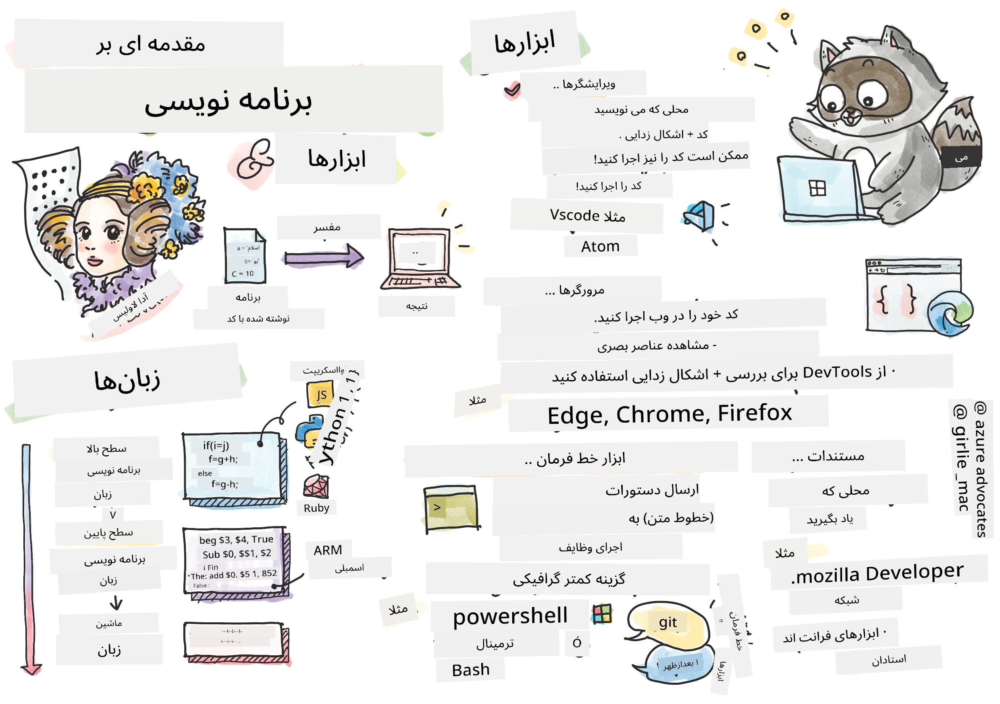
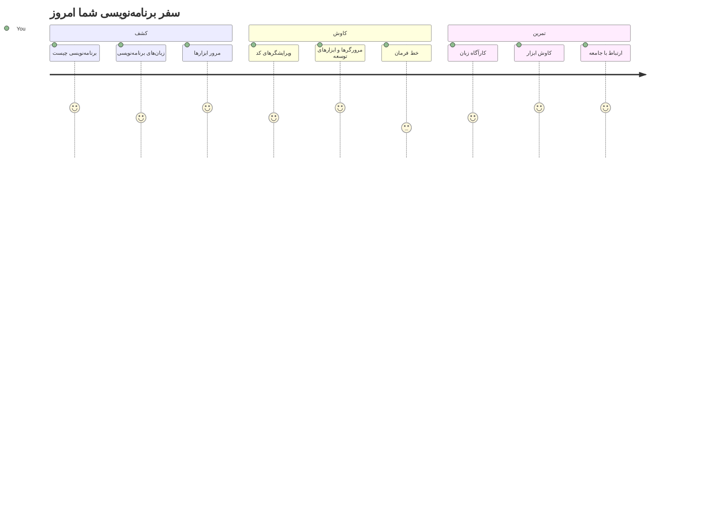
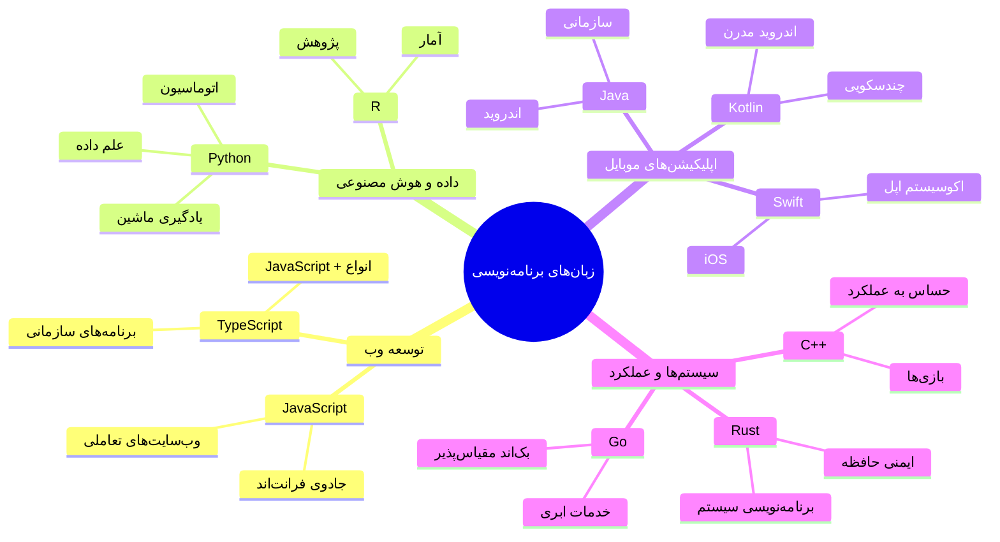
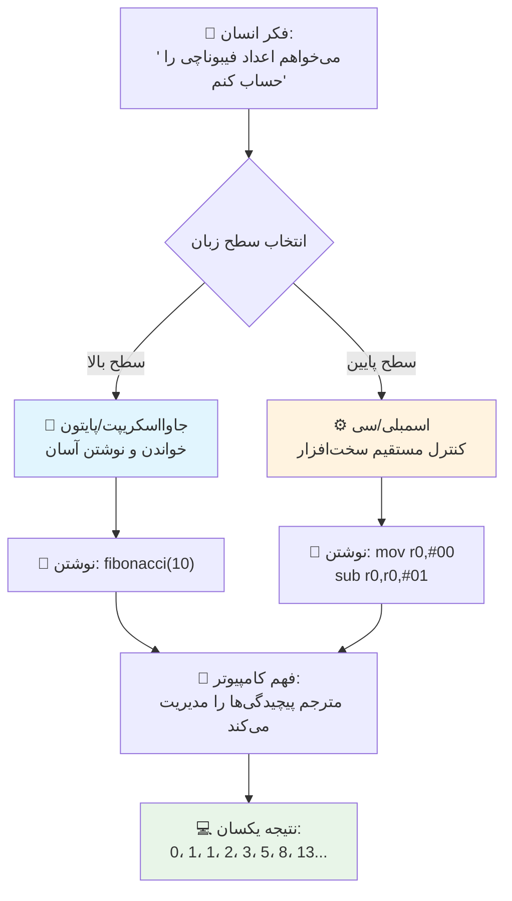
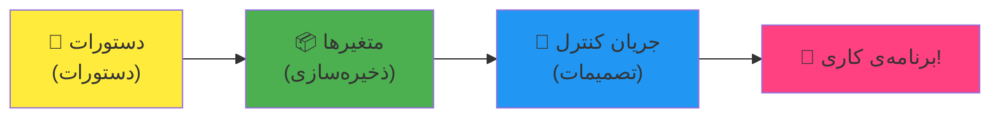
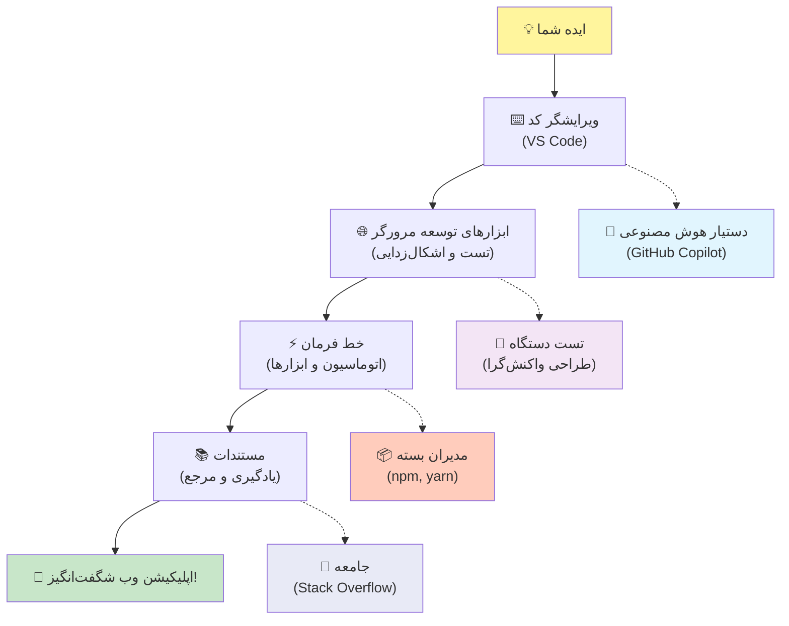
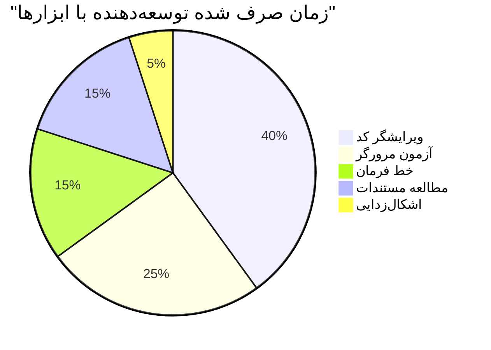
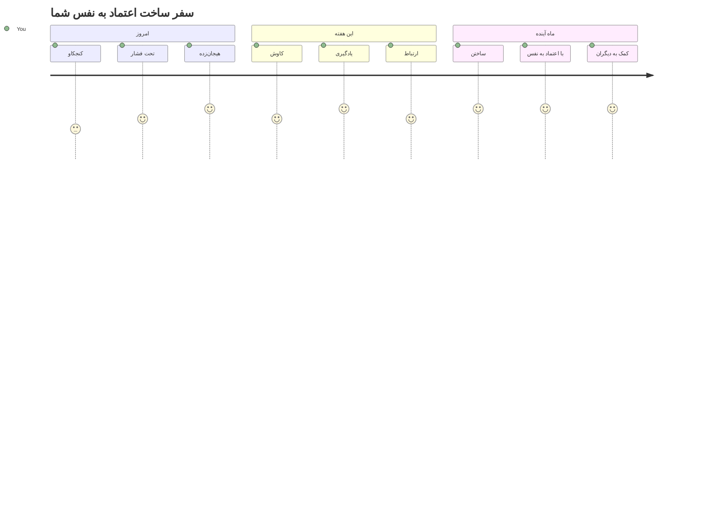

# مقدمه‌ای بر زبان‌های برنامه‌نویسی و ابزارهای مدرن توسعه‌دهندگان

سلام به تو، توسعه‌دهنده آینده! 👋 می‌توانم چیزی بهت بگویم که هر روز هنوز هم برایم هیجان‌انگیز است؟ تو در آستانه کشف این هستی که برنامه‌نویسی فقط درباره کامپیوترها نیست – بلکه درباره داشتن قدرت‌های فوق‌العاده برای زنده کردن خیال‌های دیوانه‌وار خودت است!

می‌دانی آن لحظه که در حال استفاده از اپ مورد علاقه‌ات هستی و همه چیز کاملاً درست پیش می‌رود؟ وقتی روی دکمه‌ای می‌زنی و اتفاقی کاملاً جادویی می‌افتد که باعث می‌شود بگویی «وای، آن‌ها چطور این را انجام دادند؟» خب، کسی دقیقاً مثل تو – احتمالاً در کافه مورد علاقه‌اش در ساعت دو نیمه‌شب با سومین اسپرسو – کدی نوشته که آن جادو را خلق کرده است. و این چیزیست که ذهنت را منفجر خواهد کرد: تا پایان این درس، نه تنها متوجه خواهی شد که آن‌ها چگونه این کار را کردند، بلکه مشتاق خواهی بود که خودت نیز آن را امتحان کنی!

ببین، اگر الان برنامه‌نویسی برایت ترسناک است، کاملاً درک می‌کنم. وقتی من تازه شروع کردم، واقعاً فکر می‌کردم باید نابغه ریاضی باشی یا از پنج سالگی برنامه‌نویسی می‌کردی. اما این چیزی بود که کاملاً دیدگاهم را تغییر داد: برنامه‌نویسی دقیقاً مثل یادگیری حرف زدن به یک زبان جدید است. با «سلام» و «متشکرم» شروع می‌کنی، بعد یاد می‌گیری قهوه سفارش دهی، و قبل از اینکه بفهمی، بحث‌های فلسفی عمیقی داری! البته در اینجا، تو با کامپیوترها گفت‌وگو می‌کنی، و صادقانه بگویم؟ آن‌ها صبورترین شریک گفت‌وگویی هستند که تا به حال داشته‌ای – هیچ‌وقت اشتباهاتت را قضاوت نمی‌کنند و همیشه مشتاق‌اند دوباره تلاش کنند!

امروز می‌خواهیم ابزارهای شگفت‌انگیزی را کشف کنیم که توسعه وب مدرن را نه فقط ممکن، بلکه واقعاً اعتیادآور می‌کنند. منظورم همان ویرایشگرها، مرورگرها، و جریان‌های کاری است که توسعه‌دهندگان نتفلیکس، اسپاتیفای و استودیوهای اپ مستقل مورد علاقه‌ات هر روز استفاده می‌کنند. و این بخش هیجان‌انگیز است: بیشتر این ابزارهای حرفه‌ای و استاندارد صنعتی کاملاً رایگان هستند!


> اسکچ‌نوت توسط [Tomomi Imura](https://twitter.com/girlie_mac)


```mermaid
journey
    title سفر برنامه‌نویسی شما امروز
    section کشف
      برنامه‌نویسی چیست: 5: You
      زبان‌های برنامه‌نویسی: 4: You
      مرور ابزارها: 5: You
    section کاوش
      ویرایشگرهای کد: 4: You
      مرورگرها و ابزارهای توسعه: 5: You
      خط فرمان: 3: You
    section تمرین
      کارآگاه زبان: 4: You
      کاوش ابزار: 5: You
      ارتباط با جامعه: 5: You
```
## بیایید ببینیم که اکنون چه می‌دانی!

قبل از اینکه وارد قسمت‌های جذاب شویم، کنجکاوم بدانم – درباره دنیای برنامه‌نویسی چه چیزهایی از قبل می‌دانی؟ و گوش کن، اگر به این سوالات نگاه می‌کنی و فکر می‌کنی «من واقعاً هیچ ایده‌ای درباره این‌ها ندارم»، این نه فقط خوب است، بلکه عالی است! یعنی دقیقاً در جای درستی هستی. این آزمون را مثل گرم‌کردن عضلات قبل از ورزش در نظر بگیر – ما فقط در حال گرم کردن مغزمان هستیم!

[آزمون پیش‌درس را انجام بده](https://ff-quizzes.netlify.app/web/)


## ماجراجویی که با هم شروع می‌کنیم

خب، واقعاً از هیجان برای چیزهایی که امروز قراره کشف کنیم نمی‌توانم بند بیایم! جدی می‌گویم، دلم می‌خواهد صورتت را وقتی برخی از این مفاهیم برایت روشن می‌شوند ببینم. این سفر شگفت‌انگیزی است که با هم خواهیم داشت:

- **برنامه‌نویسی دقیقاً چیست (و چرا باحال‌ترین چیز دنیاست!)** – قرار است کشف کنیم کد به معنای واقعی جادوی نامرئی است که همه چیز اطراف تو را به حرکت درمی‌آورد، از آن آلارمی که به‌ط somehowقی می‌داند شنبه است تا الگوریتمی که بهترین توصیه‌های نتفلیکس را به تو می‌دهد
- **زبان‌های برنامه‌نویسی و شخصیت‌های شگفت‌انگیزشان** – تصور کن وارد یک مهمانی شوی که هر نفر قدرت‌های فوق‌العاده و روش‌های کاملاً متفاوت برای حل مسائل دارد. جهان زبان‌های برنامه‌نویسی دقیقاً همین است و تو عاشق آشنا شدن با آن‌ها خواهی شد!
- **بلوک‌های سازنده اصلی که جادوی دیجیتال را می‌سازند** – این‌ها را مثل یک مجموعه لگوی خلاقانه نهایی تصور کن. وقتی بفهمی که این قطعات چگونه کنار هم قرار می‌گیرند، متوجه می‌شوی که می‌توانی هر چیزی را که در ذهنت می‌گنجد بسازی
- **ابزارهای حرفه‌ای که باعث می‌شوند احساس کنی جادوگری با عصای جادویی در دستانت نگرفته‌ای** – دارم بزرگ‌نمایی نمی‌کنم – این ابزارها واقعاً باعث می‌شوند احساس کنی قدرت‌های فوق‌العاده داری، و بهترین قسمت؟ همان ابزارهایی هستند که حرفه‌ای‌ها استفاده می‌کنند!

> 💡 **نکته این است**: اصلاً به خودت فشار نیاور که امروز همه چیز را حفظ کنی! الان فقط می‌خواهم آن جرقه هیجان را درباره امکانات ممکن حس کنی. جزئیات به طور طبیعی زمانی که با هم تمرین می‌کنیم جا می‌افتند – این یعنی یادگیری واقعی!

> می‌توانی این درس را در [Microsoft Learn](https://learn.microsoft.com/en-us/learn/modules/web-development-101/introduction-programming/?WT.mc_id=academic-77807-sagibbon) نیز دنبال کنی!

## پس برنامه‌نویسی دقیقاً چیست؟

خب، بیایید به سوال میلیون دلاری برسیم: برنامه‌نویسی واقعا چیست؟

داستانی برایت تعریف می‌کنم که ذهنم را کاملاً تغییر داد. هفته گذشته داشتم برای مادرم توضیح می‌دادم چگونه از ریموت تلویزیون هوشمند جدیدمان استفاده کند. خودم را دیدم که می‌گویم «دکمه قرمز را بزن، اما نه دکمه قرمز بزرگ، دکمه قرمز کوچک سمت چپ... نه، سمت چپ دیگرت... خب، حالا نگه دار به مدت دو ثانیه، نه یک، نه سه...» این آشنا نیست؟ 😅

این یعنی برنامه‌نویسی! هنر دادن دستورالعمل‌های دقیق و مرحله به مرحله به چیزی که بسیار قدرتمند است اما نیاز دارد همه چیز با دقت بیان شود. البته به جای اینکه برای مادرت توضیح دهی (که می‌تواند بپرسد «کدام دکمه قرمز؟!»)، داری به کامپیوتر توضیح می‌دهی (که دقیقاً همان کاری را می‌کند که می‌گویی، حتی اگر منظور تو کاملاً همان نباشد).

چیزی که وقتی اول این را یاد گرفتم شگفت‌زده‌ام کرد این بود: کامپیوترها در اصل خیلی ساده هستند. آن‌ها واقعاً فقط دو چیز را می‌فهمند – ۱ و ۰ که در اصل یعنی «بله» و «خیر» یا «روشن» و «خاموش». همین! اما اینجا جادویی می‌شود – ما لازم نیست مثل فیلم ماتریکس با ۱ و ۰ حرف بزنیم. اینجاست که **زبان‌های برنامه‌نویسی** وارد می‌شوند. آن‌ها مثل بهترین مترجم دنیا هستند که افکار کاملاً عادی انسانیت را به زبان کامپیوتر ترجمه می‌کنند.

و این چیزی است که هر صبح وقتی بیدار می‌شوم هنوز هم واقعاً هوش از سرم می‌پراند: همه چیز دیجیتال در زندگی‌ات از کسی شروع شده که دقیقاً مثل تو بود، احتمالاً در لباس خواب در حال نوشیدن قهوه، در لپ‌تاپش کد می‌نوشت. آن فیلتر اینستاگرامی که تو را بی‌نقص نشان می‌دهد؟ کسی آن را کد زده. توصیه‌ای که تو را به آهنگ جدید مورد علاقه‌ات رساند؟ توسعه‌دهنده‌ای آن الگوریتم را ساخت. اپی که به تو کمک می‌کند حساب شام را با دوستان تقسیم کنی؟ بله، کسی فکر کرد «این اذیت‌کننده است، شاید بتوانم درستش کنم» و سپس... درستش کرد!

وقتی برنامه‌نویسی را یاد می‌گیری، فقط یک مهارت جدید نمی‌آموزی – بخشی از این جامعه فوق‌العاده حل‌کنندگان مسئله می‌شوی که روزهایشان را صرف فکر کردن می‌کنند: «چه می‌شد اگر چیزی بسازم که روز کسی را کمی بهتر کند؟» واقعاً چیز جذاب‌تری از این وجود دارد؟

✅ **شکار حقیقت جالب:** وقتی وقت آزاد داری این را جستجو کن – به نظر تو اولین برنامه‌نویس کامپیوتر جهان چه کسی بود؟ نکته‌ای بهت می‌دهم: احتمالاً کسی نیست که انتظارش را داری! داستان این شخص بسیار جالب است و نشان می‌دهد که برنامه‌نویسی همیشه درباره حل خلاقانه مسائل و فکر کردن خارج از چارچوب بوده.

### 🧠 **زمان بررسی: حالت چطور است؟**

**کمی وقت بگذار و فکر کن:**
- آیا ایده «دادن دستور به کامپیوتر» الان برایت معنا پیدا کرده؟
- می‌توانی کاری روزمره را که دوست داری با برنامه‌نویسی خودکار کنی، فکر کنی؟
- چه سوالاتی درباره این دنیای برنامه‌نویسی در ذهنت شکل گرفته‌اند؟

> **یادت باشد**: اگر برخی مفاهیم الان کمی مبهم باشند کاملاً طبیعی است. یادگیری برنامه‌نویسی مثل یادگیری زبان جدید است – مغزت زمان می‌برد تا مسیرهای عصبی جدید بسازد. تو داری عالی پیش می‌روی!

## زبان‌های برنامه‌نویسی مثل طعم‌های مختلف جادو هستند

خب، شاید عجیب به نظر برسد، اما با من همراه باش – زبان‌های برنامه‌نویسی خیلی شبیه انواع موسیقی هستند. فکر کن: جاز که نرم و بداهه‌ساز است، راک که قدرتمند و ساده است، کلاسیک که زیبا و ساختاربندی شده است، و هیپ‌هاپ که خلاق و پر بیان است. هر سبک حال و هوای خودش را دارد، جامعه‌ای از طرفداران پرشور دارد، و هر کدام برای حال و هوا و موقعیت‌های متفاوتی عالی هستند.

زبان‌های برنامه‌نویسی هم دقیقاً همین طور عمل می‌کنند! تو از یک زبان یکسان برای ساخت بازی موبایلی سرگرم‌کننده استفاده نمی‌کنی که برای پردازش عظیم داده‌های آب و هوا به کار ببری، مثل اینکه در کلاس یوگا موسیقی دث متال پخش نکنی (خُب، بیشتر کلاس‌های یوگا البته! 😄).

اما چیزی که هر بار به آن فکر می‌کنم من را حیرت‌زده می‌کند این است: این زبان‌ها مثل وجود با صبرترین و نابغه‌ترین مترجم دنیا کنار شما هستند. تو می‌توانی ایده‌هایت را به روشی بیان کنی که برای مغز انسانیت طبیعی است، و آن‌ها کل کار بسیار پیچیده ترجمه به زبان صفر و یکی را که کامپیوترها واقعاً حرف می‌زنند، انجام می‌دهند. دقیقاً مثل داشتن دوستی که کاملاً به هر دو زبان «خلاقیت انسانی» و «منطق کامپیوتری» مسلط است – و هرگز خسته نمی‌شود، استراحت قهوه لازم ندارد، و هیچ‌وقت قضاوت نمی‌کند اگر بار دوم همان سوال را بپرسی!

### زبان‌های برنامه‌نویسی محبوب و کاربردشان


```mermaid
mindmap
  root((زبان‌های برنامه‌نویسی))
    توسعه وب
      JavaScript
        جادوی فرانت‌اند
        وب‌سایت‌های تعاملی
      TypeScript
        JavaScript + انواع
        برنامه‌های سازمانی
    داده و هوش مصنوعی
      Python
        علم داده
        یادگیری ماشین
        اتوماسیون
      R
        آمار
        پژوهش
    اپلیکیشن‌های موبایل
      Java
        اندروید
        سازمانی
      Swift
        iOS
        اکوسیستم اپل
      Kotlin
        اندروید مدرن
        چندسکویی
    سیستم‌ها و عملکرد
      C++
        بازی‌ها
        حساس به عملکرد
      Rust
        ایمنی حافظه
        برنامه‌نویسی سیستم
      Go
        خدمات ابری
        بک‌اند مقیاس‌پذیر
```
| زبان | بهترین کاربرد | چرا محبوب است |
|----------|----------|------------------|
| **JavaScript** | توسعه وب، رابط‌های کاربری | در مرورگرها اجرا می‌شود و وب‌سایت‌های تعاملی را امکان‌پذیر می‌کند |
| **Python** | علم داده، خودکارسازی، هوش مصنوعی | آسان برای خواندن و یادگیری، کتابخانه‌های قدرتمند |
| **Java** | برنامه‌های سازمانی، اپ‌های اندروید | مستقل از پلتفرم، مقاوم برای سیستم‌های بزرگ |
| **C#** | برنامه‌های ویندوز، توسعه بازی | پشتیبانی قوی از اکوسیستم مایکروسافت |
| **Go** | خدمات ابری، سیستم‌های بک‌اند | سریع، ساده، طراحی شده برای رایانش مدرن |

### زبان‌های سطح بالا در برابر سطح پایین

خب، این واقعاً مفهومی بود که وقتی اول یاد می‌گرفتم مغزم را تحت تاثیر قرار داد، پس می‌خواهم مثالی بزنم که بالاخره برایم کاملاً روشنش کرد – و امیدوارم برای تو هم مفید باشد!

تصور کن در کشوری هستی که زبانش را بلد نیستی و خیلی فوری باید نزدیک‌ترین دستشویی را پیدا کنی (ما همه این داستان را داشتیم، درست است؟ 😅):

- **برنامه‌نویسی سطح پایین** مثل یادگیری کاملی گویش محلی است تا بتوانی با مادربزرگ میوه‌فروش گوشه خیابان صحبت کنی، با اصطلاحات فرهنگی، زبان محلی و شوخی‌های درونی که فقط کسی که آنجا بزرگ شده می‌فهمد. فوق‌العاده تاثیرگذار و بسیار کارآمد... اگر تسلط داشته باشی! ولی وقتی فقط دنبال دستشویی هستی خیلی سنگین است.

- **برنامه‌نویسی سطح بالا** مثل داشتن آن دوست محلی فوق‌العاده‌ای است که کاملاً تو را درک می‌کند. می‌توانی به انگلیسی ساده بگویی «واقعاً باید یک دستشویی پیدا کنم» و او همه ترجمه فرهنگی را انجام می‌دهد و به روشی که برای مغز غیرمحلی تو کاملاً قابل فهم است آدرس می‌دهد.

در زبان برنامه‌نویسی:
- **زبان‌های سطح پایین** (مثل اسمبلی یا C) به تو اجازه می‌دهند گفت‌وگوی دقیق و مفصل با سخت‌افزار واقعی کامپیوتر داشته باشی، اما باید مثل یک ماشین فکر کنی که... خب، بگذار بگویم تغییر ذهنی خیلی بزرگی است!
- **زبان‌های سطح بالا** (مثل جاوااسکریپت، پایتون یا C#) اجازه می‌دهند مثل یک انسان فکر کنی و آن‌ها کار زبان ماشینی پشت صحنه را انجام می‌دهند. بعلاوه، این زبان‌ها جوامع فوق‌العاده صمیمی دارند که یادشان می‌آید تازه‌کار بودن چگونه است و واقعاً می‌خواهند کمک کنند!

حدس بزن چه زبان‌هایی را پیشنهاد می‌کنم با آن‌ها شروع کنی؟ 😉 زبان‌های سطح بالا مثل چرخ‌های آموزشی هستند که هرگز نمی‌خواهی از آن‌ها جدا شوی چون کل تجربه را بسیار لذت‌بخش‌تر می‌کنند!


```mermaid
flowchart TB
    A["👤 فکر انسان:<br/>'می‌خواهم اعداد فیبوناچی را حساب کنم'"] --> B{انتخاب سطح زبان}
    
    B -->|سطح بالا| C["🌟 جاوااسکریپت/پایتون<br/>خواندن و نوشتن آسان"]
    B -->|سطح پایین| D["⚙️ اسمبلی/سی<br/>کنترل مستقیم سخت‌افزار"]
    
    C --> E["📝 نوشتن: fibonacci(10)"]
    D --> F["📝 نوشتن: mov r0,#00<br/>sub r0,r0,#01"]
    
    E --> G["🤖 فهم کامپیوتر:<br/>مترجم پیچیدگی‌ها را مدیریت می‌کند"]
    F --> G
    
    G --> H["💻 نتیجه یکسان:<br/>0، 1، 1، 2، 3، 5، 8، 13..."]
    
    style C fill:#e1f5fe
    style D fill:#fff3e0
    style H fill:#e8f5e8
```
### اجازه بده نشان دهم چرا زبان‌های سطح بالا دوستانه‌تر هستند

خوب، الان می‌خواهم چیزی به تو نشان دهم که دقیقاً دلیل عشقم به زبان‌های سطح بالا را نشان می‌دهد، اما اول – باید برایم قول بدهی. وقتی اولین نمونه کد را دیدی، نترس! قرار نیست ترسناک به نظر برسد. این دقیقاً همان نکته‌ای است که می‌خواهم بگویم!

ما همین کار را در دو سبک کاملاً متفاوت انجام خواهیم داد. هر دو دنباله فیبوناچی را تولید می‌کنند – الگوی زیبای ریاضی که هر عدد جمع دو عدد قبل خود است: ۰، ۱، ۱، ۲، ۳، ۵، ۸، ۱۳... (نکته جالب: این الگو واقعاً در همه جای طبیعت پیدا می‌شود – مارپیچ‌های دانه آفتابگردان، الگوهای کاج، حتی شکل‌گیری کهکشان‌ها!)

آماده‌ای تفاوت را ببینی؟ بزن بریم!

**زبان سطح بالا (جاوااسکریپت) – مناسب انسان:**

```javascript
// مرحله ۱: تنظیم پایه‌ای دنباله فیبوناچی
const fibonacciCount = 10;
let current = 0;
let next = 1;

console.log('Fibonacci sequence:');
```

**این کد چه کار می‌کند:**
- **اعلام** یک مقدار ثابت برای مشخص کردن تعداد اعداد فیبوناچی که می‌خواهیم بسازیم
- **مقداردهی اولیه** دو متغیر برای پیگیری عدد حاضر و عدد بعدی در دنباله
- **تنظیم** مقادیر شروع (۰ و ۱) که الگوی فیبوناچی را تعریف می‌کنند
- **نمایش** یک پیام عنوان برای شناسایی خروجی ما

```javascript
// مرحله ۲: تولید دنباله با یک حلقه
for (let i = 0; i < fibonacciCount; i++) {
  console.log(`Position ${i + 1}: ${current}`);
  
  // محاسبه عدد بعدی در دنباله
  const sum = current + next;
  current = next;
  next = sum;
}
```

**چه اتفاقی اینجا می‌افتد:**
- **در حلقه** با استفاده از حلقه `for` از هر موقعیت در دنباله عبور می‌کند
- **نمایش** هر عدد همراه با موقعیت آن با فرمت قالب رشته
- **محاسبه** عدد بعدی فیبوناچی با جمع کردن حاضر و بعدی
- **بروزرسانی** متغیرهای پیگیری برای حرکت به تکرار بعدی

```javascript
// مرحله ۳: رویکرد تابعی مدرن
const generateFibonacci = (count) => {
  const sequence = [0, 1];
  
  for (let i = 2; i < count; i++) {
    sequence[i] = sequence[i - 1] + sequence[i - 2];
  }
  
  return sequence;
};

// مثال استفاده
const fibSequence = generateFibonacci(10);
console.log(fibSequence);
```

**در کد بالا ما:**
- **تابعی چندبار استفاده‌شدنی** با استفاده از نحو تابع فلش مدرن ساخته‌ایم
- **آرایه‌ای ساخته‌ایم** تا دنباله کامل را ذخیره کنیم به جای نمایش یک به یک
- **از ایندکس‌آرایه استفاده کرده‌ایم** تا هر عدد جدید را از مقادیر قبلی محاسبه کنیم
- **دنباله کامل را برگردانده‌ایم** برای استفاده انعطاف‌پذیر در بخش‌های دیگر برنامه

**زبان سطح پایین (اسمبلی ARM) – مناسب کامپیوتر:**

```assembly
 area ascen,code,readonly
 entry
 code32
 adr r0,thumb+1
 bx r0
 code16
thumb
 mov r0,#00
 sub r0,r0,#01
 mov r1,#01
 mov r4,#10
 ldr r2,=0x40000000
back add r0,r1
 str r0,[r2]
 add r2,#04
 mov r3,r0
 mov r0,r1
 mov r1,r3
 sub r4,#01
 cmp r4,#00
 bne back
 end
```

توجه کن چگونه نسخه جاوااسکریپت تقریباً مثل دستورات انگلیسی می‌خواند، در حالی که نسخه اسمبلی از دستورات رمزگونه‌ای استفاده می‌کند که مستقیماً پردازنده کامپیوتر را کنترل می‌کند. هر دو دقیقاً همان کار را انجام می‌دهند، اما زبان سطح بالا برای انسان‌ها خیلی راحت‌تر است که بفهمند، بنویسند و نگهداری کنند.

**تفاوت‌های کلیدی که متوجه خواهی شد:**
- **خوانایی**: جاوااسکریپت از نام‌های توصیفی مانند `fibonacciCount` استفاده می‌کند در حالی که اسمبلی از برچسب‌های رمزی مانند `r0`، `r1` بهره می‌برد  
- **توضیحات**: زبان‌های سطح بالا تشویق به نوشتن کامنت‌های توضیحی می‌کنند که کد را خودمستند می‌سازد  
- **ساختار**: جریان منطقی جاوااسکریپت مطابق با نحوه تفکر انسان‌ها در مورد مسائل گام به گام است  
- **نگهداری**: به‌روزرسانی نسخه جاوااسکریپت برای نیازهای مختلف ساده و واضح است  

✅ **درباره دنباله فیبوناچی**: این الگوی عددی فوق‌العاده زیبا (که هر عدد برابر است با مجموع دو عدد قبلی: ۰، ۱، ۱، ۲، ۳، ۵، ۸...) عملاً در *همه‌جا* در طبیعت ظاهر می‌شود! این دنباله را در مارپیچ‌های گل آفتابگردان، الگوهای کاج، نحوه خم شدن صدف ناوتیلوس و حتی نحوه رشد شاخه‌های درخت خواهید یافت. واقعاً عجیب است که چگونه ریاضیات و کد می‌توانند به ما کمک کنند الگوهایی را که طبیعت برای خلق زیبایی استفاده می‌کند، درک و بازآفرینی کنیم!

## بلوک‌های سازنده‌ای که جادو را رقم می‌زنند

خُب، حالا که دیدید زبان‌های برنامه‌نویسی چگونه در عمل به نظر می‌رسند، بیایید قطعات بنیادی که عملاً هر برنامه‌ای از آن‌ها ساخته شده است را تجزیه و تحلیل کنیم. به این‌ها مانند اجزای ضروری در دستور پخت مورد علاقه شما فکر کنید – وقتی بفهمید هر کدام چه کار می‌کنند، می‌توانید تقریباً در هر زبانی کد بخوانید و بنویسید!

این کمی شبیه یادگیری دستور زبان برنامه‌نویسی است. یادتان می‌آید در مدرسه چطور درباره اسم‌ها، فعل‌ها و چگونگی ساخت جملات یاد گرفتید؟ برنامه‌نویسی هم دستور زبان خاص خودش را دارد، و راستش کمی منطقی‌تر و بخشنده‌تر از دستور زبان انگلیسی است! 😄

### دستورات: راهنمای گام به گام

با **دستورات** شروع کنیم – این‌ها مانند جملات جداگانه در گفت‌وگو با کامپیوتر شما هستند. هر دستور به کامپیوتر می‌گوید یک کار مشخص انجام دهد، مثل دادن دستور: «اینجا بپیچ به چپ»، «سر چراغ قرمز بایست»، «تو آن جای پارک پارک کن.»

چیزی که درباره دستورات دوست دارم، خوانایی آن‌هاست. مثلاً این را ببین:

```javascript
// دستورات پایه‌ای که اقدامات منفرد را انجام می‌دهند
const userName = "Alex";                    
console.log("Hello, world!");              
const sum = 5 + 3;                         
```
  
**این کد چه کاری انجام می‌دهد:**  
- **اعلان** یک متغیر ثابت برای ذخیره نام کاربر  
- **نمایش** پیام خوش‌آمدگویی در خروجی کنسول  
- **محاسبه** و ذخیره نتیجه یک عملیات ریاضی  

```javascript
// عبارت‌هایی که با صفحات وب تعامل دارند
document.title = "My Awesome Website";      
document.body.style.backgroundColor = "lightblue";
```
  
**گام به گام، اینجا چه اتفاقی می‌افتد:**  
- **تغییر** عنوان صفحه وب که در تب مرورگر نمایش داده می‌شود  
- **تغییر** رنگ پس‌زمینه کل محتوای صفحه  

### متغیرها: حافظه برنامه شما

خب، **متغیرها** واقعاً یکی از مفاهیم مورد علاقه من برای آموزش هستند چون خیلی شبیه به چیزهایی هستند که هر روز استفاده می‌کنید!

برای یک لحظه به دفترچه تلفن گوشی‌تان فکر کنید. شما شماره همه را حفظ نمی‌کنید – به جای آن، «مامان»، «بهترین دوست» یا «فروشگاه پیتزایی که تا ساعت ۲ صبح تحویل می‌دهد» را ذخیره می‌کنید و گوشی شما شماره‌ها را به یاد می‌سپارد. متغیرها دقیقاً همین‌طورند! آن‌ها مانند ظرف‌های برچسب‌دار هستند که برنامه شما می‌تواند اطلاعات را در آن ذخیره و بعد با نامی که معنی دارد فراخوانی کند.

حاصل کار خیلی جالب است: متغیرها می‌توانند هنگام اجرای برنامه تغییر کنند (به همین دلیل به آنها متغیر می‌گویند). درست مثل اینکه ممکن است وقتی فروشگاه پیتزایی بهتری پیدا کنید شماره را به‌روزرسانی کنید، متغیرها هم می‌توانند در طول اجرای برنامه به‌روزرسانی شوند چون برنامه اطلاعات جدید یاد می‌گیرد یا شرایط تغییر می‌کند!

اجازه دهید نشان دهم چقدر می‌تواند ساده و زیبا باشد:

```javascript
// گام ۱: ایجاد متغیرهای پایه
const siteName = "Weather Dashboard";        
let currentWeather = "sunny";               
let temperature = 75;                       
let isRaining = false;                      
```
  
**درک این مفاهیم:**  
- **ذخیره** مقادیر ثابت در متغیرهای `const` (مثل نام سایت)  
- **استفاده** از `let` برای مقادیری که می‌توانند در کل برنامه تغییر کنند  
- **اختصاص** انواع مختلف داده: رشته‌ها (متن)، اعداد، و بولین‌ها (true/false)  
- **انتخاب** نام‌های توصیفی که توضیح می‌دهند هر متغیر چه چیز دارد  

```javascript
// گام ۲: کار با اشیاء برای گروه‌بندی داده‌های مرتبط
const weatherData = {                       
  location: "San Francisco",
  humidity: 65,
  windSpeed: 12
};
```
  
**در مثال بالا:**
- **ساخت** یک شیء برای گروه‌بندی داده‌های هواشناسی مرتبط  
- **سازمان‌دهی** چندین داده تحت یک نام متغیر  
- **استفاده** از جفت‌های کلید-مقدار برای برچسب زدن واضح اطلاعات  

```javascript
// مرحله ۳: استفاده و به‌روزرسانی متغیرها
console.log(`${siteName}: Today is ${currentWeather} and ${temperature}°F`);
console.log(`Wind speed: ${weatherData.windSpeed} mph`);

// به‌روزرسانی متغیرهای قابل تغییر
currentWeather = "cloudy";                  
temperature = 68;                          
```
  
**اجزای هر بخش:**  
- **نمایش** اطلاعات با استفاده از قالب‌بندی رشته‌ها (template literals) با نحو `${}`  
- **دسترسی** به خصوصیات شیء با نقطه (مثل `weatherData.windSpeed`)  
- **به‌روزرسانی** متغیرهای تعریف‌شده با `let` برای نمایش شرایط متغیر  
- **ترکیب** چند متغیر برای ساخت پیام‌های معنادار  

```javascript
// مرحله ۴: تخریب مدرن برای کد تمیزتر
const { location, humidity } = weatherData; 
console.log(`${location} humidity: ${humidity}%`);
```
  
**نکات مهم:**  
- **استخراج** خصوصیات خاص از اشیاء با دسرتراکچری (تخصیص تجزیه‌ای)  
- **ساخت** خودکار متغیرهای جدید با همان نام کلیدهای شیء  
- **سادگی** کد با اجتناب از تکرار زیاد نحوه دسترسی نقطه‌ای  

### جریان کنترل: آموزش به برنامه برای تفکر

خب، اینجاست که برنامه‌نویسی کاملاً شگفت‌انگیز می‌شود! **جریان کنترل** اساساً آموزش برنامه‌تان است تا تصمیم‌های هوشمندانه بگیرد، درست مثل خود شما که هر روز بدون فکر کردن این کار را می‌کنید.

تصور کنید: امروز صبح احتمالاً چیزی شبیه به این را طی کردید «اگر باران می‌آید، چتر برمی‌دارم. اگر هوا سرد است، کاپشن می‌پوشم. اگر دیر شده باشم، صبحانه نمی‌خورم و onderweg قهوه می‌گیرم.» مغز شما به‌طور طبیعی این منطق‌های اگر-آنگاه را ده‌ها بار در روز دنبال می‌کند!

همین باعث می‌شود برنامه‌ها هوشمند و زنده به نظر برسند، نه اینکه فقط یک اسکریپت خسته‌کننده و قابل پیش‌بینی اجرا کنند. آن‌ها واقعاً می‌توانند یک وضعیت را ببینند، آنچه در جریان است را ارزیابی کنند و به درستی پاسخ دهند. انگار به برنامه‌تان مغزی داده‌اید که بتواند سازگار باشد و انتخاب کند!

می‌خواهید ببینید چقدر زیبا کار می‌کند؟ اجازه دهید نشان دهم:

```javascript
// مرحله ۱: منطق شرطی پایه
const userAge = 17;

if (userAge >= 18) {
  console.log("You can vote!");
} else {
  const yearsToWait = 18 - userAge;
  console.log(`You'll be able to vote in ${yearsToWait} year(s).`);
}
```
  
**این کد چه کاری انجام می‌دهد:**  
- **بررسی** اینکه آیا سن کاربر برای رای دادن کافی است  
- **اجرا** بلوک‌های کد متفاوت بر اساس نتیجه شرایط  
- **محاسبه** و نمایش مدت زمان باقی‌مانده تا مجاز شدن به رای دادن اگر زیر ۱۸ سال باشد  
- **ارائه** بازخورد مشخص و مفید برای هر سناریو  

```javascript
// گام ۲: شرایط متعدد با عملگرهای منطقی
const userAge = 17;
const hasPermission = true;

if (userAge >= 18 && hasPermission) {
  console.log("Access granted: You can enter the venue.");
} else if (userAge >= 16) {
  console.log("You need parent permission to enter.");
} else {
  console.log("Sorry, you must be at least 16 years old.");
}
```
  
**تجزیه و تحلیل اتفاقات اینجا:**  
- **ترکیب** چند شرط با استفاده از عملگر `&&` (و)  
- **ساخت** یک سلسله مراتب شرط با `else if` برای شرایط متعدد  
- **رسیدگی** به همه موارد ممکن با یک دستور نهایی `else`  
- **دادن** بازخورد واضح و کاربردی برای هر وضعیت متفاوت  

```javascript
// مرحله ۳: شرط مختصر با عملگر سه‌تایی
const votingStatus = userAge >= 18 ? "Can vote" : "Cannot vote yet";
console.log(`Status: ${votingStatus}`);
```
  
**چیزی که باید به یاد داشته باشید:**  
- **استفاده** از عملگر سه‌تایی (`؟ :`) برای شرایط ساده دوگزینه‌ای  
- **نوشتن** ابتدا شرط سپس `?`، نتیجه درست، `:`، سپس نتیجه نادرست  
- **کاربرد** این الگو هنگام نیاز به اختصاص مقادیر بر اساس شرط  

```javascript
// مرحله ۴: مدیریت چندین مورد خاص
const dayOfWeek = "Tuesday";

switch (dayOfWeek) {
  case "Monday":
  case "Tuesday":
  case "Wednesday":
  case "Thursday":
  case "Friday":
    console.log("It's a weekday - time to work!");
    break;
  case "Saturday":
  case "Sunday":
    console.log("It's the weekend - time to relax!");
    break;
  default:
    console.log("Invalid day of the week");
}
```
  
**این کد انجام می‌دهد:**  
- **مقایسه** مقدار متغیر با چندین حالت خاص  
- **گروه‌بندی** حالت‌های مشابه (روزهای هفته در مقابل تعطیلات آخر هفته)  
- **اجرای** بلوک کد مناسب هنگام یافتن تطبیق  
- **شامل** حالت پیش‌فرض (`default`) برای مدیریت مقادیر غیرمنتظره  
- **استفاده** از دستورات `break` برای جلوگیری از ادامه به حالت بعدی  

> 💡 **مثال واقعی**: جریان کنترل را مانند این تصور کنید که صبورترین GPS جهان به شما مسیر می‌دهد. می‌گوید «اگر ترافیک در خیابان اصلی است، به جای آن از بزرگراه برو. اگر ساخت و ساز بزرگراه را بسته است، مسیر دیدنی را امتحان کن.» برنامه‌ها دقیقاً از همین منطق شرطی برای پاسخ هوشمندانه به شرایط مختلف استفاده می‌کنند و همیشه بهترین تجربه ممکن را برای کاربران فراهم می‌آورند.

### 🎯 **بررسی مفهوم: تسلط بر بلوک‌های سازنده**

**بیایید ببینیم چطوری با اصول کار می‌کنید:**  
- آیا می‌توانید تفاوت یک متغیر با یک دستور را با کلمات خودتان توضیح دهید؟  
- یک موقعیت واقعی را تصور کنید که در آن از تصمیم‌گیری اگر-آنگاه استفاده می‌کنید (مثل مثال رای دادن ما)  
- یک چیز درباره منطق برنامه‌نویسی که برایتان شگفت‌آور بوده چیست؟  

**تقویت اعتماد به نفس سریع:**  

```mermaid
flowchart LR
    A["📝 دستورات<br/>(دستورات)"] --> B["📦 متغیرها<br/>(ذخیره‌سازی)"] --> C["🔀 جریان کنترل<br/>(تصمیمات)"] --> D["🎉 برنامه‌ی کاری!"]
    
    style A fill:#ffeb3b
    style B fill:#4caf50
    style C fill:#2196f3
    style D fill:#ff4081
```  
✅ **قدم بعد چیست**: ما قراره با هم حسابی لذت ببریم و عمیق‌تر به این مفاهیم بپردازیم! همین حالا فقط روی حس هیجان نسبت به همه فرصت‌های شگفت‌انگیزی که پیش رو دارید تمرکز کنید. مهارت‌ها و تکنیک‌های خاص به‌طور طبیعی در حین تمرین با هم رشد خواهند کرد – قول می‌دهم خیلی بیشتر از آنچه انتظار دارید سرگرم‌کننده خواهد بود!

## ابزارهای کار

خُب، واقعاً اینجا جایی است که هیجان‌زده می‌شوم تا جایی که نمی‌توانم خودم را کنترل کنم! 🚀 قراره درباره ابزارهای فوق‌العاده‌ای صحبت کنیم که باعث می‌شوند احساس کنید کلیدهای یک سفینه دیجیتال به دستتان رسیده است.

می‌دانید چطور یک سرآشپز چاقوهای متعادل‌شده عالی دارد که انگار بخشی از دستش هستند؟ یا نوازنده‌ای که یک گیتار دارد که همین که لمسش می‌کند شروع به نواختن می‌کند؟ خب، توسعه‌دهندگان ابزار جادویی مشابه خودشان را دارند، و این چیزی است که کاملاً شما را شگفت‌زده خواهد کرد – بیشتر آن‌ها کاملاً رایگان هستند!

عملاً از صندلی‌ام بالا و پایین می‌روم که قرار است این‌ها را با شما به اشتراک بگذارم چون به کل نحوه ساخت نرم‌افزار را تغییر داده‌اند. داریم درباره دستیاران برنامه‌نویسی مبتنی بر هوش مصنوعی صحبت می‌کنیم که به شما کمک می‌کنند کد بنویسید (اصلاً شوخی نمی‌کنم!)، محیط‌های ابری که می‌توانید از هر جایی با وای‌فای کل برنامه‌ها را بسازید، و ابزارهای دیباگینگ چنان پیشرفته که مثل داشتن بینایی ایکس‌ری برای برنامه‌هایتان است.

و بخش شگفت‌انگیز تر این است: این‌ها ابزارهای «مبتدی» نیستند که زود از آن‌ها رد شوید. این‌ها همان ابزارهای حرفه‌ای هستند که توسعه‌دهندگان در گوگل، نتفلیکس و استودیوی اپلیکیشن مستقل مورد علاقه شما همین الان استفاده می‌کنند. وقتی از آن‌ها استفاده کنید، واقعاً احساس حرفه‌ای بودن خواهید کرد!


```mermaid
graph TD
    A["💡 ایده شما"] --> B["⌨️ ویرایشگر کد<br/>(VS Code)"] 
    B --> C["🌐 ابزارهای توسعه مرورگر<br/>(تست و اشکال‌زدایی)"]
    C --> D["⚡ خط فرمان<br/>(اتوماسیون و ابزارها)"]
    D --> E["📚 مستندات<br/>(یادگیری و مرجع)"]
    E --> F["🚀 اپلیکیشن وب شگفت‌انگیز!"]
    
    B -.-> G["🤖 دستیار هوش مصنوعی<br/>(GitHub Copilot)"]
    C -.-> H["📱 تست دستگاه<br/>(طراحی واکنش‌گرا)"]
    D -.-> I["📦 مدیران بسته<br/>(npm, yarn)"]
    E -.-> J["👥 جامعه<br/>(Stack Overflow)"]
    
    style A fill:#fff59d
    style F fill:#c8e6c9
    style G fill:#e1f5fe
    style H fill:#f3e5f5
    style I fill:#ffccbc
    style J fill:#e8eaf6
```  
### ویرایشگرهای کد و محیط‌های توسعه یکپارچه: دوستان دیجیتال جدید شما

بیایید درباره ویرایشگرهای کد صحبت کنیم – این‌ها واقعاً قرار است به مکان‌های مورد علاقه شما برای وقت گذراندن تبدیل شوند! آن‌ها را مانند پناهگاه شخصی برنامه‌نویسی‌تان تصور کنید که بیشتر وقتتان را صرف ساخت و تکمیل آثار دیجیتال خواهد کرد.

اما جادوی واقعی ویرایشگرهای مدرن اینست که آن‌ها فقط یک ویرایشگر متن معمولی نیستند. انگار بهترین، پشتیبان‌ترین مربی برنامه‌نویسی دقیقاً کنار شما نشسته است ۲۴ ساعته. غلط‌های تایپی شما را قبل از اینکه خودتان بفهمید می‌گیرند، پیشنهادهایی می‌دهند که شما را نابغه نشان می‌دهد، کمک می‌کنند بفهمید هر تکه کد چه کاری می‌کند، و بعضی حتی می‌توانند پیش‌بینی کنند شما چه می‌خواهید بنویسید و پیشنهاد تکمیل افکارتان را می‌دهند!

یادم می‌آید وقتی برای اولین بار تکمیل خودکار را کشف کردم – دقیقاً احساس می‌کردم در آینده زندگی می‌کنم. شروع می‌کنید به نوشتن، و ویرایشگرتان می‌گوید: «هی، آیا به این تابع فکر می‌کردی که دقیقاً همان کاری را می‌کند که لازم داری؟» انگار یک ذهن‌خوان به عنوان دوست کدنویسی شماست!

**چه چیزی این ویرایشگرها را فوق‌العاده می‌کند؟**

ویرایشگرهای کد مدرن امکانات فراوانی دارند که برای افزایش بهره‌وری شما طراحی شده‌اند:

| ویژگی | عملکرد | چرا مفید است |  
|---------|--------------|--------------|  
| **برجسته‌سازی نحو** | بخش‌های مختلف کد شما را رنگی می‌کند | کد خواناتر شده و خطاها بهتر دیده می‌شوند |  
| **تکمیل خودکار** | هنگام نوشتن کد پیشنهاد می‌دهد | سرعت نوشتن را بالا برده و غلط‌ها را کم می‌کند |  
| **ابزارهای خطایابی** | کمک می‌کند خطاها را پیدا و رفع کنید | ساعت‌ها وقت عیب‌یابی ذخیره می‌کند |  
| **افزونه‌ها** | ویژگی‌های تخصصی اضافه می‌کند | ویرایشگر را برای هر فناوری سفارشی می‌کند |  
| **دستیاران هوش مصنوعی** | کد و توضیح پیشنهاد می‌دهند | یادگیری و بهره‌وری را تسریع می‌کند |  

> 🎥 **منبع ویدیویی**: می‌خواهید این ابزارها را در عمل ببینید؟ این [ویدیو درباره ابزارهای کار](https://youtube.com/watch?v=69WJeXGBdxg) را برای یک مرور کامل ببینید.

#### ویرایشگرهای پیشنهادی برای توسعه وب

**[Visual Studio Code](https://code.visualstudio.com/?WT.mc_id=academic-77807-sagibbon)** (رایگان)  
- محبوب‌ترین در میان توسعه‌دهندگان وب  
- اکوسیستم افزونه بسیار عالی  
- ترمینال داخلی و ادغام با Git  
- **افزونه‌های ضروری:**  
  - [GitHub Copilot](https://marketplace.visualstudio.com/items?itemName=GitHub.copilot) - پیشنهاد کد مبتنی بر هوش مصنوعی  
  - [Live Share](https://marketplace.visualstudio.com/items?itemName=MS-vsliveshare.vsliveshare) - همکاری بلادرنگ  
  - [Prettier](https://marketplace.visualstudio.com/items?itemName=esbenp.prettier-vscode) - فرمت خودکار کد  
  - [Code Spell Checker](https://marketplace.visualstudio.com/items?itemName=streetsidesoftware.code-spell-checker) - گرفتن غلط‌های املایی در کد  

**[JetBrains WebStorm](https://www.jetbrains.com/webstorm/)** (پرداختی، رایگان برای دانشجویان)  
- ابزارهای پیشرفته دیباگ و تست  
- تکمیل هوشمند کد  
- کنترل نسخه داخلی  

**محیط‌های توسعه مبتنی بر ابر** (قیمت‌های مختلف)  
- [GitHub Codespaces](https://github.com/features/codespaces) - VS Code کامل در مرورگر شما  
- [Replit](https://replit.com/) - عالی برای یادگیری و اشتراک‌گذاری کد  
- [StackBlitz](https://stackblitz.com/) - توسعه وب فول‌استک فوری  

> 💡 **نکته شروع کار**: از Visual Studio Code شروع کنید – رایگان، پرکاربرد در صنعت و جامعه بزرگی که آموزش‌ها و افزونه‌های مفید می‌سازند دارد.

### مرورگرهای وب: آزمایشگاه مخفی توسعه شما

خب، آماده باشید که کاملاً شگفت‌زده شوید! می‌دانید چطور از مرورگرها برای گشت‌وگذار در شبکه‌های اجتماعی و تماشای ویدیو استفاده می‌کنید؟ خوب، معلوم شده که آن‌ها مدت‌هاست همین آزمایشگاه توسعه‌دهندگان شگفت‌انگیز را مخفی کرده‌اند و منتظر شما بوده‌اند که کشفش کنید!

هر بار که روی صفحه وب کلیک راست می‌کنید و «Inspect Element» را انتخاب می‌کنید، دنیایی پنهان از ابزارهای توسعه‌دهنده را باز می‌کنید که واقعاً قدرتمندتر از بعضی نرم‌افزارهای گران‌قیمتی است که من قبلاً صدها دلار بابتشان می‌پرداختم. انگار آشپزخانه معمولی شما پشت یک پنل مخفی آزمایشگاه یک سرآشپز حرفه‌ای را مخفی کرده است!
اولین باری که کسی ابزارهای توسعه‌دهنده مرورگر را به من نشان داد، نزدیک سه ساعت فقط کلیک می‌کردم و می‌گفتم «صبر کن، این هم می‌تواند این کار را بکند؟!» شما عملاً می‌توانید هر وب‌سایتی را به صورت زنده ویرایش کنید، دقیقاً ببینید همه چیز با چه سرعتی بارگذاری می‌شود، تست کنید سایتتان روی دستگاه‌های مختلف چطور نمایش داده می‌شود و حتی جاوااسکریپت را مثل یک حرفه‌ای دیباگ کنید. این فوق‌العاده شگفت‌انگیز است!

**دلیل اینکه مرورگرها سلاح مخفی شما هستند:**

زمانی که یک وب‌سایت یا برنامه وب می‌سازید، باید ببینید در دنیای واقعی چگونه به نظر می‌رسد و رفتار می‌کند. مرورگرها فقط کار شما را نمایش نمی‌دهند بلکه بازخورد دقیق درباره عملکرد، دسترسی و مشکلات احتمالی ارائه می‌کنند.

#### ابزارهای توسعه‌دهنده مرورگر (DevTools)

مرورگرهای مدرن مجموعه‌های توسعه جامعی دارند:

| دسته ابزار | عملکرد آن | نمونه مورد استفاده |
|---------------|--------------|------------------|
| **بازرس عناصر** | مشاهده و ویرایش HTML/CSS به صورت زنده | تنظیم استایل برای دیدن نتیجه فوری |
| **کنسول** | دیدن پیام‌های خطا و تست جاوااسکریپت | دیباگ مشکلات و آزمایش کد |
| **نظارت شبکه** | پیگیری بارگذاری منابع | بهینه‌سازی عملکرد و زمان بارگذاری |
| **بررسی دسترسی‌پذیری** | تست طراحی فراگیر | اطمینان از عملکرد سایت برای همه کاربران |
| **شبیه‌ساز دستگاه** | پیش‌نمایش روی اندازه‌های مختلف صفحه | تست طراحی واکنش‌گرا بدون دستگاه‌های متعدد |

#### مرورگرهای توصیه‌شده برای توسعه

- **[کروم](https://developers.google.com/web/tools/chrome-devtools/)** - ابزارهای توسعه استاندارد صنعت با مستندات جامع
- **[فایرفاکس](https://developer.mozilla.org/docs/Tools)** - ابزارهای عالی CSS Grid و دسترسی‌پذیری
- **[اج](https://docs.microsoft.com/microsoft-edge/devtools-guide-chromium/?WT.mc_id=academic-77807-sagibbon)** - ساخته شده روی کرومیوم با منابع توسعه مایکروسافت

> ⚠️ **نکته مهم تست:** حتماً وب‌سایت‌های خود را در مرورگرهای مختلف آزمایش کنید! چیزی که در کروم بی‌نقص کار می‌کند ممکن است در سافاری یا فایرفاکس متفاوت به نظر برسد. توسعه‌دهندگان حرفه‌ای در همه مرورگرهای اصلی تست می‌کنند تا تجربه کاربری یکنواختی ایجاد کنند.


### ابزارهای خط فرمان: دروازه شما به ابرقدرت‌های توسعه‌دهنده

باشه، بیایید اینجا یک لحظه کاملاً صادق باشیم درباره خط فرمان، چون می‌خواهم این حرف را از کسی که واقعاً می‌فهمد به شما بزنم. وقتی اولین بار آن را دیدم – فقط یک صفحه سیاه ترسناک با متنی که چشمک می‌زد – واقعاً فکر کردم «نه، هرگز! این مثل یک فیلم هکری دهه ۱۹۸۰ است، و من قطعاً به اندازه کافی باهوش نیستم!» 😅

اما چیزی که آرزو داشتم آن زمان کسی به من می‌گفت، و همین الان به شما می‌گویم این است: خط فرمان ترسناک نیست – در واقع مثل یک گفتگوی مستقیم با کامپیوتر شماست. تصور کنید تفاوت سفارش غذا از طریق یک اپ fancy با عکس‌ها و منوها (که راحت است) با رفتن به رستوران محلی مورد علاقه‌تان است که آشپز دقیقاً می‌داند چه چیزی دوست دارید و فقط با گفتن «یک سوپرایز عالی برایم بیاور» می‌تواند چیزی بی‌نظیر آماده کند.

خط فرمان جایی است که توسعه‌دهندگان احساس می‌کنند جادوگرانی واقعی هستند. چند کلمه که ظاهراً جادویی هستند (خب، در واقع فرمان هستند، اما احساس جادویی دارند!) تایپ می‌کنید، اینتر می‌زنید و بوم – ساختار کل پروژه را ایجاد می‌کنید، ابزارهای قدرتمند از سراسر جهان نصب می‌کنید، یا برنامه‌تان را برای میلیون‌ها نفر به اینترنت می‌فرستید. وقتی اولین طعم این قدرت را بچشید، واقعاً اعتیادآور است!

**چرا خط فرمان ابزار مورد علاقه شما خواهد شد:**

در حالی که رابط‌های گرافیکی برای خیلی از کارها عالی‌اند، خط فرمان در اتوماسیون، دقت و سرعت بی‌نظیر است. بسیاری از ابزارهای توسعه عمدتاً از طریق خط فرمان کار می‌کنند و یادگیری کارآمد آن‌ها می‌تواند بهره‌وری شما را به طرز چشمگیری افزایش دهد.

```bash
# مرحله ۱: ایجاد و رفتن به پوشه پروژه
mkdir my-awesome-website
cd my-awesome-website
```

**این کد چه کاری انجام می‌دهد:**
- **ایجاد** یک پوشه جدید به نام "my-awesome-website" برای پروژه شما
- **رفتن** به داخل پوشه تازه ایجاد شده برای شروع کار

```bash
# مرحله ۲: پروژه را با package.json مقداردهی اولیه کنید
npm init -y

# نصب ابزارهای توسعه مدرن
npm install --save-dev vite prettier eslint
npm install --save-dev @eslint/js
```

**گام به گام، این اتفاقات رخ می‌دهد:**
- **راه‌اندازی** یک پروژه Node.js جدید با تنظیمات پیش‌فرض با دستور `npm init -y`
- **نصب** Vite به عنوان یک ابزار ساخت مدرن برای توسعه سریع و ساخت تولید
- **افزودن** Prettier برای قالب‌بندی اتوماتیک کد و ESLint برای بررسی کیفیت کد
- **استفاده** از پرچم `--save-dev` برای مشخص کردن این‌ها به عنوان وابستگی‌های فقط توسعه

```bash
# مرحله ۳: ساختار و فایل‌های پروژه را ایجاد کنید
mkdir src assets
echo '<!DOCTYPE html><html><head><title>My Site</title></head><body><h1>Hello World</h1></body></html>' > index.html

# سرور توسعه را راه‌اندازی کنید
npx vite
```

**در موارد بالا، ما:**
- **سازماندهی** پروژه‌مان با ایجاد پوشه‌های جداگانه برای کد منبع و منابع
- **تولید** یک فایل HTML پایه با ساختار سند مناسب
- **راه‌اندازی** سرور توسعه Vite برای بارگذاری زنده و جایگزینی ماژول داغ

#### ابزارهای خط فرمان ضروری برای توسعه وب

| ابزار | کاربرد | چرا به آن نیاز دارید |
|------|---------|-----------------|
| **[Git](https://git-scm.com/)** | کنترل نسخه | پیگیری تغییرات، همکاری با دیگران، پشتیبان‌گیری از کارتان |
| **[Node.js & npm](https://nodejs.org/)** | محیط اجرای جاوااسکریپت و مدیریت بسته‌ها | اجرای جاوااسکریپت خارج از مرورگر، نصب ابزارهای توسعه مدرن |
| **[Vite](https://vitejs.dev/)** | ابزار ساخت و سرور توسعه | توسعه بسیار سریع با جایگزینی داغ ماژول |
| **[ESLint](https://eslint.org/)** | کیفیت کد | پیدا کردن و رفع خودکار مشکلات در جاوااسکریپت |
| **[Prettier](https://prettier.io/)** | قالب‌بندی کد | حفظ قالب‌بندی یکنواخت و خوانایی کد |

#### گزینه‌های مربوط به پلتفرم

**ویندوز:**
- **[Windows Terminal](https://docs.microsoft.com/windows/terminal/?WT.mc_id=academic-77807-sagibbon)** - ترمینال مدرن و پرامکانات
- **[PowerShell](https://docs.microsoft.com/powershell/?WT.mc_id=academic-77807-sagibbon)** 💻 - محیط قدرتمند اسکریپت‌نویسی
- **[Command Prompt](https://learn.microsoft.com/windows-server/administration/windows-commands/windows-commands)** 💻 - خط فرمان سنتی ویندوز

**مک‌اواس:**
- **[Terminal](https://support.apple.com/guide/terminal/)** 💻 - برنامه ترمینال داخلی
- **[iTerm2](https://iterm2.com/)** - ترمینال ارتقا یافته با امکانات پیشرفته

**لینوکس:**
- **[Bash](https://www.gnu.org/software/bash/)** 💻 - شل استاندارد لینوکس
- **[KDE Konsole](https://docs.kde.org/trunk5/en/konsole/konsole/index.html)** - شبیه‌ساز ترمینال پیشرفته

> 💻 = از پیش روی سیستم عامل نصب شده است

> 🎯 **مسیر یادگیری**: با دستورات پایه‌ای مثل `cd` (تغییر پوشه)، `ls` یا `dir` (نمایش فایل‌ها) و `mkdir` (ایجاد پوشه) شروع کنید. با دستورات متداول مثل `npm install`، `git status` و `code .` (باز کردن پوشه جاری در VS Code) تمرین کنید. وقتی راحت‌تر شدید، به طور طبیعی دستورات پیشرفته‌تر و تکنیک‌های اتوماسیون را یاد می‌گیرید.


### مستندسازی: مربی یادگیری همیشه دردسترس شما

باشه، یک راز کوچک بگویم که باعث می‌شود حس خیلی بهتری نسبت به تازه‌کار بودن بگیرید: حتی با‌تجربه‌ترین توسعه‌دهندگان بخش عظیمی از وقت خود را صرف خواندن مستندات می‌کنند. و این به این دلیل نیست که نمی‌دانند دارند چه می‌کنند – بلکه نشانه خرد است!

مستندات را مانند دسترسی به صبورترین و دانا‌ترین معلمان جهان در نظر بگیرید که ۲۴/۷ در دسترس‌اند. اگر ساعت ۲ صبح جایی گیر کردید، مستندات آنجاست با یک آغوش مجازی گرم و دقیقاً پاسخ مورد نیاز شما را دارد. می‌خواهید درباره یک ویژگی جدید جالب که همه درباره‌اش صحبت می‌کنند یاد بگیرید؟ مستندات پشت شماست با مثال‌های قدم‌به‌قدم. سعی دارید بفهمید چرا چیزی اینطور کار می‌کند؟ حدس بزنید – مستندات آماده توضیح آن به گونه‌ای است که بالاخره متوجه می‌شوید!

چیزی که دیدم کل دیدگاه من را تغییر داد: دنیای توسعه وب خیلی سریع حرکت می‌کند و هیچ‌کس (واقعاً هیچ‌کس!) همه چیز را حفظ نیست. من توسعه‌دهندگان ارشد با بیش از ۱۵ سال تجربه را دیدم که قواعد پایه را جستجو می‌کنند، و می‌دانید چه؟ این خجالت‌آور نیست – هوشمندانه است! مسأله حافظه کامل نیست؛ بلکه دانستن اینکه چگونه پاسخ‌های قابل اعتماد را سریع پیدا کنید و چطور از آن‌ها استفاده کنید است.

**جایی که جادوی واقعی اتفاق می‌افتد:**

توسعه‌دهندگان حرفه‌ای بخش زیادی از زمان خود را صرف خواندن مستندات می‌کنند – نه به این دلیل که نمی‌دانند چه می‌کنند، بلکه به این دلیل که چشم‌انداز توسعه وب آنقدر سریع تکامل می‌یابد که برای به‌روز ماندن نیاز به یادگیری مستمر است. مستندات خوب به شما کمک می‌کند نه تنها *چگونه* چیزی را استفاده کنید بلکه *چرا* و *کی* باید استفاده کنید را بفهمید.

#### منابع مستندسازی ضروری

**[شبکه توسعه‌دهندگان موزیلا (MDN)](https://developer.mozilla.org/docs/Web)**
- مرجع طلایی مستندات فن‌آوری وب
- راهنماهای جامع برای HTML، CSS و جاوااسکریپت
- شامل اطلاعات سازگاری مرورگرها
- حاوی مثال‌های عملی و دموهای تعاملی

**[Web.dev](https://web.dev)** (توسط گوگل)
- بهترین روش‌های توسعه وب مدرن
- راهنماهای بهینه‌سازی عملکرد
- اصول دسترسی‌پذیری و طراحی فراگیر
- مطالعات موردی از پروژه‌های واقعی

**[مستندات توسعه‌دهندگان مایکروسافت](https://docs.microsoft.com/microsoft-edge/#microsoft-edge-for-developers)**
- منابع توسعه مرورگر اج
- راهنماهای برنامه وب پیشرو (PWA)
- دیدگاه‌های توسعه کراس‌پلتفرم

**[مسیرهای یادگیری Frontend Masters](https://frontendmasters.com/learn/)**
- برنامه‌های یادگیری ساختاریافته
- دوره‌های ویدیویی از متخصصان صنعت
- تمرین‌های کدنویسی عملی

> 📚 **استراتژی مطالعه:** سعی نکنید مستندات را حفظ کنید – به جای آن یاد بگیرید چگونه به‌طور مؤثر در آن‌ها جستجو کنید. مراجع پرکاربرد را بوکمارک کنید و استفاده از عملکرد جستجو برای پیدا کردن سریع اطلاعات خاص را تمرین کنید.

### 🔧 **بررسی تسلط ابزار: چه چیزی با شما هماهنگ است؟**

**کمی فکر کنید:**
- کدام ابزار بیشتر برای امتحان کردن شما را هیجان‌زده می‌کند؟ (جواب اشتباهی وجود ندارد!)
- آیا خط فرمان هنوز ترسناک است یا کنجکاو شده‌اید درباره‌اش بیشتر بدانید؟
- می‌توانید تصور کنید از ابزارهای توسعه‌دهنده مرورگر برای نگاهی پشت صحنه وب‌سایت‌های مورد علاقه‌تان استفاده کنید؟


```mermaid
pie title "زمان صرف شده توسعه‌دهنده با ابزارها"
    "ویرایشگر کد" : 40
    "آزمون مرورگر" : 25
    "خط فرمان" : 15
    "مطالعه مستندات" : 15
    "اشکال‌زدایی" : 5
```
> **نکته جالب:** اکثر توسعه‌دهندگان حدود ۴۰٪ وقت خود را در ویرایشگر کد می‌گذرانند، اما توجه کنید چقدر زمان صرف تست، یادگیری و حل مسئله می‌شود. برنامه‌نویسی فقط نوشتن کد نیست – خلق تجربه است!

✅ **موضوع برای فکر:** یک سوال جالب برای بررسی – به نظر شما ابزارهای ساخت وب‌سایت (توسعه) چطور ممکن است با ابزارهای طراحی چهره آن‌ها متفاوت باشند؟ این مثل تفاوت یک معمار که خانه زیبایی طراحی می‌کند با پیمانکاری است که واقعاً آن را می‌سازد. هر دو مهم‌اند اما جعبه‌ابزارهای متفاوتی نیاز دارند! این دیدگاه کمک می‌کند تصویر بزرگ‌تر ساخت وب‌سایت‌ها را بهتر ببینید.

## چالش GitHub Copilot Agent 🚀

از حالت Agent برای انجام چالش زیر استفاده کنید:

**توضیح:** ویژگی‌های یک ویرایشگر کد یا IDE مدرن را بررسی کنید و نشان دهید چگونه می‌تواند گردش کار شما را به عنوان توسعه‌دهنده وب بهبود بخشد.

**پرومپت:** یک ویرایشگر کد یا IDE انتخاب کنید (مانند Visual Studio Code، WebStorm یا یک IDE مبتنی بر ابر). سه ویژگی یا افزونه که به شما در نوشتن، دیباگ یا نگهداری کد کمک می‌کند را لیست کنید. برای هر کدام، توضیح کوتاهی درباره مزیت آن برای گردش کارتان ارائه دهید.

---

## 🚀 چالش

**خب، کارآگاه، آماده اولین پرونده‌ات هستی؟**

حالا که این پایه عالی را بدست آورده‌ای، یک ماجراجویی دارم که به تو کمک می‌کند ببینی دنیای برنامه‌نویسی چقدر متنوع و شگفت‌انگیز است. و گوش کن – این مربوط به نوشتن کد نیست پس استرس نداشته باش! خودت را مثل یک کارآگاه زبان برنامه‌نویسی تصور کن که اولین پرونده هیجان‌انگیز خود را دارد!

**ماموریت تو، اگر قبول کنی:**
1. **کاوشگر زبان شو:** سه زبان برنامه‌نویسی از دنیاهای کاملاً متفاوت انتخاب کن – مثلاً یکی برای ساخت وب‌سایت، یکی برای ساخت اپ موبایل و یکی برای تحلیل داده دانشمندان. نمونه‌هایی از همان کار ساده در هر زبان پیدا کن. قول می‌دهم از تفاوت آن‌ها در انجام همان کار شگفت‌زده خواهی شد!

2. **داستان‌های منشأ را کشف کن:** چه چیزی هر زبان را ویژه می‌کند؟ این یک حقیقت جالب است – هر زبان برنامه‌نویسی به این دلیل ایجاد شده که کسی فکر کرده «می‌دونی چی؟ باید راه بهتری برای حل این مشکل خاص باشد.» می‌توانی بفهمی این مشکلات چه بودند؟ بعضی از این داستان‌ها واقعاً جذاب‌اند!

3. **با جوامع آشنا شو:** ببین هر زبان چقدر جامعه‌اش گرم و پرشور است. بعضی‌ها میلیون‌ها توسعه‌دهنده دارند که دانش به اشتراک می‌گذارند و کمک می‌کنند، بعضی‌ها کوچک‌تر اما خیلی صمیمی و حمایتی‌اند. دیدن شخصیت‌های مختلف این جوامع را دوست داشتی!

4. **با حس درونیت حرکت کن:** الان کدام زبان برایت راحت‌تر و قابل دسترس‌تر به نظر می‌رسد؟ نگران انتخاب «ایده‌آل» نباش – فقط به غریزه‌ات گوش کن! واقعاً جواب اشتباهی وجود ندارد و همیشه می‌توانی بعداً زبان‌های دیگر را هم کشف کنی.

**کارآگاهی اضافه:** ببین می‌توانی کشف کنی وب‌سایت‌ها یا اپ‌های بزرگ با هر زبان ساخته شده‌اند؟ مطمئنم وقتی بفهمی اینستاگرام، نتفلیکس یا بازی موبایلی که نمی‌توانی از آن دل بکنی با چه زبانی ساخته شده‌اند شوکه می‌شوی!

> 💡 **به یاد داشته باش:** امروز قرار نیست در هیچ کدام از این زبان‌ها خبره شوی. فقط داری با محله آشنا می‌شوی قبل از اینکه تصمیم بگیری کجا زمین معامله کنی. وقت بگذار، از آن لذت ببر و بگذار کنجکاوی‌ات راهنمایت باشد!

## جشن کشفیاتت!

خدای من، امروز اطلاعات فوق‌العاده زیادی یاد گرفتی! واقعاً هیجان‌زده‌ام که ببینم چقدر از این سفر عالی با تو مانده است. و یادت باشد – این یک آزمون نیست که همه چیز دقیق و کامل باشد. این بیشتر جشن همه چیزهای جالبی است که درباره دنیای شگفت‌انگیزی که می‌خوای واردش شوی یاد گرفته‌ای!

[شرکت در آزمون پس از درس](https://ff-quizzes.netlify.app/web/)

## بازبینی و مطالعه خودآموز

**وقت بگذار، کاوش کن و از آن لذت ببر!**
امروز پیشرفت زیادی داشتید و این چیزی است که باید به آن افتخار کنید! حالا بخش سرگرم‌کننده می‌آید – کاوش در موضوعاتی که کنجکاوی شما را برانگیخته‌اند. به یاد داشته باشید، این تکلیف نیست – این یک ماجراجویی است!

**عمیق‌تر به آنچه شما را هیجان‌زده می‌کند بپردازید:**

**دست به کار زبان‌های برنامه‌نویسی شوید:**
- از وب‌سایت‌های رسمی ۲-۳ زبان که توجه شما را جلب کرده‌اند بازدید کنید. هر کدام شخصیت و داستان خاص خود را دارند!
- برخی محیط‌های آنلاین برنامه‌نویسی مانند [CodePen](https://codepen.io/)، [JSFiddle](https://jsfiddle.net/) یا [Replit](https://replit.com/) را امتحان کنید. از آزمایش کردن نترسید – چیزی خراب نمی‌شود!
- درباره چگونگی پیدایش زبان برنامه‌نویسی مورد علاقه‌تان مطالعه کنید. واقعاً، برخی از این داستان‌های منشأ بسیار جذاب هستند و به شما کمک می‌کنند بفهمید چرا زبان‌ها به این شکل کار می‌کنند.

**با ابزارهای جدید خود راحت شوید:**
- اگر هنوز دانلود نکرده‌اید، Visual Studio Code را دانلود کنید – رایگان است و مطمئناً آن را دوست خواهید داشت!
- چند دقیقه‌ای در بازار افزونه‌ها (Extensions marketplace) چرخ بزنید. انگار یک فروشگاه اپلیکیشن برای ویرایشگر کد شماست!
- ابزارهای توسعه‌دهنده مرورگرتان را باز کنید و فقط کلیک‌کردن را امتحان کنید. نگران این نباشید که همه چیز را بفهمید – فقط با آنچه هست آشنا شوید.

**به جامعه ملحق شوید:**
- برخی از انجمن‌های برنامه‌نویسان را در [Dev.to](https://dev.to/)، [Stack Overflow](https://stackoverflow.com/) یا [GitHub](https://github.com/) دنبال کنید. جامعه برنامه‌نویسی به شدت به تازه‌واردان خوش‌آمد می‌گوید!
- ویدئوهای برنامه‌نویسی مناسب مبتدی‌ها را در یوتیوب تماشا کنید. خالقان فوق‌العاده‌ای هستند که به یاد دارند شروع کردن چگونه است.
- به میت‌آپ‌های محلی یا جوامع آنلاین بپیوندید. باور کنید، توسعه‌دهندگان عاشق کمک به تازه‌واردان هستند!

> 🎯 **گوش کنید، این چیزی است که می‌خواهم به خاطر بسپارید**: انتظار نمی‌رود یک شبه جادوگر برنامه‌نویسی شوید! همین حالا فقط در حال آشنا شدن با این دنیای شگفت‌انگیز هستید که قرار است بخشی از آن شوید. وقت خود را بگیرید، از سفر لذت ببرید و به خاطر داشته باشید – هر توسعه‌دهنده‌ای که تحسین می‌کنید روزی دقیقاً همان جایی نشسته بود که شما هستید، هیجان‌زده و شاید کمی سردرگم. این کاملاً طبیعی است و یعنی دارید کار درستی انجام می‌دهید!


## تکلیف

[Reading the Docs](assignment.md)

> 💡 **یک تلنگر کوچک برای تکلیف شما**: خیلی دوست دارم ببینم ابزارهایی را کشف می‌کنید که هنوز به آنها نپرداخته‌ایم! از ویرایشگرها، مرورگرها و ابزارهای خط فرمانی که قبلاً بحث کردیم عبور کنید – یک دنیای فوق‌العاده از ابزارهای توسعه خارق‌العاده وجود دارد که فقط در انتظار کشف شدن هستند. به دنبال ابزارهایی باشید که به طور فعال نگهداری می‌شوند و جوامع فعالی دارند (این‌ها معمولاً بهترین آموزش‌ها و حمایت‌ترین افراد را دارند وقتی که در نهایت گیر می‌کنید و به کمک دوستانه نیاز دارید).

---

## 🚀 جدول زمان‌بندی سفر برنامه‌نویسی شما

### ⚡ **کارهایی که می‌توانید در ۵ دقیقه آینده انجام دهید**
- [ ] نشانک ۲-۳ وب‌سایت زبان برنامه‌نویسی که توجهتان را جلب کرده‌اند بزنید
- [ ] اگر Visual Studio Code را هنوز دانلود نکرده‌اید، دانلود کنید
- [ ] ابزارهای توسعه‌دهنده مرورگرتان (F12) را باز کنید و در هر وب‌سایتی کلیک کنید
- [ ] به یک جامعه برنامه‌نویسی بپیوندید (Dev.to، Reddit r/webdev، یا Stack Overflow)

### ⏰ **کارهایی که می‌توانید در این ساعت انجام دهید**
- [ ] آزمون پس از درس را کامل کنید و پاسخ‌های خود را مرور کنید
- [ ] VS Code را با افزونه GitHub Copilot تنظیم کنید
- [ ] یک نمونه «سلام دنیا» را به صورت آنلاین در ۲ زبان برنامه‌نویسی مختلف امتحان کنید
- [ ] یک ویدئوی «یک روز در زندگی یک توسعه‌دهنده» را در یوتیوب تماشا کنید
- [ ] شروع به کار کارآگاهی در زبان برنامه‌نویسی خود کنید (از چالش)

### 📅 **ماجراجویی یک هفته‌ای شما**
- [ ] تکلیف را کامل کنید و ۳ ابزار توسعه جدید را کاوش کنید
- [ ] ۵ توسعه‌دهنده یا حساب برنامه‌نویسی در شبکه‌های اجتماعی دنبال کنید
- [ ] سعی کنید چیزی کوچک در CodePen یا Replit بسازید (حتی فقط «سلام، [نام شما]!»)
- [ ] یک پست وبلاگی از یک توسعه‌دهنده درباره سفر برنامه‌نویسی‌اش بخوانید
- [ ] به یک میت‌آپ مجازی بپیوندید یا یک سخنرانی برنامه‌نویسی تماشا کنید
- [ ] شروع به یادگیری زبان انتخابی خود از طریق آموزش‌های آنلاین کنید

### 🗓️ **تغییر یک ماهه شما**
- [ ] اولین پروژه کوچک خود را بسازید (حتی یک صفحه وب ساده هم حساب می‌شود!)
- [ ] در یک پروژه متن‌باز مشارکت کنید (با اصلاح مستندات شروع کنید)
- [ ] کسی که تازه برنامه‌نویسی را شروع کرده راهنمایی کنید
- [ ] وب‌سایت نمونه‌کار توسعه‌دهنده خود را بسازید
- [ ] با جوامع محلی توسعه‌دهندگان یا گروه‌های مطالعه ارتباط بگیرید
- [ ] شروع به برنامه‌ریزی مرحله بعدی یادگیری خود کنید

### 🎯 **بازبینی نهایی**

**قبل از ادامه، لحظه‌ای جشن بگیرید:**
- یک چیز درباره برنامه‌نویسی که امروز شما را هیجان‌زده کرد چه بود؟
- کدام ابزار یا مفهوم را می‌خواهید اول کاوش کنید؟
- حس شما نسبت به شروع این سفر برنامه‌نویسی چگونه است؟
- الان دوست دارید چه سوالی از یک توسعه‌دهنده بپرسید؟


```mermaid
journey
    title سفر ساخت اعتماد به نفس شما
    section امروز
      کنجکاو: 3: You
      تحت فشار: 4: You
      هیجان‌زده: 5: You
    section این هفته
      کاوش: 4: You
      یادگیری: 5: You
      ارتباط: 4: You
    section ماه آینده
      ساختن: 5: You
      با اعتماد به نفس: 5: You
      کمک به دیگران: 5: You
```
> 🌟 **به یاد داشته باشید**: هر کارشناس روزی مبتدی بوده است. هر توسعه‌دهنده ارشدی یک زمانی دقیقاً مثل شما احساس می‌کرد – هیجان‌زده، شاید کمی گیج، و قطعاً کنجکاو درباره آنچه ممکن است. شما در جمعی فوق‌العاده هستید و این سفر شگفت‌انگیز خواهد بود. به دنیای زیبا و جذاب برنامه‌نویسی خوش آمدید! 🎉

---

<!-- CO-OP TRANSLATOR DISCLAIMER START -->
**سلب مسئولیت**:  
این سند با استفاده از سرویس ترجمه هوش مصنوعی [Co-op Translator](https://github.com/Azure/co-op-translator) ترجمه شده است. در حالی که ما برای دقت تلاش می‌کنیم، لطفاً توجه داشته باشید که ترجمه‌های خودکار ممکن است اشتباهات یا نواقصی داشته باشند. سند اصلی به زبان بومی خود باید منبع معتبر تلقی شود. برای اطلاعات حیاتی، توصیه می‌شود از ترجمه حرفه‌ای انسانی استفاده شود. ما در قبال هرگونه سوءتفاهم یا تفسیر نادرست ناشی از استفاده از این ترجمه مسئولیتی نداریم.
<!-- CO-OP TRANSLATOR DISCLAIMER END -->