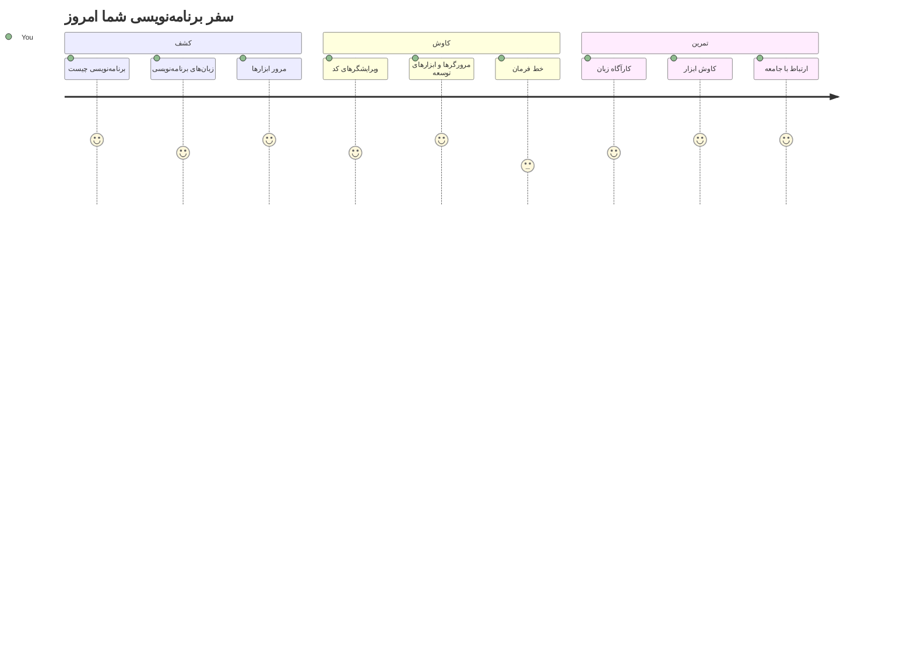
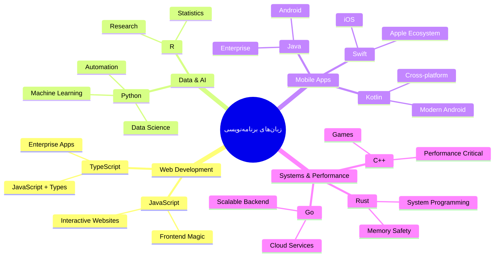
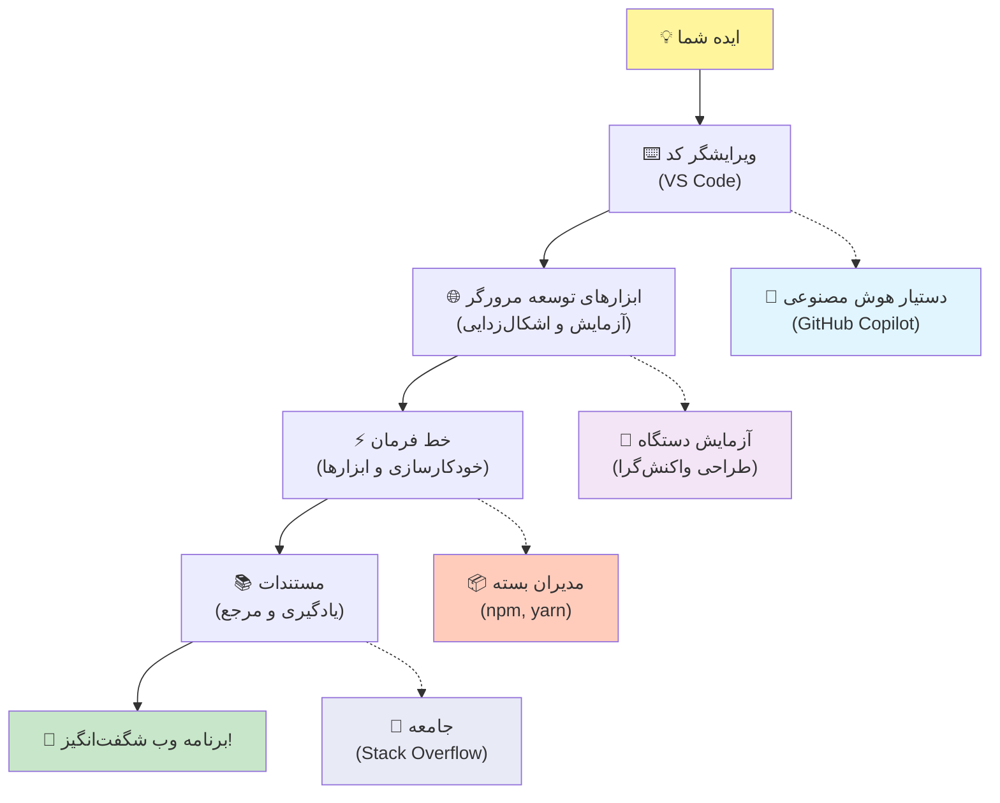
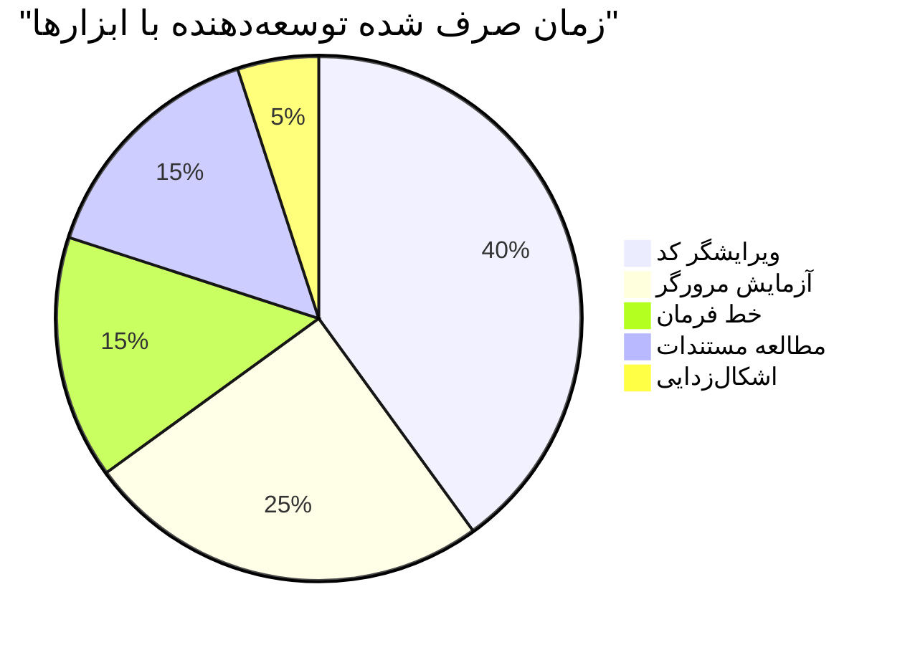
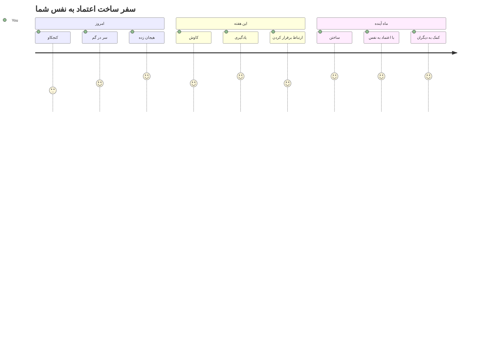

# معرفی زبان‌های برنامه‌نویسی و ابزارهای مدرن توسعه‌دهندگان

سلام به توسعه‌دهنده‌ی آینده! 👋 می‌تونم چیزی بهت بگم که هر روز هنوز هم مو به تنم سیخ می‌کنه؟ تو داری کشف می‌کنی که برنامه‌نویسی فقط مربوط به کامپیوترها نیست – بلکه داشتن قدرت‌های فوق‌العاده واقعی برای زنده کردن وحشیانه‌ترین ایده‌هات هستی!

اون لحظه‌ای که داری از برنامه‌ی موردعلاقه‌ات استفاده می‌کنی و همه‌چیز دقیقاً درست کلیک می‌کنه رو می‌دونی؟ وقتی یک دکمه رو فشار می‌دی و اتفاقی کاملاً جادویی می‌افته که باعث می‌شه بگی «وای، چطور تونستند این کار رو بکنند؟» خب، کسی مثل خودِ تو – احتمالاً نشسته توی کافی‌شاپ موردعلاقه‌ش ساعت ۲ صبح با سومین اسپرسوش – کدی نوشته که اون جادو رو ساخته. و اینجا جاییه که ذهنت منفجر می‌شه: تا پایان این درس، نه تنها می‌فهمی اون‌ها چطور این کار رو کردند، بلکه دلت می‌خواد خودت هم امتحانش کنی!

ببین، کاملاً درک می‌کنم اگر برنامه‌نویسی الان برات ترسناک به نظر میاد. وقتی تازه شروع کردم، واقعاً فکر می‌کردم باید نابغه ریاضی باشی یا از پنج‌سالگی داری کد می‌زنی. اما چیزی که کل دیدگاه منو عوض کرد این بود: برنامه‌نویسی دقیقاً مثل یادگیری داشتن مکالمه در یه زبان جدید هست. با «سلام» و «مرسی» شروع می‌کنی، بعد می‌رسی به سفارش دادن قهوه، و قبل از اینکه بدانی، داری بحث‌های فلسفی عمیق می‌کنی! البته در این مورد، داری با کامپیوترها صحبت می‌کنی، و راستش؟ اون‌ها صبورترین همراهان مکالمه‌ای هستند که می‌تونی داشته باشی – هیچوقت اشتباهاتت رو قضاوت نمی‌کنند و همیشه با اشتیاق دوباره امتحان می‌کنند!

امروز قراره ابزارهای شگفت‌انگیزی رو بررسی کنیم که توسعه وب مدرن رو نه تنها ممکن، بلکه به‌شدت اعتیادآور می‌کنن. دارم درباره همون ویرایشگرها، مرورگرها و جریان‌های کاری حرف می‌زنم که توسعه‌دهندگان نتفلیکس، اسپاتیفای و استودیوهای اپ مستقل موردعلاقه‌ات هر روز استفاده می‌کنند. و این بخشی که باعث می‌شه رقص شادی بکنی: بیشتر این ابزارهای حرفه‌ای و استاندارد صنعت کاملاً رایگان هستن!


> تصویرگری توسط [Tomomi Imura](https://twitter.com/girlie_mac)


```mermaid
journey
    title سفر برنامه‌نویسی شما امروز
    section کشف
      برنامه‌نویسی چیست: 5: You
      زبان‌های برنامه‌نویسی: 4: You
      مرور ابزارها: 5: You
    section کاوش
      ویرایشگرهای کد: 4: You
      مرورگرها و ابزارهای توسعه: 5: You
      خط فرمان: 3: You
    section تمرین
      کارآگاه زبان: 4: You
      کاوش ابزار: 5: You
      ارتباط با جامعه: 5: You
```
## بیایید ببینیم چه چیزهایی رو قبلاً می‌دونی!

قبل از اینکه بریم سراغ بخش‌های جذاب، کنجکاوم بدونم – درباره این دنیای برنامه‌نویسی چی می‌دونی؟ و گوش کن، اگر داری به این سوالات نگاه می‌کنی و فکر می‌کنی «من واقعاً هیچ سرنخی درباره هیچ‌کدوم ندارم»، این نه فقط اوکیه، بلکه عالیه! یعنی تو دقیقاً تو جای درستی هستی. این آزمون رو مثل گرم کردن قبل از تمرین ببین – داریم عضلات مغزمون رو گرم می‌کنیم!

[تکمیل آزمون پیش‌درس](https://ff-quizzes.netlify.app/web/)

## ماجرایی که قراره با هم شروع کنیم

باشه، من واقعاً از هیجان دارم که امروز قراره چی رو کشف کنیم! بهم راست بگو، دوست داشتم بتونم قیافت رو ببینم وقتی بعضی از این مفاهیم واست جا می‌افته. این سفر شگفت‌انگیزیه که قراره با هم طی کنیم:

- **برنامه‌نویسی دقیقاً چیه (و چرا باحال‌ترین چیز جهان هست!)** – می‌خوایم کشف کنیم کد در حقیقت همون جادوی نامرئیه که همه چیز اطراف تو رو هدایت می‌کنه، از اون آلارمی که به طرز عجیبی می‌دونه صبح دوشنبه‌ست گرفته تا الگوریتمی که دقیقاً نتفلیکس رو برات توصیه می‌کنه
- **زبان‌های برنامه‌نویسی و شخصیت‌های شگفت‌انگیزشون** – تصور کن وارد یه مهمونی می‌شی که هرکس ابرقدرت‌ها و راه‌های متفاوتی برای حل مسئله داره. دنیای زبان‌های برنامه‌نویسی دقیقاً همینه، و تو عاشق آشنایی باهاشون می‌شی!
- **بلوک‌های بنیادی که باعث می‌شن جادوی دیجیتال اتفاق بیفته** – این‌ها رو مثل مجموعه لگوی خلاقانه نهایی ببین. وقتی بفهمی این قطعات چطور کنار هم قرار می‌گیرن، می‌فهمی دقیقاً می‌تونی هر چیزی که تخیل می‌کنی رو بسازی
- **ابزارهای حرفه‌ای که باعث می‌شن احساس کنی تازه یه عصای جادوگری بهت دادن** – دارم بزرگ‌نمایی نمی‌کنم – این ابزارها واقعاً باعث می‌شن حس کنی قدرت‌های فوق‌العاده داری، و بهترین قسمت اینجاست؟ همون‌هایی هستن که حرفه‌ای‌ها استفاده می‌کنن!

> 💡 **یه نکته**: حتی به ذهنت هم خطور نکن که امروز بخوای همه چیز رو حفظ کنی! الان فقط می‌خوام اون جرقه هیجان درباره اینکه چه چیزهایی ممکنن برات ایجاد بشه رو حس کنی. جزئیات خودبه‌خود وقتی با هم تمرین می‌کنیم می‌چسبن – اینطوری یادگیری واقعی اتفاق میافته!

> می‌تونی این درس رو در [Microsoft Learn](https://learn.microsoft.com/en-us/learn/modules/web-development-101/introduction-programming/?WT.mc_id=academic-77807-sagibbon) هم بگیری!

## پس دقیقاً برنامه‌نویسی *چی* هست؟

باشه، بریم سراغ سوال میلیون دلاری: برنامه‌نویسی واقعاً چیه؟

داستانی دارم که کاملاً طرز فکر منو عوض کرد. هفته پیش داشتم تلاش می‌کردم مامانم رو راهنمایی کنم چطور از کنترل جدید تلویزیون هوشمون استفاده کنه. دیدم دارم می‌گم «دکمه قرمز رو بزن، ولی نه دکمه بزرگ قرمز، دکمه کوچک قرمز سمت چپ... نه، سمت چپ دیگه‌ات... حالا نگه دار دو ثانیه، نه یک ثانیه، نه سه...» آشنا به نظر میاد؟ 😅

یعنی برنامه‌نویسی! یعنی هنر دادن دستورالعمل‌های بسیار دقیق و مرحله به مرحله به چیزی که واقعاً قدرتمنده، ولی باید همه چیز دقیق و کامل براش توضیح داده بشه. البته به جای اینکه به مامانت (که می‌تونه بپرسه «کدوم دکمه قرمز؟!») توضیح بدی، داری به کامپیوتر توضیح می‌دی (که دقیقاً همون کاری رو می‌کنه که بهش می‌گی، حتی اگر اون چیزی که گفتی دقیقاً منظور تو نباشه).

وقتی اینو یاد گرفتم، واقعاً برام شگفت‌آور بود: کامپیوترها در اصل بسیار ساده هستن. اون‌ها فقط دو تا چیز رو می‌فهمن – ۱ و ۰، که اساساً یعنی «بله» و «خیر» یا «روشن» و «خاموش». همینه! اما اینجا جادویی می‌شه – ما مجبور نیستیم مثل ماتریکس با ۱ و ۰ حرف بزنیم. اینجا **زبان‌های برنامه‌نویسی** میان به کمکت. اون‌ها مثل بهترین مترجم دنیا هستن که افکار کاملاً عادی انسانی‌ات رو به زبان کامپیوتر ترجمه می‌کنن.

و این چیزی که هر صبح وقتی بیدار می‌شم هنوز غوغا می‌کنه: اساساً *همه* چیز دیجیتال توی زندگیت از کسی شروع شده که مثل تو بوده، احتمالاً توی لباس خواب با یه فنجون قهوه نشسته و داره کد می‌زنه. اون فیلتری که اینستاگرامتو بی‌نقص نشون می‌ده؟ کسی اون رو کد زده. الگوریتم پیشنهادی که تو رو به آهنگ موردعلاقه جدیدت رسوند؟ توسعه‌دهنده‌ای اون رو ساخته. برنامه‌ای که بهت کمک می‌کنه هزینه شام رو با دوستات تقسیم کنی؟ بله، کسی فکر کرده «این اذیته، حتماً می‌تونم درستش کنم» و بعد… درستش کرد!

وقتی برنامه‌نویسی یاد می‌گیری، فقط یک مهارت جدید یاد نمی‌گیری – وارد یه جامعه شگفت‌انگیز از حل‌کننده‌های مسئله می‌شی که روزهاشون رو با فکر کردن به «چی می‌شد اگر می‌تونستم چیزی بسازم که روز کسی رو کمی بهتر کنه» می‌گذرونن. راستش، چیزی باحال‌تر از این وجود داره؟

✅ **شکار حقیقت سرگرم‌کننده**: وقتی فرصت داشتی یه چیز بسیار جالب سرچ کن – به نظرت اولین برنامه‌نویس جهان کی بوده؟ یه نکته بدم: شاید اون چیزی که فکر می‌کنی نباشه! داستان پشت این شخص کاملاً جذابه و نشون می‌ده برنامه‌نویسی همیشه درباره حل مسئله خلاقانه و فکر کردن خارج از چارچوب بوده.

### 🧠 **زمان چک کردن: حالت چطوره؟**

**یه لحظه وقت بذار فکر کن:**
- آیا مفهوم «دادن دستورالعمل به کامپیوترها» الان برات منطقی شده؟
- می‌تونی یه کار روزمره که دوست داری با برنامه‌نویسی خودکارش کنی رو به یاد بیاری؟
- چه سوالاتی در ذهنت درباره این کل قضیه برنامه‌نویسی داره شکل می‌گیره؟

> **یادت باشه**: کاملاً طبیعیه اگر بعضی مفاهیم الان برات مبهم باشن. یادگیری برنامه‌نویسی مثل یادگیری یه زبان جدیده – مغزت نیاز داره زمان ببره تا اون مسیرهای عصبی رو بسازه. تو خیلی خوب داری پیش می‌ری!

## زبان‌های برنامه‌نویسی مثل طعم‌های مختلف جادو هستن

باشه، ممکنه عجیب به نظر بیاد، ولی بیا با من باش – زبان‌های برنامه‌نویسی خیلی شبیه انواع موسیقی هستن. تصور کن: جاز که نرم و بداهه‌نوازی هست، راک که قدرتمند و ساده هست، کلاسیک که شیک و ساختارمند هست، و هیپ‌هاپ که خلاق و بیانگر هست. هر سبک حال و هوا، جامعه طرفداران پرشور خاص خودش رو داره، و هرکدوم برای حالات و موقعیت‌های مختلف عالی هستن.

زبان‌های برنامه‌نویسی هم دقیقاً همین طور کار می‌کنن! تو که از یک زبان برای ساخت یک بازی موبایل سرگرم‌کننده استفاده نمی‌کنی و از زبان دیگه برای پردازش حجم عظیمی از داده‌های آب و هوایی، مثل اینکه تو یه کلاس یوگا متال دث اجرا نکنی (خب، بیشتر کلاس‌های یوگا نه! 😄).

ولی چیزی که هر بار بهش فکر می‌کنم واقعاً بهم انرژی می‌ده: این زبان‌ها مثل داشتن صبورترین و باهوش‌ترین مترجم دنیا کنار تو هستن. می‌تونی ایده‌هات رو به شکلی بیان کنی که برای مغز آدمی‌ات طبیعی باشه و اون‌ها همه اون کارهای پیچیده ترجمه به ۱ و ۰ که کامپیوترها می‌فهمن رو انجام می‌دن. مثل داشتن دوستی که هم در «خلاقیت انسانی» و هم «منطق کامپیوتری» کاملاً روانه – و هرگز خسته نمی‌شه، نیازی به استراحت قهوه‌ای نداره، و هیچوقت بابت پرسیدن سوال تکراری تو رو قضاوت نمی‌کنه!

### زبان‌های برنامه‌نویسی محبوب و کاربردهای‌شون


```mermaid
mindmap
  root((زبان‌های برنامه‌نویسی))
    Web Development
      JavaScript
        Frontend Magic
        Interactive Websites
      TypeScript
        JavaScript + Types
        Enterprise Apps
    Data & AI
      Python
        Data Science
        Machine Learning
        Automation
      R
        Statistics
        Research
    Mobile Apps
      Java
        Android
        Enterprise
      Swift
        iOS
        Apple Ecosystem
      Kotlin
        Modern Android
        Cross-platform
    Systems & Performance
      C++
        Games
        Performance Critical
      Rust
        Memory Safety
        System Programming
      Go
        Cloud Services
        Scalable Backend
```
| زبان | بهترین کاربرد | چرا محبوبه |
|----------|----------|------------------|
| **JavaScript** | توسعه وب، رابط‌های کاربری | در مرورگرها اجرا می‌شه و سایت‌های تعاملی رو قوی می‌کنه |
| **Python** | علم داده، اتوماسیون، هوش مصنوعی | خواندن و یادگیری آسونه، کتابخونه‌های قدرتمند داره |
| **Java** | برنامه‌های سازمانی، اپ‌های اندروید | مستقل از پلتفرم، قوی برای سیستم‌های بزرگ |
| **C#** | برنامه‌های ویندوز، توسعه بازی | پشتیبانی قوی از اکوسیستم مایکروسافت |
| **Go** | خدمات ابری، سیستم‌های بک‌اند | سریع، ساده، طراحی‌شده برای محاسبات مدرن |

### زبان‌های سطح بالا در مقابل سطح پایین

باشه، این واقعاً مفهومی بود که وقتی تازه شروع کرده بودم یادگیری، مغزم رو به هم ریخت، پس الان اون تشبیهی رو که بالاخره منو قانع کرد واست می‌گم – و امیدوارم بهت هم کمک کنه!

تصور کن داری به کشوری سفر می‌کنی که زبان‌ش رو بلد نیستی، و به شدت نیاز داری نزدیک‌ترین دستشویی رو پیدا کنی (همه ما اونجا بودیم، درست؟ 😅):

- **برنامه‌نویسی سطح پایین** مثل اینه که لهجه محلی رو اونقدر خوب یاد بگیری که بتونی با مادربزرگ فروشنده میوه کنار خیابون با ارجاعات فرهنگی، زبان محلی و شوخی‌های داخلی صحبت کنی که فقط کسی که اونجا بزرگ شده می‌فهمه. فوق‌العاده جالب و بسیار مؤثر... اگه اتفاقاً مسلط باشی! ولی وقتی فقط داری دنبال دستشویی می‌گردی، واقعاً دلهره‌آوره.

- **برنامه‌نویسی سطح بالا** مثل داشتن اون دوست محلی شگفت‌انگیزه که دقیقاً حالتو می‌فهمه. می‌تونی به انگلیسی ساده بگی «من واقعاً نیاز دارم دستشویی پیدا کنم» و اون کل ترجمه فرهنگی رو انجام می‌ده و آدرس رو طوری بهت می‌ده که برای مغز غریبت کاملاً منطقی باشه.

از دید برنامه‌نویسی:
- **زبان‌های سطح پایین** (مثل اسمبلی یا C) این امکان رو می‌دن که با سخت‌افزار واقعی کامپیوتر گفتگوی فوق‌العاده دقیقی داشته باشی، ولی باید مثل یک ماشین فکر کنی، که... خب، بزار بگم یک تغییر ذهنی بزرگه!
- **زبان‌های سطح بالا** (مثل JavaScript، Python، یا C#) اجازه می‌دن مثل یه انسان فکر کنی در حالی که اون‌ها پشت پرده همه زبان ماشین رو مدیریت می‌کنن. بعلاوه، این زبان‌ها جوامع فوق‌العاده مهربانی دارن پر از آدم‌هایی که یادشون هست تازه بودن چطوری بوده و واقعاً می‌خوان کمک کنن!

حدس بزن با کدوم‌ها شروع به یادگیری می‌کنی؟ 😉 زبان‌های سطح بالا مثل چرخ‌های کمکی هستن که هیچ وقت نمی‌خوای ازشون بزنی پایین چون کل تجربه رو خیلی لذت‌بخش‌تر می‌کنن!


```mermaid
flowchart TB
    A["👤 فکر انسان:<br/>'می‌خواهم اعداد فیبوناچی را محاسبه کنم'"] --> B{انتخاب سطح زبان}
    
    B -->|سطح بالا| C["🌟 جاوااسکریپت/پایتون<br/>خواندن و نوشتن آسان"]
    B -->|سطح پایین| D["⚙️ اسمبلی/C<br/>کنترل مستقیم سخت‌افزار"]
    
    C --> E["📝 نوشتن: fibonacci(10)"]
    D --> F["📝 نوشتن: mov r0,#00<br/>sub r0,r0,#01"]
    
    E --> G["🤖 درک کامپیوتر:<br/>مترجم پیچیدگی‌ها را مدیریت می‌کند"]
    F --> G
    
    G --> H["💻 نتیجه یکسان:<br/>0, 1, 1, 2, 3, 5, 8, 13..."]
    
    style C fill:#e1f5fe
    style D fill:#fff3e0
    style H fill:#e8f5e8
```
### بذار نشونت بدم چرا زبان‌های سطح بالا اینقدر دوست‌داشتنی هستن

باشه، می‌خوام چیزی بهت نشون بدم که کاملاً نشون می‌ده چرا عاشق زبان‌های سطح بالا شدم، اما اول – باید قول بدی. وقتی اولین نمونه کد رو دیدی، نترس! طراحی شده که کمی ترسناک به نظر بیاد. این دقیقاً همون نکته‌ایه که می‌خوام برسونم!

قراره به یه وظیفه یکسان نوشته‌شده در دو سبک کاملاً متفاوت نگاه کنیم. هر دو یه چیزی به اسم دنباله فیبوناچی ایجاد می‌کنن – یه الگوی ریاضی زیبا که هر عدد مجموع دو عدد قبلیشه: ۰، ۱، ۱، ۲، ۳، ۵، ۸، ۱۳... (نکته جالب: این الگو رو در طبیعت دقیقاً همه جا پیدا می‌کنی – مارپیچ دانه‌های آفتابگردان، الگوهای مخروط‌های کاج، حتی شکل‌گیری کهکشان‌ها!)

آماده‌ای فرق رو ببینی؟ بریم!

**زبان سطح بالا (JavaScript) – دوست‌داشتنی برای انسان:**

```javascript
// مرحله ۱: راه‌اندازی اولیه فیبوناچی
const fibonacciCount = 10;
let current = 0;
let next = 1;

console.log('Fibonacci sequence:');
```

**این کد چیکار می‌کنه:**
- **اعلان** یه عدد ثابت برای تعیین تعداد اعداد فیبوناچی که می‌خوایم تولید کنیم
- **مقداردهی اولیه** دو متغیر برای نگه داشتن عدد فعلی و بعدی در دنباله
- **تنظیم** مقادیر شروع (۰ و ۱) که الگوی فیبوناچی رو تعریف می‌کنن
- **نمایش** یک پیغام سرصفحه برای شناسایی خروجی

```javascript
// مرحله ۲: تولید دنباله با یک حلقه
for (let i = 0; i < fibonacciCount; i++) {
  console.log(`Position ${i + 1}: ${current}`);
  
  // محاسبه عدد بعدی در دنباله
  const sum = current + next;
  current = next;
  next = sum;
}
```

**شرح عملکرد این بخش:**
- **حلقه** زدن از طریق هر جایگاه در دنباله با استفاده از حلقه `for`
- **نمایش** هر عدد با جایگاهش با استفاده از قالب‌بندی رشته قالبی
- **محاسبه** عدد فیبوناچی بعدی با جمع کردن مقادیر فعلی و بعدی
- **به‌روزرسانی** متغیرهای دنبال‌کننده تا به تکرار بعدی بریم

```javascript
// گام ۳: رویکرد کاربردی مدرن
const generateFibonacci = (count) => {
  const sequence = [0, 1];
  
  for (let i = 2; i < count; i++) {
    sequence[i] = sequence[i - 1] + sequence[i - 2];
  }
  
  return sequence;
};

// مثال استفاده
const fibSequence = generateFibonacci(10);
console.log(fibSequence);
```

**در کد بالا ما:**
- **ایجاد** تابعی قابل استفاده مجدد با استفاده از نحو مدرن تابع پیکانی
- **ساخت** آرایه‌ای برای ذخیره دنباله کامل به جای نمایش تک‌تک اعداد
- **استفاده** از اندیس‌گذاری آرایه برای محاسبه هر عدد جدید از مقادیر قبلی
- **بازگرداندن** دنباله کامل برای استفاده انعطاف‌پذیر در بخش‌های دیگه برنامه

**زبان سطح پایین (ARM Assembly) – دوست‌داشتنی برای کامپیوتر:**

```assembly
 area ascen,code,readonly
 entry
 code32
 adr r0,thumb+1
 bx r0
 code16
thumb
 mov r0,#00
 sub r0,r0,#01
 mov r1,#01
 mov r4,#10
 ldr r2,=0x40000000
back add r0,r1
 str r0,[r2]
 add r2,#04
 mov r3,r0
 mov r0,r1
 mov r1,r3
 sub r4,#01
 cmp r4,#00
 bne back
 end
```

توجه کن چطور نسخه JavaScript تقریباً مثل دستورالعمل‌های انگلیسی می‌خونه، در حالی که نسخه اسمبلی از دستورات رمزآلودی استفاده می‌کنه که مستقیماً کنترل پردازنده کامپیوتر رو در دست دارن. هر دو دقیقاً همون کار رو انجام می‌دن، ولی زبان سطح بالا برای انسان‌ها بسیار راحت‌تر برای فهمیدن، نوشتن و نگهداریه.

**تفاوت‌های کلیدی که متوجه می‌شی:**
- **خوانایی**: جاوااسکریپت از نام‌های توصیفی مانند `fibonacciCount` استفاده می‌کند در حالی که اسمبلی از برچسب‌های رمزگونه‌ای مانند `r0`، `r1` استفاده می‌کند  
- **توضیحات**: زبان‌های سطح بالا تشویق به نوشتن توضیحات توضیحی می‌کنند که کد را خودمستندسازی می‌کند  
- **ساختار**: جریان منطقی در جاوااسکریپت با روشی که انسان‌ها در مورد مسائل گام به گام فکر می‌کنند مطابقت دارد  
- **نگه‌داری**: به‌روزرسانی نسخه جاوااسکریپت برای نیازهای مختلف ساده و واضح است  

✅ **درباره دنباله فیبوناچی**: این الگوی عددی فوق‌العاده زیبا (جایی که هر عدد برابر مجموع دو عدد قبلی آن است: 0، 1، 1، 2، 3، 5، 8...) تقریباً *در همه جا* در طبیعت دیده می‌شود! شما آن را در مارپیچ‌های آفتابگردان، الگوهای کاج، نحوه خم شدن صدف ناتیلوس و حتی در رشد شاخه‌های درخت خواهید یافت. فوق‌العاده است که ریاضیات و کد چگونه به ما کمک می‌کنند تا الگوهایی را که طبیعت برای خلق زیبایی استفاده می‌کند، بفهمیم و بازسازی کنیم!

## بلوک‌های سازنده‌ای که جادو را رقم می‌زنند

خوب، حالا که دیدید زبان‌های برنامه‌نویسی چگونه کار می‌کنند، بیایید به پایه‌های اساسی که عملاً هر برنامه‌ای را تشکیل می‌دهند، نگاهی بیندازیم. این‌ها را مثل مواد اصلی دستور غذایی مورد علاقه‌تان در نظر بگیرید – وقتی بفهمید هرکدام چه کاری انجام می‌دهند، خواهید توانست کد را در تقریباً هر زبانی بخوانید و بنویسید!

این کمی شبیه یادگیری دستور زبان برنامه‌نویسی است. یادتان می‌آید وقتی در مدرسه درباره اسم‌ها، فعل‌ها و ساختن جملات یاد گرفتید؟ برنامه‌نویسی هم دستور زبان خودش را دارد و صادقانه بگویم، خیلی منطقی‌تر و بخشنده‌تر از دستور زبان انگلیسی است! 😄

### عبارات: دستورالعمل‌های گام به گام

بیایید با **عبارات** شروع کنیم – این‌ها مثل جملات جداگانه در یک گفتگو با کامپیوتر شما هستند. هر عبارت به کامپیوتر می‌گوید یک کار مشخص انجام دهد، مثل دادن جهت‌ها: «چرخ به چپ همینجا»، «توقف در چراغ قرمز»، «پارک در آن جایگاه».

چیزی که در مورد عبارات دوست دارم این است که معمولاً تا چه حد قابل خواندن‌اند. این را ببینید:

```javascript
// دستورات پایه‌ای که یک عمل را انجام می‌دهند
const userName = "Alex";                    
console.log("Hello, world!");              
const sum = 5 + 3;                         
```
  
**این کد چه کاری انجام می‌دهد:**  
- **اعلام** یک متغیر ثابت برای ذخیره نام کاربر  
- **نمایش** پیام خوش‌آمدگویی در کنسول  
- **محاسبه** و ذخیره نتیجه یک عملیات ریاضی  

```javascript
// دستورات که با صفحات وب تعامل دارند
document.title = "My Awesome Website";      
document.body.style.backgroundColor = "lightblue";
```
  
**گام به گام، اتفاقات اینجا:**  
- **تغییر** عنوان صفحه وب که در تب مرورگر نشان داده می‌شود  
- **تغییر** رنگ پس‌زمینه کل بدنه صفحه  

### متغیرها: سیستم حافظه برنامه شما

خوب، **متغیرها** یکی از مفاهیمی هستند که واقعاً دوست دارم آموزش دهم چون خیلی شبیه چیزهایی هستند که هر روز استفاده می‌کنید!

یک لحظه به دفترچه تلفن موبایل‌تان فکر کنید. شما شماره هر کسی را حفظ نمی‌کنید – بلکه «مادر»، «دوست صمیمی» یا «فست‌فودی که تا ساعت ۲ صبح پیک دارد» را ذخیره می‌کنید و گوشی شما شماره‌ها را به خاطر می‌سپارد. متغیرها دقیقاً همین‌طور کار می‌کنند! آن‌ها مثل ظروف برچسب‌دار هستند که برنامه شما می‌تواند اطلاعات را ذخیره کند و بعد با نامی که معنا دارد دوباره از آن‌ها استفاده کند.

چیزی که خیلی جالب است این است که متغیرها می‌توانند در حین اجرای برنامه تغییر کنند (از همین رو اسمشان «متغیر» است – متوجه بازی کلمه شدند؟). درست مثل اینکه ممکن است وقتی یک فست‌فودی بهتر پیدا کردید، مخاطب آن را به‌روزرسانی کنید، متغیرها هم زمانی که برنامه شما اطلاعات جدید یاد می‌گیرد یا شرایط تغییر می‌کند، به‌روزرسانی می‌شوند!

اجازه دهید نشان دهم چقدر این می‌تواند ساده و زیبا باشد:

```javascript
// مرحله ۱: ایجاد متغیرهای پایه
const siteName = "Weather Dashboard";        
let currentWeather = "sunny";               
let temperature = 75;                       
let isRaining = false;                      
```
  
**درک این مفاهیم:**  
- **ذخیره** مقادیر ثابت در متغیرهای `const` (مثل نام سایت)  
- **استفاده** از `let` برای مقادیری که در طول برنامه تغییر می‌کنند  
- **اختصاص** انواع داده مختلف: رشته‌ها (متن)، عددها و بولین‌ها (true/false)  
- **انتخاب** نام‌های توصیفی که توضیح می‌دهند هر متغیر چه چیزی را نگه می‌دارد  

```javascript
// گام ۲: کار با اشیاء برای گروه‌بندی داده‌های مرتبط
const weatherData = {                       
  location: "San Francisco",
  humidity: 65,
  windSpeed: 12
};
```
  
**در بالا ما:**  
- **ساختیم** یک شیء برای گروه‌بندی اطلاعات مرتبط هواشناسی  
- **سازمان‌دهی** چندین داده زیر یک نام متغیر  
- **استفاده** از جفت کلید-مقدار برای برچسب زدن واضح به هر داده  

```javascript
// مرحله ۳: استفاده و به‌روزرسانی متغیرها
console.log(`${siteName}: Today is ${currentWeather} and ${temperature}°F`);
console.log(`Wind speed: ${weatherData.windSpeed} mph`);

// به‌روزرسانی متغیرهای قابل تغییر
currentWeather = "cloudy";                  
temperature = 68;                          
```
  
**بیایید هر بخش را بفهمیم:**  
- **نمایش** اطلاعات با استفاده از قالب رشته‌ها و نحو `${}`  
- **دسترسی** به خصوصیات شیء با استفاده از نقطه‌گذاری (`weatherData.windSpeed`)  
- **بروزرسانی** متغیرهای تعریف‌شده با `let` برای بازتاب شرایط در حال تغییر  
- **ترکیب** چند متغیر برای ساخت پیام‌های معنادار  

```javascript
// مرحله ۴: ساختار شکنی مدرن برای کدی تمیزتر
const { location, humidity } = weatherData; 
console.log(`${location} humidity: ${humidity}%`);
```
  
**چیزی که باید بدانید:**  
- **استخراج** خصوصیات خاص از شیءها با استفاده از انتساب تخریب‌کننده (destructuring)  
- **ساخت** متغیرهای جدید به طور خودکار با همان نام‌های کلیدهای شیء  
- **ساده‌سازی** کد با اجتناب از چند بار نوشتن نقطه‌گذاری  

### جریان کنترل: آموزش تفکر به برنامه شما

خوب، اینجاست که برنامه‌نویسی واقعاً ذهن را منفجر می‌کند! **جریان کنترل** اساساً آموزش به برنامه شماست که چگونه تصمیمات هوشمندانه بگیرد، دقیقاً مثل کاری که شما هر روز بدون فکر کردن انجام می‌دهید.

تصور کنید: امروز صبح احتمالاً چیزی شبیه این را داشتید «اگر باران می‌آید، چتر برمی‌دارم. اگر سرد است، کاپشن می‌پوشم. اگر دیر کردم، صبحانه را رد می‌کنم و در راه قهوه می‌گیرم.» مغز شما به طور ذاتی این منطق شرطی if-then را ده‌ها بار در روز دنبال می‌کند!

این همان چیزی است که باعث می‌شود برنامه‌ها هوشمند و زنده به نظر برسند بجای اینکه صرفاً یک اسکریپت کسل‌کننده و قابل پیش‌بینی را دنبال کنند. آن‌ها به واقع می‌توانند وضعیت را نگاه کنند، ارزیابی کنند چه اتفاقی می‌افتد و پاسخ مناسب بدهند. این مثل دادن یک مغز به برنامه شماست که می‌تواند سازگار شود و تصمیم بگیرد!

می‌خواهید ببینید چقدر زیبا کار می‌کند؟ اجازه دهید نشان دهم:

```javascript
// مرحله ۱: منطق شرطی پایه
const userAge = 17;

if (userAge >= 18) {
  console.log("You can vote!");
} else {
  const yearsToWait = 18 - userAge;
  console.log(`You'll be able to vote in ${yearsToWait} year(s).`);
}
```
  
**این کد چه کاری انجام می‌دهد:**  
- **بررسی** اینکه آیا سن کاربر شرایط رأی دادن را دارد  
- **اجرای** بلوک‌های کد مختلف بر اساس نتیجه شرط  
- **محاسبه** و نمایش زمان تا رسیدن به شرایط رأی دادن اگر کمتر از ۱۸ سال باشد  
- **دادن** بازخورد خاص و مفید برای هر موقعیت  

```javascript
// مرحله ۲: چندین شرایط با عملگرهای منطقی
const userAge = 17;
const hasPermission = true;

if (userAge >= 18 && hasPermission) {
  console.log("Access granted: You can enter the venue.");
} else if (userAge >= 16) {
  console.log("You need parent permission to enter.");
} else {
  console.log("Sorry, you must be at least 16 years old.");
}
```
  
**تجزیه و تحلیل اتفاقات اینجا:**  
- **ترکیب** چند شرط با استفاده از عملگر `&&` (و)  
- **ساختن** سلسله مراتب شرایط با `else if` برای سناریوهای متعدد  
- **رسیدگی** به همه حالات ممکن با دستور نهایی `else`  
- **دادن** بازخورد واضح و قابل عمل برای هر وضعیت متفاوت  

```javascript
// مرحله ۳: شرط کوتاه با عملگر شرطی
const votingStatus = userAge >= 18 ? "Can vote" : "Cannot vote yet";
console.log(`Status: ${votingStatus}`);
```
  
**چیزی که باید به یاد داشته باشید:**  
- **استفاده** از عملگر شرطی سه‌تایی (`? :`) برای شرایط ساده با دو گزینه  
- **نوشتن** شرط اول، سپس `?`، بعد نتیجه درست، بعد `:`، و سپس نتیجه نادرست  
- **اجرای** این الگو وقتی می‌خواهید بر اساس شرایط مقادیر را اختصاص دهید  

```javascript
// مرحله ۴: مدیریت چندین مورد خاص
const dayOfWeek = "Tuesday";

switch (dayOfWeek) {
  case "Monday":
  case "Tuesday":
  case "Wednesday":
  case "Thursday":
  case "Friday":
    console.log("It's a weekday - time to work!");
    break;
  case "Saturday":
  case "Sunday":
    console.log("It's the weekend - time to relax!");
    break;
  default:
    console.log("Invalid day of the week");
}
```
  
**این کد کارهای زیر را انجام می‌دهد:**  
- **مقایسه** مقدار متغیر با چند حالت خاص  
- **گروه‌بندی** حالات مشابه (روزهای هفته در مقابل تعطیلات آخر هفته)  
- **اجرای** بلوک کد مناسب وقتی که تطابق پیدا شود  
- **شامل** حالت `default` برای رسیدگی به مقادیر غیرمنتظره  
- **استفاده** از دستورات `break` برای جلوگیری از ادامه کد به حالت بعدی  

> 💡 **تشبیه دنیای واقعی**: جریان کنترل مثل داشتن صبورترین GPS جهان است که به شما مسیر می‌دهد. می‌گوید «اگر ترافیک در خیابان اصلی است، بزرگراه را برو. اگر ساخت‌وساز بزرگراه را مسدود کرده، مسیر مناظر را امتحان کن.» برنامه‌ها دقیقاً همین منطق شرطی را برای پاسخ هوشمندانه به موقعیت‌های مختلف به کار می‌برند و همیشه بهترین تجربه را برای کاربران فراهم می‌کنند.

### 🎯 **چک مفهومی: تسلط بر بلوک‌های سازنده**

**ببینیم چقدر با پایه‌ها خوب هستید:**  
- می‌توانید تفاوت بین متغیر و عبارت را به زبان خودتان توضیح دهید؟  
- یک سناریوی واقعی را تصور کنید که در آن از تصمیم if-then استفاده می‌کنید (مثل مثال رأی دادن ما)  
- کدام بخش از منطق برنامه‌نویسی برایتان شگفت‌آور بود؟  

**افزایش اعتماد به نفس سریع:**  

```mermaid
flowchart LR
    A["📝 دستورات<br/>(دستورات)"] --> B["📦 متغیرها<br/>(ذخیره‌سازی)"] --> C["🔀 جریان کنترل<br/>(تصمیم‌ها)"] --> D["🎉 برنامه‌ی فعال!"]
    
    style A fill:#ffeb3b
    style B fill:#4caf50
    style C fill:#2196f3
    style D fill:#ff4081
```  
✅ **چه چیزی در انتظار شماست**: ما قرار است یک سفر فوق‌العاده را ادامه دهیم و عمیق‌تر با این مفاهیم آشنا شویم! همین الان تمرکز کنید روی هیجانی که بابت تمام امکانات شگفت‌انگیز پیش رو دارید. مهارت‌ها و تکنیک‌های خاص به طور طبیعی وقتی با هم تمرین می‌کنیم شکل خواهند گرفت – قول می‌دهم این خیلی جذاب‌تر از آن چیزی باشد که فکرش را می‌کنید!

## ابزارهای کار

خوب، واقعاً اینجاست که آن‌قدر هیجان‌زده می‌شوم که نمی‌توانم خودم را کنترل کنم! 🚀 داریم درباره ابزارهای فوق‌العاده‌ای صحبت می‌کنیم که باعث می‌شوند احساس کنید همین الان کلیدهای یک سفینه فضایی دیجیتال به دستتان آمده است.

می‌دانید آشپز چطور چاقوهای متعادل دقیقاً متناسب با دستش دارد؟ یا نوازنده‌ای که گیتاری دارد که انگار از همان لحظه لمس، شروع به آواز خواندن می‌کند؟ خب، توسعه‌دهندگان نسخه خودشان از این ابزارهای جادویی را دارند، و این چیزی است که واقعاً ذهنتان را منفجر خواهد کرد – بیشتر آن‌ها کاملاً رایگان هستند!

تقریباً از شدت خوشحالی در صندلی‌ام می‌پرم که این‌ها را با شما به اشتراک بگذارم چون کل روش ساخت نرم‌افزار را انقلابی کرده‌اند. ما درباره دستیاران کدنویسی مبتنی بر هوش مصنوعی صحبت می‌کنیم که می‌توانند به نگارش کد کمک کنند (جادوی واقعی است!)، محیط‌های ابری که در آن‌ها می‌توانید برنامه‌های کامل را از هر جای دنیا با وای-فای بسازید، و ابزارهای اشکال‌زدایی‌ای که آن‌قدر پیشرفته‌اند که انگار برنامه‌های شما را با دید اشعه ایکس می‌بینند.

و بخشی که هنوز برایم هیجان‌انگیز است: این‌ها ابزارهای «مبتدی» نیستند که بعد از چند ماه از آن‌ها دلزده شوید. این دقیقاً همان ابزارهای حرفه‌ای هستند که توسعه‌دهندگان گوگل، نتفلیکس و آن استودیوی اپلیکیشن مستقل مورد علاقه‌تان همین الان دارند استفاده می‌کنند. شما احساس خواهید کرد چقدر حرفه‌ای هستید وقتی از آن‌ها استفاده می‌کنید!


```mermaid
graph TD
    A["💡 ایده شما"] --> B["⌨️ ویرایشگر کد<br/>(VS Code)"] 
    B --> C["🌐 ابزارهای توسعه مرورگر<br/>(آزمایش و اشکال‌زدایی)"]
    C --> D["⚡ خط فرمان<br/>(خودکارسازی و ابزارها)"]
    D --> E["📚 مستندات<br/>(یادگیری و مرجع)"]
    E --> F["🚀 برنامه وب شگفت‌انگیز!"]
    
    B -.-> G["🤖 دستیار هوش مصنوعی<br/>(GitHub Copilot)"]
    C -.-> H["📱 آزمایش دستگاه<br/>(طراحی واکنش‌گرا)"]
    D -.-> I["📦 مدیران بسته<br/>(npm, yarn)"]
    E -.-> J["👥 جامعه<br/>(Stack Overflow)"]
    
    style A fill:#fff59d
    style F fill:#c8e6c9
    style G fill:#e1f5fe
    style H fill:#f3e5f5
    style I fill:#ffccbc
    style J fill:#e8eaf6
```  
### ویرایشگرها و محیط‌های توسعه: بهترین دوستان دیجیتال جدید شما

بیا درباره ویرایشگرهای کد صحبت کنیم – واقعاً قرار است به محل مورد علاقه جدید شما برای کار تبدیل شوند! آن‌ها را مثل آرامگاه شخصی کدنویسی خودتان تصور کنید که بیشتر وقتتان را صرف خلق و بهبود ساخته‌های دیجیتالتان خواهید کرد.

اما چیز جادویی درباره ویرایشگرهای مدرن این است که آن‌ها فقط ویرایشگرهای متن ظریف نیستند. آن‌ها مثل هوشمندترین و حامی‌ترین مربی کدنویسی هستند که ۲۴ ساعته کنار شما نشسته‌اند. تایپ اشتباهات شما را قبل از اینکه متوجه شوید می‌گیرند، پیشنهادهایی می‌دهند که شما را نابغه نشان می‌دهد، کمک می‌کنند بفهمید هر قطعه کد چه کاری انجام می‌دهد، و بعضی حتی حدس می‌زنند شما می‌خواهید چه چیزی بنویسید و پیشنهاد تکمیل جمله را می‌دهند!

یادم است وقتی اولین بار تکمیل خودکار را کشف کردم – واقعاً احساس کردم در آینده زندگی می‌کنم. شروع می‌کنید به تایپ چیزی، و ویرایشگر می‌گوید: «هی، آیا به این تابع فکر می‌کردی که دقیقاً کاری را انجام می‌دهد که تو نیاز داری؟» مثل اینکه یک ذهن‌خوان به عنوان رفیق کدنویسی کنارتان است!

**چه چیزی این ویرایشگرها را باور نکردنی می‌کند؟**

ویرایشگرهای کد مدرن مجموعه‌ای چشمگیر از ویژگی‌ها را ارائه می‌دهند که هدفشان افزایش بهره‌وری شماست:

| ویژگی       | کارکرد                | چرا مفید است                               |
|-------------|-----------------------|-------------------------------------------|
| **برجسته‌سازی نحو** | رنگی کردن قسمت‌های مختلف کد | خواندن کد و یافتن خطاها را آسان‌تر می‌کند |
| **تکمیل خودکار**    | پیشنهاد کد هنگام تایپ      | سرعت کدنویسی را بالا می‌برد و از اشتباهات می‌کاهد  |
| **ابزارهای اشکال‌زدایی** | کمک به یافتن و رفع خطاها   | ساعت‌ها صرفه‌جویی در عیب‌یابی می‌کند      |
| **افزونه‌ها**        | افزودن ویژگی‌های تخصصی   | ویرایشگر را برای هر فناوری سفارشی می‌کند |
| **دستیارهای هوش مصنوعی** | پیشنهاد کد و توضیحات    | یادگیری و بهره‌وری را تسریع می‌کند         |

> 🎥 **منبع ویدئو**: می‌خواهید این ابزارها را در عمل ببینید؟ این ویدئو [Tools of the Trade video](https://youtube.com/watch?v=69WJeXGBdxg) یک مرور کامل ارائه می‌دهد.

#### ویرایشگرهای پیشنهادی برای توسعه وب

**[Visual Studio Code](https://code.visualstudio.com/?WT.mc_id=academic-77807-sagibbon)** (رایگان)  
- محبوب‌ترین میان توسعه‌دهندگان وب  
- اکوسیستم عالی افزونه‌ها  
- ترمینال داخلی و ادغام با Git  
- **افزونه‌های ضروری**:  
  - [GitHub Copilot](https://marketplace.visualstudio.com/items?itemName=GitHub.copilot) - پیشنهاد کد مبتنی بر هوش مصنوعی  
  - [Live Share](https://marketplace.visualstudio.com/items?itemName=MS-vsliveshare.vsliveshare) - همکاری همزمان  
  - [Prettier](https://marketplace.visualstudio.com/items?itemName=esbenp.prettier-vscode) - فرمت خودکار کد  
  - [Code Spell Checker](https://marketplace.visualstudio.com/items?itemName=streetsidesoftware.code-spell-checker) - گرفتن اشتباهات املایی در کد  

**[JetBrains WebStorm](https://www.jetbrains.com/webstorm/)** (پرداختی، رایگان برای دانش‌آموزان)  
- ابزارهای پیشرفته اشکال‌زدایی و تست  
- تکمیل هوشمند کد  
- کنترل نسخه داخلی  

**محیط‌های توسعه ابری** (قیمت‌های مختلف)  
- [GitHub Codespaces](https://github.com/features/codespaces) - نسخه کامل VS Code در مرورگر شما  
- [Replit](https://replit.com/) - عالی برای یادگیری و به اشتراک‌گذاری کد  
- [StackBlitz](https://stackblitz.com/) - توسعه وب فول‌استک فوری  

> 💡 **نکته شروع به کار**: با Visual Studio Code شروع کنید – رایگان است، در صنعت به‌طور گسترده استفاده می‌شود، و جامعه عظیمی آموزش‌ها و افزونه‌های مفید می‌سازد.

### مرورگرهای وب: آزمایشگاه پنهان توسعه شما

خوب، آماده باشید که ذهنتان کاملاً منفجر شود! می‌دانید که شما از مرورگرها برای گشت‌وگذار در شبکه‌های اجتماعی و تماشای ویدئو استفاده می‌کنید؟ خب، معلوم شده که آن‌ها تمام این مدت یک آزمایشگاه توسعه فوق‌العاده پنهانی داشته‌اند که فقط منتظر بودند شما آن را کشف کنید!

هر بار که روی یک صفحه وب راست‌کلیک می‌کنید و «Inspect Element» را انتخاب می‌کنید، شما در دنیای پنهانی از ابزارهای توسعه‌دهنده باز می‌کنید که واقعاً قدرتمندتر از برخی نرم‌افزارهای گران‌قیمتی هستند که قبلاً برایشان صدها دلار می‌پرداختم. مثل کشف اینکه آشپزخانه معمولی شما پشت یک پنل مخفی آزمایشگاه یک سرآشپز حرفه‌ای را پنهان کرده است!
اولین باری که کسی ابزارهای توسعه‌دهنده مرورگر را به من نشان داد، حدود سه ساعت فقط کلیک می‌کردم و می‌گفتم «صبر کن، اینم می‌تونه این کارو بکنه؟!» شما واقعاً می‌توانید هر وب‌سایتی را در زمان واقعی ویرایش کنید، دقیقاً ببینید همه چیز چقدر سریع بارگذاری می‌شود، تست کنید سایت‌تان روی دستگاه‌های مختلف چگونه به‌نظر می‌رسد و حتی جاوااسکریپت را مثل یک حرفه‌ای دیباگ کنید. این واقعاً ذهن را متحیر می‌کند!

**دلیل اینکه مرورگرها سلاح مخفی شما هستند:**

وقتی وب‌سایت یا برنامه وبی می‌سازید، باید ببینید در دنیای واقعی چطور به نظر می‌رسد و چگونه رفتار می‌کند. مرورگرها نه تنها کار شما را نمایش می‌دهند، بلکه بازخورد دقیق درباره عملکرد، دسترسی‌پذیری و مشکلات احتمالی ارائه می‌دهند.

#### ابزارهای توسعه‌دهنده مرورگر (DevTools)

مرورگرهای مدرن شامل مجموعه‌های توسعه جامعی هستند:

| دسته ابزار | کارکرد | مثال کاربرد |
|---------------|--------------|------------------|
| **بازرس المان (Element Inspector)** | مشاهده و ویرایش HTML/CSS در زمان واقعی | تنظیم استایل‌ها برای دیدن نتایج فوری |
| **کنسول (Console)** | مشاهده پیام‌های خطا و تست جاوااسکریپت | رفع اشکال و آزمایش کد |
| **نظارت شبکه (Network Monitor)** | پیگیری بارگذاری منابع | بهینه‌سازی عملکرد و زمان بارگذاری |
| **بررسی دسترسی‌پذیری (Accessibility Checker)** | تست طراحی فراگیر | اطمینان از کارکرد سایت برای همه کاربران |
| **شبیه‌ساز دستگاه (Device Simulator)** | پیش‌نمایش در اندازه صفحه‌های مختلف | تست طراحی واکنش‌گرا بدون دستگاه‌های متعدد |

#### مرورگرهای پیشنهادی برای توسعه

- **[Chrome](https://developers.google.com/web/tools/chrome-devtools/)** - ابزارهای توسعه استاندارد صنعت با مستندات گسترده
- **[Firefox](https://developer.mozilla.org/docs/Tools)** - ابزارهای عالی برای CSS Grid و دسترسی‌پذیری
- **[Edge](https://docs.microsoft.com/microsoft-edge/devtools-guide-chromium/?WT.mc_id=academic-77807-sagibbon)** - مبتنی بر کرومیوم با منابع توسعه‌دهنده مایکروسافت

> ⚠️ **نکته مهم درباره تست:** همیشه وب‌سایت‌های خود را در مرورگرهای مختلف آزمایش کنید! چیزی که در Chrome عالی است، ممکن است در Safari یا Firefox متفاوت به‌نظر برسد. توسعه‌دهندگان حرفه‌ای برای اطمینان از یک تجربه کاربری یکنواخت در همه مرورگرهای اصلی تست می‌کنند.


### ابزارهای خط فرمان: دروازه شما به قدرت‌های فراوان توسعه‌دهنده

خب، بیایید درباره خط فرمان کاملاً صادق باشیم، چون می‌خواهم این را از کسی بشنوید که واقعاً آن را درک می‌کند. وقتی اولین بار آن را دیدم – فقط یک صفحه سیاه ترسناک با متن چشمک‌زن – واقعاً فکر کردم، «نه، هرگز! این شبیه چیزی از فیلم هکرهای دهه ۸۰ است و من قطعاً به اندازه کافی باهوش نیستم!» 😅

اما این چیزی است که دلم می‌خواست آن موقع بشنوم و الان به شما می‌گویم: خط فرمان ترسناک نیست – در واقع مثل داشتن یک گفتگوی مستقیم با کامپیوترتان است. آن را مثل تفاوت بین سفارش غذا از یک اپ شیک با عکس‌ها و منوها (که خوب و راحت است) در نظر بگیرید و رفتن به رستوران محله خودتان که آشپز دقیقاً می‌داند چه چیزی دوست دارید و فقط با گفتن «لطفاً مرا با چیزی شگفت‌انگیز سورپرایز کن» می‌تواند چیزی عالی درست کند.

خط فرمان جایی است که توسعه‌دهندگان حس می‌کنند واقعاً جادوگر هستند. چند کلمه به ظاهر جادویی (باشه، آنها دستور هستند، اما مثل جادو به نظر می‌رسند!) تایپ می‌کنید، اینتر می‌زنید و بوم – ساختارهای پروژه کامل، نصب ابزارهای قدرتمند از سراسر جهان، یا راه‌اندازی برنامه خود بر روی اینترنت برای میلیون‌ها نفر رخ می‌دهد. وقتی یکبار طعم این قدرت را بچشید، واقعاً معتادکننده است!

**چرا خط فرمان ابزار مورد علاقه شما خواهد شد:**

در حالی که رابط‌های گرافیکی برای بسیاری از کارها عالی هستند، خط فرمان در اتوماسیون، دقت و سرعت برتری دارد. بسیاری از ابزارهای توسعه عمدتاً از طریق خط فرمان کار می‌کنند و یادگیری استفاده بهینه از آنها می‌تواند به‌شدت بهره‌وری شما را افزایش دهد.

```bash
# مرحله ۱: ایجاد و رفتن به دایرکتوری پروژه
mkdir my-awesome-website
cd my-awesome-website
```

**این کد چه کاری انجام می‌دهد:**
- **ایجاد** یک پوشه جدید به نام "my-awesome-website" برای پروژه شما
- **رفتن** به داخل پوشهٔ تازه ایجاد شده برای شروع کار

```bash
# مرحله ۲: پروژه را با package.json مقداردهی اولیه کنید
npm init -y

# ابزارهای توسعه مدرن را نصب کنید
npm install --save-dev vite prettier eslint
npm install --save-dev @eslint/js
```

**مرحله به مرحله، این کاری است که انجام می‌شود:**
- **راه‌اندازی** پروژه جدید Node.js با تنظیمات پیش‌فرض با دستور `npm init -y`
- **نصب** Vite به عنوان یک ابزار ساخت مدرن برای توسعه سریع و ساخت‌های تولیدی
- **اضافه کردن** Prettier برای قالب‌بندی خودکار کد و ESLint برای بررسی کیفیت کد
- **استفاده از** گزینه `--save-dev` برای نشانه‌گذاری این‌ها به عنوان وابستگی‌های مخصوص توسعه

```bash
# مرحله ۳: ایجاد ساختار پروژه و فایل‌ها
mkdir src assets
echo '<!DOCTYPE html><html><head><title>My Site</title></head><body><h1>Hello World</h1></body></html>' > index.html

# شروع سرور توسعه
npx vite
```

**در بالا، ما:**
- **سازماندهی** پروژه با ساخت پوشه‌های جداگانه برای کد منبع و محتوا
- **ساخت** یک فایل HTML پایه با ساختار درست سند
- **راه‌اندازی** سرور توسعه Vite برای بارگذاری زنده و جایگزینی داغ ماژول‌ها

#### ابزارهای خط فرمان ضروری برای توسعه وب

| ابزار | هدف | دلیل نیاز |
|------|---------|-----------------|
| **[Git](https://git-scm.com/)** | کنترل نسخه | پیگیری تغییرات، همکاری با دیگران، پشتیبان‌گیری از کار |
| **[Node.js & npm](https://nodejs.org/)** | محیط اجرای جاوااسکریپت و مدیریت بسته‌ها | اجرای جاوااسکریپت خارج از مرورگرها، نصب ابزارهای مدرن توسعه |
| **[Vite](https://vitejs.dev/)** | ابزار ساخت و سرور توسعه | توسعه بسیار سریع با جایگزینی داغ ماژول‌ها |
| **[ESLint](https://eslint.org/)** | کیفیت کد | پیدا کردن و رفع خودکار مشکلات در جاوااسکریپت شما |
| **[Prettier](https://prettier.io/)** | قالب‌بندی کد | حفظ یکنواختی قالب کد و خوانایی آن |

#### گزینه‌های مخصوص پلتفرم

**ویندوز:**
- **[Windows Terminal](https://docs.microsoft.com/windows/terminal/?WT.mc_id=academic-77807-sagibbon)** - ترمینال مدرن و پر از ویژگی
- **[PowerShell](https://docs.microsoft.com/powershell/?WT.mc_id=academic-77807-sagibbon)** 💻 - محیط اسکریپت‌نویسی قدرتمند
- **[Command Prompt](https://docs.microsoft.com/windows-server/administration/windows-commands/?WT.mc_id=academic-77807-sagibbon)** 💻 - خط فرمان سنتی ویندوز

**macOS:**
- **[Terminal](https://support.apple.com/guide/terminal/)** 💻 - برنامه ترمینال داخلی
- **[iTerm2](https://iterm2.com/)** - ترمینال پیشرفته با ویژگی‌های اضافه

**لینوکس:**
- **[Bash](https://www.gnu.org/software/bash/)** 💻 - شل استاندارد لینوکس
- **[KDE Konsole](https://docs.kde.org/trunk5/en/konsole/konsole/index.html)** - شبیه‌ساز ترمینال پیشرفته

> 💻 = از پیش روی سیستم عامل نصب شده است

> 🎯 **مسیر یادگیری:** با دستورات پایه‌ای مانند `cd` (تغییر پوشه)، `ls` یا `dir` (دیدن فایل‌ها)، و `mkdir` (ساخت پوشه) شروع کنید. با دستورات مدرن جریان کاری مانند `npm install`، `git status` و `code .` (باز کردن پوشه فعلی در VS Code) تمرین کنید. هرچه راحت‌تر شدید، دستورات پیشرفته‌تر و تکنیک‌های اتوماسیون را به‌طور طبیعی یاد خواهید گرفت.


### مستندسازی: مربی همیشگی و در دسترس شما

خوب، اجازه دهید یک راز کوچک بگویم که باعث می‌شود حس بهتری نسبت به مبتدی بودن داشته باشید: حتی توسعه‌دهندگان باتجربه مقدار زیادی از وقت خود را صرف خواندن مستندات می‌کنند. و این به این دلیل نیست که نمی‌دانند دارند چه کار می‌کنند – بلکه نشانه‌ای از خرد است!

مستندات را مانند داشتن دسترسی به صبورترین و دانشمندترین معلمان جهان فرض کنید که ۲۴ ساعته و ۷ روز هفته در دسترس هستند. مشکلی در ساعت ۲ نیمه شب؟ مستندات با یک آغوش گرم مجازی و دقیقاً همان جوابی که نیاز دارید در کنار شماست. دوست دارید درباره یک ویژگی جدید جالب که همه درباره آن صحبت می‌کنند یاد بگیرید؟ مستندات با گام‌به‌گام و مثال‌های کاربردی پشتیبانی می‌کند. می‌خواهید بفهمید چرا چیزی آنطور کار می‌کند که می‌کند؟ حدس زدید – مستندات آماده توضیح است به‌گونه‌ای که بالاخره همه چیز برایتان روشن شود!

چیزی که دیدگاه من را کاملاً تغییر داد این است: دنیای توسعه وب به شدت سریع حرکت می‌کند و هیچ‌کس (اصلاً هیچ‌کس!) همه چیز را حفظ نمی‌کند. من توسعه‌دهندگان ارشد با بیش از ۱۵ سال تجربه را دیده‌ام که هنوز نحوه نوشتن سینتکس پایه را جستجو می‌کنند، و می‌دانید چی؟ این شرم‌آور نیست – هوشمندانه است! مسئله داشتن حافظه کامل نیست؛ مسئله این است که بدانید پاسخ‌های مطمئن را سریع کجا پیدا کنید و چگونه آنها را به کار ببرید.

**اینجاست که جادوی واقعی اتفاق می‌افتد:**

توسعه‌دهندگان حرفه‌ای بخش قابل توجهی از وقت خود را صرف خواندن مستندات می‌کنند – نه به این دلیل که نمی‌دانند چه می‌کنند، بلکه به این دلیل که چشم‌انداز توسعه وب به سرعت تغییر می‌کند و برای به‌روز ماندن باید همواره یاد بگیرند. مستندات خوب کمک می‌کند بفهمید نه فقط *چگونه* از چیزی استفاده کنید، بلکه *چرا* و *چه زمانی* باید آن را به کار ببرید.

#### منابع مستندات ضروری

**[شبکه توسعه‌دهندگان موزیلا (MDN)](https://developer.mozilla.org/docs/Web)**
- استاندارد طلایی مستندات فناوری وب
- راهنماهای جامع برای HTML، CSS و جاوااسکریپت
- شامل اطلاعات سازگاری مرورگرها
- دارای مثال‌های عملی و دموهای تعاملی

**[Web.dev](https://web.dev)** (توسط گوگل)
- بهترین شیوه‌های توسعه وب مدرن
- راهنمای بهینه‌سازی عملکرد
- اصول دسترسی‌پذیری و طراحی فراگیر
- مطالعات موردی از پروژه‌های واقعی

**[مستندات توسعه‌دهندگان مایکروسافت](https://docs.microsoft.com/microsoft-edge/#microsoft-edge-for-developers)**
- منابع توسعه مرورگر Edge
- راهنماهای برنامه‌های وب پیش‌رونده
- بینش‌های توسعه کراس‌پلتفرم

**[مسیرهای یادگیری Frontend Masters](https://frontendmasters.com/learn/)**
- دوره‌های آموزشی ساختارمند
- دوره‌های ویدیویی از کارشناسان صنعت
- تمرین‌های عملی برنامه‌نویسی

> 📚 **استراتژی مطالعه:** سعی نکنید مستندات را حفظ کنید – بلکه یاد بگیرید چگونه به‌صورت بهینه در آنها جستجو کنید. مراجع پرتکرار را نشانه‌گذاری کرده و با عملکرد جستجو تمرین کنید تا اطلاعات خاص را سریع پیدا کنید.

### 🔧 **بررسی تسلط ابزار: کدام یک با شما هم‌راستا است؟**

**یک لحظه به اینها فکر کنید:**
- کدام ابزار بیشترین هیجان را برای اولین امتحان به شما می‌دهد؟ (جواب اشتباه وجود ندارد!)
- آیا خط فرمان هنوز ترسناک است یا نسبت به آن کنجکاو شده‌اید؟
- می‌توانید تصور کنید از ابزارهای توسعه‌دهنده مرورگر برای نگاهی پشت صحنه وب‌سایت‌های محبوب خود استفاده کنید؟


```mermaid
pie title "زمان صرف شده توسعه‌دهنده با ابزارها"
    "ویرایشگر کد" : 40
    "آزمایش مرورگر" : 25
    "خط فرمان" : 15
    "مطالعه مستندات" : 15
    "اشکال‌زدایی" : 5
```
> **نکته جالب:** بیشتر توسعه‌دهندگان حدود ۴۰٪ از وقت خود را در ویرایشگر کد می‌گذرانند، اما ببینید چقدر وقت صرف تست، یادگیری و حل مسئله می‌شود. برنامه‌نویسی فقط نوشتن کد نیست – درباره خلق تجربه‌هاست!

✅ **موضوع قابل تأمل:** چیزی که برای فکر کردن جالب است – فکر می‌کنید ابزارهای ساخت وب‌سایت (توسعه) چگونه ممکن است با ابزارهای طراحی ظاهر آن (طراحی) متفاوت باشند؟ این مثل تفاوت بین یک معمار که خانه‌ای زیبا طراحی می‌کند و پیمانکاری است که آن را می‌سازد. هر دو خیلی مهم هستند، اما جعبه ابزارهای متفاوتی نیاز دارند! این نوع تفکر به شما کمک می‌کند تصویری بزرگتر از چگونگی زنده شدن وب‌سایت‌ها ببینید.

## چالش GitHub Copilot Agent 🚀

از حالت Agent استفاده کنید تا چالش زیر را کامل کنید:

**توضیح:** ویژگی‌های یک ویرایشگر کد یا IDE مدرن را بررسی کنید و نشان دهید چگونه می‌تواند جریان کاری شما را به عنوان یک توسعه‌دهنده وب بهبود بخشد.

**دستور:** یک ویرایشگر کد یا IDE انتخاب کنید (مثل Visual Studio Code، WebStorm یا IDE مبتنی بر ابر). سه ویژگی یا افزونه را فهرست کنید که به شما در نوشتن، دیباگ یا نگهداری کد کمک می‌کنند. برای هرکدام، توضیح مختصری درباره اینکه چگونه به بهبود جریان کاری شما کمک می‌کند ارائه دهید.

---

## 🚀 چالش

**خب، کارآگاه، برای اولین پرونده آماده‌ای؟**

حالا که این پایه عالی را بدست آورده‌ای، ماجراجویی‌ای داریم که به شما کمک می‌کند دنیای برنامه‌نویسی را چقدر متنوع و جذاب است ببینید. و گوش کن – هنوز درباره نوشتن کد نیست، پس نگران نباش! خودت را مثل یک کارآگاه زبان برنامه‌نویسی در اولین پرونده هیجان‌انگیز خودت تصور کن!

**ماموریت تو، اگر بخواهی قبولش کنی:**
۱. **کاوشگر زبان شو:** سه زبان برنامه‌نویسی از دنیاهای کاملاً متفاوت انتخاب کن – شاید یکی که وب‌سایت می‌سازد، یکی که اپ موبایل می‌سازد و یکی که داده‌های علمی را پردازش می‌کند. نمونه‌هایی از همان کار ساده نوشته شده به هر کدام پیدا کن. قول می‌دهم از اینکه چقدر می‌توانند در عین انجام همان کار کاملاً متفاوت باشند شگفت‌زده شوی!

۲. **داستان منشأ آنها را کشف کن:** چه چیزی هر زبان را خاص می‌کند؟ یک حقیقت جالب – هر زبان برنامه‌نویسی به این دلیل ساخته شده که کسی فکر کرده، «می‌دانی؟ باید راه بهتری برای حل این مشکل خاص وجود داشته باشد.» می‌توانی بفهمی آن مشکلات چه بودند؟ بعضی از این داستان‌ها واقعاً جذاب هستند!

۳. **با جوامع آنها آشنا شو:** ببین چقدر جامعه هر زبان خوش‌قلب و پرشور است. بعضی میلیون‌ها توسعه‌دهنده دارند که دانش را به اشتراک می‌گذارند و کمک می‌کنند، برخی کوچکتر اما صمیمی و حمایتگر هستند. عاشق دیدن شخصیت‌های متفاوت این جوامع خواهی شد!

۴. **به حس درونیت گوش بده:** کدام زبان در حال حاضر برایت قابل دسترس‌تر به نظر می‌رسد؟ نگران انتخاب «بی‌نقص» نباش – فقط به غرایز خود گوش کن! واقعاً جواب اشتباه وجود ندارد و می‌توانی بعداً زبان‌های دیگر را هم کاوش کنی.

**کار جایزه‌ای کارآگاهی:** ببین می‌توانی کشف کنی کدام وب‌سایت‌ها یا اپلیکیشن‌های بزرگ با هر زبان ساخته شده‌اند. قول می‌دهم که درباره اینکه اینستاگرام، نتفلیکس یا آن بازی موبایلی که نمی‌توانی دست از آن بکشی با چه تکنولوژی‌هایی ساخته شده‌اند شگفت‌زده شوی!

> 💡 **یادت باشد:** امروز قصد ندارید در هیچ‌کدام از این زبان‌ها خبره شوی. فقط داری با محله آشنا می‌شوی تا تصمیم بگیری کجا می‌خواهی خانه‌ات را بسازی. وقت بگذار، لذت ببر و کنجکاوی‌ات را راهنما کن!

## بیایید پیشرفت‌هایی که کردی را جشن بگیریم!

وای، تو امروز مقدار زیادی اطلاعات شگفت‌انگیز یاد گرفتی! واقعاً هیجان‌زده‌ام ببینم چقدر از این سفر شگفت‌انگیز در ذهنت مانده. و به یاد داشته باش – این یک آزمون نیست که باید همه چیز کاملاً درست باشد. این بیشتر مثل جشن گرفتن همه چیزهای جالبی است که درباره دنیای جذابی که قرار است واردش شوی یاد گرفته‌ای!

[شرکت در آزمون بعد از درس](https://ff-quizzes.netlify.app/web/)

## مرور و خودآموزی

**وقت بگذار و با آن بازی کن و لذت ببر!**
امروز پیشرفت زیادی داشتید و این چیزی است که باید به آن افتخار کنید! حالا بخش سرگرم‌کننده شروع می‌شود – کشف موضوعاتی که کنجکاوی شما را برانگیخته‌اند. به یاد داشته باشید، این تکلیف نیست – این یک ماجراجویی است!

**عمیق‌تر در آنچه شما را هیجان‌زده می‌کند بپردازید:**

**با زبان‌های برنامه‌نویسی به‌صورت عملی آشنا شوید:**
- به وب‌سایت‌های رسمی ۲ تا ۳ زبان که توجه‌تان را جلب کرده‌اند سر بزنید. هر کدام شخصیت و داستان خاص خود را دارند!
- با برخی محیط‌های برنامه‌نویسی آنلاین مانند [CodePen](https://codepen.io/)، [JSFiddle](https://jsfiddle.net/) یا [Replit](https://replit.com/) کار کنید. نترسید که آزمایش کنید – چیزی خراب نمی‌شود!
- درباره چگونگی پیدایش زبان مورد علاقه‌تان بخوانید. جدی می‌گویم، بعضی از این داستان‌های آغاز جذاب هستند و به شما کمک می‌کنند بفهمید چرا زبان‌ها به آن شکلی که دارند کار می‌کنند.

**با ابزارهای جدید خود راحت شوید:**
- اگر هنوز Visual Studio Code را دانلود نکرده‌اید – همین حالا دانلودش کنید، رایگان است و عاشقش خواهید شد!
- چند دقیقه‌ای در فروشگاه افزونه‌ها بگردید. این مثل فروشگاه برنامه برای ویرایشگر کد شماست!
- ابزارهای توسعه‌دهنده مرورگرتان را باز کنید و اطراف کلیک کنید. نگران این نباشید که همه چیز را بفهمید – فقط با آنچه هست آشنا شوید.

**به جامعه ملحق شوید:**
- چند جامعه توسعه‌دهنده را در [Dev.to](https://dev.to/)، [Stack Overflow](https://stackoverflow.com/) یا [GitHub](https://github.com/) دنبال کنید. جامعه برنامه‌نویسی به‌طور شگفت‌انگیزی به تازه‌واردها خوش‌آمد می‌گوید!
- ویدئوهای برنامه‌نویسی مناسب مبتدی‌ها را در یوتیوب تماشا کنید. خالقان بسیار خوبی وجود دارند که به یاد دارند شروع کردن چه حسی دارد.
- به گردهمایی‌های محلی یا جوامع آنلاین بپیوندید. باور کنید، برنامه‌نویسان عاشق کمک به تازه‌واردها هستند!

> 🎯 **گوش کنید، این چیزی است که می‌خواهم به یاد داشته باشید**: از شما انتظار نمی‌رود یک شبه جادوگر کد شوید! در حال حاضر، فقط دارید این دنیای جدید شگفت‌انگیز را که قرار است بخشی از آن باشید، می‌شناسید. زمان بگذارید، از سفر لذت ببرید، و به یاد داشته باشید – هر توسعه‌دهنده‌ای که تحسین می‌کنید یک زمانی دقیقاً جایی که شما الان هستید نشسته بود، هیجان‌زده و شاید کمی دلهره‌دار. این کاملاً طبیعی است و یعنی راه را درست می‌روید!

## تکلیف

[Reading the Docs](assignment.md)

> 💡 **یه تلنگر کوچک برای تکلیف شما**: خیلی دوست دارم ببینم ابزارهایی که هنوز بررسی نکرده‌ای را کشف می‌کنید! از ویرایشگرها، مرورگرها و ابزارهای خط فرمانی که قبلاً صحبت کردیم عبور کنید – یک جهان شگفت‌انگیز کامل از ابزارهای توسعه خارق‌العاده وجود دارد که منتظر کشف شدن هستند. به دنبال آن‌هایی باشید که به طور فعال نگهداری می‌شوند و جوامع پرجنب‌وجوش و پشتیبان خوبی دارند (این‌ها معمولاً بهترین آموزش‌ها و حمایت‌کننده‌ترین افراد را دارند وقتی که ناگهان گیر می‌کنید و به دست مهربانی نیاز دارید).

---

## 🚀 جدول زمانی سفر برنامه‌نویسی شما

### ⚡ **چیزی که می‌توانید در ۵ دقیقه آینده انجام دهید**
- [ ] نشانک ۲ تا ۳ وب‌سایت زبان برنامه‌نویسی که توجه‌تان را جلب کرده‌اند بسازید
- [ ] اگر هنوز Visual Studio Code دانلود نکرده‌اید، آن را دانلود کنید
- [ ] ابزارهای توسعه‌دهنده مرورگر را باز کنید (F12) و در هر وب‌سایتی کلیک کنید
- [ ] در یک جامعه برنامه‌نویسی عضو شوید (Dev.to، Reddit r/webdev، یا Stack Overflow)

### ⏰ **چیزی که می‌توانید در این ساعت انجام دهید**
- [ ] آزمون پس از درس را کامل کنید و به پاسخ‌هایتان بیندیشید
- [ ] VS Code را با افزونه GitHub Copilot تنظیم کنید
- [ ] در ۲ زبان برنامه‌نویسی مختلف آنلاین یک نمونه «Hello World» را امتحان کنید
- [ ] ویدئوی «یک روز در زندگی یک توسعه‌دهنده» را در یوتیوب ببینید
- [ ] کار کارآگاهی زبان برنامه‌نویسی خود را شروع کنید (از چالش)

### 📅 **ماجراجویی یک هفته‌ای شما**
- [ ] تکلیف را کامل کنید و ۳ ابزار توسعه جدید را کشف کنید
- [ ] ۵ توسعه‌دهنده یا حساب برنامه‌نویسی را در شبکه‌های اجتماعی دنبال کنید
- [ ] سعی کنید چیزی کوچک در CodePen یا Replit بسازید (حتی فقط «Hello, [نام شما]!»)
- [ ] یک نوشته بلاگی از توسعه‌دهنده‌ای درباره سفر برنامه‌نویسی‌اش بخوانید
- [ ] در یک گردهمایی مجازی شرکت کنید یا یک گفتگو درباره برنامه‌نویسی ببینید
- [ ] شروع به یادگیری زبان انتخابی خود با آموزش‌های آنلاین کنید

### 🗓️ **تغییر ماهانه شما**
- [ ] اولین پروژه کوچک خود را بسازید (حتی یک صفحه وب ساده هم حساب می‌شود!)
- [ ] به یک پروژه متن‌باز کمک کنید (با اصلاح مستندات شروع کنید)
- [ ] کسی که تازه برنامه‌نویسی را شروع کرده را راهنمایی کنید
- [ ] وب‌سایت نمونه‌کار توسعه‌دهنده‌تان را بسازید
- [ ] با جوامع محلی توسعه‌دهنده یا گروه‌های مطالعه ارتباط برقرار کنید
- [ ] شروع به برنامه‌ریزی برای مرحله بعدی یادگیری خود کنید

### 🎯 **بازنگری نهایی**

**قبل از رفتن، لحظه‌ای جشن بگیرید:**
- یک چیزی درباره برنامه‌نویسی که امروز شما را هیجان‌زده کرد چیست؟
- کدام ابزار یا مفهوم را می‌خواهید اول کاوش کنید؟
- چگونه درباره شروع این سفر برنامه‌نویسی احساس می‌کنید؟
- یک سؤال که دوست دارید همین الان از یک توسعه‌دهنده بپرسید چیست؟


```mermaid
journey
    title سفر ساخت اعتماد به نفس شما
    section امروز
      کنجکاو: 3: You
      سر در گم: 4: You
      هیجان زده: 5: You
    section این هفته
      کاوش: 4: You
      یادگیری: 5: You
      ارتباط برقرار کردن: 4: You
    section ماه آینده
      ساختن: 5: You
      با اعتماد به نفس: 5: You
      کمک به دیگران: 5: You
```
> 🌟 **به یاد داشته باشید**: هر کارشناس یک زمانی تازه‌کار بود. هر توسعه‌دهنده ارشد یک زمانی دقیقاً همان حس شما را داشت – هیجان‌زده، شاید کمی دلهره‌دار، و قطعاً کنجکاو نسبت به آنچه ممکن است. در جمعی شگفت‌انگیز هستید و این سفر فوق‌العاده خواهد بود. به دنیای شگفت‌انگیز برنامه‌نویسی خوش آمدید! 🎉

---

<!-- CO-OP TRANSLATOR DISCLAIMER START -->
**سلب مسئولیت**:  
این سند با استفاده از سرویس ترجمه هوش مصنوعی [Co-op Translator](https://github.com/Azure/co-op-translator) ترجمه شده است. در حالی که ما در تلاش برای دقت هستیم، لطفاً آگاه باشید که ترجمه‌های خودکار ممکن است حاوی خطاها یا نادرستی‌هایی باشند. سند اصلی به زبان اصلی آن باید به عنوان منبع معتبر در نظر گرفته شود. برای اطلاعات حیاتی، ترجمه حرفه‌ای انسانی توصیه می‌شود. ما در قبال هرگونه سوءتفاهم یا تفسیر نادرست ناشی از استفاده از این ترجمه مسئولیتی نداریم.
<!-- CO-OP TRANSLATOR DISCLAIMER END -->