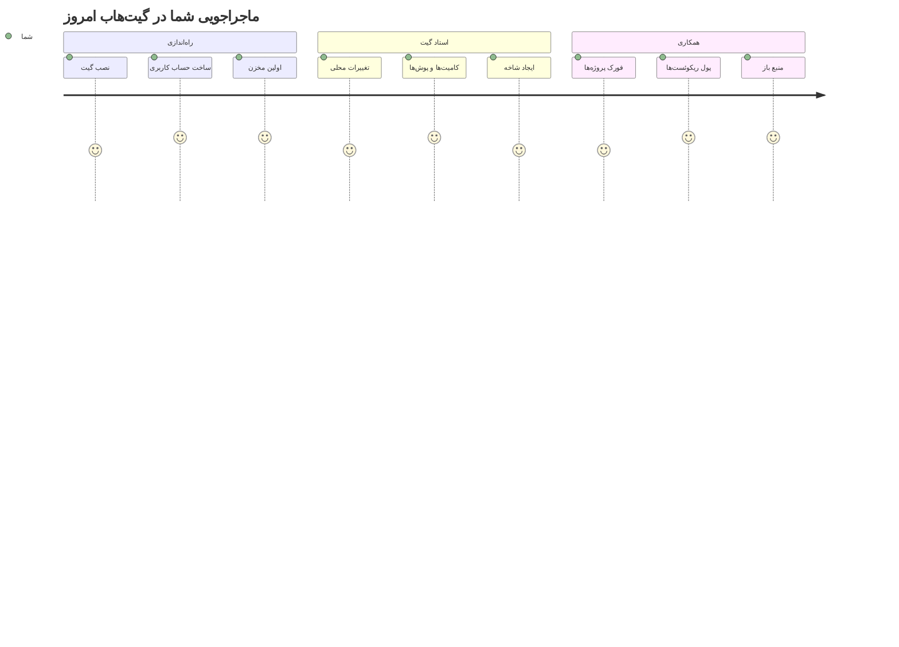
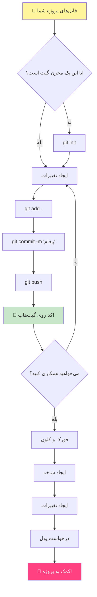
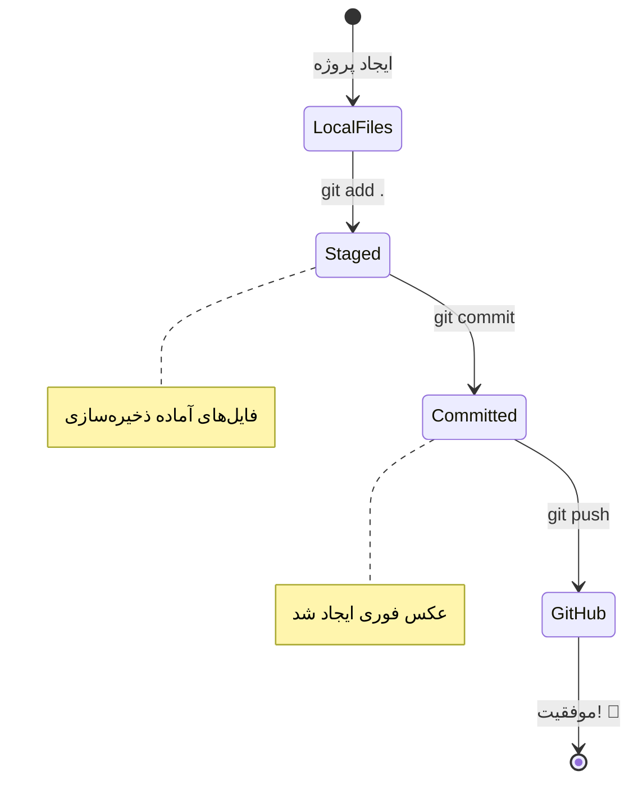
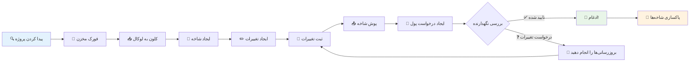
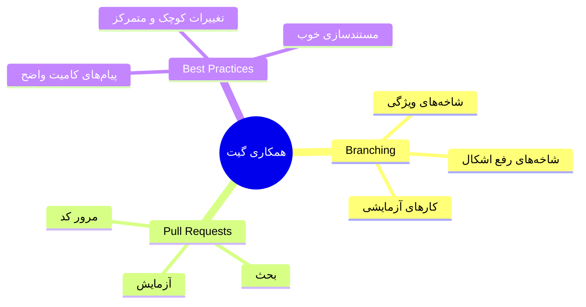
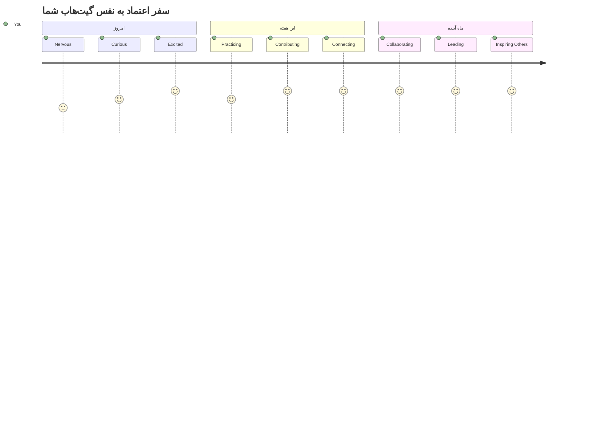

<!--
CO_OP_TRANSLATOR_METADATA:
{
  "original_hash": "5c383cc2cc23bb164b06417d1c107a44",
  "translation_date": "2026-01-06T10:53:54+00:00",
  "source_file": "1-getting-started-lessons/2-github-basics/README.md",
  "language_code": "fa"
}
-->
# مقدمه‌ای بر گیت‌هاب

هی آینده‌ساز برنامه‌نویسی! 👋 آماده‌ای تا به میلیون‌ها برنامه‌نویس در سراسر جهان بپیوندی؟ من واقعاً هیجان‌زده‌ام که گیت‌هاب را به تو معرفی کنم – تصور کن مثل یک شبکه اجتماعی برای برنامه‌نویسان است، فقط به جای به اشتراک گذاشتن عکس‌های ناهار، کد به اشتراک می‌گذاریم و با هم چیزهای شگفت‌انگیزی می‌سازیم!

آنچه که واقعاً من را شگفت‌زده می‌کند این است: هر اپلیکیشن روی گوشی‌ات، هر وب‌سایتی که بازدید می‌کنی و بیشتر ابزارهایی که یاد می‌گیری استفاده کنی توسط تیم‌هایی از توسعه‌دهندگان ساخته شده‌اند که روی پلتفرم‌هایی همچون گیت‌هاب همکاری می‌کنند. آن اپ موزیکی که دوست داری؟ کسی مثل تو در ساختش سهم داشته. آن بازی‌ای که نمی‌توانی رهایش کنی؟ بله، احتمالاً با همکاری‌های گیت‌هاب ساخته شده. و حالا تو قراره یاد بگیری چطور بخشی از آن جامعه شگفت‌انگیز باشی!

می‌دانم در ابتدا ممکن است همه چیز کمی پیچیده به نظر برسد – خودم یادم هست که وقتی اولین صفحه گیت‌هاب را دیدم، فکر می‌کردم «این اصلاً یعنی چه؟» اما حقیقت این است: هر توسعه‌دهنده دقیقاً از جایی مثل الان تو شروع کرده. تا پایان این درس، شما مخزن گیت‌هاب خودت را خواهی داشت (تصورش کن مثل ویترینی شخصی از پروژه‌هایت در فضای ابری) و یاد می‌گیری چطور کارهایت را ذخیره کنی، با دیگران به اشتراک بگذاری، و حتی به پروژه‌هایی که میلیون‌ها نفر استفاده می‌کنند کمک کنی.

این سفر را با هم قدم به قدم طی می‌کنیم. بدون عجله، بدون فشار – فقط تو، من و ابزارهای واقعاً باحالی که قرار است بهترین دوستان جدیدت شوند!


> یادداشت تصویری توسط [Tomomi Imura](https://twitter.com/girlie_mac)


## آزمون قبل از درس
[آزمون قبل از درس](https://ff-quizzes.netlify.app)

## مقدمه

قبل از اینکه وارد بخش‌های هیجان‌انگیز بشویم، بیا کامپیوتر تو را آماده کنیم برای کمی جادوی گیت‌هاب! تصور کن مثل آماده‌کردن ابزارهای هنری قبل از خلق یک اثر شاهکار است – داشتن ابزارهای مناسب کار را بسیار روان‌تر و سرگرم‌کننده‌تر می‌کند.

من قدم به قدم تو را در راه‌اندازی همراهی خواهم کرد، و قول می‌دهم به آن اندازه که در نگاه اول به نظر می‌رسد سخت نیست. اگر یک چیز بلافاصله متوجه نشدی، کاملاً طبیعی است! یادم هست وقتی اولین محیط توسعه‌ام را راه‌اندازی می‌کردم، احساس می‌کردم دارم هیروگلیف‌های باستانی می‌خوانم. هر توسعه‌دهنده‌ای همین الان دقیقاً در جایی است که تو هستی و دارد با خودش فکر می‌کند این کار را درست انجام می‌دهد یا نه. نکته مهم: اگر الان اینجا هستی و داری یاد می‌گیری، پس هم‌اکنون در مسیر درست هستی! 🌟

در این درس، موارد زیر را بررسی می‌کنیم:

- پیگیری کاری که روی دستگاه خودت انجام می‌دهی
- کار کردن روی پروژه‌ها با دیگران
- چگونگی مشارکت در نرم‌افزارهای متن‌باز

### پیش‌نیازها

بیایید کامپیوتر تو را برای جادوی گیت‌هاب آماده کنیم! نگران نباش – این تنظیمات فقط یک‌بار انجام می‌شود و بعد برای کل مسیر برنامه‌نویسی‌ات آماده‌ای.

خوب، ابتدا باید ببینیم آیا گیت روی کامپیوتر تو نصب است یا نه. گیت در واقع مثل داشتن یک دستیار بسیار هوشمند است که هر تغییری که در کدت ایجاد می‌کنی را به یاد می‌آورد – خیلی بهتر از اینکه هر دو ثانیه Ctrl+S بزنی (همه ما این کار را کرده‌ایم!).

بیایید ببینیم گیت نصب شده یا نه. این فرمان جادویی را در ترمینالت تایپ کن:
`git --version`

اگر هنوز گیت نصب نیست، نگران نباش! به [صفحه دانلود گیت](https://git-scm.com/downloads) برو و نصبش کن. پس از نصب، باید گیت را به درستی به تو معرفی کنیم:

> 💡 **راه‌اندازی اولیه**: این دستورات به گیت می‌گویند تو کی هستی. این اطلاعات به هر کامیتی که ارسال می‌کنی ضمیمه خواهد شد، پس اسم و ایمیلی انتخاب کن که راحت باشی آن را به صورت عمومی به اشتراک بگذاری.

```bash
git config --global user.name "your-name"
git config --global user.email "your-email"
```

برای بررسی پیکربندی گیت می‌توانی تایپ کنی:
```bash
git config --list
```

همچنین نیاز به یک حساب گیت‌هاب، یک ویرایشگر کد (مانند Visual Studio Code) داری و باید ترمینالت (یا خط فرمان) را باز کنی.

به [github.com](https://github.com/) برو و اگر حساب نداری یکی بساز یا وارد شو و پروفایل خودت را پر کن.

💡 **نکته مدرن**: در نظر داشته باش راه‌اندازی [کلیدهای SSH](https://docs.github.com/en/authentication/connecting-to-github-with-ssh) یا استفاده از [GitHub CLI](https://cli.github.com/) برای احراز هویت آسان‌تر بدون نیاز به پسورد را.

✅ گیت‌هاب تنها مخزن کد در جهان نیست؛ مخازن دیگری هم هستند ولی گیت‌هاب شناخته‌شده‌ترین است

### آماده‌سازی

تو به هر دو یک پوشه حاوی پروژه کد روی دستگاه محلی (لپ‌تاپ یا کامپیوتر) و یک مخزن عمومی روی گیت‌هاب نیاز داری که به عنوان نمونه‌ای برای نحوه مشارکت در پروژه‌های دیگران استفاده شود.

### ایمن نگه داشتن کد

برای لحظه‌ای درباره امنیت صحبت کنیم – نگران نباش، قرار نیست با مطالب ترسناک سر و کار داشته باشی! این عادات امنیتی مثل قفل کردن ماشین یا خانه‌ات هستند. عادت‌های ساده‌ای که تبدیل به ذات تو می‌شوند و از کارت مراقبت می‌کنند.

ما از همان ابتدا روش‌های مدرن و امن کار با گیت‌هاب را به تو نشان می‌دهیم. اینگونه عادت‌های خوب می‌سازی که در سراسر مسیر برنامه‌نویسی به کارت می‌آید.

وقتی با گیت‌هاب کار می‌کنی، مهم است که بهترین شیوه‌های امنیتی را رعایت کنی:

| حوزه امنیتی | بهترین شیوه | چرا مهم است |
|-------------|-------------|-------------|
| **احراز هویت** | استفاده از کلیدهای SSH یا توکن‌های دسترسی شخصی | پسوردها کمتر امن هستند و در حال حذف‌اند |
| **احراز هویت دو مرحله‌ای** | فعال کردن 2FA در حساب گیت‌هاب | لایه اضافی برای محافظت حساب ایجاد می‌کند |
| **امنیت مخزن** | هرگز اطلاعات حساس را کامیت نکن | کلیدهای API و پسوردها نباید در مخازن عمومی باشند |
| **مدیریت وابستگی‌ها** | فعال کردن Dependabot برای به‌روزرسانی‌ها | وابستگی‌ها را امن و به‌روز نگه می‌دارد |

> ⚠️ **یادآوری امنیتی حیاتی**: هرگز کلیدهای API، پسورد یا اطلاعات حساس دیگر را به هیچ مخزنی کامیت نکن. از متغیرهای محیطی و فایل‌های `.gitignore` برای محافظت استفاده کن.

**راه‌اندازی احراز هویت مدرن:**

```bash
# ایجاد کلید SSH (الگوریتم مدرن ed25519)
ssh-keygen -t ed25519 -C "your_email@example.com"

# تنظیم گیت برای استفاده از SSH
git remote set-url origin git@github.com:username/repository.git
```

> 💡 **نکته حرفه‌ای**: کلیدهای SSH نیاز به وارد کردن مکرر پسورد را حذف می‌کنند و از روش‌های سنتی امن‌ترند.

---

## مدیریت کدت مثل یک حرفه‌ای

خب، اینجا جایی است که همه چیز واقعاً هیجان‌انگیز می‌شود! 🎉 ما قراره یاد بگیریم چطور کدت را مثل حرفه‌ای‌ها پیگیری و مدیریت کنی، و راستش این یکی از بخش‌های موردعلاقه من برای آموزش است چون تغییر بزرگی به وجود می‌آورد.

تصور کن داری یک داستان شگفت‌انگیز می‌نویسی و می‌خواهی هر پیش‌نویس، هر اصلاح درخشان و هر لحظه‌ای که فکر می‌کنی «این عالی بود!» را ثبت کنی. دقیقاً کار گیت برای کد تو همین است! مثل داشتن یک دفتر یادداشت زمان‌سفر که همه چیز را به یاد می‌آورد – هر فشار کلید، هر تغییر، هر لحظه‌ای که می‌گویی «اوپس، همه چیز خراب شد» و می‌خواهی فوراً برگردی.

راستش را بخواهی، ممکن است ابتدا کمی سنگین به نظر برسد. وقتی خودم شروع کردم، فکر می‌کردم «چرا نمی‌توانم فایل‌هایم را مثل همیشه ذخیره کنم؟» اما باور کن: وقتی گیت برایت جا بیفتد (و خواهد افتاد!)، آن لحظه‌ای است که می‌گویی «چطور تا الان بدون این کار کرده‌ام؟» مثل کشف پرواز وقتی تمام عمر تنها راه رفتن بوده‌ای!

فرض کنیم یک پوشه محلی داری که پروژه کد در آن است و می‌خواهی با استفاده از گیت - سیستم کنترل نسخه - روند پیشرفتت را پیگیری کنی. بعضی‌ها استفاده از گیت را مثل نوشتن نامه عاشقانه به خود آینده‌شان می‌دانند. وقتی پیام‌های کامیت خود را روزها، هفته‌ها یا ماه‌ها بعد می‌خوانی، می‌توانی دلیل گرفتن تصمیمات را به یاد بیاوری یا یک تغییر را "برگردانی" - البته وقتی پیام‌های کامیت خوبی نوشته باشی.


### وظیفه: اولین مخزن خودت را بساز!

> 🎯 **مامورت (و من خیلی برایت هیجان‌زده‌ام!)**: ما با هم اولین مخزن گیت‌هاب تو را ایجاد می‌کنیم! وقتی کار تمام شد، یک گوشه کوچک اختصاصی در اینترنت خواهی داشت که کدت در آن زندگی می‌کند، و اولین "کامیت" خود را انجام داده‌ای (که به زبان برنامه‌نویسان یعنی ذخیره هوشمندانه کار خود).
>
> این لحظه واقعاً خاص است – تو تازه به طور رسمی به جامعه جهانی برنامه‌نویسان ملحق می‌شوی! من هنوز آن هیجان اولین مخزنم را یادم هست و اینکه فکر می‌کردم «وای، من واقعاً این را انجام می‌دهم!»

بیایید این ماجراجویی را قدم به قدم طی کنیم. هر بخش را با آرامش انجام بده – عجله نکن، هیچ جایزه‌ای برای سرعت زیاد نیست و من قول می‌دهم هر قدم معنی خواهد داد. یادت باشد، هر برنامه‌نویس برتری که تحسین می‌کنی، زمانی دقیقاً در جایی بوده که تو هستی، و آماده ساخت اولین مخزنش بود. چقدر عالی است؟

> ویدیو را ببین
> 
> [](https://www.youtube.com/watch?v=9R31OUPpxU4)

**بیایید با هم انجام دهیم:**

1. **مخزنت را در گیت‌هاب بساز**. به GitHub.com برو و به دنبال دکمه سبز روشن **New** (یا علامت **+** در بالا سمت راست) بگرد. روی آن کلیک کن و گزینه **New repository** را انتخاب کن.

   کارهای زیر را انجام بده:
   1. به مخزنت یک اسم بده – چیزی که برایت معنادار باشد!
   1. اگر خواستی توضیحی اضافه کن (این کمک می‌کند دیگران بفهمند پروژه درباره چیست)
   1. تصمیم بگیر می‌خواهی مخزن عمومی باشد (همه ببینند) یا خصوصی (فقط برای خودت)
   1. توصیه می‌کنم گزینه افزودن فایل README را تیک بزنی – مثل صفحه اول پروژه است
   1. روی **Create repository** کلیک کن و جشن بگیر – تو اولین مخزنت را ساخته‌ای! 🎉

2. **به پوشه پروژه‌ات برو**. حالا ترمینالت را باز کن (نگران نباش، به آن ترسناکی که فکر می‌کنی نیست!). باید به کامپیوتر بگویی فایل‌های پروژه‌ات کجا هستند. این دستور را وارد کن:

   ```bash
   cd [name of your folder]
   ```

   **کار ما اینجا چیست:**
   - داریم به کامپیوتر می‌گوییم «هی، من را به پوشه پروژه‌ام ببر»
   - این مثل این است که یک پوشه مشخص در دسکتاپ باز کنی، ولی با دستورات متنی
   - `[name of your folder]` را با اسم واقعی پوشه پروژه‌ات جایگزین کن

3. **پوشه‌ات را به یک مخزن گیت تبدیل کن**. اینجا جادوی گیت رخ می‌دهد! تایپ کن:

   ```bash
   git init
   ```

   **چیزی که اینجا اتفاق افتاد (خیلی باحال است!):**
   - گیت پوشه مخفی `.git` را در پروژه‌ات ساخت – این پوشه را نمی‌بینی اما وجود دارد!
   - پوشه معمولی تو حالا یک "مخزن" است که همه تغییراتی که می‌دهی را دنبال می‌کند
   - تصور کن به پوشه‌ات ابرقدرت داده‌ای که همه چیز را به خاطر بسپارد

4. **ببین گیت چه فکر می‌کند**. بیایید ببینیم گیت در مورد پروژه تو الان چه می‌گوید:

   ```bash
   git status
   ```

   **فهمیدن پیام گیت:**
   
   ممکن است چیزی شبیه این ببینی:

   ```output
   Changes not staged for commit:
   (use "git add <file>..." to update what will be committed)
   (use "git restore <file>..." to discard changes in working directory)

        modified:   file.txt
        modified:   file2.txt
   ```

   **نگران نباش! معنی این‌ها این است:**
   - فایل‌های **قرمز** فایل‌هایی هستند که تغییر دارند اما هنوز آماده ذخیره شدن نیستند
   - فایل‌های **سبز** (وقتی ظاهر می‌شوند) آماده ذخیره شدن هستند
   - گیت دارد مفیدانه می‌گوید دقیقاً حالا چه کاری می‌توانی انجام دهی

   > 💡 **نکته حرفه‌ای**: فرمان `git status` بهترین دوستت است! هر وقت سردرگم بودی از آن بپرس. مثل این است که از گیت بپرسی «حالا وضعیت چطور است؟»

5. **فایل‌های خودت را برای ذخیره کردن آماده کن** (به این کار «پیش‌فرض‌گذاری» یا staging می‌گویند):

   ```bash
   git add .
   ```

   **کار ما همین الان چه بود:**
   - به گیت گفتیم «همه فایل‌ها را برای ذخیره بعدی آماده کن»
   - `.` مثل این است که بگویی «همه چیز داخل این پوشه»
   - حالا فایل‌های تو «آماده» شده‌اند و منتظر مرحله بعدی

   **می‌خواهی انتخابی‌تر عمل کنی؟** فقط می‌توانی فایل‌های خاصی را اضافه کنی:

   ```bash
   git add [file or folder name]
   ```

   **چرا ممکن است این کار را بخواهی بکنی؟**
   - گاهی می‌خواهی تغییرات مرتبط را با هم ذخیره کنی
   - کمک می‌کند کارت را به بخش‌های منطقی تقسیم کنی
   - فهمیدن اینکه چه چیزی و کی تغییر کرده را آسان‌تر می‌کند

   **نظر تغییر کرده؟** نگران نباش! می‌توانی فایل‌ها را از حالت آماده خارج کنی:

   ```bash
   # همه چیز را از مرحله خارج کنید
   git reset
   
   # فقط یک فایل را از مرحله خارج کنید
   git reset [file name]
   ```

   نگران نباش – این کار فایل‌ها را پاک نمی‌کند، فقط آنها را از مجموعه «آماده ذخیره» خارج می‌کند.

6. **کار خودت را برای همیشه ذخیره کن** (اولین کامیت تو!):

   ```bash
   git commit -m "first commit"
   ```

   **🎉 تبریک! اولین کامیت خود را انجام دادی!**
   
   **اینجا چه اتفاقی افتاد:**
   - گیت یک «عکس فوری» از همه فایل‌های آماده در همین لحظه گرفت
   - پیام کامیت تو "first commit" توضیح می‌دهد این ذخیره درباره چه چیزی است
   - گیت به این عکس فوری یک شناسه منحصربه‌فرد داد تا همیشه بتوانی پیدایش کنی
   - مستندات پروژه‌ات را رسماً شروع کردی!

   > 💡 **پیام‌های کامیت آینده**: برای کامیت‌های بعدی‌ات واضح‌تر باش! به جای "updated stuff"، بگو "اضافه کردن فرم تماس به صفحه اصلی" یا "رفع مشکل منوی ناوبری". خود آینده‌ات از تو تشکر خواهد کرد!

7. **پروژه محلی خود را به گیت‌هاب وصل کن**. همین الان پروژه تو فقط روی کامپیوترت است. بیا آن را به مخزن گیت‌هابت وصل کنیم تا بتوانی آن را با جهان به اشتراک بگذاری!

   ابتدا به صفحه مخزن گیت‌هاب خود برو و URL آن را کپی کن. سپس برگرد اینجا و تایپ کن:

   ```bash
   git remote add origin https://github.com/username/repository_name.git
   ```
   
   (آن URL را با URL واقعی مخزنت جایگزین کن!)

   **کاری که انجام دادیم:**
   - ما یک ارتباط بین پروژه محلی شما و مخزن GitHub شما ایجاد کردیم  
   - "origin" فقط یک نام مستعار برای مخزن GitHub شما است – مثل اضافه کردن یک مخاطب به تلفن شما  
   - حالا گیت محلی شما می‌داند وقتی آماده به اشتراک‌گذاری کد هستید، کجا باید کد شما را ارسال کند  

   💡 **راه آسان‌تر**: اگر GitHub CLI نصب دارید، می‌توانید این کار را با یک دستور انجام دهید:  
   ```bash
   gh repo create my-repo --public --push --source=.
   ```
  
8. **کد خود را به GitHub ارسال کنید** (لحظه بزرگ!):  

   ```bash
   git push -u origin main
   ```
  
   **🚀 این همینه! شما کد خود را به GitHub آپلود می‌کنید!**  
   
   **چه اتفاقی می‌افتد:**  
   - کامیت‌های شما از کامپیوترتان به GitHub منتقل می‌شوند  
   - گزینه `-u` یک اتصال دائمی تنظیم می‌کند تا ارسال‌های بعدی آسان‌تر باشند  
   - "main" نام شاخه اصلی شما است (مثل پوشه اصلی)  
   - بعد از این می‌توانید فقط `git push` را برای آپلودهای بعدی تایپ کنید!  

   💡 **یادداشت سریع**: اگر نام شاخه شما چیز دیگری است (مثل "master") از همان نام استفاده کنید. می‌توانید با دستور `git branch --show-current` بررسی کنید.  

9. **ریتم روزانه جدید کدنویسی شما** (اینجا است که اعتیادآور می‌شود!):  

   از این به بعد، هر وقت تغییراتی در پروژه‌تان ایجاد می‌کنید، این رقص ساده سه‌مرحله‌ای را دارید:  

   ```bash
   git add .
   git commit -m "describe what you changed"
   git push
   ```
  
   **این ضربان قلب کدنویسی شما می‌شود:**  
   - تغییرات عالی در کدتان ایجاد کنید ✨  
   - با `git add` آنها را آماده کنید ("هی گیت، به این تغییرات توجه کن!")  
   - با `git commit` و پیامی توصیفی ذخیره کنید (شما در آینده از خودتان ممنون خواهید بود!)  
   - با `git push` 🚀 آنها را با جهان به اشتراک بگذارید  
   - تکرار کنید – جدی می‌گویم، این به همان اندازه طبیعی می‌شود که نفس کشیدن!  

   من این روند کاری را دوست دارم چون مثل داشتن چند نقطه ذخیره در یک بازی ویدیویی است. تغییری که دوست دارید ایجاد کردید؟ آن را کامیت کنید! می‌خواهید چیزی ریسکی امتحان کنید؟ مشکلی نیست – همیشه می‌توانید به آخرین کامیت خود برگردید اگر اوضاع خراب شد!  

   > 💡 **نکته**: ممکن است بخواهید یک فایل `.gitignore` نیز داشته باشید تا فایل‌هایی که نمی‌خواهید رهگیری شوند در GitHub ظاهر نشوند – مثل همان فایل یادداشتی که در همان پوشه ذخیره می‌کنید ولی جای آن در مخزن عمومی نیست. می‌توانید قالب‌های فایل `.gitignore` را در [.gitignore templates](https://github.com/github/gitignore) پیدا کنید یا با استفاده از [gitignore.io](https://www.toptal.com/developers/gitignore) یکی بسازید.  

### 🧠 **اولین ثبت مخزن: حسش چطور بود؟**  

**لحظه‌ای برای جشن گرفتن و فکر کردن داشته باشید:**  
- دیدن کدتان که برای اولین بار روی GitHub ظاهر شد چه حسی داشت؟  
- کدام مرحله گیج‌کننده‌ترین بود و کدام به طرز شگفت‌آوری آسان؟  
- می‌توانید تفاوت بین `git add`، `git commit` و `git push` را با کلمات خودتان توضیح دهید؟  


> **به یاد داشته باشید**: حتی توسعه‌دهندگان با تجربه هم گاهی اوقات دقیقاً دستورات را فراموش می‌کنند. تبدیل این روند کاری به عادت عضلانی نیاز به تمرین دارد – شما خیلی خوب پیش می‌روید!  

#### گردش‌کارهای مدرن گیت  

در نظر داشته باشید این روش‌های مدرن را به کار بگیرید:  

- **کامیت‌های قراردادی**: از قالب پیام کامیت استانداردی مثل `feat:`، `fix:`، `docs:` و غیره استفاده کنید. بیشتر بدانید در [conventionalcommits.org](https://www.conventionalcommits.org/)  
- **کامیت‌های اتمی**: هر کامیت فقط یک تغییر منطقی را نمایندگی کند  
- **کامیت‌های مکرر**: به جای کامیت‌های بزرگ و کم‌تعداد، اغلب با پیام‌های توصیفی کامیت بزنید  

#### پیام‌های کامیت  

یک خط موضوع عالی در Git باید جمله زیر را کامل کند:  
اگر اعمال شود، این کامیت <موضوع شما اینجا> انجام می‌دهد  

برای موضوع از وجه امری زمان حال استفاده کنید: "change" نه "changed" و نه "changes".  
همانطور که در موضوع، در بدنه (اختیاری) نیز از وجه امری زمان حال استفاده کنید. بدنه باید انگیزه تغییر را توضیح دهد و آن را با رفتار قبلی مقایسه کند. شما دارید `چرا` را توضیح می‌دهید، نه `چگونه`.  

✅ چند دقیقه در GitHub بگردید. آیا می‌توانید یک پیام کامیت واقعاً عالی پیدا کنید؟ آیا یک پیام کامیت حداقلی پیدا می‌کنید؟ به نظر شما مهم‌ترین و مفیدترین اطلاعاتی که باید در پیام کامیت منتقل شود چیست؟  

## همکاری با دیگران (قسمت سرگرم‌کننده!)  

کلاهتان را نگه دارید چون اینجاست که GitHub واقعاً جادویی می‌شود! 🪄 شما مدیریت کد خود را یاد گرفته‌اید، اما حالا به بخش مورد علاقه من می‌رویم – همکاری با افراد شگفت‌انگیز از سراسر جهان.  

تصور کنید: فردا صبح بیدار می‌شوید و می‌بینید که شخصی در توکیو وقتی خواب بودید کد شما را بهبود داده است. بعد شخصی در برلین باگی که گیر کرده بودید را رفع می‌کند. عصر، یک توسعه‌دهنده در سائوپائولو ویژگی‌ای را اضافه می‌کند که حتی به آن فکر هم نکرده بودید. این داستان علمی تخیلی نیست – این فقط یک سه‌شنبه در دنیای GitHub است!  

چیزی که من را خیلی هیجان‌زده می‌کند این است که مهارت‌هایی که قصد یادگیری آنها را دارید دقیقاً همان گردش‌کارهایی است که تیم‌های گوگل، مایکروسافت و استارتاپ‌های محبوب شما هر روز استفاده می‌کنند. شما فقط یک ابزار جالب یاد نمی‌گیرید – شما زبان رازآلودی را یاد می‌گیرید که باعث می‌شود کل دنیای نرم‌افزار با هم کار کند.  

واقعاً، وقتی هیجان باز کردن اولین درخواست pull خود را تجربه کنید، می‌فهمید چرا توسعه‌دهندگان این قدر به متن‌باز علاقه‌مندند. مثل عضوی از بزرگ‌ترین پروژه تیمی خلاقانه جهان شدن است!  

> ویدیو را ببینید  
>  
> [](https://www.youtube.com/watch?v=bFCM-PC3cu8)  

دلیل اصلی قرار دادن چیزها روی GitHub این بود که امکان همکاری با توسعه‌دهندگان دیگر فراهم شود.  


در مخزن خود، به `Insights > Community` بروید تا ببینید پروژه‌تان چطور با استانداردهای جامعه توصیه شده مقایسه می‌شود.  

می‌خواهید مخزن شما حرفه‌ای و دوستانه به نظر برسد؟ به مخزن خود بروید و روی `Insights > Community` کلیک کنید. این ویژگی جالب به شما نشان می‌دهد پروژه شما چقدر با آنچه جامعه GitHub به عنوان «بهترین شیوه‌های مخزن» می‌شناسد تطابق دارد.  

> 🎯 **درخشان کردن پروژه‌تان**: یک مخزن سازماندهی‌شده با مستندات خوب مثل داشتن یک ویترین تمیز و دوستانه است. به دیگران نشان می‌دهد که به کارتان اهمیت می‌دهید و دیگران را به مشارکت ترغیب می‌کند!  

**اینها مواردی هستند که یک مخزن فوق‌العاده می‌سازند:**  

| چه چیز اضافه شود | چرا اهمیت دارد | چه کاری برای شما انجام می‌دهد |  
|-------------|-------------------|---------------------|  
| **توضیحات** | اولین برداشت مهم است! | مردم بلافاصله می‌فهمند پروژه شما چه کاری می‌کند |  
| **README** | صفحه اول پروژه شما | مثل یک راهنمای گردشگر دوستانه برای بازدیدکنندگان جدید |  
| **دستورالعمل‌های مشارکت** | نشان می‌دهد کمک را می‌پذیرید | مردم دقیقاً می‌دانند چطور می‌توانند کمک کنند |  
| **قواعد رفتار** | فضایی دوستانه می‌سازد | همه احساس می‌کنند برای مشارکت خوش‌آمد هستند |  
| **مجوز** | وضوح حقوقی | دیگران می‌دانند چگونه می‌توانند از کد شما استفاده کنند |  
| **سیاست امنیتی** | نشان می‌دهد مسئول هستید | رویه‌های حرفه‌ای را نشان می‌دهد |  

> 💡 **نکته حرفه‌ای**: GitHub قالب‌هایی برای همه این فایل‌ها فراهم کرده است. هنگام ایجاد مخزن جدید، جعبه‌ها را علامت بزنید تا این فایل‌ها به طور خودکار ساخته شوند.  

**ویژگی‌های مدرن GitHub برای کاوش:**  

🤖 **اتوماسیون و CI/CD:**  
- **GitHub Actions** برای تست و استقرار خودکار  
- **Dependabot** برای به‌روزرسانی خودکار وابستگی‌ها  

💬 **جامعه و مدیریت پروژه:**  
- **GitHub Discussions** برای گفتگوهای جامعه فراتر از مسائل  
- **GitHub Projects** برای مدیریت پروژه به سبک کانبان  
- **قوانین محافظت شاخه** برای اعمال استانداردهای کیفیت کد  

تمام این منابع به جذب اعضای جدید تیم کمک می‌کنند. و این‌ها معمولاً چیزهایی است که مشارکت‌کنندگان جدید قبل از نگاه کردن به کد شما بررسی می‌کنند تا ببینند پروژه شما جای مناسبی برای صرف وقت‌شان هست یا نه.  

✅ فایل‌های README، هرچند تهیه‌شان زمان می‌برد، اغلب توسط نگهدارندگان مشغول نادیده گرفته می‌شوند. می‌توانید یک نمونه واقعاً توصیفی پیدا کنید؟ توجه: برخی [ابزارها برای کمک به ساخت READMEهای خوب](https://www.makeareadme.com/) وجود دارد که ممکن است بخواهید امتحان کنید.  

### وظیفه: ادغام مقداری کد  

مستندات مشارکت به مردم کمک می‌کند در پروژه مشارکت کنند. توضیح می‌دهد چه نوع مشارکت‌هایی مورد نظر شما است و روند چگونه است. مشارکت‌کنندگان باید چند مرحله را طی کنند تا بتوانند در مخزن شما در GitHub مشارکت کنند:  

1. **Fork کردن مخزن شما:** احتمالاً می‌خواهید مردم پروژه شما را _fork_ کنند. Fork کردن یعنی ایجاد یک نسخه کپی از مخزن شما روی حساب GitHub خودشان.  
1. **کلون کردن**. از آنجا پروژه را روی ماشین محلی خود کلون می‌کنند.  
1. **ایجاد یک شاخه**. شما می‌خواهید از آنها بخواهید یک _شاخه_ برای کار خود ایجاد کنند.  
1. **تمرکز تغییرات روی یک حوزه**. از مشارکت‌کنندگان بخواهید مشارکت‌هایشان را هر بار روی یک موضوع تمرکز دهند – اینطوری احتمال اینکه شما بتوانید کارشان را _ادغام_ کنید بیشتر است. تصور کنید آنها یک رفع باگ می‌نویسند، یک ویژگی جدید اضافه می‌کنند و چند تست را به‌روزرسانی می‌کنند – اگر بخواهید یا بتوانید فقط دو مورد از سه مورد را پیاده کنید یا فقط یک مورد را، چه می‌شود؟  

✅ تصور کنید موقعیتی که شاخه‌ها در نوشتن و ارسال کد خوب به‌خصوص حیاتی هستند. چه موارد استفاده‌ای به ذهن‌تان می‌رسد؟  

> توجه داشته باشید، خودتان هم تغییر باشید و برای کار خود شاخه بسازید. هر کامیتی که بزنید روی شاخه‌ای است که الان روی آن «چک اوت» هستید. با `git status` ببینید الان روی کدام شاخه هستید.  

بیایید روند کاری مشارکت‌کننده را مرور کنیم. فرض کنید مشارکت‌کننده قبلاً مخزن را _fork_ و _clone_ کرده و حالا یک مخزن Git آماده برای کار روی ماشین محلی خود دارد:  

1. **ایجاد یک شاخه**. با دستور `git branch` یک شاخه ایجاد کنید که تغییرات مورد نظر برای مشارکت در آن قرار بگیرند:  

   ```bash
   git branch [branch-name]
   ```
  
   > 💡 **روش مدرن**: می‌توانید شاخه جدید را در یک دستور ایجاد کرده و به آن سوییچ کنید:  
   ```bash
   git switch -c [branch-name]
   ```
  
1. **سوییچ به شاخه کاری**. به شاخه مشخص شده بروید و دایرکتوری کاری را با `git switch` به‌روزرسانی کنید:  

   ```bash
   git switch [branch-name]
   ```
  
   > 💡 **یادداشت مدرن**: `git switch` جایگزین مدرن و واضح‌تری برای `git checkout` هنگام تغییر شاخه است. برای مبتدیان ایمن‌تر است.  

1. **انجام کار**. حالا باید تغییرات خود را اضافه کنید. فراموش نکنید با دستورات زیر به گیت اطلاع دهید:  

   ```bash
   git add .
   git commit -m "my changes"
   ```
  
   > ⚠️ **کیفیت پیام کامیت**: اطمینان حاصل کنید که کامیت خود را دقیق نام‌گذاری می‌کنید، هم به نفع خودتان و هم نگهدارنده مخزنی که کمک می‌کنید. مشخص و دقیق بگویید چه چیزی را تغییر دادید!  

1. **ادغام کار خود با شاخه `main`**. زمانی که کارتان تمام شد، می‌خواهید کار خود را با شاخه `main` ادغام کنید. شاخه `main` ممکن است در این فاصله تغییر کرده باشد، پس اول آن را با دستورات زیر به‌روزرسانی کنید:  

   ```bash
   git switch main
   git pull
   ```
  
   حالا باید اطمینان حاصل کنید که هرگونه _تعارض_، موقعیتی که Git نمی‌تواند به راحتی تغییرات را _ادغام_ کند، در شاخه کاری شما رخ می‌دهد. بنابراین دستورات زیر را اجرا کنید:  

   ```bash
   git switch [branch_name]
   git merge main
   ```
  
   دستور `git merge main` همه تغییرات شاخه `main` را وارد شاخه شما می‌کند. امیدواریم بتوانید به راحتی ادامه دهید. اگر نه، VS Code به شما خواهد گفت Git کجا _گیج_ شده است و فقط فایل‌های مربوطه را ویرایش کنید تا مشخص کنید کدام محتوا دقیق‌تر است.  

   💡 **جایگزین مدرن**: استفاده از `git rebase` را برای تاریخچه پاک‌تر در نظر بگیرید:  
   ```bash
   git rebase main
   ```
  
   این دستور کامیت‌های شما را روی آخرین شاخه main بازپخش می‌کند و تاریخچه خطی ایجاد می‌کند.  

1. **ارسال کارتان به GitHub**. ارسال کارتان به GitHub یعنی دو کار: شاخه خود را به مخزن fork شده خود push کنید و سپس یک PR، درخواست pull باز کنید.  

   ```bash
   git push --set-upstream origin [branch-name]
   ```
  
   دستور بالا شاخه را روی مخزن fork شده شما ایجاد می‌کند.  

### 🤝 **بررسی مهارت‌های همکاری: آیا برای کار با دیگران آماده‌اید؟**  

**بیایید ببینیم درباره همکاری چه احساسی دارید:**  
- آیا اکنون ایده fork کردن و درخواست‌های pull برای شما روشن است؟  
- یک چیز درباره کار با شاخه‌ها که می‌خواهید بیشتر تمرین کنید چیست؟  
- چقدر درباره مشارکت در پروژه دیگران راحت هستید؟  


> **افزایش اعتماد به نفس**: هر توسعه‌دهنده‌ای که تحسین می‌کنید یک بار از اولین درخواست pull خود استرس داشته است. جامعه GitHub به تازه‌واردان واقعاً خوش‌آمد می‌گوید!  

1. **باز کردن یک PR**. بعد، می‌خواهید یک PR باز کنید. این کار را با رفتن به مخزن fork شده در GitHub انجام می‌دهید. یک اعلان روی GitHub می‌بینید که می‌پرسد آیا می‌خواهید یک PR جدید بسازید، روی آن کلیک می‌کنید و به صفحه‌ای منتقل می‌شوید که می‌توانید عنوان پیام کامیت را تغییر داده و توصیف بهتری بنویسید. اکنون نگهدارنده مخزنی که fork کرده‌اید این PR را می‌بیند و _ان‌شاءالله_ آن را تحسین و _ادغام_ می‌کند. شما حالا یک مشارکت‌کننده هستید، آفرین :)  

   💡 **نکته مدرن**: می‌توانید با GitHub CLI هم PR بسازید:  
   ```bash
   gh pr create --title "Your PR title" --body "Description of changes"
   ```
  
   🔧 **بهترین روش‌ها برای PR:**  
   - لینک دادن به مسائل مرتبط با کلیدواژه‌هایی مثل "Fixes #123"  
   - افزودن اسکرین‌شات برای تغییرات UI  
   - درخواست بازبین‌های مشخص  
   - استفاده از PRهای پیش‌نویس برای کار در حال پیشرفت  
   - اطمینان از عبور همه تست‌های CI قبل از درخواست بازبینی  
1. **پاک‌سازی**. بعد از اینکه موفق شدید یک درخواست pull را ادغام کنید، تمیزکاری کردن کاری خوب و پسندیده است. شما می‌خواهید هم شاخه محلی و هم شاخه‌ای که به GitHub ارسال کردید را پاک کنید. ابتدا اجازه دهید با دستور زیر آن را به صورت محلی حذف کنیم:

   ```bash
   git branch -d [branch-name]
   ```

  حتماً به صفحه GitHub مخزن فورک‌شده بروید و شاخه راه دور که به تازگی به آن ارسال کردید را حذف کنید.

`Pull request` ممکن است اصطلاحی خنده‌دار باشد چون واقعاً شما می‌خواهید تغییرات خود را به پروژه ارسال کنید. ولی مدیر پروژه (صاحب پروژه) یا تیم اصلی باید تغییرات شما را قبل از ادغام با شاخه "main" پروژه بررسی کنند، پس در واقع شما درخواست تصمیم‌گیری درباره تغییر را از مدیر پروژه می‌دهید.

یک pull request جایی است برای مقایسه و بحث درباره تفاوت‌هایی که روی شاخه ایجاد شده با مرورها، نظرات، تست‌های یکپارچه و موارد دیگر. یک درخواست pull خوب معمولاً قوانین مشابه پیام commit را دنبال می‌کند. می‌توانید یک ارجاع به issue در ردیاب issues اضافه کنید، مثلاً وقتی کاری که انجام می‌دهید یک issue را اصلاح می‌کند. این کار با `#` و سپس شماره issue انجام می‌شود. برای مثال `#97`.

🤞دست‌ها را می‌گذاریم که همه بررسی‌ها موفق باشند و صاحب پروژه تغییراتتان را در پروژه ادغام کند🤞

شاخه کاری محلی فعلی خود را با تمام commit های جدید شاخه راه دور مرتبط روی GitHub به‌روز کنید:

`git pull`

## مشارکت در نرم‌افزار متن‌باز (شانس شما برای ایجاد تاثیر!)

آماده‌اید برای چیزی که ذهن‌تان را کاملاً متحیر خواهد کرد؟ 🤯 بیایید درباره مشارکت در پروژه‌های متن‌باز صحبت کنیم – و فقط فکر کردن به این موضوع هم باعث به‌وجود آمدن شور و هیجان می‌شود!

این فرصت شماست که بخشی از چیزی واقعاً شگفت‌انگیز شوید. تصور کنید در حال بهبود ابزارهایی هستید که میلیون‌ها توسعه‌دهنده هر روز استفاده می‌کنند، یا در حال رفع یک باگ در برنامه‌ای هستید که دوستانتان دوست دارند. این فقط یک رویا نیست – این معنای واقعی مشارکت در متن‌باز است!

این چیزی که هر بار فکرش را می‌کنم به من هیجان می‌دهد: هر ابزاری که تاکنون با آن یاد گرفته‌اید – ویرایشگر کد شما، فریم‌ورک‌هایی که بررسی خواهیم کرد، حتی مرورگری که این متن را در آن می‌خوانید – همه با فردی مثل شما که اولین مشارکت خود را انجام داد، شروع شده است. آن توسعه‌دهنده نابغه که افزونه مورد علاقه VS Code شما را ساخت؟ او هم روزی مبتدی بود و با دست‌های لرزان روی "create pull request" کلیک می‌کرد، درست مثل آنچه شما قصد انجامش را دارید.

و این زیباترین قسمت ماجرا است: جامعه متن‌باز مثل بزرگترین آغوش گروهی اینترنتی است. بیشتر پروژه‌ها فعالانه به دنبال تازه‌واردها می‌گردند و مشکلاتی را با برچسب "good first issue" دقیقاً برای شما دارند! مدیران پروژه وقتی که مشارکت کننده‌های جدید می‌بینند واقعاً هیجان‌زده می‌شوند چون قدم‌های اول خودشان را به یاد می‌آورند.

```mermaid
flowchart TD
    A[🔍 جستجو در گیت‌هاب] --> B[🏷️ پیدا کردن "اولین مشکل خوب"]
    B --> C[📖 خواندن دستورالعمل‌های مشارکت]
    C --> D[🍴 فورک کردن مخزن]
    D --> E[💻 راه‌اندازی محیط محلی]
    E --> F[🌿 ساخت شاخه ویژگی]
    F --> G[✨ انجام مشارکت شما]
    G --> H[🧪 آزمایش تغییرات شما]
    H --> I[📝 نوشتن کامیت واضح]
    I --> J[📤 پوش و ایجاد PR]
    J --> K[💬 تعامل با بازخورد]
    K --> L[🎉 ادغام شد! شما یک مشارکت‌کننده هستید!]
    L --> M[🌟 پیدا کردن مشکل بعدی]
    
    style A fill:#e1f5fe
    style L fill:#c8e6c9
    style M fill:#fff59d
```
شما فقط یاد نمی‌گیرید کد بنویسید – در حال آماده شدن برای پیوستن به خانواده‌ای جهانی از سازندگانی هستید که هر روز با این فکر بیدار می‌شوند: "چگونه می‌توانیم دنیای دیجیتال را کمی بهتر کنیم؟" به باشگاه خوش آمدید! 🌟

ابتدا، بیایید یک مخزن (یا **repo**) در GitHub پیدا کنیم که برای شما جالب باشد و دوست داشته باشید تغییر در آن ایجاد کنید. می‌خواهید محتویات آن را به دستگاه خود کپی کنید.

✅ یک راه خوب برای پیدا کردن مخازن 'مناسب برای مبتدیان' این است که به [جستجو بر اساس برچسب 'good-first-issue'](https://github.blog/2020-01-22-browse-good-first-issues-to-start-contributing-to-open-source/) بپردازید.


روش‌های مختلفی برای کپی کردن کد وجود دارد. یک روش این است که محتویات مخزن را "clone" کنید، از طریق HTTPS، SSH، یا با استفاده از رابط خط فرمان GitHub (CLI).

ترمینال خود را باز کنید و مخزن را به این صورت clone کنید:
```bash
# استفاده از HTTPS
git clone https://github.com/ProjectURL

# استفاده از SSH (نیاز به تنظیم کلید SSH دارد)
git clone git@github.com:username/repository.git

# استفاده از رابط خط فرمان GitHub
gh repo clone username/repository
```

برای کار روی پروژه، به پوشه مناسب بروید:
`cd ProjectURL`

همچنین می‌توانید کل پروژه را با استفاده از موارد زیر باز کنید:
- **[GitHub Codespaces](https://github.com/features/codespaces)** - محیط توسعه ابر GitHub با VS Code در مرورگر
- **[GitHub Desktop](https://desktop.github.com/)** - یک برنامه رابط کاربری گرافیکی برای عملیات Git  
- **[GitHub.dev](https://github.dev)** - کلید `.` را روی هر مخزن GitHub فشار دهید تا VS Code در مرورگر باز شود
- VS Code با افزونه GitHub Pull Requests

در نهایت، می‌توانید کد را به صورت یک پوشه فشرده (zip) دانلود کنید.

### چند نکته جالب درباره GitHub

می‌توانید هر مخزن عمومی در GitHub را ستاره دهید، دنبال کنید و یا "fork" کنید. مخازن ستاره‌دار خود را در منوی کشویی بالا سمت راست می‌توانید پیدا کنید. این مثل بوکمارک کردن است، ولی برای کد.

پروژه‌ها یک ردیاب issue دارند، معمولاً در تب "Issues" در GitHub مگر اینکه خلاف آن ذکر شده باشد، جایی که مردم درباره مسائل مربوط به پروژه بحث می‌کنند. و تب Pull Requests جایی است که مردم تغییرات در حال انجام را بحث و بررسی می‌کنند.

پروژه‌ها ممکن است گفتگوها را در فروم‌ها، لیست ایمیل‌ها، یا کانال‌های چت مانند Slack، Discord یا IRC داشته باشند.

🔧 **ویژگی‌های مدرن GitHub**:
- **GitHub Discussions** - فروم داخلی برای گفتگوهای جامعه
- **GitHub Sponsors** - حمایت مالی از مدیران پروژه  
- **تب امنیت (Security)** - گزارش‌ها و توصیه‌های امنیتی
- **تب Actions** - مشاهده روندهای کاری خودکار و خطوط CI/CD
- **تب Insights** - تحلیل مشارکت‌کنندگان، کامیت‌ها و سلامت پروژه
- **تب Projects** - ابزارهای مدیریت پروژه داخلی GitHub

✅ در مخزن جدید GitHub خود بگردید و چند کار را امتحان کنید، مثل ویرایش تنظیمات، افزودن اطلاعات به مخزن، ساخت یک پروژه (مثل تخته کانبان)، و راه‌اندازی GitHub Actions برای اتوماسیون. کارهای زیادی می‌توانید انجام دهید!

---

## 🚀 چالش

خوب، وقت آن است که قدرت‌های جدید و درخشان GitHub خود را آزمایش کنید! 🚀 این چالشی است که همه چیز را به رضایت‌بخش‌ترین شکل کنار هم می‌چینید:

یک دوست (یا عضوی از خانواده که همیشه می‌پرسد با همه این "چیزهای کامپیوتری" چه کار می‌کنی) را صدا کنید و با هم یک ماجراجویی کد نویسی تعاملی را شروع کنید! اینجاست که جادو واقعی اتفاق می‌افتد – یک پروژه بسازید، اجازه دهید آن را fork کند، چند شاخه ایجاد کنید، و تغییرات را مثل حرفه‌ای‌ها ادغام کنید.

راستش را بخواهید – احتمالاً در جایی می‌خندید (خصوصاً وقتی هر دو سعی می‌کنید یک خط را تغییر دهید)، شاید کمی سردرگم شوید، اما قطعاً آن لحظات "آها!" فوق‌العاده را خواهید داشت که تمام یادگیری را ارزشمند می‌کند. علاوه بر این، چیزی خاص در به اشتراک گذاشتن اولین ادغام موفقیت‌آمیز با شخص دیگر وجود دارد – مثل یک جشن کوچک پیشرفت شما!

هنوز همرا کدی ندارید؟ هیچ مشکلی نیست! جامعه GitHub پر است از افراد بسیار خوش‌آمدگو که به یاد دارند تازه کار بودن چه حسی دارد. دنبال مخازنی با برچسب "good first issue" بگردید – آنها اساساً می‌گویند "سلام مبتدی‌ها، بیایید با ما یاد بگیرید!" چقدر فوق‌العاده است؟

## آزمون پس از درس
[آزمون پس از درس](https://ff-quizzes.netlify.app/web/en/)

## مرور و ادامه یادگیری

وای! 🎉 به تو نگاه کن – تازه اصول GitHub را مثل یک قهرمان مطلق یاد گرفته‌ای! اگر ذهنت کمی پر شده، کاملاً طبیعی است و صادقانه بگویم نشانه خوبی است. تو همین الان ابزارهایی را یاد گرفتی که من هفته‌ها طول کشید تا با آنها راحت شوم.

Git و GitHub فوق‌العاده قدرتمند هستند (واقعا قدرتمند)، و هر توسعه‌دهنده‌ای که می‌شناسم – حتی کسانی که حالا مثل جادوگر به نظر می‌رسند – قبل از اینکه همه چیز دستشان بیاید، مجبور بودند تمرین کنند و به مشکل بخورند. این که تو این درس را پشت سر گذاشتی یعنی راه زیادی را برای تسلط بر مهمترین ابزارهای جعبه ابزار برنامه‌نویسی طی کرده‌ای.

اینجا چند منبع واقعاً عالی برای کمک به تمرین و بهتر شدن آورده شده است:

- [راهنمای مشارکت در نرم افزار متن‌باز](https://opensource.guide/how-to-contribute/#how-to-submit-a-contribution) – نقشه راه شما برای ایجاد تاثیر
- [چیت شیت Git](https://training.github.com/downloads/github-git-cheat-sheet/) – این را همیشه کنار خود داشته باشید برای مراجعه سریع!

و به یاد داشته باش: تمرین پیشرفت می‌آورد، نه کمال! هرچه بیشتر از Git و GitHub استفاده کنی، طبیعی‌تر خواهد شد. GitHub دوره‌های تعاملی عالی ایجاد کرده که به شما اجازه می‌دهند در محیطی امن تمرین کنید:

- [مقدمه‌ای بر GitHub](https://github.com/skills/introduction-to-github)
- [ارتباط با Markdown](https://github.com/skills/communicate-using-markdown)  
- [صفحات GitHub](https://github.com/skills/github-pages)
- [مدیریت تعارضات ادغام](https://github.com/skills/resolve-merge-conflicts)

**دنبال چالش‌های پیشرفته هستی؟ این ابزارهای مدرن را ببین:**
- [مستندات GitHub CLI](https://cli.github.com/manual/) – برای زمانی که می‌خواهی مثل استاد خط فرمان احساس کنی
- [مستندات GitHub Codespaces](https://docs.github.com/en/codespaces) – کدنویسی در ابر!
- [مستندات GitHub Actions](https://docs.github.com/en/actions) – همه چیز را خودکار کن
- [بهترین شیوه‌های Git](https://www.atlassian.com/git/tutorials/comparing-workflows) – سطح کار خود را بالاتر ببر

## چالش GitHub Copilot Agent 🚀

از حالت Agent برای تکمیل چالش زیر استفاده کنید:

**شرح:** یک پروژه توسعه وب تعاملی بسازید که فرایند کامل GitHub را که در این درس یاد گرفته‌اید نشان می‌دهد. این چالش به شما کمک می‌کند ایجاد مخزن، ویژگی‌های همکاری و جریان‌های کاری مدرن Git را در یک سناریوی واقعی تمرین کنید.

**دستور:** یک مخزن GitHub عمومی جدید برای پروژه‌ای ساده به نام "منابع توسعه وب" بسازید. مخزن باید شامل یک فایل README.md ساختارمند باشد که ابزارها و منابع مفید توسعه وب را به تفکیک دسته‌ها (HTML، CSS، JavaScript و غیره) فهرست کند. مخزن را با استانداردهای جامعه مانند مجوز، راهنمای مشارکت و آیین‌نامه کد تنظیم کنید. حداقل دو شاخه ویژگی بسازید: یکی برای افزودن منابع CSS و دیگری برای منابع JavaScript. در هر شاخه با پیام‌های commit توصیفی کامیت انجام دهید، سپس pull request ایجاد کنید تا تغییرات به شاخه اصلی برگردد. ویژگی‌هایی مانند Issues، Discussions را فعال کنید و یک گردش کار Actions ساده برای بررسی‌های خودکار تنظیم کنید.

## وظیفه

ماموریت شما، اگر قبول کنید: دوره [مقدمه بر GitHub](https://github.com/skills/introduction-to-github) را در GitHub Skills کامل کنید. این دوره تعاملی به شما اجازه می‌دهد همه آنچه را که یاد گرفته‌اید در محیطی امن و راهنما تمرین کنید. علاوه بر این، وقتی تمام کردید یک نشان خفن دریافت خواهید کرد! 🏅

**آماده چالش‌های بیشتر هستید؟**
- تنظیم احراز هویت SSH برای حساب GitHub خود (بدون نیاز به پسورد!)
- استفاده از GitHub CLI برای عملیات روزانه Git
- ساخت مخزن با گردش کار GitHub Actions
- بررسی GitHub Codespaces با باز کردن همین مخزن در ویرایشگر مبتنی بر ابر

---

## 🚀 جدول زمانی استاد شدن در GitHub

### ⚡ **کارهایی که در ۵ دقیقه آینده می‌توانی انجام دهی**
- [ ] این مخزن و ۳ پروژه دیگر که به آن علاقه داری را ستاره بده 
- [ ] احراز هویت دو مرحله‌ای روی حساب GitHub خود فعال کن
- [ ] یک README ساده برای اولین مخزن خود بساز
- [ ] ۵ توسعه‌دهنده‌ای را دنبال کن که کارشان به تو الهام می‌دهد

### 🎯 **آنچه در این ساعت می‌توانی به انجام برسانی**
- [ ] آزمون پس از درس را کامل کن و درباره سفر GitHub خود فکر کن
- [ ] کلیدهای SSH را برای احراز هویت بدون پسورد GitHub تنظیم کن
- [ ] اولین commit معنی‌دار خود با پیام عالی بساز
- [ ] تب "Explore" در GitHub را برای کشف پروژه‌های ترند کاوش کن
- [ ] تمرین fork کردن یک مخزن و ایجاد تغییر کوچک را انجام بده

### 📅 **ماجرای هفتگی GitHub تو**
- [ ] دوره‌های GitHub Skills (مقدمه بر GitHub، Markdown) را کامل کن
- [ ] اولین pull request خود را به یک پروژه متن‌باز ارسال کن
- [ ] یک سایت GitHub Pages راه‌اندازی کن تا کارهایت را به نمایش بگذاری
- [ ] در گفتگوهای GitHub درباره پروژه‌های موردعلاقه شرکت کن
- [ ] یک مخزن با استانداردهای جامعه مناسب (README، مجوز و غیره) بساز
- [ ] GitHub Codespaces را برای توسعه ابری امتحان کن

### 🌟 **تغییرات ماهانه تو**
- [ ] به ۳ پروژه متن‌باز مختلف مشارکت کن
- [ ] به یک تازه‌کار در GitHub راهنمایی بده (کمک کن ادامه دهد!)
- [ ] جریان‌های کاری خودکار با GitHub Actions تنظیم کن
- [ ] یک نمونه‌کار بساز که مشارکت GitHub تو را نشان دهد
- [ ] در رویدادهای جامعه مثل Hacktoberfest شرکت کن
- [ ] مدیر یک پروژه خودت شو که دیگران هم در آن مشارکت می‌کنند

### 🎓 **بازبینی نهایی استاد شدن در GitHub**

**جشن بگیر چقدر پیش رفته‌ای:**
- چه چیزی را در استفاده از GitHub بیش از همه دوست داری؟
- کدام ویژگی همکاری بیشتر هیجان‌زده‌ات می‌کند؟
- چقدر درباره مشارکت در متن‌باز اطمینان داری؟
- اولین پروژه‌ای که می‌خواهی در آن مشارکت کنی چیست؟


> 🌍 **به جامعه جهانی توسعه‌دهندگان خوش آمدید!** اکنون ابزارهایی داری تا با میلیون‌ها توسعه‌دهنده در سراسر جهان همکاری کنی. مشارکت اولت ممکن است کوچک به نظر برسد، اما یادت باشد - هر پروژه بزرگ متن‌بازی با مشارکت اولین commit یک نفر شروع شده است. سوال این نیست که آیا تو تاثیر خواهی گذاشت، بلکه کدام پروژه شگفت‌انگیز نخست از دیدگاه منحصربه‌فرد تو بهره‌مند خواهد شد! 🚀

یادت باشد: هر متخصصی یک روزی مبتدی بوده است. تو می‌توانی! 💪

---

<!-- CO-OP TRANSLATOR DISCLAIMER START -->
**توضیح مهم**:  
این سند با استفاده از سرویس ترجمه هوش مصنوعی [Co-op Translator](https://github.com/Azure/co-op-translator) ترجمه شده است. در حالی که ما به دقت تلاش می‌کنیم، لطفاً توجه داشته باشید که ترجمه‌های خودکار ممکن است حاوی خطاها یا نادرستی‌هایی باشند. سند اصلی به زبان بومی آن، باید به عنوان منبع معتبر در نظر گرفته شود. برای اطلاعات حیاتی، ترجمه حرفه‌ای انسانی توصیه می‌شود. ما مسئول هیچ‌گونه سوءتفاهم یا برداشت نادرست ناشی از استفاده از این ترجمه نیستیم.
<!-- CO-OP TRANSLATOR DISCLAIMER END -->