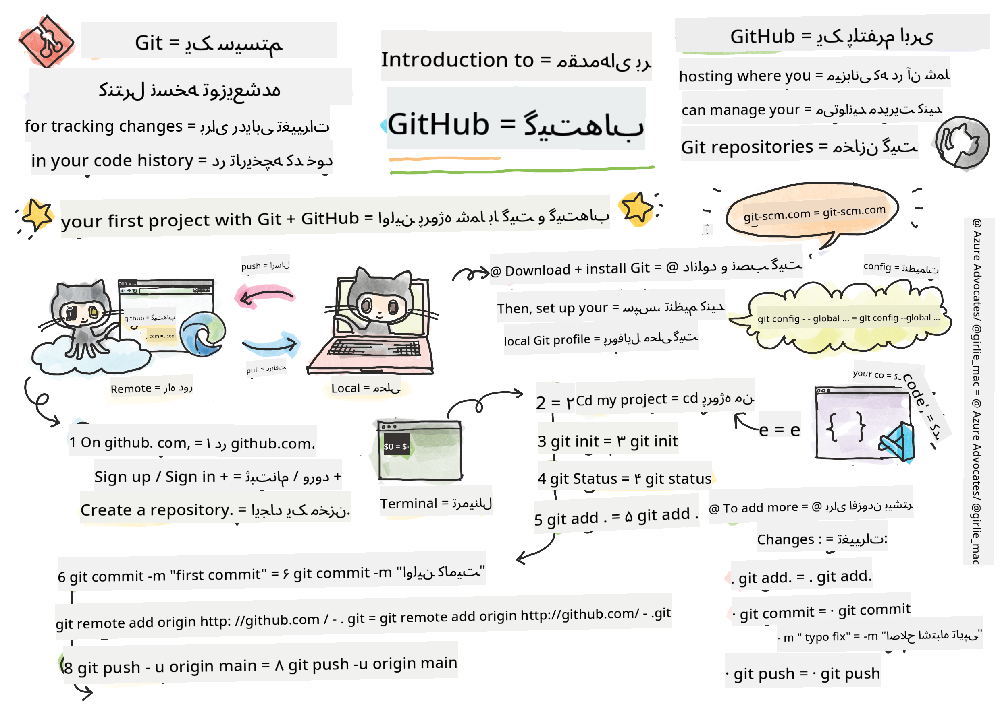
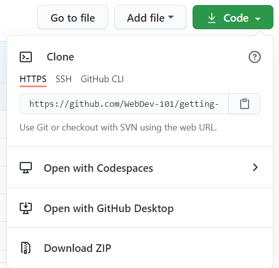

<!--
CO_OP_TRANSLATOR_METADATA:
{
  "original_hash": "361249da70432ddfd4741c917d1a6f50",
  "translation_date": "2025-08-29T14:38:49+00:00",
  "source_file": "1-getting-started-lessons/2-github-basics/README.md",
  "language_code": "fa"
}
-->
# مقدمه‌ای بر گیت‌هاب

این درس اصول اولیه گیت‌هاب، یک پلتفرم برای میزبانی و مدیریت تغییرات کد شما را پوشش می‌دهد.


> اسکیچ‌نوت از [Tomomi Imura](https://twitter.com/girlie_mac)

## آزمون پیش از درس
[آزمون پیش از درس](https://ff-quizzes.netlify.app)

## مقدمه

در این درس، به موارد زیر خواهیم پرداخت:

- پیگیری کارهایی که روی دستگاه خود انجام می‌دهید
- کار روی پروژه‌ها به صورت گروهی
- نحوه مشارکت در نرم‌افزارهای متن‌باز

### پیش‌نیازها

قبل از شروع، باید بررسی کنید که آیا Git روی سیستم شما نصب شده است یا خیر. در ترمینال تایپ کنید:  
`git --version`

اگر Git نصب نشده است، [Git را دانلود کنید](https://git-scm.com/downloads). سپس پروفایل محلی Git خود را در ترمینال تنظیم کنید:
* `git config --global user.name "your-name"`
* `git config --global user.email "your-email"`

برای بررسی اینکه آیا Git قبلاً تنظیم شده است یا خیر، می‌توانید تایپ کنید:
`git config --list`

همچنین به یک حساب کاربری گیت‌هاب، یک ویرایشگر کد (مانند Visual Studio Code) و باز کردن ترمینال (یا: Command Prompt) نیاز دارید.

به [github.com](https://github.com/) بروید و اگر هنوز حساب کاربری ندارید، یک حساب ایجاد کنید یا وارد شوید و پروفایل خود را تکمیل کنید.

✅ گیت‌هاب تنها مخزن کد در جهان نیست؛ مخازن دیگری نیز وجود دارند، اما گیت‌هاب شناخته‌شده‌ترین است.

### آماده‌سازی

به یک پوشه حاوی یک پروژه کد روی دستگاه محلی خود (لپ‌تاپ یا کامپیوتر شخصی) و یک مخزن عمومی در گیت‌هاب نیاز دارید که به عنوان نمونه‌ای برای نحوه مشارکت در پروژه‌های دیگران عمل کند.

---

## مدیریت کد

فرض کنید یک پوشه محلی با یک پروژه کد دارید و می‌خواهید پیشرفت خود را با استفاده از Git - سیستم کنترل نسخه - پیگیری کنید. برخی افراد استفاده از Git را به نوشتن یک نامه عاشقانه برای خود آینده‌تان تشبیه می‌کنند. با خواندن پیام‌های کامیت خود پس از روزها، هفته‌ها یا ماه‌ها، می‌توانید به یاد بیاورید که چرا تصمیمی گرفته‌اید یا یک تغییر را "بازگردانید" - البته اگر پیام‌های کامیت خوبی بنویسید.

### وظیفه: ایجاد یک مخزن و کامیت کردن کد  

> ویدیو را بررسی کنید  
> 
> [](https://www.youtube.com/watch?v=9R31OUPpxU4)

1. **ایجاد مخزن در گیت‌هاب**. در GitHub.com، در تب مخازن یا از نوار ناوبری بالا-راست، دکمه **مخزن جدید** را پیدا کنید.

   1. به مخزن خود (پوشه) یک نام بدهید.
   1. گزینه **ایجاد مخزن** را انتخاب کنید.

1. **به پوشه کاری خود بروید**. در ترمینال، به پوشه‌ای که می‌خواهید شروع به پیگیری آن کنید بروید. تایپ کنید:

   ```bash
   cd [name of your folder]
   ```

1. **یک مخزن Git را مقداردهی اولیه کنید**. در پروژه خود تایپ کنید:

   ```bash
   git init
   ```

1. **وضعیت را بررسی کنید**. برای بررسی وضعیت مخزن خود تایپ کنید:

   ```bash
   git status
   ```

   خروجی ممکن است چیزی شبیه به این باشد:

   ```output
   Changes not staged for commit:
   (use "git add <file>..." to update what will be committed)
   (use "git checkout -- <file>..." to discard changes in working directory)

        modified:   file.txt
        modified:   file2.txt
   ```

   معمولاً دستور `git status` به شما می‌گوید که چه فایل‌هایی آماده _ذخیره‌سازی_ در مخزن هستند یا تغییراتی روی آن‌ها اعمال شده که ممکن است بخواهید آن‌ها را ثبت کنید.

1. **اضافه کردن تمام فایل‌ها برای پیگیری**  
   این کار همچنین به عنوان مرحله‌بندی فایل‌ها/اضافه کردن فایل‌ها به ناحیه مرحله‌بندی شناخته می‌شود.

   ```bash
   git add .
   ```

   دستور `git add` به همراه آرگومان `.` نشان می‌دهد که تمام فایل‌ها و تغییرات برای پیگیری اضافه شوند.

1. **اضافه کردن فایل‌های انتخابی برای پیگیری**

   ```bash
   git add [file or folder name]
   ```

   این دستور به ما کمک می‌کند فقط فایل‌های انتخابی را به ناحیه مرحله‌بندی اضافه کنیم، زمانی که نمی‌خواهیم همه فایل‌ها را به یکباره کامیت کنیم.

1. **خارج کردن تمام فایل‌ها از مرحله‌بندی**

   ```bash
   git reset
   ```

   این دستور به ما کمک می‌کند تمام فایل‌ها را به یکباره از مرحله‌بندی خارج کنیم.

1. **خارج کردن یک فایل خاص از مرحله‌بندی**

   ```bash
   git reset [file or folder name]
   ```

   این دستور به ما کمک می‌کند فقط یک فایل خاص را به یکباره از مرحله‌بندی خارج کنیم که نمی‌خواهیم در کامیت بعدی شامل شود.

1. **ثبت کار خود**. در این مرحله فایل‌ها را به اصطلاح به _ناحیه مرحله‌بندی_ اضافه کرده‌اید. جایی که Git فایل‌های شما را پیگیری می‌کند. برای دائمی کردن تغییرات، باید فایل‌ها را _کامیت_ کنید. برای این کار یک _کامیت_ با دستور `git commit` ایجاد کنید. یک _کامیت_ نشان‌دهنده یک نقطه ذخیره در تاریخچه مخزن شما است. برای ایجاد یک _کامیت_ تایپ کنید:

   ```bash
   git commit -m "first commit"
   ```

   این دستور تمام فایل‌های شما را کامیت می‌کند و پیام "اولین کامیت" را اضافه می‌کند. برای پیام‌های کامیت آینده، بهتر است توضیحات دقیق‌تری ارائه دهید تا نوع تغییری که ایجاد کرده‌اید را منتقل کنید.

1. **اتصال مخزن محلی Git به گیت‌هاب**. یک مخزن Git روی دستگاه شما خوب است، اما در نهایت می‌خواهید یک نسخه پشتیبان از فایل‌های خود در جایی داشته باشید و همچنین دیگران را دعوت کنید تا با شما روی مخزن کار کنند. یکی از بهترین مکان‌ها برای این کار گیت‌هاب است. به یاد داشته باشید که قبلاً یک مخزن در گیت‌هاب ایجاد کرده‌ایم، بنابراین تنها کاری که باید انجام دهیم اتصال مخزن محلی Git به گیت‌هاب است. دستور `git remote add` این کار را انجام می‌دهد. دستور زیر را تایپ کنید:

   > توجه داشته باشید، قبل از تایپ دستور به صفحه مخزن گیت‌هاب خود بروید تا URL مخزن را پیدا کنید. از آن در دستور زیر استفاده کنید. ```https://github.com/username/repository_name.git``` را با URL گیت‌هاب خود جایگزین کنید.

   ```bash
   git remote add origin https://github.com/username/repository_name.git
   ```

   این دستور یک _remote_ یا اتصال به نام "origin" ایجاد می‌کند که به مخزن گیت‌هاب که قبلاً ایجاد کرده‌اید اشاره می‌کند.

1. **ارسال فایل‌های محلی به گیت‌هاب**. تا اینجا یک _اتصال_ بین مخزن محلی و مخزن گیت‌هاب ایجاد کرده‌اید. حالا این فایل‌ها را با دستور `git push` به گیت‌هاب ارسال کنید، به این صورت:

   > توجه داشته باشید، نام شاخه شما ممکن است به طور پیش‌فرض با ```main``` متفاوت باشد.

   ```bash
   git push -u origin main
   ```

   این دستور کامیت‌های شما را در شاخه "main" به گیت‌هاب ارسال می‌کند.

2. **اضافه کردن تغییرات بیشتر**. اگر می‌خواهید به ایجاد تغییرات و ارسال آن‌ها به گیت‌هاب ادامه دهید، فقط باید از سه دستور زیر استفاده کنید:

   ```bash
   git add .
   git commit -m "type your commit message here"
   git push
   ```

   > نکته: ممکن است بخواهید از یک فایل `.gitignore` استفاده کنید تا فایل‌هایی که نمی‌خواهید پیگیری شوند در گیت‌هاب ظاهر نشوند - مانند فایل یادداشتی که در همان پوشه ذخیره می‌کنید اما جایی در یک مخزن عمومی ندارد. می‌توانید قالب‌های فایل `.gitignore` را در [.gitignore templates](https://github.com/github/gitignore) پیدا کنید.

#### پیام‌های کامیت

یک خط موضوعی عالی برای کامیت Git جمله زیر را کامل می‌کند:  
اگر اعمال شود، این کامیت <خط موضوعی شما اینجا> را انجام خواهد داد.

برای موضوع از زمان حال و حالت امری استفاده کنید: "تغییر" نه "تغییر داده شد" و نه "تغییرات".  
همانطور که در موضوع، در بدنه (اختیاری) نیز از زمان حال و حالت امری استفاده کنید. بدنه باید انگیزه تغییر را شامل شود و این را با رفتار قبلی مقایسه کند. شما در حال توضیح دادن `چرا` هستید، نه `چگونه`.

✅ چند دقیقه وقت بگذارید و در گیت‌هاب جستجو کنید. آیا می‌توانید یک پیام کامیت واقعاً عالی پیدا کنید؟ آیا می‌توانید یک پیام کامیت بسیار مختصر پیدا کنید؟ به نظر شما چه اطلاعاتی مهم‌ترین و مفیدترین برای انتقال در یک پیام کامیت است؟

### وظیفه: همکاری

دلیل اصلی قرار دادن چیزها در گیت‌هاب این بود که امکان همکاری با دیگر توسعه‌دهندگان فراهم شود.

## کار روی پروژه‌ها با دیگران

> ویدیو را بررسی کنید  
>
> [](https://www.youtube.com/watch?v=bFCM-PC3cu8)

در مخزن خود، به `Insights > Community` بروید تا ببینید پروژه شما چگونه با استانداردهای پیشنهادی جامعه مقایسه می‌شود.

   در اینجا چند مورد وجود دارد که می‌تواند مخزن گیت‌هاب شما را بهبود بخشد:
   - **توضیحات**. آیا توضیحی برای پروژه خود اضافه کرده‌اید؟
   - **README**. آیا یک README اضافه کرده‌اید؟ گیت‌هاب راهنمایی‌هایی برای نوشتن یک [README](https://docs.github.com/articles/about-readmes/?WT.mc_id=academic-77807-sagibbon) ارائه می‌دهد.
   - **راهنمای مشارکت**. آیا پروژه شما دارای [راهنمای مشارکت](https://docs.github.com/articles/setting-guidelines-for-repository-contributors/?WT.mc_id=academic-77807-sagibbon) است؟
   - **کد اخلاقی**. آیا یک [کد اخلاقی](https://docs.github.com/articles/adding-a-code-of-conduct-to-your-project/) اضافه کرده‌اید؟
   - **مجوز**. شاید مهم‌تر از همه، آیا یک [مجوز](https://docs.github.com/articles/adding-a-license-to-a-repository/) اضافه کرده‌اید؟

تمام این منابع به جذب اعضای جدید تیم کمک خواهند کرد. و این‌ها معمولاً چیزهایی هستند که مشارکت‌کنندگان جدید قبل از حتی نگاه کردن به کد شما بررسی می‌کنند تا بفهمند آیا پروژه شما جای مناسبی برای صرف وقت آن‌ها است یا خیر.

✅ فایل‌های README، اگرچه زمان‌بر هستند، اغلب توسط نگهدارندگان پرمشغله نادیده گرفته می‌شوند. آیا می‌توانید مثالی از یک README به خصوص توصیفی پیدا کنید؟ توجه: ابزارهایی برای کمک به ایجاد README‌های خوب وجود دارند که ممکن است بخواهید امتحان کنید، مانند [ابزارهای ایجاد README](https://www.makeareadme.com/).

### وظیفه: ادغام کد

مستندات مشارکت به افراد کمک می‌کند تا در پروژه مشارکت کنند. این مستندات توضیح می‌دهد که چه نوع مشارکت‌هایی مورد نظر است و فرآیند چگونه کار می‌کند. مشارکت‌کنندگان باید مراحل مختلفی را برای مشارکت در مخزن شما در گیت‌هاب طی کنند:

1. **فورک کردن مخزن شما**. احتمالاً می‌خواهید افراد پروژه شما را _فورک_ کنند. فورک کردن به معنای ایجاد یک نسخه کپی از مخزن شما در پروفایل گیت‌هاب آن‌ها است.
1. **کلون کردن**. از آنجا، آن‌ها پروژه را به دستگاه محلی خود کلون می‌کنند.
1. **ایجاد یک شاخه**. شما می‌خواهید از آن‌ها بخواهید یک _شاخه_ برای کار خود ایجاد کنند.
1. **تمرکز تغییرات روی یک بخش**. از مشارکت‌کنندگان بخواهید تغییرات خود را روی یک چیز در یک زمان متمرکز کنند - به این ترتیب احتمال اینکه بتوانید کار آن‌ها را _ادغام_ کنید بیشتر است. تصور کنید آن‌ها یک باگ را رفع کنند، یک ویژگی جدید اضافه کنند و چندین تست را به‌روزرسانی کنند - اگر بخواهید یا بتوانید فقط ۲ از ۳ یا ۱ از ۳ تغییر را اعمال کنید چه؟

✅ یک موقعیت را تصور کنید که در آن شاخه‌ها برای نوشتن و ارائه کد خوب به خصوص حیاتی هستند. چه موارد استفاده‌ای می‌توانید تصور کنید؟

> توجه: تغییری باشید که می‌خواهید در جهان ببینید و برای کار خود نیز شاخه ایجاد کنید. هر کامیتی که انجام دهید در شاخه‌ای که در حال حاضر "چک‌اوت" شده‌اید انجام خواهد شد. از `git status` استفاده کنید تا ببینید در کدام شاخه هستید.

بیایید یک جریان کاری مشارکت‌کننده را مرور کنیم. فرض کنید مشارکت‌کننده قبلاً مخزن را _فورک_ و _کلون_ کرده است، بنابراین یک مخزن Git آماده برای کار روی دستگاه محلی خود دارد:

1. **ایجاد یک شاخه**. از دستور `git branch` برای ایجاد یک شاخه که شامل تغییراتی است که قصد دارند مشارکت کنند استفاده کنید:

   ```bash
   git branch [branch-name]
   ```

1. **تغییر به شاخه کاری**. به شاخه مشخص‌شده تغییر دهید و دایرکتوری کاری را با `git switch` به‌روزرسانی کنید:

   ```bash
   git switch [branch-name]
   ```

1. **انجام کار**. در این مرحله می‌خواهید تغییرات خود را اضافه کنید. فراموش نکنید که با دستورات زیر به Git اطلاع دهید:

   ```bash
   git add .
   git commit -m "my changes"
   ```

   اطمینان حاصل کنید که به کامیت خود یک نام خوب بدهید، برای خودتان و همچنین نگهدارنده مخزنی که در آن کمک می‌کنید.

1. **ترکیب کار خود با شاخه `main`**. در یک نقطه، کار شما تمام شده و می‌خواهید کار خود را با شاخه `main` ترکیب کنید. ممکن است شاخه `main` در این بین تغییر کرده باشد، بنابراین مطمئن شوید که ابتدا آن را با دستورات زیر به‌روزرسانی کنید:

   ```bash
   git switch main
   git pull
   ```

   در این مرحله می‌خواهید مطمئن شوید که هرگونه _تعارض_، موقعیت‌هایی که Git نمی‌تواند به راحتی تغییرات را _ترکیب_ کند، در شاخه کاری شما اتفاق می‌افتد. بنابراین دستورات زیر را اجرا کنید:

   ```bash
   git switch [branch_name]
   git merge main
   ```

   این دستور تمام تغییرات از `main` را به شاخه شما می‌آورد و امیدواریم بتوانید به کار خود ادامه دهید. اگر نه، VS Code به شما می‌گوید که Git کجا _گیج_ شده است و شما فقط فایل‌های مربوطه را تغییر می‌دهید تا بگویید کدام محتوا دقیق‌تر است.

1. **ارسال کار خود به گیت‌هاب**. ارسال کار خود به گیت‌هاب به دو چیز نیاز دارد. ارسال شاخه خود به مخزن و سپس باز کردن یک PR، درخواست کشیدن.

   ```bash
   git push --set-upstream origin [branch-name]
   ```

   دستور بالا شاخه را در مخزن فورک‌شده شما ایجاد می‌کند.

1. **باز کردن یک PR**. سپس، می‌خواهید یک PR باز کنید. این کار را با رفتن به مخزن فورک‌شده در گیت‌هاب انجام دهید. در گیت‌هاب یک اعلان خواهید دید که از شما می‌پرسد آیا می‌خواهید یک PR جدید ایجاد کنید، روی آن کلیک کنید و به رابطی هدایت می‌شوید که می‌توانید عنوان پیام کامیت را تغییر دهید و توضیحات مناسب‌تری بدهید. اکنون نگهدارنده مخزنی که فورک کرده‌اید این PR را می‌بیند و _انگشتان را ضربدری کنید_ از آن قدردانی کرده و PR شما را _ادغام_ می‌کند. اکنون شما یک مشارکت‌کننده هستید، تبریک :)

1. **پاک‌سازی**. پاک‌سازی پس از موفقیت در ادغام یک PR به عنوان یک عمل خوب در نظر گرفته می‌شود. می‌خواهید هم شاخه محلی و هم شاخه‌ای که به گیت‌هاب ارسال کرده‌اید را پاک کنید. ابتدا اجازه دهید آن را به صورت محلی با دستور زیر حذف کنیم:

   ```bash
   git branch -d [branch-name]
   ```

   اطمینان حاصل کنید که به صفحه گیت‌هاب برای مخزن فورک‌شده بروید و شاخه ریموتی که به آن ارسال کرده‌اید را حذف کنید.
اصطلاح «Pull request» ممکن است کمی عجیب به نظر برسد، چون در واقع شما می‌خواهید تغییرات خود را به پروژه ارسال کنید. اما مالک پروژه یا تیم اصلی باید تغییرات شما را قبل از ادغام با شاخه اصلی پروژه بررسی کند، بنابراین در واقع شما درخواست تصمیم‌گیری در مورد تغییرات خود را از یک نگهدارنده پروژه دارید.

یک Pull request جایی است که می‌توانید تفاوت‌های ایجاد شده در یک شاخه را با استفاده از بررسی‌ها، نظرات، تست‌های یکپارچه و موارد دیگر مقایسه و درباره آن‌ها بحث کنید. یک Pull request خوب تقریباً از همان قوانینی پیروی می‌کند که برای پیام‌های commit وجود دارد. شما می‌توانید به یک issue در ردیاب مشکلات ارجاع دهید، مثلاً وقتی کار شما یک مشکل را حل می‌کند. این کار با استفاده از `#` و شماره issue انجام می‌شود. برای مثال: `#97`.

🤞 امیدواریم که همه بررسی‌ها موفقیت‌آمیز باشند و مالک(های) پروژه تغییرات شما را در پروژه ادغام کنند 🤞

شاخه کاری محلی خود را با تمام commitهای جدید از شاخه متناظر در GitHub به‌روزرسانی کنید:

`git pull`

## چگونه به پروژه‌های متن‌باز کمک کنیم

ابتدا، یک مخزن (یا **repo**) در GitHub پیدا کنید که برای شما جالب باشد و بخواهید تغییری در آن ایجاد کنید. شما باید محتوای آن را به دستگاه خود کپی کنید.

✅ یک روش خوب برای پیدا کردن مخازن مناسب برای مبتدیان این است که [با برچسب 'good-first-issue' جستجو کنید](https://github.blog/2020-01-22-browse-good-first-issues-to-start-contributing-to-open-source/).



روش‌های مختلفی برای کپی کردن کد وجود دارد. یکی از روش‌ها "کلون کردن" محتوای مخزن با استفاده از HTTPS، SSH یا GitHub CLI (رابط خط فرمان GitHub) است.

ترمینال خود را باز کنید و مخزن را به این صورت کلون کنید:
`git clone https://github.com/ProjectURL`

برای کار روی پروژه، به پوشه مناسب بروید:
`cd ProjectURL`

همچنین می‌توانید کل پروژه را با استفاده از [Codespaces](https://github.com/features/codespaces)، ویرایشگر کد داخلی GitHub / محیط توسعه ابری، یا [GitHub Desktop](https://desktop.github.com/) باز کنید.

در نهایت، می‌توانید کد را در یک پوشه فشرده دانلود کنید.

### چند نکته جالب دیگر درباره GitHub

شما می‌توانید هر مخزن عمومی در GitHub را ستاره‌دار کنید، دنبال کنید یا "fork" کنید. مخازن ستاره‌دار خود را می‌توانید در منوی کشویی بالا سمت راست پیدا کنید. این کار شبیه به نشانک‌گذاری است، اما برای کد.

پروژه‌ها معمولاً یک ردیاب مشکلات دارند، که بیشتر در تب "Issues" در GitHub قرار دارد مگر اینکه به شکل دیگری مشخص شده باشد، جایی که افراد درباره مشکلات مربوط به پروژه بحث می‌کنند. تب Pull Requests جایی است که افراد درباره تغییرات در حال انجام بحث و بررسی می‌کنند.

پروژه‌ها ممکن است بحث‌هایی در انجمن‌ها، لیست‌های ایمیل یا کانال‌های چت مانند Slack، Discord یا IRC داشته باشند.

✅ نگاهی به مخزن جدید GitHub خود بیندازید و چند کار انجام دهید، مثل ویرایش تنظیمات، افزودن اطلاعات به مخزن خود، و ایجاد یک پروژه (مثل یک تخته Kanban). کارهای زیادی می‌توانید انجام دهید!

---

## 🚀 چالش

با یک دوست همکاری کنید و روی کد یکدیگر کار کنید. یک پروژه به صورت مشترک ایجاد کنید، کد را fork کنید، شاخه ایجاد کنید و تغییرات را ادغام کنید.

## آزمون پس از درس
[آزمون پس از درس](https://ff-quizzes.netlify.app/web/en/)

## مرور و مطالعه شخصی

بیشتر درباره [کمک به نرم‌افزارهای متن‌باز](https://opensource.guide/how-to-contribute/#how-to-submit-a-contribution) بخوانید.

[برگه تقلب Git](https://training.github.com/downloads/github-git-cheat-sheet/).

تمرین، تمرین، تمرین. GitHub مسیرهای یادگیری عالی‌ای از طریق [skills.github.com](https://skills.github.com) ارائه می‌دهد:

- [هفته اول در GitHub](https://skills.github.com/#first-week-on-github)

همچنین دوره‌های پیشرفته‌تری نیز پیدا خواهید کرد.

## تکلیف

دوره [هفته اول در GitHub](https://skills.github.com/#first-week-on-github) را کامل کنید.

---

**سلب مسئولیت**:  
این سند با استفاده از سرویس ترجمه هوش مصنوعی [Co-op Translator](https://github.com/Azure/co-op-translator) ترجمه شده است. در حالی که ما برای دقت تلاش می‌کنیم، لطفاً توجه داشته باشید که ترجمه‌های خودکار ممکن است شامل خطاها یا نادرستی‌هایی باشند. سند اصلی به زبان اصلی آن باید به عنوان منبع معتبر در نظر گرفته شود. برای اطلاعات حساس، ترجمه حرفه‌ای انسانی توصیه می‌شود. ما هیچ مسئولیتی در قبال سوءتفاهم‌ها یا تفسیرهای نادرست ناشی از استفاده از این ترجمه نداریم.